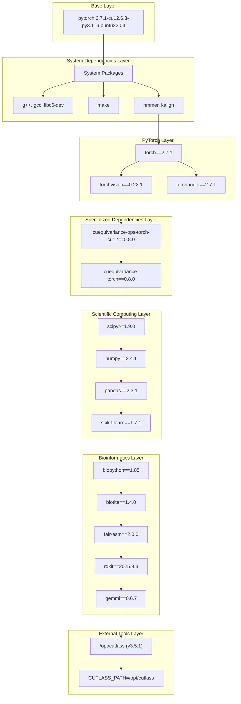
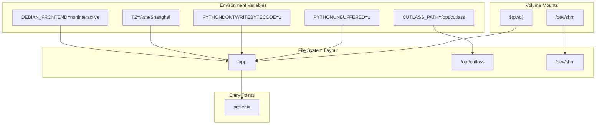
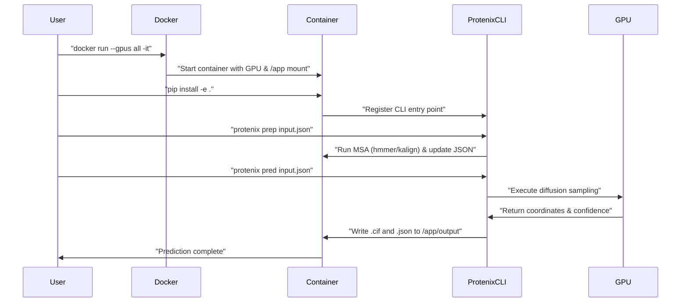

# Docker Deployment

> **Relevant source files**
> * [Dockerfile](https://github.com/bytedance/Protenix/blob/c3bfc365/Dockerfile)
> * [docs/docker_installation.md](https://github.com/bytedance/Protenix/blob/c3bfc365/docs/docker_installation.md?plain=1)
> * [docs/infer_json_format.md](https://github.com/bytedance/Protenix/blob/c3bfc365/docs/infer_json_format.md?plain=1)
> * [requirements.txt](https://github.com/bytedance/Protenix/blob/c3bfc365/requirements.txt)

This document provides comprehensive guidance for deploying Protenix using Docker containers. It covers building Docker images from the provided `Dockerfile`, configuring GPU support, managing volume mounts, and running inference workloads in containerized environments.

## Docker Image Architecture

The Protenix Docker image is built using a multi-layered approach that optimizes for both build efficiency and runtime performance. The base image includes PyTorch 2.7.1 and CUDA 12.6.3 support, with additional layers for system dependencies, Python packages, and specialized components like CUTLASS.

### Image Component Hierarchy



**Sources:** [Dockerfile L1-L33](https://github.com/bytedance/Protenix/blob/c3bfc365/Dockerfile#L1-L33)

 [requirements.txt L1-L33](https://github.com/bytedance/Protenix/blob/c3bfc365/requirements.txt#L1-L33)

## Container Runtime Environment

The Docker container establishes a complete runtime environment with optimized Python settings, timezone configuration, and essential paths for the Protenix system components.

### Environment and Volume Mapping



**Sources:** [Dockerfile L3-L8](https://github.com/bytedance/Protenix/blob/c3bfc365/Dockerfile#L3-L8)

 [Dockerfile L25](https://github.com/bytedance/Protenix/blob/c3bfc365/Dockerfile#L25-L25)

 [docs/docker_installation.md L27-L32](https://github.com/bytedance/Protenix/blob/c3bfc365/docs/docker_installation.md?plain=1#L27-L32)

## Building and Pulling the Image

The Docker image can be built from the provided `Dockerfile` or pulled from the official registry.

### Building from Source

The `Dockerfile` uses a pre-configured PyTorch image and installs necessary system tools like `hmmer` and `kalign` for MSA generation.

```
docker build -t protenix:local .
```

### Using Pre-built Image

The recommended approach for quick deployment:

```
docker pull ai4s-share-public-cn-beijing.cr.volces.com/release/protenix:1.0.0.4
```

### Dependency Installation Phases

The `Dockerfile` installs dependencies in a specific order to leverage layer caching:

| Phase | Components | Purpose |
| --- | --- | --- |
| **System** | `g++`, `gcc`, `libc6-dev`, `make`, `postgresql`, `hmmer`, `kalign` | Compilation tools and bioinformatics search utilities |
| **Python** | `requirements.txt` | Core libraries including `torch`, `cuequivariance`, and `rdkit` |
| **Specialized** | `CUTLASS v3.5.1` | Cloned to `/opt/cutlass` for optimized GPU kernel support |

**Sources:** [Dockerfile L11-L22](https://github.com/bytedance/Protenix/blob/c3bfc365/Dockerfile#L11-L22)

 [Dockerfile L29-L33](https://github.com/bytedance/Protenix/blob/c3bfc365/Dockerfile#L29-L33)

 [docs/docker_installation.md L13-L17](https://github.com/bytedance/Protenix/blob/c3bfc365/docs/docker_installation.md?plain=1#L13-L17)

## Running the Container

Container execution requires proper GPU configuration and volume mounts to ensure Protenix can access input JSON data and write structural outputs.

### Basic Container Execution

Run the container with all GPUs enabled and the current Protenix directory mounted:

```
docker run --gpus all -it \    -v "$(pwd)":/app \    -v /dev/shm:/dev/shm \    ai4s-share-public-cn-beijing.cr.volces.com/release/protenix:1.0.0.4 \    /bin/bash
```

### GPU Configuration Requirements

1. **NVIDIA Container Toolkit**: Must be installed on the host to enable `--gpus all`.
2. **CUDA Compatibility**: The base image uses CUDA 12.6.3. Ensure host drivers are compatible.
3. **Verification**: Run `nvidia-smi` inside the container to verify visibility.

**Sources:** [docs/docker_installation.md L5-L11](https://github.com/bytedance/Protenix/blob/c3bfc365/docs/docker_installation.md?plain=1#L5-L11)

 [docs/docker_installation.md L27-L33](https://github.com/bytedance/Protenix/blob/c3bfc365/docs/docker_installation.md?plain=1#L27-L33)

## Protenix Installation in Container

Since the Docker image does not include the Protenix source code by default, it must be installed in editable mode after mounting the repository.

### Installation Process

Once inside the container:

```
cd /apppip install -e .
```

This setup:

* Installs the `protenix` command line tool.
* Links the local source code to the environment.
* Allows immediate verification via `protenix --help`.

**Sources:** [docs/docker_installation.md L35-L43](https://github.com/bytedance/Protenix/blob/c3bfc365/docs/docker_installation.md?plain=1#L35-L43)

## Container Workflow

The typical workflow for using Protenix in a Docker container follows a sequence from initialization to inference.



**Sources:** [docs/docker_installation.md L27-L43](https://github.com/bytedance/Protenix/blob/c3bfc365/docs/docker_installation.md?plain=1#L27-L43)

 [docs/infer_json_format.md L143-L147](https://github.com/bytedance/Protenix/blob/c3bfc365/docs/infer_json_format.md?plain=1#L143-L147)

## Troubleshooting

### Shared Memory (/dev/shm)

Protenix and its underlying libraries (like PyTorch and certain bioinformatics tools) may require significant shared memory for multi-processing. Always use `-v /dev/shm:/dev/shm` or `--shm-size` to prevent "Bus error" or "No space left on device" errors during MSA generation or data loading.

### Pathing and Absolute Paths

When providing MSA paths in the input JSON (e.g., `pairedMsaPath`), it is highly recommended to use **absolute paths** relative to the container's file system (e.g., starting with `/app/`).

**Sources:** [docs/docker_installation.md L29-L30](https://github.com/bytedance/Protenix/blob/c3bfc365/docs/docker_installation.md?plain=1#L29-L30)

 [docs/infer_json_format.md L66-L68](https://github.com/bytedance/Protenix/blob/c3bfc365/docs/infer_json_format.md?plain=1#L66-L68)