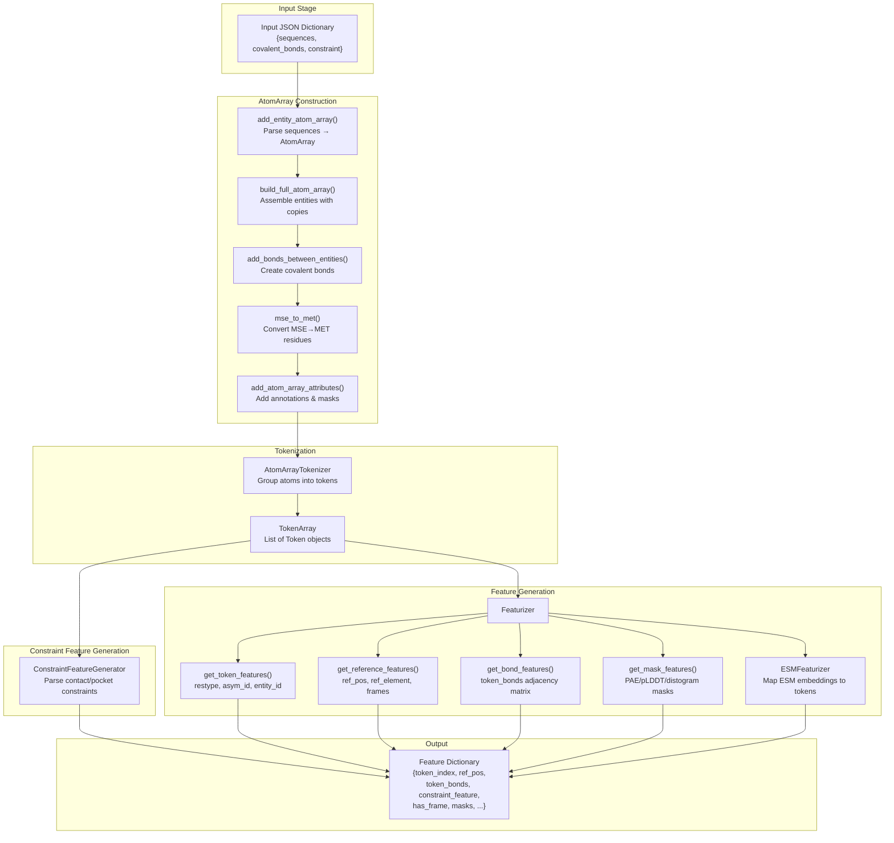
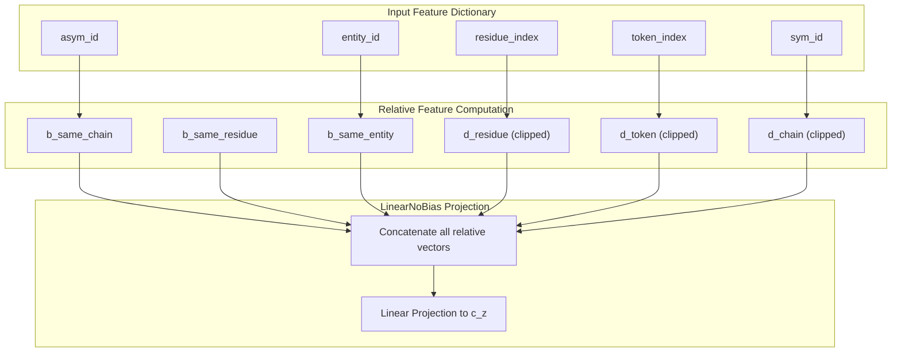

# Feature Generation

> **Relevant source files**
> * [protenix/data/core/ccd.py](https://github.com/bytedance/Protenix/blob/c3bfc365/protenix/data/core/ccd.py)
> * [protenix/data/core/featurizer.py](https://github.com/bytedance/Protenix/blob/c3bfc365/protenix/data/core/featurizer.py)
> * [protenix/data/esm/esm_featurizer.py](https://github.com/bytedance/Protenix/blob/c3bfc365/protenix/data/esm/esm_featurizer.py)
> * [protenix/model/modules/embedders.py](https://github.com/bytedance/Protenix/blob/c3bfc365/protenix/model/modules/embedders.py)

## Purpose and Scope

This document describes how Protenix transforms molecular structure data into numerical feature tensors that serve as input to the neural network. The feature generation process bridges the gap between parsed molecular structures (AtomArray and TokenArray objects) and the dense tensors required by the model.

For information about how input JSON files are structured and parsed into AtomArray objects, see [Structure Parsing and Conversion](/bytedance/Protenix/4.2-structure-parsing-and-conversion). For information about how features flow through the training data pipeline, see [Training Data Pipeline](/bytedance/Protenix/4.4-training-data-pipeline).

## Overview

Feature generation in Protenix is a multi-stage process that converts molecular structures into a comprehensive set of numerical representations. The primary classes responsible for this transformation are:

* **`SampleDictToFeatures`**: Orchestrates the entire feature generation pipeline from input JSON to complete feature dictionaries [protenix/data/json_to_feature.py L32-L340](https://github.com/bytedance/Protenix/blob/c3bfc365/protenix/data/json_to_feature.py#L32-L340)
* **`Featurizer`**: Generates specific feature categories (token features, reference features, bond features, etc.) [protenix/data/core/featurizer.py L29-L843](https://github.com/bytedance/Protenix/blob/c3bfc365/protenix/data/core/featurizer.py#L29-L843)
* **`InputFeatureEmbedder`**: A neural network module that embeds the generated features into the initial token representation [protenix/model/modules/embedders.py L28-L121](https://github.com/bytedance/Protenix/blob/c3bfc365/protenix/model/modules/embedders.py#L28-L121)
* **`ESMFeaturizer`**: Specifically handles the extraction and mapping of ESM (Evolutionary Scale Modeling) embeddings for protein entities [protenix/data/esm/esm_featurizer.py L27-L134](https://github.com/bytedance/Protenix/blob/c3bfc365/protenix/data/esm/esm_featurizer.py#L27-L134)

The output is a dictionary of PyTorch tensors that encode molecular information at both token-level (residues/ligands) and atom-level granularity, along with structural constraints and spatial relationships.

**Sources**: [protenix/data/json_to_feature.py L32-L340](https://github.com/bytedance/Protenix/blob/c3bfc365/protenix/data/json_to_feature.py#L32-L340)

 [protenix/data/core/featurizer.py L29-L843](https://github.com/bytedance/Protenix/blob/c3bfc365/protenix/data/core/featurizer.py#L29-L843)

 [protenix/model/modules/embedders.py L28-L121](https://github.com/bytedance/Protenix/blob/c3bfc365/protenix/model/modules/embedders.py#L28-L121)

 [protenix/data/esm/esm_featurizer.py L27-L134](https://github.com/bytedance/Protenix/blob/c3bfc365/protenix/data/esm/esm_featurizer.py#L27-L134)

## Feature Generation Pipeline



**Feature Generation Pipeline**: This diagram shows the complete transformation from input JSON to the final feature dictionary. The process flows through AtomArray construction, tokenization, constraint processing, and feature generation stages.

**Sources**: [protenix/data/json_to_feature.py L32-L340](https://github.com/bytedance/Protenix/blob/c3bfc365/protenix/data/json_to_feature.py#L32-L340)

 [protenix/data/core/featurizer.py L30-L702](https://github.com/bytedance/Protenix/blob/c3bfc365/protenix/data/core/featurizer.py#L30-L702)

 [protenix/data/esm/esm_featurizer.py L77-L134](https://github.com/bytedance/Protenix/blob/c3bfc365/protenix/data/esm/esm_featurizer.py#L77-L134)

## SampleDictToFeatures Class

The `SampleDictToFeatures` class [protenix/data/json_to_feature.py L32-L340](https://github.com/bytedance/Protenix/blob/c3bfc365/protenix/data/json_to_feature.py#L32-L340)

 is the entry point for feature generation. It takes a single sample dictionary (one element from the input JSON list) and produces a complete feature dictionary, AtomArray, and TokenArray.

### Key Methods

| Method | Purpose | Returns |
| --- | --- | --- |
| `__init__(single_sample_dict)` | Initializes with input JSON and calls `add_entity_atom_array()` | None |
| `get_entity_poly_type()` | Maps entity types to polymer types for CIF format | `dict[str, str]` |
| `build_full_atom_array()` | Assembles complete AtomArray from all entities and copies | `AtomArray` |
| `add_bonds_between_entities()` | Creates inter-entity covalent bonds from JSON specification | `AtomArray` |
| `mse_to_met()` | Converts MSE (selenomethionine) residues to MET | `AtomArray` |
| `add_atom_array_attributes()` | Adds annotations: mol_type, masks, frame info, IDs | `AtomArray` |
| `get_atom_array()` | Orchestrates full AtomArray construction pipeline | `AtomArray` |
| `get_feature_dict()` | Main entry point: returns features, AtomArray, TokenArray | `tuple[dict, AtomArray, TokenArray]` |

### AtomArray Construction

The AtomArray construction process [protenix/data/json_to_feature.py L75-L289](https://github.com/bytedance/Protenix/blob/c3bfc365/protenix/data/json_to_feature.py#L75-L289)

 involves several critical steps:

1. **Entity Assembly**: Each entity from the input JSON has an `atom_array` field. The method `build_full_atom_array()` creates copies according to the `count` field and assigns unique chain identifiers [protenix/data/json_to_feature.py L82-L118](https://github.com/bytedance/Protenix/blob/c3bfc365/protenix/data/json_to_feature.py#L82-L118)
2. **Covalent Bond Addition**: The `covalent_bonds` field from the input JSON specifies bonds between entities. Bonds are created between matching asymmetric chain pairs [protenix/data/json_to_feature.py L153-L227](https://github.com/bytedance/Protenix/blob/c3bfc365/protenix/data/json_to_feature.py#L153-L227)
3. **MSE Conversion**: Per AlphaFold 3 SI Chapter 2.1, selenomethionine (MSE) residues are converted to methionine (MET) by renaming SE atoms to SD [protenix/data/json_to_feature.py L259-L276](https://github.com/bytedance/Protenix/blob/c3bfc365/protenix/data/json_to_feature.py#L259-L276)
4. **Attribute Annotation**: Multiple annotations are added via `AddAtomArrayAnnot` methods, including molecular types, masks for different purposes, canonical residue names, and unique identifiers [protenix/data/json_to_feature.py L230-L256](https://github.com/bytedance/Protenix/blob/c3bfc365/protenix/data/json_to_feature.py#L230-L256)

**Sources**: [protenix/data/json_to_feature.py L32-L290](https://github.com/bytedance/Protenix/blob/c3bfc365/protenix/data/json_to_feature.py#L32-L290)

## Featurizer Class

The `Featurizer` class [protenix/data/core/featurizer.py L29-L843](https://github.com/bytedance/Protenix/blob/c3bfc365/protenix/data/core/featurizer.py#L29-L843)

 generates all model input features from a cropped TokenArray and AtomArray. It provides methods to create different feature categories required by the Protenix model.

### Initialization Parameters

```
Featurizer(    cropped_token_array: TokenArray,    cropped_atom_array: AtomArray,    ref_pos_augment: bool = True,    lig_atom_rename: bool = False,    include_discont_poly_poly_bonds: bool = False)
```

| Parameter | Type | Purpose |
| --- | --- | --- |
| `cropped_token_array` | `TokenArray` | Tokenized molecular structure (possibly after cropping) |
| `cropped_atom_array` | `AtomArray` | Biotite AtomArray (possibly after cropping) |
| `ref_pos_augment` | `bool` | Apply random rotation/translation to reference positions |
| `lig_atom_rename` | `bool` | Rename ligand atoms to prevent information leakage |
| `include_discont_poly_poly_bonds` | `bool` | Include discontinuous polymer-polymer bonds in bond features |

**Sources**: [protenix/data/core/featurizer.py L40-L53](https://github.com/bytedance/Protenix/blob/c3bfc365/protenix/data/core/featurizer.py#L40-L53)

## Feature Categories

### Token Features

Token features [protenix/data/core/featurizer.py L316-L345](https://github.com/bytedance/Protenix/blob/c3bfc365/protenix/data/core/featurizer.py#L316-L345)

 represent information at the token (residue/ligand) level. Each feature has shape `[N_token]` unless otherwise specified.

| Feature Name | Shape | Description | Reference |
| --- | --- | --- | --- |
| `token_index` | `[N_token]` | Sequential token indices (0 to N_token-1) | - |
| `residue_index` | `[N_token]` | Residue ID from structure file | - |
| `asym_id` | `[N_token]` | Asymmetric chain ID (integer) | - |
| `entity_id` | `[N_token]` | Entity ID (integer) | - |
| `sym_id` | `[N_token]` | Symmetry ID for symmetric chains | - |
| `restype` | `[N_token, 32]` | One-hot encoded residue type | AF3 SI Table 5 |

The `restype` feature uses one-hot encoding with 32 possible values: 20 standard amino acids + unknown, 4 RNA nucleotides + unknown, 4 DNA nucleotides + unknown, and gap [protenix/data/core/featurizer.py L89-L104](https://github.com/bytedance/Protenix/blob/c3bfc365/protenix/data/core/featurizer.py#L89-L104)

 Ligands are represented as "unknown amino acid" (UNK).

**Sources**: [protenix/data/core/featurizer.py L89-L104](https://github.com/bytedance/Protenix/blob/c3bfc365/protenix/data/core/featurizer.py#L89-L104)

 [protenix/data/core/featurizer.py L316-L345](https://github.com/bytedance/Protenix/blob/c3bfc365/protenix/data/core/featurizer.py#L316-L345)

### Reference Features

Reference features [protenix/data/core/featurizer.py L394-L450](https://github.com/bytedance/Protenix/blob/c3bfc365/protenix/data/core/featurizer.py#L394-L450)

 describe the reference conformer of each molecule. The reference conformer is a standardized 3D structure derived from the chemical component dictionary (CCD) [protenix/data/core/ccd.py L75-L121](https://github.com/bytedance/Protenix/blob/c3bfc365/protenix/data/core/ccd.py#L75-L121)

 for standard residues or from the input structure for ligands.

| Feature Name | Shape | Description | Reference |
| --- | --- | --- | --- |
| `ref_pos` | `[N_atom, 3]` | Reference conformer atom coordinates (Å) | AF3 SI Table 5 |
| `ref_mask` | `[N_atom]` | Mask indicating valid reference atoms | AF3 SI Table 5 |
| `ref_element` | `[N_atom, 128]` | One-hot encoded element (up to atomic number 128) | AF3 SI Table 5 |
| `ref_charge` | `[N_atom]` | Formal charge of each atom | AF3 SI Table 5 |
| `ref_atom_name_chars` | `[N_atom, 4, 64]` | Character-encoded atom names | AF3 SI Table 5 |
| `has_frame` | `[N_token]` | Whether token has a valid coordinate frame | AF3 SI 4.3.2 |
| `frame_atom_index` | `[N_token, 3]` | Atom indices for frame construction (a, b, c) | AF3 SI 4.3.2 |

**Reference Position Augmentation**: During training, reference positions are randomly rotated and translated per residue to prevent the model from overfitting to reference conformer orientations [protenix/data/core/featurizer.py L406-L413](https://github.com/bytedance/Protenix/blob/c3bfc365/protenix/data/core/featurizer.py#L406-L413)

**Sources**: [protenix/data/core/featurizer.py L394-L450](https://github.com/bytedance/Protenix/blob/c3bfc365/protenix/data/core/featurizer.py#L394-L450)

 [protenix/data/core/ccd.py L75-L121](https://github.com/bytedance/Protenix/blob/c3bfc365/protenix/data/core/ccd.py#L75-L121)

### Bond Features

Bond features [protenix/data/core/featurizer.py L452-L510](https://github.com/bytedance/Protenix/blob/c3bfc365/protenix/data/core/featurizer.py#L452-L510)

 capture connectivity information between tokens.

| Feature Name | Shape | Description | Reference |
| --- | --- | --- | --- |
| `token_bonds` | `[N_token, N_token]` | Binary adjacency matrix indicating bonds between tokens | AF3 SI Table 5 |

The `token_bonds` matrix is a 2D binary matrix where `token_bonds[i, j] = 1` if there is a bond between any atom in token `i` and any atom in token `j`. The bond inclusion logic is defined in `get_ligand_polymer_bond_mask` [protenix/data/utils.py L114-L177](https://github.com/bytedance/Protenix/blob/c3bfc365/protenix/data/utils.py#L114-L177)

**Sources**: [protenix/data/core/featurizer.py L452-L510](https://github.com/bytedance/Protenix/blob/c3bfc365/protenix/data/core/featurizer.py#L452-L510)

 [protenix/data/utils.py L114-L177](https://github.com/bytedance/Protenix/blob/c3bfc365/protenix/data/utils.py#L114-L177)

### ESM Features

Protenix integrates ESM embeddings for protein chains via the `ESMFeaturizer` [protenix/data/esm/esm_featurizer.py L27-L134](https://github.com/bytedance/Protenix/blob/c3bfc365/protenix/data/esm/esm_featurizer.py#L27-L134)

* **Mapping**: Embeddings are loaded from precomputed `.pt` files [protenix/data/esm/esm_featurizer.py L51-L63](https://github.com/bytedance/Protenix/blob/c3bfc365/protenix/data/esm/esm_featurizer.py#L51-L63)
* **Alignment**: The featurizer maps the residue-level ESM embedding to the corresponding tokens in the `TokenArray` based on the residue index (`res_id`) [protenix/data/esm/esm_featurizer.py L113-L118](https://github.com/bytedance/Protenix/blob/c3bfc365/protenix/data/esm/esm_featurizer.py#L113-L118)
* **Integration**: In the model, `InputFeatureEmbedder` can optionally add these embeddings to the token representation after passing them through a linear layer [protenix/model/modules/embedders.py L112-L119](https://github.com/bytedance/Protenix/blob/c3bfc365/protenix/model/modules/embedders.py#L112-L119)

**Sources**: [protenix/data/esm/esm_featurizer.py L27-L134](https://github.com/bytedance/Protenix/blob/c3bfc365/protenix/data/esm/esm_featurizer.py#L27-L134)

 [protenix/model/modules/embedders.py L112-L119](https://github.com/bytedance/Protenix/blob/c3bfc365/protenix/model/modules/embedders.py#L112-L119)

## Embedding Modules

Once features are generated, they are processed by specialized embedding modules within the model architecture.

### InputFeatureEmbedder

The `InputFeatureEmbedder` [protenix/model/modules/embedders.py L28-L121](https://github.com/bytedance/Protenix/blob/c3bfc365/protenix/model/modules/embedders.py#L28-L121)

 implements Algorithm 2 from AlphaFold 3.

1. **Atom-to-Token Encoding**: It uses an `AtomAttentionEncoder` to aggregate atom-level features (reference positions, elements, charges, atom names) into an initial token-level embedding `a` [protenix/model/modules/embedders.py L88-L100](https://github.com/bytedance/Protenix/blob/c3bfc365/protenix/model/modules/embedders.py#L88-L100)
2. **Feature Concatenation**: It concatenates the aggregated atom embedding with token-level features: `restype`, `profile` (MSA), and `deletion_mean` [protenix/model/modules/embedders.py L102-L110](https://github.com/bytedance/Protenix/blob/c3bfc365/protenix/model/modules/embedders.py#L102-L110)
3. **ESM Integration**: If enabled, ESM embeddings are projected and added to the concatenated features [protenix/model/modules/embedders.py L112-L119](https://github.com/bytedance/Protenix/blob/c3bfc365/protenix/model/modules/embedders.py#L112-L119)

### RelativePositionEncoding

The `RelativePositionEncoding` module [protenix/model/modules/embedders.py L124-L276](https://github.com/bytedance/Protenix/blob/c3bfc365/protenix/model/modules/embedders.py#L124-L276)

 implements Algorithm 3 from AlphaFold 3 to encode relative spatial and sequence relationships into the pair embedding.



**Relative Position Encoding Data Flow**: This diagram illustrates how token-level identifiers are converted into relative distance bins and boolean flags before being projected into the pair embedding space.

**Sources**: [protenix/model/modules/embedders.py L124-L276](https://github.com/bytedance/Protenix/blob/c3bfc365/protenix/model/modules/embedders.py#L124-L276)

## Frame Construction

Coordinate frames define the local coordinate system for each token. Frame construction is described in AlphaFold 3 SI Chapter 4.3.2 and implemented in `get_prot_nuc_frame` and `get_ligand_frame`.

### Frame Types by Molecule Type

* **Protein Tokens** [protenix/data/core/featurizer.py L158-L161](https://github.com/bytedance/Protenix/blob/c3bfc365/protenix/data/core/featurizer.py#L158-L161) : Use backbone atoms `[N, CA, C]` to construct the frame.
* **DNA/RNA Tokens** [protenix/data/core/featurizer.py L163-L164](https://github.com/bytedance/Protenix/blob/c3bfc365/protenix/data/core/featurizer.py#L163-L164) : Use ribose ring atoms `[C1', C3', C4']` to construct the frame.
* **Ligand Tokens** [protenix/data/core/featurizer.py L184-L240](https://github.com/bytedance/Protenix/blob/c3bfc365/protenix/data/core/featurizer.py#L184-L240) : Frame construction involves finding the three nearest atoms in the reference conformer using a KDTree and checking for colinearity.

**Sources**: [protenix/data/core/featurizer.py L145-L241](https://github.com/bytedance/Protenix/blob/c3bfc365/protenix/data/core/featurizer.py#L145-L241)

## Summary of Feature Tensors

The final output dictionary contains all information needed by the Protenix model, categorized by its dimensionality.

| Feature Category | Key Features | Shape |
| --- | --- | --- |
| **Token-Level** | `token_index`, `residue_index`, `asym_id`, `entity_id`, `sym_id`, `restype` | `[N_token, ...]` |
| **Atom-Level** | `ref_pos`, `ref_mask`, `ref_element`, `ref_charge`, `ref_atom_name_chars` | `[N_atom, ...]` |
| **Relational** | `token_bonds`, `bond_mask` | `[N_token, N_token]` or `[N_atom, N_atom]` |
| **Mapping** | `atom_to_token_idx`, `atom_to_tokatom_idx` | `[N_atom]` |
| **ESM** | `esm_token_embedding` | `[N_token, 2560]` |

**Sources**: [protenix/data/json_to_feature.py L291-L339](https://github.com/bytedance/Protenix/blob/c3bfc365/protenix/data/json_to_feature.py#L291-L339)

 [protenix/data/core/featurizer.py L677-L702](https://github.com/bytedance/Protenix/blob/c3bfc365/protenix/data/core/featurizer.py#L677-L702)

 [protenix/data/esm/esm_featurizer.py L80-L81](https://github.com/bytedance/Protenix/blob/c3bfc365/protenix/data/esm/esm_featurizer.py#L80-L81)