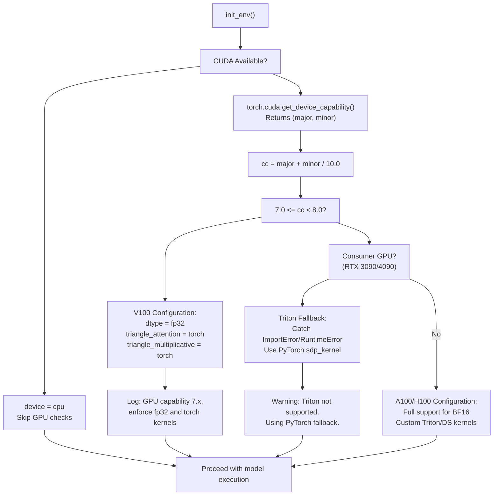
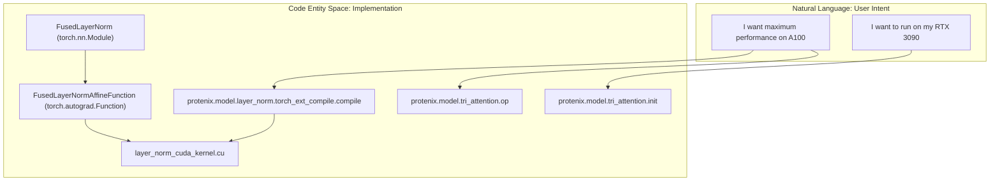
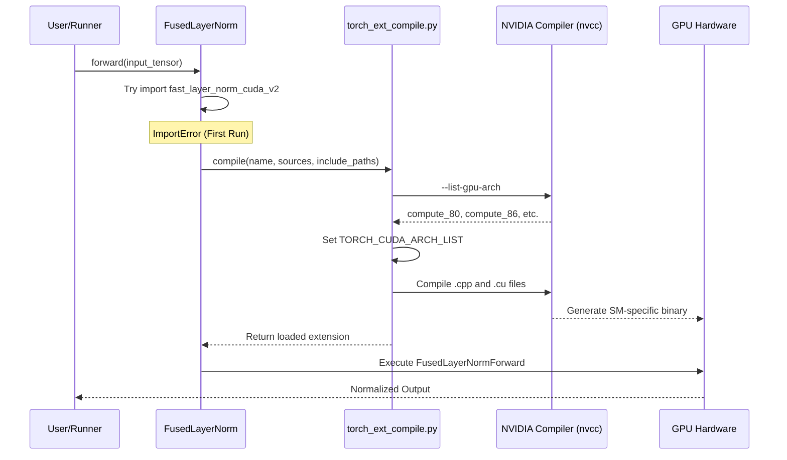

# GPU Compatibility and Kernels

> **Relevant source files**
> * [CHANGELOG.md](https://github.com/bytedance/Protenix/blob/c3bfc365/CHANGELOG.md?plain=1)
> * [protenix/model/layer_norm/kernel/layer_norm_cuda_kernel.cu](https://github.com/bytedance/Protenix/blob/c3bfc365/protenix/model/layer_norm/kernel/layer_norm_cuda_kernel.cu)
> * [protenix/model/layer_norm/layer_norm.py](https://github.com/bytedance/Protenix/blob/c3bfc365/protenix/model/layer_norm/layer_norm.py)
> * [protenix/model/layer_norm/torch_ext_compile.py](https://github.com/bytedance/Protenix/blob/c3bfc365/protenix/model/layer_norm/torch_ext_compile.py)
> * [protenix/model/tri_attention/__init__.py](https://github.com/bytedance/Protenix/blob/c3bfc365/protenix/model/tri_attention/__init__.py)
> * [protenix/model/tri_attention/autotune.py](https://github.com/bytedance/Protenix/blob/c3bfc365/protenix/model/tri_attention/autotune.py)
> * [tests/test_esm_loading.py](https://github.com/bytedance/Protenix/blob/c3bfc365/tests/test_esm_loading.py)
> * [tests/test_installation.py](https://github.com/bytedance/Protenix/blob/c3bfc365/tests/test_installation.py)
> * [tests/test_triton_compatibility.py](https://github.com/bytedance/Protenix/blob/c3bfc365/tests/test_triton_compatibility.py)

This document explains how Protenix detects and adapts to different GPU architectures, the available kernel implementations for performance-critical operations, and the compatibility handling for various GPU compute capabilities. Protenix provides high-performance custom kernels (Triton, CUDA, CUTLASS) with transparent fallback mechanisms to ensure functionality on both data-center (A100/H100) and consumer-grade (RTX 3090/4090) hardware.

---

## GPU Compute Capability and Fallbacks

Protenix performs automatic GPU capability detection to enforce compatible configurations. This is critical for older architectures like the NVIDIA V100 (compute capability 7.x) and consumer hardware that may encounter issues with specific Triton or DeepSpeed kernels.

### Compatibility Logic and Fallback Flow

The system handles compatibility at two levels:

1. **Explicit Architecture Checks**: The function `is_gpu_capability_between_7_and_8()` at [protenix/model/layer_norm/torch_ext_compile.py L47-L49](https://github.com/bytedance/Protenix/blob/c3bfc365/protenix/model/layer_norm/torch_ext_compile.py#L47-L49)  and [runner/inference.py L376-L386](https://github.com/bytedance/Protenix/blob/c3bfc365/runner/inference.py#L376-L386)  detects V100-class GPUs to disable BF16 and custom kernels.
2. **Transparent Import Fallbacks**: For Triton-based kernels, Protenix uses a try-except block to provide a native PyTorch fallback if the kernel fails to load on specific hardware (e.g., RTX 4090) [protenix/model/tri_attention/__init__.py L26-L34](https://github.com/bytedance/Protenix/blob/c3bfc365/protenix/model/tri_attention/__init__.py#L26-L34)

**Sources:** [protenix/model/tri_attention/__init__.py L26-L34](https://github.com/bytedance/Protenix/blob/c3bfc365/protenix/model/tri_attention/__init__.py#L26-L34)

 [runner/inference.py L376-L386](https://github.com/bytedance/Protenix/blob/c3bfc365/runner/inference.py#L376-L386)

 [CHANGELOG.md L19-L22](https://github.com/bytedance/Protenix/blob/c3bfc365/CHANGELOG.md?plain=1#L19-L22)

---

## Kernel Implementation Details

### Triton-Based Triangle Attention

The Triangle Attention module utilizes Triton for high-performance fused kernels. However, compatibility issues on certain GPUs (Issue #185) led to the implementation of a robust fallback system.

* **Triton Implementation**: When available, `TriAttention` uses `TriAttentionFunction` from the `op` module [protenix/model/tri_attention/__init__.py L29](https://github.com/bytedance/Protenix/blob/c3bfc365/protenix/model/tri_attention/__init__.py#L29-L29)
* **PyTorch Fallback**: If Triton is unsupported, it falls back to `torch.nn.functional.scaled_dot_product_attention` [protenix/model/tri_attention/__init__.py L77-L82](https://github.com/bytedance/Protenix/blob/c3bfc365/protenix/model/tri_attention/__init__.py#L77-L82)
* **Manual Override**: Users can force the fallback by setting the environment variable `TRIMUL_KERNEL="torch"` [tests/test_triton_compatibility.py L76-L80](https://github.com/bytedance/Protenix/blob/c3bfc365/tests/test_triton_compatibility.py#L76-L80)

### Custom CUDA LayerNorm

Protenix includes a "Fast LayerNorm" implementation that is compiled JIT (Just-In-Time) using PyTorch's `cpp_extension`.

* **Compilation Logic**: The `compile` function in `torch_ext_compile.py` queries `nvcc` for supported architectures and dynamically builds the `TORCH_CUDA_ARCH_LIST` [protenix/model/layer_norm/torch_ext_compile.py L22-L68](https://github.com/bytedance/Protenix/blob/c3bfc365/protenix/model/layer_norm/torch_ext_compile.py#L22-L68)
* **Kernel Features**: The CUDA kernel implements the Welford online algorithm for stable mean and variance computation across warps [protenix/model/layer_norm/kernel/layer_norm_cuda_kernel.cu L40-L73](https://github.com/bytedance/Protenix/blob/c3bfc365/protenix/model/layer_norm/kernel/layer_norm_cuda_kernel.cu#L40-L73)
* **Loading Mechanism**: The system first attempts to import a pre-compiled `fast_layer_norm_cuda_v2`; if it fails, it triggers the JIT compilation of `layer_norm_cuda.cpp` and `layer_norm_cuda_kernel.cu` [protenix/model/layer_norm/layer_norm.py L53-L66](https://github.com/bytedance/Protenix/blob/c3bfc365/protenix/model/layer_norm/layer_norm.py#L53-L66)

**Sources:** [protenix/model/layer_norm/torch_ext_compile.py L22-L68](https://github.com/bytedance/Protenix/blob/c3bfc365/protenix/model/layer_norm/torch_ext_compile.py#L22-L68)

 [protenix/model/layer_norm/layer_norm.py L53-L66](https://github.com/bytedance/Protenix/blob/c3bfc365/protenix/model/layer_norm/layer_norm.py#L53-L66)

 [protenix/model/layer_norm/kernel/layer_norm_cuda_kernel.cu L40-L73](https://github.com/bytedance/Protenix/blob/c3bfc365/protenix/model/layer_norm/kernel/layer_norm_cuda_kernel.cu#L40-L73)

---

## Code Entity Space: Kernel Selection

The following diagram bridges the high-level kernel selection logic to the specific classes and functions responsible for execution.

**Sources:** [protenix/model/layer_norm/layer_norm.py L69-L190](https://github.com/bytedance/Protenix/blob/c3bfc365/protenix/model/layer_norm/layer_norm.py#L69-L190)

 [protenix/model/tri_attention/__init__.py L26-L34](https://github.com/bytedance/Protenix/blob/c3bfc365/protenix/model/tri_attention/__init__.py#L26-L34)

 [protenix/model/layer_norm/torch_ext_compile.py L22-L27](https://github.com/bytedance/Protenix/blob/c3bfc365/protenix/model/layer_norm/torch_ext_compile.py#L22-L27)

---

## GPU-Specific Requirements and Known Issues

| Hardware / Library | Support Level | Technical Detail / Workaround |
| --- | --- | --- |
| **NVIDIA V100** | Restricted | Automatically forced to `fp32` and `torch` kernels due to lack of BF16 support [runner/inference.py L390-L394](https://github.com/bytedance/Protenix/blob/c3bfc365/runner/inference.py#L390-L394) |
| **RTX 3090/4090** | Full (via fallback) | May fail Triton kernel imports; system falls back to PyTorch native attention [CHANGELOG.md L19-L22](https://github.com/bytedance/Protenix/blob/c3bfc365/CHANGELOG.md?plain=1#L19-L22) |
| **PyTorch 2.6+** | Supported | Fixed ESM weights loading issues that previously caused crashes on newer PyTorch versions [CHANGELOG.md L33-L34](https://github.com/bytedance/Protenix/blob/c3bfc365/CHANGELOG.md?plain=1#L33-L34)    [tests/test_esm_loading.py L89-L94](https://github.com/bytedance/Protenix/blob/c3bfc365/tests/test_esm_loading.py#L89-L94) |
| **DeepSpeed** | Version Specific | Requires DeepSpeed 0.17.5+ for Pydantic v2 compatibility (Issue #182) [CHANGELOG.md L18](https://github.com/bytedance/Protenix/blob/c3bfc365/CHANGELOG.md?plain=1#L18-L18)    [tests/test_installation.py L57-L63](https://github.com/bytedance/Protenix/blob/c3bfc365/tests/test_installation.py#L57-L63) |
| **Triton** | v3.3.0 Recommended | Major version 3 is required for attention kernels [tests/test_triton_compatibility.py L30-L41](https://github.com/bytedance/Protenix/blob/c3bfc365/tests/test_triton_compatibility.py#L30-L41) |

### ESM Loading Compatibility

Issue #176 identified a failure in loading ESM (Evolutionary Scale Modeling) weights with PyTorch 2.6+. Protenix has been updated to handle these version-specific loading protocols, ensuring that `get_esm_embedding` remains functional across PyTorch updates [tests/test_esm_loading.py L102-L130](https://github.com/bytedance/Protenix/blob/c3bfc365/tests/test_esm_loading.py#L102-L130)

**Sources:** [CHANGELOG.md L18-L34](https://github.com/bytedance/Protenix/blob/c3bfc365/CHANGELOG.md?plain=1#L18-L34)

 [tests/test_installation.py L57-L63](https://github.com/bytedance/Protenix/blob/c3bfc365/tests/test_installation.py#L57-L63)

 [tests/test_esm_loading.py L102-L130](https://github.com/bytedance/Protenix/blob/c3bfc365/tests/test_esm_loading.py#L102-L130)

 [tests/test_triton_compatibility.py L30-L41](https://github.com/bytedance/Protenix/blob/c3bfc365/tests/test_triton_compatibility.py#L30-L41)

---

## Data Flow: Kernel Compilation and Execution

This diagram illustrates the lifecycle of a custom CUDA kernel within Protenix, from environment detection to hardware execution.

**Sources:** [protenix/model/layer_norm/torch_ext_compile.py L22-L68](https://github.com/bytedance/Protenix/blob/c3bfc365/protenix/model/layer_norm/torch_ext_compile.py#L22-L68)

 [protenix/model/layer_norm/layer_norm.py L53-L66](https://github.com/bytedance/Protenix/blob/c3bfc365/protenix/model/layer_norm/layer_norm.py#L53-L66)

 [protenix/model/layer_norm/kernel/layer_norm_cuda_kernel.cu L76-L132](https://github.com/bytedance/Protenix/blob/c3bfc365/protenix/model/layer_norm/kernel/layer_norm_cuda_kernel.cu#L76-L132)

---

## Troubleshooting and Workarounds

### Triton Support on Consumer GPUs

If encountering "Not Supported" errors for `triangle_multiplicative_update` on consumer hardware:

* **Automatic**: Protenix now includes a transparent fallback [CHANGELOG.md L19-L22](https://github.com/bytedance/Protenix/blob/c3bfc365/CHANGELOG.md?plain=1#L19-L22)
* **Manual**: Set `export TRIMUL_KERNEL=torch` before running inference to bypass Triton entirely [tests/test_triton_compatibility.py L76-L80](https://github.com/bytedance/Protenix/blob/c3bfc365/tests/test_triton_compatibility.py#L76-L80)

### DeepSpeed/Pydantic Version Mismatch

If receiving a `TypeError` related to `json_schema_input_schema`:

* Ensure DeepSpeed is updated to at least **0.17.5** to support Pydantic v2 [CHANGELOG.md L18](https://github.com/bytedance/Protenix/blob/c3bfc365/CHANGELOG.md?plain=1#L18-L18)
* Alternatively, pin `pydantic<2.0` [tests/test_installation.py L57-L63](https://github.com/bytedance/Protenix/blob/c3bfc365/tests/test_installation.py#L57-L63)

### NVCC Architecture Mismatch

If JIT compilation fails:

* Ensure `CUDA_HOME` is set correctly so the system can locate `nvcc` [protenix/model/layer_norm/torch_ext_compile.py L34-L41](https://github.com/bytedance/Protenix/blob/c3bfc365/protenix/model/layer_norm/torch_ext_compile.py#L34-L41)
* The system defaults to `compute_80` (A100) if architecture detection fails [protenix/model/layer_norm/torch_ext_compile.py L63-L64](https://github.com/bytedance/Protenix/blob/c3bfc365/protenix/model/layer_norm/torch_ext_compile.py#L63-L64)

**Sources:** [CHANGELOG.md L18-L22](https://github.com/bytedance/Protenix/blob/c3bfc365/CHANGELOG.md?plain=1#L18-L22)

 [tests/test_triton_compatibility.py L76-L80](https://github.com/bytedance/Protenix/blob/c3bfc365/tests/test_triton_compatibility.py#L76-L80)

 [protenix/model/layer_norm/torch_ext_compile.py L34-L64](https://github.com/bytedance/Protenix/blob/c3bfc365/protenix/model/layer_norm/torch_ext_compile.py#L34-L64)