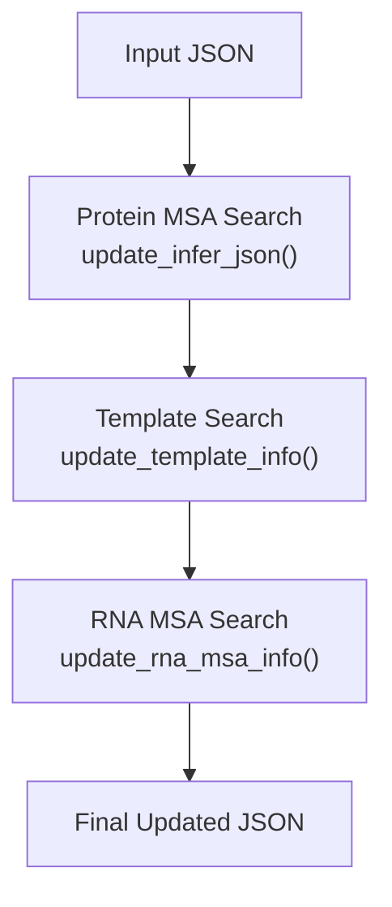
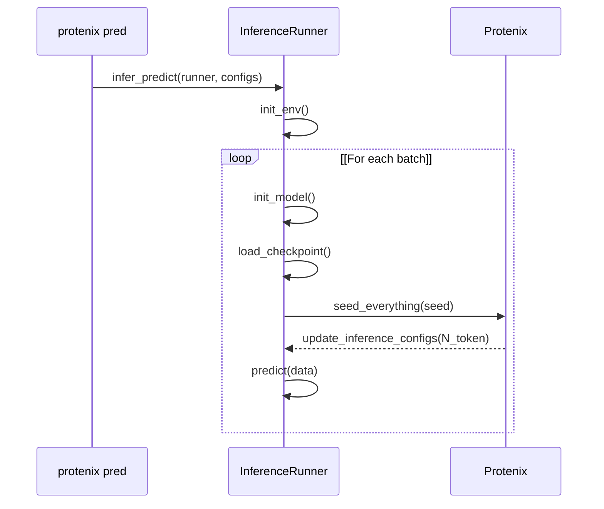

# Inference Pipeline Overview

> **Relevant source files**
> * [runner/batch_inference.py](https://github.com/bytedance/Protenix/blob/c3bfc365/runner/batch_inference.py)
> * [runner/inference.py](https://github.com/bytedance/Protenix/blob/c3bfc365/runner/inference.py)

This document describes the end-to-end inference workflow in Protenix, from input preparation through prediction generation. The pipeline transforms raw molecular structure data (PDB/CIF files or sequences) into structure predictions with confidence metrics.

**Scope**: This page covers the complete inference workflow orchestrated by the CLI and `InferenceRunner` class. For detailed information on specific stages, see: input conversion ([3.2](https://github.com/bytedance/Protenix/blob/c3bfc365/3.2)

), MSA generation ([3.3](https://github.com/bytedance/Protenix/blob/c3bfc365/3.3)

), running predictions ([3.4](https://github.com/bytedance/Protenix/blob/c3bfc365/3.4)

), output formats ([3.5](https://github.com/bytedance/Protenix/blob/c3bfc365/3.5)

), and constraint-guided predictions ([3.6](https://github.com/bytedance/Protenix/blob/c3bfc365/3.6)

).

## Architecture Overview

The inference system consists of five major stages, orchestrated through the `protenix` CLI and executed by the `InferenceRunner` class:

```mermaid
flowchart TD

A["protenix tojson<br>[batch_inference.py:568-636]"]
B["cif_to_input_json()<br>[json_maker.py]"]
C["Input JSON<br>sequences, bonds,<br>constraints"]
D["protenix msa/msatemplate<br>[batch_inference.py:651-714]"]
E["preprocess_input()<br>[batch_inference.py:70-165]"]
F["update_infer_json()<br>[msa_search.py]"]
G["JSON + MSA + Templates<br>pairing.a3m, hhr files"]
H["get_inference_dataloader()<br>[infer_dataloader.py]"]
I["SampleDictToFeatures<br>[featurizer_inference.py]"]
J["Featurizer<br>[featurizer.py]"]
K["Feature Dictionary<br>token_index, ref_pos,<br>msa, constraints"]
L["InferenceRunner.predict()<br>[inference.py:214-237]"]
M["Protenix.forward()<br>[protenix.py]"]
N["PairformerStack<br>N_cycle iterations"]
O["DiffusionModule<br>N_sample × N_step"]
P["ConfidenceHead<br>DistogramHead"]
Q["DataDumper.dump()<br>[dumper.py]"]
R["CIF structures<br>confidence JSON<br>ranking scores"]

C --> D
G --> H
K --> L
P --> Q

subgraph subGraph4 ["Stage 5: Output Generation"]
    Q
    R
    Q --> R
end

subgraph subGraph3 ["Stage 4: Model Execution"]
    L
    M
    N
    O
    P
    L --> M
    M --> N
    N --> O
    O --> P
end

subgraph subGraph2 ["Stage 3: Feature Generation"]
    H
    I
    J
    K
    H --> I
    I --> J
    J --> K
end

subgraph subGraph1 ["Stage 2: MSA & Template Search"]
    D
    E
    F
    G
    D --> E
    E --> F
    F --> G
end

subgraph subGraph0 ["Stage 1: Input Conversion"]
    A
    B
    C
    A --> B
    B --> C
end
```

**Diagram: End-to-End Inference Pipeline with Code Entities**

This pipeline can be executed via specific CLI commands or as a unified workflow through `protenix pred`.

**Sources**: [runner/batch_inference.py L70-L165](https://github.com/bytedance/Protenix/blob/c3bfc365/runner/batch_inference.py#L70-L165)

 [runner/batch_inference.py L568-L714](https://github.com/bytedance/Protenix/blob/c3bfc365/runner/batch_inference.py#L568-L714)

 [runner/inference.py L64-L237](https://github.com/bytedance/Protenix/blob/c3bfc365/runner/inference.py#L64-L237)

 [protenix/data/inference/infer_dataloader.py L23-L52](https://github.com/bytedance/Protenix/blob/c3bfc365/protenix/data/inference/infer_dataloader.py#L23-L52)

## Pipeline Stages

### Stage 1: Input Conversion

Raw structural data (PDB/CIF files) must be converted to Protenix's JSON format. The `tojson` command handles this conversion:

| Input Format | Handler | Output |
| --- | --- | --- |
| PDB file | `pdb_to_cif()` → `cif_to_input_json()` | JSON with sequences |
| CIF file | `cif_to_input_json()` | JSON with sequences |
| Ligand (SDF/SMI) | `lig_file_to_atom_info()` | Embedded in JSON |

The conversion process extracts sequences, ligand structures, covalent bonds, and optional constraints.

**Key Parameters**:

* `--altloc`: Select altloc conformations ("first", "A", "B", etc.) [runner/batch_inference.py L596-L597](https://github.com/bytedance/Protenix/blob/c3bfc365/runner/batch_inference.py#L596-L597)
* `--assembly_id`: Expand bioassembly structure [runner/batch_inference.py L598-L599](https://github.com/bytedance/Protenix/blob/c3bfc365/runner/batch_inference.py#L598-L599)

**Sources**: [runner/batch_inference.py L568-L636](https://github.com/bytedance/Protenix/blob/c3bfc365/runner/batch_inference.py#L568-L636)

 [protenix/data/inference/json_maker.py L28-L112](https://github.com/bytedance/Protenix/blob/c3bfc365/protenix/data/inference/json_maker.py#L28-L112)

### Stage 2: Preprocessing (MSA & Templates)

The `preprocess_input` function [runner/batch_inference.py L70-L165](https://github.com/bytedance/Protenix/blob/c3bfc365/runner/batch_inference.py#L70-L165)

 coordinates search operations for evolutionary and structural information.

**Diagram: Preprocessing Workflow**

1. **Protein MSA**: Orchestrated by `update_infer_json` [runner/msa_search.py L78-L125](https://github.com/bytedance/Protenix/blob/c3bfc365/runner/msa_search.py#L78-L125)  Supports 'protenix' or 'colabfold' modes.
2. **Template Search**: Uses `hmmsearch` and `hmmbuild` to find structural templates [runner/batch_inference.py L124-L131](https://github.com/bytedance/Protenix/blob/c3bfc365/runner/batch_inference.py#L124-L131)
3. **RNA MSA**: Performs `nhmmer` searches against RNA databases (nt-rna, rfam, rna_central) [runner/batch_inference.py L134-L146](https://github.com/bytedance/Protenix/blob/c3bfc365/runner/batch_inference.py#L134-L146)

**Sources**: [runner/batch_inference.py L70-L165](https://github.com/bytedance/Protenix/blob/c3bfc365/runner/batch_inference.py#L70-L165)

 [runner/msa_search.py L78-L125](https://github.com/bytedance/Protenix/blob/c3bfc365/runner/msa_search.py#L78-L125)

 [runner/rna_msa_search.py L26-L105](https://github.com/bytedance/Protenix/blob/c3bfc365/runner/rna_msa_search.py#L26-L105)

### Stage 3: Feature Generation

The `get_inference_dataloader` function [protenix/data/inference/infer_dataloader.py L23-L52](https://github.com/bytedance/Protenix/blob/c3bfc365/protenix/data/inference/infer_dataloader.py#L23-L52)

 builds the data pipeline using `InferenceDataset`.

| Category | Components |
| --- | --- |
| Token Features | `token_index`, `asym_id`, `entity_id`, `residue_index` |
| Reference Features | `ref_pos`, `ref_mask`, `ref_element` |
| MSA/Template Features | `msa_feat`, `templates` |
| Bond Features | `bond_feats`, `covalent_bond` |

**Sources**: [protenix/data/inference/infer_dataloader.py L23-L52](https://github.com/bytedance/Protenix/blob/c3bfc365/protenix/data/inference/infer_dataloader.py#L23-L52)

 [protenix/data/featurizer_inference.py L38-L124](https://github.com/bytedance/Protenix/blob/c3bfc365/protenix/data/featurizer_inference.py#L38-L124)

### Stage 4: Model Execution

The `InferenceRunner` class manages the execution lifecycle:

**Diagram: Model Execution Sequence**

**Dynamic Configuration**: `update_inference_configs` [runner/inference.py L440-L454](https://github.com/bytedance/Protenix/blob/c3bfc365/runner/inference.py#L440-L454)

 adjusts Automatic Mixed Precision (AMP) based on the number of tokens to optimize memory usage:

* `N_token > 3840`: Disable AMP for confidence head and diffusion.
* `N_token > 2560`: Disable AMP for confidence head.

**Sources**: [runner/inference.py L64-L237](https://github.com/bytedance/Protenix/blob/c3bfc365/runner/inference.py#L64-L237)

 [runner/inference.py L440-L454](https://github.com/bytedance/Protenix/blob/c3bfc365/runner/inference.py#L440-L454)

 [runner/inference.py L457-L526](https://github.com/bytedance/Protenix/blob/c3bfc365/runner/inference.py#L457-L526)

### Stage 5: Output Generation

The `DataDumper` class [runner/dumper.py L43-L125](https://github.com/bytedance/Protenix/blob/c3bfc365/runner/dumper.py#L43-L125)

 processes the model outputs into final files:

* **CIF Files**: Atomic coordinates for each sample/seed.
* **Confidence JSON**: Contains `ranking_score`, `plddt`, `pae`, and `pde` metrics.

**Sources**: [runner/dumper.py L43-L125](https://github.com/bytedance/Protenix/blob/c3bfc365/runner/dumper.py#L43-L125)

 [runner/inference.py L496-L508](https://github.com/bytedance/Protenix/blob/c3bfc365/runner/inference.py#L496-L508)

## Core Classes

**`InferenceRunner`** [runner/inference.py L64-L237](https://github.com/bytedance/Protenix/blob/c3bfc365/runner/inference.py#L64-L237)

* **`init_env`**: Sets up CUDA, NCCL for distributed inference, and kernel compilation paths (CUTLASS/FastLayerNorm) [runner/inference.py L84-L128](https://github.com/bytedance/Protenix/blob/c3bfc365/runner/inference.py#L84-L128)
* **`load_checkpoint`**: Loads weights into the `Protenix` model, handling DDP prefix mapping [runner/inference.py L144-L185](https://github.com/bytedance/Protenix/blob/c3bfc365/runner/inference.py#L144-L185)
* **`predict`**: Performs the forward pass within `torch.no_grad()` and AMP contexts [runner/inference.py L214-L237](https://github.com/bytedance/Protenix/blob/c3bfc365/runner/inference.py#L214-L237)

**`DataDumper`** [runner/dumper.py L43-L125](https://github.com/bytedance/Protenix/blob/c3bfc365/runner/dumper.py#L43-L125)

* Handles the conversion of raw tensor outputs into biologically relevant formats.
* Implements ranking logic based on `ranking_score` [runner/dumper.py L228-L251](https://github.com/bytedance/Protenix/blob/c3bfc365/runner/dumper.py#L228-L251)

**Sources**: [runner/inference.py L64-L237](https://github.com/bytedance/Protenix/blob/c3bfc365/runner/inference.py#L64-L237)

 [runner/dumper.py L43-L125](https://github.com/bytedance/Protenix/blob/c3bfc365/runner/dumper.py#L43-L125)

## Optimization and Hardware Compatibility

Protenix includes specialized handling for different GPU architectures in `update_gpu_compatible_configs` [runner/inference.py L534-L555](https://github.com/bytedance/Protenix/blob/c3bfc365/runner/inference.py#L534-L555)

:

* **V100/Older GPUs**: Forces `fp32` and `torch` kernels as they lack support for advanced attention kernels [runner/inference.py L538-L545](https://github.com/bytedance/Protenix/blob/c3bfc365/runner/inference.py#L538-L545)
* **A100+**: Enables `bf16` and optimized kernels like `triattention` or `deepspeed` [runner/inference.py L547-L553](https://github.com/bytedance/Protenix/blob/c3bfc365/runner/inference.py#L547-L553)

**Sources**: [runner/inference.py L534-L555](https://github.com/bytedance/Protenix/blob/c3bfc365/runner/inference.py#L534-L555)

 [runner/inference.py L108-L125](https://github.com/bytedance/Protenix/blob/c3bfc365/runner/inference.py#L108-L125)

## Related Pages

* For input JSON specification: [4.1](https://github.com/bytedance/Protenix/blob/c3bfc365/4.1)
* For MSA generation details: [3.3](https://github.com/bytedance/Protenix/blob/c3bfc365/3.3)
* For output format interpretation: [3.5](https://github.com/bytedance/Protenix/blob/c3bfc365/3.5)
* For Training-Free Guidance (TFG): [3.7](https://github.com/bytedance/Protenix/blob/c3bfc365/3.7)