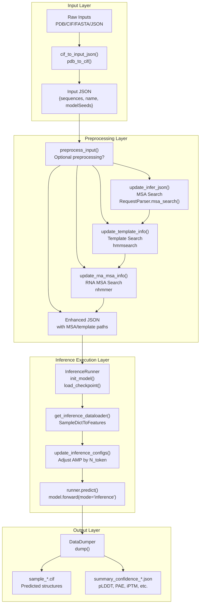
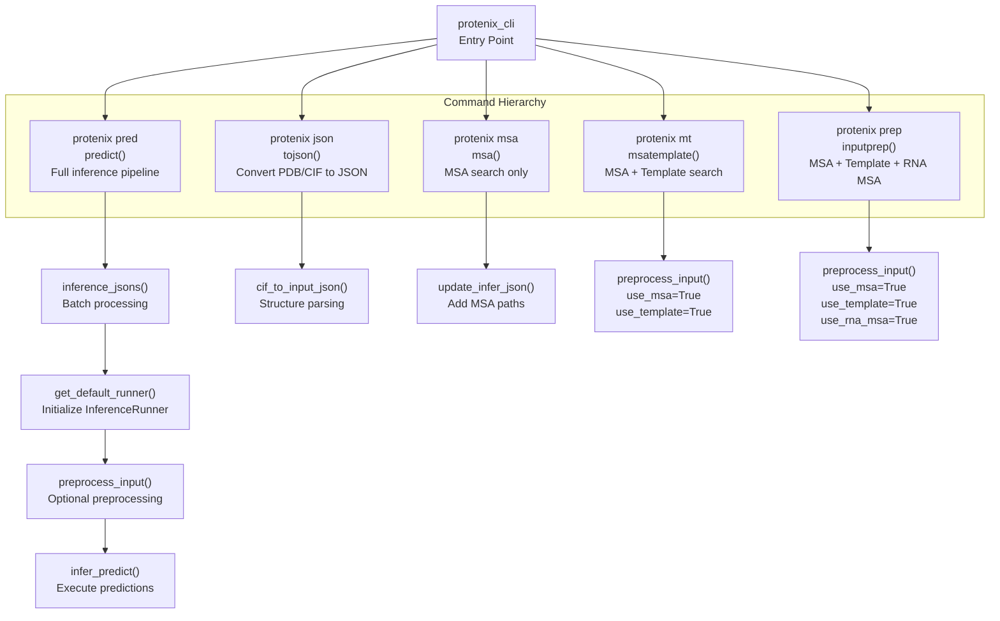
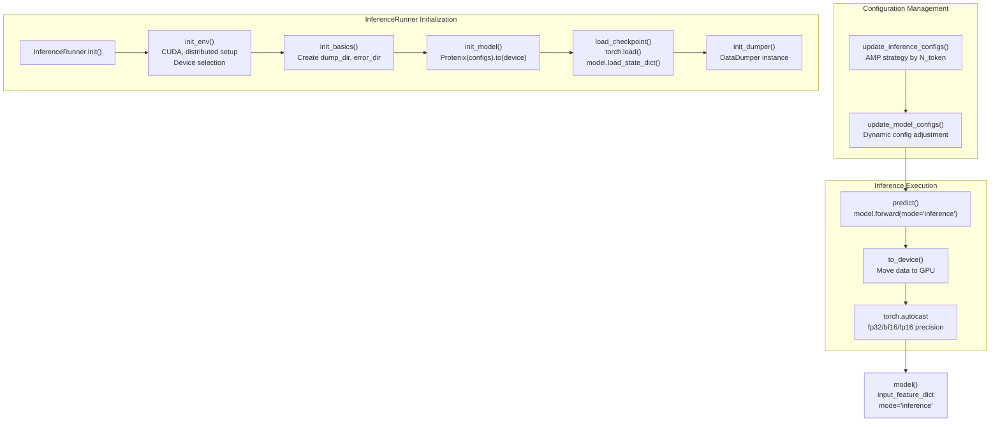
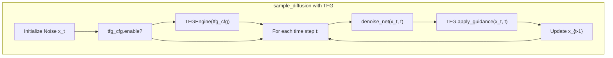

# Inference System

> **Relevant source files**
> * [configs/configs_inference.py](https://github.com/bytedance/Protenix/blob/c3bfc365/configs/configs_inference.py)
> * [protenix/model/generator.py](https://github.com/bytedance/Protenix/blob/c3bfc365/protenix/model/generator.py)
> * [runner/batch_inference.py](https://github.com/bytedance/Protenix/blob/c3bfc365/runner/batch_inference.py)
> * [runner/dumper.py](https://github.com/bytedance/Protenix/blob/c3bfc365/runner/dumper.py)
> * [runner/inference.py](https://github.com/bytedance/Protenix/blob/c3bfc365/runner/inference.py)

## Purpose and Scope

This document provides a comprehensive guide to the Protenix inference system, which transforms molecular input data into predicted 3D structures with associated confidence metrics. The inference system encompasses the complete pipeline from raw structural inputs (PDB/CIF files, sequences, SMILES strings) through optional preprocessing steps (MSA generation, template search) to final structure prediction and output generation.

The inference system is designed for production use, supporting multiple model variants, ensemble predictions, and various optimization strategies for memory and speed. For details on the underlying model architecture, see [Model Architecture](/bytedance/Protenix/5-model-architecture). For information about training the model, see [Training System](/bytedance/Protenix/6-training-system). For configuration options, see [Configuration System](/bytedance/Protenix/7-configuration-system).

## Overview

The Protenix inference system operates through a layered architecture consisting of:

1. **Command-line interface layer** - User-facing commands for different workflows.
2. **Preprocessing layer** - Optional MSA, template, and RNA MSA generation.
3. **Data loading layer** - Conversion of JSON inputs to model-ready features.
4. **Model execution layer** - Running the Protenix neural network.
5. **Output layer** - Generating CIF structures and confidence metrics.

The system is implemented primarily in three key files:

* [runner/batch_inference.py](https://github.com/bytedance/Protenix/blob/c3bfc365/runner/batch_inference.py)  - CLI commands and batch processing orchestration.
* [runner/inference.py](https://github.com/bytedance/Protenix/blob/c3bfc365/runner/inference.py)  - Core inference runner and model execution.
* [runner/msa_search.py](https://github.com/bytedance/Protenix/blob/c3bfc365/runner/msa_search.py)  - MSA search and preprocessing utilities.

**Sources:** [runner/batch_inference.py L1-L1298](https://github.com/bytedance/Protenix/blob/c3bfc365/runner/batch_inference.py#L1-L1298)

 [runner/inference.py L1-L634](https://github.com/bytedance/Protenix/blob/c3bfc365/runner/inference.py#L1-L634)

## High-Level Inference Workflow

This diagram illustrates the complete inference workflow from raw inputs to final outputs. The system is modular, allowing users to skip preprocessing steps if MSA/template data is already available or not needed.

**Sources:** [runner/batch_inference.py L69-L164](https://github.com/bytedance/Protenix/blob/c3bfc365/runner/batch_inference.py#L69-L164)

 [runner/inference.py L410-L519](https://github.com/bytedance/Protenix/blob/c3bfc365/runner/inference.py#L410-L519)

## CLI Command Structure

The Protenix CLI provides five main commands for different inference workflows:

**Sources:** [runner/batch_inference.py L560-L1295](https://github.com/bytedance/Protenix/blob/c3bfc365/runner/batch_inference.py#L560-L1295)

### Command Reference Table

| Command | Function | Purpose | Key Parameters |
| --- | --- | --- | --- |
| `protenix pred` | `predict()` | Full inference with optional preprocessing | `--input`, `--model_name`, `--seeds`, `--cycle`, `--step`, `--use_msa`, `--use_template`, `--use_rna_msa` |
| `protenix json` | `tojson()` | Convert PDB/CIF to JSON format | `--input`, `--altloc`, `--assembly_id` |
| `protenix msa` | `msa()` | Perform MSA search | `--input`, `--msa_server_mode` |
| `protenix mt` | `msatemplate()` | MSA + template search | `--input`, `--hmmsearch_binary_path`, `--seqres_database_path` |
| `protenix prep` | `inputprep()` | Full preprocessing pipeline | `--input`, `--nhmmer_binary_path`, `--rfam_database_path` |

**Sources:** [runner/batch_inference.py L724-L1288](https://github.com/bytedance/Protenix/blob/c3bfc365/runner/batch_inference.py#L724-L1288)

## InferenceRunner Architecture

The `InferenceRunner` class orchestrates the complete inference process, managing environment setup, model initialization, and prediction execution.

**Sources:** [runner/inference.py L64-L256](https://github.com/bytedance/Protenix/blob/c3bfc365/runner/inference.py#L64-L256)

### InferenceRunner Initialization Steps

The initialization sequence in the `InferenceRunner` class follows a strict order to ensure proper setup:

1. **Environment Initialization** [runner/inference.py L84-L127](https://github.com/bytedance/Protenix/blob/c3bfc365/runner/inference.py#L84-L127) * Detects CUDA availability and sets device (`cuda:{local_rank}` or `cpu`). * Initializes distributed process group if `world_size > 1`. * Configures kernel compilation for DeepSpeed (if used) and fast_layernorm.
2. **Directory Setup** [runner/inference.py L129-L136](https://github.com/bytedance/Protenix/blob/c3bfc365/runner/inference.py#L129-L136) * Creates `dump_dir` for outputs and `error_dir` for error logs.
3. **Model Initialization** [runner/inference.py L138-L142](https://github.com/bytedance/Protenix/blob/c3bfc365/runner/inference.py#L138-L142) * Instantiates `Protenix(configs)` and moves model to the selected device.
4. **Checkpoint Loading** [runner/inference.py L144-L184](https://github.com/bytedance/Protenix/blob/c3bfc365/runner/inference.py#L144-L184) * Loads weights from `{load_checkpoint_dir}/{model_name}.pt`. * Handles DDP checkpoint format (removes `module.` prefix). * Sets model to evaluation mode (`model.eval()`).
5. **Dumper Initialization** [runner/inference.py L186-L200](https://github.com/bytedance/Protenix/blob/c3bfc365/runner/inference.py#L186-L200) * Creates `DataDumper` for saving predictions. * Configures atom confidence output and ranking score sorting.

**Sources:** [runner/inference.py L73-L200](https://github.com/bytedance/Protenix/blob/c3bfc365/runner/inference.py#L73-L200)

## Model Configuration and Variants

The system supports multiple model variants managed through a hierarchical merge system of `configs_base`, `data_configs`, `inference_configs`, and `model_configs`.

### Model Variant Table

| Model Name | Size | Cycles | Steps | Features | Data Cutoff |
| --- | --- | --- | --- | --- | --- |
| `protenix_base_default_v0.5.0` | 368M | 10 | 200 | MSA only | 2021-09-30 |
| `protenix_base_default_v1.0.0` | 368M | 10 | 200 | MSA + RNA MSA + Template | 2021-09-30 |
| `protenix_base_20250630_v1.0.0` | 368M | 10 | 200 | MSA + RNA MSA + Template | 2025-06-30 |
| `protenix_base_constraint_v0.5.0` | 368M | 10 | 200 | MSA + Constraints | 2021-09-30 |
| `protenix_mini_default_v0.5.0` | 134M | 4 | 5 | MSA only | 2021-09-30 |
| `protenix_mini_esm_v0.5.0` | 135M | 4 | 5 | ESM-2 (3B) | 2021-09-30 |
| `protenix_mini_ism_v0.5.0` | 135M | 4 | 5 | ISM (3B) | 2021-09-30 |
| `protenix_tiny_default_v0.5.0` | 109M | 4 | 5 | MSA only | 2021-09-30 |

**Sources:** [runner/batch_inference.py L793-L818](https://github.com/bytedance/Protenix/blob/c3bfc365/runner/batch_inference.py#L793-L818)

 [configs/configs_inference.py L22-L39](https://github.com/bytedance/Protenix/blob/c3bfc365/configs/configs_inference.py#L22-L39)

## Input JSON Format

The inference system uses a structured JSON format to specify molecular complexes. The JSON structure supports proteins, RNA, DNA, ligands, and ions.

### JSON Field Descriptions

| Field | Type | Required | Description |
| --- | --- | --- | --- |
| `name` | string | Yes | Sample identifier |
| `modelSeeds` | list[int] | No | Override default inference seeds |
| `sequences` | list[object] | Yes | List of molecular entities |
| `proteinChain.sequence` | string | Yes | Amino acid sequence |
| `proteinChain.count` | int | Yes | Number of copies |
| `proteinChain.pairedMsaPath` | string | No | Path to paired MSA file (`.a3m`) |
| `proteinChain.unpairedMsaPath` | string | No | Path to unpaired MSA file (`.a3m`) |
| `rnaSequence.sequence` | string | Yes | RNA nucleotide sequence |
| `rnaSequence.rna_msa_path` | string | No | Path to RNA MSA file (`.a3m`) |
| `ligand.ligand` | string | Yes | SMILES string or `FILE_/path/to/sdf` |

**Sources:** [runner/batch_inference.py L166-L283](https://github.com/bytedance/Protenix/blob/c3bfc365/runner/batch_inference.py#L166-L283)

 [protenix/data/inference/json_maker.py L36](https://github.com/bytedance/Protenix/blob/c3bfc365/protenix/data/inference/json_maker.py#L36-L36)

## Data Flow Through Preprocessing

The `preprocess_input` function updates the input JSON with MSA, template, and RNA MSA information sequentially.

```mermaid
flowchart TD

InputJSON["Input JSON<br>sequences only"]
MSAStep["use_msa?<br>update_infer_json()"]
MSASearch["msa_search()<br>RequestParser.msa_search()"]
MSAUpdate["Add pairedMsaPath,<br>unpairedMsaPath"]
TemplateStep["use_template?<br>update_template_info()"]
TemplateSearch["Template Pipeline<br>hmmsearch/hmmbuild"]
RNAStep["use_rna_msa?<br>update_rna_msa_info()"]
RNASearch["RNA MSA Pipeline<br>nhmmer/hmmalign"]
OutputJSON["Updated JSON<br>-final-updated.json"]

subgraph subGraph0 ["preprocess_input() Pipeline"]
    InputJSON
    MSAStep
    MSASearch
    MSAUpdate
    TemplateStep
    TemplateSearch
    RNAStep
    RNASearch
    OutputJSON
    InputJSON --> MSAStep
    MSAStep --> MSASearch
    MSASearch --> MSAUpdate
    MSAUpdate --> TemplateStep
    MSAStep --> TemplateStep
    TemplateStep --> TemplateSearch
    TemplateSearch --> RNAStep
    TemplateStep --> RNAStep
    RNAStep --> RNASearch
    RNASearch --> OutputJSON
    RNAStep --> OutputJSON
end
```

**Sources:** [runner/batch_inference.py L69-L164](https://github.com/bytedance/Protenix/blob/c3bfc365/runner/batch_inference.py#L69-L164)

 [runner/msa_search.py L194-L254](https://github.com/bytedance/Protenix/blob/c3bfc365/runner/msa_search.py#L194-L254)

## Inference Execution Flow

The `infer_predict()` function orchestrates the complete inference process, handling multiple samples and seeds. It utilizes `get_inference_dataloader` to prepare batches and calls `runner.predict()` for execution.

### Dynamic Precision Management

The `update_inference_configs()` function adjusts automatic mixed precision (AMP) settings based on token count to prevent out-of-memory (OOM) errors. FP32 is enforced for larger token counts to maintain stability.

**Sources:** [runner/inference.py L385-L407](https://github.com/bytedance/Protenix/blob/c3bfc365/runner/inference.py#L385-L407)

 [runner/inference.py L410-L519](https://github.com/bytedance/Protenix/blob/c3bfc365/runner/inference.py#L410-L519)

## Training-Free Guidance (TFG)

During the diffusion sampling process in `sample_diffusion`, the system can apply differentiable energy potentials to guide the structure generation.

For details, see [Training-Free Guidance (TFG)](/bytedance/Protenix/3.7-training-free-guidance-(tfg)).

**Sources:** [protenix/model/generator.py L123-L188](https://github.com/bytedance/Protenix/blob/c3bfc365/protenix/model/generator.py#L123-L188)

 [protenix/tfg/__init__.py L20](https://github.com/bytedance/Protenix/blob/c3bfc365/protenix/tfg/__init__.py#L20-L20)

## Output Generation

The `DataDumper` class handles the persistence of results:

1. **CIF Structure Files**: Generated via `_save_structure`. Coordinates are saved in mmCIF format with pLDDT scores mapped to the B-factor column.
2. **Confidence Metrics JSON**: Generated via `_save_confidence`. Includes `ranking_score`, `plddt`, `ptm`, and `iptm`.

**Sources:** [runner/dumper.py L48-L166](https://github.com/bytedance/Protenix/blob/c3bfc365/runner/dumper.py#L48-L166)

 [runner/dumper.py L168-L233](https://github.com/bytedance/Protenix/blob/c3bfc365/runner/dumper.py#L168-L233)

## Summary

The Protenix inference system provides a flexible, production-ready pipeline for biomolecular structure prediction. Key design principles include modularity, dynamic optimization of precision, and support for advanced features like training-free guidance and constraint-guided predictions.

**Sources:** [runner/batch_inference.py L1-L1298](https://github.com/bytedance/Protenix/blob/c3bfc365/runner/batch_inference.py#L1-L1298)

 [runner/inference.py L1-L634](https://github.com/bytedance/Protenix/blob/c3bfc365/runner/inference.py#L1-L634)