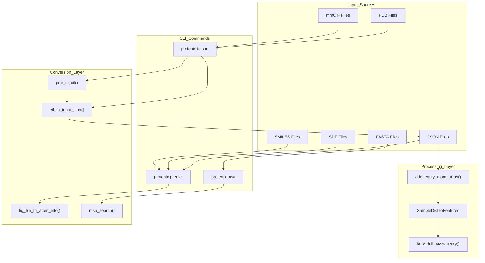
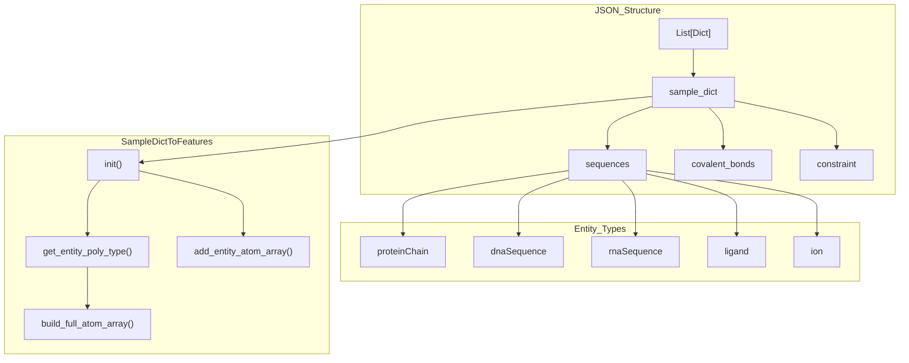
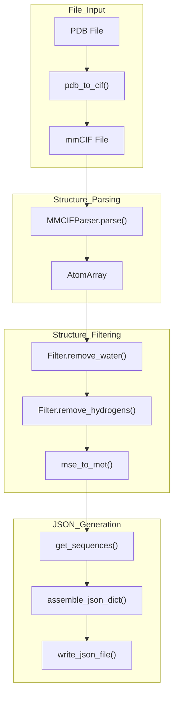
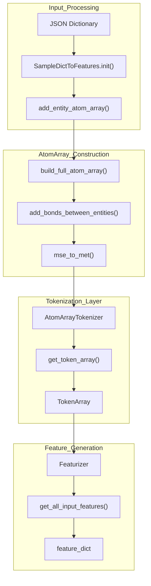

# Input Data Formats

> **Relevant source files**
> * [docs/docker_installation.md](https://github.com/bytedance/Protenix/blob/c3bfc365/docs/docker_installation.md?plain=1)
> * [docs/infer_json_format.md](https://github.com/bytedance/Protenix/blob/c3bfc365/docs/infer_json_format.md?plain=1)
> * [examples/example.json](https://github.com/bytedance/Protenix/blob/c3bfc365/examples/example.json)
> * [examples/example_without_msa.json](https://github.com/bytedance/Protenix/blob/c3bfc365/examples/example_without_msa.json)
> * [protenix/data/constants.py](https://github.com/bytedance/Protenix/blob/c3bfc365/protenix/data/constants.py)

This page documents the input data formats supported by Protenix, including the primary JSON schema, PDB/CIF file handling, constraint definitions, and the data transformation pipeline. This covers the initial data ingestion stage before feature generation and model inference.

For information about the data conversion and processing pipeline that transforms these inputs into model-ready features, see [Data Conversion and Processing](/bytedance/Protenix/3.2-input-preparation-and-conversion). For details about the feature generation process, see [Feature Generation](/bytedance/Protenix/4.3-feature-generation).

## Supported Input Formats Overview

Protenix accepts multiple input file formats that are converted to a standardized JSON representation before processing. The system supports both direct JSON input and automatic conversion from structural file formats.

**Supported File Formats**

| Format | Extension | Entity Types | Entry Point | Notes |
| --- | --- | --- | --- | --- |
| JSON | `.json` | All | Direct input | Primary format, no conversion needed |
| mmCIF | `.cif` | Protein, DNA, RNA, ligands, ions | `cif_to_input_json()` | Full structural information |
| PDB | `.pdb` | Protein, DNA, RNA, ligands, ions | `pdb_to_cif()` + `cif_to_input_json()` | Converted to CIF first |
| FASTA | `.fasta` | Protein sequences only | `msa_search()` | Used for MSA generation |
| SDF | `.sdf` | Ligands | `lig_file_to_atom_info()` | Single or multi-molecule files |
| SMILES | `.smi` | Ligands | Direct parsing | One SMILES per line |

**Input Format Processing Pipeline**



Sources: [runner/batch_inference.py L428-L506](https://github.com/bytedance/Protenix/blob/c3bfc365/runner/batch_inference.py#L428-L506)

 [protenix/data/json_maker.py L248-L301](https://github.com/bytedance/Protenix/blob/c3bfc365/protenix/data/json_maker.py#L248-L301)

 [protenix/data/json_to_feature.py L32-L37](https://github.com/bytedance/Protenix/blob/c3bfc365/protenix/data/json_to_feature.py#L32-L37)

 [protenix/data/json_parser.py L1-L100](https://github.com/bytedance/Protenix/blob/c3bfc365/protenix/data/json_parser.py#L1-L100)

 [runner/msa_search.py L35-L54](https://github.com/bytedance/Protenix/blob/c3bfc365/runner/msa_search.py#L35-L54)

## JSON Input Format

The JSON format is the primary input format for Protenix. It uses a schema similar to AlphaFold Server with extensions for additional molecular types and constraints.

### Top-Level Structure

The JSON file is a list of sample dictionaries. Each dictionary represents one molecular complex to predict. Even for a single prediction, the JSON must be a list [docs/infer_json_format.md L12-L21](https://github.com/bytedance/Protenix/blob/c3bfc365/docs/infer_json_format.md?plain=1#L12-L21)

```
[  {    "name": "job_name",    "sequences": [...],    "covalent_bonds": [...],    "constraint": {...}  }]
```

**Required and Optional Fields**

| Field | Type | Required | Description |
| --- | --- | --- | --- |
| `name` | `string` | Yes | Job name used in output file naming [docs/infer_json_format.md L24](https://github.com/bytedance/Protenix/blob/c3bfc365/docs/infer_json_format.md?plain=1#L24-L24) |
| `sequences` | `list[dict]` | Yes | List of entity definitions (proteins, DNA, RNA, ligands, ions) [docs/infer_json_format.md L25](https://github.com/bytedance/Protenix/blob/c3bfc365/docs/infer_json_format.md?plain=1#L25-L25) |
| `covalent_bonds` | `list[dict]` | No | Inter-entity covalent bond specifications [docs/infer_json_format.md L26](https://github.com/bytedance/Protenix/blob/c3bfc365/docs/infer_json_format.md?plain=1#L26-L26) |
| `constraint` | `dict` | No | Structural constraints (contact, pocket) [docs/infer_json_format.md L221](https://github.com/bytedance/Protenix/blob/c3bfc365/docs/infer_json_format.md?plain=1#L221-L221) |

**JSON Schema Processing Flow**



Sources: [docs/infer_json_format.md L10-L28](https://github.com/bytedance/Protenix/blob/c3bfc365/docs/infer_json_format.md?plain=1#L10-L28)

 [protenix/data/json_to_feature.py L32-L73](https://github.com/bytedance/Protenix/blob/c3bfc365/protenix/data/json_to_feature.py#L32-L73)

 [runner/batch_inference.py L55-L161](https://github.com/bytedance/Protenix/blob/c3bfc365/runner/batch_inference.py#L55-L161)

### Entity Sequences

The `sequences` field contains a list of molecular entities. Each entity is defined by its type and associated parameters.

#### Protein Chains

```json
{  "proteinChain": {    "sequence": "PREACHINGS",     "count": 1,    "modifications": [      {        "ptmType": "CCD_HY3",         "ptmPosition": 1      }    ],    "pairedMsaPath": "/path/to/pairing.a3m",    "unpairedMsaPath": "/path/to/non_pairing.a3m",    "templatesPath": "/path/to/hmmsearch.a3m"  }}
```

**Protein Chain Fields**

| Field | Type | Required | Description |
| --- | --- | --- | --- |
| `sequence` | `string` | Yes | Amino acid sequence (20 standard + X for unknown) [docs/infer_json_format.md L60](https://github.com/bytedance/Protenix/blob/c3bfc365/docs/infer_json_format.md?plain=1#L60-L60) |
| `count` | `int` | Yes | Number of copies of this chain [docs/infer_json_format.md L61](https://github.com/bytedance/Protenix/blob/c3bfc365/docs/infer_json_format.md?plain=1#L61-L61) |
| `id` | `list[str]` | No | Manual specification of chain IDs [docs/infer_json_format.md L62](https://github.com/bytedance/Protenix/blob/c3bfc365/docs/infer_json_format.md?plain=1#L62-L62) |
| `modifications` | `list[dict]` | No | Post-translational modifications [docs/infer_json_format.md L63](https://github.com/bytedance/Protenix/blob/c3bfc365/docs/infer_json_format.md?plain=1#L63-L63) |
| `pairedMsaPath` | `string` | No | Path to precomputed paired MSA file [docs/infer_json_format.md L66](https://github.com/bytedance/Protenix/blob/c3bfc365/docs/infer_json_format.md?plain=1#L66-L66) |
| `unpairedMsaPath` | `string` | No | Path to precomputed non-pairing MSA file [docs/infer_json_format.md L67](https://github.com/bytedance/Protenix/blob/c3bfc365/docs/infer_json_format.md?plain=1#L67-L67) |
| `templatesPath` | `string` | No | Path to precomputed template file (.a3m or .hhr) [docs/infer_json_format.md L68](https://github.com/bytedance/Protenix/blob/c3bfc365/docs/infer_json_format.md?plain=1#L68-L68) |

**Post-Translational Modifications (PTMs)**

Each modification entry specifies:

* `ptmType`: CCD code of the modification [docs/infer_json_format.md L64](https://github.com/bytedance/Protenix/blob/c3bfc365/docs/infer_json_format.md?plain=1#L64-L64)
* `ptmPosition`: 1-indexed position in the sequence [docs/infer_json_format.md L65](https://github.com/bytedance/Protenix/blob/c3bfc365/docs/infer_json_format.md?plain=1#L65-L65)

#### Nucleic Acid Sequences

For DNA sequences (`dnaSequence`) and RNA sequences (`rnaSequence`):

```json
{  "dnaSequence": {    "sequence": "GATTACA",    "count": 1,    "modifications": [      {        "modificationType": "CCD_6OG",        "basePosition": 1      }    ]  }}
```

**Nucleic Acid Fields**

| Field | Type | Required | Description |
| --- | --- | --- | --- |
| `sequence` | `string` | Yes | Nucleotide sequence (A, T, G, C, N for DNA; A, U, G, C, N for RNA) [docs/infer_json_format.md L105-L133](https://github.com/bytedance/Protenix/blob/c3bfc365/docs/infer_json_format.md?plain=1#L105-L133) |
| `count` | `int` | Yes | Number of copies of this chain [docs/infer_json_format.md L106-L134](https://github.com/bytedance/Protenix/blob/c3bfc365/docs/infer_json_format.md?plain=1#L106-L134) |
| `unpairedMsaPath` | `string` | No | Path to precomputed RNA MSA file (RNA only) [docs/infer_json_format.md L139](https://github.com/bytedance/Protenix/blob/c3bfc365/docs/infer_json_format.md?plain=1#L139-L139) |

Note: `dnaSequence` refers to a single strand. Double-stranded DNA requires two separate entries (sequence and reverse complement) [docs/infer_json_format.md L101-L103](https://github.com/bytedance/Protenix/blob/c3bfc365/docs/infer_json_format.md?plain=1#L101-L103)

Sources: [docs/infer_json_format.md L38-L142](https://github.com/bytedance/Protenix/blob/c3bfc365/docs/infer_json_format.md?plain=1#L38-L142)

 [protenix/data/json_to_feature.py L55-L73](https://github.com/bytedance/Protenix/blob/c3bfc365/protenix/data/json_to_feature.py#L55-L73)

#### Ligands and Small Molecules

Ligands support three input formats, distinguished by string prefix or content:

```markdown
{  "ligand": {    "ligand": "CCD_ATP",    "count": 1  }},{  "ligand": {    "ligand": "FILE_/path/to/mol.sdf",    "count": 1  }},{  "ligand": {    "ligand": "Nc1ncnc2c1ncn2[C@@H]1O[C@H](CO)[C@@H](O)[C@H]1O",    "count": 1  }}
```

**Ligand Input Formats**

| Format | Prefix | Example | Processing Function |
| --- | --- | --- | --- |
| CCD Code | `CCD_` | `CCD_ATP` or `CCD_NAG_NAG` (glycans) | `ccd_reader.py` [docs/infer_json_format.md L4-L7](https://github.com/bytedance/Protenix/blob/c3bfc365/docs/infer_json_format.md?plain=1#L4-L7) |
| Structure File | `FILE_` | `FILE_/path/file.sdf` | `lig_file_to_atom_info()` [docs/infer_json_format.md L6](https://github.com/bytedance/Protenix/blob/c3bfc365/docs/infer_json_format.md?plain=1#L6-L6) |
| SMILES String | None | `CC(C)C` | RDKit `Chem.MolFromSmiles()` [docs/infer_json_format.md L6](https://github.com/bytedance/Protenix/blob/c3bfc365/docs/infer_json_format.md?plain=1#L6-L6) |

**Glycan Representation**
Glycans can be represented by concatenating CCD codes (e.g., "NAG-NAG") or providing SMILES strings [docs/infer_json_format.md L7-L8](https://github.com/bytedance/Protenix/blob/c3bfc365/docs/infer_json_format.md?plain=1#L7-L8)

#### Ions

```
{  "ion": {    "ion": "MG",    // CCD code without "CCD_" prefix    "count": 2  }}
```

Sources: [docs/infer_json_format.md L144-L178](https://github.com/bytedance/Protenix/blob/c3bfc365/docs/infer_json_format.md?plain=1#L144-L178)

### Covalent Bonds

The `covalent_bonds` section defines inter-entity covalent bonds [docs/infer_json_format.md L26](https://github.com/bytedance/Protenix/blob/c3bfc365/docs/infer_json_format.md?plain=1#L26-L26)

 These are processed by `add_bonds_between_entities()` in `protenix/data/json_to_feature.py` [protenix/data/json_to_feature.py L153-L227](https://github.com/bytedance/Protenix/blob/c3bfc365/protenix/data/json_to_feature.py#L153-L227)

```json
{  "covalent_bonds": [    {      "entity1": "2",      "copy1": 1,      "position1": "2",       "atom1": "N6",      "entity2": "3",      "copy2": 1,      "position2": "1",      "atom2": "C1"    }  ]}
```

**Covalent Bond Fields**

| Field | Type | Required | Description |
| --- | --- | --- | --- |
| `entity1`, `entity2` | `string` or `int` | Yes | Entity index (1-indexed) from sequences list [docs/infer_json_format.md L188-L189](https://github.com/bytedance/Protenix/blob/c3bfc365/docs/infer_json_format.md?plain=1#L188-L189) |
| `copy1`, `copy2` | `int` | No | Copy index for multi-copy entities (1-indexed) [docs/infer_json_format.md L190-L191](https://github.com/bytedance/Protenix/blob/c3bfc365/docs/infer_json_format.md?plain=1#L190-L191) |
| `position1`, `position2` | `string` or `int` | Yes | Residue/token position within entity (1-indexed) [docs/infer_json_format.md L192-L193](https://github.com/bytedance/Protenix/blob/c3bfc365/docs/infer_json_format.md?plain=1#L192-L193) |
| `atom1`, `atom2` | `string` or `int` | Yes | Atom name from CCD or atom index for SMILES/FILE [docs/infer_json_format.md L194-L195](https://github.com/bytedance/Protenix/blob/c3bfc365/docs/infer_json_format.md?plain=1#L194-L195) |

Sources: [docs/infer_json_format.md L179-L219](https://github.com/bytedance/Protenix/blob/c3bfc365/docs/infer_json_format.md?plain=1#L179-L219)

 [protenix/data/json_to_feature.py L153-L227](https://github.com/bytedance/Protenix/blob/c3bfc365/protenix/data/json_to_feature.py#L153-L227)

### Constraint Definitions

Constraints provide structural guidance during prediction. They are processed by `ConstraintFeatureGenerator` in `protenix/data/constraint_featurizer.py`.

#### Contact Constraints

Contact constraints specify distance requirements between residues or atoms [docs/infer_json_format.md L225](https://github.com/bytedance/Protenix/blob/c3bfc365/docs/infer_json_format.md?plain=1#L225-L225)

```json
{  "contact": [    {      "entity1": 1,      "copy1": 1,      "position1": 169,      "atom1": "CA",      "entity2": 2,      "copy2": 1,      "position2": 1,      "atom2": "C5",      "max_distance": 6.0,      "min_distance": 3.0    }  ]}
```

**Contact Constraint Fields**

| Field | Type | Required | Description |
| --- | --- | --- | --- |
| `entity1`, `copy1`, `position1` | `int` | Yes | First residue/token location [docs/infer_json_format.md L231-L233](https://github.com/bytedance/Protenix/blob/c3bfc365/docs/infer_json_format.md?plain=1#L231-L233) |
| `atom1` | `string` | No | Specific atom (omit for token center atom) [docs/infer_json_format.md L234](https://github.com/bytedance/Protenix/blob/c3bfc365/docs/infer_json_format.md?plain=1#L234-L234) |
| `entity2`, `copy2`, `position2` | `int` | Yes | Second residue/token location [docs/infer_json_format.md L235-L237](https://github.com/bytedance/Protenix/blob/c3bfc365/docs/infer_json_format.md?plain=1#L235-L237) |
| `atom2` | `string` | No | Specific atom [docs/infer_json_format.md L238](https://github.com/bytedance/Protenix/blob/c3bfc365/docs/infer_json_format.md?plain=1#L238-L238) |
| `max_distance` | `float` | Yes | Maximum distance in Ångströms [docs/infer_json_format.md L239](https://github.com/bytedance/Protenix/blob/c3bfc365/docs/infer_json_format.md?plain=1#L239-L239) |
| `min_distance` | `float` | No | Minimum distance [docs/infer_json_format.md L240](https://github.com/bytedance/Protenix/blob/c3bfc365/docs/infer_json_format.md?plain=1#L240-L240) |

#### Pocket Constraints

Pocket constraints guide a binder chain to specific residues on a target chain [docs/infer_json_format.md L273](https://github.com/bytedance/Protenix/blob/c3bfc365/docs/infer_json_format.md?plain=1#L273-L273)

```json
{  "pocket": {    "binder_chain": {      "entity": 2,      "copy": 1    },    "contact_residues": [      {        "entity": 1,        "copy": 1,        "position": 126      }    ],    "max_distance": 6.0  }}
```

Sources: [docs/infer_json_format.md L221-L339](https://github.com/bytedance/Protenix/blob/c3bfc365/docs/infer_json_format.md?plain=1#L221-L339)

 [protenix/data/constraint_featurizer.py L1-L100](https://github.com/bytedance/Protenix/blob/c3bfc365/protenix/data/constraint_featurizer.py#L1-L100)

## PDB/CIF File Processing

Protenix converts PDB and mmCIF files to the internal JSON format using the `cif_to_input_json()` function. This is exposed through the `protenix tojson` CLI command [runner/batch_inference.py L428-L447](https://github.com/bytedance/Protenix/blob/c3bfc365/runner/batch_inference.py#L428-L447)

**CIF to JSON Conversion Pipeline**



Sources: [runner/batch_inference.py L428-L506](https://github.com/bytedance/Protenix/blob/c3bfc365/runner/batch_inference.py#L428-L506)

 [protenix/data/json_maker.py L248-L301](https://github.com/bytedance/Protenix/blob/c3bfc365/protenix/data/json_maker.py#L248-L301)

 [protenix/data/parser.py

NaN-NaN](https://github.com/bytedance/Protenix/blob/c3bfc365/protenix/data/parser.py#LNaN-LNaN)

## Data Transformation to Features

The JSON input is processed by `SampleDictToFeatures` to generate model-ready features.

**Feature Generation Pipeline**



**Processing Steps**

1. **Entity Type Mapping**: Maps JSON fields to polymer types (e.g., `proteinChain` → `polypeptide(L)`) [protenix/data/json_to_feature.py L38-L73](https://github.com/bytedance/Protenix/blob/c3bfc365/protenix/data/json_to_feature.py#L38-L73)
2. **AtomArray Assembly**: Concatenates entities and handles multi-copy chains [protenix/data/json_to_feature.py L75-L118](https://github.com/bytedance/Protenix/blob/c3bfc365/protenix/data/json_to_feature.py#L75-L118)
3. **Covalent Bond Addition**: Processes inter-entity bonds and removes leaving atoms [protenix/data/json_to_feature.py L153-L227](https://github.com/bytedance/Protenix/blob/c3bfc365/protenix/data/json_to_feature.py#L153-L227)
4. **MSE to MET Conversion**: Converts selenomethionine to methionine [protenix/data/json_to_feature.py L259-L276](https://github.com/bytedance/Protenix/blob/c3bfc365/protenix/data/json_to_feature.py#L259-L276)
5. **Annotation Addition**: Adds molecular type and reference space metadata [protenix/data/json_to_feature.py L230-L256](https://github.com/bytedance/Protenix/blob/c3bfc365/protenix/data/json_to_feature.py#L230-L256)

Sources: [protenix/data/json_to_feature.py L32-L340](https://github.com/bytedance/Protenix/blob/c3bfc365/protenix/data/json_to_feature.py#L32-L340)

 [protenix/data/tokenizer.py

NaN-NaN](https://github.com/bytedance/Protenix/blob/c3bfc365/protenix/data/tokenizer.py#LNaN-LNaN)

 [protenix/data/featurizer.py

NaN-NaN](https://github.com/bytedance/Protenix/blob/c3bfc365/protenix/data/featurizer.py#LNaN-LNaN)

## Entity Type Mapping

Protenix uses internal constants to map between residue names and IDs for MSA and template processing.

| Category | Mapping Dict | Reference |
| --- | --- | --- |
| Protein | `PRO_STD_RESIDUES` | [protenix/data/constants.py L270-L292](https://github.com/bytedance/Protenix/blob/c3bfc365/protenix/data/constants.py#L270-L292) |
| RNA | `RNA_STD_RESIDUES` | [protenix/data/constants.py L294-L300](https://github.com/bytedance/Protenix/blob/c3bfc365/protenix/data/constants.py#L294-L300) |
| DNA | `DNA_STD_RESIDUES` | [protenix/data/constants.py L302-L308](https://github.com/bytedance/Protenix/blob/c3bfc365/protenix/data/constants.py#L302-L308) |

Sources: [protenix/data/constants.py L270-L318](https://github.com/bytedance/Protenix/blob/c3bfc365/protenix/data/constants.py#L270-L318)