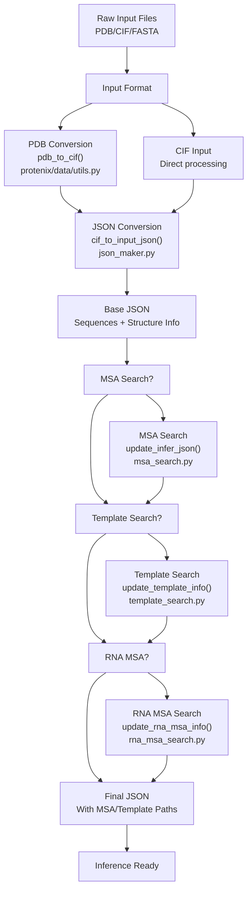
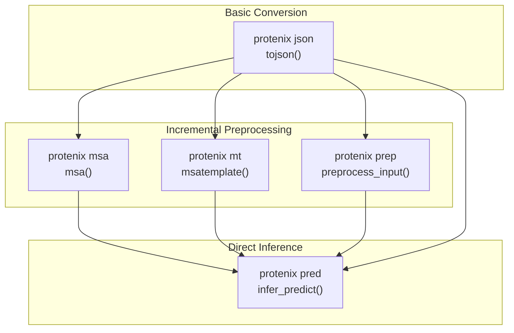
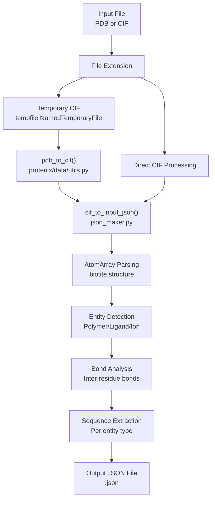
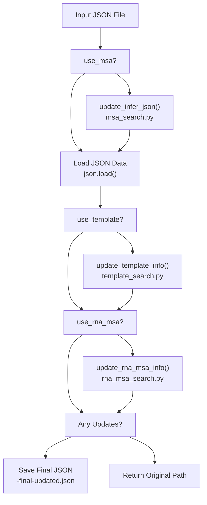

# Input Preparation and Conversion

> **Relevant source files**
> * [docs/docker_installation.md](https://github.com/bytedance/Protenix/blob/c3bfc365/docs/docker_installation.md?plain=1)
> * [docs/infer_json_format.md](https://github.com/bytedance/Protenix/blob/c3bfc365/docs/infer_json_format.md?plain=1)
> * [protenix/data/inference/json_parser.py](https://github.com/bytedance/Protenix/blob/c3bfc365/protenix/data/inference/json_parser.py)
> * [runner/batch_inference.py](https://github.com/bytedance/Protenix/blob/c3bfc365/runner/batch_inference.py)

This document describes the input preparation and conversion system in Protenix, covering how raw structural data (PDB/CIF files) and sequence information (FASTA) are transformed into the JSON format required for inference. For information about MSA generation and template search that follows input preparation, see [Multiple Sequence Alignment](/bytedance/Protenix/3.3-multiple-sequence-alignment). For executing predictions with prepared inputs, see [Running Inference](/bytedance/Protenix/3.4-running-inference).

## Purpose and Scope

The input preparation system handles:

* Conversion of PDB and CIF files to the standardized JSON input format [protenix/data/inference/json_maker.py L36](https://github.com/bytedance/Protenix/blob/c3bfc365/protenix/data/inference/json_maker.py#L36-L36)
* Parsing and validation of molecular entities including proteins, DNA, RNA, ligands, and ions [docs/infer_json_format.md L30-L36](https://github.com/bytedance/Protenix/blob/c3bfc365/docs/infer_json_format.md?plain=1#L30-L36)
* Handling of chemical modifications, covalent bonds, and structural constraints [docs/infer_json_format.md L202-L241](https://github.com/bytedance/Protenix/blob/c3bfc365/docs/infer_json_format.md?plain=1#L202-L241)
* Integration with MSA and template search workflows [runner/batch_inference.py L70-L111](https://github.com/bytedance/Protenix/blob/c3bfc365/runner/batch_inference.py#L70-L111)
* Generation of inference-ready JSON files with optional preprocessing paths [runner/batch_inference.py L167-L177](https://github.com/bytedance/Protenix/blob/c3bfc365/runner/batch_inference.py#L167-L177)

Sources: [runner/batch_inference.py L1-L177](https://github.com/bytedance/Protenix/blob/c3bfc365/runner/batch_inference.py#L1-L177)

 [docs/infer_json_format.md L1-L241](https://github.com/bytedance/Protenix/blob/c3bfc365/docs/infer_json_format.md?plain=1#L1-L241)

## Input Preparation Workflow

The input preparation pipeline transforms raw structural data through several stages before inference:

Title: Protenix Input Preparation Pipeline



**Workflow Description**: Input files progress through format conversion, then optionally through MSA, template, and RNA MSA searches. Each search stage updates the JSON file with file paths to the generated data.

Sources: [runner/batch_inference.py L69-L163](https://github.com/bytedance/Protenix/blob/c3bfc365/runner/batch_inference.py#L69-L163)

 [runner/batch_inference.py L409-L536](https://github.com/bytedance/Protenix/blob/c3bfc365/runner/batch_inference.py#L409-L536)

## CLI Commands for Input Preparation

Protenix provides several CLI commands to prepare inputs at different stages:

| Command | Purpose | Key Function | Output |
| --- | --- | --- | --- |
| `protenix json` | Convert PDB/CIF to JSON | `tojson()` | Base JSON file |
| `protenix msa` | Perform MSA search | `msa()` | JSON with MSA paths |
| `protenix mt` | MSA + Template search | `msatemplate()` | JSON with MSA + template paths |
| `protenix prep` | Full preprocessing | `preprocess_input()` | JSON with all paths |

### Command Hierarchy

Title: Protenix CLI Entry Point Mapping



**Usage Pattern**: Users can choose the level of preprocessing based on their needs. Each command builds on the previous stage's output.

Sources: [runner/batch_inference.py L70-L163](https://github.com/bytedance/Protenix/blob/c3bfc365/runner/batch_inference.py#L70-L163)

 [runner/batch_inference.py L43-L51](https://github.com/bytedance/Protenix/blob/c3bfc365/runner/batch_inference.py#L43-L51)

## PDB/CIF to JSON Conversion

### The tojson Command

The `tojson` command converts PDB or CIF files to the JSON format required for inference. It uses `pdb_to_cif` to normalize inputs [protenix/data/utils.py L38](https://github.com/bytedance/Protenix/blob/c3bfc365/protenix/data/utils.py#L38-L38)

**Parameters:**

* `--input` (`-i`): Input PDB/CIF file or directory.
* `--out_dir` (`-o`): Output directory for JSON files.
* `--altloc`: Alternate location selection (`first` or specific letter).
* `--assembly_id`: Bioassembly ID for structure extension.

Sources: [runner/batch_inference.py L36-L38](https://github.com/bytedance/Protenix/blob/c3bfc365/runner/batch_inference.py#L36-L38)

 [protenix/data/utils.py L38](https://github.com/bytedance/Protenix/blob/c3bfc365/protenix/data/utils.py#L38-L38)

### Conversion Process

Title: Structural Data to JSON Entity Space



**Process Details**: PDB files are first converted to CIF format using a temporary file. Both paths then parse the structure into an `AtomArray`, detect entities by polymer type, analyze bonding patterns, and extract sequences per entity.

Sources: [runner/batch_inference.py L36-L38](https://github.com/bytedance/Protenix/blob/c3bfc365/runner/batch_inference.py#L36-L38)

 [protenix/data/inference/json_maker.py L36](https://github.com/bytedance/Protenix/blob/c3bfc365/protenix/data/inference/json_maker.py#L36-L36)

## JSON Format Specification

### Top-Level Structure

The input JSON file is a list of task dictionaries, where each task represents one prediction job [docs/infer_json_format.md L12-L21](https://github.com/bytedance/Protenix/blob/c3bfc365/docs/infer_json_format.md?plain=1#L12-L21)

:

```
[  {    "name": "example_task",    "sequences": [...],    "covalent_bonds": [...]  }]
```

**Field Descriptions:**

* `name`: Task identifier string [docs/infer_json_format.md L24](https://github.com/bytedance/Protenix/blob/c3bfc365/docs/infer_json_format.md?plain=1#L24-L24)
* `sequences`: List of molecular entity definitions [docs/infer_json_format.md L25](https://github.com/bytedance/Protenix/blob/c3bfc365/docs/infer_json_format.md?plain=1#L25-L25)
* `covalent_bonds`: Optional inter-entity bonds [docs/infer_json_format.md L26](https://github.com/bytedance/Protenix/blob/c3bfc365/docs/infer_json_format.md?plain=1#L26-L26)

Sources: [docs/infer_json_format.md L10-L27](https://github.com/bytedance/Protenix/blob/c3bfc365/docs/infer_json_format.md?plain=1#L10-L27)

### Sequence Entity Types

Protenix supports five distinct entity types in the `sequences` list [docs/infer_json_format.md L31-L36](https://github.com/bytedance/Protenix/blob/c3bfc365/docs/infer_json_format.md?plain=1#L31-L36)

:

1. **`proteinChain`**: Standard proteins using 20 amino acids [docs/infer_json_format.md L38-L60](https://github.com/bytedance/Protenix/blob/c3bfc365/docs/infer_json_format.md?plain=1#L38-L60)
2. **`dnaSequence`**: Single-stranded DNA (A, T, G, C, N) [docs/infer_json_format.md L76-L105](https://github.com/bytedance/Protenix/blob/c3bfc365/docs/infer_json_format.md?plain=1#L76-L105)
3. **`rnaSequence`**: Single-stranded RNA (A, U, G, C, N) [docs/infer_json_format.md L113-L133](https://github.com/bytedance/Protenix/blob/c3bfc365/docs/infer_json_format.md?plain=1#L113-L133)
4. **`ligand`**: Small molecules via CCD code, SMILES, or file [docs/infer_json_format.md L35](https://github.com/bytedance/Protenix/blob/c3bfc365/docs/infer_json_format.md?plain=1#L35-L35)
5. **`ion`**: Metal or simple ions [docs/infer_json_format.md L36](https://github.com/bytedance/Protenix/blob/c3bfc365/docs/infer_json_format.md?plain=1#L36-L36)

Sources: [docs/infer_json_format.md L30-L133](https://github.com/bytedance/Protenix/blob/c3bfc365/docs/infer_json_format.md?plain=1#L30-L133)

### Protein Chain Specification

```json
{  "proteinChain": {    "sequence": "PREACHINGS",    "count": 1,    "modifications": [      {        "ptmType": "CCD_HY3",        "ptmPosition": 1      }    ],    "pairedMsaPath": "/path/to/pairing.a3m",    "unpairedMsaPath": "/path/to/non_pairing.a3m",    "templatesPath": "/path/to/hmmsearch.a3m"  }}
```

**Field Details:**

* `sequence`: 20 standard amino acids + `X` [docs/infer_json_format.md L60](https://github.com/bytedance/Protenix/blob/c3bfc365/docs/infer_json_format.md?plain=1#L60-L60)
* `modifications`: Optional list for post-translational modifications [docs/infer_json_format.md L63](https://github.com/bytedance/Protenix/blob/c3bfc365/docs/infer_json_format.md?plain=1#L63-L63)
* `pairedMsaPath`/`unpairedMsaPath`: Absolute paths to precomputed MSA files [docs/infer_json_format.md L66-L67](https://github.com/bytedance/Protenix/blob/c3bfc365/docs/infer_json_format.md?plain=1#L66-L67)

Sources: [docs/infer_json_format.md L38-L73](https://github.com/bytedance/Protenix/blob/c3bfc365/docs/infer_json_format.md?plain=1#L38-L73)

### Ligand Specification

Ligands support multiple input formats [docs/infer_json_format.md L3-L8](https://github.com/bytedance/Protenix/blob/c3bfc365/docs/infer_json_format.md?plain=1#L3-L8)

:

* **CCD Code**: `CCD_ATP`. Multiple codes for glycans (e.g., `NAG-NAG`) [docs/infer_json_format.md L7](https://github.com/bytedance/Protenix/blob/c3bfc365/docs/infer_json_format.md?plain=1#L7-L7)
* **SMILES**: Direct string input [docs/infer_json_format.md L6](https://github.com/bytedance/Protenix/blob/c3bfc365/docs/infer_json_format.md?plain=1#L6-L6)
* **File**: `FILE_/path/to/mol.sdf` [docs/infer_json_format.md L6](https://github.com/bytedance/Protenix/blob/c3bfc365/docs/infer_json_format.md?plain=1#L6-L6)

Sources: [docs/infer_json_format.md L1-L9](https://github.com/bytedance/Protenix/blob/c3bfc365/docs/infer_json_format.md?plain=1#L1-L9)

## Covalent Bonds Between Entities

Covalent bonds can be specified between different entities [docs/infer_json_format.md L26](https://github.com/bytedance/Protenix/blob/c3bfc365/docs/infer_json_format.md?plain=1#L26-L26)

 This is useful for covalent ligands or glycans attached to proteins.

**Field Semantics:**

* `entity1/entity2`: Entity order in `sequences` list (1-indexed).
* `position1/position2`: Residue position in sequence or ligand index.
* `atom1/atom2`: Atom name (CCD) or index (SMILES/FILE).

Sources: [docs/infer_json_format.md L202-L241](https://github.com/bytedance/Protenix/blob/c3bfc365/docs/infer_json_format.md?plain=1#L202-L241)

## Input Preprocessing Pipeline

The `preprocess_input()` function in `runner/batch_inference.py` orchestrates the complete search workflow [runner/batch_inference.py L70-L111](https://github.com/bytedance/Protenix/blob/c3bfc365/runner/batch_inference.py#L70-L111)

Title: Preprocessing Execution Flow



**Function Details:**

* **Protein MSA**: Calls `update_infer_json` [runner/batch_inference.py L113-L115](https://github.com/bytedance/Protenix/blob/c3bfc365/runner/batch_inference.py#L113-L115)
* **Template**: Calls `update_template_info` [runner/batch_inference.py L125-L130](https://github.com/bytedance/Protenix/blob/c3bfc365/runner/batch_inference.py#L125-L130)
* **RNA MSA**: Calls `update_rna_msa_info` [runner/batch_inference.py L135-L145](https://github.com/bytedance/Protenix/blob/c3bfc365/runner/batch_inference.py#L135-L145)

Sources: [runner/batch_inference.py L112-L164](https://github.com/bytedance/Protenix/blob/c3bfc365/runner/batch_inference.py#L112-L164)

## Structural Processing and Leaving Atoms

During conversion, the system manages "leaving atoms" (atoms lost during polymerization) using CCD definitions [protenix/data/inference/json_parser.py L181-L191](https://github.com/bytedance/Protenix/blob/c3bfc365/protenix/data/inference/json_parser.py#L181-L191)

**Key Functions:**

* `remove_leaving_atoms`: Removes atoms based on inter-residue bond counts and CCD info [protenix/data/inference/json_parser.py L181-L191](https://github.com/bytedance/Protenix/blob/c3bfc365/protenix/data/inference/json_parser.py#L181-L191)
* `add_reference_features`: Adds `ref_pos`, `ref_charge`, and `ref_mask` to the `AtomArray` for model consumption [protenix/data/inference/json_parser.py L78-L90](https://github.com/bytedance/Protenix/blob/c3bfc365/protenix/data/inference/json_parser.py#L78-L90)

Sources: [protenix/data/inference/json_parser.py L78-L120](https://github.com/bytedance/Protenix/blob/c3bfc365/protenix/data/inference/json_parser.py#L78-L120)

 [protenix/data/inference/json_parser.py L181-L213](https://github.com/bytedance/Protenix/blob/c3bfc365/protenix/data/inference/json_parser.py#L181-L213)