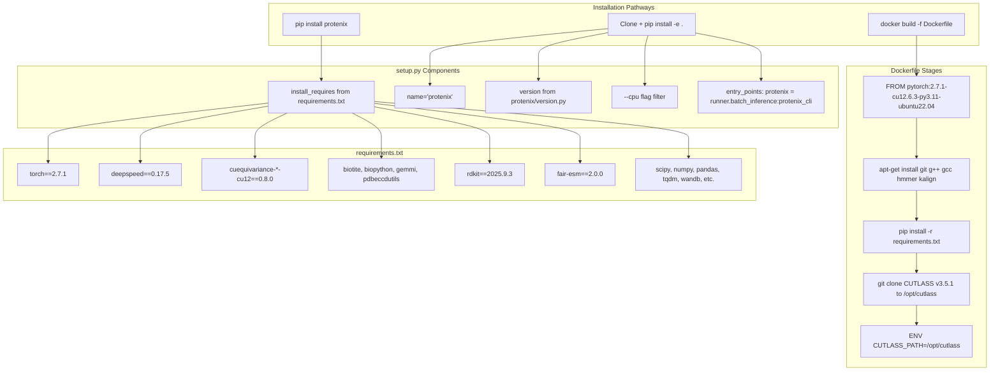

# Installation and Setup

> **Relevant source files**
> * [Dockerfile](https://github.com/bytedance/Protenix/blob/c3bfc365/Dockerfile)
> * [docs/docker_installation.md](https://github.com/bytedance/Protenix/blob/c3bfc365/docs/docker_installation.md?plain=1)
> * [docs/infer_json_format.md](https://github.com/bytedance/Protenix/blob/c3bfc365/docs/infer_json_format.md?plain=1)
> * [protenix/__init__.py](https://github.com/bytedance/Protenix/blob/c3bfc365/protenix/__init__.py)
> * [requirements.txt](https://github.com/bytedance/Protenix/blob/c3bfc365/requirements.txt)
> * [setup.py](https://github.com/bytedance/Protenix/blob/c3bfc365/setup.py)

This document provides comprehensive instructions for installing Protenix on your system. It covers installation methods via pip, source, and Docker, including CPU-only configurations and dependency management.

## Overview

Protenix requires Python 3.11+ and is distributed as a standard Python package with optional Docker containerization. The installation process configures the `protenix` command-line interface and installs all required dependencies for structure prediction, MSA generation, and model training.

## Prerequisites

### System Requirements

| Requirement | Specification |
| --- | --- |
| **Python Version** | ≥3.11 [setup.py L50](https://github.com/bytedance/Protenix/blob/c3bfc365/setup.py#L50-L50) |
| **Operating System** | Linux (Ubuntu 22.04 recommended) [Dockerfile L1](https://github.com/bytedance/Protenix/blob/c3bfc365/Dockerfile#L1-L1) |
| **GPU (Optional)** | NVIDIA GPU with CUDA 12.6.3 support [Dockerfile L1](https://github.com/bytedance/Protenix/blob/c3bfc365/Dockerfile#L1-L1) |
| **Memory** | 16GB+ RAM (32GB+ recommended for training) |
| **Disk Space** | 10GB+ for dependencies and model checkpoints |

### Required System Packages

For source installations or when building from the Dockerfile, ensure the following system packages are available:

* `git`, `g++`, `gcc`, `make` - Development toolchain [Dockerfile L13-L17](https://github.com/bytedance/Protenix/blob/c3bfc365/Dockerfile#L13-L17)
* `libc6-dev` - C standard library development files [Dockerfile L16](https://github.com/bytedance/Protenix/blob/c3bfc365/Dockerfile#L16-L16)
* `postgresql` - Database support [Dockerfile L18](https://github.com/bytedance/Protenix/blob/c3bfc365/Dockerfile#L18-L18)
* `hmmer`, `kalign` - Bioinformatics tools for MSA generation [Dockerfile L19-L20](https://github.com/bytedance/Protenix/blob/c3bfc365/Dockerfile#L19-L20)

Sources: [Dockerfile L11-L22](https://github.com/bytedance/Protenix/blob/c3bfc365/Dockerfile#L11-L22)

## Installation Methods

The following diagram shows the installation pathways and their key components:



Sources: [setup.py L48-L77](https://github.com/bytedance/Protenix/blob/c3bfc365/setup.py#L48-L77)

 [requirements.txt L1-L33](https://github.com/bytedance/Protenix/blob/c3bfc365/requirements.txt#L1-L33)

 [Dockerfile L1-L34](https://github.com/bytedance/Protenix/blob/c3bfc365/Dockerfile#L1-L34)

### Method 1: Installation via pip

The simplest installation method for end users:

```
pip install protenix
```

This command:

1. Downloads the `protenix` package.
2. Installs all dependencies from [requirements.txt L1-L33](https://github.com/bytedance/Protenix/blob/c3bfc365/requirements.txt#L1-L33)
3. Creates the `protenix` CLI entry point via [setup.py L72-L76](https://github.com/bytedance/Protenix/blob/c3bfc365/setup.py#L72-L76)

**CPU-Only Installation**:

```
pip install protenix --cpu
```

The `--cpu` flag triggers logic in [setup.py L37-L46](https://github.com/bytedance/Protenix/blob/c3bfc365/setup.py#L37-L46)

 that filters out NVIDIA and CUDA packages from the dependency list.

Sources: [setup.py L37-L77](https://github.com/bytedance/Protenix/blob/c3bfc365/setup.py#L37-L77)

### Method 2: Installation from Source

For developers who need editable installations:

```markdown
# Clone the repositorygit clone https://github.com/bytedance/Protenix.gitcd Protenix # Install in editable modepip install -e .
```

**CPU-Only from Source**:

```
pip install -e . --cpu
```

The [setup.py L37-L46](https://github.com/bytedance/Protenix/blob/c3bfc365/setup.py#L37-L46)

 logic removes packages matching `"nvidia"` or `"cuda"` from the requirements list when the `--cpu` flag is detected.

Sources: [setup.py L15-L77](https://github.com/bytedance/Protenix/blob/c3bfc365/setup.py#L15-L77)

### Method 3: Docker Installation

For reproducible, containerized deployments, Protenix provides a `Dockerfile` and pre-built images.

**Using Pre-built Image**:

```markdown
# Pull the imagedocker pull ai4s-share-public-cn-beijing.cr.volces.com/release/protenix:1.0.0.4 # Run with interactive shell and GPU supportdocker run --gpus all -it \    -v "$(pwd)":/app \    -v /dev/shm:/dev/shm \    ai4s-share-public-cn-beijing.cr.volces.com/release/protenix:1.0.0.4 \    /bin/bash
```

**Building from Scratch**:

```
docker build -t protenix:latest -f Dockerfile .
```

**Docker Build Process**:

1. **Base Image**: Starts from `pytorch:2.7.1-cu12.6.3-py3.11-ubuntu22.04` [Dockerfile L1](https://github.com/bytedance/Protenix/blob/c3bfc365/Dockerfile#L1-L1)
2. **System Dependencies**: Installs `hmmer`, `kalign`, and build tools [Dockerfile L11-L22](https://github.com/bytedance/Protenix/blob/c3bfc365/Dockerfile#L11-L22)
3. **Python Stack**: Installs dependencies from `requirements.txt` [Dockerfile L29-L30](https://github.com/bytedance/Protenix/blob/c3bfc365/Dockerfile#L29-L30)
4. **CUTLASS**: Clones NVIDIA CUTLASS v3.5.1 and sets `CUTLASS_PATH` [Dockerfile L8-L33](https://github.com/bytedance/Protenix/blob/c3bfc365/Dockerfile#L8-L33)

Sources: [Dockerfile L1-L34](https://github.com/bytedance/Protenix/blob/c3bfc365/Dockerfile#L1-L34)

 [docs/docker_installation.md L1-L46](https://github.com/bytedance/Protenix/blob/c3bfc365/docs/docker_installation.md?plain=1#L1-L46)

## Dependency Overview

### Core Dependencies

| Category | Package | Version | Purpose |
| --- | --- | --- | --- |
| **Deep Learning** | `torch` | 2.7.1 | Core framework [requirements.txt L1](https://github.com/bytedance/Protenix/blob/c3bfc365/requirements.txt#L1-L1) |
|  | `deepspeed` | 0.17.5 | Distributed training [requirements.txt L23](https://github.com/bytedance/Protenix/blob/c3bfc365/requirements.txt#L23-L23) |
|  | `triton` | 3.3.1 | GPU kernels [requirements.txt L25](https://github.com/bytedance/Protenix/blob/c3bfc365/requirements.txt#L25-L25) |
| **Geometric DL** | `cuequivariance-torch` | 0.8.0 | Equivariant layers [requirements.txt L5](https://github.com/bytedance/Protenix/blob/c3bfc365/requirements.txt#L5-L5) |
| **Bio/Cheminformatics** | `biotite` | 1.4.0 | Structure manipulation [requirements.txt L16](https://github.com/bytedance/Protenix/blob/c3bfc365/requirements.txt#L16-L16) |
|  | `rdkit` | 2025.9.3 | Ligand handling [requirements.txt L14](https://github.com/bytedance/Protenix/blob/c3bfc365/requirements.txt#L14-L14) |
|  | `gemmi` | 0.6.7 | CIF/PDB parsing [requirements.txt L18](https://github.com/bytedance/Protenix/blob/c3bfc365/requirements.txt#L18-L18) |
|  | `fair-esm` | 2.0.0 | ESM embeddings [requirements.txt L20](https://github.com/bytedance/Protenix/blob/c3bfc365/requirements.txt#L20-L20) |
| **Scientific Stack** | `numpy` | 2.4.1 | Numerical arrays [requirements.txt L31](https://github.com/bytedance/Protenix/blob/c3bfc365/requirements.txt#L31-L31) |
|  | `scipy` | >=1.9.0 | Scientific algorithms [requirements.txt L6](https://github.com/bytedance/Protenix/blob/c3bfc365/requirements.txt#L6-L6) |

Sources: [requirements.txt L1-L33](https://github.com/bytedance/Protenix/blob/c3bfc365/requirements.txt#L1-L33)

### CPU-Only Dependency Filtering

The [setup.py L37-L46](https://github.com/bytedance/Protenix/blob/c3bfc365/setup.py#L37-L46)

 implements CPU-only installation by filtering dependencies:

```
if "--cpu" in sys.argv:    to_drop = [x for x in install_requires if "nvidia" in x or "cuda" in x]    for x in to_drop:        install_requires.remove(x)    sys.argv.remove("--cpu")
```

This specifically removes packages like `cuequivariance-ops-torch-cu12` [requirements.txt L4](https://github.com/bytedance/Protenix/blob/c3bfc365/requirements.txt#L4-L4)

 which require a GPU environment.

Sources: [setup.py L37-L46](https://github.com/bytedance/Protenix/blob/c3bfc365/setup.py#L37-L46)

## Package Structure and Entry Points

### CLI Entry Point

The package defines a console script entry point in [setup.py L72-L76](https://github.com/bytedance/Protenix/blob/c3bfc365/setup.py#L72-L76)

:

```
entry_points={    "console_scripts": [        "protenix = runner.batch_inference:protenix_cli",    ],}
```

This maps the `protenix` command to the `protenix_cli` function in `runner/batch_inference.py`. After installation, users can verify the setup by running:

```
protenix --help
```

### Package Data

Custom kernels are included in the package distribution [setup.py L66-L68](https://github.com/bytedance/Protenix/blob/c3bfc365/setup.py#L66-L68)

:

```
package_data={    "protenix": ["model/layer_norm/kernel/*"],}
```

Sources: [setup.py L66-L76](https://github.com/bytedance/Protenix/blob/c3bfc365/setup.py#L66-L76)

## Verification

After installation, verify the environment:

1. **CLI Check**: Run `protenix --help` to see available commands.
2. **Version Check**: ```javascript import protenixprint(protenix.__version__) ``` This reads the version defined in `protenix/version.py` [protenix/__init__.py L1](https://github.com/bytedance/Protenix/blob/c3bfc365/protenix/__init__.py#L1-L1)  [setup.py L23-L27](https://github.com/bytedance/Protenix/blob/c3bfc365/setup.py#L23-L27)
3. **GPU Check**: ```javascript import torchprint(torch.cuda.is_available()) ```

Sources: [setup.py L23-L27](https://github.com/bytedance/Protenix/blob/c3bfc365/setup.py#L23-L27)

 [protenix/__init__.py L1](https://github.com/bytedance/Protenix/blob/c3bfc365/protenix/__init__.py#L1-L1)