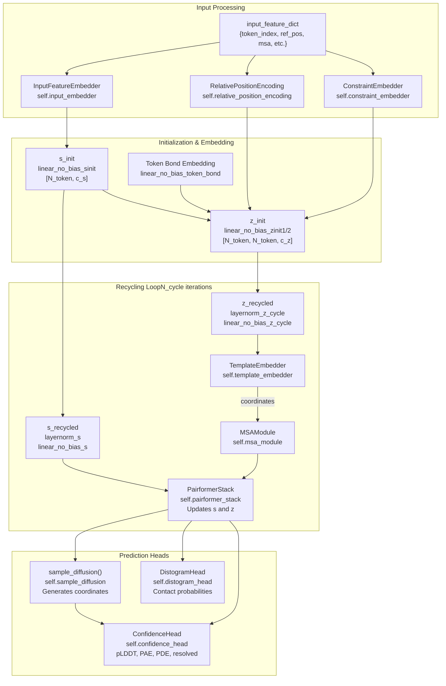
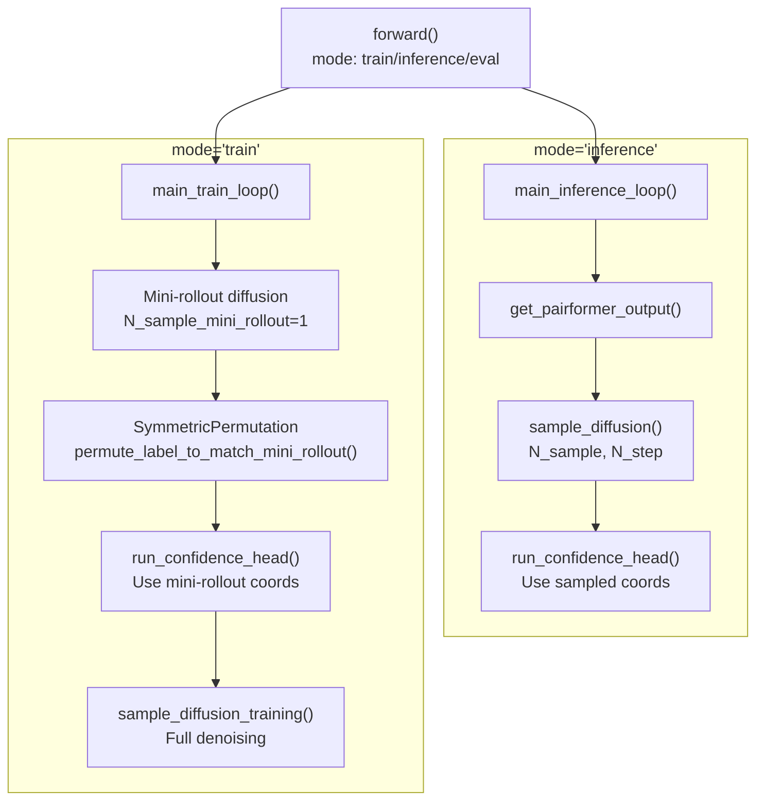

# Model Architecture

> **Relevant source files**
> * [configs/configs_base.py](https://github.com/bytedance/Protenix/blob/c3bfc365/configs/configs_base.py)
> * [protenix/model/modules/fused_ops.py](https://github.com/bytedance/Protenix/blob/c3bfc365/protenix/model/modules/fused_ops.py)
> * [protenix/model/modules/pairformer.py](https://github.com/bytedance/Protenix/blob/c3bfc365/protenix/model/modules/pairformer.py)
> * [protenix/model/protenix.py](https://github.com/bytedance/Protenix/blob/c3bfc365/protenix/model/protenix.py)
> * [tests/test_fused_dropout_add.py](https://github.com/bytedance/Protenix/blob/c3bfc365/tests/test_fused_dropout_add.py)

This document describes the neural network architecture of Protenix, including the main `Protenix` model class, its constituent modules, and the different model variants available. For information about how features are prepared before entering the model, see [Data Processing Pipeline](/bytedance/Protenix/4-data-processing-pipeline). For details on the training process, see [Training System](/bytedance/Protenix/6-training-system). For model configuration options, see [Configuration System](/bytedance/Protenix/7-configuration-system).

## Overview

The Protenix model implements Algorithm 1 (Main Inference/Train Loop) from AlphaFold 3. It is a PyTorch-based neural network consisting of several major components that work together to predict 3D molecular structures from sequence and feature inputs.

**Sources:** [protenix/model/protenix.py L91-L94](https://github.com/bytedance/Protenix/blob/c3bfc365/protenix/model/protenix.py#L91-L94)

## Model Class and Main Components

The `Protenix` class ([protenix/model/protenix.py L91](https://github.com/bytedance/Protenix/blob/c3bfc365/protenix/model/protenix.py#L91-L91)

) is the top-level neural network module that orchestrates all sub-modules and manages the forward pass logic. It is initialized with a configuration object that controls architectural hyperparameters, training settings, and inference behavior.

### Primary Modules

The model consists of the following neural network modules, instantiated during initialization:

| Module | Class | Purpose | Configuration Key |
| --- | --- | --- | --- |
| Input Embedder | `InputFeatureEmbedder` | Embeds raw input features into token representations | `model.input_embedder` |
| Relative Position Encoding | `RelativePositionEncoding` | Encodes spatial relationships between tokens | `model.relative_position_encoding` |
| Template Embedder | `TemplateEmbedder` | Processes template structural information | `model.template_embedder` |
| MSA Module | `MSAModule` | Processes multiple sequence alignments | `model.msa_module` |
| Constraint Embedder | `ConstraintEmbedder` | Embeds constraint features (pocket, contact, substructure) | `model.constraint_embedder` |
| Pairformer Stack | `PairformerStack` | Core transformer for token and pair representations | `model.pairformer` |
| Diffusion Module | `DiffusionModule` | Generates atomic coordinates via diffusion | `model.diffusion_module` |
| Distogram Head | `DistogramHead` | Predicts inter-token distance distributions | `model.distogram_head` |
| Confidence Head | `ConfidenceHead` | Predicts quality metrics (pLDDT, PAE, PDE, resolved) | `model.confidence_head` |

**Sources:** [protenix/model/protenix.py L121-L138](https://github.com/bytedance/Protenix/blob/c3bfc365/protenix/model/protenix.py#L121-L138)

### Architectural Dimensions

The model uses three primary embedding dimensions defined in the configuration:

* `c_s_inputs`: Dimension of raw input features (default `449`)
* `c_s`: Dimension of single (token) representations (default `384`)
* `c_z`: Dimension of pair representations (default `128`)

These dimensions are connected through linear projection layers initialized in the constructor, such as `linear_no_bias_sinit` and `linear_no_bias_zinit1/2`.

**Sources:** [protenix/model/protenix.py L140-L165](https://github.com/bytedance/Protenix/blob/c3bfc365/protenix/model/protenix.py#L140-L165)

 [configs/configs_base.py L112-L114](https://github.com/bytedance/Protenix/blob/c3bfc365/configs/configs_base.py#L112-L114)

## Model Architecture Flow

The following diagram shows how data flows through the Protenix model during forward passes, mapping conceptual components to their code implementations.

**Sources:** [protenix/model/protenix.py L170-L284](https://github.com/bytedance/Protenix/blob/c3bfc365/protenix/model/protenix.py#L170-L284)

### Forward Pass Structure

The `get_pairformer_output()` method ([protenix/model/protenix.py L170-L284](https://github.com/bytedance/Protenix/blob/c3bfc365/protenix/model/protenix.py#L170-L284)

) implements the core forward pass from input features to pairformer outputs. The process follows these steps:

1. **Input Embedding:** Raw input features are embedded into `s_inputs` (token features) via `InputFeatureEmbedder`.
2. **Initialization:** Single and pair representations are initialized: * `s_init = linear_no_bias_sinit(s_inputs)` * `z_init = linear_no_bias_zinit1(s_init) + linear_no_bias_zinit2(s_init) + relative_position + token_bonds + constraints`
3. **Recycling Loop:** Iterates `N_cycle` times: * Apply recycling transformations: `z = z_init + linear_no_bias_z_cycle(layernorm_z_cycle(z))` * Process templates: `z = z + template_embedder(z)` * Process MSA: `z = msa_module(z, s_inputs)` * Update single representation: `s = s_init + linear_no_bias_s(layernorm_s(s))` * Run pairformer: `s, z = pairformer_stack(s, z)`

Gradient computation is enabled only on the final recycling iteration during training (except when `train_confidence_only=True`).

**Sources:** [protenix/model/protenix.py L170-L284](https://github.com/bytedance/Protenix/blob/c3bfc365/protenix/model/protenix.py#L170-L284)

## Model Variants

Protenix offers several model variants (base/mini/tiny) with different architectural parameters. These are configured through the model name and associated configuration files.

### Variant Overview

| Model Variant | N_cycle | Pairformer Blocks | Purpose |
| --- | --- | --- | --- |
| `protenix_base` | 10 | 48 | Standard production model |
| `protenix_mini` | 4 | 16 | Faster inference, lower memory |
| `protenix_tiny` | 4 | 8 | Development and testing |

**Sources:** [configs/configs_base.py L54-L118](https://github.com/bytedance/Protenix/blob/c3bfc365/configs/configs_base.py#L54-L118)

 [protenix/model/protenix.py L105](https://github.com/bytedance/Protenix/blob/c3bfc365/protenix/model/protenix.py#L105-L105)

### Optimized Kernels

The model supports multiple implementations for heavy operations like Triangle Attention and Multiplicative updates, which can be selected via configuration:

* **Triton/Cuequivariance:** Optimized kernels for high performance.
* **PyTorch:** Native implementation for compatibility.
* **DeepSpeed:** Fused attention kernels.

**Sources:** [protenix/model/modules/pairformer.py L123-L131](https://github.com/bytedance/Protenix/blob/c3bfc365/protenix/model/modules/pairformer.py#L123-L131)

 [configs/configs_base.py L129-L130](https://github.com/bytedance/Protenix/blob/c3bfc365/configs/configs_base.py#L129-L130)

## Training vs Inference Modes

The `forward()` method routes execution to different loops based on the `self.training` state and provided inputs.

### Training Loop (main_train_loop)

The training loop ([protenix/model/protenix.py L569-L755](https://github.com/bytedance/Protenix/blob/c3bfc365/protenix/model/protenix.py#L569-L755)

) implements a multi-stage approach:

1. **Mini-rollout (lines 633-668):** Performs a lightweight diffusion sampling to generate a predicted structure for symmetry alignment.
2. **Label Permutation (lines 670-678):** Uses `SymmetricPermutation` to align ground truth labels with the mini-rollout prediction.
3. **Confidence Prediction (lines 680-704):** Runs the confidence head using coordinates from the mini-rollout.
4. **Full Denoising (lines 710-744):** Performs full diffusion training with a batch of samples at various noise levels.

**Sources:** [protenix/model/protenix.py L569-L755](https://github.com/bytedance/Protenix/blob/c3bfc365/protenix/model/protenix.py#L569-L755)

### Inference Loop (main_inference_loop)

The inference loop ([protenix/model/protenix.py L329-L567](https://github.com/bytedance/Protenix/blob/c3bfc365/protenix/model/protenix.py#L329-L567)

) is optimized for prediction:

1. **Pairformer Forward (lines 417-439):** Executes the trunk of the model.
2. **Diffusion Sampling (lines 441-488):** Generates `N_sample` predictions using `sample_diffusion()`.
3. **Confidence Evaluation (lines 499-519):** Runs the confidence head on all sampled coordinates to compute metrics like pLDDT and PAE.

**Sources:** [protenix/model/protenix.py L329-L567](https://github.com/bytedance/Protenix/blob/c3bfc365/protenix/model/protenix.py#L329-L567)

## Optimization Features

### Shared Variable Caching

When `enable_diffusion_shared_vars_cache=True`, the model caches variables that remain constant across diffusion steps (like pair representations and atom attention encoder outputs), significantly speeding up the sampling process.

**Sources:** [protenix/model/protenix.py L101-L632](https://github.com/bytedance/Protenix/blob/c3bfc365/protenix/model/protenix.py#L101-L632)

### Fused Operations

Protenix includes custom Triton kernels for common operations, such as `dropout_add_rowwise`, which fuses dropout and residual addition to reduce memory traffic.

**Sources:** [protenix/model/modules/fused_ops.py L15-L212](https://github.com/bytedance/Protenix/blob/c3bfc365/protenix/model/modules/fused_ops.py#L15-L212)

### TF32 and Mixed Precision

* **TF32:** Enabled via `torch.backends.cuda.matmul.allow_tf32` for Ampere GPUs.
* **AMP Control:** Selective disabling of mixed precision for sensitive modules (like diffusion sampling or confidence head) via the `skip_amp` configuration.

**Sources:** [protenix/model/protenix.py L99](https://github.com/bytedance/Protenix/blob/c3bfc365/protenix/model/protenix.py#L99-L99)

 [configs/configs_base.py L137-L145](https://github.com/bytedance/Protenix/blob/c3bfc365/configs/configs_base.py#L137-L145)