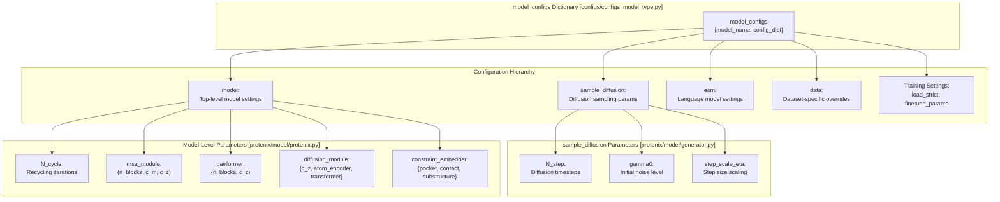
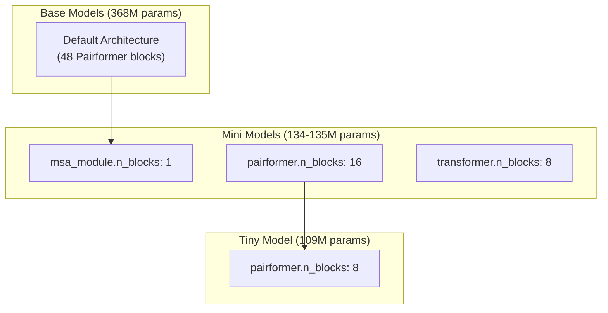

# Model Configuration

> **Relevant source files**
> * [configs/configs_base.py](https://github.com/bytedance/Protenix/blob/c3bfc365/configs/configs_base.py)
> * [configs/configs_model_type.py](https://github.com/bytedance/Protenix/blob/c3bfc365/configs/configs_model_type.py)
> * [protenix/model/protenix.py](https://github.com/bytedance/Protenix/blob/c3bfc365/protenix/model/protenix.py)
> * [protenix/web_service/dependency_url.py](https://github.com/bytedance/Protenix/blob/c3bfc365/protenix/web_service/dependency_url.py)

## Purpose and Scope

This page documents the `model_configs` dictionary defined in `configs/configs_model_type.py`, which controls all model variant specifications in Protenix. The model configuration system defines distinct model variants with different architectures, parameter counts, and feature sets (MSA, ESM embeddings, templates, and structural constraints).

For information about the overall configuration hierarchy and how model configs interact with base configs and data configs, see [Configuration Architecture](/bytedance/Protenix/7.1-configuration-architecture). For runtime inference settings like seed counts and sampling parameters, see [Data and Inference Configuration](/bytedance/Protenix/7.3-data-and-inference-configuration). For detailed architecture explanations of the neural network components these configs control, see [Neural Network Components](/bytedance/Protenix/5.2-neural-network-components).

**Sources:** [configs/configs_model_type.py L1-L50](https://github.com/bytedance/Protenix/blob/c3bfc365/configs/configs_model_type.py#L1-L50)

 [protenix/model/protenix.py L91-L139](https://github.com/bytedance/Protenix/blob/c3bfc365/protenix/model/protenix.py#L91-L139)

---

## Model Variants Overview

Protenix provides several pre-configured model variants spanning different size classes (base, mini, tiny, and scaled-up v2) with optional features (constraints, ESM/ISM embeddings, templates, RNA MSA). The naming convention follows the pattern: `protenix_{size}_{features}_{version}` or `protenix_{size}_{cutoff}_{version}` for date-specific variants.

### Variant Comparison Table

| Model Name | Parameters | N_cycle | N_step | MSA | RNA MSA | Template | ESM/ISM | Constraints | Data Cutoff |
| --- | --- | --- | --- | --- | --- | --- | --- | --- | --- |
| `protenix-v2` | 464.44M | 10 | 200 | ✅ | ✅ | ✅ | ❌ | ❌ | 2025-06-30 |
| `protenix_base_default_v1.0.0` | 368.48M | 10 | 200 | ✅ | ✅ | ✅ | ❌ | ❌ | 2021-09-30 |
| `protenix_base_20250630_v1.0.0` | 368.48M | 10 | 200 | ✅ | ✅ | ✅ | ❌ | ❌ | 2025-06-30 |
| `protenix_base_default_v0.5.0` | 368.09M | 10 | 200 | ✅ | ❌ | ❌ | ❌ | ❌ | 2021-09-30 |
| `protenix_base_constraint_v0.5.0` | 368.30M | 10 | 200 | ✅ | ❌ | ❌ | ✅ (ESM2-3B) | ✅ | 2021-09-30 |
| `protenix_mini_default_v0.5.0` | 134.06M | 4 | 5 | ✅ | ❌ | ❌ | ❌ | ❌ | 2021-09-30 |
| `protenix_mini_esm_v0.5.0` | 135.22M | 4 | 5 | ✅* | ❌ | ❌ | ESM2-3B | ❌ | 2021-09-30 |
| `protenix_mini_ism_v0.5.0` | 135.22M | 4 | 5 | ✅* | ❌ | ❌ | ISM | ❌ | 2021-09-30 |
| `protenix_tiny_default_v0.5.0` | 109.50M | 4 | 5 | ✅ | ❌ | ❌ | ❌ | ❌ | 2021-09-30 |

*MSA disabled by default (`use_msa: False`) for efficiency when ESM/ISM is enabled.

**Naming Convention Components:**

* **size**: `base` (full accuracy), `mini` (balanced), `tiny` (maximum speed), `v2` (scaled-up).
* **features**: `default` (standard), `constraint` (+ binding site constraints), `esm`/`ism` (+ language model embeddings).
* **cutoff**: Date-specific training data cutoff (e.g., `20250630` for June 30, 2025).
* **version**: Semantic versioning `v{major}.{minor}.{patch}`.

**Sources:** [configs/configs_model_type.py L22-L50](https://github.com/bytedance/Protenix/blob/c3bfc365/configs/configs_model_type.py#L22-L50)

 [protenix/web_service/dependency_url.py L15-L36](https://github.com/bytedance/Protenix/blob/c3bfc365/protenix/web_service/dependency_url.py#L15-L36)

---

## Configuration Dictionary Structure

The `model_configs` dictionary maps model variant names to nested configuration dictionaries. Each model variant's configuration can override settings at multiple levels, including core architecture and sampling parameters.



**Key Configuration Sections:**

1. **`model`**: Architecture parameters controlling neural network structure.
2. **`sample_diffusion`**: Diffusion sampling hyperparameters for coordinate generation.
3. **`esm`**: Language model integration settings (e.g., `esm2-3b`).
4. **`data`**: Dataset-specific overrides (primarily for constraint model training).
5. **Training flags**: `load_strict`, `finetune_params_with_substring`, `train_confidence_only`.

**Sources:** [configs/configs_model_type.py L51-L137](https://github.com/bytedance/Protenix/blob/c3bfc365/configs/configs_model_type.py#L51-L137)

 [protenix/model/protenix.py L96-L139](https://github.com/bytedance/Protenix/blob/c3bfc365/protenix/model/protenix.py#L96-L139)

 [configs/configs_base.py L108-L175](https://github.com/bytedance/Protenix/blob/c3bfc365/configs/configs_base.py#L108-L175)

---

## Core Model Parameters

### Recycling Cycles: N_cycle

Controls how many times the model iterates through the Pairformer stack, refining its predictions.

| Model Variant | N_cycle | Usage |
| --- | --- | --- |
| Base/V2 models | 10 | Full accuracy research predictions |
| Mini/Tiny models | 4 | Fast production inference |

**Sources:** [configs/configs_model_type.py L56](https://github.com/bytedance/Protenix/blob/c3bfc365/configs/configs_model_type.py#L56-L56)

 [configs/configs_model_type.py L91](https://github.com/bytedance/Protenix/blob/c3bfc365/configs/configs_model_type.py#L91-L91)

 [protenix/model/protenix.py L105](https://github.com/bytedance/Protenix/blob/c3bfc365/protenix/model/protenix.py#L105-L105)

### Template Embedder: template_embedder

Available in v1.0.0+ and v2 models, processes structural template information.

```css
"template_embedder": {    "c_z": 256,        # Hidden dimension (v2)    "n_blocks": 2,     # Number of template processing blocks    "hidden_scale_up": True, # Scale up internal layers}
```

The template embedder is present in `protenix_base_default_v1.0.0`, `protenix_base_20250630_v1.0.0`, and `protenix-v2`.

**Sources:** [configs/configs_model_type.py L60-L64](https://github.com/bytedance/Protenix/blob/c3bfc365/configs/configs_model_type.py#L60-L64)

 [configs/configs_model_type.py L92-L94](https://github.com/bytedance/Protenix/blob/c3bfc365/configs/configs_model_type.py#L92-L94)

### Diffusion Sampling: sample_diffusion

Controls the diffusion process that generates atomic coordinates.

**Parameters:**

* **`N_step`**: Number of diffusion timesteps during sampling. * Base/V2 models: 200 steps (high quality). * Mini/Tiny models: 5 steps (fast generation).
* **`gamma0`**: Initial noise level for the diffusion schedule (0 for Mini/Tiny).
* **`step_scale_eta`**: Step size scaling factor (1.0 for Mini/Tiny).

**Sources:** [configs/configs_model_type.py L85-L88](https://github.com/bytedance/Protenix/blob/c3bfc365/configs/configs_model_type.py#L85-L88)

 [configs/configs_model_type.py L96-L98](https://github.com/bytedance/Protenix/blob/c3bfc365/configs/configs_model_type.py#L96-L98)

 [configs/configs_base.py L176-L184](https://github.com/bytedance/Protenix/blob/c3bfc365/configs/configs_base.py#L176-L184)

---

## Architecture Parameters

### Scaled-up V2 Configuration

`protenix-v2` increases the capacity of several modules by doubling the pair representation dimension `c_z` and enabling `hidden_scale_up`.

| Parameter | Base (v1.0.0) | V2 |
| --- | --- | --- |
| `c_z` | 128 | 256 |
| `diffusion_batch_size` | 48 | 64 |
| `hidden_scale_up` | False | True |
| `msa_module.c_m` | 64 (default) | 128 |

**Sources:** [configs/configs_model_type.py L52-L84](https://github.com/bytedance/Protenix/blob/c3bfc365/configs/configs_model_type.py#L52-L84)

 [configs/configs_base.py L113-L127](https://github.com/bytedance/Protenix/blob/c3bfc365/configs/configs_base.py#L113-L127)

### Module Block Configuration

Architecture parameters control the depth of neural network modules.



**Sources:** [configs/configs_model_type.py L161-L177](https://github.com/bytedance/Protenix/blob/c3bfc365/configs/configs_model_type.py#L161-L177)

 [configs/configs_model_type.py L189-L205](https://github.com/bytedance/Protenix/blob/c3bfc365/configs/configs_model_type.py#L189-L205)

 [configs/configs_base.py L118](https://github.com/bytedance/Protenix/blob/c3bfc365/configs/configs_base.py#L118-L118)

---

## Constraint Configuration

The constraint model (`protenix_base_constraint_v0.5.0`) incorporates specialized embedders for structural guidance.

### Constraint Embedder Configuration

```
"constraint_embedder": {    "pocket_embedder": {"enable": True},    "contact_embedder": {"enable": True},    "substructure_embedder": {"enable": True},    "contact_atom_embedder": {"enable": True},}
```

**Training Data Constraints:**
The `data` section for constraint models defines the probability of applying synthetic constraints during training (e.g., `pocket.prob: 0.2`, `substructure.prob: 0.5`).

**Sources:** [configs/configs_model_type.py L123-L136](https://github.com/bytedance/Protenix/blob/c3bfc365/configs/configs_model_type.py#L123-L136)

 [configs/configs_model_type.py L140-L168](https://github.com/bytedance/Protenix/blob/c3bfc365/configs/configs_model_type.py#L140-L168)

---

## ESM Integration

Mini models with ESM/ISM variants integrate protein language model embeddings from `esm2-3b`.

### ESM Model Configuration

```css
# protenix_mini_esm_v0.5.0"esm": {    "enable": True,    "model_name": "esm2-3b",}"use_msa": False, # Bypasses MSA search for speed
```

The `InputFeatureEmbedder` uses these configurations to decide whether to process ESM features or standard MSA features.

**Sources:** [configs/configs_model_type.py L181-L184](https://github.com/bytedance/Protenix/blob/c3bfc365/configs/configs_model_type.py#L181-L184)

 [protenix/model/protenix.py L120-L123](https://github.com/bytedance/Protenix/blob/c3bfc365/protenix/model/protenix.py#L120-L123)

 [configs/configs_base.py L66-L71](https://github.com/bytedance/Protenix/blob/c3bfc365/configs/configs_base.py#L66-L71)

---

## Training-Specific Settings

### Load Strictness: load_strict

Controls whether checkpoint loading requires exact parameter name matches. Set to `False` when fine-tuning from a base model to a constraint model as new parameters are added.

**Sources:** [configs/configs_model_type.py L185](https://github.com/bytedance/Protenix/blob/c3bfc365/configs/configs_model_type.py#L185-L185)

 [configs/configs_base.py L39](https://github.com/bytedance/Protenix/blob/c3bfc365/configs/configs_base.py#L39-L39)

### Fine-tuning Parameter Filter: finetune_params_with_substring

Specifies which parameters should be trained when fine-tuning. For the constraint model, this targets the newly added embedder layers:

```
"finetune_params_with_substring": [    "constraint_embedder.substructure_z_embedder",    "constraint_embedder.pocket_z_embedder",    "constraint_embedder.contact_z_embedder",    "constraint_embedder.contact_atom_z_embedder",]
```

**Sources:** [configs/configs_model_type.py L187-L192](https://github.com/bytedance/Protenix/blob/c3bfc365/configs/configs_model_type.py#L187-L192)

 [configs/configs_base.py L33-L35](https://github.com/bytedance/Protenix/blob/c3bfc365/configs/configs_base.py#L33-L35)

### Confidence-Only Training: train_confidence_only

A boolean flag for the final fine-tuning stage. When `True`, diffusion and distogram losses are disabled (weights set to 0.0).

**Sources:** [protenix/model/protenix.py L107-L110](https://github.com/bytedance/Protenix/blob/c3bfc365/protenix/model/protenix.py#L107-L110)

 [configs/configs_base.py L45](https://github.com/bytedance/Protenix/blob/c3bfc365/configs/configs_base.py#L45-L45)

---

## Model Selection Guide

### Use Case Recommendations

| Use Case | Recommended Model | Rationale |
| --- | --- | --- |
| State-of-the-art Research | `protenix-v2` | Scaled-up architecture, templates, RNA MSA, latest data |
| Benchmarking vs AF3 | `protenix_base_default_v1.0.0` | 2021-09-30 cutoff, full feature set |
| Binding Site Refinement | `protenix_base_constraint_v0.5.0` | Integrated structural constraints |
| High-throughput (No MSA) | `protenix_mini_esm_v0.5.0` | Uses ESM2 embeddings, skips MSA search |
| Mobile/Edge Deployment | `protenix_tiny_default_v0.5.0` | Minimum parameter count (109M) |

**Sources:** [configs/configs_model_type.py L22-L50](https://github.com/bytedance/Protenix/blob/c3bfc365/configs/configs_model_type.py#L22-L50)

 [protenix/web_service/dependency_url.py L15-L28](https://github.com/bytedance/Protenix/blob/c3bfc365/protenix/web_service/dependency_url.py#L15-L28)