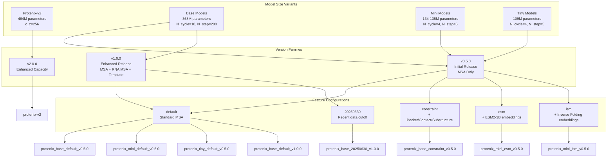
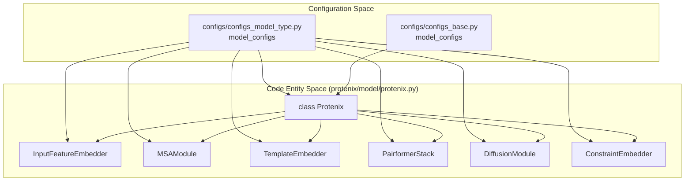

# Model Variants and Configuration

> **Relevant source files**
> * [assets/protenix-v2.png](https://github.com/bytedance/Protenix/blob/c3bfc365/assets/protenix-v2.png)
> * [configs/configs_base.py](https://github.com/bytedance/Protenix/blob/c3bfc365/configs/configs_base.py)
> * [configs/configs_model_type.py](https://github.com/bytedance/Protenix/blob/c3bfc365/configs/configs_model_type.py)
> * [docs/PX2.pdf](https://github.com/bytedance/Protenix/blob/c3bfc365/docs/PX2.pdf)
> * [docs/supported_models.md](https://github.com/bytedance/Protenix/blob/c3bfc365/docs/supported_models.md?plain=1)
> * [protenix/data/core/geometry_featurizer.py](https://github.com/bytedance/Protenix/blob/c3bfc365/protenix/data/core/geometry_featurizer.py)
> * [protenix/data/inference/infer_dataloader.py](https://github.com/bytedance/Protenix/blob/c3bfc365/protenix/data/inference/infer_dataloader.py)
> * [protenix/model/protenix.py](https://github.com/bytedance/Protenix/blob/c3bfc365/protenix/model/protenix.py)
> * [protenix/web_service/dependency_url.py](https://github.com/bytedance/Protenix/blob/c3bfc365/protenix/web_service/dependency_url.py)
> * [tests/test_fetch_remote_cif.py](https://github.com/bytedance/Protenix/blob/c3bfc365/tests/test_fetch_remote_cif.py)

This document provides a comprehensive reference for Protenix model variants, their configurations, and how they are defined in the codebase. It covers the different model sizes (base, mini, tiny), version distinctions (v0.5.0, v1.0.0, and v2), feature configurations, and the configuration system architecture.

For information about the neural network architecture components themselves, see [Neural Network Components](/bytedance/Protenix/5.2-neural-network-components). For training-specific configurations, see [Training Execution](/bytedance/Protenix/6.2-training-execution). For inference configuration options, see [Running Inference](/bytedance/Protenix/3.4-running-inference).

## Model Naming Convention

Protenix uses a structured naming convention for all model variants:

```
protenix_{model_size}_{features}_{version}
```

Where:

* **model_size**: `base`, `mini`, or `tiny` (indicating parameter count and computational cost)
* **features**: Feature set identifier such as `default`, `constraint`, `esm`, `ism`, or data cutoff dates like `20250630`
* **version**: Semantic version in format `v{x}.{y}.{z}` (e.g., `v1.0.0`, `v0.5.0`)

This naming convention is documented in `configs/configs_model_type.py` and enforced throughout the codebase for consistency [configs/configs_model_type.py L15-L20](https://github.com/bytedance/Protenix/blob/c3bfc365/configs/configs_model_type.py#L15-L20)

**Sources:** [configs/configs_model_type.py L15-L46](https://github.com/bytedance/Protenix/blob/c3bfc365/configs/configs_model_type.py#L15-L46)

## Model Variant Hierarchy

The following diagram illustrates the relationship between model sizes, versions, and feature sets.

**Title: Protenix Model Family Hierarchy**



**Sources:** [configs/configs_model_type.py L22-L50](https://github.com/bytedance/Protenix/blob/c3bfc365/configs/configs_model_type.py#L22-L50)

 [docs/supported_models.md L7-L25](https://github.com/bytedance/Protenix/blob/c3bfc365/docs/supported_models.md?plain=1#L7-L25)

## Model Size Variants

### Protenix-v2 (464M Parameters)

`protenix-v2` is an enhanced-capacity version featuring increased representation dimensionality and expanded parameter space (~464.44M) [docs/supported_models.md L58-L59](https://github.com/bytedance/Protenix/blob/c3bfc365/docs/supported_models.md?plain=1#L58-L59)

 It uses a wider pair representation (`c_z=256`) and a larger diffusion batch size [configs/configs_model_type.py L52-L54](https://github.com/bytedance/Protenix/blob/c3bfc365/configs/configs_model_type.py#L52-L54)

**Key Configuration Parameters:**

* `c_z`: 256 (pair representation dimension) [configs/configs_model_type.py L53](https://github.com/bytedance/Protenix/blob/c3bfc365/configs/configs_model_type.py#L53-L53)
* `N_cycle`: 10 [configs/configs_model_type.py L56](https://github.com/bytedance/Protenix/blob/c3bfc365/configs/configs_model_type.py#L56-L56)
* `sample_diffusion.N_step`: 200 [configs/configs_model_type.py L86](https://github.com/bytedance/Protenix/blob/c3bfc365/configs/configs_model_type.py#L86-L86)
* `diffusion_batch_size`: 64 [configs/configs_model_type.py L54](https://github.com/bytedance/Protenix/blob/c3bfc365/configs/configs_model_type.py#L54-L54)

### Base Models (368M Parameters)

Base models are the standard full-scale models with **368 million parameters** [docs/supported_models.md L31-L32](https://github.com/bytedance/Protenix/blob/c3bfc365/docs/supported_models.md?plain=1#L31-L32)

**Key Configuration Parameters:**

* `N_cycle`: 10 [configs/configs_model_type.py L91](https://github.com/bytedance/Protenix/blob/c3bfc365/configs/configs_model_type.py#L91-L91)
* `sample_diffusion.N_step`: 200 [configs/configs_model_type.py L97](https://github.com/bytedance/Protenix/blob/c3bfc365/configs/configs_model_type.py#L97-L97)
* `c_z`: 128 (default) [configs/configs_base.py L113](https://github.com/bytedance/Protenix/blob/c3bfc365/configs/configs_base.py#L113-L113)

| Model Name | Parameters | MSA | RNA MSA | Template | Purpose |
| --- | --- | --- | --- | --- | --- |
| `protenix_base_default_v1.0.0` | 368.48M | ✅ | ✅ | ✅ | Fair benchmarking [configs/configs_model_type.py L37](https://github.com/bytedance/Protenix/blob/c3bfc365/configs/configs_model_type.py#L37-L37) |
| `protenix_base_20250630_v1.0.0` | 368.48M | ✅ | ✅ | ✅ | Practical applications [configs/configs_model_type.py L43](https://github.com/bytedance/Protenix/blob/c3bfc365/configs/configs_model_type.py#L43-L43) |
| `protenix_base_default_v0.5.0` | 368.09M | ✅ | ❌ | ❌ | Legacy compatibility [configs/configs_model_type.py L28](https://github.com/bytedance/Protenix/blob/c3bfc365/configs/configs_model_type.py#L28-L28) |

### Mini Models (134-135M Parameters)

Mini models reduce parameter count by approximately **64%** [docs/supported_models.md L38-L39](https://github.com/bytedance/Protenix/blob/c3bfc365/docs/supported_models.md?plain=1#L38-L39)

**Key Configuration Parameters:**

* `N_cycle`: 4 [configs/configs_model_type.py L161](https://github.com/bytedance/Protenix/blob/c3bfc365/configs/configs_model_type.py#L161-L161)
* `sample_diffusion.N_step`: 5 [configs/configs_model_type.py L157](https://github.com/bytedance/Protenix/blob/c3bfc365/configs/configs_model_type.py#L157-L157)
* `pairformer.n_blocks`: 16 [configs/configs_model_type.py L165](https://github.com/bytedance/Protenix/blob/c3bfc365/configs/configs_model_type.py#L165-L165)

### Tiny Models (109M Parameters)

Tiny models provide the smallest footprint with **109 million parameters** [docs/supported_models.md L38-L39](https://github.com/bytedance/Protenix/blob/c3bfc365/docs/supported_models.md?plain=1#L38-L39)

**Key Configuration Parameters:**

* `N_cycle`: 4 [configs/configs_model_type.py L188](https://github.com/bytedance/Protenix/blob/c3bfc365/configs/configs_model_type.py#L188-L188)
* `pairformer.n_blocks`: 8 (further reduced from mini) [configs/configs_model_type.py L192](https://github.com/bytedance/Protenix/blob/c3bfc365/configs/configs_model_type.py#L192-L192)

**Sources:** [configs/configs_model_type.py L51-L207](https://github.com/bytedance/Protenix/blob/c3bfc365/configs/configs_model_type.py#L51-L207)

 [docs/supported_models.md L31-L63](https://github.com/bytedance/Protenix/blob/c3bfc365/docs/supported_models.md?plain=1#L31-L63)

## Version System

### Version v0.5.0 - Initial Release

Supports MSA for proteins but lacks RNA MSA and template features [docs/supported_models.md L20-L25](https://github.com/bytedance/Protenix/blob/c3bfc365/docs/supported_models.md?plain=1#L20-L25)

 All models use the 2021-09-30 training data cutoff [configs/configs_model_type.py L24](https://github.com/bytedance/Protenix/blob/c3bfc365/configs/configs_model_type.py#L24-L24)

### Version v1.0.0 - Enhanced Release

Introduces **RNA MSA** and **Template features** [docs/supported_models.md L18-L19](https://github.com/bytedance/Protenix/blob/c3bfc365/docs/supported_models.md?plain=1#L18-L19)

* `protenix_base_default_v1.0.0`: 2021-09-30 cutoff for benchmarking [configs/configs_model_type.py L41](https://github.com/bytedance/Protenix/blob/c3bfc365/configs/configs_model_type.py#L41-L41)
* `protenix_base_20250630_v1.0.0`: 2025-06-30 cutoff for real-world usage [configs/configs_model_type.py L39](https://github.com/bytedance/Protenix/blob/c3bfc365/configs/configs_model_type.py#L39-L39)

**Sources:** [configs/configs_model_type.py L23-L43](https://github.com/bytedance/Protenix/blob/c3bfc365/configs/configs_model_type.py#L23-L43)

 [docs/supported_models.md L15-L25](https://github.com/bytedance/Protenix/blob/c3bfc365/docs/supported_models.md?plain=1#L15-L25)

## Feature Configurations

### Constraint Feature Configuration

The `protenix_base_constraint_v0.5.0` variant incorporates experimental priors [configs/configs_model_type.py L117](https://github.com/bytedance/Protenix/blob/c3bfc365/configs/configs_model_type.py#L117-L117)

**Constraint Types:**

1. **Pocket** (`pocket_embedder`): Binding pocket info [configs/configs_model_type.py L124](https://github.com/bytedance/Protenix/blob/c3bfc365/configs/configs_model_type.py#L124-L124)
2. **Contact** (`contact_embedder`): Residue-level contacts [configs/configs_model_type.py L127](https://github.com/bytedance/Protenix/blob/c3bfc365/configs/configs_model_type.py#L127-L127)
3. **Substructure** (`substructure_embedder`): Partial structural info [configs/configs_model_type.py L130](https://github.com/bytedance/Protenix/blob/c3bfc365/configs/configs_model_type.py#L130-L130)
4. **Contact Atom** (`contact_atom_embedder`): Atom-level distance constraints [configs/configs_model_type.py L133](https://github.com/bytedance/Protenix/blob/c3bfc365/configs/configs_model_type.py#L133-L133)

### ESM/ISM Feature Configuration

Mini models can integrate the ESM2-3B protein language model [configs/configs_model_type.py L235-L236](https://github.com/bytedance/Protenix/blob/c3bfc365/configs/configs_model_type.py#L235-L236)

* `protenix_mini_esm_v0.5.0`: Uses standard ESM2 embeddings [docs/supported_models.md L55](https://github.com/bytedance/Protenix/blob/c3bfc365/docs/supported_models.md?plain=1#L55-L55)
* `protenix_mini_ism_v0.5.0`: Uses Inverse Folding (ISM) embeddings [docs/supported_models.md L55](https://github.com/bytedance/Protenix/blob/c3bfc365/docs/supported_models.md?plain=1#L55-L55)
* Both models disable MSA by default (`use_msa: False`) for efficiency [configs/configs_model_type.py L239](https://github.com/bytedance/Protenix/blob/c3bfc365/configs/configs_model_type.py#L239-L239)

**Sources:** [configs/configs_model_type.py L117-L274](https://github.com/bytedance/Protenix/blob/c3bfc365/configs/configs_model_type.py#L117-L274)

 [docs/supported_models.md L46-L56](https://github.com/bytedance/Protenix/blob/c3bfc365/docs/supported_models.md?plain=1#L46-L56)

## Configuration Data Flow

The following diagram bridges the high-level configuration names to the specific code entities that consume them during the model initialization and inference process.

**Title: Configuration to Code Entity Mapping**



**Sources:** [protenix/model/protenix.py L91-L138](https://github.com/bytedance/Protenix/blob/c3bfc365/protenix/model/protenix.py#L91-L138)

 [configs/configs_model_type.py L51-L88](https://github.com/bytedance/Protenix/blob/c3bfc365/configs/configs_model_type.py#L51-L88)

 [configs/configs_base.py L108-L145](https://github.com/bytedance/Protenix/blob/c3bfc365/configs/configs_base.py#L108-L145)

## Detailed Configuration Mapping

The `Protenix` class in `protenix/model/protenix.py` acts as the central hub, initializing sub-modules based on the provided `configs` object [protenix/model/protenix.py L96-L138](https://github.com/bytedance/Protenix/blob/c3bfc365/protenix/model/protenix.py#L96-L138)

| Config Parameter | Target Code Entity | Purpose |
| --- | --- | --- |
| `configs.model.input_embedder` | `InputFeatureEmbedder` | Token and atom embedding [protenix/model/protenix.py L121](https://github.com/bytedance/Protenix/blob/c3bfc365/protenix/model/protenix.py#L121-L121) |
| `configs.model.msa_module` | `MSAModule` | MSA representation [protenix/model/protenix.py L128](https://github.com/bytedance/Protenix/blob/c3bfc365/protenix/model/protenix.py#L128-L128) |
| `configs.model.template_embedder` | `TemplateEmbedder` | Template processing [protenix/model/protenix.py L127](https://github.com/bytedance/Protenix/blob/c3bfc365/protenix/model/protenix.py#L127-L127) |
| `configs.model.pairformer` | `PairformerStack` | Main trunk processing [protenix/model/protenix.py L135](https://github.com/bytedance/Protenix/blob/c3bfc365/protenix/model/protenix.py#L135-L135) |
| `configs.model.diffusion_module` | `DiffusionModule` | Structure generation [protenix/model/protenix.py L136](https://github.com/bytedance/Protenix/blob/c3bfc365/protenix/model/protenix.py#L136-L136) |
| `configs.model.constraint_embedder` | `ConstraintEmbedder` | Handling priors [protenix/model/protenix.py L132](https://github.com/bytedance/Protenix/blob/c3bfc365/protenix/model/protenix.py#L132-L132) |
| `configs.model.N_cycle` | `Protenix.get_pairformer_output` | Recycling loop count [protenix/model/protenix.py L105](https://github.com/bytedance/Protenix/blob/c3bfc365/protenix/model/protenix.py#L105-L105) |

**Sources:** [protenix/model/protenix.py L91-L165](https://github.com/bytedance/Protenix/blob/c3bfc365/protenix/model/protenix.py#L91-L165)

 [configs/configs_model_type.py L51-L275](https://github.com/bytedance/Protenix/blob/c3bfc365/configs/configs_model_type.py#L51-L275)

## Using Model Variants

To use a specific model variant during inference, the `--model_name` (or `-n`) flag is used with the `protenix pred` command. The system fetches the corresponding configuration and checkpoint URL [protenix/web_service/dependency_url.py L15-L28](https://github.com/bytedance/Protenix/blob/c3bfc365/protenix/web_service/dependency_url.py#L15-L28)

```markdown
# Example: Running inference with the v1.0.0 base modelprotenix pred -i input.json -o output_dir -n protenix_base_default_v1.0.0
```

The `InferenceDataset` in `protenix/data/inference/infer_dataloader.py` uses these configurations to determine whether to enable MSA, templates, or ESM featurization [protenix/data/inference/infer_dataloader.py L79-L123](https://github.com/bytedance/Protenix/blob/c3bfc365/protenix/data/inference/infer_dataloader.py#L79-L123)

**Sources:** [protenix/data/inference/infer_dataloader.py L70-L138](https://github.com/bytedance/Protenix/blob/c3bfc365/protenix/data/inference/infer_dataloader.py#L70-L138)

 [protenix/web_service/dependency_url.py L15-L28](https://github.com/bytedance/Protenix/blob/c3bfc365/protenix/web_service/dependency_url.py#L15-L28)