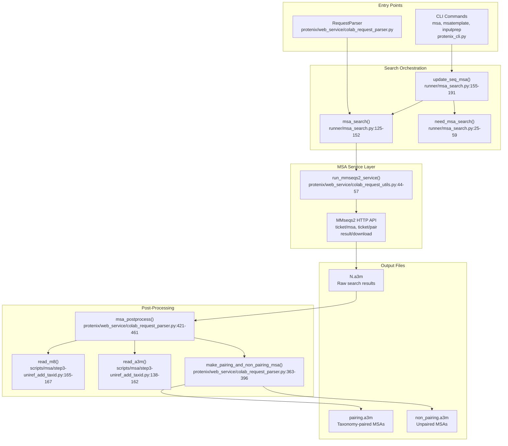
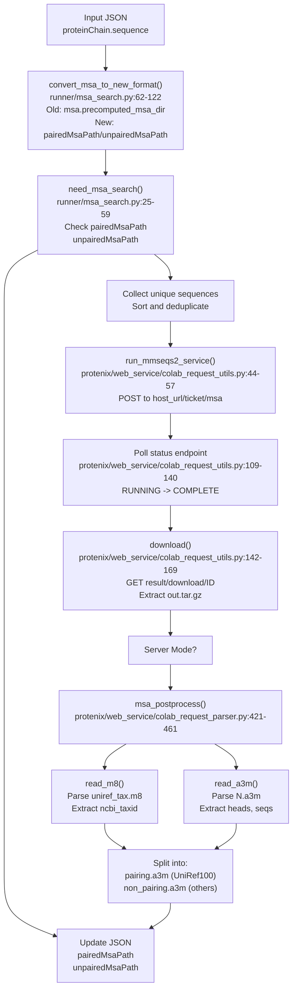

# Multiple Sequence Alignment

> **Relevant source files**
> * [docs/colabfold_compatible_msa.md](https://github.com/bytedance/Protenix/blob/c3bfc365/docs/colabfold_compatible_msa.md?plain=1)
> * [protenix/data/msa/msa_utils.py](https://github.com/bytedance/Protenix/blob/c3bfc365/protenix/data/msa/msa_utils.py)
> * [protenix/web_service/colab_request_parser.py](https://github.com/bytedance/Protenix/blob/c3bfc365/protenix/web_service/colab_request_parser.py)
> * [protenix/web_service/colab_request_utils.py](https://github.com/bytedance/Protenix/blob/c3bfc365/protenix/web_service/colab_request_utils.py)
> * [runner/msa_search.py](https://github.com/bytedance/Protenix/blob/c3bfc365/runner/msa_search.py)
> * [scripts/msa/step1-get_prot_seq.py](https://github.com/bytedance/Protenix/blob/c3bfc365/scripts/msa/step1-get_prot_seq.py)
> * [scripts/msa/step3-uniref_add_taxid.py](https://github.com/bytedance/Protenix/blob/c3bfc365/scripts/msa/step3-uniref_add_taxid.py)
> * [scripts/msa/step4-split_msa_to_uniref_and_others.py](https://github.com/bytedance/Protenix/blob/c3bfc365/scripts/msa/step4-split_msa_to_uniref_and_others.py)
> * [scripts/msa/utils.py](https://github.com/bytedance/Protenix/blob/c3bfc365/scripts/msa/utils.py)
> * [tests/test_msa_encoding.py](https://github.com/bytedance/Protenix/blob/c3bfc365/tests/test_msa_encoding.py)

## Purpose and Scope

This document describes the Multiple Sequence Alignment (MSA) system in Protenix, which generates evolutionary information for protein and RNA sequences to improve structure prediction accuracy. The system handles MSA searches via web services or local databases, processes MSA files into paired and unpaired alignments, and integrates this data into the inference pipeline.

The MSA pipeline is a critical component for both training and inference, providing the `Pairformer` and `MSA Module` with the co-evolutionary signals necessary for high-accuracy biomolecular structure prediction.

---

## MSA System Architecture

The MSA system consists of search services, post-processing components, and integration layers that work together to enrich protein and RNA sequences with evolutionary information.

### Component Overview

**Sources:** [runner/msa_search.py L125-L191](https://github.com/bytedance/Protenix/blob/c3bfc365/runner/msa_search.py#L125-L191)

 [protenix/web_service/colab_request_parser.py L334-L461](https://github.com/bytedance/Protenix/blob/c3bfc365/protenix/web_service/colab_request_parser.py#L334-L461)

 [protenix/web_service/colab_request_utils.py L44-L57](https://github.com/bytedance/Protenix/blob/c3bfc365/protenix/web_service/colab_request_utils.py#L44-L57)

 [scripts/msa/step3-uniref_add_taxid.py L138-L167](https://github.com/bytedance/Protenix/blob/c3bfc365/scripts/msa/step3-uniref_add_taxid.py#L138-L167)

---

## MSA Search Workflow

The system supports two operational modes: "protenix" mode for bulk searches with taxonomy pairing, and "colabfold" mode for standard searches.

### Search and Processing Flow

**Sources:** [runner/msa_search.py L25-L191](https://github.com/bytedance/Protenix/blob/c3bfc365/runner/msa_search.py#L25-L191)

 [protenix/web_service/colab_request_utils.py L44-L169](https://github.com/bytedance/Protenix/blob/c3bfc365/protenix/web_service/colab_request_utils.py#L44-L169)

 [protenix/web_service/colab_request_parser.py L334-L461](https://github.com/bytedance/Protenix/blob/c3bfc365/protenix/web_service/colab_request_parser.py#L334-L461)

---

## MSA Core Logic and Numerical Conversion

The `MSACore` and `RawMsa` classes handle the transformation of raw A3M strings into numerical features used by the model.

### Sequence to Array Transformation

The system uses a vectorized NumPy LUT-based approach for high-performance parsing of MSA strings into numerical indices and deletion matrices.

| Feature | Description | Implementation |
| --- | --- | --- |
| `msa_arr` | Numerical indices of residues/bases | `MSACore.sequences_to_array` [protenix/data/msa/msa_utils.py L69-L119](https://github.com/bytedance/Protenix/blob/c3bfc365/protenix/data/msa/msa_utils.py#L69-L119) |
| `del_arr` | Count of deletions (insertions in query) | `MSACore.sequences_to_array` [protenix/data/msa/msa_utils.py L118-L119](https://github.com/bytedance/Protenix/blob/c3bfc365/protenix/data/msa/msa_utils.py#L118-L119) |
| `msa_mask` | Mask indicating valid MSA positions | `MSA_PAD_VALUES` [protenix/data/msa/msa_utils.py L49](https://github.com/bytedance/Protenix/blob/c3bfc365/protenix/data/msa/msa_utils.py#L49-L49) |

**Vectorized Parsing Implementation:**
The code converts ASCII ordinals to encoded values using a lookup table (LUT) and calculates deletion counts via cumulative sums of insertion masks [protenix/data/msa/msa_utils.py L98-L119](https://github.com/bytedance/Protenix/blob/c3bfc365/protenix/data/msa/msa_utils.py#L98-L119)

**Sources:** [protenix/data/msa/msa_utils.py L52-L119](https://github.com/bytedance/Protenix/blob/c3bfc365/protenix/data/msa/msa_utils.py#L52-L119)

 [tests/test_msa_encoding.py L37-L62](https://github.com/bytedance/Protenix/blob/c3bfc365/tests/test_msa_encoding.py#L37-L62)

---

## Web Service Integration

Protenix integrates with MMseqs2-based web services to perform MSA searches without requiring massive local databases.

### Request Management

The `RequestParser` class manages the lifecycle of an MSA search request:

1. **Input Parsing:** Extracts sequences from a request JSON [protenix/web_service/colab_request_parser.py L145-L165](https://github.com/bytedance/Protenix/blob/c3bfc365/protenix/web_service/colab_request_parser.py#L145-L165)
2. **Data Caching:** Downloads required data caches like CCD components and PDB clusters [protenix/web_service/colab_request_parser.py L102-L118](https://github.com/bytedance/Protenix/blob/c3bfc365/protenix/web_service/colab_request_parser.py#L102-L118)
3. **Complex Validation:** Enforces limits on total atoms (`MAX_ATOM_NUM = 60000`) and tokens (`MAX_TOKEN_NUM = 5000`) [protenix/web_service/colab_request_parser.py L41-L42](https://github.com/bytedance/Protenix/blob/c3bfc365/protenix/web_service/colab_request_parser.py#L41-L42)  [protenix/web_service/colab_request_parser.py L179-L182](https://github.com/bytedance/Protenix/blob/c3bfc365/protenix/web_service/colab_request_parser.py#L179-L182)
4. **Service Communication:** Utilizes `run_mmseqs2_service` to submit jobs and poll for results using `HTTPBasicAuth` [protenix/web_service/colab_request_utils.py L44-L107](https://github.com/bytedance/Protenix/blob/c3bfc365/protenix/web_service/colab_request_utils.py#L44-L107)

**Sources:** [protenix/web_service/colab_request_parser.py L86-L182](https://github.com/bytedance/Protenix/blob/c3bfc365/protenix/web_service/colab_request_parser.py#L86-L182)

 [protenix/web_service/colab_request_utils.py L44-L107](https://github.com/bytedance/Protenix/blob/c3bfc365/protenix/web_service/colab_request_utils.py#L44-L107)

---

## MSA Post-Processing and Pairing

A key feature of Protenix is the ability to pair sequences from different chains based on species information.

### Taxonomy ID Integration

The post-processing pipeline adds NCBI taxonomy IDs to MSA headers:

1. **Taxonomy Mapping:** `read_m8` parses the `.m8` file to map hit names to NCBI taxids [scripts/msa/step3-uniref_add_taxid.py L165-L173](https://github.com/bytedance/Protenix/blob/c3bfc365/scripts/msa/step3-uniref_add_taxid.py#L165-L173)
2. **Header Modification:** `make_pairing_and_non_pairing_msa` modifies headers to include taxonomy (e.g., `UniRef100_ID_TAXID/`) [protenix/web_service/colab_request_parser.py L363-L396](https://github.com/bytedance/Protenix/blob/c3bfc365/protenix/web_service/colab_request_parser.py#L363-L396)
3. **Splitting:** MSAs are split into `pairing.a3m` (UniRef100 hits with taxonomy) and `non_pairing.a3m` (others) [protenix/web_service/colab_request_parser.py L398-L412](https://github.com/bytedance/Protenix/blob/c3bfc365/protenix/web_service/colab_request_parser.py#L398-L412)

**Sources:** [scripts/msa/step3-uniref_add_taxid.py L138-L173](https://github.com/bytedance/Protenix/blob/c3bfc365/scripts/msa/step3-uniref_add_taxid.py#L138-L173)

 [protenix/web_service/colab_request_parser.py L363-L412](https://github.com/bytedance/Protenix/blob/c3bfc365/protenix/web_service/colab_request_parser.py#L363-L412)

---

## RNA MSA Search

RNA sequences utilize a different pipeline, often involving local search tools or specialized RNA databases.

### Search Logic

While protein MSAs typically use MMseqs2, RNA MSAs in the training pipeline are processed via specialized scripts:

* **Sequence Extraction:** `step1-get_prot_seq.py` identifies polymer types (ribonucleotide vs polypeptide) [scripts/msa/step1-get_prot_seq.py L41-L49](https://github.com/bytedance/Protenix/blob/c3bfc365/scripts/msa/step1-get_prot_seq.py#L41-L49)
* **NHMMER Pipeline:** RNA searches often utilize the HMMER suite (nhmmer) against databases like Rfam or RNAcentral [docs/colabfold_compatible_msa.md L3](https://github.com/bytedance/Protenix/blob/c3bfc365/docs/colabfold_compatible_msa.md?plain=1#L3-L3)

### RNA MSA Data Structure

RNA MSAs are stored as `unpairedMsaPath` in the inference JSON. The `RawMsa` class handles RNA-specific character maps (`MSA_RNA_SEQ_TO_ID`) during featurization [protenix/data/msa/msa_utils.py L89-L94](https://github.com/bytedance/Protenix/blob/c3bfc365/protenix/data/msa/msa_utils.py#L89-L94)

**Sources:** [scripts/msa/step1-get_prot_seq.py L29-L50](https://github.com/bytedance/Protenix/blob/c3bfc365/scripts/msa/step1-get_prot_seq.py#L29-L50)

 [protenix/data/msa/msa_utils.py L86-L94](https://github.com/bytedance/Protenix/blob/c3bfc365/protenix/data/msa/msa_utils.py#L86-L94)

 [docs/colabfold_compatible_msa.md L1-L5](https://github.com/bytedance/Protenix/blob/c3bfc365/docs/colabfold_compatible_msa.md?plain=1#L1-L5)

---

## Training Data Preparation

For training, Protenix provides a suite of scripts to generate MSAs from the wwPDB:

1. **Sequence Extraction:** `step1-get_prot_seq.py` parses MMCIF files to extract sequences and metadata [scripts/msa/step1-get_prot_seq.py L29-L142](https://github.com/bytedance/Protenix/blob/c3bfc365/scripts/msa/step1-get_prot_seq.py#L29-L142)
2. **Deduplication:** Sequences are deduplicated and exported to FASTA format [scripts/msa/step1-get_prot_seq.py L154-L164](https://github.com/bytedance/Protenix/blob/c3bfc365/scripts/msa/step1-get_prot_seq.py#L154-L164)
3. **Taxonomy Enrichment:** `step3-uniref_add_taxid.py` uses optimized block-binary reading to handle large mapping files [scripts/msa/step3-uniref_add_taxid.py L30-L135](https://github.com/bytedance/Protenix/blob/c3bfc365/scripts/msa/step3-uniref_add_taxid.py#L30-L135)
4. **MSA Splitting:** `step4-split_msa_to_uniref_and_others.py` uses shared memory (`SharedDict`) to efficiently process massive MSA datasets across multiple CPU cores [scripts/msa/step4-split_msa_to_uniref_and_others.py L37-L75](https://github.com/bytedance/Protenix/blob/c3bfc365/scripts/msa/step4-split_msa_to_uniref_and_others.py#L37-L75)  [scripts/msa/utils.py L55-L190](https://github.com/bytedance/Protenix/blob/c3bfc365/scripts/msa/utils.py#L55-L190)

**Sources:** [scripts/msa/step1-get_prot_seq.py L1-L181](https://github.com/bytedance/Protenix/blob/c3bfc365/scripts/msa/step1-get_prot_seq.py#L1-L181)

 [scripts/msa/step3-uniref_add_taxid.py L30-L135](https://github.com/bytedance/Protenix/blob/c3bfc365/scripts/msa/step3-uniref_add_taxid.py#L30-L135)

 [scripts/msa/step4-split_msa_to_uniref_and_others.py L37-L75](https://github.com/bytedance/Protenix/blob/c3bfc365/scripts/msa/step4-split_msa_to_uniref_and_others.py#L37-L75)

 [scripts/msa/utils.py L55-L190](https://github.com/bytedance/Protenix/blob/c3bfc365/scripts/msa/utils.py#L55-L190)