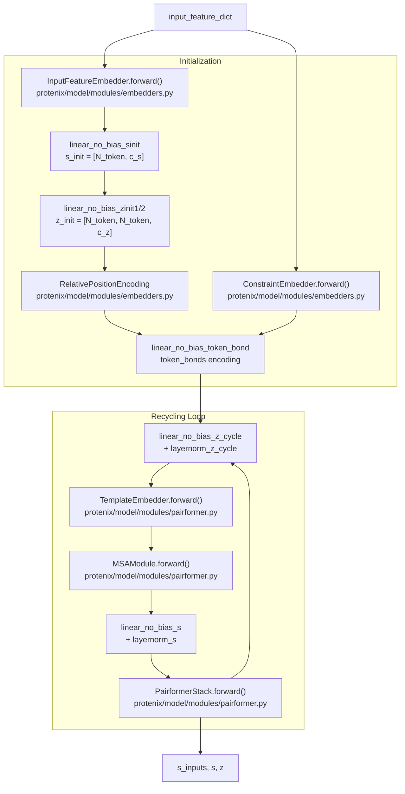

# Neural Network Components

> **Relevant source files**
> * [protenix/metrics/lddt_metrics.py](https://github.com/bytedance/Protenix/blob/c3bfc365/protenix/metrics/lddt_metrics.py)
> * [protenix/model/loss.py](https://github.com/bytedance/Protenix/blob/c3bfc365/protenix/model/loss.py)
> * [protenix/model/modules/embedders.py](https://github.com/bytedance/Protenix/blob/c3bfc365/protenix/model/modules/embedders.py)
> * [protenix/model/modules/fused_ops.py](https://github.com/bytedance/Protenix/blob/c3bfc365/protenix/model/modules/fused_ops.py)
> * [protenix/model/modules/pairformer.py](https://github.com/bytedance/Protenix/blob/c3bfc365/protenix/model/modules/pairformer.py)
> * [protenix/model/modules/primitives.py](https://github.com/bytedance/Protenix/blob/c3bfc365/protenix/model/modules/primitives.py)
> * [protenix/model/triangular/triangular.py](https://github.com/bytedance/Protenix/blob/c3bfc365/protenix/model/triangular/triangular.py)
> * [protenix/model/utils.py](https://github.com/bytedance/Protenix/blob/c3bfc365/protenix/model/utils.py)
> * [tests/test_fused_dropout_add.py](https://github.com/bytedance/Protenix/blob/c3bfc365/tests/test_fused_dropout_add.py)

This document explains the core neural network modules that comprise the Protenix model architecture, with emphasis on their integration through the recycling mechanism. These components implement the transformer-based and attention mechanisms described in AlphaFold 3.

The primary components are:

* **InputFeatureEmbedder**: Converts raw molecular features into token embeddings.
* **MSAModule**: Processes multiple sequence alignment information.
* **PairformerStack**: Core transformer for pairwise representations.
* **TemplateEmbedder**: Processes template structure information.
* **ConstraintEmbedder**: Embeds structural constraints.
* **Primitives**: Low-level building blocks like `Transition` and `AdaptiveLayerNorm`.

## Component Integration Overview

The `get_pairformer_output` method in the `Protenix` class orchestrates the integration of all neural network components through a recycling loop. This implements lines 1-13 of Algorithm 1 from AlphaFold 3.

**Component Integration Flow in get_pairformer_output**

Sources: [protenix/model/protenix.py L184-L284](https://github.com/bytedance/Protenix/blob/c3bfc365/protenix/model/protenix.py#L184-L284)

 [protenix/model/modules/embedders.py L28-L121](https://github.com/bytedance/Protenix/blob/c3bfc365/protenix/model/modules/embedders.py#L28-L121)

 [protenix/model/modules/pairformer.py L253-L331](https://github.com/bytedance/Protenix/blob/c3bfc365/protenix/model/modules/pairformer.py#L253-L331)

## PairformerStack and Block

The `PairformerStack` is the core transformer module that processes both single (`s`) and pairwise (`z`) token representations. It implements Algorithm 17 from AlphaFold 3.

### PairformerBlock

The `PairformerBlock` is the fundamental unit of the stack. It updates the pair representation through triangular operations and the single representation through pair-biased attention [protenix/model/modules/pairformer.py L42-L73](https://github.com/bytedance/Protenix/blob/c3bfc365/protenix/model/modules/pairformer.py#L42-L73)

**PairformerBlock Processing Pipeline**
Each block applies operations in strict sequence:

| Operation | Target | Class | Purpose |
| --- | --- | --- | --- |
| Triangle Multiplicative Outgoing | z | `TriangleMultiplicationOutgoing` | Update pairs via multiplicative gating (outgoing edges) [protenix/model/modules/pairformer.py L79-L81](https://github.com/bytedance/Protenix/blob/c3bfc365/protenix/model/modules/pairformer.py#L79-L81) |
| Triangle Multiplicative Incoming | z | `TriangleMultiplicationIncoming` | Update pairs via multiplicative gating (incoming edges) [protenix/model/modules/pairformer.py L82](https://github.com/bytedance/Protenix/blob/c3bfc365/protenix/model/modules/pairformer.py#L82-L82) |
| Triangle Attention Start | z | `TriangleAttention` | Attention over starting nodes [protenix/model/modules/pairformer.py L83-L87](https://github.com/bytedance/Protenix/blob/c3bfc365/protenix/model/modules/pairformer.py#L83-L87) |
| Triangle Attention End | z | `TriangleAttention` | Attention over ending nodes (applied to transposed z) [protenix/model/modules/pairformer.py L88-L92](https://github.com/bytedance/Protenix/blob/c3bfc365/protenix/model/modules/pairformer.py#L88-L92) |
| Pair Transition | z | `Transition` | MLP-like processing of pair features [protenix/model/modules/pairformer.py L95](https://github.com/bytedance/Protenix/blob/c3bfc365/protenix/model/modules/pairformer.py#L95-L95) |
| Attention Pair Bias | s | `AttentionPairBias` | Update singles with pair-biased attention [protenix/model/modules/pairformer.py L98-L100](https://github.com/bytedance/Protenix/blob/c3bfc365/protenix/model/modules/pairformer.py#L98-L100) |
| Single Transition | s | `Transition` | MLP-like processing of single features [protenix/model/modules/pairformer.py L101](https://github.com/bytedance/Protenix/blob/c3bfc365/protenix/model/modules/pairformer.py#L101-L101) |

Sources: [protenix/model/modules/pairformer.py L42-L170](https://github.com/bytedance/Protenix/blob/c3bfc365/protenix/model/modules/pairformer.py#L42-L170)

 [protenix/model/modules/primitives.py L166-L189](https://github.com/bytedance/Protenix/blob/c3bfc365/protenix/model/modules/primitives.py#L166-L189)

## MSAModule

The `MSAModule` processes multiple sequence alignment (MSA) information through stacked `MSABlock` instances [protenix/model/modules/pairformer.py L684-L713](https://github.com/bytedance/Protenix/blob/c3bfc365/protenix/model/modules/pairformer.py#L684-L713)

 It implements Algorithm 8 from AlphaFold 3.

**MSABlock Structure**
Each `MSABlock` contains:

1. **OuterProductMean**: Communication from MSA features `m` to pair representation `z` [protenix/model/modules/pairformer.py L726](https://github.com/bytedance/Protenix/blob/c3bfc365/protenix/model/modules/pairformer.py#L726-L726)
2. **MSAStack**: Self-attention and pair-biased attention on the MSA sequence dimension [protenix/model/modules/pairformer.py L732](https://github.com/bytedance/Protenix/blob/c3bfc365/protenix/model/modules/pairformer.py#L732-L732)
3. **PairformerBlock**: Updates the pair representation within the MSA processing loop [protenix/model/modules/pairformer.py L733](https://github.com/bytedance/Protenix/blob/c3bfc365/protenix/model/modules/pairformer.py#L733-L733)

The final block (`is_last_block=True`) typically skips the MSA stack to save memory during training [protenix/model/modules/pairformer.py L749-L752](https://github.com/bytedance/Protenix/blob/c3bfc365/protenix/model/modules/pairformer.py#L749-L752)

Sources: [protenix/model/modules/pairformer.py L684-L752](https://github.com/bytedance/Protenix/blob/c3bfc365/protenix/model/modules/pairformer.py#L684-L752)

 [protenix/model/modules/pairformer.py L417-L438](https://github.com/bytedance/Protenix/blob/c3bfc365/protenix/model/modules/pairformer.py#L417-L438)

## Input and Embedding Layers

### InputFeatureEmbedder

Implements Algorithm 2. It aggregates per-atom features using an `AtomAttentionEncoder` and concatenates them with token-level features like `restype`, `profile`, and `deletion_mean` [protenix/model/modules/embedders.py L28-L121](https://github.com/bytedance/Protenix/blob/c3bfc365/protenix/model/modules/embedders.py#L28-L121)

### RelativePositionEncoding

Implements Algorithm 3. It encodes various relational indices into the pair representation `z`:

* `asym_id`, `residue_index`, `entity_id`, `sym_id`, and `token_index` [protenix/model/modules/embedders.py L124-L150](https://github.com/bytedance/Protenix/blob/c3bfc365/protenix/model/modules/embedders.py#L124-L150)
* It computes relative distances and applies one-hot encoding before a linear projection [protenix/model/modules/embedders.py L152-L187](https://github.com/bytedance/Protenix/blob/c3bfc365/protenix/model/modules/embedders.py#L152-L187)

Sources: [protenix/model/modules/embedders.py L28-L187](https://github.com/bytedance/Protenix/blob/c3bfc365/protenix/model/modules/embedders.py#L28-L187)

## Primitive Components

Protenix utilizes several primitive layers for stabilization and non-linear transformations:

* **Transition**: Implements Algorithm 11. It uses a gated structure with `LayerNorm`, two `LinearNoBias` layers (projecting to `n * c_in`), a `SiLU` activation, and a final projection back to `c_in` [protenix/model/modules/primitives.py L166-L205](https://github.com/bytedance/Protenix/blob/c3bfc365/protenix/model/modules/primitives.py#L166-L205)
* **AdaptiveLayerNorm (AdaLN)**: Implements Algorithm 26. It modulates the normalization of a feature `a` using a conditioning signal `s` [protenix/model/modules/primitives.py L104-L138](https://github.com/bytedance/Protenix/blob/c3bfc365/protenix/model/modules/primitives.py#L104-L138)
* **Linear / LinearNoBias**: Custom linear layers with specific initializations (`default`, `relu`, `zeros`) [protenix/model/modules/primitives.py L33-L101](https://github.com/bytedance/Protenix/blob/c3bfc365/protenix/model/modules/primitives.py#L33-L101)

Sources: [protenix/model/modules/primitives.py L33-L205](https://github.com/bytedance/Protenix/blob/c3bfc365/protenix/model/modules/primitives.py#L33-L205)

## Fused Operations and Optimization

To improve memory efficiency and performance, Protenix includes fused Triton kernels:

* **dropout_add_rowwise**: Fuses the dropout operation with a residual addition. It uses a row-shared mask (shared across the `R` dimension for a `[..., R, C, D]` tensor) to reduce memory traffic [protenix/model/modules/fused_ops.py L15-L212](https://github.com/bytedance/Protenix/blob/c3bfc365/protenix/model/modules/fused_ops.py#L15-L212)
* **Implementation Selection**: The `PairformerBlock` supports different implementation backends for triangular operations via `triangle_multiplicative` and `triangle_attention` arguments (e.g., "torch", "cuequivariance", "deepspeed") [protenix/model/modules/pairformer.py L108-L131](https://github.com/bytedance/Protenix/blob/c3bfc365/protenix/model/modules/pairformer.py#L108-L131)

Sources: [protenix/model/modules/fused_ops.py L15-L212](https://github.com/bytedance/Protenix/blob/c3bfc365/protenix/model/modules/fused_ops.py#L15-L212)

 [protenix/model/modules/pairformer.py L138-L169](https://github.com/bytedance/Protenix/blob/c3bfc365/protenix/model/modules/pairformer.py#L138-L169)

## Template and Constraint Embedders

* **TemplateEmbedder**: Implements Algorithm 16. It embeds template pair features (distances, unit vectors, masks) and processes them through a small `PairformerStack` [protenix/model/modules/pairformer.py L916-L1001](https://github.com/bytedance/Protenix/blob/c3bfc365/protenix/model/modules/pairformer.py#L916-L1001)
* **ConstraintEmbedder**: Provides a mechanism to inject external structural constraints into the model's pairwise representation. It includes specific embedders for pockets, contacts, and substructures [protenix/model/modules/embedders.py L362-L473](https://github.com/bytedance/Protenix/blob/c3bfc365/protenix/model/modules/embedders.py#L362-L473)

Sources: [protenix/model/modules/pairformer.py L916-L1001](https://github.com/bytedance/Protenix/blob/c3bfc365/protenix/model/modules/pairformer.py#L916-L1001)

 [protenix/model/modules/embedders.py L362-L473](https://github.com/bytedance/Protenix/blob/c3bfc365/protenix/model/modules/embedders.py#L362-L473)