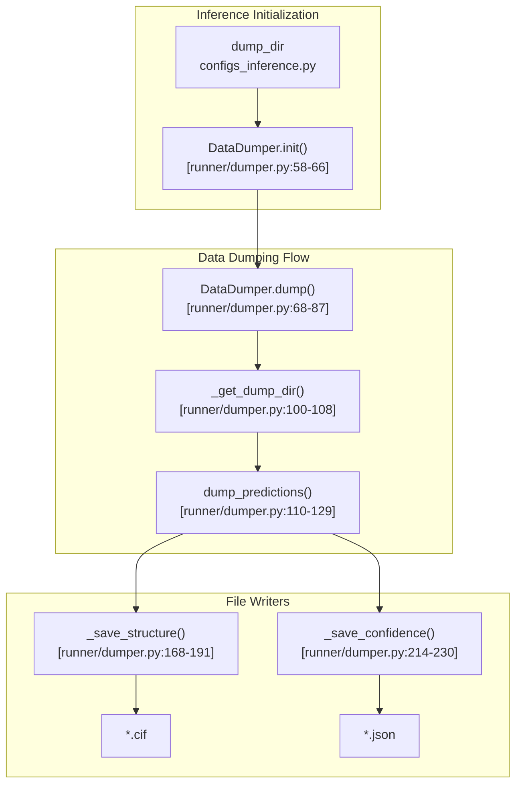
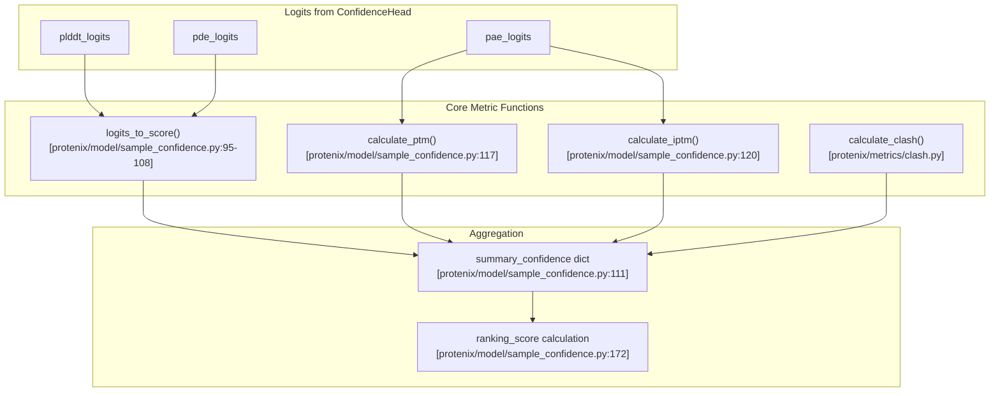
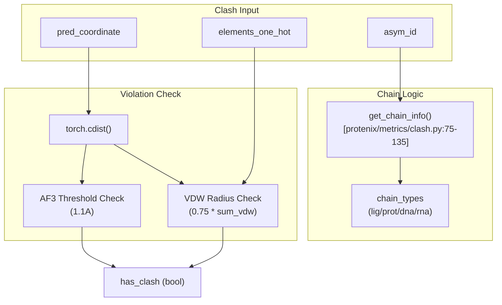

# Output Formats and Interpretation

> **Relevant source files**
> * [configs/configs_inference.py](https://github.com/bytedance/Protenix/blob/c3bfc365/configs/configs_inference.py)
> * [protenix/data/utils.py](https://github.com/bytedance/Protenix/blob/c3bfc365/protenix/data/utils.py)
> * [protenix/metrics/clash.py](https://github.com/bytedance/Protenix/blob/c3bfc365/protenix/metrics/clash.py)
> * [protenix/model/generator.py](https://github.com/bytedance/Protenix/blob/c3bfc365/protenix/model/generator.py)
> * [protenix/model/sample_confidence.py](https://github.com/bytedance/Protenix/blob/c3bfc365/protenix/model/sample_confidence.py)
> * [runner/dumper.py](https://github.com/bytedance/Protenix/blob/c3bfc365/runner/dumper.py)
> * [scripts/prepare_training_data.py](https://github.com/bytedance/Protenix/blob/c3bfc365/scripts/prepare_training_data.py)

## Purpose and Scope

This document describes the output formats generated by Protenix inference and explains how to interpret the quality metrics and confidence scores. After running predictions through the `InferenceRunner`, results are saved as CIF structure files and JSON confidence summaries in a structured directory hierarchy.

The `DataDumper` class [runner/dumper.py L48-L66](https://github.com/bytedance/Protenix/blob/c3bfc365/runner/dumper.py#L48-L66)

 is the central entity responsible for formatting coordinates into CIF files and aggregating confidence metrics into JSON files.

---

## Output Directory Structure

The inference system generates outputs in a hierarchical directory structure specified by the `dump_dir` configuration [configs/configs_inference.py L25](https://github.com/bytedance/Protenix/blob/c3bfc365/configs/configs_inference.py#L25-L25)

 The `DataDumper` [runner/dumper.py L48](https://github.com/bytedance/Protenix/blob/c3bfc365/runner/dumper.py#L48-L48)

 manages all output file generation and organization.

```html
dump_dir/
├── <dataset_name>/                   # Default: "Inference"
│   ├── <pdb_id>/                     # From input JSON "name" field
│   │   ├── seed_<seed>/              # From --seeds flag
│   │   │   ├── predictions/
│   │   │   │   ├── <name>_<seed>_sample_0.cif
│   │   │   │   ├── <name>_<seed>_summary_confidence_sample_0.json
│   │   │   │   ├── <name>_<seed>_sample_1.cif
│   │   │   │   ├── <name>_<seed>_summary_confidence_sample_1.json
│   │   │   │   └── ...               # N_sample files per seed
└── ERR/                              # Error logs directory
    ├── <sample_name>.txt
    └── error.txt
```

**Output Generation Process:**



**Sources:** [runner/dumper.py L48-L129](https://github.com/bytedance/Protenix/blob/c3bfc365/runner/dumper.py#L48-L129)

 [configs/configs_inference.py L22-L39](https://github.com/bytedance/Protenix/blob/c3bfc365/configs/configs_inference.py#L22-L39)

---

## CIF Structure Files

Each prediction generates a CIF (Crystallographic Information File) format structure file containing atomic coordinates. The filename pattern is `<name>_<seed>_sample_<N>.cif`.

### B-Factor Interpretation

In Protenix outputs, the B-factor column in the CIF file is repurposed to store confidence metrics.

* If `full_data` is available in the prediction dictionary, the `atom_plddt` values (multiplied by 100.0) are saved as B-factors [runner/dumper.py L135-L147](https://github.com/bytedance/Protenix/blob/c3bfc365/runner/dumper.py#L135-L147)
* This allows visualization of local confidence directly in molecular viewers like PyMOL or ChimeraX using the B-factor coloring mode.

### Structure Ranking

The `DataDumper` can sort output files based on the `ranking_score` if `sorted_by_ranking_score` is enabled [runner/dumper.py L61](https://github.com/bytedance/Protenix/blob/c3bfc365/runner/dumper.py#L61-L61)

* The ranking indices are determined by `_get_ranker_indices` [runner/dumper.py L232-L251](https://github.com/bytedance/Protenix/blob/c3bfc365/runner/dumper.py#L232-L251)
* If sorted, the filename index `<N>` corresponds to the rank (sample_0 being the best).

**Sources:** [runner/dumper.py L133-L166](https://github.com/bytedance/Protenix/blob/c3bfc365/runner/dumper.py#L133-L166)

 [runner/dumper.py L232-L251](https://github.com/bytedance/Protenix/blob/c3bfc365/runner/dumper.py#L232-L251)

---

## Confidence Metrics JSON

Each structure file has a corresponding JSON file containing confidence scores and quality metrics calculated by the `ConfidenceHead`.

### Summary Metrics

The metrics are computed in `_compute_full_data_and_summary` [protenix/model/sample_confidence.py L46-L62](https://github.com/bytedance/Protenix/blob/c3bfc365/protenix/model/sample_confidence.py#L46-L62)

 and stored in the JSON:

| Metric Key | Calculation / Source | Description |
| --- | --- | --- |
| `plddt` | `atom_plddt.mean() * 100` [protenix/model/sample_confidence.py L112](https://github.com/bytedance/Protenix/blob/c3bfc365/protenix/model/sample_confidence.py#L112-L112) | Global average per-atom confidence. |
| `gpde` | `(pde * contact_probs).sum() / contact_probs.sum()` [protenix/model/sample_confidence.py L113-L115](https://github.com/bytedance/Protenix/blob/c3bfc365/protenix/model/sample_confidence.py#L113-L115) | Global Predicted Distance Error weighted by contact probability. |
| `ptm` | `calculate_ptm()` [protenix/model/sample_confidence.py L117-L119](https://github.com/bytedance/Protenix/blob/c3bfc365/protenix/model/sample_confidence.py#L117-L119) | Predicted TM-score for global topology. |
| `iptm` | `calculate_iptm()` [protenix/model/sample_confidence.py L120-L125](https://github.com/bytedance/Protenix/blob/c3bfc365/protenix/model/sample_confidence.py#L120-L125) | Interface Predicted TM-score for multi-chain accuracy. |
| `ranking_score` | `0.8*iptm + 0.2*ptm + 0.5*disorder - 100*has_clash` [protenix/model/sample_confidence.py L172-L177](https://github.com/bytedance/Protenix/blob/c3bfc365/protenix/model/sample_confidence.py#L172-L177) | The primary metric used to rank samples. |
| `has_clash` | `calculate_clash()` [protenix/model/sample_confidence.py L160-L166](https://github.com/bytedance/Protenix/blob/c3bfc365/protenix/model/sample_confidence.py#L160-L166) | Boolean indicating if physical clashes exceed thresholds. |

### Chain-Level Metrics

Protenix provides granular confidence for interactions between specific chains:

* `chain_plddt`: Average pLDDT for each chain [protenix/model/sample_confidence.py L147-L150](https://github.com/bytedance/Protenix/blob/c3bfc365/protenix/model/sample_confidence.py#L147-L150)
* `chain_ptm`: pTM score for each individual chain [protenix/model/sample_confidence.py L137-L144](https://github.com/bytedance/Protenix/blob/c3bfc365/protenix/model/sample_confidence.py#L137-L144)
* `chain_pair_iptm`: Pairwise ipTM between all chain pairs [protenix/model/sample_confidence.py L137-L144](https://github.com/bytedance/Protenix/blob/c3bfc365/protenix/model/sample_confidence.py#L137-L144)
* `chain_pair_pae_min/mean`: PAE statistics between chain pairs [protenix/model/sample_confidence.py L153-L158](https://github.com/bytedance/Protenix/blob/c3bfc365/protenix/model/sample_confidence.py#L153-L158)

**Metric Data Flow:**



**Sources:** [protenix/model/sample_confidence.py L88-L188](https://github.com/bytedance/Protenix/blob/c3bfc365/protenix/model/sample_confidence.py#L88-L188)

 [protenix/metrics/clash.py L35-L73](https://github.com/bytedance/Protenix/blob/c3bfc365/protenix/metrics/clash.py#L35-L73)

---

## Steric Clash Detection

The `has_clash` metric is a critical filter for quality. It is calculated by the `Clash` module [protenix/metrics/clash.py L35](https://github.com/bytedance/Protenix/blob/c3bfc365/protenix/metrics/clash.py#L35-L35)

### Clash Criteria

1. **AF3 Clash**: Atomic distance is less than the `af3_clash_threshold` (default 1.1 Å) [protenix/metrics/clash.py L38-L150](https://github.com/bytedance/Protenix/blob/c3bfc365/protenix/metrics/clash.py#L38-L150)
2. **VDW Clash**: Atomic distance is less than a fraction (`vdw_clash_threshold`, default 0.75) of the sum of Van der Waals radii [protenix/metrics/clash.py L39-L164](https://github.com/bytedance/Protenix/blob/c3bfc365/protenix/metrics/clash.py#L39-L164)

The VDW radii are retrieved based on the element type of each atom using RDKit-derived values [protenix/metrics/clash.py L25-L32](https://github.com/bytedance/Protenix/blob/c3bfc365/protenix/metrics/clash.py#L25-L32)

**Clash Detection Logic:**



**Sources:** [protenix/metrics/clash.py L35-L73](https://github.com/bytedance/Protenix/blob/c3bfc365/protenix/metrics/clash.py#L35-L73)

 [protenix/metrics/clash.py L137-L173](https://github.com/bytedance/Protenix/blob/c3bfc365/protenix/metrics/clash.py#L137-L173)

---

## Diffusion Sampling and Noise

During inference, coordinates are generated via a diffusion process. The quality of the output is influenced by the noise schedule.

* **InferenceNoiseScheduler**: Defines the noise levels (time steps) from `s_max` (160.0) to `s_min` (4e-4) over `N_step` iterations [protenix/model/generator.py L75-L86](https://github.com/bytedance/Protenix/blob/c3bfc365/protenix/model/generator.py#L75-L86)
* **sample_diffusion**: Implements the denoising loop (Algorithm 18 in AF3) [protenix/model/generator.py L123-L143](https://github.com/bytedance/Protenix/blob/c3bfc365/protenix/model/generator.py#L123-L143)
* **Training Free Guidance (TFG)**: If enabled, an energy potential is applied during sampling to refine the output [protenix/model/generator.py L184-L187](https://github.com/bytedance/Protenix/blob/c3bfc365/protenix/model/generator.py#L184-L187)

**Sources:** [protenix/model/generator.py L75-L121](https://github.com/bytedance/Protenix/blob/c3bfc365/protenix/model/generator.py#L75-L121)

 [protenix/model/generator.py L123-L188](https://github.com/bytedance/Protenix/blob/c3bfc365/protenix/model/generator.py#L123-L188)