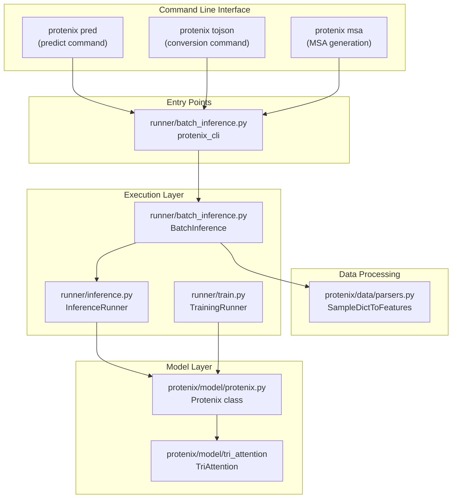
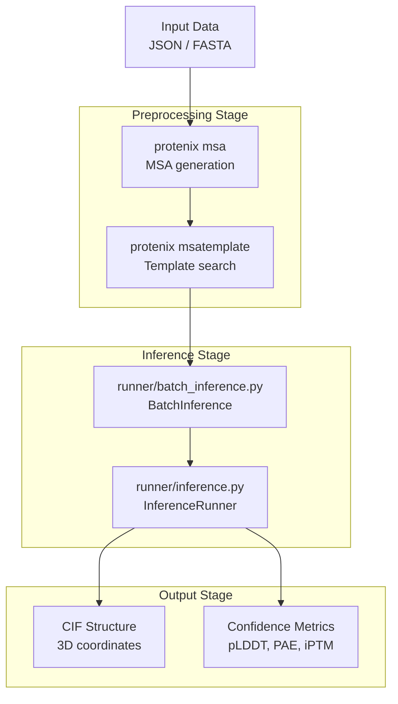

# Overview

> **Relevant source files**
> * [CHANGELOG.md](https://github.com/bytedance/Protenix/blob/c3bfc365/CHANGELOG.md?plain=1)
> * [README.md](https://github.com/bytedance/Protenix/blob/c3bfc365/README.md?plain=1)
> * [protenix/__init__.py](https://github.com/bytedance/Protenix/blob/c3bfc365/protenix/__init__.py)
> * [protenix/model/tri_attention/__init__.py](https://github.com/bytedance/Protenix/blob/c3bfc365/protenix/model/tri_attention/__init__.py)
> * [setup.py](https://github.com/bytedance/Protenix/blob/c3bfc365/setup.py)

This document provides a high-level introduction to the Protenix system, explaining its purpose, architecture, and capabilities as an open-source biomolecular structure prediction platform. For detailed information about specific subsystems, see [System Architecture](/bytedance/Protenix/2-system-architecture). For information about installation and setup, see [Installation and Setup](/bytedance/Protenix/1.2-installation-and-setup). For a quick start guide, see [Quick Start Guide](/bytedance/Protenix/1.3-quick-start-guide).

## What is Protenix?

Protenix is an open-source platform for high-accuracy biomolecular structure prediction built on the AlphaFold3 architecture. It predicts 3D structures of proteins, nucleic acids, small molecules, ions, and their complexes from sequence and chemical information. The system is designed to be both accurate and accessible, providing a fully open-source alternative to proprietary structure prediction tools.

Protenix is the first fully open-source implementation that matches or exceeds AlphaFold3's performance across diverse benchmark sets while maintaining the same training data cutoff (2021-09-30), model scale, and inference budget. Both the code and model parameters are released under the Apache 2.0 License [setup.py L70](https://github.com/bytedance/Protenix/blob/c3bfc365/setup.py#L70-L70)

**Sources:** [README.md L17-L19](https://github.com/bytedance/Protenix/blob/c3bfc365/README.md?plain=1#L17-L19)

 [README.md L89-L94](https://github.com/bytedance/Protenix/blob/c3bfc365/README.md?plain=1#L89-L94)

 [setup.py L48-L77](https://github.com/bytedance/Protenix/blob/c3bfc365/setup.py#L48-L77)

## Core Capabilities

Protenix provides the following primary capabilities:

| Capability | Description | Key Components |
| --- | --- | --- |
| **Structure Prediction** | Predict 3D coordinates of biomolecular structures from sequence data | `protenix.model.protenix.Protenix`, `runner/inference.py` |
| **Multi-Modal Input** | Support proteins, RNA, DNA, ligands, ions, and their complexes | `protenix.data.parsers.SampleDictToFeatures` |
| **MSA Generation** | Generate multiple sequence alignments for evolutionary information | `protenix.data.msa_pipeline.MSAPipeline` |
| **Template Search** | Find and incorporate structural templates | `protenix.data.template_pipeline.TemplatePipeline` |
| **Constraint-Guided Prediction** | Use experimental or prior knowledge (contact, pocket) as constraints | `protenix.model.constraints` |
| **Model Training** | Train and fine-tune models on custom datasets | `runner/train.py` |
| **Confidence Estimation** | Provide multiple confidence metrics (pLDDT, PAE, iPTM, etc.) | `protenix.model.heads.confidence.ConfidenceHead` |

**Sources:** [README.md L37-L42](https://github.com/bytedance/Protenix/blob/c3bfc365/README.md?plain=1#L37-L42)

 [README.md L62-L75](https://github.com/bytedance/Protenix/blob/c3bfc365/README.md?plain=1#L62-L75)

 [setup.py L72-L76](https://github.com/bytedance/Protenix/blob/c3bfc365/setup.py#L72-L76)

## System Components

The following diagram maps the major system components to their code implementations:

Title: Protenix System Mapping

**Sources:** [setup.py L72-L76](https://github.com/bytedance/Protenix/blob/c3bfc365/setup.py#L72-L76)

 [runner/batch_inference.py L74](https://github.com/bytedance/Protenix/blob/c3bfc365/runner/batch_inference.py#L74-L74)

 [protenix/model/tri_attention/__init__.py L88-L109](https://github.com/bytedance/Protenix/blob/c3bfc365/protenix/model/tri_attention/__init__.py#L88-L109)

## Model Variants and Versions

Protenix provides multiple model variants optimized for different use cases:

### Model Versions

| Version | Features | Data Cutoff | Purpose |
| --- | --- | --- | --- |
| **protenix-v2** | Enhanced capacity, improved antibody-antigen prediction | 2021-09-30 | Latest version with ~464M parameters [README.md L65-L70](https://github.com/bytedance/Protenix/blob/c3bfc365/README.md?plain=1#L65-L70) |
| **v1.0.0** | MSA + RNA MSA + Template | 2021-09-30 or 2025-06-30 | High-accuracy base models [README.md L66-L72](https://github.com/bytedance/Protenix/blob/c3bfc365/README.md?plain=1#L66-L72) |
| **v0.5.0** | MSA only | 2021-09-30 | Legacy version for backward compatibility [README.md L73](https://github.com/bytedance/Protenix/blob/c3bfc365/README.md?plain=1#L73-L73) |

### Model Sizes

* **Base**: Full-accuracy model (~368M parameters) aligned with AlphaFold3 scale [README.md L71](https://github.com/bytedance/Protenix/blob/c3bfc365/README.md?plain=1#L71-L71)
* **Mini**: Lightweight model variants that drastically reduce inference costs with minimal accuracy loss [README.md L37-L38](https://github.com/bytedance/Protenix/blob/c3bfc365/README.md?plain=1#L37-L38)

**Sources:** [README.md L62-L75](https://github.com/bytedance/Protenix/blob/c3bfc365/README.md?plain=1#L62-L75)

 [README.md L82-L86](https://github.com/bytedance/Protenix/blob/c3bfc365/README.md?plain=1#L82-L86)

## End-to-End Workflow

The typical Protenix workflow proceeds through the following stages:

Title: Protenix End-to-End Inference Flow

This workflow is orchestrated by `protenix_cli` in [runner/batch_inference.py L74](https://github.com/bytedance/Protenix/blob/c3bfc365/runner/batch_inference.py#L74-L74)

 For details, see [Inference Pipeline Overview](/bytedance/Protenix/3.1-inference-pipeline-overview).

**Sources:** [README.md L57-L60](https://github.com/bytedance/Protenix/blob/c3bfc365/README.md?plain=1#L57-L60)

 [runner/batch_inference.py L72-L76](https://github.com/bytedance/Protenix/blob/c3bfc365/runner/batch_inference.py#L72-L76)

## Key Features

### Multi-Entity Support

Protenix supports heterogeneous biomolecular complexes including proteins, nucleic acids (RNA/DNA), ligands (SMILES/CCD), and ions. For details, see [Input Data Formats](/bytedance/Protenix/4.1-input-data-formats).

### Constraint-Guided Prediction

The system supports atom-level contact and pocket constraints, enhancing prediction accuracy through physical priors [README.md L39](https://github.com/bytedance/Protenix/blob/c3bfc365/README.md?plain=1#L39-L39)

 For details, see [Constraint-Guided Predictions](/bytedance/Protenix/3.6-constraint-guided-predictions).

### Training-Free Guidance (TFG)

Protenix supports applying differentiable energy potentials during diffusion sampling to guide structure generation. For details, see [Training-Free Guidance (TFG)](/bytedance/Protenix/3.7-training-free-guidance-(tfg)).

## Ecosystem and Related Projects

Protenix serves as the foundation for several specialized tools:

* **PXDesign**: A model suite for de novo protein-binder design built on the Protenix foundation model [README.md L24](https://github.com/bytedance/Protenix/blob/c3bfc365/README.md?plain=1#L24-L24)
* **PXMeter**: An open-source toolkit for reproducible evaluation of structure prediction models [README.md L26](https://github.com/bytedance/Protenix/blob/c3bfc365/README.md?plain=1#L26-L26)
* **Protenix-Dock**: A classical protein-ligand docking framework leveraging empirical scoring functions [README.md L28](https://github.com/bytedance/Protenix/blob/c3bfc365/README.md?plain=1#L28-L28)

For details, see [Protenix Ecosystem](/bytedance/Protenix/1.1-protenix-ecosystem).

**Sources:** [README.md L23-L29](https://github.com/bytedance/Protenix/blob/c3bfc365/README.md?plain=1#L23-L29)

## Technology Stack

Protenix is built on the following core technologies:

| Layer | Technologies | Purpose |
| --- | --- | --- |
| **Deep Learning** | PyTorch, DeepSpeed | Model training and inference [setup.py L52](https://github.com/bytedance/Protenix/blob/c3bfc365/setup.py#L52-L52)    [CHANGELOG.md L18](https://github.com/bytedance/Protenix/blob/c3bfc365/CHANGELOG.md?plain=1#L18-L18) |
| **GPU Compute** | CUDA, Triton | Accelerated computation with fallback for consumer GPUs [protenix/model/tri_attention/__init__.py L26-L34](https://github.com/bytedance/Protenix/blob/c3bfc365/protenix/model/tri_attention/__init__.py#L26-L34) |
| **Package** | protenix | Python package distributed via PyPI [setup.py L49-L51](https://github.com/bytedance/Protenix/blob/c3bfc365/setup.py#L49-L51) |

**Sources:** [setup.py L33-L52](https://github.com/bytedance/Protenix/blob/c3bfc365/setup.py#L33-L52)

 [CHANGELOG.md L19-L22](https://github.com/bytedance/Protenix/blob/c3bfc365/CHANGELOG.md?plain=1#L19-L22)

 [protenix/model/tri_attention/__init__.py L88-L111](https://github.com/bytedance/Protenix/blob/c3bfc365/protenix/model/tri_attention/__init__.py#L88-L111)

## License and Accessibility

Protenix is released under the **Apache 2.0 License** [setup.py L70](https://github.com/bytedance/Protenix/blob/c3bfc365/setup.py#L70-L70)

 making it free for both academic research and commercial use. Both the code and trained model parameters are openly available.

**Sources:** [README.md L17-L19](https://github.com/bytedance/Protenix/blob/c3bfc365/README.md?plain=1#L17-L19)

 [setup.py L70](https://github.com/bytedance/Protenix/blob/c3bfc365/setup.py#L70-L70)