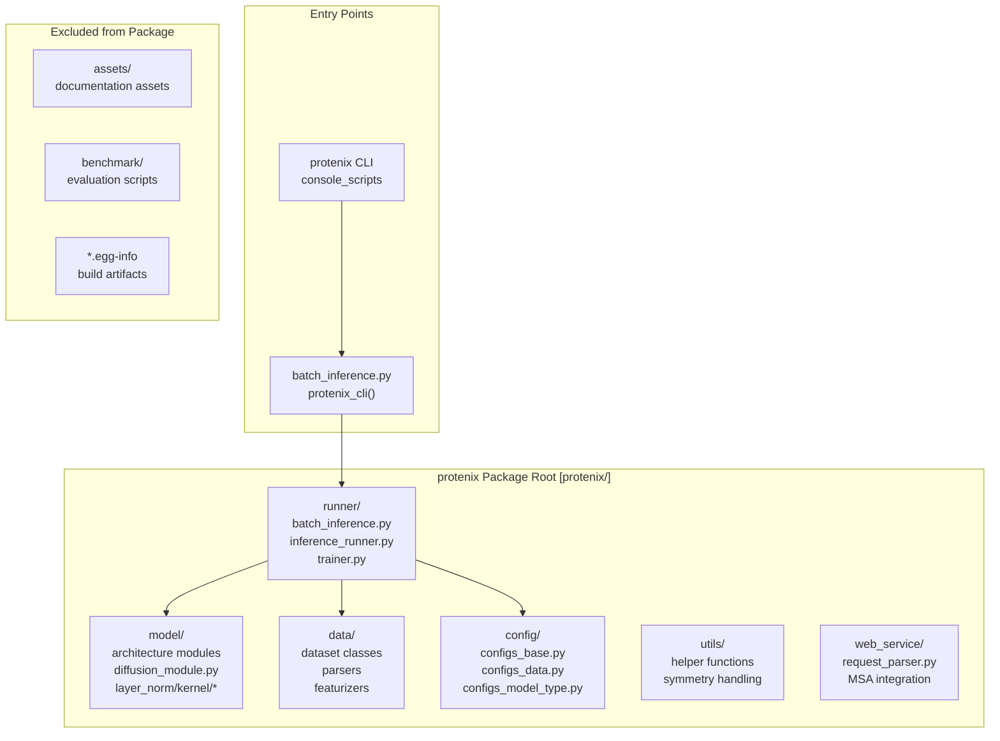
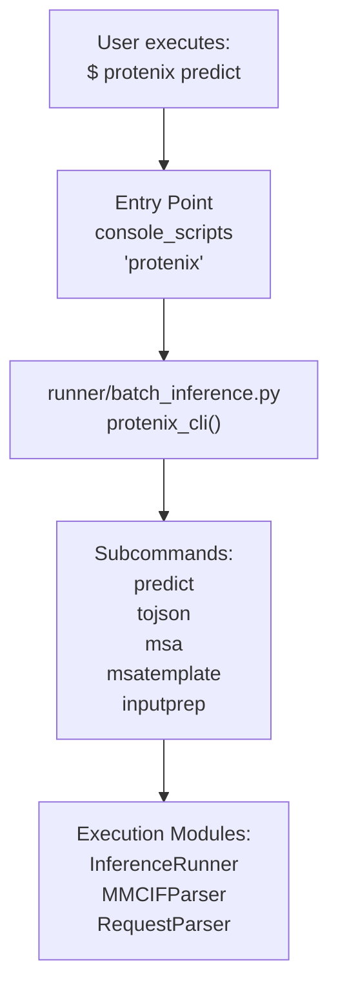

# Package Structure and Entry Points

> **Relevant source files**
> * [.flake8](https://github.com/bytedance/Protenix/blob/c3bfc365/.flake8)
> * [.github/workflows/ci.yml](https://github.com/bytedance/Protenix/blob/c3bfc365/.github/workflows/ci.yml)
> * [.github/workflows/publish_to_pypi.yml](https://github.com/bytedance/Protenix/blob/c3bfc365/.github/workflows/publish_to_pypi.yml)
> * [.pre-commit-config.yaml](https://github.com/bytedance/Protenix/blob/c3bfc365/.pre-commit-config.yaml)
> * [assets/license_header.txt](https://github.com/bytedance/Protenix/blob/c3bfc365/assets/license_header.txt)
> * [protenix/__init__.py](https://github.com/bytedance/Protenix/blob/c3bfc365/protenix/__init__.py)
> * [setup.py](https://github.com/bytedance/Protenix/blob/c3bfc365/setup.py)

## Purpose and Scope

This page documents the Protenix package structure, installation configuration, and command-line entry points. It explains how the Python package is organized, how `setup.py` configures the installation process, and how the `protenix` CLI command maps to code modules. For runtime configuration of models and inference parameters, see [Configuration System](/bytedance/Protenix/7-configuration-system). For deployment using Docker containers, see [Docker Deployment](/bytedance/Protenix/9.2-docker-deployment).

## Package Overview

Protenix is distributed as a Python package named `protenix`. The package requires Python ≥3.11 and is licensed under Apache 2.0 [setup.py L49-L70](https://github.com/bytedance/Protenix/blob/c3bfc365/setup.py#L49-L70)

 The package includes multiple subsystems organized into logical modules for data processing, model architecture, training, and inference. The versioning is dynamically loaded from a dedicated version file [setup.py L23-L27](https://github.com/bytedance/Protenix/blob/c3bfc365/setup.py#L23-L27)

**Sources:** [setup.py L23-L27](https://github.com/bytedance/Protenix/blob/c3bfc365/setup.py#L23-L27)

 [setup.py L49-L70](https://github.com/bytedance/Protenix/blob/c3bfc365/setup.py#L49-L70)

## Package Structure

The Protenix package follows a modular organization with distinct directories for different functional areas:



**Diagram: Protenix Package Module Organization and Entry Points**

The package structure separates concerns into distinct directories:

* `runner/` contains execution orchestration for inference and training.
* `model/` houses neural network architecture components.
* `data/` provides data loading, parsing, and featurization.
* `config/` defines configuration hierarchies.
* `utils/` offers shared utility functions.
* `web_service/` implements web-based MSA services.

**Sources:** [setup.py L58-L68](https://github.com/bytedance/Protenix/blob/c3bfc365/setup.py#L58-L68)

 [protenix/__init__.py L1-L2](https://github.com/bytedance/Protenix/blob/c3bfc365/protenix/__init__.py#L1-L2)

## setup.py Configuration

The `setup.py` file defines the package installation configuration using setuptools. Key configuration elements include:

| Configuration Item | Value Source | Description |
| --- | --- | --- |
| Package Name | `"protenix"` | PyPI package identifier [setup.py L49](https://github.com/bytedance/Protenix/blob/c3bfc365/setup.py#L49-L49) |
| Version | `protenix/version.py` | Dynamically loaded version string [setup.py L23-L27](https://github.com/bytedance/Protenix/blob/c3bfc365/setup.py#L23-L27) |
| Python Requirement | `>=3.11` | Minimum Python version [setup.py L50](https://github.com/bytedance/Protenix/blob/c3bfc365/setup.py#L50-L50) |
| License | Apache 2.0 | Open source license [setup.py L70](https://github.com/bytedance/Protenix/blob/c3bfc365/setup.py#L70-L70) |
| Platform | `manylinux1` | Linux compatibility tag [setup.py L71](https://github.com/bytedance/Protenix/blob/c3bfc365/setup.py#L71-L71) |
| Author | Bytedance Inc. | Package maintainer [setup.py L55](https://github.com/bytedance/Protenix/blob/c3bfc365/setup.py#L55-L55) |
| Entry Point | `protenix_cli` | CLI command registration [setup.py L74](https://github.com/bytedance/Protenix/blob/c3bfc365/setup.py#L74-L74) |

**Sources:** [setup.py L23-L74](https://github.com/bytedance/Protenix/blob/c3bfc365/setup.py#L23-L74)

### Package Discovery

The `find_packages()` function automatically discovers all Python packages in the repository, excluding specific directories:

```
packages=find_packages(    exclude=(        "assets",        "benchmark",        "*.egg-info",    )),
```

This excludes documentation assets, benchmark scripts, and build artifacts from the installed package, reducing installation size and avoiding namespace pollution.

**Sources:** [setup.py L58-L64](https://github.com/bytedance/Protenix/blob/c3bfc365/setup.py#L58-L64)

### Package Data Inclusion

The package includes non-Python files required at runtime, specifically custom CUDA kernels for LayerNorm operations [setup.py L67](https://github.com/bytedance/Protenix/blob/c3bfc365/setup.py#L67-L67)

:

```
include_package_data=True,package_data={    "protenix": ["model/layer_norm/kernel/*"],},
```

These kernel files enable optimized GPU operations when the LayerNorm custom kernel is enabled.

**Sources:** [setup.py L65-L68](https://github.com/bytedance/Protenix/blob/c3bfc365/setup.py#L65-L68)

## Command-Line Entry Points

The `protenix` CLI command is registered as a console script entry point, mapping the user-facing command to a Python function.



**Diagram: CLI Entry Point Resolution Path**

The entry point configuration in `setup.py` [setup.py L72-L76](https://github.com/bytedance/Protenix/blob/c3bfc365/setup.py#L72-L76)

:

```
entry_points={    "console_scripts": [        "protenix = runner.batch_inference:protenix_cli",    ],},
```

This creates a `protenix` executable that invokes the `protenix_cli()` function from `runner/batch_inference.py`. The function implements argument parsing and dispatches to appropriate subcommands.

**Sources:** [setup.py L72-L76](https://github.com/bytedance/Protenix/blob/c3bfc365/setup.py#L72-L76)

## Installation Modes

Protenix supports multiple installation modes to accommodate different deployment scenarios and hardware configurations.

### Standard GPU Installation

The default installation includes all dependencies from `requirements.txt`, including CUDA and NVIDIA packages [setup.py L33-L35](https://github.com/bytedance/Protenix/blob/c3bfc365/setup.py#L33-L35)

:

```
pip install .
```

**Sources:** [setup.py L33-L35](https://github.com/bytedance/Protenix/blob/c3bfc365/setup.py#L33-L35)

 [setup.py L69](https://github.com/bytedance/Protenix/blob/c3bfc365/setup.py#L69-L69)

### CPU-Only Installation

For systems without NVIDIA GPUs or for CPU-only inference, the `setup.py` includes logic to filter out GPU-specific packages when the `--cpu` flag is passed [setup.py L37-L46](https://github.com/bytedance/Protenix/blob/c3bfc365/setup.py#L37-L46)

:

```
python setup.py install --cpu
```

The filtering logic is implemented as follows:

```python
if "--cpu" in sys.argv:    # Remove the gpu packages    try:        to_drop = [x for x in install_requires if "nvidia" in x or "cuda" in x]        for x in to_drop:            install_requires.remove(x)    except ValueError:        pass    # Remove the --cpu option from sys.argv so setuptools doesn't get confused    sys.argv.remove("--cpu")
```

This removes packages containing "nvidia" or "cuda" in their names from the `install_requires` list.

**Sources:** [setup.py L37-L46](https://github.com/bytedance/Protenix/blob/c3bfc365/setup.py#L37-L46)

## Development Environment and CI/CD

The repository includes configuration for maintaining code quality and automated publishing.

### Pre-commit Hooks

Protenix uses `pre-commit` to enforce coding standards, including:

* **License Headers**: Automatically inserts the Apache 2.0 license header into `.py` and `.sh` files using `assets/license_header.txt` [.pre-commit-config.yaml L21-L28](https://github.com/bytedance/Protenix/blob/c3bfc365/.pre-commit-config.yaml#L21-L28)
* **Linting**: Uses `flake8` with specific plugins like `flake8-bugbear` and `torchfix` [.pre-commit-config.yaml L30-L38](https://github.com/bytedance/Protenix/blob/c3bfc365/.pre-commit-config.yaml#L30-L38)
* **Formatting**: Uses `ufmt` (combining `black` and `usort`) to ensure consistent code style [.pre-commit-config.yaml L40-L46](https://github.com/bytedance/Protenix/blob/c3bfc365/.pre-commit-config.yaml#L40-L46)

**Sources:** [.pre-commit-config.yaml L21-L46](https://github.com/bytedance/Protenix/blob/c3bfc365/.pre-commit-config.yaml#L21-L46)

 [.flake8 L1-L25](https://github.com/bytedance/Protenix/blob/c3bfc365/.flake8#L1-L25)

### GitHub Actions Workflows

* **CI Pipeline**: Runs on push and pull requests to `main`. It installs dependencies, lints the code with `flake8`, and executes tests using `pytest` [.github/workflows/ci.yml L6-L43](https://github.com/bytedance/Protenix/blob/c3bfc365/.github/workflows/ci.yml#L6-L43)
* **PyPI Publishing**: Automatically builds and publishes the package to PyPI when a new version tag (e.g., `v1.0.0`) is pushed [.github/workflows/publish_to_pypi.yml L3-L36](https://github.com/bytedance/Protenix/blob/c3bfc365/.github/workflows/publish_to_pypi.yml#L3-L36)

**Sources:** [.github/workflows/ci.yml L6-L43](https://github.com/bytedance/Protenix/blob/c3bfc365/.github/workflows/ci.yml#L6-L43)

 [.github/workflows/publish_to_pypi.yml L3-L36](https://github.com/bytedance/Protenix/blob/c3bfc365/.github/workflows/publish_to_pypi.yml#L3-L36)

## Dependency Management

Dependencies are declared in `requirements.txt` and loaded dynamically during installation [setup.py L33-L34](https://github.com/bytedance/Protenix/blob/c3bfc365/setup.py#L33-L34)

 This approach centralizes dependency management, enabling consistent environments across installation methods (pip, Docker).

**Sources:** [setup.py L33-L34](https://github.com/bytedance/Protenix/blob/c3bfc365/setup.py#L33-L34)

 [setup.py L69](https://github.com/bytedance/Protenix/blob/c3bfc365/setup.py#L69-L69)