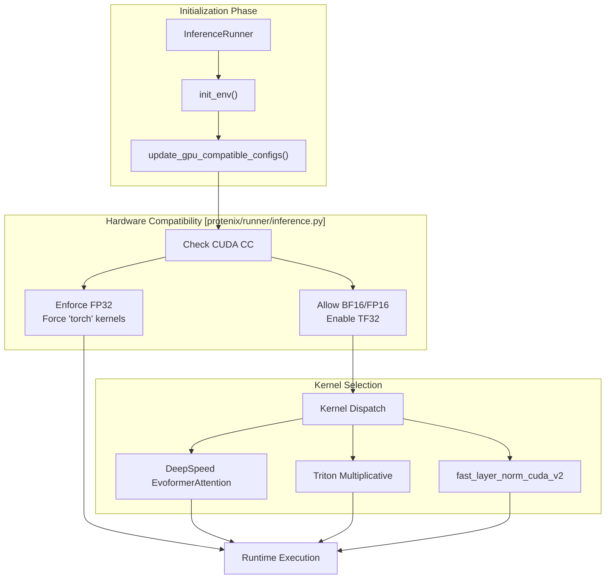
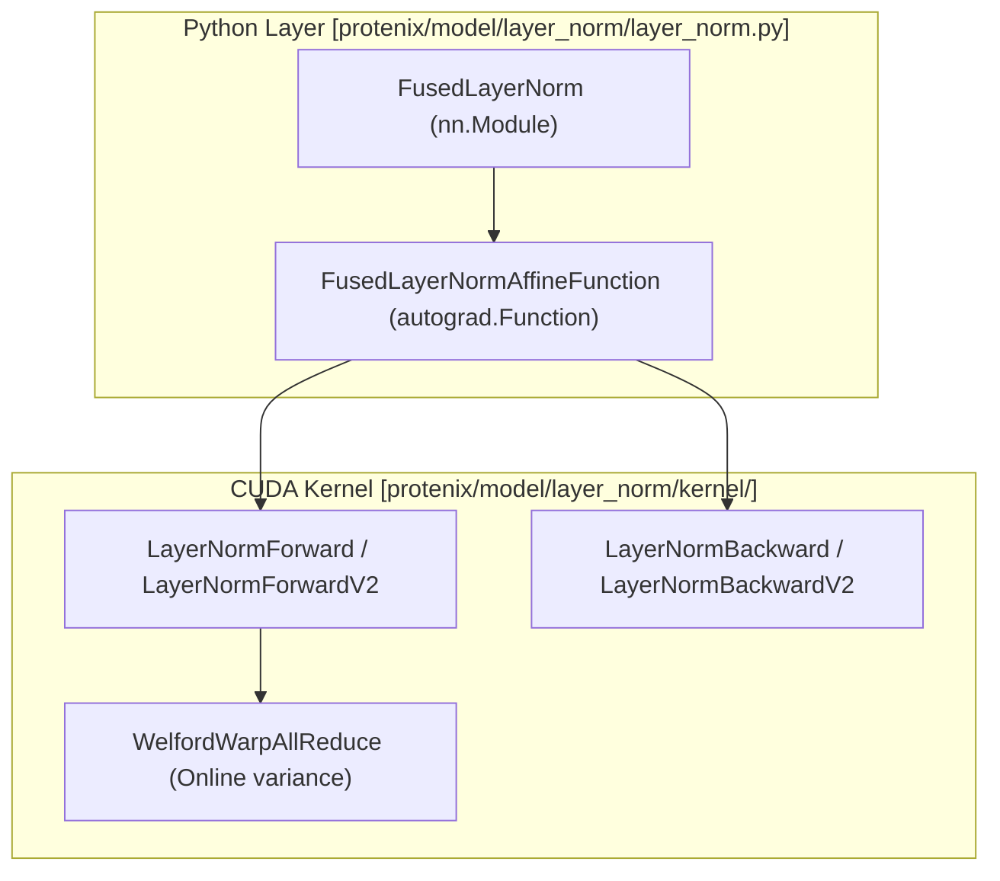

# Performance Optimization

> **Relevant source files**
> * [protenix/model/layer_norm/kernel/layer_norm_cuda_kernel.cu](https://github.com/bytedance/Protenix/blob/c3bfc365/protenix/model/layer_norm/kernel/layer_norm_cuda_kernel.cu)
> * [protenix/model/layer_norm/layer_norm.py](https://github.com/bytedance/Protenix/blob/c3bfc365/protenix/model/layer_norm/layer_norm.py)
> * [protenix/model/layer_norm/torch_ext_compile.py](https://github.com/bytedance/Protenix/blob/c3bfc365/protenix/model/layer_norm/torch_ext_compile.py)
> * [protenix/model/tri_attention/op.py](https://github.com/bytedance/Protenix/blob/c3bfc365/protenix/model/tri_attention/op.py)
> * [protenix/utils/torch_utils.py](https://github.com/bytedance/Protenix/blob/c3bfc365/protenix/utils/torch_utils.py)

This page documents the performance optimization features in Protenix, including dynamic precision management, caching strategies, kernel selection, and memory optimization. These optimizations significantly accelerate inference while maintaining accuracy across various hardware configurations.

---

## Overview of Optimization System

Protenix employs a multi-layered optimization strategy that targets different bottlenecks in the biomolecular structure prediction pipeline. The system includes shared variable caching to reduce redundant computation, efficient bias fusion to minimize kernel launches, and hardware-specific acceleration like TF32.

| Optimization Type | Purpose | Configuration Flag |
| --- | --- | --- |
| **Shared Variable Caching** | Avoid redundant computation during diffusion sampling | `enable_diffusion_shared_vars_cache` |
| **Efficient Bias Fusion** | Fuse transformer operations to reduce memory traffic | `enable_efficient_fusion` |
| **TF32 Acceleration** | Trade precision for speed using TensorFloat-32 format | `enable_tf32` |
| **Custom Kernels** | High-performance CUDA/Triton/DeepSpeed implementations | `triangle_attention`, `triangle_multiplicative`, `LAYERNORM_TYPE` |

### Optimization Flow and Initialization

The optimization settings are initialized and validated against the available hardware during the setup of the `InferenceRunner`.

**Sources:** [protenix/runner/inference.py L76-L111](https://github.com/bytedance/Protenix/blob/c3bfc365/protenix/runner/inference.py#L76-L111)

 [protenix/runner/inference.py L375-L396](https://github.com/bytedance/Protenix/blob/c3bfc365/protenix/runner/inference.py#L375-L396)

---

## Dynamic Precision and AMP Management

Protenix uses Automatic Mixed Precision (AMP) to balance performance and numerical stability. The system dynamically adjusts AMP settings based on the sequence length (token count) to manage memory pressure.

### Memory-Aware AMP Scaling

The `update_inference_configs` function in the `InferenceRunner` adjusts `skip_amp` flags based on the input size:

* **Small/Medium (< 2560 tokens):** Full AMP enabled for maximum speed.
* **Large (2560 - 3840 tokens):** AMP disabled for the confidence head (`configs.skip_amp.confidence_head = False`) to prevent precision-related overflows in large structures.
* **Very Large (> 3840 tokens):** AMP disabled for both confidence head and diffusion sampling (`configs.skip_amp.sample_diffusion = False`) to maximize numerical stability and manage memory.

**Sources:** [protenix/runner/inference.py L281-L295](https://github.com/bytedance/Protenix/blob/c3bfc365/protenix/runner/inference.py#L281-L295)

### TF32 Acceleration

On Ampere and newer GPUs, TensorFloat-32 (TF32) provides up to 3x speedup for matrix multiplications by using a 19-bit mantissa while maintaining the 8-bit exponent of FP32. This is enabled by default via `enable_tf32`.

**Sources:** [protenix/runner/inference.py L427](https://github.com/bytedance/Protenix/blob/c3bfc365/protenix/runner/inference.py#L427-L427)

---

## Shared Variable Caching

During the diffusion process, many components of the model are static across diffusion steps. Protenix caches these "shared variables" after the first step to eliminate redundant computation.

### Cached Entities

The following tensors are typically cached:

1. **Pair Representation (`pair_z`):** The output of the Pairformer stack.
2. **Single Representation (`p_lm`):** Initial sequence embeddings.
3. **Conditioning Features (`c_l`):** Fixed embeddings from the input feature embedder.

By enabling `enable_diffusion_shared_vars_cache`, the model computes these once and reuses them for all subsequent diffusion steps and samples, resulting in a 15-25% reduction in total inference time.

**Sources:** [protenix/runner/inference.py L427](https://github.com/bytedance/Protenix/blob/c3bfc365/protenix/runner/inference.py#L427-L427)

---

## Custom Kernels and LayerNorm Optimization

Protenix provides specialized CUDA and Triton kernels for performance-critical layers.

### Fused LayerNorm

The `FusedLayerNorm` module utilizes a custom CUDA kernel (`fast_layer_norm_cuda_v2`) which fuses the mean/variance calculation and the affine transformation into a single kernel launch.

The kernel uses the **Welford Online Algorithm** for numerically stable variance calculation in a single pass over the data [protenix/model/layer_norm/kernel/layer_norm_cuda_kernel.cu L40-L73](https://github.com/bytedance/Protenix/blob/c3bfc365/protenix/model/layer_norm/kernel/layer_norm_cuda_kernel.cu#L40-L73)

### Kernel Compilation

Custom kernels are compiled JIT using `torch.utils.cpp_extension.load`. The compilation process dynamically detects the GPU architecture and applies optimized flags like `-O3`, `--use_fast_math`, and `-maxrregcount=32`.

**Sources:** [protenix/model/layer_norm/layer_norm.py L53-L66](https://github.com/bytedance/Protenix/blob/c3bfc365/protenix/model/layer_norm/layer_norm.py#L53-L66)

 [protenix/model/layer_norm/torch_ext_compile.py L22-L96](https://github.com/bytedance/Protenix/blob/c3bfc365/protenix/model/layer_norm/torch_ext_compile.py#L22-L96)

### Triangle Attention (Triton/DeepSpeed)

For triangle attention operations, Protenix can dispatch to `TriAttention` implemented via Triton kernels. This implementation includes specialized forward and backward passes (`_attention_fwd`, `_attention_bwd_dq`, etc.) to optimize the specific bias patterns used in AlphaFold3-style architectures.

**Sources:** [protenix/model/tri_attention/op.py L36-L77](https://github.com/bytedance/Protenix/blob/c3bfc365/protenix/model/tri_attention/op.py#L36-L77)

---

## Memory Optimization Techniques

Beyond dynamic AMP, Protenix employs several strategies to fit large biomolecular complexes into GPU memory:

1. **Explicit Cache Clearing:** The `InferenceRunner` calls `torch.cuda.empty_cache()` after each prediction to prevent fragmentation [protenix/runner/inference.py L350](https://github.com/bytedance/Protenix/blob/c3bfc365/protenix/runner/inference.py#L350-L350)
2. **Gradient Checkpointing:** During training, Protenix supports checkpointing to trade compute for memory.
3. **Autocast Control:** The `autocasting_disable_decorator` provides fine-grained control over which functions run in half-precision, preventing memory bloat from unnecessary upcasting [protenix/utils/torch_utils.py L199-L216](https://github.com/bytedance/Protenix/blob/c3bfc365/protenix/utils/torch_utils.py#L199-L216)
4. **In-place Operations:** Custom kernels like `FusedLayerNorm` minimize intermediate tensor allocations.

**Sources:** [protenix/utils/torch_utils.py L199-L216](https://github.com/bytedance/Protenix/blob/c3bfc365/protenix/utils/torch_utils.py#L199-L216)

 [protenix/runner/inference.py L350](https://github.com/bytedance/Protenix/blob/c3bfc365/protenix/runner/inference.py#L350-L350)

---

## Performance Configuration Summary

| Category | Flag | Default | Description |
| --- | --- | --- | --- |
| **Precision** | `dtype` | `bf16` | Default floating point type for model weights and activations. |
| **Precision** | `enable_tf32` | `True` | Enables TensorFloat-32 for matmuls on Ampere+ GPUs. |
| **Caching** | `enable_diffusion_shared_vars_cache` | `True` | Caches static diffusion inputs to skip redundant layers. |
| **Fusion** | `enable_efficient_fusion` | `True` | Enables fused bias and activation kernels. |
| **Kernels** | `triangle_attention` | `torch` | Implementation for triangle attention (`torch`, `deepspeed`). |
| **Kernels** | `triangle_multiplicative` | `torch` | Implementation for triangle multiplicative (`torch`, `triton`). |

**Sources:** [protenix/runner/inference.py L408-L430](https://github.com/bytedance/Protenix/blob/c3bfc365/protenix/runner/inference.py#L408-L430)

 [protenix/model/layer_norm/layer_norm.py L190-L205](https://github.com/bytedance/Protenix/blob/c3bfc365/protenix/model/layer_norm/layer_norm.py#L190-L205)