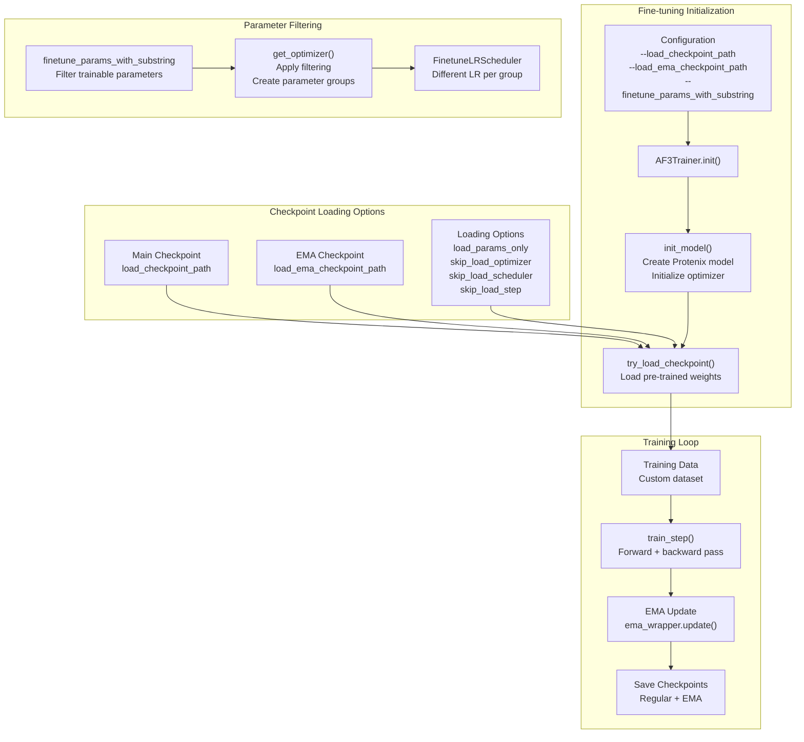
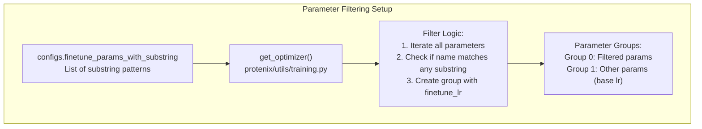
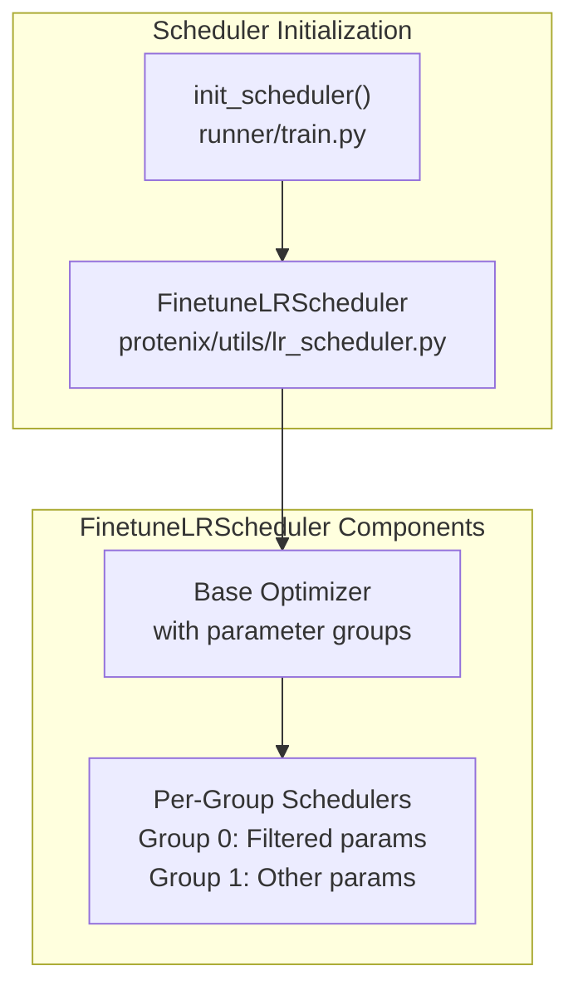
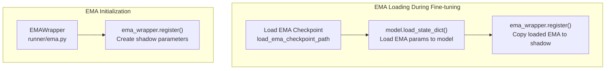
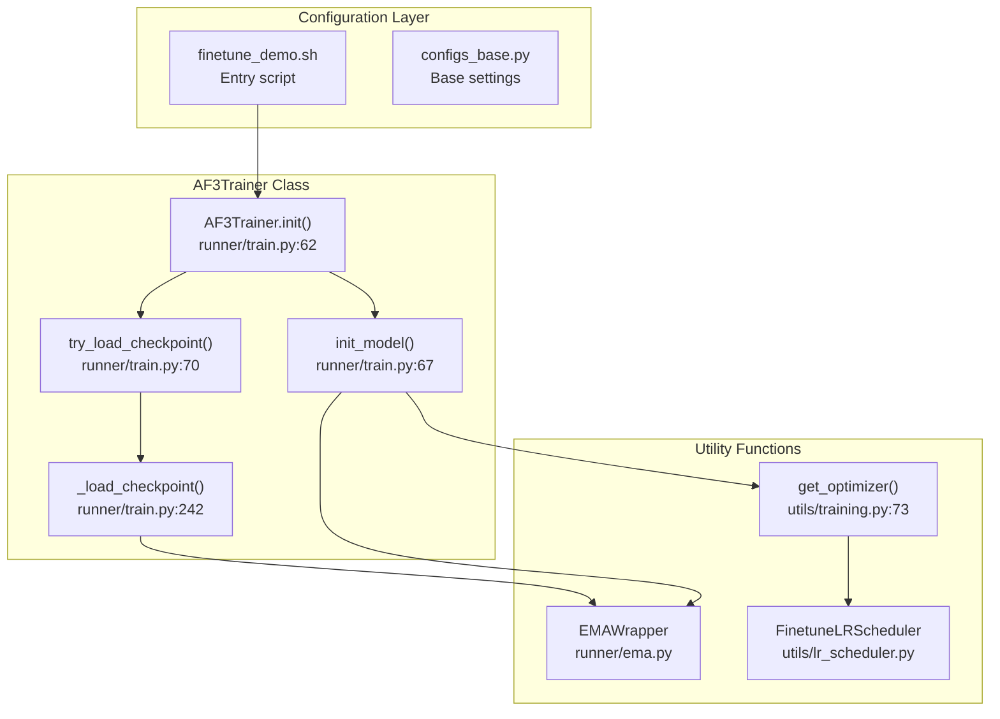

# Fine\-tuning

# Fine\-tuning

> **Relevant source files**
> - [docs/kernels\.md](https://github.com/bytedance/Protenix/blob/c3bfc365/docs/kernels.md?plain=1)
> - [finetune\_demo\.sh](https://github.com/bytedance/Protenix/blob/c3bfc365/finetune_demo.sh)
> - [protenix/utils/permutation/permutation\.py](https://github.com/bytedance/Protenix/blob/c3bfc365/protenix/utils/permutation/permutation.py)
> - [protenix/utils/training\.py](https://github.com/bytedance/Protenix/blob/c3bfc365/protenix/utils/training.py)
> - [runner/train\.py](https://github.com/bytedance/Protenix/blob/c3bfc365/runner/train.py)
> - [train\_demo\.sh](https://github.com/bytedance/Protenix/blob/c3bfc365/train_demo.sh)

## Purpose and Scope

 This document explains how to fine\-tune pre\-trained Protenix models, including multi\-stage fine\-tuning with progressive crop size increases, confidence\-only training, and selective parameter updates\. Fine\-tuning allows adaptation of existing model checkpoints to new data or tasks while preserving learned features\. This page covers checkpoint loading mechanisms, parameter filtering strategies, progressive training stages, learning rate scheduling, and EMA \(Exponential Moving Average\) model handling\.

 The Protenix training process follows the AlphaFold3 approach with multiple fine\-tuning stages that progressively increase the crop size \(384 → 640 → 768 tokens\) and adjust loss function weights\. The final stage performs confidence\-only training to calibrate uncertainty estimates without further updating the structure prediction network\.

 For information about training models from scratch, see [Training Execution](https://deepwiki.com/bytedance/Protenix/6.2-training-execution)\. For loading models during inference, see [Running Inference](https://deepwiki.com/bytedance/Protenix/3.4-running-inference)\. For configuration details, see [Configuration System](https://deepwiki.com/bytedance/Protenix/7-configuration-system)\.

---

## Fine\-tuning Workflow Overview

 Fine\-tuning in Protenix uses the same `AF3Trainer` class as training from scratch but with additional checkpoint loading capabilities\. The workflow differs in three key aspects: \(1\) loading pre\-trained weights, \(2\) optional parameter filtering for selective updates, and \(3\) specialized learning rate scheduling\.



 **Fine\-tuning Flow**: Configuration specifies checkpoint paths and optional parameter filters\. The `AF3Trainer` initializes the model, then loads weights via `try_load_checkpoint()`\. If parameter filtering is enabled, only matching parameters are marked for optimization\. A specialized `FinetuneLRScheduler` applies different learning rates to filtered vs\. unfiltered parameters\. The training loop proceeds similarly to standard training but may freeze certain parameters\.

 Sources: [train\.py L62-L70](https://github.com/bytedance/Protenix/blob/c3bfc365/runner/train.py#L62-L70) [finetune\_demo\.sh L26-L51](https://github.com/bytedance/Protenix/blob/c3bfc365/finetune_demo.sh#L26-L51)

---

## Checkpoint Loading Mechanisms

 The `AF3Trainer.try_load_checkpoint()` method provides flexible checkpoint loading with fine\-grained control over which components to restore\. The method supports loading from two checkpoint types: standard model checkpoints and EMA \(Exponential Moving Average\) checkpoints\.

### Checkpoint Structure

 Each checkpoint file \(`.pt`\) contains the following dictionary keys:

| Key | Description | Type |
| --- | --- | --- |
| model | Model state dictionary | Dict\[str, torch\.Tensor\] |
| optimizer | Optimizer state dictionary | Dict |
| scheduler | Learning rate scheduler state | Dict |
| step | Training step counter | int |

 Sources: [train\.py L226-L240](https://github.com/bytedance/Protenix/blob/c3bfc365/runner/train.py#L226-L240) \(Note: Reference to internal dictionary structure during save/load logic\)\.

### Loading Process

```mermaid
flowchart TD

Start["Start Checkpoint Loading"]
CheckEMA["load_ema_checkpoint_path<br>provided?"]
LoadEMA["Load EMA Checkpoint<br>_load_checkpoint()<br>load_params_only=True"]
RegisterEMA["ema_wrapper.register()<br>Copy loaded weights to EMA"]
CheckMain["load_checkpoint_path<br>provided?"]
LoadMain["Load Main Checkpoint<br>_load_checkpoint()<br>Configurable options"]
End["Checkpoint Loading Complete"]
Validate["Validate checkpoint_path<br>exists"]
LoadFile["torch.load(checkpoint_path)"]
CheckDDP["Sample key starts<br>with 'module.'?"]
StripPrefix["Strip 'module.' prefix<br>if not using DDP"]
LoadModel["model.load_state_dict()<br>strict=load_strict"]
CheckParamsOnly["load_params_only?"]
LoadOptim["Load optimizer state<br>if not skip_load_optimizer"]
LoadStep["Load step counter<br>if not skip_load_step"]
LoadSched["Load scheduler state<br>if not skip_load_scheduler"]
ReinitSched["Reinitialize scheduler<br>if load_step_for_scheduler"]

LoadMain -->|"Calls"| Validate
CheckParamsOnly -->|"Yes"| End

subgraph subGraph1 ["_load_checkpoint() Logic"]
    Validate
    LoadFile
    CheckDDP
    StripPrefix
    LoadModel
    CheckParamsOnly
    LoadOptim
    LoadStep
    LoadSched
    ReinitSched
    Validate --> LoadFile
    LoadFile --> CheckDDP
    CheckDDP -->|"Yes & !use_ddp"| StripPrefix
    CheckDDP -->|"No"| LoadModel
    StripPrefix -->|"Yes & !use_ddp"| LoadModel
    LoadModel -->|"No"| CheckParamsOnly
    CheckParamsOnly -->|"No"| LoadOptim
    LoadOptim -->|"No"| LoadStep
    LoadStep --> LoadSched
    LoadSched --> ReinitSched
end

subgraph try_load_checkpoint() ["try_load_checkpoint()"]
    Start
    CheckEMA
    LoadEMA
    RegisterEMA
    CheckMain
    LoadMain
    End
    Start --> CheckEMA
    CheckEMA -->|"Yes"| LoadEMA
    CheckEMA -->|"No"| CheckMain
    LoadEMA -->|"No"| RegisterEMA
    RegisterEMA -->|"No"| CheckMain
    CheckMain -->|"Yes"| LoadMain
    CheckMain -->|"No"| End
    LoadMain -->|"No"| End
end
```

 **Checkpoint Loading Flow**: The outer method checks for EMA checkpoint first \(if specified\), loads only model parameters, and registers them with the EMA wrapper\. Then it loads the main checkpoint with full configurability\. The inner `_load_checkpoint()` function handles DDP prefix stripping, strict loading, and optional restoration of optimizer/scheduler/step states\.

 Sources: [train\.py L242-L309](https://github.com/bytedance/Protenix/blob/c3bfc365/runner/train.py#L242-L309)

### Configuration Options

 The following configuration flags control checkpoint loading behavior:

| Flag | Type | Default | Description |
| --- | --- | --- | --- |
| load\_checkpoint\_path | str | None | Path to main checkpoint file |
| load\_ema\_checkpoint\_path | str | None | Path to EMA checkpoint file |
| load\_params\_only | bool | False | Load only model weights, skip optimizer/scheduler |
| load\_strict | bool | True | Strict model state dict loading |
| skip\_load\_optimizer | bool | False | Skip restoring optimizer state |
| skip\_load\_scheduler | bool | False | Skip restoring scheduler state |
| skip\_load\_step | bool | False | Skip restoring step counter |
| load\_step\_for\_scheduler | bool | True | Reinitialize scheduler with loaded step |

 Sources: [train\.py L242-L309](https://github.com/bytedance/Protenix/blob/c3bfc365/runner/train.py#L242-L309)

### DDP Checkpoint Compatibility

 Checkpoints saved with DistributedDataParallel \(DDP\) have parameter keys prefixed with `"module."`\. The loading logic automatically handles this:

```
# From runner/train.py:258-264sample_key = [k for k in checkpoint["model"].keys()][0]if sample_key.startswith("module.") and not self.use_ddp:    # DDP checkpoint has module. prefix    checkpoint["model"] = {        k[len("module.") :]: v for k, v in checkpoint["model"].items()    }
```

 This allows loading DDP checkpoints in single\-GPU environments and vice versa\.

 Sources: [train\.py L258-L264](https://github.com/bytedance/Protenix/blob/c3bfc365/runner/train.py#L258-L264)

---

## Parameter Filtering for Selective Fine\-tuning

 Protenix supports selective fine\-tuning by filtering parameters based on substring matching\. This allows you to freeze most of the model while updating only specific components\.

### Parameter Filtering Configuration

 The `get_optimizer` function in `protenix/utils/training.py` handles the creation of parameter groups based on substrings\.



 **Parameter Filtering Mechanism**: The `get_optimizer` function checks if `param_names` \(derived from `finetune_params_with_substring`\) are provided\. If so, it iterates through `model.named_parameters()`, checking if any substring matches the parameter name\. Matching parameters are placed in a group with `configs.finetune.lr`, while others use `configs.lr`\.

 Sources: [training\.py L73-L115](https://github.com/bytedance/Protenix/blob/c3bfc365/protenix/utils/training.py#L73-L115)

### Usage Example from finetune\_demo\.sh

```
# From finetune_demo.sh:26-51python3 ./runner/train.py \--model_name "protenix_base_default_v1.0.0" \--load_checkpoint_path ${checkpoint_path} \--load_ema_checkpoint_path ${checkpoint_path} \--lr 0.001 \--train_crop_size 384 \--max_steps 100000 \--warmup_steps 2000
```

 Sources: [finetune\_demo\.sh L26-L51](https://github.com/bytedance/Protenix/blob/c3bfc365/finetune_demo.sh#L26-L51)

---

## Learning Rate Scheduling for Fine\-tuning

 When parameter filtering is enabled, Protenix can use the `FinetuneLRScheduler` class to apply different learning rate schedules to different parameter groups\.

### FinetuneLRScheduler Architecture

 The `FinetuneLRScheduler` in `protenix/utils/lr_scheduler.py` \(referenced by `runner/train.py`\) manages per\-group schedules\.



 Sources: [train\.py L37](https://github.com/bytedance/Protenix/blob/c3bfc365/runner/train.py#L37-L37) [protenix/utils/lr\_scheduler\.py](https://github.com/bytedance/Protenix/blob/c3bfc365/protenix/utils/lr_scheduler.py)

---

## EMA Checkpoint Handling

 Exponential Moving Average \(EMA\) maintains a shadow copy of model parameters\. During fine\-tuning, EMA checkpoints require special handling to preserve smoothed weights\.

### EMA Wrapper Architecture



 **EMA Handling During Fine\-tuning**: The system loads the EMA checkpoint parameters directly into the model, then registers them as the EMA shadow copy via `ema_wrapper.register()`\. Subsequently, it loads the main checkpoint, which overwrites the model parameters but leaves the shadow parameters as they were loaded from the EMA checkpoint\.

 Sources: [train\.py L291-L297](https://github.com/bytedance/Protenix/blob/c3bfc365/runner/train.py#L291-L297) [runner/ema\.py](https://github.com/bytedance/Protenix/blob/c3bfc365/runner/ema.py)

---

## Kernel and Performance Options

 Fine\-tuning efficiency is enhanced by specialized kernels\.

| Kernel Type | Options | File Reference |
| --- | --- | --- |
| Layernorm | fast\_layernorm \(default\), torch | docs/kernels\.md3\-9 |
| Triangle Attention | triattention, cuequivariance, deepspeed, torch | docs/kernels\.md10\-14 |
| Triangle Multiplicative | cuequivariance, torch | docs/kernels\.md39\-44 |

 To disable custom kernels, set environment variables:

```
export LAYERNORM_TYPE=torch
```

 Sources: [kernels\.md?plain=1 L1-L52](https://github.com/bytedance/Protenix/blob/c3bfc365/docs/kernels.md?plain=1#L1-L52) [finetune\_demo\.sh L15-L19](https://github.com/bytedance/Protenix/blob/c3bfc365/finetune_demo.sh#L15-L19)

---

## Execution and Configuration

### Fine\-tuning Execution \(finetune\_demo\.sh\)

 The `finetune_demo.sh` script demonstrates a standard fine\-tuning setup:

```
python3 ./runner/train.py \--model_name "protenix_base_default_v1.0.0" \--run_name protenix_finetune \--dtype bf16 \--train_crop_size 384 \--lr 0.001 \--load_checkpoint_path ${checkpoint_path} \--load_ema_checkpoint_path ${checkpoint_path} \--data.train_sets weightedPDB_before2109_wopb_nometalc_0925 \--data.weightedPDB_before2109_wopb_nometalc_0925.base_info.pdb_list examples/finetune_subset.txt
```

 Sources: [finetune\_demo\.sh L26-L51](https://github.com/bytedance/Protenix/blob/c3bfc365/finetune_demo.sh#L26-L51)

### Code Entity Reference Map

 This diagram maps high\-level fine\-tuning concepts to specific code entities:



 Sources: [train\.py L54-L309](https://github.com/bytedance/Protenix/blob/c3bfc365/runner/train.py#L54-L309) [training\.py L73-L115](https://github.com/bytedance/Protenix/blob/c3bfc365/protenix/utils/training.py#L73-L115) [finetune\_demo\.sh L1-L51](https://github.com/bytedance/Protenix/blob/c3bfc365/finetune_demo.sh#L1-L51)

---
*Source: [https://deepwiki.com/bytedance/Protenix/6.3-fine-tuning](https://deepwiki.com/bytedance/Protenix/6.3-fine-tuning) on DeepWiki*