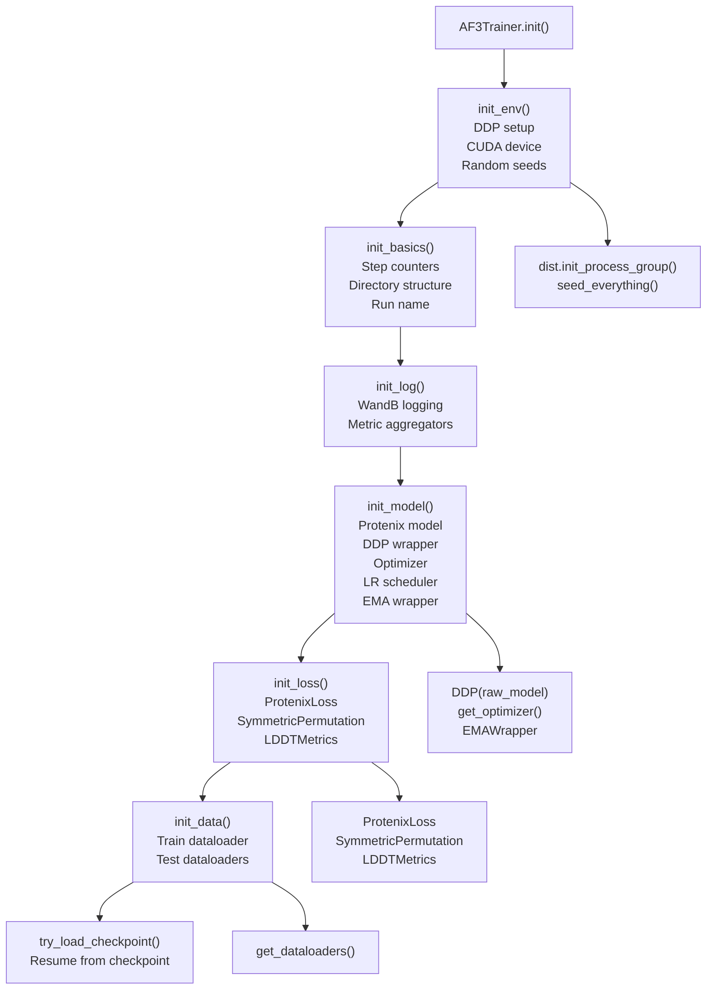
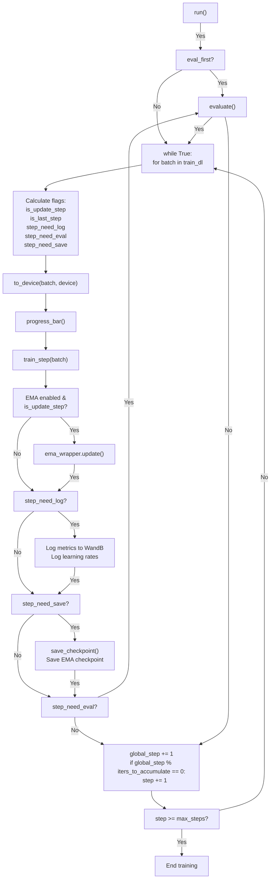
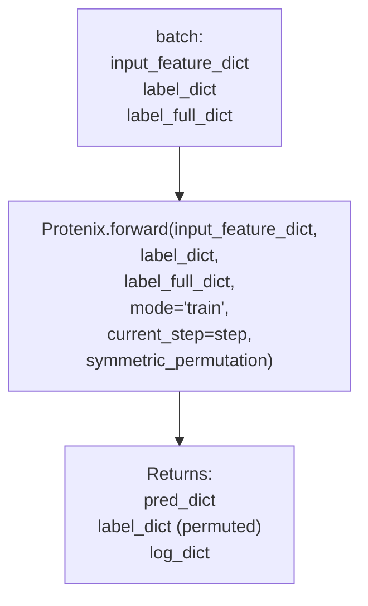
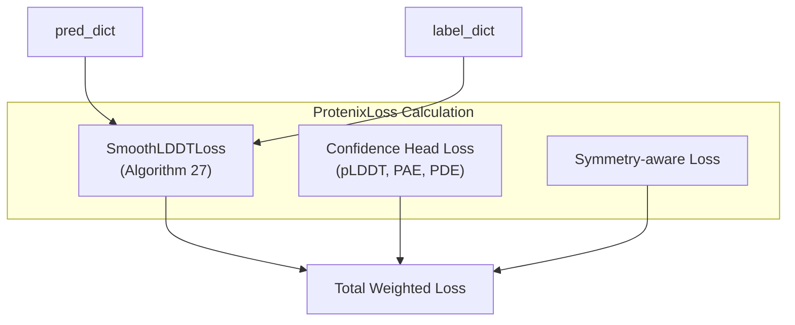

# Training Execution

# Training Execution

> **Relevant source files**
> - [docs/kernels\.md](https://github.com/bytedance/Protenix/blob/c3bfc365/docs/kernels.md?plain=1)
> - [finetune\_demo\.sh](https://github.com/bytedance/Protenix/blob/c3bfc365/finetune_demo.sh)
> - [protenix/metrics/lddt\_metrics\.py](https://github.com/bytedance/Protenix/blob/c3bfc365/protenix/metrics/lddt_metrics.py)
> - [protenix/model/loss\.py](https://github.com/bytedance/Protenix/blob/c3bfc365/protenix/model/loss.py)
> - [protenix/model/modules/primitives\.py](https://github.com/bytedance/Protenix/blob/c3bfc365/protenix/model/modules/primitives.py)
> - [protenix/model/utils\.py](https://github.com/bytedance/Protenix/blob/c3bfc365/protenix/model/utils.py)
> - [protenix/utils/lr\_scheduler\.py](https://github.com/bytedance/Protenix/blob/c3bfc365/protenix/utils/lr_scheduler.py)
> - [protenix/utils/permutation/permutation\.py](https://github.com/bytedance/Protenix/blob/c3bfc365/protenix/utils/permutation/permutation.py)
> - [protenix/utils/training\.py](https://github.com/bytedance/Protenix/blob/c3bfc365/protenix/utils/training.py)
> - [runner/train\.py](https://github.com/bytedance/Protenix/blob/c3bfc365/runner/train.py)
> - [train\_demo\.sh](https://github.com/bytedance/Protenix/blob/c3bfc365/train_demo.sh)

## Purpose and Scope

 This document describes the execution mechanics of training Protenix models using the `AF3Trainer` class\. It covers the training loop, loss calculation, symmetric permutation for handling molecular symmetries, distributed training setup, checkpointing, and gradient optimization\. For information about preparing training data, see section 6\.1\. For fine\-tuning pre\-trained models, see section 6\.3\.

 The training system implements a sophisticated two\-stage diffusion process: a mini\-rollout phase for label alignment via symmetric permutation, followed by full denoising training\. This approach handles the inherent symmetries in molecular structures while training the model to denoise coordinates\.

 **Sources:** [train\.py L1-L617](https://github.com/bytedance/Protenix/blob/c3bfc365/runner/train.py#L1-L617)

---

## AF3Trainer Class Architecture

 The `AF3Trainer` class orchestrates all aspects of model training\. It initializes through a sequence of setup phases, each responsible for a specific aspect of the training infrastructure:

 Title: AF3Trainer Initialization Sequence



 **Initialization Sequence:**

| Phase | Method | Responsibilities |
| --- | --- | --- |
| 1\. Environment | init\_env\(\) | Initialize distributed process group \(NCCL\), set CUDA device, configure random seeds \(rank\-specific or deterministic\), validate kernel settings\. runner/train\.py129\-178 |
| 2\. Basics | init\_basics\(\) | Initialize step counters \(step, global\_step, start\_step\), create directory structure \(checkpoints, predictions, structures, dumps, errors\), generate run name with timestamp\. runner/train\.py72\-115 |
| 3\. Logging | init\_log\(\) | Initialize WandB if enabled, create SimpleMetricAggregator for training metrics\. runner/train\.py116\-127 |
| 4\. Model | init\_model\(\) | Instantiate Protenix model, wrap with DDP for multi\-GPU, create optimizer, initialize LR scheduler, register EMA if enabled\. runner/train\.py164\-178 |
| 5\. Loss | init\_loss\(\) | Create ProtenixLoss, SymmetricPermutation, and LDDTMetrics instances\. runner/train\.py179\-185 |
| 6\. Data | init\_data\(\) | Initialize training and test dataloaders via get\_dataloaders\(\)\. runner/train\.py218\-225 |
| 7\. Checkpoint | try\_load\_checkpoint\(\) | Load checkpoint if specified, restore model/optimizer/scheduler state\. runner/train\.py226\-309 |

 **Sources:** [train\.py L54-L225](https://github.com/bytedance/Protenix/blob/c3bfc365/runner/train.py#L54-L225)

---

## Training Loop Mechanics

 The main training loop in `AF3Trainer.run()` implements a sophisticated iteration scheme with gradient accumulation, periodic evaluation, and checkpointing:

 Title: AF3Trainer Execution Loop



 **Step Counters:**

 - **`step`**: Effective training steps considering gradient accumulation \(increments after optimizer update\)\. [train\.py L77](https://github.com/bytedance/Protenix/blob/c3bfc365/runner/train.py#L77-L77)
- **`global_step`**: Actual forward passes \(`global_step = step * iters_to_accumulate`\)\. [train\.py L79](https://github.com/bytedance/Protenix/blob/c3bfc365/runner/train.py#L79-L79)
- **`iters_to_accumulate`**: Number of gradient accumulation iterations before optimizer step\. [train\.py L82](https://github.com/bytedance/Protenix/blob/c3bfc365/runner/train.py#L82-L82)

 **Conditional Execution Flags:**

 All periodic actions \(logging, evaluation, checkpointing\) are gated by `is_update_step` to ensure they occur only after actual optimizer updates:

```
is_update_step = (self.global_step + 1) % self.iters_to_accumulate == 0step_need_log = (self.step + 1) % self.configs.log_interval == 0step_need_eval = (self.step + 1) % self.configs.eval_interval == 0step_need_save = (self.step + 1) % self.configs.checkpoint_interval == 0 # All flags are AND-ed with is_update_stepstep_need_log &= is_update_stepstep_need_eval &= is_update_stepstep_need_save &= is_update_step
```

 [train\.py L512-L530](https://github.com/bytedance/Protenix/blob/c3bfc365/runner/train.py#L512-L530)

 **Sources:** [train\.py L512-L583](https://github.com/bytedance/Protenix/blob/c3bfc365/runner/train.py#L512-L583)

---

## Training Step Execution

 The `train_step()` method executes a single training iteration with mixed precision training and gradient accumulation:

 Title: train\_step Logic and Mixed Precision

```mermaid
flowchart TD

Unscale["scaler.unscale_(optimizer)"]
SetTrain["model.train()"]
SetupAMP["Setup autocast:<br>fp32/bf16/fp16<br>cache_enabled=False"]
SetupScaler["Setup GradScaler<br>(for fp16 only)"]
ModelForward["model_forward(batch, mode='train')"]
GetLoss["get_loss(batch, mode='train')"]
CheckNaN["Loss is NaN?"]
ZeroLoss["loss = 0.0<br>(skip iteration)"]
ScaleBackward["scaler.scale(loss / iters_to_accumulate).backward()"]
CheckAccum["(global_step + 1) %<br>iters_to_accumulate == 0?"]
LogMetrics["Log loss_dict to<br>train_metric_wrapper"]
GradClip["update()<br>clip_grad_norm_()"]
OptimizerStep["scaler.step(optimizer)"]
UpdateScaler["scaler.update()"]
ZeroGrad["optimizer.zero_grad(set_to_none=True)"]
LRStep["lr_scheduler.step()"]
ClearCache["torch.cuda.empty_cache()"]

subgraph train_step(batch) ["train_step(batch)"]
    SetTrain
    SetupAMP
    SetupScaler
    CheckNaN
    ZeroLoss
    ScaleBackward
    CheckAccum
    LogMetrics
    ClearCache
    SetTrain --> SetupAMP
    SetupAMP --> SetupScaler
    SetupScaler --> ModelForward
    GetLoss -->|"Yes, bf16/fp32"| CheckNaN
    CheckNaN -->|"Yes, bf16/fp32"| ZeroLoss
    CheckNaN -->|"No"| ScaleBackward
    ZeroLoss -->|"No"| ScaleBackward
    ScaleBackward --> CheckAccum
    CheckAccum -->|"Yes"| Unscale
    CheckAccum -->|"No"| LogMetrics
    LRStep --> LogMetrics
    LogMetrics --> ClearCache

subgraph subGraph1 ["Optimizer Step"]
    Unscale
    GradClip
    OptimizerStep
    UpdateScaler
    ZeroGrad
    LRStep
    Unscale --> GradClip
    GradClip -->|"No"| OptimizerStep
    OptimizerStep -->|"No"| UpdateScaler
    UpdateScaler -->|"No"| ZeroGrad
    ZeroGrad --> LRStep
end

subgraph subGraph0 ["Forward Pass (with AMP)"]
    ModelForward
    GetLoss
    ModelForward --> GetLoss
end
end
```

 **Mixed Precision Training:**

 The training supports three precision modes configured via `configs.dtype`:

| Mode | PyTorch Type | Scaler Enabled | Use Case |
| --- | --- | --- | --- |
| fp32 | torch\.float32 | No | Maximum precision, slower |
| bf16 | torch\.bfloat16 | No | Balanced, recommended for training |
| fp16 | torch\.float16 | Yes | Faster, requires loss scaling |

 [train\.py L440-L456](https://github.com/bytedance/Protenix/blob/c3bfc365/runner/train.py#L440-L456)

 **Gradient Accumulation:**

 Loss is scaled by `iters_to_accumulate` before backpropagation to maintain consistent gradient magnitudes\. The optimizer step occurs only when `(global_step + 1) % iters_to_accumulate == 0`\. [train\.py L470-L475](https://github.com/bytedance/Protenix/blob/c3bfc365/runner/train.py#L470-L475)

 **NaN Handling:**

 For `bf16` and `fp32` modes, if loss is NaN \(checked via `is_loss_nan_check`\), the iteration is skipped by replacing the loss with `torch.tensor(0.0, requires_grad=True)`\. [train\.py L465-L468](https://github.com/bytedance/Protenix/blob/c3bfc365/runner/train.py#L465-L468) [training\.py L118-L144](https://github.com/bytedance/Protenix/blob/c3bfc365/protenix/utils/training.py#L118-L144)

 **Sources:** [train\.py L440-L489](https://github.com/bytedance/Protenix/blob/c3bfc365/runner/train.py#L440-L489) [training\.py L118-L144](https://github.com/bytedance/Protenix/blob/c3bfc365/protenix/utils/training.py#L118-L144)

---

## Model Forward Pass and Loss Calculation

### Model Forward \(`model_forward`\)

 The model receives the current step and `SymmetricPermutation` instance, enabling step\-dependent behavior \(e\.g\., noise schedules\) and label permutation during mini\-rollout\.

 Title: Data Flow to Protenix Forward



 [train\.py L314-L332](https://github.com/bytedance/Protenix/blob/c3bfc365/runner/train.py#L314-L332)

### Loss Calculation \(`get_loss`\)

 The `ProtenixLoss` class computes the weighted sum of various loss terms\. The `autocasting_disable_decorator` can selectively disable automatic mixed precision for loss calculation if `configs.skip_amp.loss` is set\. [train\.py L334-L349](https://github.com/bytedance/Protenix/blob/c3bfc365/runner/train.py#L334-L349)

 Title: ProtenixLoss Component Mapping



 **Smooth LDDT Loss:** Implements Algorithm 27 in AF3 via `SmoothLDDTLoss`\. It computes the distance error between predicted and true coordinates using a sigmoid\-based thresholding scheme\. [loss\.py L63-L160](https://github.com/bytedance/Protenix/blob/c3bfc365/protenix/model/loss.py#L63-L160)

 **Sources:** [train\.py L314-L349](https://github.com/bytedance/Protenix/blob/c3bfc365/runner/train.py#L314-L349) [loss\.py L63-L210](https://github.com/bytedance/Protenix/blob/c3bfc365/protenix/model/loss.py#L63-L210)

---

## Symmetric Permutation System

 The `SymmetricPermutation` class handles molecular symmetries from structurally equivalent chains and atoms\. [permutation\.py L22-L39](https://github.com/bytedance/Protenix/blob/c3bfc365/protenix/utils/permutation/permutation.py#L22-L39)

### Mini\-Rollout Permutation

 Labels are permuted to match the predicted structure before computing training signals\.

 Title: Label Alignment via Mini\-Rollout

```mermaid
flowchart TD

AP["atom_permutation.run()"]
Input["mini_coord<br>input_feature_dict<br>label_dict<br>label_full_dict"]
CP["chain_permutation.run()"]
CP_Update["Update label_dict"]
AP_Update["Update label_dict"]
Output["permuted label_dict"]

subgraph permute_label_to_match_mini_rollout() ["permute_label_to_match_mini_rollout()"]
    Input
    Output
    Input --> CP
    CP_Update --> AP
    AP_Update --> Output

subgraph subGraph1 ["Stage 2: Atom Permutation"]
    AP
    AP_Update
    AP --> AP_Update
end

subgraph subGraph0 ["Stage 1: Chain Permutation"]
    CP
    CP_Update
    CP --> CP_Update
end
end
```

 [permutation\.py L40-L113](https://github.com/bytedance/Protenix/blob/c3bfc365/protenix/utils/permutation/permutation.py#L40-L113)

### Diffusion Sample Permutation

 After full diffusion sampling, predictions are permuted to match the label structure for evaluation and loss calculation\. [permutation\.py L115-L220](https://github.com/bytedance/Protenix/blob/c3bfc365/protenix/utils/permutation/permutation.py#L115-L220)

 **Sources:** [permutation\.py L1-L488](https://github.com/bytedance/Protenix/blob/c3bfc365/protenix/utils/permutation/permutation.py#L1-L488)

---

## Optimizer and Learning Rate Scheduling

### Optimizer Configuration

 The `get_optimizer` function creates either `AdamW` or `Adam` optimizers\. It supports parameter grouping for weight decay and selective fine\-tuning\. [training\.py L73-L115](https://github.com/bytedance/Protenix/blob/c3bfc365/protenix/utils/training.py#L73-L115)

 **Weight Decay Grouping:** In `get_adamw`, parameters with 2 or more dimensions \(weights, embeddings\) receive weight decay, while 1D parameters \(biases, layernorm scales\) do not\. [training\.py L41-L52](https://github.com/bytedance/Protenix/blob/c3bfc365/protenix/utils/training.py#L41-L52)

### Learning Rate Schedulers

 Protenix implements specialized schedulers in `protenix/utils/lr_scheduler.py`:

| Scheduler | Class | Description |
| --- | --- | --- |
| AF3 | AlphaFold3LRScheduler | Linear warmup followed by staircase decay every N steps\. protenix/utils/lr\_scheduler\.py67\-102 |
| Cosine | CosineAnnealingWithWarmup | Linear warmup followed by cosine annealing to a minimum LR\. protenix/utils/lr\_scheduler\.py22\-64 |
| Constant | ConstantLRScheduler | Constant LR throughout training\. protenix/utils/lr\_scheduler\.py105\-114 |
| Finetune | FinetuneLRScheduler | Wraps two schedulers for different parameter groups\. protenix/utils/lr\_scheduler\.py116\-145 |

 **Sources:** [training\.py L21-L115](https://github.com/bytedance/Protenix/blob/c3bfc365/protenix/utils/training.py#L21-L115) [lr\_scheduler\.py L1-L186](https://github.com/bytedance/Protenix/blob/c3bfc365/protenix/utils/lr_scheduler.py#L1-L186)

---

## Kernel Optimization

 Training execution is accelerated using custom CUDA kernels:

 - **Fast Layernorm**: Modified from FastFold/Oneflow, used by default\. Accelerates training by 30\-50%\. [kernels\.md?plain=1 L3-L9](https://github.com/bytedance/Protenix/blob/c3bfc365/docs/kernels.md?plain=1#L3-L9)
- **Triangle Attention**: Supports `triattention` \(custom\), `cuequivariance`, `deepspeed`, and `torch` implementations\. [kernels\.md?plain=1 L10-L37](https://github.com/bytedance/Protenix/blob/c3bfc365/docs/kernels.md?plain=1#L10-L37)
- **Triangle Multiplicative**: Supports `cuequivariance` and `torch`\. [kernels\.md?plain=1 L39-L50](https://github.com/bytedance/Protenix/blob/c3bfc365/docs/kernels.md?plain=1#L39-L50)

 **Sources:** [kernels\.md?plain=1 L1-L52](https://github.com/bytedance/Protenix/blob/c3bfc365/docs/kernels.md?plain=1#L1-L52) [train\_demo\.sh L15-L19](https://github.com/bytedance/Protenix/blob/c3bfc365/train_demo.sh#L15-L19)

---
*Source: [https://deepwiki.com/bytedance/Protenix/6.2-training-execution](https://deepwiki.com/bytedance/Protenix/6.2-training-execution) on DeepWiki*