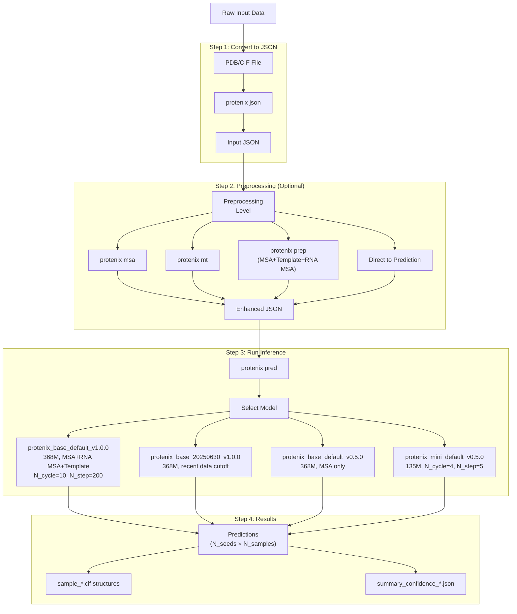

# Quick Start Guide

> **Relevant source files**
> * [docs/msa_template_pipeline.md](https://github.com/bytedance/Protenix/blob/c3bfc365/docs/msa_template_pipeline.md?plain=1)
> * [docs/training_inference_instructions.md](https://github.com/bytedance/Protenix/blob/c3bfc365/docs/training_inference_instructions.md?plain=1)
> * [examples/2lwu.cif](https://github.com/bytedance/Protenix/blob/c3bfc365/examples/2lwu.cif)
> * [examples/example.json](https://github.com/bytedance/Protenix/blob/c3bfc365/examples/example.json)
> * [examples/example_without_msa.json](https://github.com/bytedance/Protenix/blob/c3bfc365/examples/example_without_msa.json)
> * [inference_demo.sh](https://github.com/bytedance/Protenix/blob/c3bfc365/inference_demo.sh)
> * [protenix/version.py](https://github.com/bytedance/Protenix/blob/c3bfc365/protenix/version.py)

This guide provides a rapid walkthrough of the most common Protenix workflows: converting structural data to JSON format, running MSA searches, and performing structure predictions. For installation instructions, see [Installation and Setup](/bytedance/Protenix/1.2-installation-and-setup). For comprehensive inference documentation, see [Inference System](/bytedance/Protenix/3-inference-system). For training workflows, see [Training System](/bytedance/Protenix/6-training-system).

## Scope

This page covers:

* **Command-line interface basics**: The five primary commands (`protenix json`, `protenix msa`, `protenix mt`, `protenix prep`, `protenix pred`) [docs/training_inference_instructions.md L48-L54](https://github.com/bytedance/Protenix/blob/c3bfc365/docs/training_inference_instructions.md?plain=1#L48-L54)
* **Common workflows**: Standard pipelines from PDB/CIF files to predictions [inference_demo.sh L75-L163](https://github.com/bytedance/Protenix/blob/c3bfc365/inference_demo.sh#L75-L163)
* **Quick examples**: Copy-paste commands for immediate use [inference_demo.sh L75-L163](https://github.com/bytedance/Protenix/blob/c3bfc365/inference_demo.sh#L75-L163)
* **Parameter selection**: Choosing appropriate model variants and settings [inference_demo.sh L42-L49](https://github.com/bytedance/Protenix/blob/c3bfc365/inference_demo.sh#L42-L49)

---

## Quick Start Workflow



**Sources:** [docs/training_inference_instructions.md L48-L54](https://github.com/bytedance/Protenix/blob/c3bfc365/docs/training_inference_instructions.md?plain=1#L48-L54)

 [inference_demo.sh L75-L163](https://github.com/bytedance/Protenix/blob/c3bfc365/inference_demo.sh#L75-L163)

---

## Prerequisites

Ensure Protenix is installed (see [Installation and Setup](/bytedance/Protenix/1.2-installation-and-setup)):

```
pip3 install protenix
```

[docs/training_inference_instructions.md L9-L10](https://github.com/bytedance/Protenix/blob/c3bfc365/docs/training_inference_instructions.md?plain=1#L9-L10)

For features such as **Template search** and **RNA MSA search**, additional system tools are required:

* **kalign**: Used for sequence alignment [docs/training_inference_instructions.md L30](https://github.com/bytedance/Protenix/blob/c3bfc365/docs/training_inference_instructions.md?plain=1#L30-L30)
* **hmmer**: Used for sequence profile searches [docs/training_inference_instructions.md L31](https://github.com/bytedance/Protenix/blob/c3bfc365/docs/training_inference_instructions.md?plain=1#L31-L31)

On Ubuntu/Debian:

```sql
apt-get update && apt-get install -y kalign hmmer
```

[docs/training_inference_instructions.md L37-L38](https://github.com/bytedance/Protenix/blob/c3bfc365/docs/training_inference_instructions.md?plain=1#L37-L38)

---

## Command-Line Interface Structure

The Protenix CLI provides five primary commands implemented through Click decorators:

```mermaid
flowchart TD

ProtenixCLI["protenix_cli()<br>runner/batch_inference.py"]
ToJSONCmd["tojson()<br>docs/training_inference_instructions.md:51"]
ToJSONOpts["--input: PDB/CIF file<br>--out_dir: output directory<br>--altloc: altloc selection<br>--include_discont_poly_poly_bonds"]
MSACmd["msa()<br>docs/training_inference_instructions.md:52"]
MSAOpts["--input: JSON or FASTA<br>--out_dir: output directory<br>--msa_server_mode: protenix|colabfold"]
MTCmd["msatemplate()<br>docs/training_inference_instructions.md:53"]
MTOpts["--input: JSON file<br>--seqres_database_path"]
PrepCmd["inputprep()<br>docs/training_inference_instructions.md:54"]
PrepOpts["--input: JSON file<br>Full MSA + Template + RNA MSA"]
PredictCmd["predict()<br>docs/training_inference_instructions.md:50"]
PredictOpts["-i: JSON file or dir<br>-s: inference seeds<br>-c, -p, -e: cycles/steps/samples<br>-n: model variant<br>--use_template, --use_rna_msa"]

ProtenixCLI --> ToJSONCmd
ProtenixCLI --> MSACmd
ProtenixCLI --> MTCmd
ProtenixCLI --> PrepCmd
ProtenixCLI --> PredictCmd

subgraph subGraph5 ["Command: pred (predict)"]
    PredictCmd
    PredictOpts
end

subgraph subGraph4 ["Command: prep (inputprep)"]
    PrepCmd
    PrepOpts
end

subgraph subGraph3 ["Command: mt (msatemplate)"]
    MTCmd
    MTOpts
end

subgraph subGraph2 ["Command: msa"]
    MSACmd
    MSAOpts
end

subgraph subGraph1 ["Command: json (tojson)"]
    ToJSONCmd
    ToJSONOpts
end

subgraph subGraph0 ["CLI Entry Point"]
    ProtenixCLI
end
```



**Sources:** [docs/training_inference_instructions.md L48-L54](https://github.com/bytedance/Protenix/blob/c3bfc365/docs/training_inference_instructions.md?plain=1#L48-L54)

 [inference_demo.sh L22-L39](https://github.com/bytedance/Protenix/blob/c3bfc365/inference_demo.sh#L22-L39)

---

## Step 1: Converting Structures to JSON

The `protenix json` command converts PDB or CIF files into the JSON format required for inference.

### Basic Usage

```markdown
# Convert PDB to JSONprotenix json --input ./examples/7pzb.pdb --out_dir ./output --altloc first # Convert CIF to JSONprotenix json --input ./examples/7pzb.cif --out_dir ./output --altloc first # Keep discontinuous polymer-polymer bonds (e.g. cyclic-peptide)protenix json --input ./examples/2lwu.cif --out_dir ./output --altloc first --include_discont_poly_poly_bonds
```

[docs/training_inference_instructions.md L60-L67](https://github.com/bytedance/Protenix/blob/c3bfc365/docs/training_inference_instructions.md?plain=1#L60-L67)

### Output Format

Each input structure generates a JSON file where chains and ligands are defined. For example, a protein chain entry includes sequence and optional MSA paths:

```json
{    "proteinChain": {        "sequence": "MGSSHHHHHH...",        "count": 1,        "id": ["A"],        "msa": {            "precomputed_msa_dir": "./examples/7r6r/msa/1",            "pairing_db": "uniref100"        }    }}
```

**Sources:** [examples/example.json L4-L12](https://github.com/bytedance/Protenix/blob/c3bfc365/examples/example.json#L4-L12)

 [docs/training_inference_instructions.md L57-L68](https://github.com/bytedance/Protenix/blob/c3bfc365/docs/training_inference_instructions.md?plain=1#L57-L68)

---

## Step 2: Running Preprocessing (Optional)

Protenix supports multiple preprocessing levels to enrich input data with evolutionary and structural information. The v1.0.0 models support MSA, RNA MSA, and template features.

### Preprocessing Commands

| Command | Alias | Description |
| --- | --- | --- |
| `protenix msa` | `msa` | Generate protein multiple sequence alignments [docs/training_inference_instructions.md L52](https://github.com/bytedance/Protenix/blob/c3bfc365/docs/training_inference_instructions.md?plain=1#L52-L52) |
| `protenix mt` | `mt` | Run sequential MSA and template search [docs/training_inference_instructions.md L53](https://github.com/bytedance/Protenix/blob/c3bfc365/docs/training_inference_instructions.md?plain=1#L53-L53) |
| `protenix prep` | `prep` | Full preprocessing: MSA, Template, and RNA MSA search [docs/training_inference_instructions.md L54](https://github.com/bytedance/Protenix/blob/c3bfc365/docs/training_inference_instructions.md?plain=1#L54-L54) |

### Step 2a: MSA Search

```markdown
# Independent MSA search (supports JSON or Protein FASTA)protenix msa --input examples/prot.fasta --out_dir ./output --msa_server_mode protenix
```

[docs/training_inference_instructions.md L80](https://github.com/bytedance/Protenix/blob/c3bfc365/docs/training_inference_instructions.md?plain=1#L80-L80)

### Step 2b: Full Preprocessing Pipeline

```markdown
# Full preprocessing (Protein MSA + Template + RNA MSA)protenix prep --input examples/input.json --out_dir ./output
```

[docs/training_inference_instructions.md L74](https://github.com/bytedance/Protenix/blob/c3bfc365/docs/training_inference_instructions.md?plain=1#L74-L74)

**Sources:** [docs/training_inference_instructions.md L70-L83](https://github.com/bytedance/Protenix/blob/c3bfc365/docs/training_inference_instructions.md?plain=1#L70-L83)

 [docs/msa_template_pipeline.md L1-L169](https://github.com/bytedance/Protenix/blob/c3bfc365/docs/msa_template_pipeline.md?plain=1#L1-L169)

---

## Step 3: Running Inference

The `protenix pred` command executes structure prediction using trained model checkpoints.

### Basic Usage

```markdown
# Standard inference with Template support (v1.0.0)protenix pred -i examples/input.json -o ./output -s 101 -n protenix_base_default_v1.0.0 --use_template true # Standard inference with RNA MSAprotenix pred -i examples/examples_with_rna_msa/example_9gmw_2.json --use_rna_msa true -n protenix_base_default_v1.0.0 # Inference using Protenix-Mini (faster, lightweight)protenix pred --input examples/input.json --model_name protenix_mini_default_v0.5.0
```

[docs/training_inference_instructions.md L89-L98](https://github.com/bytedance/Protenix/blob/c3bfc365/docs/training_inference_instructions.md?plain=1#L89-L98)

### Model Selection Table

| Model Name | Training Cutoff | Features | Use Case |
| --- | --- | --- | --- |
| `protenix_base_default_v1.0.0` | 2021-09-30 | Template & RNA MSA | **Default**: Advanced research [inference_demo.sh L42](https://github.com/bytedance/Protenix/blob/c3bfc365/inference_demo.sh#L42-L42) |
| `protenix_base_20250630_v1.0.0` | 2025-06-30 | Latest Data | Practical scenarios [inference_demo.sh L43](https://github.com/bytedance/Protenix/blob/c3bfc365/inference_demo.sh#L43-L43) |
| `protenix_base_default_v0.5.0` | 2021-09-30 | Standard | Standard base model [inference_demo.sh L44](https://github.com/bytedance/Protenix/blob/c3bfc365/inference_demo.sh#L44-L44) |
| `protenix_base_constraint_v0.5.0` | 2021-09-30 | Constraints | Constraint-guided prediction [inference_demo.sh L45](https://github.com/bytedance/Protenix/blob/c3bfc365/inference_demo.sh#L45-L45) |
| `protenix_mini_esm_v0.5.0` | 2021-09-30 | ESM-only | No MSA required [inference_demo.sh L46](https://github.com/bytedance/Protenix/blob/c3bfc365/inference_demo.sh#L46-L46) |
| `protenix_mini_default_v0.5.0` | 2021-09-30 | Lightweight | Speed/Accuracy balance [inference_demo.sh L48](https://github.com/bytedance/Protenix/blob/c3bfc365/inference_demo.sh#L48-L48) |

**Sources:** [inference_demo.sh L41-L49](https://github.com/bytedance/Protenix/blob/c3bfc365/inference_demo.sh#L41-L49)

 [docs/training_inference_instructions.md L85-L102](https://github.com/bytedance/Protenix/blob/c3bfc365/docs/training_inference_instructions.md?plain=1#L85-L102)

### Key Inference Flags

| Flag | Default | Description |
| --- | --- | --- |
| `-s`, `--seeds` | `101` | Comma-separated random seeds (e.g., `101,102`) [inference_demo.sh L25](https://github.com/bytedance/Protenix/blob/c3bfc365/inference_demo.sh#L25-L25) |
| `-c`, `--cycle` | `10` | Number of Pairformer cycles [inference_demo.sh L26](https://github.com/bytedance/Protenix/blob/c3bfc365/inference_demo.sh#L26-L26) |
| `-p`, `--step` | `200` | Number of diffusion steps [inference_demo.sh L27](https://github.com/bytedance/Protenix/blob/c3bfc365/inference_demo.sh#L27-L27) |
| `-e`, `--sample` | `5` | Samples per seed [inference_demo.sh L28](https://github.com/bytedance/Protenix/blob/c3bfc365/inference_demo.sh#L28-L28) |
| `-d`, `--dtype` | `bf16` | Data type: `bf16` or `fp32` [inference_demo.sh L29](https://github.com/bytedance/Protenix/blob/c3bfc365/inference_demo.sh#L29-L29) |
| `--use_default_params` | `true` | Auto-load recommended cycles/steps for the model [inference_demo.sh L33](https://github.com/bytedance/Protenix/blob/c3bfc365/inference_demo.sh#L33-L33) |
| `--use_tfg_guidance` | `false` | Enable Training-Free Guidance [inference_demo.sh L39](https://github.com/bytedance/Protenix/blob/c3bfc365/inference_demo.sh#L39-L39) |

**Sources:** [inference_demo.sh L22-L40](https://github.com/bytedance/Protenix/blob/c3bfc365/inference_demo.sh#L22-L40)

 [docs/training_inference_instructions.md L104-L112](https://github.com/bytedance/Protenix/blob/c3bfc365/docs/training_inference_instructions.md?plain=1#L104-L112)

---

## Output Structure

Inference results are saved in the directory specified by `-o`.

* **CIF structures**: Predicted 3D coordinates (e.g., `sample_*.cif`).
* **Confidence JSON**: Contains metrics like pLDDT, PAE, iPTM, and ranking scores.

**Sources:** [inference_demo.sh L24](https://github.com/bytedance/Protenix/blob/c3bfc365/inference_demo.sh#L24-L24)

 [docs/training_inference_instructions.md L123-L128](https://github.com/bytedance/Protenix/blob/c3bfc365/docs/training_inference_instructions.md?plain=1#L123-L128)

---

## Quick Reference Workflows

### Workflow 1: High Accuracy (v1.0.0)

```
protenix pred \    -i examples/input.json \    -o ./results \    -n protenix_base_default_v1.0.0 \    --use_template true \    --use_default_params true
```

[inference_demo.sh L75-L81](https://github.com/bytedance/Protenix/blob/c3bfc365/inference_demo.sh#L75-L81)

### Workflow 2: Fast Prediction (Mini)

```
protenix pred \    -i examples/example.json \    -o ./results \    -n "protenix_mini_default_v0.5.0" \    --use_default_params true
```

[inference_demo.sh L123-L128](https://github.com/bytedance/Protenix/blob/c3bfc365/inference_demo.sh#L123-L128)

### Workflow 3: No-MSA (ESM-only)

```
protenix pred \    -i examples/example.json \    -o ./results \    -n "protenix_mini_esm_v0.5.0" \    --use_msa false \    --use_default_params true
```

[docs/training_inference_instructions.md L101](https://github.com/bytedance/Protenix/blob/c3bfc365/docs/training_inference_instructions.md?plain=1#L101-L101)

 [inference_demo.sh L123-L128](https://github.com/bytedance/Protenix/blob/c3bfc365/inference_demo.sh#L123-L128)

**Sources:** [inference_demo.sh L72-L163](https://github.com/bytedance/Protenix/blob/c3bfc365/inference_demo.sh#L72-L163)

 [docs/training_inference_instructions.md L88-L102](https://github.com/bytedance/Protenix/blob/c3bfc365/docs/training_inference_instructions.md?plain=1#L88-L102)