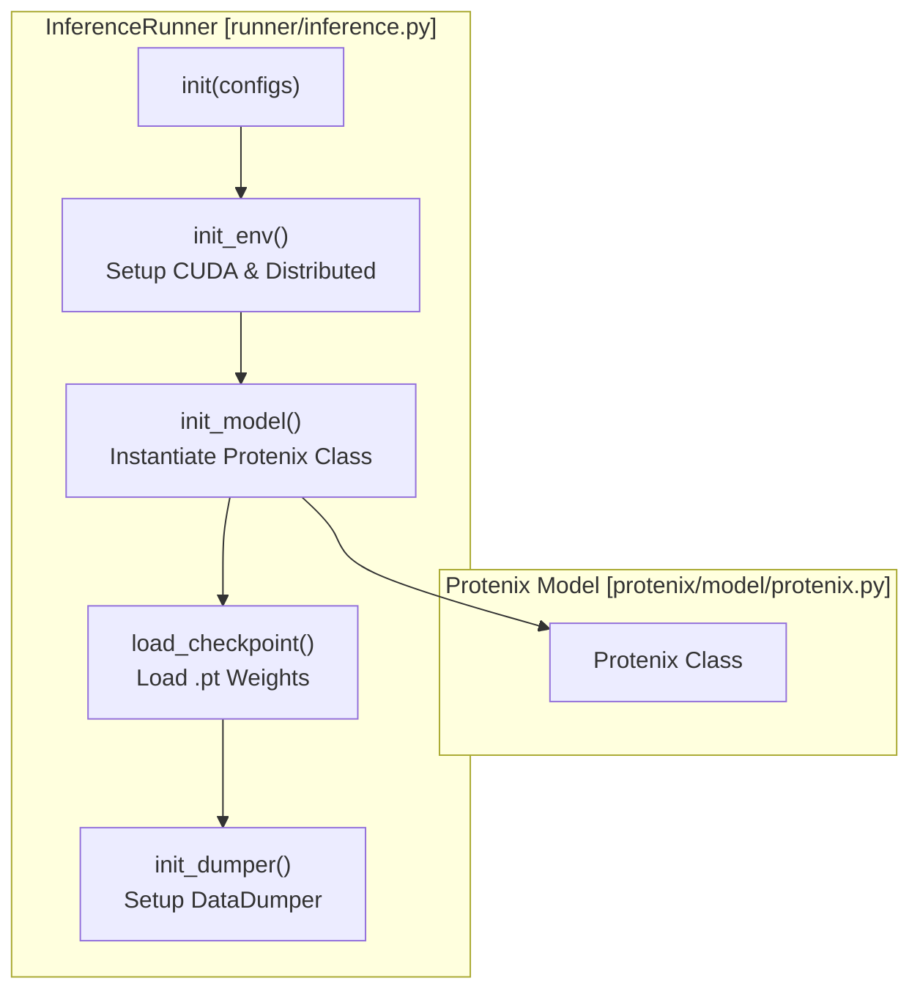
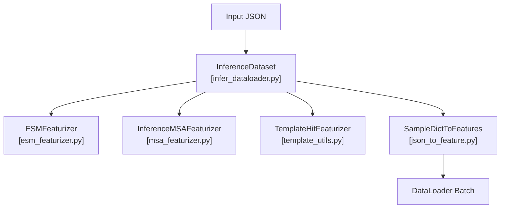
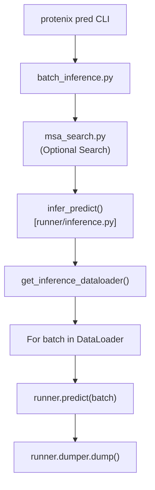

# Running Inference

> **Relevant source files**
> * [assets/protenix-v2.png](https://github.com/bytedance/Protenix/blob/c3bfc365/assets/protenix-v2.png)
> * [docs/PX2.pdf](https://github.com/bytedance/Protenix/blob/c3bfc365/docs/PX2.pdf)
> * [docs/supported_models.md](https://github.com/bytedance/Protenix/blob/c3bfc365/docs/supported_models.md?plain=1)
> * [inference_demo.sh](https://github.com/bytedance/Protenix/blob/c3bfc365/inference_demo.sh)
> * [protenix/data/core/geometry_featurizer.py](https://github.com/bytedance/Protenix/blob/c3bfc365/protenix/data/core/geometry_featurizer.py)
> * [protenix/data/inference/infer_dataloader.py](https://github.com/bytedance/Protenix/blob/c3bfc365/protenix/data/inference/infer_dataloader.py)
> * [runner/inference.py](https://github.com/bytedance/Protenix/blob/c3bfc365/runner/inference.py)
> * [tests/test_fetch_remote_cif.py](https://github.com/bytedance/Protenix/blob/c3bfc365/tests/test_fetch_remote_cif.py)

This document explains how to execute structure predictions using Protenix's inference system. It covers the `protenix predict` command, model selection, diffusion parameters, optimization flags, and the underlying `InferenceRunner` architecture.

For information about preparing input files, see [Input Preparation and Conversion](/bytedance/Protenix/3.2-input-preparation-and-conversion). For MSA generation details, see [Multiple Sequence Alignment](/bytedance/Protenix/3.3-multiple-sequence-alignment). For understanding prediction outputs, see [Output Formats and Interpretation](/bytedance/Protenix/3.5-output-formats-and-interpretation). For model architecture details, see [Model Variants and Configuration](/bytedance/Protenix/5.1-model-variants-and-configuration).

## Command Line Interface

The primary interface for running inference is the `protenix predict` command, implemented in [runner/batch_inference.py L359-L438](https://github.com/bytedance/Protenix/blob/c3bfc365/runner/batch_inference.py#L359-L438)

 This command accepts JSON files (either single files or directories) and executes predictions using the specified model and parameters.

**Basic Usage:**

```
protenix predict \  --input <json_file_or_directory> \  --out_dir <output_directory> \  --model_name protenix_base_default_v1.0.0 \  --seeds 101,102,103 \  --sample 5 \  --cycle 10 \  --step 200
```

**Key Command-Line Parameters:**

| Parameter | Short | Type | Default | Description |
| --- | --- | --- | --- | --- |
| `--input` | `-i` | str | Required | JSON file or directory for inference |
| `--out_dir` | `-o` | str | `./output` | Output directory for results |
| `--seeds` | `-s` | str | `"101"` | Comma-separated random seeds |
| `--cycle` | `-c` | int | 10 | Pairformer recycling iterations (N_cycle) |
| `--step` | `-p` | int | 200 | Diffusion steps (N_step) |
| `--sample` | `-e` | int | 5 | Number of samples per seed (N_sample) |
| `--dtype` | `-d` | str | `"bf16"` | Precision: `fp32`, `bf16`, or `fp16` |
| `--model_name` | `-n` | str | `protenix_base_default_v1.0.0` | Model checkpoint name |
| `--use_msa` |  | bool | True | Enable protein MSA search/usage |
| `--use_template` |  | bool | True | Enable template features (v1.0.0+ only) |
| `--use_rna_msa` |  | bool | True | Enable RNA MSA features (v1.0.0+ only) |
| `--use_default_params` |  | bool | True | Use model-specific recommended defaults |
| `--trimul_kernel` |  | str | `"cuequivariance"` | Triangle multiplicative kernel |
| `--triatt_kernel` |  | str | `"triattention"` | Triangle attention kernel |
| `--enable_cache` |  | bool | True | Cache shared diffusion variables |
| `--enable_fusion` |  | bool | True | Fuse diffusion transformer biases |
| `--enable_tf32` |  | bool | True | Enable TF32 acceleration |

Sources: [runner/batch_inference.py L297-L358](https://github.com/bytedance/Protenix/blob/c3bfc365/runner/batch_inference.py#L297-L358)

 [inference_demo.sh L22-L40](https://github.com/bytedance/Protenix/blob/c3bfc365/inference_demo.sh#L22-L40)

## Model Selection and Default Parameters

Protenix provides multiple model variants. The v1.0.0 series introduces support for **Templates** and **RNA MSA**. When `use_default_params=True` (default), the command automatically configures `cycle`, `step`, and feature flags based on the selected model [runner/batch_inference.py L384-L410](https://github.com/bytedance/Protenix/blob/c3bfc365/runner/batch_inference.py#L384-L410)

**Model Configuration Matrix:**

| Model Name | Parameters | N_cycle | N_step | RNA MSA | Template | Use Case |
| --- | --- | --- | --- | --- | --- | --- |
| `protenix_base_default_v1.0.0` | 368M | 10 | 200 | Yes | Yes | **Recommended Default** |
| `protenix-v2` | 464M | 10 | 200 | Yes | Yes | Enhanced capacity model |
| `protenix_base_20250630_v1.0.0` | 368M | 10 | 200 | Yes | Yes | Latest data cutoff |
| `protenix_base_default_v0.5.0` | 368M | 10 | 200 | No | No | Legacy standard model |
| `protenix_base_constraint_v0.5.0` | 368M | 10 | 200 | No | No | Constraint-guided (v0.5) |
| `protenix_mini_default_v0.5.0` | 134M | 4 | 5 | No | No | High-throughput speed |
| `protenix_tiny_default_v0.5.0` | 109M | 4 | 5 | No | No | Minimal resources |

Sources: [docs/supported_models.md L15-L25](https://github.com/bytedance/Protenix/blob/c3bfc365/docs/supported_models.md?plain=1#L15-L25)

 [runner/batch_inference.py L384-L410](https://github.com/bytedance/Protenix/blob/c3bfc365/runner/batch_inference.py#L384-L410)

 [inference_demo.sh L41-L50](https://github.com/bytedance/Protenix/blob/c3bfc365/inference_demo.sh#L41-L50)

## Inference Parameters

### Diffusion and Sampling

* **N_cycle**: Refines the latent representation by passing through the PairformerStack multiple times. Base models use 10 cycles for precision [docs/supported_models.md L34](https://github.com/bytedance/Protenix/blob/c3bfc365/docs/supported_models.md?plain=1#L34-L34)
* **N_step**: Denoising steps for the diffusion module. High-quality sampling requires 200 steps [docs/supported_models.md L35](https://github.com/bytedance/Protenix/blob/c3bfc365/docs/supported_models.md?plain=1#L35-L35)
* **N_sample**: Number of independent samples per seed. Total outputs = `len(seeds)` × `N_sample`.

These are set in [runner/batch_inference.py L197-L199](https://github.com/bytedance/Protenix/blob/c3bfc365/runner/batch_inference.py#L197-L199)

:

```
configs.model.N_cycle = n_cycleconfigs.sample_diffusion.N_sample = n_sampleconfigs.sample_diffusion.N_step = n_step
```

### Precision and Data Types

Inference defaults to `bf16` (Brain Float 16) for optimal balance of speed and memory on modern GPUs. The runner uses `torch.autocast` to manage precision [runner/inference.py L158-L168](https://github.com/bytedance/Protenix/blob/c3bfc365/runner/inference.py#L158-L168)

### Random Seeds

Seeds are parsed from strings in [runner/batch_inference.py L421](https://github.com/bytedance/Protenix/blob/c3bfc365/runner/batch_inference.py#L421-L421)

 If `--use_seeds_in_json` is enabled, the runner prioritizes seeds defined within the input JSON file [inference_demo.sh L38](https://github.com/bytedance/Protenix/blob/c3bfc365/inference_demo.sh#L38-L38)

## Performance Optimization

### Kernel Selection

Configured in [runner/batch_inference.py L202-L203](https://github.com/bytedance/Protenix/blob/c3bfc365/runner/batch_inference.py#L202-L203)

 Protenix supports optimized kernels:

* **Triangle Attention**: `triattention` (custom), `cuequivariance`, `deepspeed`, or `torch`.
* **Triangle Multiplicative Update**: `cuequivariance` or `torch`.

DeepSpeed kernels require `CUTLASS_PATH` to be set in the environment [runner/inference.py L108-L115](https://github.com/bytedance/Protenix/blob/c3bfc365/runner/inference.py#L108-L115)

### Hardware Acceleration

* **Shared Variable Caching** (`--enable_cache`): Caches `pair_z` and other variables across samples [runner/batch_inference.py L204](https://github.com/bytedance/Protenix/blob/c3bfc365/runner/batch_inference.py#L204-L204)
* **Bias Fusion** (`--enable_fusion`): Fuses transformer biases to reduce kernel launches [runner/batch_inference.py L205](https://github.com/bytedance/Protenix/blob/c3bfc365/runner/batch_inference.py#L205-L205)
* **TF32** (`--enable_tf32`): Accelerates FP32 matrix multiplications on Ampere+ GPUs [runner/batch_inference.py L206](https://github.com/bytedance/Protenix/blob/c3bfc365/runner/batch_inference.py#L206-L206)

Sources: [runner/batch_inference.py L202-L206](https://github.com/bytedance/Protenix/blob/c3bfc365/runner/batch_inference.py#L202-L206)

 [runner/inference.py L108-L126](https://github.com/bytedance/Protenix/blob/c3bfc365/runner/inference.py#L108-L126)

## InferenceRunner Architecture

The `InferenceRunner` class manages the lifecycle of a prediction task.

### Class Initialization Flow



Sources: [runner/inference.py L64-L82](https://github.com/bytedance/Protenix/blob/c3bfc365/runner/inference.py#L64-L82)

### Environment and Device Setup

The runner detects CUDA availability and initializes distributed process groups if `world_size > 1` [runner/inference.py L84-L107](https://github.com/bytedance/Protenix/blob/c3bfc365/runner/inference.py#L84-L107)

 It also handles a specific patch for PyTorch 2.6+ to allow loading legacy ESM model namespaces safely [runner/inference.py L44-L61](https://github.com/bytedance/Protenix/blob/c3bfc365/runner/inference.py#L44-L61)

### Checkpoint Loading

Weights are loaded from the directory specified in `configs.load_checkpoint_dir`. The runner automatically strips `module.` prefixes often found in DistributedDataParallel (DDP) checkpoints [runner/inference.py L144-L177](https://github.com/bytedance/Protenix/blob/c3bfc365/runner/inference.py#L144-L177)

## Data Loading and Featurization

Inference data is managed by the `InferenceDataset` and `DataLoader`.

### Inference Data Flow



Sources: [protenix/data/inference/infer_dataloader.py L70-L139](https://github.com/bytedance/Protenix/blob/c3bfc365/protenix/data/inference/infer_dataloader.py#L70-L139)

### Template and Remote Fetching

The `InferenceDataset` initializes a `TemplateHitFeaturizer`. If `fetch_remote=True`, missing mmCIF files are downloaded on-demand from PDBe [protenix/data/inference/infer_dataloader.py L86-L114](https://github.com/bytedance/Protenix/blob/c3bfc365/protenix/data/inference/infer_dataloader.py#L86-L114)

 This behavior is verified in tests ensuring local files are preferred over remote ones [tests/test_fetch_remote_cif.py L32-L41](https://github.com/bytedance/Protenix/blob/c3bfc365/tests/test_fetch_remote_cif.py#L32-L41)

### Geometry and Constraints

For constraint-guided models or Training-Free Guidance (TFG), the `GeometryFeaturizer` extracts topology and stereochemistry constraints from the `AtomArray` and CCD reference structures [protenix/data/core/geometry_featurizer.py L101-L136](https://github.com/bytedance/Protenix/blob/c3bfc365/protenix/data/core/geometry_featurizer.py#L101-L136)

## Execution Flow

### High-Level Prediction Loop

The system processes multiple JSON tasks in a batch mode.



Sources: [runner/batch_inference.py L223-L289](https://github.com/bytedance/Protenix/blob/c3bfc365/runner/batch_inference.py#L223-L289)

 [runner/inference.py L298-L366](https://github.com/bytedance/Protenix/blob/c3bfc365/runner/inference.py#L298-L366)

### Adaptive Mixed Precision (AMP)

The runner adjusts AMP settings based on the sequence length (`N_token`) to prevent Out-of-Memory (OOM) errors on large complexes [runner/inference.py L281-L295](https://github.com/bytedance/Protenix/blob/c3bfc365/runner/inference.py#L281-L295)

### GPU Compatibility Check

The system automatically detects if a GPU is legacy (e.g., V100, Compute Capability 7.x). If so, it forces `fp32` and disables specialized kernels to ensure stability [runner/inference.py L375-L396](https://github.com/bytedance/Protenix/blob/c3bfc365/runner/inference.py#L375-L396)

Sources: [runner/inference.py L281-L295](https://github.com/bytedance/Protenix/blob/c3bfc365/runner/inference.py#L281-L295)

 [runner/inference.py L375-L396](https://github.com/bytedance/Protenix/blob/c3bfc365/runner/inference.py#L375-L396)