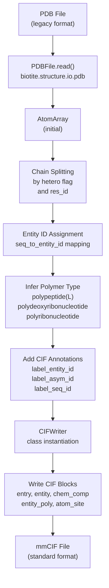
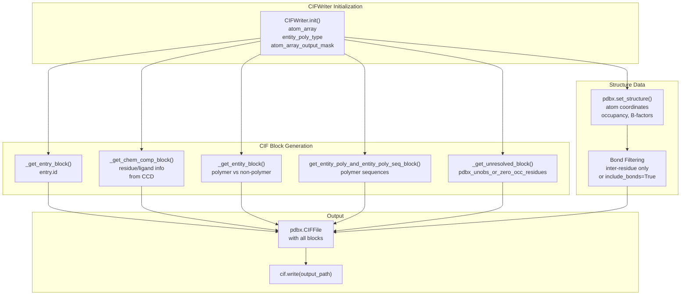

# Structure Parsing and Conversion

> **Relevant source files**
> * [protenix/data/core/filter.py](https://github.com/bytedance/Protenix/blob/c3bfc365/protenix/data/core/filter.py)
> * [protenix/data/core/parser.py](https://github.com/bytedance/Protenix/blob/c3bfc365/protenix/data/core/parser.py)
> * [protenix/data/inference/json_to_feature.py](https://github.com/bytedance/Protenix/blob/c3bfc365/protenix/data/inference/json_to_feature.py)
> * [protenix/data/tools/rewrite_biotite.py](https://github.com/bytedance/Protenix/blob/c3bfc365/protenix/data/tools/rewrite_biotite.py)
> * [protenix/data/utils.py](https://github.com/bytedance/Protenix/blob/c3bfc365/protenix/data/utils.py)
> * [scripts/prepare_training_data.py](https://github.com/bytedance/Protenix/blob/c3bfc365/scripts/prepare_training_data.py)

This document describes the structure parsing and conversion system in Protenix, which handles the reading, writing, and transformation of biomolecular structures across different file formats. The system uses Biotite's `AtomArray` as the core internal representation and provides utilities for parsing PDB/CIF files, extracting structural information, and writing predictions back to standard formats.

For information about the initial input data formats and their specifications, see [Input Data Formats](/bytedance/Protenix/4.1-input-data-formats). For details on how these structures are converted into model-ready features, see [Feature Generation](/bytedance/Protenix/4.3-feature-generation).

## Core Data Structure: AtomArray

The entire structure parsing and conversion system is built around Biotite's `AtomArray` object, which serves as the unified internal representation for all molecular structures in Protenix [protenix/data/utils.py L24-L30](https://github.com/bytedance/Protenix/blob/c3bfc365/protenix/data/utils.py#L24-L30)

 An `AtomArray` contains atomic coordinates and rich annotations about each atom's chemical and structural context.

### AtomArray Annotations

Protenix extends the standard Biotite `AtomArray` with several custom annotation categories required for structure prediction:

| Annotation | Type | Purpose |
| --- | --- | --- |
| `label_entity_id` | string | Entity identifier for grouping chains |
| `label_asym_id` | string | Asymmetric unit chain identifier |
| `label_atom_id` | string | Atom name within residue |
| `label_seq_id` | int | Residue sequence number |
| `chain_id` | string | Author chain identifier |
| `res_id` | int | Residue number |
| `res_name` | string | Residue/ligand name |
| `atom_name` | string | Atom type (e.g., CA, N, O) |
| `element` | string | Chemical element symbol |
| `coord` | float[3] | 3D Cartesian coordinates (Å) |
| `mol_type` | string | Molecule type: "protein", "rna", "dna", or "ligand" |
| `is_resolved` | bool | Whether atom coordinates are resolved |
| `hetero` | bool | Whether atom is from HETATM record |
| `copy_id` | int | Copy number for multi-copy entities |

The system provides utility functions for working with these annotations throughout [protenix/data/utils.py L67-L296](https://github.com/bytedance/Protenix/blob/c3bfc365/protenix/data/utils.py#L67-L296)

**Sources:** [protenix/data/utils.py L24-L30](https://github.com/bytedance/Protenix/blob/c3bfc365/protenix/data/utils.py#L24-L30)

 [protenix/data/utils.py L67-L276](https://github.com/bytedance/Protenix/blob/c3bfc365/protenix/data/utils.py#L67-L276)

## MMCIF Parsing System

The `MMCIFParser` class is responsible for extracting structural data from mmCIF files, including metadata like resolution and assembly information.

### Key Functions

* `_parse`: Handles reading from `.gz`, `.bcif`, or standard `.cif` files [protenix/data/core/parser.py L104-L123](https://github.com/bytedance/Protenix/blob/c3bfc365/protenix/data/core/parser.py#L104-L123)
* `get_category_table`: Converts a CIF category into a pandas DataFrame for easier manipulation [protenix/data/core/parser.py L125-L140](https://github.com/bytedance/Protenix/blob/c3bfc365/protenix/data/core/parser.py#L125-L140)
* `resolution`: Extracts experimental resolution from multiple possible CIF categories (`refine.ls_d_res_high`, `em_3d_reconstruction.resolution`, etc.) [protenix/data/core/parser.py L182-L207](https://github.com/bytedance/Protenix/blob/c3bfc365/protenix/data/core/parser.py#L182-L207)

**Sources:** [protenix/data/core/parser.py L93-L207](https://github.com/bytedance/Protenix/blob/c3bfc365/protenix/data/core/parser.py#L93-L207)

## PDB to CIF Conversion Pipeline

### Conversion Process Overview



**Diagram: PDB to CIF conversion workflow showing chain splitting, entity assignment, and CIF block generation**

The `pdb_to_cif()` function [protenix/data/utils.py L1074-L1201](https://github.com/bytedance/Protenix/blob/c3bfc365/protenix/data/utils.py#L1074-L1201)

 orchestrates the entire conversion process. The function handles several non-trivial transformations:

1. **Chain Splitting**: PDB files often group multiple molecular entities under a single chain ID. The converter splits chains based on changes in the `hetero` flag or non-contiguous residue numbering for heteroatoms [protenix/data/utils.py L1095-L1120](https://github.com/bytedance/Protenix/blob/c3bfc365/protenix/data/utils.py#L1095-L1120)
2. **Entity Assignment**: Chains with identical residue sequences are assigned the same entity ID [protenix/data/utils.py L1086-L1149](https://github.com/bytedance/Protenix/blob/c3bfc365/protenix/data/utils.py#L1086-L1149)
3. **Polymer Type Inference**: Based on residue composition, entities are classified as `polypeptide(L)`, `polydeoxyribonucleotide`, or `polyribonucleotide` [protenix/data/utils.py L1164-L1184](https://github.com/bytedance/Protenix/blob/c3bfc365/protenix/data/utils.py#L1164-L1184)

**Sources:** [protenix/data/utils.py L1074-L1201](https://github.com/bytedance/Protenix/blob/c3bfc365/protenix/data/utils.py#L1074-L1201)

## CIFWriter System

### Architecture

The `CIFWriter` class [protenix/data/utils.py L584-L873](https://github.com/bytedance/Protenix/blob/c3bfc365/protenix/data/utils.py#L584-L873)

 is the primary interface for writing `AtomArray` objects to mmCIF format.



**Diagram: CIFWriter architecture showing block generation flow and data integration**

### CIF Category Generation

* **Chemical Component Block**: `_get_chem_comp_block()` loads component information from the CCD using `biotite_load_ccd_cif()` [protenix/data/utils.py L707-L743](https://github.com/bytedance/Protenix/blob/c3bfc365/protenix/data/utils.py#L707-L743)
* **Entity Polymer Block**: `get_entity_poly_and_entity_poly_seq_block()` provides the sequence for each polymer entity [protenix/data/utils.py L651-L705](https://github.com/bytedance/Protenix/blob/c3bfc365/protenix/data/utils.py#L651-L705)
* **Unresolved Residues Block**: `_get_unresolved_block()` generates the `pdbx_unobs_or_zero_occ_residues` category for residues without resolved coordinates [protenix/data/utils.py L606-L634](https://github.com/bytedance/Protenix/blob/c3bfc365/protenix/data/utils.py#L606-L634)

**Sources:** [protenix/data/utils.py L584-L816](https://github.com/bytedance/Protenix/blob/c3bfc365/protenix/data/utils.py#L584-L816)

 [protenix/data/core/ccd.py L38](https://github.com/bytedance/Protenix/blob/c3bfc365/protenix/data/core/ccd.py#L38-L38)

## Structure Filtering and Cleaning

The `Filter` class implements structural cleaning logic as defined in AlphaFold3 SI Chapter 2.5.4.

### Common Operations

* **Hydrogen Removal**: `remove_hydrogens()` strips H and D atoms [protenix/data/core/filter.py L34-L36](https://github.com/bytedance/Protenix/blob/c3bfc365/protenix/data/core/filter.py#L34-L36)
* **Water Removal**: `remove_water()` strips HOH and DOD [protenix/data/core/filter.py L39-L41](https://github.com/bytedance/Protenix/blob/c3bfc365/protenix/data/core/filter.py#L39-L41)
* **Crystallization Aid Removal**: `remove_crystallization_aids()` removes residues like SO4 or GOL unless they are part of a polymer chain [protenix/data/core/filter.py L77-L88](https://github.com/bytedance/Protenix/blob/c3bfc365/protenix/data/core/filter.py#L77-L88)
* **Ambiguous Element X**: `remove_element_X()` maps ambiguous residues like ASX to ASP and GLX to GLU [protenix/data/core/filter.py L44-L74](https://github.com/bytedance/Protenix/blob/c3bfc365/protenix/data/core/filter.py#L44-L74)

**Sources:** [protenix/data/core/filter.py L28-L168](https://github.com/bytedance/Protenix/blob/c3bfc365/protenix/data/core/filter.py#L28-L168)

## Bond Extraction and Analysis

Protenix requires precise connectivity information for both training and constraint-guided prediction.

### Inter-Residue Bonds

The `_parse_inter_residue_bonds` function in `rewrite_biotite.py` provides a high-performance implementation for matching `struct_conn` records to `atom_site` entries [protenix/data/tools/rewrite_biotite.py L146-L218](https://github.com/bytedance/Protenix/blob/c3bfc365/protenix/data/tools/rewrite_biotite.py#L146-L218)

 It uses a dual-strategy matching system:

* **Dense Array Matching**: Faster for small structures [protenix/data/tools/rewrite_biotite.py L56-L86](https://github.com/bytedance/Protenix/blob/c3bfc365/protenix/data/tools/rewrite_biotite.py#L56-L86)
* **Dictionary Matching**: Faster for large structures (O(1) lookups) [protenix/data/tools/rewrite_biotite.py L89-L123](https://github.com/bytedance/Protenix/blob/c3bfc365/protenix/data/tools/rewrite_biotite.py#L89-L123)

### Ligand-Polymer Bonds

The `get_ligand_polymer_bond_mask()` function identifies covalent bonds between ligands and polymer chains [protenix/data/utils.py L336-L385](https://github.com/bytedance/Protenix/blob/c3bfc365/protenix/data/utils.py#L336-L385)

 This is critical for modeling post-translational modifications and covalently bound cofactors.

**Sources:** [protenix/data/utils.py L336-L385](https://github.com/bytedance/Protenix/blob/c3bfc365/protenix/data/utils.py#L336-L385)

 [protenix/data/tools/rewrite_biotite.py L146-L218](https://github.com/bytedance/Protenix/blob/c3bfc365/protenix/data/tools/rewrite_biotite.py#L146-L218)

## Superposition and RMSD Utilities

The `superimpose()` function aligns structures based on specified chain IDs [protenix/data/utils.py L532-L581](https://github.com/bytedance/Protenix/blob/c3bfc365/protenix/data/utils.py#L532-L581)

```python
def superimpose(    fixed: AtomArray,    mobile: AtomArray,    fixed_asym_id: str,    mobile_asym_id: str,) -> tuple[AtomArray, struc.AffineTransformation]
```

This utility ensures that only resolved atoms are used for alignment and validates that atom names match between the fixed and mobile chains [protenix/data/utils.py L553-L568](https://github.com/bytedance/Protenix/blob/c3bfc365/protenix/data/utils.py#L553-L568)

**Sources:** [protenix/data/utils.py L532-L581](https://github.com/bytedance/Protenix/blob/c3bfc365/protenix/data/utils.py#L532-L581)

## Integration with Inference Pipeline

During inference, the `SampleDictToFeatures` class handles the conversion of JSON input into `AtomArray` objects before featurization.


The `build_full_atom_array()` method assembles the final structure by iterating through sequences and assigning `label_asym_id` using `int_to_letters()` [protenix/data/inference/json_to_feature.py L94-L171](https://github.com/bytedance/Protenix/blob/c3bfc365/protenix/data/inference/json_to_feature.py#L94-L171)

**Sources:** [protenix/data/inference/json_to_feature.py L37-L171](https://github.com/bytedance/Protenix/blob/c3bfc365/protenix/data/inference/json_to_feature.py#L37-L171)

 [protenix/data/utils.py L113-L127](https://github.com/bytedance/Protenix/blob/c3bfc365/protenix/data/utils.py#L113-L127)