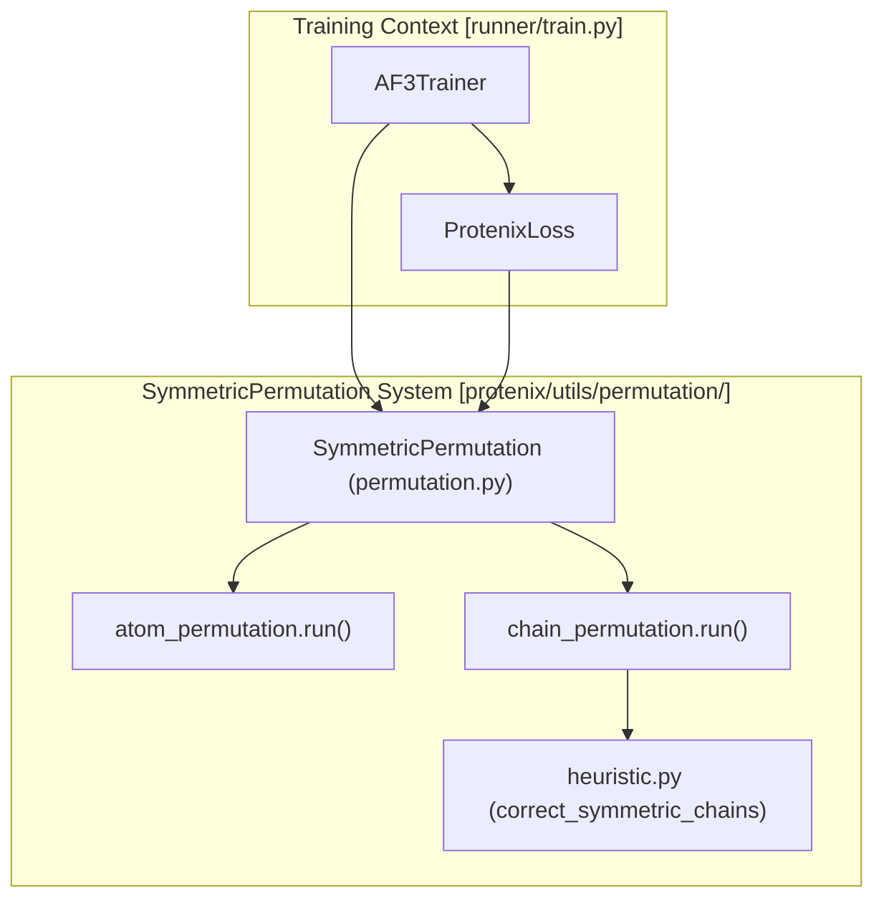
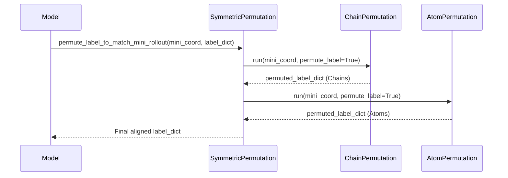

# Symmetric Permutation System

> **Relevant source files**
> * [docs/kernels.md](https://github.com/bytedance/Protenix/blob/c3bfc365/docs/kernels.md?plain=1)
> * [finetune_demo.sh](https://github.com/bytedance/Protenix/blob/c3bfc365/finetune_demo.sh)
> * [protenix/utils/permutation/atom_permutation.py](https://github.com/bytedance/Protenix/blob/c3bfc365/protenix/utils/permutation/atom_permutation.py)
> * [protenix/utils/permutation/chain_permutation/heuristic.py](https://github.com/bytedance/Protenix/blob/c3bfc365/protenix/utils/permutation/chain_permutation/heuristic.py)
> * [protenix/utils/permutation/permutation.py](https://github.com/bytedance/Protenix/blob/c3bfc365/protenix/utils/permutation/permutation.py)
> * [runner/train.py](https://github.com/bytedance/Protenix/blob/c3bfc365/runner/train.py)
> * [train_demo.sh](https://github.com/bytedance/Protenix/blob/c3bfc365/train_demo.sh)

## Purpose and Scope

The Symmetric Permutation System handles molecular symmetries during training and inference by permuting chains and atoms in predicted or ground-truth structures. This system is essential for accurate loss calculation and evaluation when molecular structures contain equivalent orderings (e.g., identical chains in a homomer, symmetric functional groups like methyl groups or phenyl rings).

This page documents the `SymmetricPermutation` class and its implementation details, including the heuristic algorithms for chain and atom-level reordering.

**Sources:** [protenix/utils/permutation/permutation.py L1-L488](https://github.com/bytedance/Protenix/blob/c3bfc365/protenix/utils/permutation/permutation.py#L1-L488)

 [protenix/utils/permutation/atom_permutation.py L1-L110](https://github.com/bytedance/Protenix/blob/c3bfc365/protenix/utils/permutation/atom_permutation.py#L1-L110)

 [protenix/utils/permutation/chain_permutation/heuristic.py L1-L141](https://github.com/bytedance/Protenix/blob/c3bfc365/protenix/utils/permutation/chain_permutation/heuristic.py#L1-L141)

---

## System Overview

The Symmetric Permutation System operates at two levels:

1. **Chain Permutation**: Reorders entire molecular chains (protein, DNA, RNA, or ligands) to find the optimal alignment between a prediction and a reference.
2. **Atom Permutation**: Permutes symmetric atoms within specific chemical groups (e.g., flipping a benzene ring or rotating a methyl group) to minimize RMSD.

**Sources:** [protenix/utils/permutation/permutation.py L22-L39](https://github.com/bytedance/Protenix/blob/c3bfc365/protenix/utils/permutation/permutation.py#L22-L39)

 [runner/train.py L179-L183](https://github.com/bytedance/Protenix/blob/c3bfc365/runner/train.py#L179-L183)

 [protenix/utils/permutation/chain_permutation/heuristic.py L42-L84](https://github.com/bytedance/Protenix/blob/c3bfc365/protenix/utils/permutation/chain_permutation/heuristic.py#L42-L84)

---

## Chain Permutation Implementation

Chain permutation identifies the best mapping between symmetric chains in the predicted structure and the ground truth.

### Heuristic Search: correct_symmetric_chains

The system uses a heuristic approach to find the optimal chain mapping, especially when the number of chains is high.

| Feature | Code Reference | Description |
| --- | --- | --- |
| **Max Chains** | [protenix/utils/permutation/chain_permutation/heuristic.py L46](https://github.com/bytedance/Protenix/blob/c3bfc365/protenix/utils/permutation/chain_permutation/heuristic.py#L46-L46) | Skips permutation if `max_num_chains` (default 20) is exceeded to avoid complexity. |
| **Batch Mode** | [protenix/utils/permutation/chain_permutation/heuristic.py L106-L141](https://github.com/bytedance/Protenix/blob/c3bfc365/protenix/utils/permutation/chain_permutation/heuristic.py#L106-L141) | Supports independent permutation for each diffusion sample in a batch. |
| **Label Permutation** | [protenix/utils/permutation/chain_permutation/heuristic.py L179-L194](https://github.com/bytedance/Protenix/blob/c3bfc365/protenix/utils/permutation/chain_permutation/heuristic.py#L179-L194) | During training, it reorders the ground-truth coordinates and masks. |
| **Prediction Permutation** | [protenix/utils/permutation/chain_permutation/heuristic.py L196-L200](https://github.com/bytedance/Protenix/blob/c3bfc365/protenix/utils/permutation/chain_permutation/heuristic.py#L196-L200) | During inference, it reorders the predicted coordinates. |

**Sources:** [protenix/utils/permutation/chain_permutation/heuristic.py L42-L141](https://github.com/bytedance/Protenix/blob/c3bfc365/protenix/utils/permutation/chain_permutation/heuristic.py#L42-L141)

---

## Atom Permutation Implementation

Atom permutation handles internal symmetries within residues or ligands.

### Workflow: correct_symmetric_atoms

1. **Collection**: `collect_residues_with_symmetric_atoms` identifies residues that require symmetric correction based on `ref_space_uid` and `atom_perm_list` [protenix/utils/permutation/atom_permutation.py L111-L194](https://github.com/bytedance/Protenix/blob/c3bfc365/protenix/utils/permutation/atom_permutation.py#L111-L194)
2. **Filtering**: Residues with fewer than 3 resolved atoms are skipped, as alignment requires at least 3 points [protenix/utils/permutation/atom_permutation.py L161-L162](https://github.com/bytedance/Protenix/blob/c3bfc365/protenix/utils/permutation/atom_permutation.py#L161-L162)
3. **Optimization**: The system tests valid permutations (from `atom_perm_list`) and selects the one that minimizes the local RMSD between prediction and truth.

**Sources:** [protenix/utils/permutation/atom_permutation.py L25-L108](https://github.com/bytedance/Protenix/blob/c3bfc365/protenix/utils/permutation/atom_permutation.py#L25-L108)

 [protenix/utils/permutation/atom_permutation.py L111-L194](https://github.com/bytedance/Protenix/blob/c3bfc365/protenix/utils/permutation/atom_permutation.py#L111-L194)

---

## Integration with Training (Mini-Rollout)

During training, the system aligns the ground-truth label to a "mini-rollout" (a lightweight preliminary prediction) to ensure the diffusion loss is calculated against the most reachable symmetric state.

### Method: permute_label_to_match_mini_rollout

This method is called during the training forward pass. It sequentially applies chain and atom permutations to the label dictionary.

**Sources:** [protenix/utils/permutation/permutation.py L40-L113](https://github.com/bytedance/Protenix/blob/c3bfc365/protenix/utils/permutation/permutation.py#L40-L113)

---

## Evaluation and Inference

During evaluation, the system permutes the **prediction** to match the label. This is critical for metrics like RMSD or LDDT where the predicted chain order might differ from the arbitrary order in the PDB file.

### Method: permute_diffusion_sample_to_match_label

This method handles per-sample permutations for diffusion outputs.

* **Stage Check**: Chain permutation is typically performed only if `stage != "train"` [protenix/utils/permutation/permutation.py L141-L143](https://github.com/bytedance/Protenix/blob/c3bfc365/protenix/utils/permutation/permutation.py#L141-L143)
* **Pocket Alignment**: If `permute_by_pocket` is enabled, the alignment focuses on the binding pocket (used for PoseBusters evaluation) [protenix/utils/permutation/permutation.py L159-L160](https://github.com/bytedance/Protenix/blob/c3bfc365/protenix/utils/permutation/permutation.py#L159-L160)
* **Confidence Reordering**: After coordinates are permuted, the system calls `permute_heads` to reorder predicted confidence metrics (pLDDT, PAE) to maintain consistency with the new atom/token ordering [protenix/utils/permutation/permutation.py L379-L449](https://github.com/bytedance/Protenix/blob/c3bfc365/protenix/utils/permutation/permutation.py#L379-L449)

**Sources:** [protenix/utils/permutation/permutation.py L115-L241](https://github.com/bytedance/Protenix/blob/c3bfc365/protenix/utils/permutation/permutation.py#L115-L241)

 [protenix/utils/permutation/permutation.py L379-L449](https://github.com/bytedance/Protenix/blob/c3bfc365/protenix/utils/permutation/permutation.py#L379-L449)

---

## Configuration and Performance

Permutation behavior is controlled via the training and model configuration files.

| Configuration Parameter | Script Example | Impact |
| --- | --- | --- |
| `triangle_attention` | [train_demo.sh L43](https://github.com/bytedance/Protenix/blob/c3bfc365/train_demo.sh#L43-L43) | Indirectly affects speed of mini-rollout. |
| `error_dir` | [protenix/utils/permutation/permutation.py L31-L38](https://github.com/bytedance/Protenix/blob/c3bfc365/protenix/utils/permutation/permutation.py#L31-L38) | Directory where failed permutation data is dumped for debugging. |
| `max_num_chains` | [protenix/utils/permutation/chain_permutation/heuristic.py L46](https://github.com/bytedance/Protenix/blob/c3bfc365/protenix/utils/permutation/chain_permutation/heuristic.py#L46-L46) | Prevents exponential complexity in large complexes. |

### Performance Considerations

* **CUDA Kernels**: While the permutation logic itself is CPU/GPU-agnostic PyTorch, the speed of the training steps it supports is accelerated by custom kernels like `fast_layernorm` and `triangle_attention` implementations (e.g., `cuequivariance`) [docs/kernels.md L1-L52](https://github.com/bytedance/Protenix/blob/c3bfc365/docs/kernels.md?plain=1#L1-L52)
* **JIT Compilation**: Custom kernels are JIT-compiled on first use, which may cause a slight delay in the first training step involving permutation [docs/kernels.md L9](https://github.com/bytedance/Protenix/blob/c3bfc365/docs/kernels.md?plain=1#L9-L9)

**Sources:** [train_demo.sh L43-L47](https://github.com/bytedance/Protenix/blob/c3bfc365/train_demo.sh#L43-L47)

 [docs/kernels.md L1-L52](https://github.com/bytedance/Protenix/blob/c3bfc365/docs/kernels.md?plain=1#L1-L52)

 [protenix/utils/permutation/permutation.py L31-L38](https://github.com/bytedance/Protenix/blob/c3bfc365/protenix/utils/permutation/permutation.py#L31-L38)