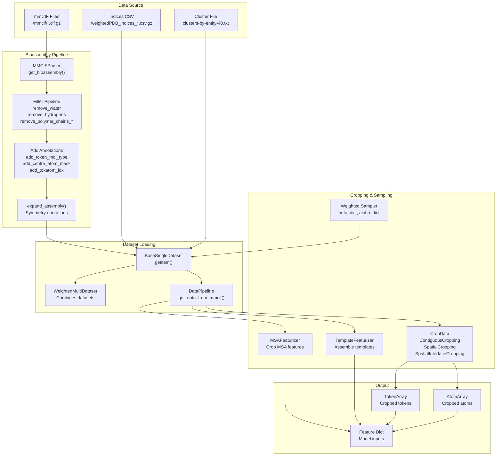
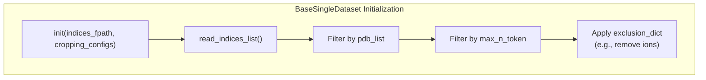

# Training Data Pipeline

> **Relevant source files**
> * [configs/configs_data.py](https://github.com/bytedance/Protenix/blob/c3bfc365/configs/configs_data.py)
> * [protenix/data/pipeline/data_pipeline.py](https://github.com/bytedance/Protenix/blob/c3bfc365/protenix/data/pipeline/data_pipeline.py)
> * [protenix/data/pipeline/dataset.py](https://github.com/bytedance/Protenix/blob/c3bfc365/protenix/data/pipeline/dataset.py)
> * [protenix/data/template/template_featurizer.py](https://github.com/bytedance/Protenix/blob/c3bfc365/protenix/data/template/template_featurizer.py)
> * [protenix/data/template/template_parser.py](https://github.com/bytedance/Protenix/blob/c3bfc365/protenix/data/template/template_parser.py)
> * [scripts/database/download_protenix_data.sh](https://github.com/bytedance/Protenix/blob/c3bfc365/scripts/database/download_protenix_data.sh)

## Purpose and Scope

This page documents the training data pipeline in Protenix, which is responsible for loading PDB structures, preprocessing them into bioassemblies, applying cropping strategies, and sampling training examples. This pipeline transforms raw mmCIF files into model-ready features through a series of filtering, tokenization, and cropping operations.

For information about the JSON input format used in inference, see [Input Data Formats](/bytedance/Protenix/4.1-input-data-formats). For details on feature generation from preprocessed data, see [Feature Generation](/bytedance/Protenix/4.3-feature-generation). For the overall data processing architecture, see [Data Processing Pipeline](/bytedance/Protenix/4-data-processing-pipeline).

---

## System Overview

The training data pipeline consists of four major components working together to prepare data for model training:



**Diagram: Training Data Pipeline Overview**

Sources: [protenix/data/pipeline/dataset.py L50-L126](https://github.com/bytedance/Protenix/blob/c3bfc365/protenix/data/pipeline/dataset.py#L50-L126)

 [protenix/data/pipeline/data_pipeline.py L44-L108](https://github.com/bytedance/Protenix/blob/c3bfc365/protenix/data/pipeline/data_pipeline.py#L44-L108)

 [configs/configs_data.py L128-L200](https://github.com/bytedance/Protenix/blob/c3bfc365/configs/configs_data.py#L128-L200)

 [scripts/database/download_protenix_data.sh L91-L110](https://github.com/bytedance/Protenix/blob/c3bfc365/scripts/database/download_protenix_data.sh#L91-L110)

---

## Bioassembly Loading and Preprocessing

### Bioassembly Generation

The `DataPipeline` class provides the high-level entry point for bioassembly generation. It utilizes specialized parsers like `MMCIFParser` and `DistillationMMCIFParser` to convert raw files into a structured `bioassembly_dict`.

```mermaid
flowchart TD

Start["Input: mmcif_path, dataset_type"]
ParserSelect["dataset type?"]
WeightedParser["MMCIFParser<br>get_bioassembly()"]
DistillParser["DistillationMMCIFParser<br>get_structure_dict()"]
RecentParser["RecentPDB_MMCIFParser<br>get_bioassembly()"]
GetIndices["parser.make_indices()<br>Generate sampling list"]
Tokenize["AtomArrayTokenizer<br>get_token_array()"]
Output["Return sample_indices_list,<br>bioassembly_dict"]

subgraph DataPipeline.get_data_from_mmcif() ["DataPipeline.get_data_from_mmcif()"]
    Start
    ParserSelect
    WeightedParser
    DistillParser
    RecentParser
    GetIndices
    Tokenize
    Output
    Start --> ParserSelect
    ParserSelect --> WeightedParser
    ParserSelect --> DistillParser
    ParserSelect --> RecentParser
    WeightedParser --> GetIndices
    DistillParser --> GetIndices
    RecentParser --> GetIndices
    GetIndices --> Tokenize
    Tokenize --> Output
end
```

**Diagram: Bioassembly Loading and Preprocessing Pipeline**

Sources: [protenix/data/pipeline/data_pipeline.py L50-L108](https://github.com/bytedance/Protenix/blob/c3bfc365/protenix/data/pipeline/data_pipeline.py#L50-L108)

### MSA and Template Feature Integration

During training data preparation, MSAs and Templates are processed and integrated into the bioassembly dictionary.

| Component | Class | Key Method | Purpose |
| --- | --- | --- | --- |
| **MSA Features** | `MSAFeaturizer` | `get_msa_raw_features` | Retrieves and tokenizes MSA features for the bioassembly [protenix/data/pipeline/data_pipeline.py L177-L181](https://github.com/bytedance/Protenix/blob/c3bfc365/protenix/data/pipeline/data_pipeline.py#L177-L181) |
| **Template Features** | `TemplateFeaturizer` | `assemble` | Orchestrates conversion of raw templates into finalized features [protenix/data/template/template_featurizer.py L122-L136](https://github.com/bytedance/Protenix/blob/c3bfc365/protenix/data/template/template_featurizer.py#L122-L136) |
| **Template Source** | `TemplateSourceManager` | `fetch_template_paths` | Manages retrieval from multiple storage sources (sequence or PDB ID) [protenix/data/template/template_featurizer.py L50-L86](https://github.com/bytedance/Protenix/blob/c3bfc365/protenix/data/template/template_featurizer.py#L50-L86) |

Sources: [protenix/data/pipeline/data_pipeline.py L177-L181](https://github.com/bytedance/Protenix/blob/c3bfc365/protenix/data/pipeline/data_pipeline.py#L177-L181)

 [protenix/data/template/template_featurizer.py L122-L136](https://github.com/bytedance/Protenix/blob/c3bfc365/protenix/data/template/template_featurizer.py#L122-L136)

---

## Dataset Classes

### BaseSingleDataset

The `BaseSingleDataset` class is the primary dataset implementation for loading individual data sources. It filters data based on token counts and exclusion dictionaries during initialization.



**Diagram: BaseSingleDataset Initialization**

Sources: [protenix/data/pipeline/dataset.py L50-L126](https://github.com/bytedance/Protenix/blob/c3bfc365/protenix/data/pipeline/dataset.py#L50-L126)

 [protenix/data/pipeline/dataset.py L153-L183](https://github.com/bytedance/Protenix/blob/c3bfc365/protenix/data/pipeline/dataset.py#L153-L183)

#### Key Configuration Parameters

The `BaseSingleDataset` accepts numerous configuration parameters:

| Parameter | Type | Purpose |
| --- | --- | --- |
| `mmcif_dir` | str/Path | Directory containing mmCIF files [protenix/data/pipeline/dataset.py L71](https://github.com/bytedance/Protenix/blob/c3bfc365/protenix/data/pipeline/dataset.py#L71-L71) |
| `bioassembly_dict_dir` | str/Path | Directory with preprocessed bioassembly pkl.gz files [protenix/data/pipeline/dataset.py L72](https://github.com/bytedance/Protenix/blob/c3bfc365/protenix/data/pipeline/dataset.py#L72-L72) |
| `indices_fpath` | str/Path | CSV file with sampling indices [protenix/data/pipeline/dataset.py L73](https://github.com/bytedance/Protenix/blob/c3bfc365/protenix/data/pipeline/dataset.py#L73-L73) |
| `cropping_configs` | dict | Cropping method weights and crop size [protenix/data/pipeline/dataset.py L74](https://github.com/bytedance/Protenix/blob/c3bfc365/protenix/data/pipeline/dataset.py#L74-L74) |
| `shuffle_mols` | bool | Shuffle molecules (for training augmentation) [protenix/data/pipeline/dataset.py L82](https://github.com/bytedance/Protenix/blob/c3bfc365/protenix/data/pipeline/dataset.py#L82-L82) |
| `shuffle_sym_ids` | bool | Shuffle symmetry IDs (for training augmentation) [protenix/data/pipeline/dataset.py L83](https://github.com/bytedance/Protenix/blob/c3bfc365/protenix/data/pipeline/dataset.py#L83-L83) |
| `exclusion` | dict | Exclude specific data types (e.g., ion-only interfaces) [protenix/data/pipeline/dataset.py L104](https://github.com/bytedance/Protenix/blob/c3bfc365/protenix/data/pipeline/dataset.py#L104-L104) |

Sources: [protenix/data/pipeline/dataset.py L71-L122](https://github.com/bytedance/Protenix/blob/c3bfc365/protenix/data/pipeline/dataset.py#L71-L122)

---

## Sampling and Weighting

### Weighted Sampling Configuration

Protenix uses a weighted sampling strategy to balance different molecular types. This is defined in the `default_weighted_pdb_configs`.

| Setting | Parameter | Value | Purpose |
| --- | --- | --- | --- |
| **Sampler Type** | `sampler_type` | `"weighted"` | Enable non-uniform sampling [configs/configs_data.py L47](https://github.com/bytedance/Protenix/blob/c3bfc365/configs/configs_data.py#L47-L47) |
| **Beta (Chain)** | `beta_dict['chain']` | `0.5` | Power for chain-level weighting [configs/configs_data.py L49](https://github.com/bytedance/Protenix/blob/c3bfc365/configs/configs_data.py#L49-L49) |
| **Beta (Interface)** | `beta_dict['interface']` | `1` | Power for interface-level weighting [configs/configs_data.py L50](https://github.com/bytedance/Protenix/blob/c3bfc365/configs/configs_data.py#L50-L50) |
| **Alpha (Prot)** | `alpha_dict['prot']` | `3` | Multiplier for protein chains [configs/configs_data.py L53](https://github.com/bytedance/Protenix/blob/c3bfc365/configs/configs_data.py#L53-L53) |
| **Alpha (Nuc)** | `alpha_dict['nuc']` | `3` | Multiplier for nucleic acid chains [configs/configs_data.py L54](https://github.com/bytedance/Protenix/blob/c3bfc365/configs/configs_data.py#L54-L54) |
| **Alpha (Ligand)** | `alpha_dict['ligand']` | `1` | Multiplier for ligand chains [configs/configs_data.py L55](https://github.com/bytedance/Protenix/blob/c3bfc365/configs/configs_data.py#L55-L55) |

Sources: [configs/configs_data.py L45-L58](https://github.com/bytedance/Protenix/blob/c3bfc365/configs/configs_data.py#L45-L58)

### Multi-Dataset Sampling

The `data_configs` define how multiple datasets are combined during training:

```
data_configs = {    "train_sets": ["weightedPDB_before2109_wopb_nometalc_0925"],    "train_sampler": {        "train_sample_weights": [1.0],        "sampler_type": "weighted",    },    "epoch_size": 10000,}
```

Sources: [configs/configs_data.py L128-L137](https://github.com/bytedance/Protenix/blob/c3bfc365/configs/configs_data.py#L128-L137)

---

## Data Download and Versioning

The `download_protenix_data.sh` script manages the retrieval of required training and inference data.

```markdown
# Options for downloading data# --inference_only: Download common, search_database# --full: Download all components including MSA, templates, bioassemblies# --version: '2024.05.22' (default) or '2026.01.01'
```

| Data Component | Training Use |
| --- | --- |
| `indices.tar.gz` | Sampling lists for training [scripts/database/download_protenix_data.sh L101](https://github.com/bytedance/Protenix/blob/c3bfc365/scripts/database/download_protenix_data.sh#L101-L101) |
| `mmcif_bioassembly.tar.gz` | Preprocessed structural data [scripts/database/download_protenix_data.sh L103](https://github.com/bytedance/Protenix/blob/c3bfc365/scripts/database/download_protenix_data.sh#L103-L103) |
| `mmcif_msa_template.tar.gz` | Precomputed MSA and templates [scripts/database/download_protenix_data.sh L104](https://github.com/bytedance/Protenix/blob/c3bfc365/scripts/database/download_protenix_data.sh#L104-L104) |
| `rna_msa.tar.gz` | RNA-specific MSA data [scripts/database/download_protenix_data.sh L99](https://github.com/bytedance/Protenix/blob/c3bfc365/scripts/database/download_protenix_data.sh#L99-L99) |

Sources: [scripts/database/download_protenix_data.sh L35-L110](https://github.com/bytedance/Protenix/blob/c3bfc365/scripts/database/download_protenix_data.sh#L35-L110)

---

## Summary

The Protenix training data pipeline is a multi-stage system that:

1. **Downloads and Versions Data**: Manages raw mmCIF, precomputed MSAs, and preprocessed bioassemblies via `download_protenix_data.sh`.
2. **Parses Bioassemblies**: Uses `DataPipeline` and specialized parsers to generate structured token and atom arrays.
3. **Assembles Features**: Integrates MSA and Template features through `MSAFeaturizer` and `TemplateFeaturizer`.
4. **Samples with Weights**: Implements a complex weighting scheme (alpha/beta parameters) in `BaseSingleDataset` to balance molecular diversity.
5. **Augments Training**: Supports molecule and symmetry ID shuffling to improve model robustness.

Sources: [protenix/data/pipeline/dataset.py](https://github.com/bytedance/Protenix/blob/c3bfc365/protenix/data/pipeline/dataset.py)

 [protenix/data/pipeline/data_pipeline.py](https://github.com/bytedance/Protenix/blob/c3bfc365/protenix/data/pipeline/data_pipeline.py)

 [protenix/data/template/template_featurizer.py](https://github.com/bytedance/Protenix/blob/c3bfc365/protenix/data/template/template_featurizer.py)

 [configs/configs_data.py](https://github.com/bytedance/Protenix/blob/c3bfc365/configs/configs_data.py)

 [scripts/database/download_protenix_data.sh](https://github.com/bytedance/Protenix/blob/c3bfc365/scripts/database/download_protenix_data.sh)