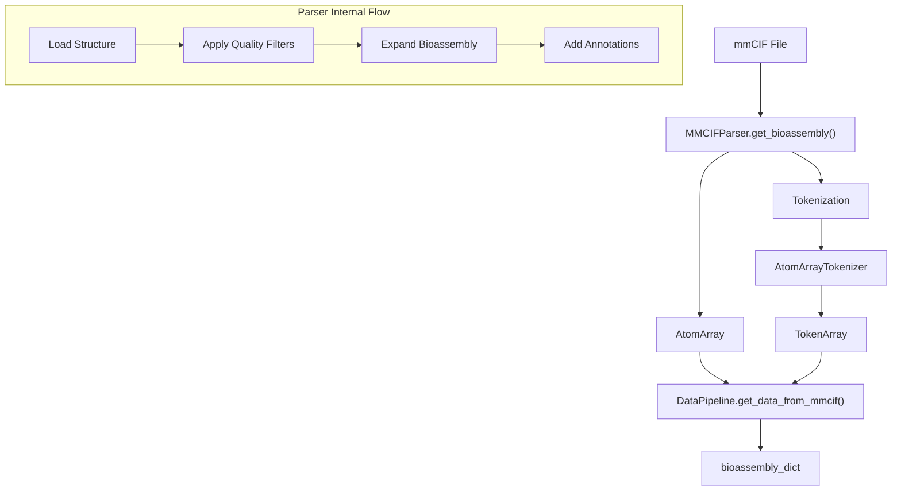
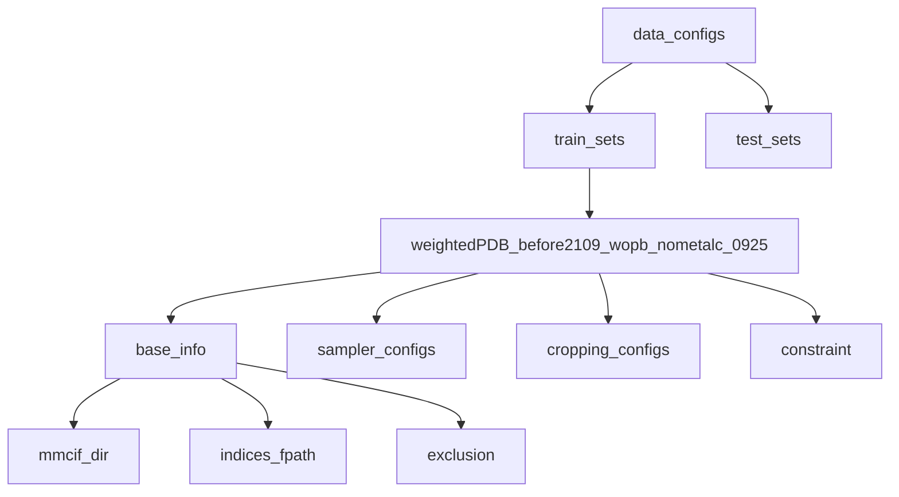

# Training Data Preparation

> **Relevant source files**
> * [configs/configs_data.py](https://github.com/bytedance/Protenix/blob/c3bfc365/configs/configs_data.py)
> * [protenix/data/pipeline/data_pipeline.py](https://github.com/bytedance/Protenix/blob/c3bfc365/protenix/data/pipeline/data_pipeline.py)
> * [protenix/data/pipeline/dataset.py](https://github.com/bytedance/Protenix/blob/c3bfc365/protenix/data/pipeline/dataset.py)
> * [scripts/database/download_protenix_data.sh](https://github.com/bytedance/Protenix/blob/c3bfc365/scripts/database/download_protenix_data.sh)

This page describes the preparation of training data for Protenix models. It covers data sources, bioassembly generation from PDB structures, dataset configuration, cropping strategies, and feature generation pipelines. For information about the actual training execution and loss computation, see [6.2 Training Execution](https://github.com/bytedance/Protenix/blob/c3bfc365/6.2 Training Execution)

 For details on feature generation during inference, see [4.3 Feature Generation](https://github.com/bytedance/Protenix/blob/c3bfc365/4.3 Feature Generation)

## Overview and Data Sources

Protenix training uses PDB structures with specific cut-off dates to prevent data leakage when evaluating on recent structures. The training pipeline processes mmCIF files into bioassemblies, applies quality filters, and generates training samples through various cropping strategies.

The primary training dataset configurations are defined in `configs/configs_data.py`. The system supports multiple versions of the wwPDB data, such as `2024.05.22` and `2026.01.01` [scripts/database/download_protenix_data.sh L41-L49](https://github.com/bytedance/Protenix/blob/c3bfc365/scripts/database/download_protenix_data.sh#L41-L49)

### Data Organization

Training data consists of three main components:

| Component | Description | Location (relative to `PROTENIX_ROOT_DIR`) |
| --- | --- | --- |
| **mmCIF files** | Raw PDB structures in mmCIF format | `mmcif/` |
| **Bioassembly dictionaries** | Pre-processed AtomArray objects with annotations | `mmcif_bioassembly/` |
| **Indices CSV** | List of chains/interfaces for sampling | `indices/*.csv.gz` |

Sources: [configs/configs_data.py L144-L153](https://github.com/bytedance/Protenix/blob/c3bfc365/configs/configs_data.py#L144-L153)

 [scripts/database/download_protenix_data.sh L91-L109](https://github.com/bytedance/Protenix/blob/c3bfc365/scripts/database/download_protenix_data.sh#L91-L109)

## Bioassembly Generation Pipeline

The `DataPipeline` class [protenix/data/pipeline/data_pipeline.py L44](https://github.com/bytedance/Protenix/blob/c3bfc365/protenix/data/pipeline/data_pipeline.py#L44-L44)

 provides the interface for transforming raw mmCIF files into training-ready bioassemblies. It utilizes specialized parsers like `MMCIFParser`, `DistillationMMCIFParser`, and `RecentPDB_MMCIFParser` [protenix/data/pipeline/data_pipeline.py L69-L78](https://github.com/bytedance/Protenix/blob/c3bfc365/protenix/data/pipeline/data_pipeline.py#L69-L78)



Sources: [protenix/data/pipeline/data_pipeline.py L44-L102](https://github.com/bytedance/Protenix/blob/c3bfc365/protenix/data/pipeline/data_pipeline.py#L44-L102)

 [protenix/data/pipeline/data_pipeline.py L110-L124](https://github.com/bytedance/Protenix/blob/c3bfc365/protenix/data/pipeline/data_pipeline.py#L110-L124)

### Annotation Addition

The pipeline adds multiple annotations to the `AtomArray` for downstream processing:

| Annotation | Description |
| --- | --- |
| `asym_id_int` | Integer mapping of asymmetric unit IDs |
| `label_entity_id` | Entity identifier from mmCIF |
| `resolution` | Structure resolution [protenix/data/pipeline/data_pipeline.py L92-L94](https://github.com/bytedance/Protenix/blob/c3bfc365/protenix/data/pipeline/data_pipeline.py#L92-L94) |

Sources: [protenix/data/pipeline/data_pipeline.py L91-L97](https://github.com/bytedance/Protenix/blob/c3bfc365/protenix/data/pipeline/data_pipeline.py#L91-L97)

 [protenix/data/pipeline/data_pipeline.py L110-L124](https://github.com/bytedance/Protenix/blob/c3bfc365/protenix/data/pipeline/data_pipeline.py#L110-L124)

## Dataset Configuration and Indices

### Configuration Structure

Training datasets are defined in `configs/configs_data.py` with hierarchical configuration. A standard training set includes `base_info`, `sampler_configs`, `cropping_configs`, and `constraint` settings [configs/configs_data.py L144-L164](https://github.com/bytedance/Protenix/blob/c3bfc365/configs/configs_data.py#L144-L164)



Sources: [configs/configs_data.py L128-L164](https://github.com/bytedance/Protenix/blob/c3bfc365/configs/configs_data.py#L128-L164)

### Indices File Handling

The `BaseSingleDataset` class reads the indices list from a CSV file [protenix/data/pipeline/dataset.py L126](https://github.com/bytedance/Protenix/blob/c3bfc365/protenix/data/pipeline/dataset.py#L126-L126)

 This file defines individual training samples (chains or interfaces).

**Exclusion Rules:**
The `exclusion_dict` allows removing specific rows from the indices list based on column values, such as excluding "ions" [configs/configs_data.py L158-L161](https://github.com/bytedance/Protenix/blob/c3bfc365/configs/configs_data.py#L158-L161)

```markdown
# Example exclusion logic in BaseSingleDatasetself.exclusion_dict = kwargs.get("exclusion", {})# Filters indices_list during initialization
```

Sources: [protenix/data/pipeline/dataset.py L103-L107](https://github.com/bytedance/Protenix/blob/c3bfc365/protenix/data/pipeline/dataset.py#L103-L107)

 [protenix/data/pipeline/dataset.py L153-L181](https://github.com/bytedance/Protenix/blob/c3bfc365/protenix/data/pipeline/dataset.py#L153-L181)

## Data Loading Pipeline

### BaseSingleDataset

The `BaseSingleDataset` class implements the core `torch.utils.data.Dataset` logic [protenix/data/pipeline/dataset.py L50](https://github.com/bytedance/Protenix/blob/c3bfc365/protenix/data/pipeline/dataset.py#L50-L50)

**Key Initialization Parameters:**

* `mmcif_dir`: Directory for raw structures [protenix/data/pipeline/dataset.py L71](https://github.com/bytedance/Protenix/blob/c3bfc365/protenix/data/pipeline/dataset.py#L71-L71)
* `bioassembly_dict_dir`: Directory for pre-processed pickles [protenix/data/pipeline/dataset.py L72](https://github.com/bytedance/Protenix/blob/c3bfc365/protenix/data/pipeline/dataset.py#L72-L72)
* `cropping_configs`: Configuration for token-level cropping [protenix/data/pipeline/dataset.py L74](https://github.com/bytedance/Protenix/blob/c3bfc365/protenix/data/pipeline/dataset.py#L74-L74)
* `msa_featurizer`: Optional `MSAFeaturizer` for MSA data [protenix/data/pipeline/dataset.py L122](https://github.com/bytedance/Protenix/blob/c3bfc365/protenix/data/pipeline/dataset.py#L122-L122)

Sources: [protenix/data/pipeline/dataset.py L57-L126](https://github.com/bytedance/Protenix/blob/c3bfc365/protenix/data/pipeline/dataset.py#L57-L126)

### Weighted Sampling

The training system uses a weighted sampler to balance different types of molecular interactions.

```
"sampler_configs": {    "sampler_type": "weighted",    "beta_dict": {        "chain": 0.5,        "interface": 1,    },    "alpha_dict": {        "prot": 3,        "nuc": 3,        "ligand": 1,    }}
```

Sources: [configs/configs_data.py L46-L58](https://github.com/bytedance/Protenix/blob/c3bfc365/configs/configs_data.py#L46-L58)

## Cropping Strategies

Training samples are cropped to a fixed size (defined by `crop_size`) to manage memory and computational load.

### Cropping Methods and Weights

Protenix employs three main cropping methods with specific weights in training [configs/configs_data.py L59-L62](https://github.com/bytedance/Protenix/blob/c3bfc365/configs/configs_data.py#L59-L62)

:

| Method | Weight | Description |
| --- | --- | --- |
| `ContiguousCropping` | 0.2 | Selects sequential tokens along a chain |
| `SpatialCropping` | 0.4 | Selects tokens within a 3D spatial neighborhood |
| `SpatialInterfaceCropping` | 0.4 | Biased selection toward interface regions |

Sources: [configs/configs_data.py L59-L62](https://github.com/bytedance/Protenix/blob/c3bfc365/configs/configs_data.py#L59-L62)

 [protenix/data/pipeline/data_pipeline.py L35](https://github.com/bytedance/Protenix/blob/c3bfc365/protenix/data/pipeline/data_pipeline.py#L35-L35)

## MSA and Template Features

### MSA Feature Generation

The `DataPipeline` provides methods to extract MSA features for specific tokens. `get_msa_raw_features` retrieves tokenized MSA features for a given bioassembly and selected indices [protenix/data/pipeline/data_pipeline.py L177-L185](https://github.com/bytedance/Protenix/blob/c3bfc365/protenix/data/pipeline/data_pipeline.py#L177-L185)

### Template Features

Template features are handled via the `TemplateFeaturizer` [protenix/data/pipeline/data_pipeline.py L33](https://github.com/bytedance/Protenix/blob/c3bfc365/protenix/data/pipeline/data_pipeline.py#L33-L33)

 During data preparation, the pipeline can integrate pre-computed template features into the bioassembly dictionary [protenix/data/pipeline/data_pipeline.py L99](https://github.com/bytedance/Protenix/blob/c3bfc365/protenix/data/pipeline/data_pipeline.py#L99-L99)

Sources: [protenix/data/pipeline/data_pipeline.py L177-L185](https://github.com/bytedance/Protenix/blob/c3bfc365/protenix/data/pipeline/data_pipeline.py#L177-L185)

 [protenix/data/pipeline/data_pipeline.py L98-L99](https://github.com/bytedance/Protenix/blob/c3bfc365/protenix/data/pipeline/data_pipeline.py#L98-L99)

## Constraint Features for Training

Constraint features allow the model to learn from partial structural information. The `ConstraintFeatureGenerator` [protenix/data/pipeline/dataset.py L31](https://github.com/bytedance/Protenix/blob/c3bfc365/protenix/data/pipeline/dataset.py#L31-L31)

 is initialized if `constraint["enable"]` is True [protenix/data/pipeline/dataset.py L110-L116](https://github.com/bytedance/Protenix/blob/c3bfc365/protenix/data/pipeline/dataset.py#L110-L116)

### Constraint Types and Probabilities

Constraints are applied with specific probabilities (`prob`) and coverage (`size`) [configs/configs_data.py L71-L124](https://github.com/bytedance/Protenix/blob/c3bfc365/configs/configs_data.py#L71-L124)

:

| Constraint Type | Prob | Description |
| --- | --- | --- |
| `pocket` | 0.0 | Distance constraints within binding pockets |
| `contact` | 0.0 | Residue-level contact information |
| `substructure` | 0.0 | Partial ground truth coordinates with noise |
| `contact_atom` | 0.0 | Atom-level contact constraints |

Sources: [configs/configs_data.py L71-L124](https://github.com/bytedance/Protenix/blob/c3bfc365/configs/configs_data.py#L71-L124)

 [protenix/data/pipeline/dataset.py L110-L116](https://github.com/bytedance/Protenix/blob/c3bfc365/protenix/data/pipeline/dataset.py#L110-L116)

## Data Augmentation

Several augmentation techniques are applied during training to improve model robustness:

* **Reference Position Augmentation**: Enabled via `ref_pos_augment` [protenix/data/pipeline/dataset.py L77](https://github.com/bytedance/Protenix/blob/c3bfc365/protenix/data/pipeline/dataset.py#L77-L77)
* **Ligand Atom Renaming**: Randomizes atom names in ligands [protenix/data/pipeline/dataset.py L78](https://github.com/bytedance/Protenix/blob/c3bfc365/protenix/data/pipeline/dataset.py#L78-L78)
* **Molecule Shuffling**: Shuffles the order of molecules in the input [protenix/data/pipeline/dataset.py L82](https://github.com/bytedance/Protenix/blob/c3bfc365/protenix/data/pipeline/dataset.py#L82-L82)
* **Symmetry ID Shuffling**: Randomizes symmetry identifiers [protenix/data/pipeline/dataset.py L83](https://github.com/bytedance/Protenix/blob/c3bfc365/protenix/data/pipeline/dataset.py#L83-L83)

Sources: [protenix/data/pipeline/dataset.py L77-L84](https://github.com/bytedance/Protenix/blob/c3bfc365/protenix/data/pipeline/dataset.py#L77-L84)

 [configs/configs_data.py L65-L67](https://github.com/bytedance/Protenix/blob/c3bfc365/configs/configs_data.py#L65-L67)