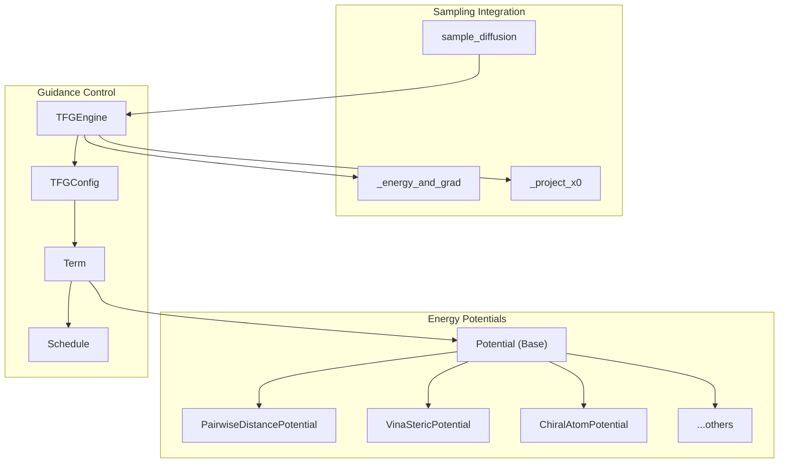
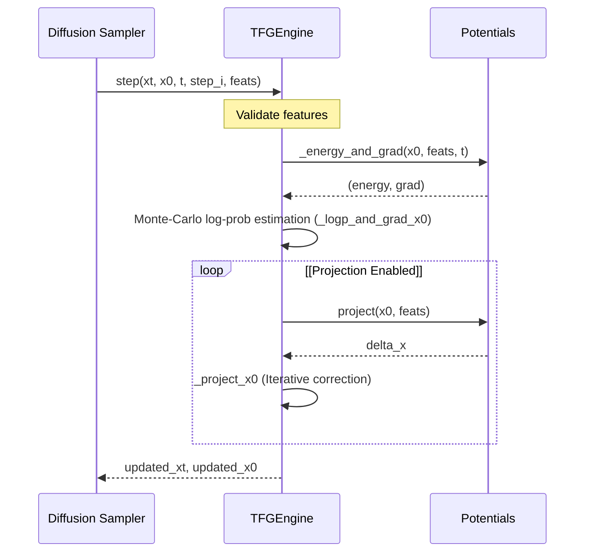

# Training-Free Guidance (TFG)

> **Relevant source files**
> * [protenix/tfg/__init__.py](https://github.com/bytedance/Protenix/blob/c3bfc365/protenix/tfg/__init__.py)
> * [protenix/tfg/config.py](https://github.com/bytedance/Protenix/blob/c3bfc365/protenix/tfg/config.py)
> * [protenix/tfg/engine.py](https://github.com/bytedance/Protenix/blob/c3bfc365/protenix/tfg/engine.py)
> * [protenix/tfg/potentials.py](https://github.com/bytedance/Protenix/blob/c3bfc365/protenix/tfg/potentials.py)

The Training-Free Guidance (TFG) system provides a modular framework for applying differentiable energy potentials to guide the diffusion sampling process without requiring retraining of the base model [protenix/tfg/__init__.py L1-L4](https://github.com/bytedance/Protenix/blob/c3bfc365/protenix/tfg/__init__.py#L1-L4)

 It treats configured energy terms as soft constraints or conditioning signals to improve the physical realism and geometric accuracy of predicted structures [protenix/tfg/engine.py L22-L30](https://github.com/bytedance/Protenix/blob/c3bfc365/protenix/tfg/engine.py#L22-L30)

### System Architecture

The TFG system consists of three main layers: the `TFGEngine` which manages the sampling loop, the `TFGConfig` which handles time-varying schedules, and a library of `Potential` classes that implement specific geometric or chemical constraints [protenix/tfg/config.py L15-L29](https://github.com/bytedance/Protenix/blob/c3bfc365/protenix/tfg/config.py#L15-L29)

 [protenix/tfg/engine.py L72-L78](https://github.com/bytedance/Protenix/blob/c3bfc365/protenix/tfg/engine.py#L72-L78)

#### TFG Code Entity Map

The following diagram maps the logical components of the guidance system to their corresponding code entities.

Sources: [protenix/tfg/engine.py L72-L78](https://github.com/bytedance/Protenix/blob/c3bfc365/protenix/tfg/engine.py#L72-L78)

 [protenix/tfg/config.py L188-L210](https://github.com/bytedance/Protenix/blob/c3bfc365/protenix/tfg/config.py#L188-L210)

 [protenix/tfg/potentials.py L68-L73](https://github.com/bytedance/Protenix/blob/c3bfc365/protenix/tfg/potentials.py#L68-L73)

 [protenix/tfg/__init__.py L1-L4](https://github.com/bytedance/Protenix/blob/c3bfc365/protenix/tfg/__init__.py#L1-L4)

### The TFGEngine

The `TFGEngine` is the core runtime class that evaluates potentials and integrates them into diffusion steps [protenix/tfg/engine.py L72-L78](https://github.com/bytedance/Protenix/blob/c3bfc365/protenix/tfg/engine.py#L72-L78)

 It supports three primary guidance mechanisms:

1. **Denoiser-path Guidance (`rho`)**: Gradients flow through the denoiser network to influence the sampling path [protenix/tfg/engine.py L25-L26](https://github.com/bytedance/Protenix/blob/c3bfc365/protenix/tfg/engine.py#L25-L26)
2. **x0 Refinement (`mu`)**: Directly refines the denoiser's $x_0$ prediction using gradients of the energy function [protenix/tfg/engine.py L27-L28](https://github.com/bytedance/Protenix/blob/c3bfc365/protenix/tfg/engine.py#L27-L28)
3. **Manifold Projection**: Harder constraints are enforced by projecting $x_0$ onto valid manifolds (e.g., correcting chirality or bond lengths) [protenix/tfg/engine.py L29-L30](https://github.com/bytedance/Protenix/blob/c3bfc365/protenix/tfg/engine.py#L29-L30)

#### Data Flow in TFGEngine

The `step` function manages the transition from noisy coordinates $x_t$ to refined predictions.

Sources: [protenix/tfg/engine.py L98-L133](https://github.com/bytedance/Protenix/blob/c3bfc365/protenix/tfg/engine.py#L98-L133)

 [protenix/tfg/engine.py L177-L210](https://github.com/bytedance/Protenix/blob/c3bfc365/protenix/tfg/engine.py#L177-L210)

 [protenix/tfg/engine.py L245-L290](https://github.com/bytedance/Protenix/blob/c3bfc365/protenix/tfg/engine.py#L245-L290)

### Energy Potentials

Potentials are implemented as subclasses of `Potential` [protenix/tfg/potentials.py L68-L73](https://github.com/bytedance/Protenix/blob/c3bfc365/protenix/tfg/potentials.py#L68-L73)

 Each potential must implement `_eval` to compute energy and (optionally) coordinate gradients [protenix/tfg/potentials.py L90-L108](https://github.com/bytedance/Protenix/blob/c3bfc365/protenix/tfg/potentials.py#L90-L108)

| Potential Class | Purpose | Required Features |
| --- | --- | --- |
| `PairwiseDistancePotential` | Restrains distances between atom pairs | `pairwise_distance_index`, `lower_bound`, `upper_bound` |
| `VinaStericPotential` | Prevents atomic clashes using VDW radii | `asym_id`, `atom_to_token_idx`, `ref_element` |
| `ChiralAtomPotential` | Corrects/maintains chiral center orientation | `chiral_index`, `chiral_orientation` |
| `StereoBondPotential` | Enforces E/Z isomerism for double bonds | `stereo_bond_index`, `stereo_bond_orientation` |
| `VinaStericPotential` | Implements steric repulsion based on Autodock Vina | `ref_element`, `rdkit_vdws` |

Sources: [protenix/tfg/config.py L141-L184](https://github.com/bytedance/Protenix/blob/c3bfc365/protenix/tfg/config.py#L141-L184)

 [protenix/tfg/potentials.py L38-L40](https://github.com/bytedance/Protenix/blob/c3bfc365/protenix/tfg/potentials.py#L38-L40)

 [protenix/tfg/potentials.py L111-L146](https://github.com/bytedance/Protenix/blob/c3bfc365/protenix/tfg/potentials.py#L111-L146)

### Configuration and Scheduling

TFG uses a hierarchical configuration system defined in `protenix.tfg.config`.

#### Schedules

Guidance weights and potential parameters can vary over diffusion time $t \in [0, 1]$ using `Schedule` objects [protenix/tfg/config.py L40-L46](https://github.com/bytedance/Protenix/blob/c3bfc365/protenix/tfg/config.py#L40-L46)

:

* **`Constant`**: Returns a fixed value regardless of $t$ [protenix/tfg/config.py L61-L64](https://github.com/bytedance/Protenix/blob/c3bfc365/protenix/tfg/config.py#L61-L64)
* **`ExponentialInterpolation`**: Interpolates between `start` and `end` values, with an `alpha` parameter to control the warping (concentration near $t=0$ or $t=1$) [protenix/tfg/config.py L72-L81](https://github.com/bytedance/Protenix/blob/c3bfc365/protenix/tfg/config.py#L72-L81)

#### Terms

A `Term` wraps a potential with its specific execution settings [protenix/tfg/config.py L188-L196](https://github.com/bytedance/Protenix/blob/c3bfc365/protenix/tfg/config.py#L188-L196)

:

* **`interval`**: How often (in diffusion steps) the term is evaluated [protenix/tfg/config.py L201](https://github.com/bytedance/Protenix/blob/c3bfc365/protenix/tfg/config.py#L201-L201)
* **`weight`**: A `Schedule` multiplying both the energy and gradient [protenix/tfg/config.py L203](https://github.com/bytedance/Protenix/blob/c3bfc365/protenix/tfg/config.py#L203-L203)
* **`enable_projection`**: Boolean flag determining if the term participates in the manifold projection loop [protenix/tfg/config.py L210](https://github.com/bytedance/Protenix/blob/c3bfc365/protenix/tfg/config.py#L210-L210)

Sources: [protenix/tfg/config.py L103-L136](https://github.com/bytedance/Protenix/blob/c3bfc365/protenix/tfg/config.py#L103-L136)

 [protenix/tfg/config.py L188-L210](https://github.com/bytedance/Protenix/blob/c3bfc365/protenix/tfg/config.py#L188-L210)

### Implementation Details

#### Coordinate Gradients

Potentials calculate gradients by first computing Jacobians for geometric primitives (distances, angles, dihedrals) and then applying the chain rule to map back to atomic coordinates [protenix/tfg/potentials.py L28-L31](https://github.com/bytedance/Protenix/blob/c3bfc365/protenix/tfg/potentials.py#L28-L31)

 For example, `_distance_value_and_grad` computes the normalized displacement vector between atoms to determine the direction of the gradient [protenix/tfg/potentials.py L153-L174](https://github.com/bytedance/Protenix/blob/c3bfc365/protenix/tfg/potentials.py#L153-L174)

#### Monte-Carlo Estimation

To stabilize guidance, `TFGEngine` uses Monte-Carlo sampling to estimate the log-probability gradient $\nabla_{x_0} \log p(x_0)$ [protenix/tfg/engine.py L188-L193](https://github.com/bytedance/Protenix/blob/c3bfc365/protenix/tfg/engine.py#L188-L193)

 It perturbs $x_0$ with Gaussian noise (controlled by `eps`) and aggregates the results using a numerically stable `logmeanexp` operation [protenix/tfg/engine.py L64-L69](https://github.com/bytedance/Protenix/blob/c3bfc365/protenix/tfg/engine.py#L64-L69)

 [protenix/tfg/engine.py L157-L174](https://github.com/bytedance/Protenix/blob/c3bfc365/protenix/tfg/engine.py#L157-L174)

Sources: [protenix/tfg/engine.py L44-L61](https://github.com/bytedance/Protenix/blob/c3bfc365/protenix/tfg/engine.py#L44-L61)

 [protenix/tfg/engine.py L177-L210](https://github.com/bytedance/Protenix/blob/c3bfc365/protenix/tfg/engine.py#L177-L210)

 [protenix/tfg/potentials.py L153-L174](https://github.com/bytedance/Protenix/blob/c3bfc365/protenix/tfg/potentials.py#L153-L174)