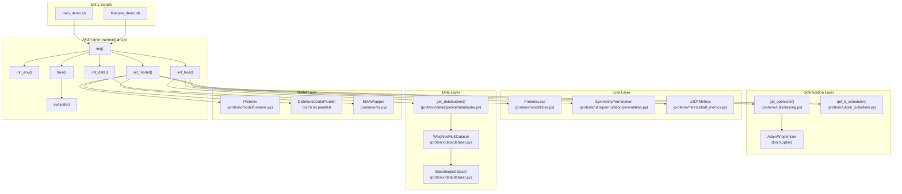

# Training System

> **Relevant source files**
> * [docs/kernels.md](https://github.com/bytedance/Protenix/blob/c3bfc365/docs/kernels.md?plain=1)
> * [finetune_demo.sh](https://github.com/bytedance/Protenix/blob/c3bfc365/finetune_demo.sh)
> * [protenix/utils/permutation/permutation.py](https://github.com/bytedance/Protenix/blob/c3bfc365/protenix/utils/permutation/permutation.py)
> * [protenix/utils/training.py](https://github.com/bytedance/Protenix/blob/c3bfc365/protenix/utils/training.py)
> * [runner/train.py](https://github.com/bytedance/Protenix/blob/c3bfc365/runner/train.py)
> * [train_demo.sh](https://github.com/bytedance/Protenix/blob/c3bfc365/train_demo.sh)

This document describes the Protenix training system for training and fine-tuning biomolecular structure prediction models from scratch or from checkpoints. The system is orchestrated by the `AF3Trainer` class in [runner/train.py](https://github.com/bytedance/Protenix/blob/c3bfc365/runner/train.py)

 and supports distributed training with PyTorch DDP, mixed precision training (BF16/FP32), gradient accumulation, exponential moving average (EMA) weight tracking, and symmetric permutation handling for molecular symmetries.

## Overview

The Protenix training system is implemented in [runner/train.py L54-L428](https://github.com/bytedance/Protenix/blob/c3bfc365/runner/train.py#L54-L428)

 with the `AF3Trainer` class as the central orchestrator. The training pipeline handles:

* **Model Initialization**: Creates `Protenix` model [protenix/model/protenix.py L30-L103](https://github.com/bytedance/Protenix/blob/c3bfc365/protenix/model/protenix.py#L30-L103)  wraps in DDP for distributed training.
* **Data Pipeline**: Loads training data via `WeightedMultiDataset` with spatial cropping and weighted sampling [protenix/data/pipeline/dataloader.py L28-L112](https://github.com/bytedance/Protenix/blob/c3bfc365/protenix/data/pipeline/dataloader.py#L28-L112)
* **Loss Computation**: Calculates loss using `ProtenixLoss` with diffusion, distogram, and confidence terms [protenix/model/loss.py L33-L228](https://github.com/bytedance/Protenix/blob/c3bfc365/protenix/model/loss.py#L33-L228)
* **Symmetric Permutation**: Aligns predictions to ground truth using `SymmetricPermutation` for chain and atom symmetries [protenix/utils/permutation/permutation.py L22-L488](https://github.com/bytedance/Protenix/blob/c3bfc365/protenix/utils/permutation/permutation.py#L22-L488)
* **Optimization**: Updates parameters with AdamW optimizer [protenix/utils/training.py L21-L71](https://github.com/bytedance/Protenix/blob/c3bfc365/protenix/utils/training.py#L21-L71)  and learning rate schedulers [protenix/utils/lr_scheduler.py L31-L48](https://github.com/bytedance/Protenix/blob/c3bfc365/protenix/utils/lr_scheduler.py#L31-L48)
* **EMA Tracking**: Maintains exponential moving average of weights via `EMAWrapper` [runner/ema.py L21-L36](https://github.com/bytedance/Protenix/blob/c3bfc365/runner/ema.py#L21-L36)
* **Checkpointing**: Saves model, optimizer, and scheduler states periodically [runner/train.py L226-L240](https://github.com/bytedance/Protenix/blob/c3bfc365/runner/train.py#L226-L240)

### Entry Points

The training system is invoked through two main scripts:

| Script | Purpose | Key Parameters |
| --- | --- | --- |
| `train_demo.sh` | Train from scratch | `--model_name`, `--max_steps`, `--train_crop_size` |
| `finetune_demo.sh` | Fine-tune from checkpoint | `--load_checkpoint_path`, `--load_ema_checkpoint_path`, `--data.{dataset}.base_info.pdb_list` |

Both scripts invoke [runner/train.py](https://github.com/bytedance/Protenix/blob/c3bfc365/runner/train.py)

 with appropriate configuration overrides.

**Diagram: Training System Architecture and Code Components**

Sources: [runner/train.py L54-L428](https://github.com/bytedance/Protenix/blob/c3bfc365/runner/train.py#L54-L428)

 [train_demo.sh L24-L47](https://github.com/bytedance/Protenix/blob/c3bfc365/train_demo.sh#L24-L47)

 [finetune_demo.sh L26-L51](https://github.com/bytedance/Protenix/blob/c3bfc365/finetune_demo.sh#L26-L51)

 [protenix/data/pipeline/dataloader.py L28-L112](https://github.com/bytedance/Protenix/blob/c3bfc365/protenix/data/pipeline/dataloader.py#L28-L112)

 [protenix/utils/training.py L73-L115](https://github.com/bytedance/Protenix/blob/c3bfc365/protenix/utils/training.py#L73-L115)

 [protenix/utils/lr_scheduler.py L31-L48](https://github.com/bytedance/Protenix/blob/c3bfc365/protenix/utils/lr_scheduler.py#L31-L48)

## AF3Trainer Class

The `AF3Trainer` class [runner/train.py L54-L428](https://github.com/bytedance/Protenix/blob/c3bfc365/runner/train.py#L54-L428)

 orchestrates all aspects of training and evaluation.

### Initialization Methods

The trainer initialization involves multiple setup stages:

| Method | Purpose | Key Actions |
| --- | --- | --- |
| `init_env()` | Environment setup | DDP initialization, CUDA setup, seed setting [runner/train.py L129-L178](https://github.com/bytedance/Protenix/blob/c3bfc365/runner/train.py#L129-L178) |
| `init_basics()` | Basic attributes | Step counters, directory creation, config saving [runner/train.py L72-L115](https://github.com/bytedance/Protenix/blob/c3bfc365/runner/train.py#L72-L115) |
| `init_log()` | Logging setup | W&B initialization, metric aggregators [runner/train.py L116-L127](https://github.com/bytedance/Protenix/blob/c3bfc365/runner/train.py#L116-L127) |
| `init_model()` | Model setup | Model creation, DDP wrapping, optimizer, scheduler [runner/train.py L157-L201](https://github.com/bytedance/Protenix/blob/c3bfc365/runner/train.py#L157-L201) |
| `init_loss()` | Loss components | `ProtenixLoss`, `SymmetricPermutation`, `LDDTMetrics` [runner/train.py L179-L191](https://github.com/bytedance/Protenix/blob/c3bfc365/runner/train.py#L179-L191) |
| `init_data()` | Data loading | Train/test dataloaders via `get_dataloaders()` [runner/train.py L218-L224](https://github.com/bytedance/Protenix/blob/c3bfc365/runner/train.py#L218-L224) |

Diagram: **AF3Trainer Initialization Sequence**

```mermaid
flowchart TD

AF3TrainerInit["AF3Trainer.init()"]
InitEnv["init_env()"]
InitBasics["init_basics()"]
InitLog["init_log()"]
InitModel["init_model()"]
InitLoss["init_loss()"]
InitData["init_data()"]
TryLoadCheckpoint["try_load_checkpoint()"]
DistInit["dist.init_process_group()"]
SeedEverything["seed_everything()"]
CreateDirs["Create run_dir, checkpoint_dir, etc"]
SaveConfig["save_config()"]
WandbInit["wandb.init()"]
MetricAgg["SimpleMetricAggregator"]
ProtenixModel["Protenix()"]
DDPWrap["DistributedDataParallel()"]
EMAWrapperInit["EMAWrapper()"]
GetOptimizerCall["get_optimizer()"]
ProtenixLossInit["ProtenixLoss()"]
SymPermInit["SymmetricPermutation()"]
LDDTMetricsInit["LDDTMetrics()"]
GetDataloadersCall["get_dataloaders()"]

AF3TrainerInit --> InitEnv
AF3TrainerInit --> InitBasics
AF3TrainerInit --> InitLog
AF3TrainerInit --> InitModel
AF3TrainerInit --> InitLoss
AF3TrainerInit --> InitData
AF3TrainerInit --> TryLoadCheckpoint
InitEnv --> DistInit
InitEnv --> SeedEverything
InitBasics --> CreateDirs
InitBasics --> SaveConfig
InitLog --> WandbInit
InitLog --> MetricAgg
InitModel --> ProtenixModel
InitModel --> DDPWrap
InitModel --> EMAWrapperInit
InitModel --> GetOptimizerCall
InitLoss --> ProtenixLossInit
InitLoss --> SymPermInit
InitLoss --> LDDTMetricsInit
InitData --> GetDataloadersCall
```

Sources: [runner/train.py L62-L71](https://github.com/bytedance/Protenix/blob/c3bfc365/runner/train.py#L62-L71)

 [runner/train.py L72-L115](https://github.com/bytedance/Protenix/blob/c3bfc365/runner/train.py#L72-L115)

 [runner/train.py L129-L178](https://github.com/bytedance/Protenix/blob/c3bfc365/runner/train.py#L129-L178)

 [runner/train.py L157-L201](https://github.com/bytedance/Protenix/blob/c3bfc365/runner/train.py#L157-L201)

 [runner/train.py L218-L224](https://github.com/bytedance/Protenix/blob/c3bfc365/runner/train.py#L218-L224)

## Loss Calculation and Symmetric Permutation

### Loss Components

The `ProtenixLoss` class [protenix/model/loss.py L33-L228](https://github.com/bytedance/Protenix/blob/c3bfc365/protenix/model/loss.py#L33-L228)

 calculates multiple loss terms during training:

* **Diffusion loss**: MSE loss on denoising predictions.
* **Distogram loss**: Cross-entropy loss on predicted distance distributions.
* **Confidence loss**: Cross-entropy loss on confidence metrics (pLDDT, PAE, PDE).

The loss calculation involves mini-rollout permutation managed by `AF3Trainer` [runner/train.py L314-L324](https://github.com/bytedance/Protenix/blob/c3bfc365/runner/train.py#L314-L324)

: it aligns ground truth labels to mini-rollout predictions using `SymmetricPermutation.permute_label_to_match_mini_rollout()`.

### Symmetric Permutation System

The `SymmetricPermutation` class [protenix/utils/permutation/permutation.py L22-L488](https://github.com/bytedance/Protenix/blob/c3bfc365/protenix/utils/permutation/permutation.py#L22-L488)

 handles molecular symmetries:

| Method | Purpose | Stage |
| --- | --- | --- |
| `permute_label_to_match_mini_rollout()` | Align labels to mini-rollout | Training mini-rollout [protenix/utils/permutation/permutation.py L40-L113](https://github.com/bytedance/Protenix/blob/c3bfc365/protenix/utils/permutation/permutation.py#L40-L113) |
| `permute_diffusion_sample_to_match_label()` | Align predictions to labels | Training/evaluation full diffusion [protenix/utils/permutation/permutation.py L115-L241](https://github.com/bytedance/Protenix/blob/c3bfc365/protenix/utils/permutation/permutation.py#L115-L241) |
| `permute_heads()` | Permute confidence head outputs | Post-diffusion [protenix/utils/permutation/permutation.py L243-L346](https://github.com/bytedance/Protenix/blob/c3bfc365/protenix/utils/permutation/permutation.py#L243-L346) |

Sources: [protenix/utils/permutation/permutation.py L22-L488](https://github.com/bytedance/Protenix/blob/c3bfc365/protenix/utils/permutation/permutation.py#L22-L488)

 [runner/train.py L314-L324](https://github.com/bytedance/Protenix/blob/c3bfc365/runner/train.py#L314-L324)

 [protenix/model/loss.py L33-L228](https://github.com/bytedance/Protenix/blob/c3bfc365/protenix/model/loss.py#L33-L228)

## Checkpoint Management and EMA

### Checkpoint Loading

The `try_load_checkpoint()` method [runner/train.py L242-L308](https://github.com/bytedance/Protenix/blob/c3bfc365/runner/train.py#L242-L308)

 supports flexible checkpoint loading:

| Parameter | Purpose | Effect |
| --- | --- | --- |
| `--load_checkpoint_path` | Main checkpoint path | Loads model, optimizer, scheduler, step [runner/train.py L255-L274](https://github.com/bytedance/Protenix/blob/c3bfc365/runner/train.py#L255-L274) |
| `--load_ema_checkpoint_path` | EMA checkpoint path | Loads model weights for EMA initialization [runner/train.py L276-L291](https://github.com/bytedance/Protenix/blob/c3bfc365/runner/train.py#L276-L291) |
| `--load_params_only` | Load only model weights | Skips optimizer/scheduler/step loading [runner/train.py L250](https://github.com/bytedance/Protenix/blob/c3bfc365/runner/train.py#L250-L250) |

### EMA Model Tracking

The `EMAWrapper` class [runner/ema.py L21-L36](https://github.com/bytedance/Protenix/blob/c3bfc365/runner/ema.py#L21-L36)

 maintains an exponential moving average of model parameters. During evaluation [runner/train.py L360-L366](https://github.com/bytedance/Protenix/blob/c3bfc365/runner/train.py#L360-L366)

 the trainer evaluates both the training model and EMA model (with suffix `ema{decay}_`).

Sources: [runner/train.py L242-L308](https://github.com/bytedance/Protenix/blob/c3bfc365/runner/train.py#L242-L308)

 [runner/ema.py L21-L36](https://github.com/bytedance/Protenix/blob/c3bfc365/runner/ema.py#L21-L36)

## Optimizer and Learning Rate Scheduling

### Optimizer Configuration

The `get_optimizer()` function [protenix/utils/training.py L73-L115](https://github.com/bytedance/Protenix/blob/c3bfc365/protenix/utils/training.py#L73-L115)

 creates an AdamW optimizer with parameter grouping:

**Parameter Grouping**: The `get_adamw()` function [protenix/utils/training.py L21-L71](https://github.com/bytedance/Protenix/blob/c3bfc365/protenix/utils/training.py#L21-L71)

 separates parameters:

| Group | Criteria | Weight Decay |
| --- | --- | --- |
| `decay_params` | Tensors with `ndim >= 2` | Applied [protenix/utils/training.py L47](https://github.com/bytedance/Protenix/blob/c3bfc365/protenix/utils/training.py#L47-L47) |
| `nodecay_params` | Tensors with `ndim < 2` | Zero [protenix/utils/training.py L48](https://github.com/bytedance/Protenix/blob/c3bfc365/protenix/utils/training.py#L48-L48) |

### Learning Rate Scheduling

The `get_lr_scheduler()` function [protenix/utils/lr_scheduler.py L31-L48](https://github.com/bytedance/Protenix/blob/c3bfc365/protenix/utils/lr_scheduler.py#L31-L48)

 supports multiple strategies, including `AlphaFold3LRScheduler` and `FinetuneLRScheduler` [protenix/utils/lr_scheduler.py L130-L165](https://github.com/bytedance/Protenix/blob/c3bfc365/protenix/utils/lr_scheduler.py#L130-L165)

Sources: [protenix/utils/training.py L21-L115](https://github.com/bytedance/Protenix/blob/c3bfc365/protenix/utils/training.py#L21-L115)

 [protenix/utils/lr_scheduler.py L31-L48](https://github.com/bytedance/Protenix/blob/c3bfc365/protenix/utils/lr_scheduler.py#L31-L48)

## Performance Optimization

The system supports several kernel optimizations for training performance:

* **Triangle Attention**: Supports `triattention`, `cuequivariance`, `deepspeed`, and `torch` [docs/kernels.md L10-L38](https://github.com/bytedance/Protenix/blob/c3bfc365/docs/kernels.md?plain=1#L10-L38)
* **Triangle Multiplicative**: Supports `cuequivariance` and `torch` [docs/kernels.md L39-L51](https://github.com/bytedance/Protenix/blob/c3bfc365/docs/kernels.md?plain=1#L39-L51)
* **Fast LayerNorm**: Used by default, modified from FastFold and Oneflow [docs/kernels.md L3-L9](https://github.com/bytedance/Protenix/blob/c3bfc365/docs/kernels.md?plain=1#L3-L9)

Sources: [docs/kernels.md L1-L52](https://github.com/bytedance/Protenix/blob/c3bfc365/docs/kernels.md?plain=1#L1-L52)

 [train_demo.sh L15-L19](https://github.com/bytedance/Protenix/blob/c3bfc365/train_demo.sh#L15-L19)

## Child Pages

For detailed information on specific training topics, see:

* [Training Data Preparation](/bytedance/Protenix/6.1-training-data-preparation) — Detail the process of preparing training datasets, including weighted sampling and constraint generation.
* [Training Execution](/bytedance/Protenix/6.2-training-execution) — Explain the training loop, loss computation, optimizer configuration, and learning rate scheduling.
* [Fine-tuning](/bytedance/Protenix/6.3-fine-tuning) — Guide for fine-tuning models with different crop sizes, confidence-only training, and parameter selection.