# Web Service and MSA API

> **Relevant source files**
> * [protenix/web_service/colab_request_parser.py](https://github.com/bytedance/Protenix/blob/c3bfc365/protenix/web_service/colab_request_parser.py)
> * [protenix/web_service/colab_request_utils.py](https://github.com/bytedance/Protenix/blob/c3bfc365/protenix/web_service/colab_request_utils.py)
> * [protenix/web_service/prediction_visualization.py](https://github.com/bytedance/Protenix/blob/c3bfc365/protenix/web_service/prediction_visualization.py)
> * [runner/msa_search.py](https://github.com/bytedance/Protenix/blob/c3bfc365/runner/msa_search.py)
> * [scripts/colabfold_msa.py](https://github.com/bytedance/Protenix/blob/c3bfc365/scripts/colabfold_msa.py)

## Purpose and Scope

This document covers the web service infrastructure for Protenix, specifically the `RequestParser` system that handles web-based prediction requests and integrates with the MMseqs2 API for Multiple Sequence Alignment (MSA) generation. This system provides a higher-level interface than the CLI for running predictions through web services.

For information about the CLI-based MSA generation tools, see [Multiple Sequence Alignment](/bytedance/Protenix/3.3-multiple-sequence-alignment). For details on how MSA features are embedded in the model, see [Neural Network Components](/bytedance/Protenix/5.2-neural-network-components). For batch inference execution, see [Running Inference](/bytedance/Protenix/3.4-running-inference).

---

## System Architecture

The web service layer bridges external prediction requests with the core inference pipeline. It handles data preparation, MSA generation via external services, and orchestration of the inference process.

### High-Level Request Flow

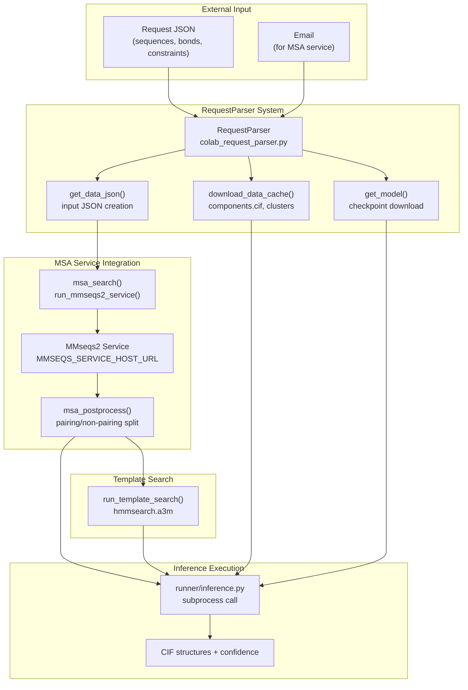

**Sources:** [protenix/web_service/colab_request_parser.py L86-L497](https://github.com/bytedance/Protenix/blob/c3bfc365/protenix/web_service/colab_request_parser.py#L86-L497)

---

## RequestParser Class

The `RequestParser` class is the main orchestrator for web-based prediction requests. It handles the complete workflow from receiving a request JSON to launching the inference process.

### Initialization and Configuration

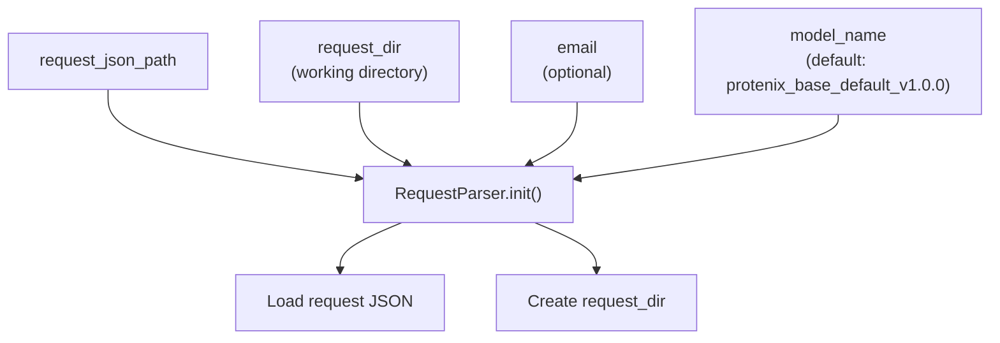

| Parameter | Type | Default | Description |
| --- | --- | --- | --- |
| `request_json_path` | str | Required | Path to input request JSON file |
| `request_dir` | str | Required | Working directory for outputs and intermediate files |
| `email` | str | `""` | Email for MMseqs2 service (optional) |
| `model_name` | str | `"protenix_base_default_v1.0.0"` | Model variant to use for inference |

**Sources:** [protenix/web_service/colab_request_parser.py L86-L100](https://github.com/bytedance/Protenix/blob/c3bfc365/protenix/web_service/colab_request_parser.py#L86-L100)

### Request JSON Format

The request JSON specifies the input complex, prediction parameters, and whether to use MSA/template features.

| Field | Type | Description |
| --- | --- | --- |
| `name` | str | Name identifier for the complex |
| `sequences` | List[Dict] | Sequence specifications (see below) |
| `covalent_bonds` | List | Bond specifications between entities |
| `use_msa` | bool | Whether to generate protein MSA |
| `use_template` | bool | Whether to search for templates |
| `atom_confidence` | bool | Whether to compute atom-level confidence |
| `model_seeds` | List[int] | Random seeds for model runs (optional) |
| `N_sample` | int | Number of diffusion samples (optional) |
| `N_step` | int | Number of diffusion steps (optional) |
| `N_cycle` | int | Number of recycling iterations (optional) |

Each sequence entry is a dictionary with a single key indicating the molecule type:

| Sequence Type | Fields | Description |
| --- | --- | --- |
| `proteinChain` | `sequence`: str | Protein amino acid sequence |
| `dnaSequence` | `sequence`: str | DNA nucleotide sequence |
| `rnaSequence` | `sequence`: str | RNA nucleotide sequence |
| `ligand` | `ccdCode` or `smiles` | Ligand specification |
| `ion` | `ccdCode` | Ion specification |

**Sources:** [protenix/web_service/colab_request_parser.py L137-L166](https://github.com/bytedance/Protenix/blob/c3bfc365/protenix/web_service/colab_request_parser.py#L137-L166)

---

## Data and Model Management

### Data Cache Download

The `download_data_cache()` method fetches required reference data files from a remote server if not already present locally.

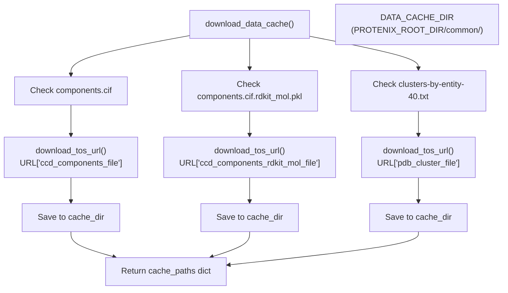

The cache files are stored in `$PROTENIX_ROOT_DIR/common/`:

| File | Purpose | Size Constraint |
| --- | --- | --- |
| `components.cif` | CCD chemical component definitions | Required for ligand/ion parsing |
| `components.cif.rdkit_mol.pkl` | Pre-computed RDKit molecules | Speeds up ligand processing |
| `clusters-by-entity-40.txt` | PDB entity clustering at 40% identity | Used for template filtering |

**Sources:** [protenix/web_service/colab_request_parser.py L102-L118](https://github.com/bytedance/Protenix/blob/c3bfc365/protenix/web_service/colab_request_parser.py#L102-L118)

### Model Checkpoint Download

The `get_model()` method ensures the requested model checkpoint is available locally.

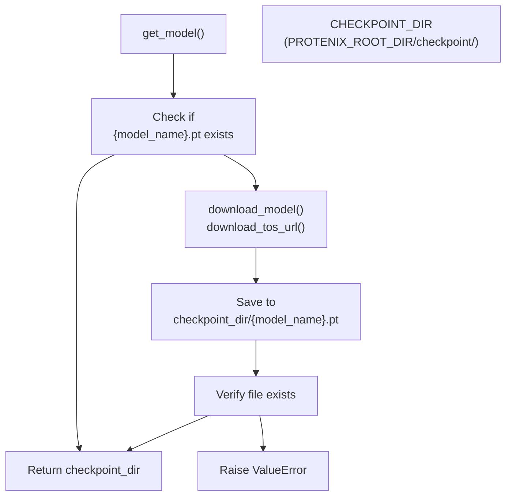

Model checkpoints are stored in `$PROTENIX_ROOT_DIR/checkpoint/{model_name}.pt`. The download URL is retrieved from the `URL` dictionary keyed by model name.

**Sources:** [protenix/web_service/colab_request_parser.py L120-L135](https://github.com/bytedance/Protenix/blob/c3bfc365/protenix/web_service/colab_request_parser.py#L120-L135)

---

## MSA Service Integration

The system integrates with the MMseqs2 service for protein MSA generation through a web API. This provides a faster alternative to running local MSA searches.

### Service Configuration

```
MMSEQS_SERVICE_HOST_URL = os.getenv(    "MMSEQS_SERVICE_HOST_URL", "https://protenix-server.com/api/msa")
```

The service URL can be overridden via the `MMSEQS_SERVICE_HOST_URL` environment variable.

**Sources:** [protenix/web_service/colab_request_parser.py L38-L40](https://github.com/bytedance/Protenix/blob/c3bfc365/protenix/web_service/colab_request_parser.py#L38-L40)

### MSA Search Modes

The system supports two operational modes:

| Mode | Endpoint | Use Case | Output Files |
| --- | --- | --- | --- |
| `protenix` | `/ticket/msa` | Default Protenix workflow | `{idx}.a3m`, `uniref_tax.m8`, `pdb70_220313_db.m8` |
| `colabfold` | `/ticket/msa` or `/ticket/pair` | ColabFold compatibility | `bfd.mgnify30.metaeuk30.smag30.a3m`, `uniref.a3m`, `pair.a3m` |

**Sources:** [protenix/web_service/colab_request_parser.py L243-L331](https://github.com/bytedance/Protenix/blob/c3bfc365/protenix/web_service/colab_request_parser.py#L243-L331)

### Request Submission and Polling

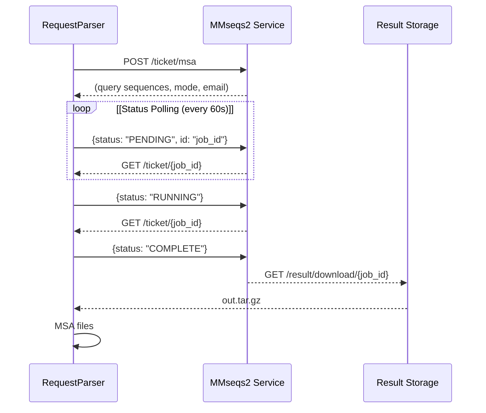

The submission and polling logic is implemented in the `run_mmseqs2_service()` function:

1. **Submit Job**: POST to `/ticket/msa` with query sequences [protenix/web_service/colab_request_utils.py L80-L86](https://github.com/bytedance/Protenix/blob/c3bfc365/protenix/web_service/colab_request_utils.py#L80-L86)
2. **Poll Status**: GET `/ticket/{job_id}` every 60 seconds [protenix/web_service/colab_request_utils.py L113-L118](https://github.com/bytedance/Protenix/blob/c3bfc365/protenix/web_service/colab_request_utils.py#L113-L118)
3. **Handle States**: * `PENDING`/`RUNNING`: Continue polling [protenix/web_service/colab_request_utils.py L228-L232](https://github.com/bytedance/Protenix/blob/c3bfc365/protenix/web_service/colab_request_utils.py#L228-L232) * `COMPLETE`: Proceed to download [protenix/web_service/colab_request_utils.py L233-L234](https://github.com/bytedance/Protenix/blob/c3bfc365/protenix/web_service/colab_request_utils.py#L233-L234) * `ERROR`/`MAINTENANCE`: Raise exception [protenix/web_service/colab_request_utils.py L235-L241](https://github.com/bytedance/Protenix/blob/c3bfc365/protenix/web_service/colab_request_utils.py#L235-L241) * `RATELIMIT`/`UNKNOWN`: Retry after delay [protenix/web_service/colab_request_utils.py L242-L254](https://github.com/bytedance/Protenix/blob/c3bfc365/protenix/web_service/colab_request_utils.py#L242-L254)
4. **Download Results**: GET `/result/download/{job_id}` [protenix/web_service/colab_request_utils.py L146-L151](https://github.com/bytedance/Protenix/blob/c3bfc365/protenix/web_service/colab_request_utils.py#L146-L151)
5. **Extract**: Unpack tar.gz to working directory [protenix/web_service/colab_request_utils.py L259-L262](https://github.com/bytedance/Protenix/blob/c3bfc365/protenix/web_service/colab_request_utils.py#L259-L262)

**Sources:** [protenix/web_service/colab_request_utils.py L44-L262](https://github.com/bytedance/Protenix/blob/c3bfc365/protenix/web_service/colab_request_utils.py#L44-L262)

### Error Handling and Retries

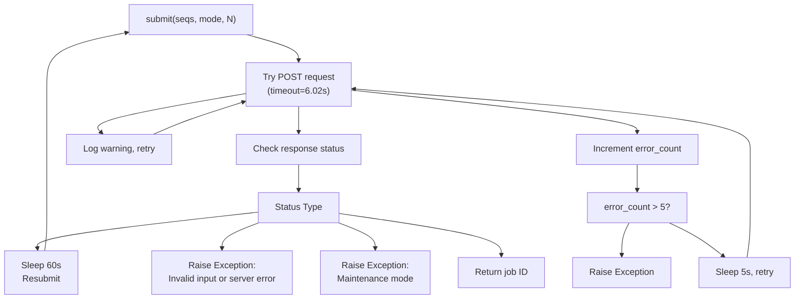

The system implements robust retry logic:

* **Connection Timeouts**: Set to 6.02s (slightly > 3 × 2s for TCP retries) [protenix/web_service/colab_request_utils.py L79-L83](https://github.com/bytedance/Protenix/blob/c3bfc365/protenix/web_service/colab_request_utils.py#L79-L83)
* **Error Retry Limit**: Maximum 5 retries before raising exception [protenix/web_service/colab_request_utils.py L97-L98](https://github.com/bytedance/Protenix/blob/c3bfc365/protenix/web_service/colab_request_utils.py#L97-L98)
* **Rate Limiting**: 60s sleep when encountering `RATELIMIT` status [protenix/web_service/colab_request_utils.py L242-L244](https://github.com/bytedance/Protenix/blob/c3bfc365/protenix/web_service/colab_request_utils.py#L242-L244)
* **Unknown States**: 60s sleep and resubmit for `UNKNOWN` status [protenix/web_service/colab_request_utils.py L249-L254](https://github.com/bytedance/Protenix/blob/c3bfc365/protenix/web_service/colab_request_utils.py#L249-L254)

**Sources:** [protenix/web_service/colab_request_utils.py L69-L140](https://github.com/bytedance/Protenix/blob/c3bfc365/protenix/web_service/colab_request_utils.py#L69-L140)

 [protenix/web_service/colab_request_utils.py L225-L257](https://github.com/bytedance/Protenix/blob/c3bfc365/protenix/web_service/colab_request_utils.py#L225-L257)

---

## MSA Processing Pipeline

After downloading raw MSA files from the service, they must be post-processed into the format expected by Protenix.

### MSA File Processing Workflow

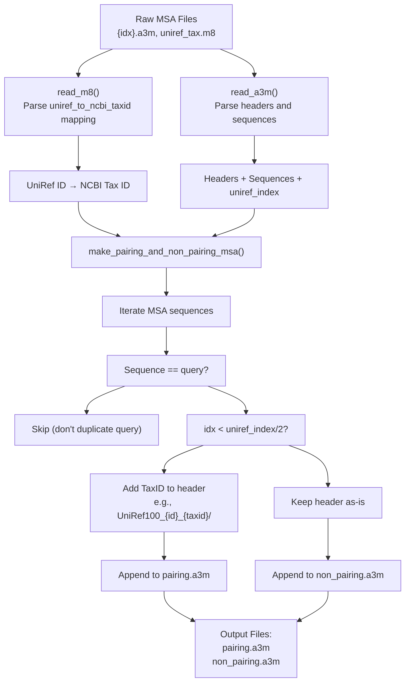

**Sources:** [protenix/web_service/colab_request_parser.py L333-L461](https://github.com/bytedance/Protenix/blob/c3bfc365/protenix/web_service/colab_request_parser.py#L333-L461)

### Pairing vs Non-Pairing MSA

The system splits raw MSA into two categories:

| MSA Type | Source | Purpose | Format |
| --- | --- | --- | --- |
| `pairing.a3m` | UniRef100 hits from first half of MSA | Paired MSA for multi-chain complexes | Headers include NCBI taxonomy ID [protenix/web_service/colab_request_parser.py L374-L381](https://github.com/bytedance/Protenix/blob/c3bfc365/protenix/web_service/colab_request_parser.py#L374-L381) |
| `non_pairing.a3m` | ColabfoldDB and remaining UniRef hits | General sequence homology | Standard headers without taxonomy [protenix/web_service/colab_request_parser.py L387-L396](https://github.com/bytedance/Protenix/blob/c3bfc365/protenix/web_service/colab_request_parser.py#L387-L396) |

The split is determined by the `uniref_index` marker in the raw MSA file, which indicates where UniRef sequences end and ColabfoldDB sequences begin [protenix/web_service/colab_request_parser.py L363-L365](https://github.com/bytedance/Protenix/blob/c3bfc365/protenix/web_service/colab_request_parser.py#L363-L365)

**Sources:** [protenix/web_service/colab_request_parser.py L363-L396](https://github.com/bytedance/Protenix/blob/c3bfc365/protenix/web_service/colab_request_parser.py#L363-L396)

### Fallback: Dummy MSA

If MSA search fails or returns no results, the system generates a dummy MSA containing only the query sequence:

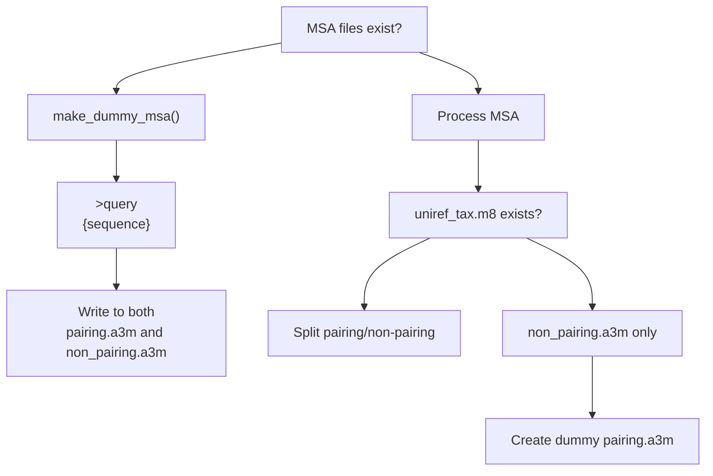

**Sources:** [protenix/web_service/colab_request_parser.py L413-L428](https://github.com/bytedance/Protenix/blob/c3bfc365/protenix/web_service/colab_request_parser.py#L413-L428)

 [protenix/web_service/colab_request_parser.py L454-L458](https://github.com/bytedance/Protenix/blob/c3bfc365/protenix/web_service/colab_request_parser.py#L454-L458)

---

## Template Search Integration

When `use_template=true` in the request, the system performs template search after MSA generation:

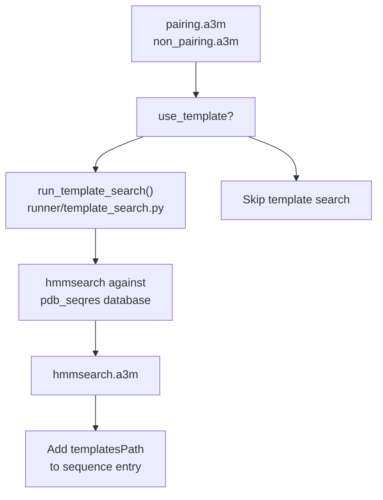

**Sources:** [protenix/web_service/colab_request_parser.py L224-L236](https://github.com/bytedance/Protenix/blob/c3bfc365/protenix/web_service/colab_request_parser.py#L224-L236)

---

## Input JSON Generation

The `get_data_json()` method orchestrates the complete workflow from request JSON to inference-ready input JSON:

### Data JSON Generation Workflow

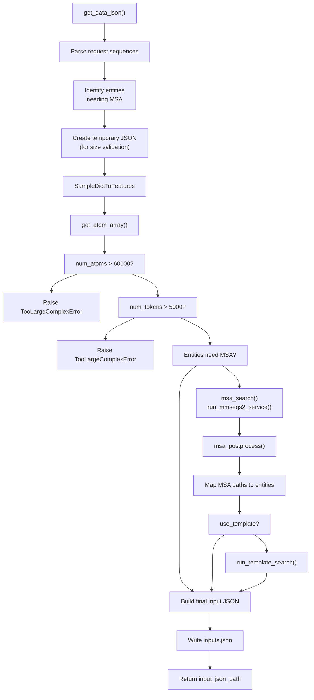

**Sources:** [protenix/web_service/colab_request_parser.py L137-L241](https://github.com/bytedance/Protenix/blob/c3bfc365/protenix/web_service/colab_request_parser.py#L137-L241)

### Size Validation

The system enforces limits to prevent out-of-memory errors:

```
MAX_ATOM_NUM = 60000MAX_TOKEN_NUM = 5000
```

If the complex exceeds these limits, a `TooLargeComplexError` is raised [protenix/web_service/colab_request_parser.py L179-L182](https://github.com/bytedance/Protenix/blob/c3bfc365/protenix/web_service/colab_request_parser.py#L179-L182)

**Sources:** [protenix/web_service/colab_request_parser.py L41-L83](https://github.com/bytedance/Protenix/blob/c3bfc365/protenix/web_service/colab_request_parser.py#L41-L83)

 [protenix/web_service/colab_request_parser.py L176-L182](https://github.com/bytedance/Protenix/blob/c3bfc365/protenix/web_service/colab_request_parser.py#L176-L182)

---

## Inference Launch

The `launch()` method constructs and executes the inference command:

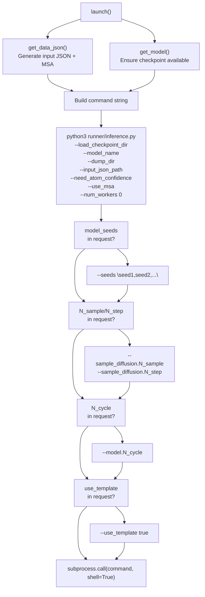

**Sources:** [protenix/web_service/colab_request_parser.py L463-L496](https://github.com/bytedance/Protenix/blob/c3bfc365/protenix/web_service/colab_request_parser.py#L463-L496)

---

## Visualizing Predictions

The `PredictionLoader` class facilitates loading and processing prediction results for visualization.

### Prediction Loading Workflow

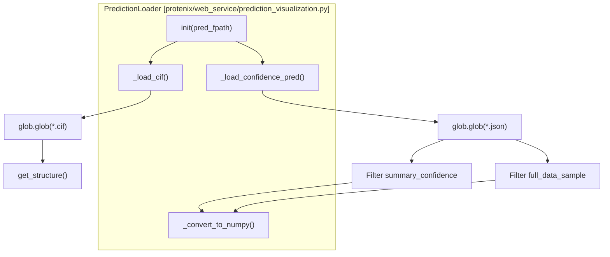

| Function | File Pointer | Purpose |
| --- | --- | --- |
| `_load_cif` | [protenix/web_service/prediction_visualization.py L56-L64](https://github.com/bytedance/Protenix/blob/c3bfc365/protenix/web_service/prediction_visualization.py#L56-L64) | Loads all `.cif` structure files from the prediction directory. |
| `_load_confidence_pred` | [protenix/web_service/prediction_visualization.py L66-L89](https://github.com/bytedance/Protenix/blob/c3bfc365/protenix/web_service/prediction_visualization.py#L66-L89) | Loads summary and full confidence metrics from JSON files. |
| `plot_contact_maps_from_pred` | [protenix/web_service/prediction_visualization.py L91-L125](https://github.com/bytedance/Protenix/blob/c3bfc365/protenix/web_service/prediction_visualization.py#L91-L125) | Generates adjacency matrices and plots contact maps for structures. |
| `plot_confidence_measures_from_pred` | [protenix/web_service/prediction_visualization.py L128-L212](https://github.com/bytedance/Protenix/blob/c3bfc365/protenix/web_service/prediction_visualization.py#L128-L212) | Plots pLDDT, PDE, and PAE metrics for quality assessment. |

**Sources:** [protenix/web_service/prediction_visualization.py L30-L212](https://github.com/bytedance/Protenix/blob/c3bfc365/protenix/web_service/prediction_visualization.py#L30-L212)

---

## Local ColabFold Integration

The system also provides scripts to run MSA searches using a local ColabFold installation instead of the web service.

### Local Search Flow

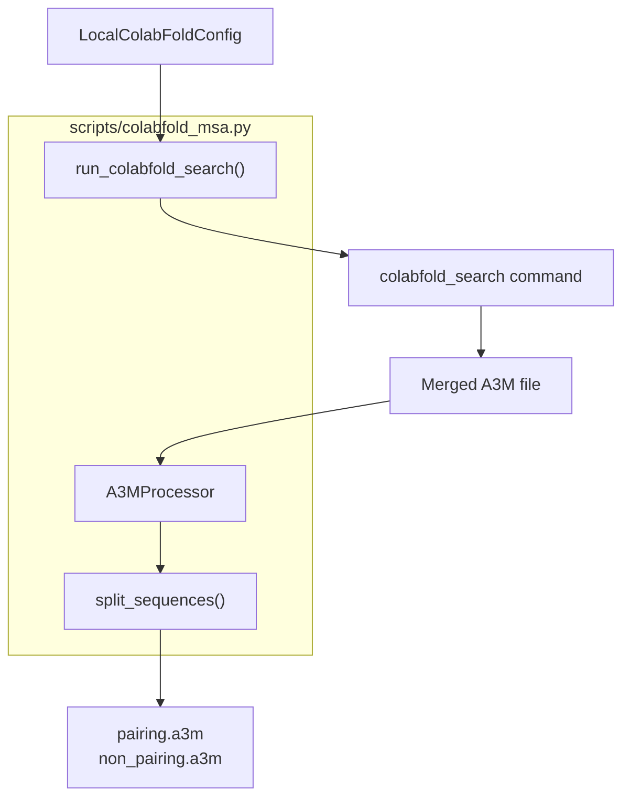

The `A3MProcessor` class handles splitting the merged A3M output from ColabFold into the pairing and non-pairing formats required by Protenix [scripts/colabfold_msa.py L104-L143](https://github.com/bytedance/Protenix/blob/c3bfc365/scripts/colabfold_msa.py#L104-L143)

**Sources:** [scripts/colabfold_msa.py L22-L190](https://github.com/bytedance/Protenix/blob/c3bfc365/scripts/colabfold_msa.py#L22-L190)

 [scripts/colabfold_msa.py L191-L209](https://github.com/bytedance/Protenix/blob/c3bfc365/scripts/colabfold_msa.py#L191-L209)

---

## Key Configuration Constants

### Environment Variables

| Variable | Default | Purpose |
| --- | --- | --- |
| `MMSEQS_SERVICE_HOST_URL` | `https://protenix-server.com/api/msa` | MMseqs2 service endpoint [protenix/web_service/colab_request_parser.py L38-L40](https://github.com/bytedance/Protenix/blob/c3bfc365/protenix/web_service/colab_request_parser.py#L38-L40) |
| `PROTENIX_ROOT_DIR` | `$HOME` | Root directory for data and checkpoints [protenix/web_service/colab_request_parser.py L44](https://github.com/bytedance/Protenix/blob/c3bfc365/protenix/web_service/colab_request_parser.py#L44-L44) |

### Path Constants

| Constant | Value | Purpose |
| --- | --- | --- |
| `DATA_CACHE_DIR` | `{PROTENIX_ROOT_DIR}/common/` | Location for reference data [protenix/web_service/colab_request_parser.py L46](https://github.com/bytedance/Protenix/blob/c3bfc365/protenix/web_service/colab_request_parser.py#L46-L46) |
| `CHECKPOINT_DIR` | `{PROTENIX_ROOT_DIR}/checkpoint/` | Location for model checkpoints [protenix/web_service/colab_request_parser.py L47](https://github.com/bytedance/Protenix/blob/c3bfc365/protenix/web_service/colab_request_parser.py#L47-L47) |

**Sources:** [protenix/web_service/colab_request_parser.py L38-L48](https://github.com/bytedance/Protenix/blob/c3bfc365/protenix/web_service/colab_request_parser.py#L38-L48)