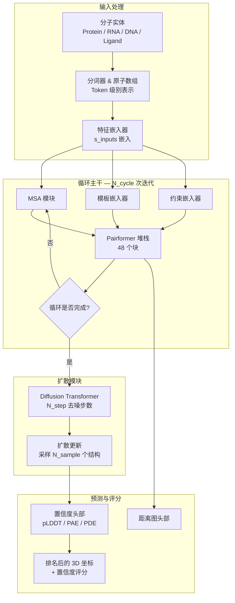

---
slug:1-overview
blog_type:normal
---


**Protenix** 是由字节跳动 AML AI4Science 团队开发的一款完全开源的 AlphaFold3 级别生物分子结构预测 PyTorch 实现。从蛋白质、核酸到小分子配体和离子，Protenix 接受基于序列或原子级别的输入描述，并生成包含逐原子置信度评分的完整三维结构模型。其最新版本 —— **Protenix-v2** (v2.0.0) —— 是首个在多种基准测试集中全面超越 AlphaFold3 的完全开源模型，且其在训练数据截止日期、模型规模和推理预算等方面均与 AlphaFold3 保持同等水平。


来源: [README.md](/README.md#L1-L21), [protenix/version.py](/protenix/version.py#L15-L15), [setup.py](/setup.py#L48-L77)

---

## Protenix 预测的内容

Protenix 并不局限于单链蛋白质折叠。**Protein + X** 中的“X”代表了其联合预测多链生物分子复合物结构的能力，对象涵盖蛋白质、RNA、DNA、小分子配体、离子以及共价修饰。这种广泛的预测范围正是 Protenix 区别于以往主要针对单链或蛋白质-蛋白质系统预测工具的关键所在。

| 生物分子类型 | 是否支持 | 输入格式 |
|:---|:---:|:---|
| 蛋白质链 | ✅ | 序列 (FASTA) 或残基级 Token |
| RNA 链 | ✅ | 序列 + 可选 RNA MSA |
| DNA 链 | ✅ | 序列 |
| 小分子配体 | ✅ | SMILES 字符串或 CCD 代码 |
| 离子 | ✅ | CCD 代码 |
| 聚糖 / 修饰 | ✅ | CCD 代码 |

分词器模块将每个分子实体转换为由 **token** 组成的序列 —— 蛋白质等按残基划分，配体则按原子划分 —— 这些 token 构成了模型架构中注意力机制的基础单元。这种基于 token 的表示方法使得模型能够统一处理异构的分子组合。

来源: [protenix/data/tokenizer.py](/protenix/data/tokenizer.py#L22-L60), [protenix/data/constants.py](/protenix/data/constants.py)

---

## 模型版本演进

Protenix 经历了三个主要版本的迭代，每一次更新都在功能和准确性上有所扩展。了解这些版本层级对于针对你的任务选择合适的模型至关重要。

| 模型名称 | 版本 | 核心特性 | 参数量 | 数据截止日期 | 发布日期 |
|:---|:---|:---|:---:|:---:|:---:|
| `protenix-v2` | v2.0.0 | 抗原-抗体性能提升，配体合理性优化，容量扩充 | 464 M | 2021-09-30 | 2026-04-08 |
| `protenix_base_default_v1.0.0` | v1.0.0 | 模板 + RNA MSA，全面超越 AlphaFold3 | 368 M | 2021-09-30 | 2026-02-05 |
| `protenix_base_20250630_v1.0.0` | v1.0.0 | 更新数据截止日期以满足实际应用 | 368 M | 2025-06-30 | 2026-02-05 |
| `protenix_base_default_v0.5.0` | v0.5.0 | 仅使用 MSA，向后兼容 | 368 M | 2021-09-30 | 2025-05-30 |
| `protenix_mini_default_v0.5.0` | v0.5.0 | 轻量级，降低推理成本 | 134 M | 2021-09-30 | 2025-07-17 |
| `protenix_tiny_default_v0.5.0` | v0.5.0 | 超轻量级，推理速度最快 | 110 M | 2021-09-30 | 2025-07-17 |

<CgxTip>对于大多数用户，推荐默认使用 `protenix_base_default_v1.0.0` 模型。其参数量与 AlphaFold3 持平，且在多项基准测试中表现更优。若针对抗原-抗体目标，`protenix-v2` 能提供额外的准确性提升。</CgxTip>

若需全面比较所有可用模型（包括添加约束条件及 ESM 变体的模型），请查阅 [模型选择与比较](3-model-selection-and-comparison)。

来源: [README.md](/README.md#L63-L75), [configs/configs_model_type.py](/configs/configs_model_type.py#L26-L49), [docs/supported_models.md](/docs/supported_models.md)

---

## 架构概览

Protenix 沿用了 AlphaFold3 范式：**循环主干** 通过 Pairformer 堆栈迭代优化单序列表示和成对表示，随后 **扩散模块** 通过迭代去噪生成 3D 坐标。最后，置信度头部模块会对预测结构进行评分。下图描绘了从原始分子输入到生成结构化预测排名的端到端数据流。



位于 `protenix/model/protenix.py` 的核心 `Protenix` 类统筹控制着整个流水线。在每次循环周期中，单序列表示 `s` 和成对表示 `z` 会传递给 Pairformer 堆栈，同时 MSA、模板和约束特征会被注入到成对通道中。在最终循环结束后，扩散模块会生成多个候选结构，随后这些结构会根据置信度头部输出的 pLDDT、PAE 和 PDE 评分进行排名。

来源: [protenix/model/protenix.py](/protenix/model/protenix.py#L91-L168), [protenix/model/protenix.py](/protenix/model/protenix.py#L197-L304)

---

## 核心系统组件

本代码库由四个协同工作的主要子系统构成。每个子系统都有明确的架构边界，并对应代码库中的一组特定模块簇。

| 子系统 | 根目录 | 职责 | 核心模块 |
|:---|:---|:---|:---|
| **模型架构** | `protenix/model/` | 神经网络定义、前向传播、扩散采样 | `protenix.py`, `modules/`, `generator.py`, `loss.py` |
| **数据处理** | `protenix/data/` | 输入解析、特征提取、分词、特征化 | `tokenizer.py`, `core/`, `msa/`, `template/`, `constraint/` |
| **训练与推理** | `runner/` | 执行循环、检查点保存、分布式协调 | `train.py`, `inference.py`, `batch_inference.py`, `ema.py` |
| **高性能算子** | `protenix/model/layer_norm/`, `triangular/`, `tri_attention/` | 用于注意力机制、LayerNorm、三角乘法的自定义 CUDA/Triton 算子 | `triangular/`, `layer_norm/`, `tfg/` |

以下树状图展示了项目的顶层目录结构，并标注了各个组件的作用：

```
Protenix/
├── protenix/                # 核心库
│   ├── model/               # 神经网络架构
│   │   ├── protenix.py      # 顶层模型类 (算法 1)
│   │   ├── modules/         # Pairformer, 扩散模块, 置信度模块, 嵌入器
│   │   ├── generator.py     # 扩散采样 (训练与推理)
│   │   ├── loss.py          # 多项损失函数
│   │   ├── layer_norm/      # 自定义 CUDA LayerNorm 算子
│   │   ├── triangular/      # 优化的三角乘法操作
│   │   └── tri_attention/   # 自定义三角注意力算子
│   ├── data/                # 数据流水线与特征化
│   │   ├── tokenizer.py     # Token / TokenArray 定义
│   │   ├── core/            # CCD 解析、几何计算、特征化
│   │   ├── msa/             # MSA 特征提取
│   │   ├── template/        # 模板搜索与嵌入
│   │   ├── constraint/      # 约束特征处理
│   │   ├── esm/             # ESM2 蛋白质语言模型集成
│   │   └── inference/       # 推理阶段的 JSON 输入解析
│   ├── tfg/                 # 免训练引导引擎
│   ├── metrics/             # lDDT, RMSD, 冲突评估
│   ├── utils/               # 几何运算、分布式、调度器、I/O 工具
│   └── web_service/         # Web 服务器与可视化工具
├── runner/                  # 执行入口点
│   ├── train.py             # AF3Trainer — 分布式训练循环
│   ├── inference.py         # InferenceRunner — 预测流水线
│   └── batch_inference.py   # 命令行入口 (protenix pred / prep)
├── configs/                 # 声明式配置系统
│   ├── configs_base.py      # 训练/评估基础配置
│   ├── configs_model_type.py# 按模型设定的架构覆盖配置
│   ├── configs_data.py      # 数据流水线配置
│   └── configs_inference.py # 推理专用配置
├── examples/                # 示例输入 (JSON, FASTA, CIF)
├── scripts/                 # MSA 流水线、数据准备、实用工具
├── tests/                   # 核心组件单元测试
└── docs/                    # 技术报告与指南
```

来源: [protenix/model/protenix.py](/protenix/model/protenix.py#L91-L138), [protenix/data/tokenizer.py](/protenix/data/tokenizer.py#L22-L60), [runner/train.py](/runner/train.py#L54-L70), [runner/inference.py](/runner/inference.py#L64-L80), [configs/configs_base.py](/configs/configs_base.py#L23-L96), [protenix/tfg/engine.py](/protenix/tfg/engine.py#L15-L40)

---

## 技术栈

Protenix 基于专为大规模生物分子计算优化的现代深度学习技术栈构建。其核心依赖项也反映了该系统对科学计算和高效 GPU 加速的双重要求。

| 类别 | 依赖项 | 用途 |
|:---|:---|:---|
| **深度学习** | PyTorch 2.7, DeepSpeed 0.17, Triton 3.3 | 模型训练、分布式计算、自定义算子 |
| **分子科学** | biotite 1.4, BioPython 1.85, RDKit 2025, gemmi 0.6 | 结构解析、CIF/PDB 处理、化学信息学 |
| **GPU 加速** | cuequivariance-ops-torch-cu12 0.8, Triton | 高效等变操作、融合注意力算子 |
| **蛋白质语言模型** | fair-esm 2.0 | 用于无 MSA 推理的 ESM2 嵌入 |
| **实验追踪** | Weights & Biases (wandb) | 训练指标记录与可视化 |
| **配置管理** | ml_collections 1.1, PyYAML 6.0 | 声明式配置管理 |

本项目要求 Python ≥ 3.11，并需要兼容 CUDA 12.x 的硬件环境。可通过 PyPI 简化安装流程：

```bash
pip install --upgrade protenix --index-url https://pypi.org/simple
```

对于基于 Docker 的部署，代码库中提供了预配置环境的 `Dockerfile`，其中包含了所有系统级依赖（如 kalign、hmmer 等）。

来源: [requirements.txt](/requirements.txt#L1-L33), [setup.py](/setup.py#L48-L77), [Dockerfile](/Dockerfile), [docs/docker_installation.md](/docs/docker_installation.md)

---

## 生态系统

Protenix 已超越了独立的结构预测工具，在其基础模型之上发展出了一个由专用工具组成的生态系统：

| 项目 | 关注点 | 核心能力 |
|:---|:---|:---|
| **[PXDesign](https://protenix.github.io/pxdesign/)** | 从头设计结合蛋白 | 实验成功率达 20–73%，比之前的 SOTA 高出 2–6 倍 |
| **[PXMeter](https://github.com/bytedance/PXMeter/)** | 可复现的评估 | 带有手工精选数据集的基准测试工具包 |
| **[Protenix-Dock](https://github.com/bytedance/Protenix-Dock)** | 蛋白质-配体对接 | 带有经验评分函数的经典对接框架 |

本项目采用 **Apache 2.0 License** 开源协议，可供学术研究和商业用途免费使用。目前，开发者社区在 Slack、Twitter/X、微信和 GitHub Issues 等平台上保持着高度活跃。

来源: [README.md](/README.md#L23-L29), [README.md](/README.md#L214-L216), [LICENSE](/LICENSE)

---

## 接下来阅读什么

根据你的具体目标，以下是推荐的你阅读文档的进阶路线：

| 你的目标 | 推荐阅读的下一页 | 原因 |
|:---|:---|:---|
| **运行你的第一次预测** | [快速开始](2-quick-start) | 提供详细的安装与推理步骤指南 |
| **选择合适的模型** | [模型选择与比较](3-model-selection-and-comparison) | 详细的模型能力与参数比较 |
| **了解输入格式** | [输入 JSON 格式](4-input-json-format) | 指导你如何组织分子输入数据 |
| **深入理解架构** | [架构概览](8-architecture-overview) | 全面的系统设计原理解析 |
| **探索特定模块** | 从 [Pairformer 堆栈](9-pairformer-stack) 到 [Protenix 生态系统](28-protenix-ecosystem) | 更细致的组件级技术文档 |

如果你是首次接触本项目，建议从 **[快速开始](2-quick-start)** 着手，在你的设备上运行起 Protenix，然后深入探索 **深度解析** 章节，以理解支撑这些预测结果背后的底层架构。