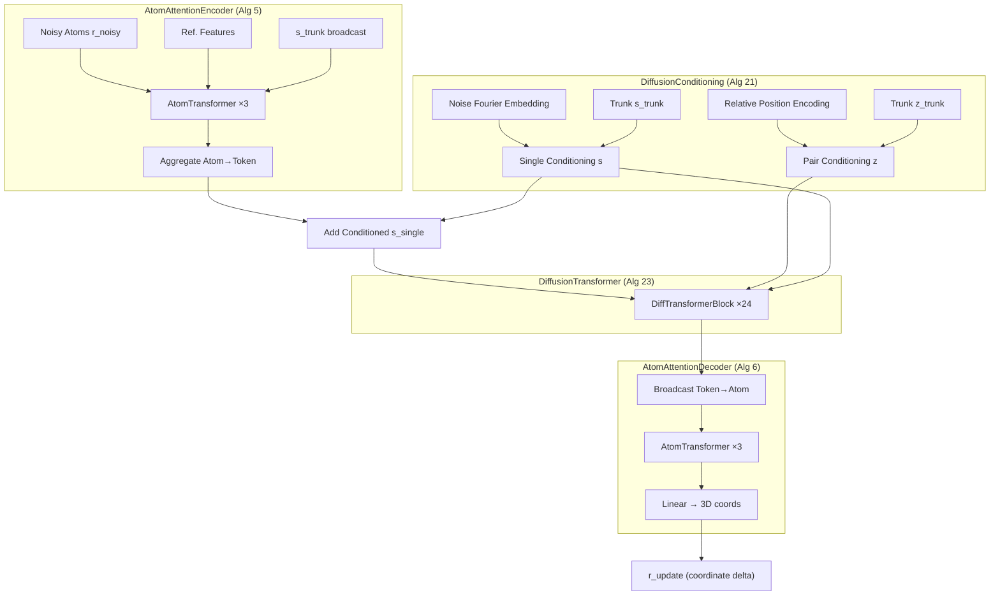
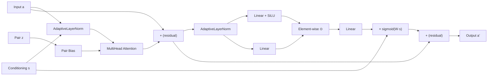

---
slug:10-diffusion-module
blog_type:normal
---


Diffusion 模块是 Protenix 的生成核心，负责将随机初始化的原子坐标逐步去噪，转化为物理上合理的 3D 结构。该模块实现了 **等距边缘 (EDM)** 框架，采用跨原子级（atom-level）和 token 级（token-level）表征的多尺度架构。与从序列、MSA 和模板输入中提取特征的 Pairformer Stack 不同，Diffusion 模块将这些特征作为条件信号，并学习在不同噪声级别下预测坐标更新。本页将深入剖析该模块的架构、EDM 缩放数学原理、条件处理流水线，以及构成其去噪网络的内部 Transformer 子组件。

来源：[diffusion.py](/protenix/model/modules/diffusion.py#L231-L323), [transformer.py](/protenix/model/modules/transformer.py#L356-L405)

---

## EDM 数学基础

Diffusion 模块实例化了 EDM（Elucidating the Design Space of Diffusion-Based Generative Models，阐明基于扩散的生成模型设计空间）框架，在该框架中，去噪网络经过训练，能够跨越连续的噪声范围，从含噪输入中预测出干净的坐标。其核心思想在于，输入坐标和输出预测均由依赖于噪声的因子进行缩放，以在整个训练过程中保持近似单位方差，从而在宽动态范围的 σ 值内稳定优化过程。

`forward` 方法分两个阶段实现了完整的 EDM 去噪方程。首先，含噪坐标通过 `c_in = 1 / sqrt(σ_data² + σ²)` 进行**输入缩放**，生成具有单位方差的无量纲向量。随后，网络 `F_θ` 结合条件嵌入对这些缩放后的坐标进行处理。其次，网络输出通过 EDM 输出公式与含噪输入相结合：`D = c_skip · x_noisy + c_out · F_θ(c_in · x, c_noise)`，其中 `c_skip = 1/(1 + s_ratio²)`，`c_out = σ / sqrt(1 + s_ratio²)`，且 `s_ratio = σ / σ_data`。在低噪声水平（σ → 0）下，`c_skip → 1` 且 `c_out → 0`，这意味着网络输出主导了预测结果；而在高噪声水平下，情况则相反，预测依赖于学习到的信号。

```python
# 输入缩放 (EDM 公式 7)
r_noisy = x_noisy / torch.sqrt(self.sigma_data**2 + t_hat_noise_level**2)[..., None, None]

# 网络前向传播
r_update = self.f_forward(r_noisy=r_noisy, t_hat_noise_level=t_hat_noise_level, ...)

# 输出重缩放 (EDM 公式 7)
s_ratio = (t_hat_noise_level / self.sigma_data)[..., None, None]
x_denoised = 1 / (1 + s_ratio**2) * x_noisy + t_hat_noise_level[..., None, None] / torch.sqrt(1 + s_ratio**2) * r_update
```

默认值 `sigma_data = 16.0` 定义了特征数据规模，这使得 Protenix 有别于原始 EDM 公式中 `sigma_data = 1.0` 的设定。该值是针对蛋白质结构预测中所使用的坐标空间进行专门调优的。

来源：[diffusion.py](/protenix/model/modules/diffusion.py#L508-L598), [generator.py](/protenix/model/generator.py#L36-L61)

---

## 噪声调度配置

`DiffusionSchedule` 类控制着训练期间如何采样噪声水平（σ），以及推理期间如何调度噪声水平。在训练期间，噪声水平从**对数正态分布**中抽取：`σ = σ_data · exp(p_mean + p_std · N(0,1))`，默认值为 `p_mean = -1.2` 和 `p_std = 1.5`。该分布使采样偏向于较低的噪声水平（模型在此阶段微调结构细节），同时依然覆盖高噪声区间以生成粗略结构。

在推理期间，使用介于 `s_max = 160.0` 和 `s_min = 4e-4` 之间并由指数 `p = 7.0` 控制的幂律插值法，计算出确定性的调度：

```
σ(t) = σ_data · (s_max^(1/p) + t · (s_min^(1/p) - s_max^(1/p)))^p
```

其中 `t` 从 0 到 1，步长为 `dt = 1/200`，从而产生 201 个离散噪声水平。这种调度确保了在高噪声（结构初始化）和低噪声（细节微调）两个极端下均具备精细的粒度。

| 参数 | 默认值 | 作用 |
|-----------|---------|------|
| `sigma_data` | 16.0 | 数据标准差；缩放所有噪声水平 |
| `s_max` | 160.0 | t=0 时的最大噪声水平 |
| `s_min` | 4e-4 | t=1 时的最小噪声水平 |
| `p` | 7.0 | 控制调度曲率的幂律指数 |
| `p_mean` | -1.2 | 训练对数正态噪声分布的均值 |
| `p_std` | 1.5 | 训练对数正态噪声分布的标准差 |

来源：[diffusion.py](/protenix/model/modules/diffusion.py#L180-L228), [generator.py](/protenix/model/generator.py#L64-L120)

---

## 架构概述

Diffusion 模块遵循**瓶颈架构**，包含三个处理阶段：一个将细粒度的原子表征提升至 token 级别的原子到 token 编码器；一个执行全局推理的 token 级 Diffusion Transformer；以及一个将精炼后的 token 激活投影回原子坐标更新的 token 到原子解码器。这种设计使得开销庞大的全自注意力机制能够在压缩后的 token 表征上运行，同时通过编码器和解码器中的局部注意力来保持原子级的精度。



<CgxTip>特征对条件嵌入 `z` **在每个样本集仅计算一次**，并通过 `prepare_cache` 机制进行缓存，因为它独立于噪声水平 σ。这避免了在同时处理多个含噪样本（N_sample）时的冗余计算——单条件 `s` 是每个样本中唯一变化的组件。</CgxTip>

来源：[diffusion.py](/protenix/model/modules/diffusion.py#L325-L506), [transformer.py](/protenix/model/modules/transformer.py#L597-L949)

---

## DiffusionConditioning (算法 21)

`DiffusionConditioning` 模块生成引导去噪网络的特征单条件 (s) 和特征对条件 (z) 嵌入。它将来自 Pairformer 的主干表征与噪声水平信息和相对位置编码相融合，创建出能够同时适应结构上下文和当前扩散时间步的条件信号。

### 对条件流水线

对条件拼接了主干对特征 `z_trunk` 与 `RelativePositionEncoding`（相对位置编码）特征，生成一个 `[N_token, N_token, 2*c_z]` 的张量。此拼接表征依次通过一个 LayerNorm（无可学习偏移量）和一个映射至 `c_z = 128` 的无偏置线性投影，随后经过两个扩展因子 `n=2` 的连续 `Transition` 块。最终得到的对条件 `z` 为扩散 Transformer 提供了结构关系的先验知识。

### 单条件流水线

单条件融合了三个信号源：主干单特征 `s_trunk`、输入嵌入 `s_inputs`（来自 InputFeatureEmbedder，维度 `c_s_inputs = 449`）以及 **Fourier 噪声嵌入**。`s_trunk` 和 `s_inputs` 被拼接为 `[N_token, c_s + c_s_inputs]`，投影到 `c_s = 384`，然后由噪声嵌入进行调制。至关重要的是，噪声水平在通过 Fourier 嵌入之前，首先由 `log(σ/σ_data)/4` 进行转换，生成一个 `[N_sample, 256]` 的表征，该表征被投影到 `c_s` 并广播相加到每个 token 位置。最后由两个 `Transition` 块对最终的单条件进行微调优化。

```python
# 噪声到嵌入的流水线 (算法 22)
noise_n = self.fourier_embedding(
    t_hat_noise_level=torch.log(t_hat_noise_level / self.sigma_data) / 4
)  # [..., N_sample, 256]
noise_n = self.linear_no_bias_n(self.layernorm_n(noise_n))  # [..., N_sample, c_s]
single_s = single_s.unsqueeze(-3) + noise_n.unsqueeze(-2)  # [..., N_sample, N_token, c_s]
```

### FourierEmbedding (算法 22)

噪声水平通过随机 Fourier 特征进行嵌入，该特征使用由确定性随机种子（默认 `42`）初始化的固定、不可训练参数。该嵌入计算 `cos(2π · (σ_normalized · w + b))`，其中 `w` 和 `b` 是维度为 `c = 256` 的随机抽取向量。这提供了一个平滑的、单射的映射，将标量噪声水平映射到适合用于条件设定的高维空间中。

来源：[diffusion.py](/protenix/model/modules/diffusion.py#L31-L177), [embedders.py](/protenix/model/modules/embedders.py#L124-L248)

---

## DiffusionTransformer (算法 23)

`DiffusionTransformer` 是 Diffusion 模块内的主要推理引擎，在 token 级别上运行，由 24 个堆叠的 `DiffusionTransformerBlock` 实例（默认）组成。它接收维度为 `c_a = 768` 的单激活 `a`、维度为 `c_s = 384` 的条件单嵌入 `s`，以及维度为 `c_z = 128` 的对嵌入 `z`。

### DiffusionTransformerBlock (算法 23，第 2–3 行)

每个块由两个带有残差连接的子模块组成：

1. **AttentionPairBias** — 一个通过 AdaptiveLayerNorm 接收 `s` 条件的多头自注意力层，其对偏置由 `z` 计算得出。该注意力机制支持 `enable_efficient_fusion` 模式，该模式将对偏置计算的 LayerNorm 和线性投影融合为一个单一的 `conv2d` 操作，从而减少了内核启动开销。

2. **ConditionedTransitionBlock** — 一个使用 SiLU 门控激活和自适应层归一化的前馈网络。它计算 `sigmoid(W_s·s) · W_b(SiLU(W_a1·adaln(a)) ⊙ W_a2·adaln(a))`，其中 `sigmoid` 门控提供了 adaLN-Zero 初始化（输出从接近零的状态开始）。



### AttentionPairBias (算法 24)

对偏置注意力机制是结构关系调节去噪过程的核心。对于每个注意力头，都从对嵌入中计算出一个标量偏置：`bias = Linear(LayerNorm(z))`，生成一个形状为 `[N_token, N_token, n_heads]` 的逐头偏置矩阵。在 softmax 之前，该偏置会被加入到标准的缩放点积注意力 logits 中。遵循 adaLN-Zero 范式，注意力输出由 `sigmoid(Linear(s))` 进行门控，以确保各模块在初始化时贡献接近于零的残差更新，从而保障训练的稳定性。

该模块具有**双重注意力模式**：用于 token 级别处理的标准全局多头注意力，以及带有滑动窗口（`n_queries=32`, `n_keys=128`）的局部交叉注意力，专门用于 AtomTransformer 内部的原子级别处理。标准路径还支持 `enable_efficient_fusion` 优化，该优化将 `LinearNoBias(LayerNorm(z))` 计算合并为单次融合的卷积操作。

来源：[transformer.py](/protenix/model/modules/transformer.py#L40-L254), [transformer.py](/protenix/model/modules/transformer.py#L257-L353), [transformer.py](/protenix/model/modules/transformer.py#L550-L594)

---

## AtomAttentionEncoder (算法 5)

`AtomAttentionEncoder` 桥接了原子级和 token 级表征。当 `has_coords=True`（如在 Diffusion 模块中所使用的那样）时，它接收含噪原子坐标 `r_l`，并将其与参考特征（位置、电荷、元素、原子名字符）一起投影到原子嵌入空间。原子单表征 `q_l` 由参考特征 `c_l` 初始化，并加上含噪位置分量：`q_l = c_l + Linear(r_l)`。

该编码器以交叉注意力模式运行 **AtomTransformer**——这是 `DiffusionTransformer` 的一种变体，其查询和键/值通过独立的 AdaptiveLayerNorm 投影进行处理。这个包含 3 个块、4 个头的 Transformer 在局部注意力窗口上运行，以高效捕获原子级的几何关系。处理完成后，通过使用 `atom_to_token_idx` 进行均值池化，将每个原子的表征聚合到 token 级别，生成输入到主 DiffusionTransformer 的 token 激活 `a`。

一项关键的优化是 `prepare_cache` 方法，它预计算了原子对特征 `p_lm`（包含参考距离、有效掩码和广播的主干对嵌入），这些特征在编码器和解码器阶段都被重复使用，避免了冗余计算。

来源：[transformer.py](/protenix/model/modules/transformer.py#L597-L949)

---

## AtomAttentionDecoder (算法 6)

`AtomAttentionDecoder` 与编码器相对应：它将精炼后的 token 级激活广播回原子级别，添加来自编码器的跳跃连接（q_skip, c_skip, p_skip），并运行另一个包含 3 个块的 AtomTransformer。最终每个原子的表征经过 LayerNorm 和无偏置的线性投影，生成形状为 `[N_atom, 3]` 的 3 维坐标更新 `r_update`。

```python
# Token → 原子广播 + 跳跃连接
q = broadcast_token_to_atom(Linear(a)) + q_skip  # [N_atom, c_atom]

# 局部原子注意力
q = self.atom_transformer(q, c_skip, p_skip)

# 映射至 3D 坐标更新
r = self.linear_no_bias_out(self.layernorm_q(q))  # [N_atom, 3]
```

来源：[transformer.py](/protenix/model/modules/transformer.py#L952-L1046)

---

## 维度汇总与模块配置

| 组件 | 输入维度 | 隐藏层维度 | 输出维度 | 层数 | 头数 |
|-----------|-----------|------------|------------|--------|-------|
| DiffusionConditioning (单条件) | c_s_inputs=449 | c_s=384 | c_s=384 | 2×Transition | — |
| DiffusionConditioning (对条件) | 2×c_z=256 | c_z=128 | c_z=128 | 2×Transition | — |
| AtomAttentionEncoder | c_atom=128 | c_atom=128 | c_token=768 | 3 | 4 |
| DiffusionTransformer | c_a=768 | c_s=384, c_z=128 | c_a=768 | 24 | 16 |
| AtomAttentionDecoder | c_token=768 | c_atom=128 | 3 (xyz) | 3 | 4 |
| FourierEmbedding | 标量 σ | — | 256 | — | — |

来源：[diffusion.py](/protenix/model/modules/diffusion.py#L254-L323)

---

## 内存管理与梯度检查点

Diffusion 模块是 Protenix 中内存消耗最密集的组件，尤其是在处理大量 token 或多个样本时。本模块实现了三个级别的内存优化：

1. **原地操作** (`inplace_safe`)：启用时，张量加法使用原地操作符 (`+=`) 而非创建新张量，从而将残差连接的峰值内存消耗减半。

2. **梯度检查点** (`blocks_per_ckpt`)：将 Transformer 块分组为带有检查点的块，在反向传播期间重新计算激活值。`checkpoint_blocks` 实用程序封装了连续的块序列，以时间（计算量）换取空间（内存）。

3. **细粒度检查点** (`use_fine_grained_checkpoint`)：专为 768 个 token 的第二阶段微调设计，此模式额外对 `f_forward` 内部的 `AtomAttentionEncoder` 和 `AtomAttentionDecoder` 调用应用检查点，使得原本会导致 OOM（内存溢出）的长序列训练成为可能。

当设置了 `blocks_per_ckpt` 时，条件计算本身也会应用检查点，因为 `DiffusionConditioning` 模块在处理 768 个 token 时会消耗 7–8 GB 的内存。

<CgxTip>`pair_z` 缓存机制（`prepare_cache`）允许对条件计算一次，并在具有不同噪声水平的多次前向传播中重复使用。当 `pair_z` 作为预计算张量传入时，条件设定的前向传播将完全跳过开销庞大的对条件流水线——这对于推理期间的迭代采样循环是一项至关重要的优化。</CgxTip>

来源：[diffusion.py](/protenix/model/modules/diffusion.py#L325-L506)

---

## 无训练引导集成

在推理采样期间，Diffusion 模块通过传递给 `sample_diffusion` 的 `guidance_configs` 参数与无训练引导（TFG）引擎集成。启用后，TFG 引擎会应用外部势能梯度，引导去噪轨迹满足结构约束（例如，口袋接触、距离限制），而无需修改模型权重。引导势能在每个去噪步骤内应用，在通过 EDM 重缩放公式组合坐标更新之前对其进行调制。

采样循环（AF3 中的算法 18）遍历从 `σ_max` 到 `σ_min` 的噪声调度，在每个步骤中应用去噪网络，并整合由参数 `gamma0`、`noise_scale_lambda` 和 `step_scale_eta` 控制的随机噪声注入。通过扩展批次维度，可以并行生成多个样本（`N_sample`）。

来源：[generator.py](/protenix/model/generator.py#L123-L200)

---

## 后续步骤

- **[Diffusion 采样与生成器](19-diffusion-sampling-and-generator)** — 深入探讨完整的 `sample_diffusion` 循环、随机噪声注入参数以及 TFG 集成。
- **[Pairformer Stack](9-pairformer-stack)** — 详细解析 Diffusion 模块所消耗的 `s_trunk` 和 `z_trunk` 嵌入是如何生成的。
- **[输入特征嵌入器](12-input-feature-embedder)** — 详细介绍作为附加条件设定的 `s_inputs` 表征。
- **[自定义 Triton 注意力内核](21-custom-triton-attention-kernel)** — 涵盖 DiffusionTransformer 块内部使用的优化注意力实现。
- **[无训练引导引擎](24-training-free-guidance-engine)** — 深入剖析增强扩散采样过程的势函数和引导机制。