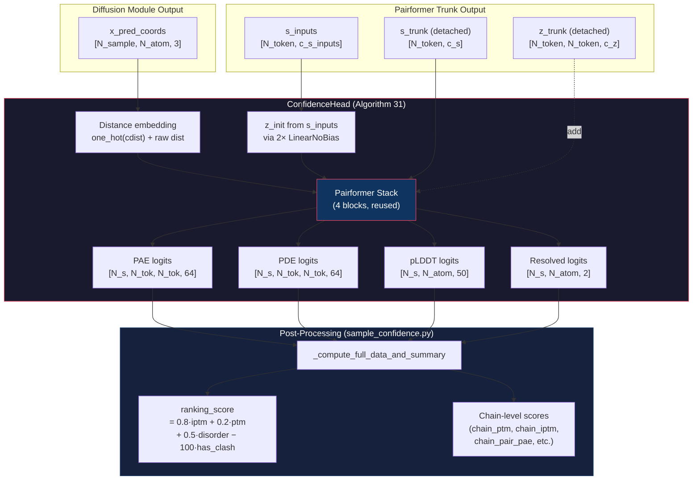
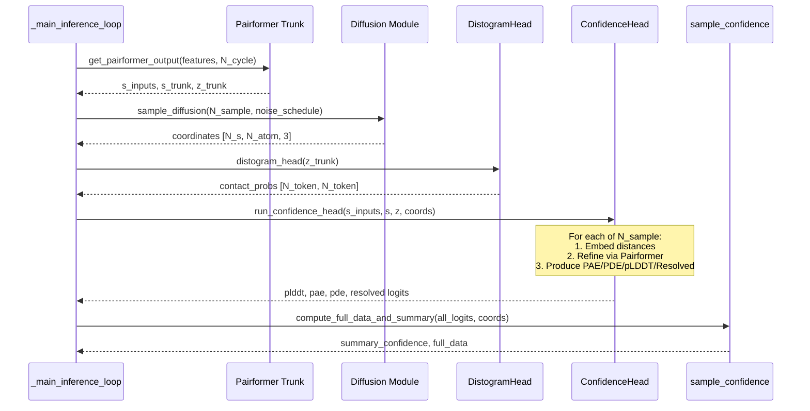

---
slug:11-confidence-head
blog_type:normal
---


Confidence Head 是 Protenix 的质量评估子系统，负责将模型的 Trunk 表征和采样的 3D 坐标转换为全面的置信度信号集合，涵盖原子级（per-atom）、Token 对级（per-token-pair）和链级（per-chain）。它实现了 AlphaFold 3 规范中的 Algorithm 31，生成四个预测头 —— **pLDDT**、**PAE**、**PDE** 和 **Resolved** —— 这些输出随后会被后处理为排名分数（pTM、ipTM、gPDE）、空间冲突检测标志以及链级分解指标。该置信度处理流程在 Diffusion 采样之后运行，是在多个采样构象中挑选和排列结构预测结果的主要仲裁者。

来源：[confidence.py](protenix/model/modules/confidence.py#L26-L349), [sample_confidence.py](protenix/model/sample_confidence.py#L46-L231), [protenix.py](protenix/model/protenix.py#L588-L654)

## 架构概述

Confidence Head 子系统跨越了两层抽象。**神经网络层**（`ConfidenceHead` 模块）接收断开梯度连接的 Trunk 嵌入和预测坐标，生成离散化区间上的原始 Logits。**后处理层**（`sample_confidence` 模块）将这些 Logits 转换为标量分数和多维度的链分解结果，为提升推理效率，这一切均在 `torch.no_grad()` 上下文中执行。



`ConfidenceHead` 实例化了自己专属的 `PairformerStack`，其深度可配置（默认 `n_blocks=4`）。它复用了与 Trunk 相同的 Pairformer 架构，但采用独立初始化的权重，并将输出投影层进行了零初始化。这种设计确保了可以通过 `train_confidence_only` 标志独立微调置信度预测，此时会冻结 Trunk 网络而仅保留 Confidence Head 可训练。

来源：[confidence.py](protenix/model/modules/confidence.py#L99-L131), [protenix.py](protenix/model/protenix.py#L107-L138)

## ConfidenceHead 模块：神经网络架构

### 构造与参数

`ConfidenceHead` 类在初始化时，其维度与 Trunk 的输出通道对齐。默认配置使用 `c_s=384`（单体嵌入）、`c_z=128`（对偶嵌入）和 `c_s_inputs=449`（输入特征嵌入维度）。核心可学习参数包括：

| 组件 | 形状 | 用途 |
|-----------|-------|---------|
| `linear_no_bias_s1` | `[c_s_inputs, c_z]` | 投影 s_inputs → 对偶初始化（外和分量 1） |
| `linear_no_bias_s2` | `[c_s_inputs, c_z]` | 投影 s_inputs → 对偶初始化（外和分量 2） |
| `linear_no_bias_d` | `[num_bins, c_z]` | 嵌入独热距离区间 → 对偶通道 |
| `linear_no_bias_d_wo_onehot` | `[1, c_z]` | 嵌入原始距离 → 对偶通道 |
| `pairformer_stack` | (4 个模块) | 优化对偶/单体表征 |
| `linear_no_bias_pae` | `[c_z, 64]` | PAE 输出头 |
| `linear_no_bias_pde` | `[c_z, 64]` | PDE 输出头 |
| `plddt_weight` | `[20, c_s, 50]` | 基于原子位置的 pLDDT 权重张量 |
| `resolved_weight` | `[20, c_s, 2]` | 基于原子位置的 Resolved 权重张量 |

<CgxTip>四个输出投影层（`linear_no_bias_pae`、`linear_no_bias_pde`、`plddt_weight`、`resolved_weight`）在 `__init__` 中被显式零初始化。这确保了 ConfidenceHead 在训练初期产生均匀/中立的预测，从而在基于预训练的 Trunk 进行微调时，提供稳定的优化轨迹。</CgxTip>

距离区间作为不可训练的 `nn.Parameter` 张量（设置 `requires_grad=False`）被预先计算，其范围从 `distance_bin_start=3.25` Å 到 `distance_bin_end=52.0` Å，步长为 `distance_bin_step=1.25` Å，共计划分出 39 个区间。最后一个区间的上限被设置为 `1e6`，以便涵盖任意极大的距离。

来源：[confidence.py](protenix/model/modules/confidence.py#L49-L131)

### 前向传播：逐样本处理

`forward` 方法统筹了从 Trunk 输出到预测 Logits 的完整数据流。其中一个关键的架构设计是：当启用 `stop_gradient=True`（默认值）时，会对 Trunk 的表征执行**梯度截断**（gradient detachment），从而切断与 Pairformer Trunk 之间的反向传播计算图。这对于纯置信度微调阶段至关重要。

对偶表征的初始化遵循外和模式，结合了对 `s_inputs` 的两个独立投影：

```python
z_init = (
    self.linear_no_bias_s1(s_inputs)[..., None, :, :]
    + self.linear_no_bias_s2(s_inputs)[..., None, :]
)  # [..., 1, N_token, N_token, c_z]
z_trunk = z_init + z_trunk  # broadcast over N_sample dim
```

对于每个 Diffusion 样本，该方法会委派给 `memory_efficient_forward` 进行处理。该函数每次只处理一个样本，以避免触发 CUDA OOM（内存溢出）。代码第 212-237 行的循环会迭代执行 `N_sample` 次；对于 Token 数量超过 2000 的庞大系统，PAE 和 PDE 预测会按样本卸载到 CPU 上执行，以此来管理 GPU 显存。

来源：[confidence.py](protenix/model/modules/confidence.py#L133-L256)

### 内存高效前向传播：核心计算

`memory_efficient_forward` 方法通过四个阶段执行逐样本的置信度计算：

**阶段 1 — 距离嵌入。** 利用 `torch.cdist` 在纯 float32 精度下（显式关闭 autocast）计算代表性原子之间的成对距离，随后通过独热区间表征和原始标量投影将其嵌入到对偶通道中：

```python
distance_pred = torch.cdist(x_pred_rep_coords, x_pred_rep_coords)
z_pair += self.linear_no_bias_d(one_hot(distance_pred, lower_bins, upper_bins))
z_pair += self.linear_no_bias_d_wo_onehot(distance_pred.unsqueeze(dim=-1))
```

**阶段 2 — Pairformer 优化。** 初始化的对偶表征 `z_pair` 和经过限幅处理的单体表征 `s_trunk`，会通过 ConfidenceHead 自身的 PairformerStack 进行特征细化。该过程应用了三角乘法更新（triangular multiplicative updates）和注意力机制操作，其结构与 Trunk 的 Pairformer 完全一致。

**阶段 3 — PAE 和 PDE 预测。** 在向上转型为 float32 精度后，经过细化的对偶表征会生成对称和非对称的预测结果：

| 预测头 | 公式 | 形状 |
|------|---------|-------|
| PAE | `linear_no_bias_pae(LayerNorm(z_pair))` | `[N_token, N_token, 64]` |
| PDE | `linear_no_bias_pde(LayerNorm(z_pair + z_pair.T))` | `[N_token, N_token, 64]` |

请注意，PDE 是基于**对称化**的对偶表征（`z_pair + z_pair.transpose(-2, -3)`）计算得出的，而 PAE 使用的是原始的非对称表征。这反映了 PAE 固有的方向性特征（当 Token $i$ 对齐到 Token $j$ 时产生的误差，与反向对齐时不同），而 PDE 捕捉的距离误差则是天然对称的。

**阶段 4 — pLDDT 和 Resolved 预测。** 经过细化的单体表征通过 `broadcast_token_to_atom` 函数从 Token 级别广播至原子级别，然后利用爱因斯坦求和约定，通过基于原子索引的权重张量进行投影：

```python
a = broadcast_token_to_atom(x_token=s_single, atom_to_token_idx=atom_to_token_idx)
plddt_pred = torch.einsum("...nc,ncb->...nb", self.plddt_ln(a), self.plddt_weight[atom_to_tokatom_idx])
resolved_pred = torch.einsum("...nc,ncb->...nb", self.resolved_ln(a), self.resolved_weight[atom_to_tokatom_idx])
```

索引 `atom_to_tokatom_idx` 将每个原子映射至其所属父 Token 内的位置索引（0–19），使得按 `max_atoms_per_token` 索引的权重张量能够实施特定位置的变换。

来源：[confidence.py](protenix/model/modules/confidence.py#L258-L349)

## 预测输出：四大置信度信号

### 输出摘要

| 预测指标 | 粒度 | 区间数 | 对称性 | 物理释义 |
|------------|-------------|------|-----------|----------------|
| **pLDDT** | 原子级 | 50 | 不适用 | 局部结构置信度 (0–100) |
| **PAE** | Token 对级 | 64 | 否 (具有方向性) | 当 Token $j$ 的参考系对齐到 Token $i$ 时的预期位置误差 (Å) |
| **PDE** | Token 对级 | 64 | 是 | 预测距离误差 (Å) |
| **Resolved** | 原子级 | 2 | 不适用 | 该原子坐标可通过实验解析的概率 |

### Logits 到分数的转换

四个预测头均输出基于离散区间的 Logits。`logits_to_score` 函数通过计算 Softmax 概率分布下的期望值，将这些 Logits 转换为标量预测结果：

$$\text{score} = \sum_{b=1}^{B} \text{softmax}(\text{logits})_b \cdot \text{bin\_center}_b$$

区间中心值的计算公式为 `boundaries + 0.5 × bin_width`，其中边界值均匀分布在 `min_bin` 到 `max_bin - bin_width` 之间。

来源：[sample_confidence.py](protenix/model/sample_confidence.py#L234-L330)

## 后处理：置信度指标汇总

`_compute_full_data_and_summary` 函数（及其单样本包装函数 `compute_full_data_and_summary`）将原始 Logits 转化为一个包含标量和矩阵形式的置信度指标字典。该函数被 `@torch.no_grad()` 装饰，并在训练和推理期间均于自动微分上下文之外被调用。

### 核心汇总分数

该函数基于四个预测头计算出一个层级化的指标体系：

| 指标 | 计算方式 | 形状 | 来源预测头 |
|--------|-------------|-------|-------------|
| `plddt` | `mean(atom_plddt, dim=-1) × 100` | `[N_sample]` | pLDDT |
| `gpde` | PDE 的接触概率加权均值 | `[N_sample]` | PDE + contact_probs |
| `ptm` | 最大 Token 的成对 TM 权重均值 | `[N_sample]` | PAE |
| `iptm` | 跨链界面 TM 分数 | `[N_sample]` | PAE |
| `has_clash` | AF3 空间冲突阈值检测 | `[N_sample]` | 坐标 |

### pTM 和 ipTM 计算

pTM（预测 TM 分数）的计算遵循标准的 TM 分数公式。对于每个拥有有效参考系的 Token $i$，其期望 TM 分数贡献被计算为特定区间 TM 权重的概率加权总和：

$$\text{per\_bin\_weight}_b = \frac{1}{1 + (d_b / d_0)^2}$$

其中 $d_0 = 1.24 \cdot (\max(N, 19) - 15)^{1/3} - 1.8$ 是 TM 分数的归一化常数。每个 Token 的 TM 分数接着取所有接收方 Token 的平均值，而最终的 pTM 则取所有有效参考系 Token 中的最大值。

ipTM 变体则将平均化范围限制在跨链 Token 对中，此时使用一个非对称链成员掩码 `is_diff_chain = asym_id[None, :] != asym_id[:, None]`。

来源：[sample_confidence.py](protenix/model/sample_confidence.py#L423-L471), [sample_confidence.py](protenix/model/sample_confidence.py#L813-L873)

### 排名分数

最终的排名分数将上述指标整合为一个用于样本筛选的单一标量：

```python
ranking_score = (
    0.8 * iptm
    + 0.2 * ptm
    + 0.5 * disorder
    - 100 * has_clash
)
```

ipTM 上 0.8 的高权重凸显了多链复合物中链间界面质量的重要性。`disorder` 项目前为零初始化。大小为 −100 的冲突惩罚项构成了一个硬过滤机制，能极其有效地将存在空间位阻冲突的构象从高排名中剔除。

当提供了 `interested_atom_mask`（用于基于口袋的配体对接）时，系统会基于 `chain_pair_iptm_global` 矩阵单独计算一个 `pb_ranking_score`，并可选择引入 VDW（范德华力）冲突惩罚项（`pb_ranking_score_vdw_penalized`），以检测配体与聚合物之间的空间位阻违规。

来源：[sample_confidence.py](protenix/model/sample_confidence.py#L160-L206)

## 链级置信度分解

Protenix 不仅局限于全局评分，还提供了针对单链和链对的分解指标，从而能够对多组分复合物进行细粒度的评估。系统主要计算四大类分解指标：

### 基于链的 pTM/ipTM 指标族

`calculate_chain_based_ptm` 函数遍历所有的链对 $(a_1, a_2)$ 并计算：

- **`chain_ptm`** `[N_sample, N_chain]` — 每条链的链内 pTM（独立评估）
- **`chain_pair_iptm`** `[N_sample, N_chain, N_chain]` — 链对之间的两两界面 ipTM
- **`chain_iptm`** `[N_sample, N_chain]` — 每条链跨越其所有界面的平均 ipTM
- **`chain_pair_iptm_global`** `[N_sample, N_chain, N_chain]` — 配体感知的全局两两评分

`chain_pair_iptm_global` 采用了一种配体感知的启发式策略：对于涉及配体链的链对，全局分数直接取该配体链自身的 `chain_iptm`；而对于聚合物与聚合物组成的链对，则取两条链 `chain_iptm` 值的平均数。

来源：[sample_confidence.py](protenix/model/sample_confidence.py#L474-L598)

### 基于链的 gPDE 和 pLDDT

- **`calculate_chain_based_gpde`** 生成 `chain_gpde` `[N_sample, N_chain]` 和 `chain_pair_gpde` `[N_sample, N_chain, N_chain]`，用于计算链内及链间的接触概率加权 PDE。
- **`calculate_chain_based_plddt`** 生成 `chain_plddt` `[N_sample, N_chain]` 和 `chain_pair_plddt` `[N_sample, N_chain, N_chain]`，通过计算每条链及每对链上所有原子 pLDDT 的平均值得出。

### 链对 PAE

`calculate_chain_pair_pae` 函数提供了最细粒度的成对级别指标，为每个有序链对计算平均 PAE 和最小 PAE。其中，平均值采用接触概率进行加权计算，而最小值则用于识别对齐最优的 Token 对：

```python
chain_pair_pae_min[..., aid_1, aid_2] = valid_pae.min(dim=-1).values
chain_pair_pae_mean[..., aid_1, aid_2] = (
    valid_contact_probs * valid_pae
).mean(dim=-1) / (valid_contact_probs.mean(dim=-1) + eps)
```

所有的链分解函数都能妥善处理存在空缺的 `asym_id` 数组（即部分链已被过滤的情况），方法是将其重新映射至连续的索引空间 `0..N_chain-1`。

来源：[sample_confidence.py](protenix/model/sample_confidence.py#L601-L810), [sample_confidence.py](protenix/model/sample_confidence.py#L667-L750)

## 在 Protenix 模型中的集成

### 推理流程

在 `_main_inference_loop` 中，Confidence Head 会在 Diffusion 采样完成后被调用。其调用顺序如下：

1. **Pairformer Trunk** 通过 `get_pairformer_output` 生成 `s_inputs`、`s`、`z`
2. **Diffusion 采样** 生成预测坐标 `[N_sample, N_atom, 3]`
3. **Distogram Head** 基于对偶表征 `z` 计算接触概率
4. **Confidence Head** 接收 `(s_inputs, s_trunk, z_trunk, x_pred_coords)` 并返回 `(plddt, pae, pde, resolved)` Logits
5. **后处理**（`compute_full_data_and_summary`）将 Logits 转化为汇总分数

Confidence Head 的执行过程被包装在 `autocasting_disable_decorator(self.configs.skip_amp.confidence_head)` 中。当 `skip_amp.confidence_head` 为 `True` 时，将禁用混合精度，从而避免在基于区间的 Softmax 计算中出现数值不稳定现象。



来源：[protenix.py](protenix/model/protenix.py#L345-L354), [protenix.py](protenix/model/protenix.py#L580-L654)

### 训练与微调

`train_confidence_only` 标志启用了一种两阶段的训练范式。在该模式下，Trunk（包含 InputFeatureEmbedder、TemplateEmbedder、MSAModule、PairformerStack）会在前向传播时被设置为 `eval()` 模式，从而确保 Trunk 的参数不发生任何梯度更新。这一机制与零权重的 Diffusion 损失和 Distogram 损失是断言一致的：

```python
if self.train_confidence_only:
    assert configs.loss.alpha_diffusion == 0.0
    assert configs.loss.alpha_distogram == 0.0
```

在训练过程中，`main_train_loop` 调用 Confidence Head 的方式与推理时完全相同。关键区别在于，此时的梯度截断行为受 `stop_gradient` 参数控制（默认为 `True`），这意味着无论是否启用了 `train_confidence_only`，通过 Trunk 表征的反向传播路径都会被切断。

来源：[protenix.py](protenix/model/protenix.py#L107-L110), [protenix.py](protenix/model/protenix.py#L191-L195)

## 配置与模型变体

Confidence Head 的维度会随模型变体进行缩放。下表汇总了所支持的各模型的核心配置覆盖情况：

| 模型 | `c_z` (对偶通道) | `n_blocks` | `hidden_scale_up` | 备注 |
|-------|-------------|------------|-------------------|-------|
| Base (v0.5.0 / v1.0.0) | 128 (默认) | 4 (默认) | False | 标准配置 |
| Mini / Tiny (v0.5.0) | 128 (默认) | 4 (默认) | False | 共享相同架构 |
| **Protenix-v2** | **256** | 4 (默认) | **True** | 放大对偶维度 |

对于 Protenix-v2，Confidence Head 的 `c_z` 翻倍至 256 且设为 `hidden_scale_up=True`，此举旨在与 Trunk 扩展后的表征能力相匹配。其他所有默认参数（`b_pae=64`、`b_pde=64`、`b_plddt=50`、`distance_bin_start=3.25`、`distance_bin_step=1.25`）在各变体中均保持一致。

来源：[configs_model_type.py](configs/configs_model_type.py#L52-L88), [confidence.py](protenix/model/modules/confidence.py#L49-L67)

## 显存管理策略

Confidence Head 实现了数项对处理大型复合物至关重要的显存优化技术：

1. **逐样本处理循环** — 每个 Diffusion 样本均独立通过 `memory_efficient_forward` 进行处理，避免了同时保存 `N_sample × N_token × N_token × c_z` 维度的对偶张量所带来的巨大显存开销。

2. **CPU 卸载** — 对于 Token 数量超过 2000 的庞大系统，在每个样本处理完毕后，PAE 和 PDE 的预测结果会被卸载至 CPU：`pae_pred = pae_pred.cpu()`。

3. **原地操作** — `inplace_safe` 标志允许对 `z_pair` 和 `z_trunk` 执行原地加法，从而消除临时张量的内存分配。

4. **显式清理缓存** — 在删除 `z_init` 之后，以及处理大 Token 数量并完成 ConfidenceHead 前向传播之后，均会显式调用 `torch.cuda.empty_cache()`。

5. **禁用 Autocast** — 关键计算环节（如距离计算、最终投影）采用 `torch.amp.autocast("cuda", enabled=False)` 以严格维持 float32 精度。

来源：[confidence.py](protenix/model/modules/confidence.py#L202-L233), [confidence.py](protenix/model/modules/confidence.py#L277-L318)

## 基于 Distogram 的接触概率

接触概率矩阵是作为 gPDE 和链对 PAE 计算的权重因子存在的，它衍生自 DistogramHead 的 Logits —— 而非直接来自 ConfidenceHead。`compute_contact_prob` 函数对 Distogram 的 Logits 执行 Softmax 操作，并将阈值低于 8.0 Å 的各区间的概率进行加总：

```python
contact_prob = distogram_prob[..., :thres_idx].sum(-1)  # [N_token, N_token]
```

该接触概率充当了结构先验的角色：被预测为在空间上近距离接触的 Token 对，会在 gPDE 的平均化计算中获得更高的权重。这符合一个直观逻辑：对于实际发生相互作用的残基而言，其界面几何结构的置信度往往具有决定性的意义。

来源：[sample_confidence.py](protenix/model/sample_confidence.py#L241-L270), [protenix.py](protenix/model/protenix.py#L580-L585)

## 冲突检测集成

有两种空间冲突检测机制将其结果反馈至置信度汇总中。AF3 冲突检测（`calculate_clash`）使用 `Clash` 指标计算器，结合 `af3_clash_threshold` 配置来探测链间的空间位阻违规。VDW（范德华力）冲突检测（`calculate_vdw_clash`）仅在提供了 `interested_atom_mask`（即指定了配体口袋）时被激活，它利用特定元素的半径来计算配体原子与聚合物原子之间的范德华力重叠。

这两种冲突标志均通过硬惩罚项整合至排名分数中（AF3 冲突采用 -100 的乘性惩罚；而在基于口袋的场景中，则应用独立的 VDW 惩罚排名分数）。

来源：[sample_confidence.py](protenix/model/sample_confidence.py#L160-L206), [sample_confidence.py](protenix/model/sample_confidence.py#L338-L420)

---

**延伸阅读**：关于输入至 Confidence Head 的 Trunk 表征详情，请参阅 [Pairformer Stack](9-pairformer-stack) 和 [Diffusion Module](10-diffusion-module)。有关训练这些置信度预测结果的损失函数，请参阅 [Loss Functions](20-loss-functions)。若需了解完整的推理流程上下文，请查阅 [Inference Runner](18-inference-runner) 及 [Diffusion Sampling and Generator](19-diffusion-sampling-and-generator)。