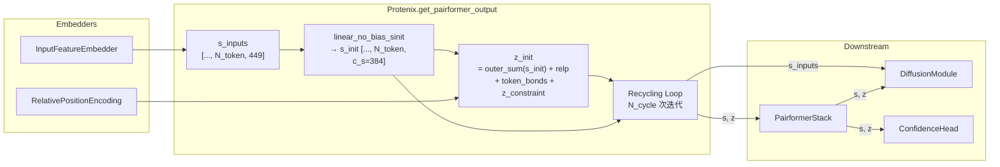

---
slug:12-input-feature-embedder
blog_type:normal
---


输入特征嵌入器（Input Feature Embedder）是 Protenix 架构中的**第一道计算关口** —— 它将原始的原子级、残基级和结构元数据转换为密集的张量表示（`s_inputs`, `z_init`），这些表示随后会输入到从 Pairformer 到 Diffusion Module 的每一个下游模块中。本页面将剖析其包含的三个组件 —— `InputFeatureEmbedder`、`RelativePositionEncoding` 以及底层的 `AtomAttentionEncoder` —— 并追溯它们是如何共同实现 AlphaFold 3 规范中的算法 2、算法 3 和算法 5 的。

来源：[embedders.py](/protenix/model/modules/embedders.py#L28-L213), [protenix.py](/protenix/model/protenix.py#L34-L160)

## 架构概述

输入特征嵌入器并非单一的庞大模块，而是**由三个专门的嵌入器组合而成**，每个嵌入器负责处理一类独特的输入信号。`InputFeatureEmbedder` 处理每个原子和每个残基的单体特征（`s_inputs`），而 `RelativePositionEncoding` 则生成用于初始化 `z_init` 的每对 Token 的位置信号。这两者都由 `Protenix` 模型在其 `get_pairformer_output` 方法中进行统一调度。

```mermaid
flowchart TD
    subgraph InputFeatures["输入特征字典 "]
        RP["ref_pos<br/>(3D 参考坐标)"]
        RC["ref_charge<br/>(原子电荷)"]
        RE["ref_element<br/>(128维 one-hot 编码)"]
        RAN["ref_atom_name_chars<br/>(4×64 字符编码)"]
        RT["restype<br/>(32维 残基类型)"]
        PF["profile<br/>(32维 MSA 特征)"]
        DM["deletion_mean<br/>(1维)"]
        IDX["asym_id / residue_index<br/>entity_id / token_index / sym_id"]
        DLM["d_lm / v_lm / pad_info<br/>(原子对特征)"]
    end

    subgraph IFE["InputFeatureEmbedder"]
        AAE["AtomAttentionEncoder<br/>3层 AtomTransformer<br/>c_atom=128, c_atompair=16"]
    end

    subgraph RPE["RelativePositionEncoding"]
        RLP["generate_relp()<br/>相对残基 + Token + 链<br/>→ one-hot 拼接"]
        LIN["LinearNoBias<br/>in=141, out=c_z=128"]
    end

    AAE -->|"a: [..., N_token, 384]"| CONCAT["拼接
    RT -->|"32维"| CONCAT
    PF -->|"32维"| CONCAT
    DM -->|"1维"| CONCAT
    
    %% 修复了下面包含 [] 的节点，将其写为 INIT_S["..."]
    CONCAT -->|"s_inputs: [..., N_token, 449]"| INIT_S["linear_no_bias_sinit<br/>→ s_init [..., N_token, c_s]"]

    IDX --> RLP
    LIN -->|"relp_encoding<br/>[..., N_token, N_token, c_z]"| INIT_Z["构建 j_init"]

    INIT_S -->|"外积求和"| INIT_Z
    
    %% 修复了下面包含 [] 的节点，将其写为 NEXT["..."]
    INIT_Z -->|"z_init [..., N_token, N_token, c_z]"| NEXT["→ Pairformer / Recycling Loop"]

    style IFE fill:#e1f5fe
    style RPE fill:#fff3e0
    style NEXT fill:#e8f5e9
```

来源：[embedders.py](/protenix/model/modules/embedders.py#L28-L121), [protenix.py](/protenix/model/protenix.py#L198-L228)

## 组件 1：InputFeatureEmbedder — 单体表示

`InputFeatureEmbedder` 类实现了 AF3 的**算法 2**。它的任务在规范定义上看似简单，但内部机制却十分丰富：接收一个包含原子级和残基级特征的异构字典，通过一个共享的基于注意力机制的编码器对其进行投影，并最终生成一个维度为 `c_token + 32 + 32 + 1 = 449` 的统一 Token 嵌入 `s_inputs`。

### 初始化参数

| 参数 | 类型 | 默认值 | 描述 |
|-----------|------|---------|-------------|
| `c_atom` | `int` | 128 | `AtomAttentionEncoder` 内部使用的单原子嵌入维度 |
| `c_atompair` | `int` | 16 | 用于局部原子对特征的原子对嵌入维度 |
| `c_token` | `int` | 384 | 输出的 Token 嵌入维度（由单原子聚合映射而来） |
| `esm_configs` | `dict` | `{}` | 可选的 ESM (Evolutionary Scale Modeling) 嵌入集成配置 |

构造函数实例化了一个配置为 `has_coords=False` 的 `AtomAttentionEncoder`，这意味着该编码器**专门处理参考系特征** —— 在这个阶段不会注入任何带噪坐标或主干网络（trunk）嵌入。原子级特征（`c_atom=128`）通过编码器内部的注意力机制被聚合为 Token 级表示（`c_token=384`）。

来源：[embedders.py](/protenix/model/modules/embedders.py#L28-L66)

### 前向传播：从原子到 Token 的聚合

前向传播方法（forward）编排了两个阶段的计算。**阶段 1** 委托给 `AtomAttentionEncoder` 处理，该模块通过一个包含 3 层结构的 `AtomTransformer`（每个模块具有 32 个查询原子 × 128 个键原子的局部注意力机制）处理每个 Token 的组成原子，随后通过基于 `atom_to_token_idx` 映射的平均池化操作，将单原子嵌入聚合为单 Token 嵌入。输出的 `a` 的形状为 `[..., N_token, c_token]`。

**阶段 2** 将 Transformer 的输出 `a` 与另外三个额外的单 Token 特征进行直接拼接：

```python
self.input_feature = {"restype": 32, "profile": 32, "deletion_mean": 1}
```

这些是原始特征（而非学习得到的嵌入）—— **残基类型**（32维 one-hot 编码）、**MSA 特征**（32维）和 **平均缺失值**（1维标量）—— 它们仅经过重塑便拼接到学习到的 Token 表示中。最终，该方法会返回维度为 `384 + 32 + 32 + 1 = 449` 的 `s_inputs` 张量。

来源：[embedders.py](/protenix/model/modules/embedders.py#L71-L121)

### 可选的 ESM 集成

当通过 `esm_configs["enable"]` 启用 ESM 嵌入时，该嵌入器会将一个初始化为零的 ESM Token 嵌入线性投影（其维度为 `embedding_dim`，对于 ESM-2 通常为 2560）累加到 `s_inputs` 中。该投影会映射到完整的 `449` 维输出空间。这种零初始化是一项经过深思熟虑的架构设计选择 —— 它确保了 ESM 信号能作为一种**残差微调路径**发挥作用，从而在初始化时不干扰基础模型的行为。

<CgxTip>ESM 嵌入线性层通过 `nn.init.zeros_()` 被显式地初始化为零。这意味着在最初的几次训练步中，ESM 的贡献量完全为零，这使得模型能够逐渐学会融合演化嵌入，而不是在一开始就被这些信号所淹没。</CgxTip>

来源：[embedders.py](/protenix/model/modules/embedders.py#L57-L66), [embedders.py](/protenix/model/modules/embedders.py#L112-L119)

## 组件 2：RelativePositionEncoding — 对（Pair）初始化

`RelativePositionEncoding` 类实现了 AF3 的**算法 3**。它将五个整数值的索引张量转换为密集的 one-hot 相对位置编码，以此捕捉所有 Token 对之间的**空间、序列和实体关系**。此编码是对表示 `z_init` 的主要初始化器。

### 索引输入及其作用

| 特征 | 形状 | 作用 |
|---------|-------|------|
| `asym_id` | `[..., N_token]` | 标识某个 Token 属于哪一个不对称单元（链） |
| `residue_index` | `[..., N_token]` | 实体内部的残基索引 |
| `entity_id` | `[..., N_token]` | 标识分子实体（例如：蛋白质 A，配体 X） |
| `token_index` | `[..., N_token]` | 不对称单元内的 Token 索引 |
| `sym_id` | `[..., N_token]` | 对称组标识符（适用于同源多聚体） |

### 编码生成（`generate_relp`）

`generate_relp` 方法完全在 `torch.no_grad()` 上下文中运行，并生成四个信号张量的拼接结果：

1. **残基距离**（`a_rel_pos`）：在同一条链内被截断至 `[-r_max, +r_max]` 区间；对于跨链的 Token 对，则会分配一个专属的“越界”区间。编码为 66 维的 one-hot 向量，计算公式为 `2(r_max+1) = 66`。

2. **Token 距离**（`a_rel_token`）：采用相同的截断逻辑，但额外要求 `b_same_residue` 必须为真。这用于区分属于同一个残基的 Token（例如：多原子配体 Token 中的各个原子）与属于不同残基的 Token。维度为 `66`。

3. **同一实体**（`b_same_entity`）：原始的二值指示符。维度为 `1`。

4. **链距离**（`a_rel_chain`）：在同一实体内被截断至 `[-s_max, +s_max]` 区间。用于捕捉对称组装体中的相对位置。维度为 10，计算公式为 `2(s_max+1) = 10`。

拼接后的 `relp` 张量维度为 `66 + 66 + 1 + 10 = 143`，随后通过一个 `LinearNoBias` 层投影到对嵌入维度 `c_z = 128`。

<CgxTip>截断值 `r_max=32` 和 `s_max=2` 是至关重要的超参数：它们界定了模型的空间分辨率视野。相距超过 32 个位置的残基对或 Token 对会被归入同一个区间，这是刻意为之的设计 —— 模型依赖 Pairformer 的迭代注意力机制来传播长程信息，而不是直接对其进行编码。</CgxTip>

来源：[embedders.py](/protenix/model/modules/embedders.py#L124-L213)

### 投影及融入 `z_init`

`RelativePositionEncoding.forward` 方法非常简洁 —— 它仅对预计算的 `relp` 特征应用线性投影。实际将其整合到 `z_init` 中的过程发生在 `Protenix.get_pairformer_output` 方法内，在这里，相对位置编码会被累加到 `s_init` 的外积求和投影上：

```python
z_init = (
    self.linear_no_bias_zinit1(s_init)[..., None, :]
    + self.linear_no_bias_zinit2(s_init)[..., None, :, :]
)  # [..., N_token, N_token, c_z]
z_init += self.relative_position_encoding(input_feature_dict["relp"])
z_init += self.linear_no_bias_token_bond(input_feature_dict["token_bonds"].unsqueeze(dim=-1))
```

这意味着 `z_init` 是一个**三项之和**：单体表示的外积（用于捕捉基于内容的信号对）、相对位置编码（用于捕捉空间/序列关系），以及 Token 键投影（用于捕捉显式的共价连接性）。

来源：[protenix.py](/protenix/model/protenix.py#L208-L228)

## 组件 3：AtomAttentionEncoder — 从原子到 Token 的桥梁

`AtomAttentionEncoder`（AF3 的算法 5）是驱动 `InputFeatureEmbedder` 运转的核心引擎。它同样在 `DiffusionModule` 中被复用，只需设置 `has_coords=True` 即可用于解码过程。这两种模式在架构上是完全相同的，唯一的区别在于：扩散变体会额外注入主干嵌入（`s`, `z`）以及带噪坐标（`r_l`）。

### 原子级特征嵌入

该编码器首先通过对三组特征组进行投影和求和，构建出单原子表示 `c_l`：

| 特征 | 输入维度 | 投影层 | 描述 |
|---------|-----------|------------|-------------|
| `ref_pos` | 3 | `LinearNoBias(3→128, float32)` | 3D 参考系坐标 |
| `ref_charge` | 1 | `LinearNoBias(1→128)` | 形式电荷（通过 `arcsinh` 变换处理） |
| `ref_mask + ref_element + ref_atom_name_chars` | 1+128+256 | `LinearNoBias(385→128)` | 掩码、元素 one-hot 编码、原子名字符编码 |

`ref_charge` 在投影前会先经过 `torch.arcsinh` 变换 —— 这不仅能压缩极大的电荷值，还能对称地处理负电荷。最终的 `c_l` 会乘以 `ref_mask`，从而将填充（padding）的原子特征置零。

来源：[transformer.py](/protenix/model/modules/transformer.py#L640-L772)

### 原子对特征构建

原子对特征 `p_lm` 是由预计算的量构建而成的：`d_lm`（局部原子对距离）、`v_lm`（有效掩码）和 `pad_info`（截断的密集块掩码）。这些量是在 `update_input_feature_dict` 中通过 `rearrange_qk_to_dense_trunk` 函数计算得出的，该函数会将完整的原子集合划分为多个局部块，每块包含 32 个查询原子 × 128 个键原子。

原子对特征包含了以下三项的组合：

```python
p_lm = linear_no_bias_d(d_lm) * v_lm           # 受有效性门控的距离投影
     + linear_no_bias_invd(1/(1+d²)) * v_lm     # 平方反比距离
     + linear_no_bias_v(v_lm)                    # 原始有效性信号
```

这个三元组同时捕捉了**绝对距离**和**反比距离**（同时提供短程和长程梯度），并受块有效掩码的门控限制，以处理填充的原子。

来源：[transformer.py](/protenix/model/modules/transformer.py#L774-L801), [protenix.py](/protenix/model/protenix.py#L55-L88)

### AtomTransformer 与 Token 聚合

原子级表示通过一个**3 层结构的 `AtomTransformer`**（即开启 `cross_attention_mode=True` 的 `DiffusionTransformer`）进行精细化处理，它使用了 32×128 原子的局部注意力窗口。每个模块都会依次应用 `AttentionPairBias`（算法 24）和 `ConditionedTransitionBlock`（算法 25）。

经过 Transformer 处理后，单原子嵌入会通过 `linear_no_bias_q` 投影到 `c_token` 维度，并通过基于归属每个 Token 的原子进行平均池化（利用 `atom_to_token_idx`）聚合为 Token 级表示。正是在这个聚合步骤中，每个 Token 中原本数量不等的原子（例如：氨基酸骨架包含 1 个原子，而大型配体可能多达约 15 个原子）被统一压缩成了一个标准化的 Token 表示。

来源：[transformer.py](/protenix/model/modules/transformer.py#L715-L726), [transformer.py](/protenix/model/modules/transformer.py#L894-L1046)

## s_inputs 和 z_init 如何为模型提供输入

下图展示了从原始特征流经嵌入器直至进入循环（Recycling）环节的完整数据流向：



`s_inputs` 张量（维度 449）通过 `linear_no_bias_sinit` 投影为 `s_init`（维度 `c_s = 384`）。随后，这个 `s_init` 发挥着两大作用：(1) 它直接为 Recycling 循环初始化单体表示 `s`；(2) 它生成 `z_init` 的外积求和分量。此外，`s_inputs` 还会被直接传递给 `MSAModule` 和 `DiffusionModule` 作为条件信号。

来源：[protenix.py](/protenix/model/protenix.py#L140-L168), [protenix.py](/protenix/model/protenix.py#L198-L304)

## 维度汇总

| 张量 | 形状 | 描述 |
|--------|-------|-------------|
| `c_l` (原子单体) | `[..., N_atom, 128]` | 输入 `AtomTransformer` 之前的单原子嵌入 |
| `p_lm` (原子对) | `[..., n_blocks, 32, 128, 16]` | 位于截断块中的局部原子对特征 |
| `a` (编码器输出的 Token) | `[..., N_token, 384]` | `AtomAttentionEncoder` 输出的单 Token 表示 |
| `s_inputs` | `[..., N_token, 449]` | 由 `a` + restype + profile + deletion_mean 拼接而成 |
| `relp` (原始编码) | `[..., N_token, N_token, 143]` | one-hot 相对位置拼接结果 |
| `relp_encoding` | `[..., N_token, N_token, 128]` | 投影后的对位置编码 |
| `s_init` | `[..., N_token, 384]` | 用于 Recycling 的投影后单体初始化器 |
| `z_init` | `[..., N_token, N_token, 128]` | 对初始化器：外积求和 + relp + 键 + 约束 |

来源：[embedders.py](/protenix/model/modules/embedders.py#L83-L121), [transformer.py](/protenix/model/modules/transformer.py#L838-L864), [protenix.py](/protenix/model/protenix.py#L198-L228)

## 接下来学什么

既然你已经了解了原始特征是如何被嵌入为单体和对表示的，接下来的自然学习步骤是：

- **[Pairformer Stack](9-pairformer-stack)** —— 探究 `s_init` 和 `z_init` 是如何通过 48 层注意力模块进行迭代细化的
- **[Diffusion Module](10-diffusion-module)** —— 了解 `s_inputs` 如何通过相同的 `AtomAttentionEncoder`（此时设置 `has_coords=True`）为去噪过程设定条件
- **[Featurization Pipeline](13-featurization-pipeline)** —— 揭示 `input_feature_dict` 中的键在到达嵌入器之前，是如何从原始的 PDB/mmCIF 数据计算而来的