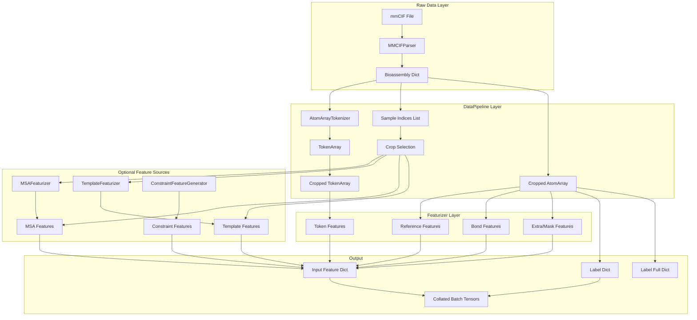
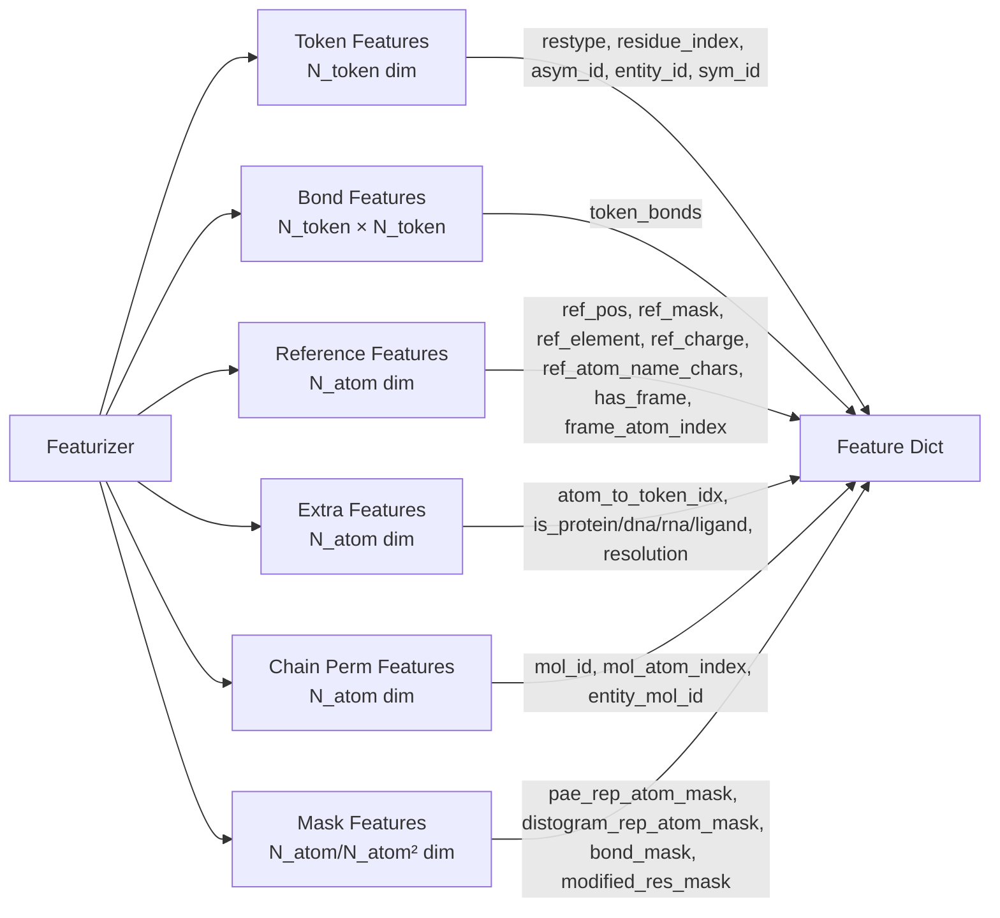

---
slug:13-featurization-pipeline
blog_type:normal
---


特征化流水线是连接原始结构生物学数据（mmCIF 文件、MSA 比对、模板结构）与 Protenix 神经网络模块所消耗的张量表示的关键桥梁。该流水线将蛋白质、核酸、配体和离子等异构分子复合物，转化为统一的 Token 级和原子级特征张量集，并附带训练标签和评估掩码。对于需要处理自定义训练数据、调试特征不匹配问题，或希望将系统扩展至新分子类型的开发者而言，深入理解此流水线至关重要。

## 流水线架构概述

特征化流水线采用三层架构运作：**DataPipeline** 层负责处理原始数据解析和生物聚合体构建；**BaseSingleDataset** 层统筹针对单个样本的处理（包括裁剪和数据增强）；**Featurizer** 层则负责生成实际的张量特征。此外，独立的 **DataLoader** 层专门管理加权采样和批次拼接。



来源：[data_pipeline.py](/protenix/data/pipeline/data_pipeline.py#L44-L107), [dataset.py](/protenix/data/pipeline/dataset.py#L50-L66), [featurizer.py](/protenix/data/core/featurizer.py#L29-L53)

## 阶段 1：原始数据解析与生物聚合体构建

流水线始于 `DataPipeline.get_data_from_mmcif()` 静态方法，该方法接收一个 mmCIF 文件路径，并返回两部分产物：一个采样索引列表（其中每个索引代表一条链或一个接口），以及一个包含解析后的原子数组、Token 数组和分辨率的生物聚合体字典。

三种解析器变体分别用于处理不同类型的数据集：

| 解析器类 | 数据集类型 | 适用场景 |
|---|---|---|
| `MMCIFParser` | `WeightedPDB` | 来自 PDB 聚类的标准训练数据 |
| `DistillationMMCIFParser` | `Distillation` | 源自模型预测的自蒸馏数据 |
| `RecentPDB_MMCIFParser` | `RecentPDB` | 用于评估的近期录入结构 |

解析完成后，生物聚合体会通过 `AtomArrayTokenizer` 进行 Token 化，将 `AtomArray` 转换为 `TokenArray`。在此过程中，每个 Token 要么对应单个残基（针对标准氨基酸和核苷酸），要么对应单个原子（针对配体和修饰残基）。解析器的 `make_indices()` 方法会生成采样索引列表，枚举出适合用于训练的各个独立链以及链间接口。

<CgxTip>
生物聚合体字典可以被预计算并缓存为 `.pkl.gz` 文件。当提供 `bioassembly_dict_dir` 时，`DataPipeline.get_data_bioassembly()` 会直接加载预计算的字典，从而跳过耗时的 mmCIF 解析步骤。这对于 I/O 延迟成为主要瓶颈的大规模训练至关重要。
</CgxTip>

来源：[data_pipeline.py](/protenix/data/pipeline/data_pipeline.py#L49-L107), [dataset.py](/protenix/data/pipeline/dataset.py#L356-L383)

## 阶段 2：数据集级处理与裁剪

`BaseSingleDataset` 类继承了 PyTorch 的 `Dataset`，并通过其 `process_one()` 方法驱动单样本特征化工作流。该方法是整个流水线的核心调度逻辑。

### 索引过滤流水线

在初始化时，数据集会读取索引 CSV 文件，并应用一系列级联过滤器：

1. **PDB 列表过滤** — 限制为特定的一组 PDB ID
2. **Token 数量过滤** — 设定 `max_n_token` / `min_n_token` 的边界
3. **排除过滤** — 移除与指定列值组合相匹配的行
4. **评估类型过滤** — 仅保留 `EvaluationChainInterface` 中的链/接口
5. **数量限制** — 限制数据集大小以用于测试

按 PDB 分组模式（`group_by_pdb_id`）将扁平的索引列表重构为按 PDB 划分的 DataFrame 列表，使得来自单一结构的所有接口能够被一并处理。`sort_by_n_token` 选项则按 Token 数量降序排列，以便在训练初期尽早暴露 OOM（内存溢出）错误。

来源：[dataset.py](/protenix/data/pipeline/dataset.py#L153-L266)

### 数据增强变换

在裁剪之前，`process_one()` 会对生物聚合体数据应用几种可选的数据增强变换：

- **参考链选择** (`use_reference_chains_only`)：仅隔离出与采样接口相关的链
- **分子洗牌** (`shuffle_mols`)：在 `mol_id` 层级随机打乱分子顺序
- **对称 ID 洗牌** (`shuffle_sym_ids`)：在每个实体内随机重新分配 `sym_id`，这对于训练置换不变性模型至关重要
- **链 ID 重分配** (`reassign_continuous_chain_ids`)：确保在过滤后 `asym_id_int` 的值保持连续

来源：[dataset.py](/protenix/data/pipeline/dataset.py#L404-L524)

### 裁剪策略

裁剪任务通过 `DataPipeline.crop()` 委托给 `CropData` 处理，该方法支持三种加权随机策略：

| 策略 | 描述 | 典型权重 |
|---|---|---|
| `ContiguousCropping` | 沿链条顺序进行连续的 Token 窗口选择 | 0.2 |
| `SpatialCropping` | 基于参考 Token 的半径范围选择 | 0.4 |
| `SpatialInterfaceCropping` | 以界面残基为中心的双中心空间裁剪 | 0.4 |

裁剪操作还会同步 MSA 和模板特征的生成——`get_msa_raw_features()` 和 `get_template_raw_features()` 均会接收裁剪后的 Token 索引，从而确保所有的特征来源都与裁剪后的原子/Token 数组保持一致。

来源：[data_pipeline.py](/protenix/data/pipeline/data_pipeline.py#L244-L358), [dataset.py](/protenix/data/pipeline/dataset.py#L528-L551)

## 阶段 3：特征生成

`Featurizer` 类是核心的特征引擎，由裁剪后的 `TokenArray` 和 `AtomArray` 对象实例化而成。其 `get_all_input_features()` 方法将六类特征聚合为一个统一的字典：



来源：[featurizer.py](/protenix/data/core/featurizer.py#L681-L706)

### Token 级特征

Token 特征（`get_token_features()`）在 `N_token` 维度上运作，遵循 AlphaFold3 SI 表 5 的约定：

- **`restype`**：32 种残基类型的独热编码（包含 20 种标准氨基酸、4 种 RNA 核苷酸、4 种 DNA 核苷酸、空位及未知类型）。配体被编码为“UNK”（未知氨基酸）。
- **`token_index`**：顺序位置索引 `[0, 1, ..., N_token-1]`
- **`residue_index`**：每条链内部的残基编号
- **`asym_id`**, **`entity_id`**, **`sym_id`**：用于处理置换问题的分层链标识符

独热编码通过 `Featurizer.encoder()` 静态方法使用了向量化的 `F.one_hot` 方案，该方法将输入值映射为整数索引，然后应用 PyTorch 原生的独热编码。

来源：[featurizer.py](/protenix/data/core/featurizer.py#L55-L104), [featurizer.py](/protenix/data/core/featurizer.py#L309-L344)

### 参考构象特征

参考特征（`get_reference_features()`）在 `N_atom` 维度上运作，对每个原子参考构象的理想化几何结构进行编码：

- **`ref_pos`**：来自参考构象的 3D 坐标，通过 `random_transform()` 按残基进行中心化。当 `ref_pos_augment=True` 时，会施加随机的刚体变换（旋转 + 平移）以进行数据增强。
- **`ref_mask`**：指示有效参考位置的二元掩码
- **`ref_element`**：原子序数的独热编码（最多支持 128 种元素）
- **`ref_charge`**：每个原子的形式电荷
- **`ref_atom_name_chars`**：原子名称的字符级独热编码，补齐至 4 个字符，每个字符在 64 类空间中被编码为 `ord(c) - 32`
- **`ref_space_uid`**：每个残基的唯一标识符，用于基于 KDTree 的空间查询

<CgxTip>
`lig_atom_rename` 选项会使用基于元素的顺序名称（例如 `C1`, `C2`, `N1`）替换配体原子名称，以防止 PDB 特定的命名约定造成信息泄漏。此操作在数据集层级控制，应当在训练期间启用，但在推理阶段如果原子名称携带语义信息时应将其禁用。
</CgxTip>

来源：[featurizer.py](/protenix/data/core/featurizer.py#L393-L452), [featurizer.py](/protenix/data/core/featurizer.py#L369-L391)

### Token 坐标系构建

坐标系为每个 Token 定义了局部坐标系，遵循 AlphaFold3 SI 第 4.3.2 章的规定。`get_token_frame()` 方法根据分子类型分配坐标系的原子 `(a_i, b_i, c_i)`：

| 分子类型 | 坐标系原子 | 来源 |
|---|---|---|
| 蛋白质（标准） | `N, CA, C`（骨架） | Token 所属残基 |
| DNA/RNA（标准） | `C1', C3', C4'`（糖环） | Token 所属残基 |
| 配体 / 修饰残基 / 离子 | 距离中心原子最近的三颗原子 | 基于参考构象的 KDTree 查询 |

对于配体，系统会为每个 `ref_space_uid` 构建一个 `KDTree`，以识别最近的三个原子。在以下情况下，坐标系会被标记为无效（`has_frame=0`）：原子数少于 3 个（例如金属离子）、原子趋于共线（夹角 < 25° 或 > 155°）、或参考位置坐标为零。

来源：[featurizer.py](/protenix/data/core/featurizer.py#L144-L307)

### 化学键特征

化学键特征（`get_bond_features()`）生成一个大小为 `[N_token, N_token]` 的二元邻接矩阵，用于指示 Token 之间的共价键。其过滤逻辑较为精细：

- **被排除的化学键**：标准-标准残基、标准-非标准残基，以及非标准聚合体之间的聚合体-聚合体化学键
- **被包含的化学键**：聚合体-配体、配体-配体化学键，以及可选的不连续聚合体-聚合体化学键
- 原子级别的化学键会通过缓存的 `atom_to_token_idx` 映射转换为 Token 级别

来源：[featurizer.py](/protenix/data/core/featurizer.py#L454-L522)

### 掩码特征

掩码特征（`get_mask_features()`）提供了按原子的二元指示信号，供下游不同的模型头使用：

- **`pae_rep_atom_mask`**：用于 PAE（Predicted Aligned Error，预测对齐误差）计算的代表性原子
- **`plddt_m_rep_atom_mask`**：用于 pLDDT 指标的代表性原子
- **`distogram_rep_atom_mask`**：用于距离图预测的代表性原子
- **`modified_res_mask`**：标记非标准残基
- **`bond_mask`**：大小为 `[N_atom, N_atom]` 的配体-聚合体化学键矩阵，用于损失计算

来源：[featurizer.py](/protenix/data/core/featurizer.py#L645-L679)

## 阶段 4：标签生成

`Featurizer.get_labels()` 方法用于提取真实值的监督信号：

- **`coordinate`**：真实的 3D 坐标 `[N_atom, 3]`
- **`coordinate_mask`**：用于标识已解析原子的二元掩码

对于多链置换对齐，`get_gt_full_complex_features()` 会生成一组独立的标签集，包含完整复合物的坐标、`mol_id` 映射以及代表性原子掩码。`get_cropped_asym_only` 参数用于控制仅包含出现在裁剪视图中的链（空间裁剪），还是包含同一实体的所有链（连续裁剪）。

原子级别的置换列表由 `get_atom_permutation_list()` 生成，该方法在固定参与残基间化学键的原子的同时，编码了对称原子的等价关系（例如羧酸氧的交换）。

来源：[featurizer.py](/protenix/data/core/featurizer.py#L708-L791), [dataset.py](/protenix/data/pipeline/dataset.py#L793-L813)

## 阶段 5：特征组装与后处理

`BaseSingleDataset` 中的 `get_feature_and_label()` 方法将所有组件组装为最终输出结构。组装流程如下：

1. **约束特征**（如启用）：`ConstraintFeatureGenerator` 会修改 Token/原子数组，并注入约束相关的特征
2. **核心特征化特征**：Token、化学键、参考、额外、链置换和掩码特征
3. **原子置换列表**：用于在损失计算过程中处理对称原子
4. **完整复合物标签**：用于多链对齐的真实坐标
5. **口袋/评估掩码**：用于 PoseBusters 及链/接口指标评估
6. **MSA 和模板特征**：通过 `dict_to_tensor()` 转换为张量，不可用时则插入虚拟特征
7. **类型转换**：`data_type_transform()` 将所有张量转换为正确的数据类型
8. **蒸馏标志**：根据数据集类型进行设置

最终输出的字典结构如下：

```python
{
    "input_feature_dict": { ... },   # 模型的所有输入特征
    "label_dict": { ... },           # 训练标签（坐标、掩码）
    "label_full_dict": { ... },      # 用于置换对齐的完整复合物标签
    "basic": { ... }                 # 元数据：pdb_id, N_token, N_atom, chain_ids 等
}
```

来源：[dataset.py](/protenix/data/pipeline/dataset.py#L744-L894)

## 阶段 6：采样与批处理

DataLoader 层提供了三种专门的采样器：

| 采样器 | 用途 | 核心机制 |
|---|---|---|
| `WeightedSampler` | 单节点加权采样 | 结合单样本权重的 `torch.multinomial` |
| `DistributedWeightedSampler` | 多节点加权采样 | 跨副本分片多项式采样 |
| `KeySumBalancedSampler` | Token 数量均衡采样 | 分发索引以确保每个 worker 的 Token 总数相近 |

`KeySumBalancedSampler` 对于分布式训练尤为重要：它根据某个键（通常是 `num_tokens`）对数据集索引进行排序，并使用贪心平衡算法将其分配给各个 worker，从而避免由于大分子复合物分布不均导致单一 GPU 成为内存瓶颈。

批次拼接由 `collate_fn_first()` 处理，该方法将可变长度的特征填充至统一的批次维度，并生成供模型使用的最终张量字典。

来源：[dataloader.py](/protenix/data/pipeline/dataloader.py#L31-L200)

## 特征维度参考

下表总结了关键的特征张量及其相对于两个基础维度（`N_token` 和 `N_atom`）的大小：

| 特征 | 维度 | 粒度 | 用途 |
|---|---|---|---|
| `restype` | `[N_token, 32]` | Token | 残基类型编码 |
| `token_index` | `[N_token]` | Token | 顺序位置 |
| `residue_index` | `[N_token]` | Token | 链内残基编号 |
| `asym_id` / `entity_id` / `sym_id` | `[N_token]` | Token | 链层级标识符 |
| `token_bonds` | `[N_token, N_token]` | Token 对 | 共价键邻接矩阵 |
| `ref_pos` | `[N_atom, 3]` | 原子 | 参考构象坐标 |
| `ref_mask` | `[N_atom]` | 原子 | 有效参考位置掩码 |
| `ref_element` | `[N_atom, 128]` | 原子 | 元素独热编码 |
| `ref_charge` | `[N_atom]` | 原子 | 形式电荷 |
| `ref_atom_name_chars` | `[N_atom, 4, 64]` | 原子 | 原子名称字符编码 |
| `has_frame` | `[N_token]` | Token | 坐标系有效性标志 |
| `frame_atom_index` | `[N_token, 3]` | Token | 定义坐标系的原子索引 |
| `atom_to_token_idx` | `[N_atom]` | 原子 | 原子到 Token 的映射 |
| `is_protein/dna/rna/ligand` | `[N_atom]` | 原子 | 分子类型标志 |
| `mol_id` / `entity_mol_id` / `mol_atom_index` | `[N_atom]` | 原子 | 链置换特征 |
| `bond_mask` | `[N_atom, N_atom]` | 原子对 | 配体-聚合体化学键矩阵 |

来源：[featurizer.py](/protenix/data/core/featurizer.py#L309-L706)

## 后续步骤

既然你已经理解了完整的特征化流程，不妨继续探索以下相关主题：

- [Tokenizer 和 AtomArray](14-tokenizer-and-atomarray) — 深入了解原始结构是如何被 Token 化并转换为 Featurizer 所需数组的
- [MSA 特征处理](15-msa-feature-processing) — 详尽涵盖 MSA 特征化子系统
- [模板特征处理](16-template-feature-processing) — 探讨如何检索并编码结构模板
- [约束特征](25-constraint-features) — 使用实验约束数据扩展流水线
- [配置系统](26-configuration-system) — 了解如何通过配置系统管理流水线参数