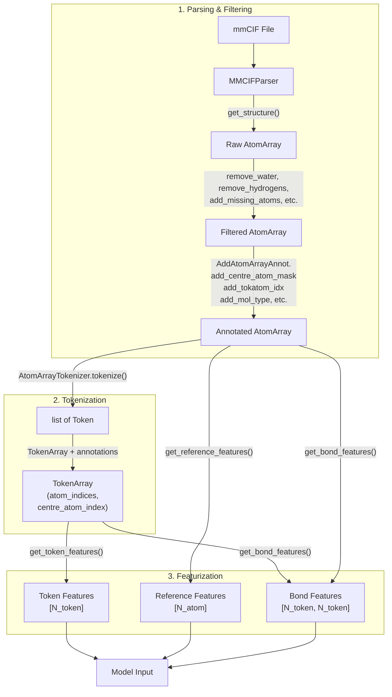
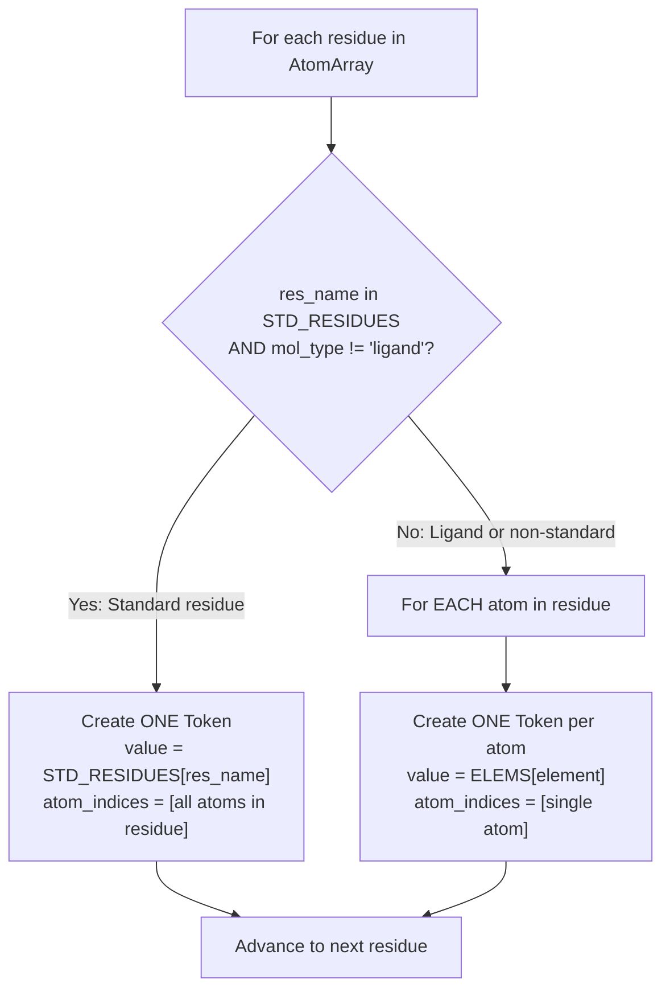

---
slug:14-tokenizer-and-atomarray
blog_type:normal
---


在 Protenix 中，模型进行处理前，必须将来自 mmCIF 文件的原始分子结构转换为双粒度表示。**AtomArray** 用于捕获完整的原子分辨率结构（包括每个重原子及其坐标、化学键和注释信息），而 **Token** 抽象则提供了一种更粗粒度的残基级或原子级分组，作为模型注意力机制的基础单元。本页面将深入剖析连接这两种表示的架构设计——包括如何解析原子、如何推导 Token，以及它们之间的映射关系如何驱动下游的特征化处理。

来源：[tokenizer.py](/protenix/data/tokenizer.py#L1-L197), [constants.py](/protenix/data/constants.py#L269-L412), [parser.py](/protenix/data/core/parser.py#L93-L939), [featurizer.py](/protenix/data/core/featurizer.py#L29-L853)

---

## 架构概述

要理解 AtomArray 和 TokenArray 之间的关系，最好将其视为通过显式索引映射连接的**双层层级结构**。AtomArray 是从 mmCIF 解析出的基准原子结构。TokenArray 是通过遵循 AlphaFold3 规范的词元化过程从中推导而来的：标准聚合物残基被折叠为单个 Token，而配体和非标准原子则各自成为独立的 Token。



来源：[tokenizer.py](/protenix/data/tokenizer.py#L104-L197), [parser.py](/protenix/data/core/parser.py#L700-L939), [featurizer.py](/protenix/data/core/featurizer.py#L309-L560)

---

## AtomArray：原子级表示

### 从 mmCIF 构建

`AtomArray` 是 Protenix 中用于存储分子结构的核心数据容器，它基于 **Biotite** 的 `AtomArray` 类构建。`MMCIFParser` 类负责编排整个流水线：它解析 mmCIF 文件、提取原子坐标、应用一系列过滤操作，并使用特定领域的注释来丰富该数组。

`get_bioassembly` 中的生物组装体构建流水线需经过一系列严格的处理步骤。每一步都会移除不应被建模的原子/残基，或者添加关键的注释信息：

| 流水线步骤 | 用途 |
|---|---|
| `remove_water` | 剔除水分子 |
| `remove_hydrogens` | 移除所有氢原子（仅保留重原子表示） |
| `remove_polymer_chains_all_residues_unknown` | 丢弃所有残基均为未知类型的链 |
| `add_missing_atoms_and_residues` | 根据 CCD 参考推断缺失的原子；标记 `is_resolved` |
| `remove_ligand_absent_atoms` | 移除 CCD 定义中不存在的配体原子 |
| `remove_element_X` | 剔除未知元素（执行 ASX→ASP、GLX→GLU 的转换） |
| `add_token_mol_type` | 为每个原子注释 `mol_type`（蛋白质/dna/rna/配体） |
| `add_centre_atom_mask` | 标记每个 Token 的代表性原子 |
| `add_tokatom_idx` | 将每个原子映射到其所属 Token 的中心原子索引 |
| `add_cano_seq_resname` | 分配规范的序列残基名称 |

完成过滤后，原子数组将被扩展为目标生物组装体，链将被赋予唯一的新名称，并被分配数字标识符（`asym_id_int`、`entity_id_int`、`sym_id_int`）。

来源：[parser.py](/protenix/data/core/parser.py#L700-L939)

### AtomArray 上的关键注释

除了 Biotite 的标准注释（如坐标、元素、残基名称、链 ID）之外，Protenix 还添加了几个自定义注释层，它们对于词元化和特征化至关重要：

- **`centre_atom_mask`**：一个布尔数组，每个 Token 中确切地标记了一个原子——即代表该 Token 位置的原子。对于标准残基，这通常是 Cα（蛋白质）或 C1'（核酸）；对于配体原子，每个原子即为其自身的中心。
- **`mol_type`**：针对每个原子的字符串注释，将其分类为 `"protein"`、`"dna"`、`"rna"` 或 `"ligand"`。
- **`tokatom_idx`**：对于每个原子，存储其所属 Token 的中心原子的全局索引，从而构建起原子到 Token 的桥梁。
- **`ref_space_uid`**：每个残基的唯一整数标识符，用于将共享相同参考构象的原子进行分组（例如，一个配体残基中的所有原子）。
- **`ref_pos`**：源自 CCD 的理想化参考构象中该原子的 3D 坐标，用于参考系构建和相对位置编码。
- **`is_resolved`**：布尔值，指示该原子在源结构中是否具有实验测得的坐标（区别于从 CCD 推断出的坐标）。

<CgxTip>`centre_atom_mask` 是连接这两种表示的核心枢纽：`centre_atom_mask == 1` 的原子数量等于 Token 总数，这种对应关系会在词元化过程中进行断言校验。此处的任何不一致都会导致整个下游流水线崩溃。</CgxTip>

来源：[parser.py](/protenix/data/core/parser.py#L813-L826), [featurizer.py](/protenix/data/core/featurizer.py#L454-L540)

---

## Token 抽象：粗粒度表示

### Token 类设计

`Token` 类是一个轻量级容器，用于存储一个**值**（即整数形式的 Token ID）以及一个包含任意注释的字典。它的设计利用了 Python 的 `__getattr__` / `__setattr__` 协议，通过内部的 `_annot` 字典动态路由属性访问，从而无需子类化即可灵活附加注释：

```python
class Token(object):
    def __init__(self, value, **kwargs):
        self.value = value
        self._annot = {}
        for name, annotation in kwargs.items():
            self._annot[name] = annotation

    def __getattr__(self, attr):
        if attr in super().__getattribute__("_annot"):
            return self._annot[attr]
        else:
            raise AttributeError(...)
```

每个 Token 在经过词元化后都会包含以下关键注释：

| 注释 | 作用域 | 描述 |
|---|---|---|
| `atom_indices` | Token | 属于该 Token 的全局原子索引列表 |
| `atom_names` | Token | 对应的原子名称（例如：`['N', 'CA', 'C', 'O', 'CB']`） |
| `centre_atom_index` | Token | 代表性中心原子的全局索引 |
| `has_frame` | Token | 指示是否可以构建有效的局部参考系 |
| `frame_atom_index` | Token | 定义该参考系的三元组 `[a_idx, b_idx, c_idx]` |

来源：[tokenizer.py](/protenix/data/tokenizer.py#L22-L60)

### TokenArray：批处理容器

`TokenArray` 封装了一个 `Token` 对象列表，并提供了批量访问的方法。`get_annotation(category)` 提取所有 Token 中的某个命名注释并将其作为列表返回，而 `set_annotation(category, values)` 则负责将值分发回各个 Token。`get_values()` 方法返回原始的整数 Token ID。其索引机制同时支持整数访问（单个 Token）和列表/切片访问（子数组），体现了类似 NumPy 的语义。

来源：[tokenizer.py](/protenix/data/tokenizer.py#L62-L102)

---

## 词元化：从 AtomArray 到 Tokens

### 词元化算法

`AtomArrayTokenizer.tokenize()` 方法实现了 AlphaFold3 的词元化方案。它使用 Biotite 的 `residue_iter` 遍历残基，并应用双分支决策逻辑：



对于标准残基（20种氨基酸 + 5种 RNA + 5种 DNA 核苷酸），整个残基会被压缩为一个单独的 Token，其值为来自 `STD_RESIDUES` 的残基整数 ID。该残基中的所有原子都会被记录在 `token.atom_indices` 中。对于配体和非标准残基，每个独立的原子各自成为一个 Token，其值取自 `ELEMS` 映射中对应元素的整数 ID。

`get_token_array()` 方法会调用 `tokenize()`，随后调用 `_set_token_annotations()`，通过匹配 AtomArray 中 `centre_atom_mask == 1` 的位置来填充 `centre_atom_index`。严格的断言逻辑确保了 Token 的数量与中心原子的数量保持一致。

来源：[tokenizer.py](/protenix/data/tokenizer.py#L104-L196)

### Token ID 空间

Token ID 空间经过了仔细划分，以避免残基级 Token 和原子级 Token 之间发生冲突：

| 类别 | ID 范围 | 数量 |
|---|---|---|
| 蛋白质残基 (ALA…UNK) | 0–20 | 21 |
| RNA 残基 (A, G, C, U, N) | 21–25 | 5 |
| DNA 残基 (DA, DG, DC, DT, DN) | 26–30 | 5 |
| 间隔 | 31 | 1 |
| 元素 (H…Og + UNK_ELEM) | 31+1 = 32 及以后 | 128 |

`ELEMS` 字典的构造方式为 `{element_symbol: len(STD_RESIDUES) + index}`，确保基于元素的 Token ID（用于配体原子）从索引 32 开始，一直延伸至索引 159（共计 128 种元素）。这种设计意味着仅凭 Token 的值，就可以判断该 Token 代表的是一个标准残基还是一个单独的原子。

来源：[constants.py](/protenix/data/constants.py#L269-L412)

---

## 原子到 Token 的索引映射

### 桥接层

有两个关键的索引数组实现了这两种表示之间的双向连接：

**`atom_to_token_idx`**（由 `Featurizer._get_atom_to_token_idx` 构建）：一个形状为 `[N_atom]` 的数组，将每个原子映射到其所属 Token 的索引。它是通过遍历所有 Token，并将该 Token 的顺序索引赋值给 `token.atom_indices` 中的每个原子来构建的。此映射关系在第一次计算后会被缓存。

**`tokatom_idx`**（在解析过程中直接注释在 AtomArray 上）：对于每个原子，记录其所属 Token 的中心原子的全局索引。它由 `AddAtomArrayAnnot.add_tokatom_idx` 在注释流水线中设置，模型据此为每个原子聚合 Token 级别的特征。

`Featurizer.get_bond_features()` 中的键特征计算过程展示了 `atom_to_token_idx` 的关键应用：它遍历所有原子级别的化学键，过滤掉标准的聚合物间化学键，通过 `atom_idx_to_token_idx[bond_atom]` 将剩余的键端点从原子索引映射为 Token 索引，最终构建出一个 `[N_token, N_token]` 的邻接矩阵（`token_bonds`）。

来源：[featurizer.py](/protenix/data/core/featurizer.py#L454-L522), [featurizer.py](/protenix/data/core/featurizer.py#L524-L560)

---

## 参考系构建

### Token 级别的局部参考系

每个 Token 都可以选择性地携带一个由三个原子 `(a, b, c)` 定义的局部参考系，其中 `b` 始终是中心原子。参考系的构建遵循 AlphaFold3 规范，并根据分子类型进行分支处理：

| 分子类型 | 参考系原子 | 方法 |
|---|---|---|
| 蛋白质 | `[N, CA, C]` 主链 | `get_prot_nuc_frame()` |
| DNA / RNA | `[C1', C3', C4']` 糖环原子 | `get_prot_nuc_frame()` |
| 配体 / 离子 / 非标准残基 | 中心原子 + 参考构象中的 2 个最近邻原子 | `get_lig_frame()` |

对于聚合物 Token，系统会根据名称在 Token 的 `atom_names` 列表中查找参考系原子，然后通过 `token.atom_indices` 将其映射为全局索引。如果所需的原子缺失（例如，末端残基缺少 N 原子），`has_frame` 将被置为 0。

对于配体 Token，系统会针对每个 `ref_space_uid` 基于参考构象位置构建一棵 `KDTree`。在参考空间中距离中心原子最近的那两个原子即被指定为 `a` 和 `c`。在以下情况下，该参考系将被判定为无效：残基中存在的原子少于 3 个、任何参考系原子的 `ref_mask == 0`，或者这三个原子近乎共线（夹角 < 25° 或 > 155°）。

来源：[featurizer.py](/protenix/data/core/featurizer.py#L144-L307)

---

## 从双重表示中推导特征

### Token 级别特征

`Featurizer.get_token_features()` 方法通过从中心原子（即 AtomArray 中每个 Token 的代表性原子）收集信息，提取出形状为 `[N_token]` 的特征：

- **`token_index`**：连续的整数索引 `[0, 1, ..., N_token-1]`
- **`residue_index`**：源自 `centre_atoms.res_id` 的按 Token 划分的残基 ID
- **`asym_id` / `entity_id` / `sym_id`**：链与实体标识符
- **`restype`**：采用 32 个值的 `STD_RESIDUES_WITH_GAP` 编码（20 种氨基酸 + UNK + 4 种 RNA + N + 4 种 DNA + DN + 间隔）进行独热编码的残基类型

该编码由 `Featurizer.restype_onehot_encoded()` 执行，它将残基名称映射为整数索引，并应用 `torch.nn.functional.one_hot`。配体 Token 接收 `"UNK"` 作为其规范残基名称，从而将它们映射到未知氨基酸的对应位置。

来源：[featurizer.py](/protenix/data/core/featurizer.py#L88-L104), [featurizer.py](/protenix/data/core/featurizer.py#L309-L344)

### 原子级参考特征

`Featurizer.get_reference_features()` 方法直接从 AtomArray 生成形状为 `[N_atom]` 的特征，表示理想化参考构象中的原子级属性：

| 特征 | 编码方式 | 形状 |
|---|---|---|
| `ref_pos` | 3D 坐标（已中心化 + 可选的数据增强） | `[N_atom, 3]` |
| `ref_mask` | 指示有效参考位置的布尔值 | `[N_atom]` |
| `ref_element` | 元素原子序数的独热编码（128 类） | `[N_atom, 128]` |
| `ref_charge` | 源自 CCD 的形式电荷 | `[N_atom]` |
| `ref_atom_name_chars` | 原子名称的逐字符独热编码（4 字符 × 64 类） | `[N_atom, 4, 64]` |
| `ref_space_uid` | 残基分组标识符 | `[N_atom]` |
| `has_frame` | Token 级别的参考系有效性（聚合至 `[N_token]`） | `[N_token]` |
| `frame_atom_index` | 参考系原子索引三元组 | `[N_token, 3]` |

<CgxTip>`ref_space_uid` 注释对于正确编码参考位置至关重要：在计算 `ref_pos` 之前，各位置会根据 `ref_space_uid` 分组独立进行中心化处理。这确保了每个残基/分子内的相对位置关系得以保留，即使不同的残基共享相同的原子名称，但具有不同的理想化几何结构也不受影响。</CgxTip>

来源：[featurizer.py](/protenix/data/core/featurizer.py#L393-L452)

---

## Tokenizer 和 AtomArray 在下游的连接方式

这种双重表示通过多种方式汇入更广泛的 Protenix 数据流水线中。**几何特征生成器**（`GeometryFeaturizer`）直接作用于 AtomArray 的键图和链拓扑结构，提取链间键合和对称性信息，而无需 Token 级别的数据。**裁剪模块**工作在 Token 级别——Token 是被裁剪以适应模型最大序列长度的基本单元——但该模块会利用 `atom_indices` 将裁剪决策同步回原子层面。**键特征**则通过将原子级别的化学键转化为 Token 级别的邻接关系，实现了两个层级之间的桥接。最后，在**推理输出**期间，`CIFWriter` 类使用 AtomArray（携带其 `is_resolved`、`chain_id`、`res_name` 等注释信息），将预测出的结构写回为 mmCIF 格式。

来源：[featurizer.py](/protenix/data/core/featurizer.py#L470-L522), [geometry_featurizer.py](/protenix/data/core/geometry_featurizer.py#L101-L172), [utils.py](/protenix/data/utils.py#L600-L799)

---

## 后续步骤

- 若要了解原始 mmCIF 数据是如何转换为带注释的 AtomArray 的，请查阅[特征化流水线](13-featurization-pipeline)。
- 若要了解模型如何在下游使用 Token 和参考特征，请查阅[输入特征嵌入器](12-input-feature-embedder)。
- 若要了解 Token 级别的特征如何供入 MSA 处理流程，请查阅 [MSA 特征处理](15-msa-feature-processing)。