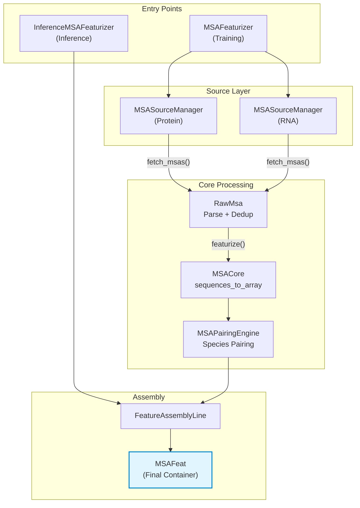
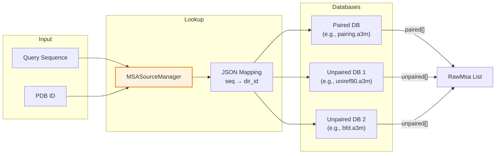

---
slug:15-msa-feature-processing
blog_type:normal
---

多序列比对（MSA）数据包含了进化信号，使 Protenix 能够推断蛋白质和 RNA 链中残基间的共进化约束关系。本页面将深入剖析完整的 MSA 特征化流水线——从解析原始 A3M 文件，到具备物种感知能力的配对比对，再到最终生成供模型输入特征嵌入器（Input Feature Embedder）使用的数值张量。该流水线支持处理三种聚合物类型（蛋白质、DNA、RNA），能够为多链复合物编排跨链配对，并生成针对 GPU 消耗进行过优化的一组紧凑 `int8` 特征数组。

来源：[msa_featurizer.py](/protenix/data/msa/msa_featurizer.py), [msa_utils.py](/protenix/data/msa/msa_utils.py), [constants.py](/protenix/data/constants.py#L320-L369)

## 架构概述

MSA 特征处理流水线由五个概念层组成，各自负责明确的转换阶段。最底层是**编码层**，它利用特定链类型的查找表将 A3M 字符序列映射为整数数组。其上是**来源管理层**，负责处理文件 I/O 以及蛋白质和 RNA 链的多数据库 MSA 检索。**配对引擎**则负责执行具备物种感知能力的跨链比对——这是处理同源和异源寡聚复合物的关键操作。**装配线**负责编排整个流水线，应用截取、合并和深度跟踪等操作。最后，**特征化入口点**为训练和推理场景提供了统一的接口。

来源：[msa_featurizer.py](/protenix/data/msa/msa_featurizer.py#L42-L674), [msa_utils.py](/protenix/data/msa/msa_utils.py#L52-L436)

## 核心编码：从字符到张量

### A3M 格式及其解析

A3M 是整个流水线中使用的标准 MSA 格式。在 A3M 中，大写字符代表相对于查询序列的已比对（匹配）位置，而小写字符代表插入序列（即存在于同源序列中但不存在于查询序列中的残基）。破折号（`-`）表示特定同源序列中缺失的位置。`MSACore` 类提供了基础的解析能力，它将 FASTA/A3M 头部的解析工作委托给 `parse_fasta`，并负责执行从字符串到数值数组的关键转换。

`sequences_to_array` 方法是编码层的核心。它接收一系列已比对的序列字符串和链类型作为输入，返回两个数组：一个 **MSA 数组**（整数编码的残基标识）和一个**删除矩阵**（记录每个已比对位置之前的插入字符数量）。为保证运行性能，该方法采用了**向量化查找表（LUT）方法**：它构建了一个包含 128 个元素的数组，将 ASCII 码值映射为编码值（插入字符映射为 `-1`），随后通过 NumPy 操作处理每条序列，而非使用逐字符的 Python 循环。

<CgxTip>基于 LUT 的向量化操作利用 NumPy 布尔掩码和累加和，取代了复杂度为 O(n×m) 的 Python 字符循环，从而为处理大规模 MSA 带来了显著的加速效果。对 ASCII 编码字符串调用的 `np.frombuffer`，结合 `np.cumsum(~aligned_mask)` 和 `np.diff`，无需任何显式迭代即可精确重建各位置的插入计数。</CgxTip>

来源：[msa_utils.py](/protenix/data/msa/msa_utils.py#L52-L119), [test_msa_encoding.py](/tests/test_msa_encoding.py#L37-L62)

### 特定链类型的编码映射

Protenix 维护着三种截然不同的字符到索引的映射关系，每种映射对应一种聚合物链类型。这些映射定义了 MSA 数组所能包含的词汇表，对于模型下游正确的特征嵌入至关重要。

| 链类型 | 映射表 | 索引范围 | 特殊映射 |
|---|---|---|---|
| 蛋白质 | `MSA_PROTEIN_SEQ_TO_ID` | 0–20, 31 | B→3(D), J/O→20(UNK), U→4(C), Z→6(E) |
| RNA | `MSA_RNA_SEQ_TO_ID` | 21–25, 31 | 非标准碱基 →25(UNK_N), A→21, G→22, C→23, U→24 |
| DNA | `MSA_DNA_SEQ_TO_ID` | 26–30, 31 | 非标准碱基 →30(UNK_DN), A→26, G→27, C→28, T→29 |

破折号（`-`）在所有三种链类型中均映射为索引 **31**，从而保证了统一的空缺表示。模糊的蛋白质代码（代表 Asp/Asn 的 B，代表 Glu/Gln 的 Z，以及代表未知的 J/O）会被归并到最接近的标准等价物上。这种设计确保了 MSA 编码空间与模型的[输入特征嵌入器](12-input-feature-embedder)所使用的 `STD_RESIDUES_WITH_GAP` one-hot 编码（32 类）完全兼容。

来源：[constants.py](/protenix/data/constants.py#L320-L369)

## RawMsa：解析、去重与特征化

`RawMsa` 类封装了单条链的单一 MSA 比对结果。它通过 `from_a3m` 类方法基于 A3M 内容构建，该方法会解析 FASTA 格式的字符串，选择性地应用 `depth_limit`（限制序列数量，例如 RNA 限制为 30,000 条），并选择性执行序列去重。

### 去重策略

去重操作首先使用 `str.translate` 剔除每条序列中所有的小写（插入）字符，然后检查该序列是否已存在于一个 `set` 集合中。这确保了如果两条序列仅在插入内容上存在差异，它们也会被视为相同的序列。未配对 MSA 会启用去重，但**配对 MSA 会禁用此功能**（`dedup=False`），因为配对序列携带着物种标识元数据，在跨链比对时必须予以保留。

### 特征化输出

`featurize()` 方法调用 `MSACore.sequences_to_array` 生成数值化的 MSA 数组和删除矩阵，随后从描述行中提取物种标识符。输出的字典包含四个键：

| 特征 | 形状 | 描述 |
|---|---|---|
| `msa` | `(num_seqs, seq_len)` | 整数编码的已比对残基标识 |
| `deletion_matrix` | `(num_seqs, seq_len)` | 每个已比对位置之前的插入计数 |
| `msa_species_identifiers` | `(num_seqs,)` | 提取出的物种分类 ID（对象数据类型） |
| `num_alignments` | 标量 | 此 MSA 中的序列总数 |

`_verify_query` 方法用于确保第一行 MSA 与查询序列的已比对长度相匹配，从而针对不匹配的 A3M 文件提供了一层安全校验。

来源：[msa_utils.py](/protenix/data/msa/msa_utils.py#L122-L260)

## MSA 来源管理

`MSASourceManager` 类负责基于可配置的索引策略从磁盘检索 MSA 文件。它支持两种索引方法：

- **基于 `sequence`**：直接在 JSON 映射中查找查询序列，以定位 MSA 目录。这是 RNA 链的主要检索方法，也是蛋白质链的默认方法。
- **基于 `pdb_id`**：使用 PDB 标识符作为查找键，适用于预先整理好的训练数据集。

对于**蛋白质链**，该管理器支持检索**已配对**（例如基于 UniProt 的配对数据库）和**未配对**（例如 UniRef、BFD）的 MSA 数据。多个非配对数据库可以指定为以连字符分隔的字符串（例如 `"uniref90-bfd-mgclusters"`），系统会独立搜索每个数据库。对于 **RNA 链**，管理器利用基于序列的查找方式从单一路径加载，并将序列深度限制在 30,000 条。

来源：[msa_featurizer.py](/protenix/data/msa/msa_featurizer.py#L42-L158)

## 基于物种的跨链配对

`MSAPairingEngine` 是 MSA 流水线中算法最为复杂的组件。对于多链复合物（存在多条不同蛋白质链的情况），它会根据共享的物种标识符对不同链的 MSA 行进行对齐，从而生成一个能够捕获链间共进化信号的**配对 MSA**（`msa_all_seq`）。

### 物种识别

系统利用两种正则表达式从 MSA 的描述行中提取物种 ID。`_UNIPROT_REGEX` 用于匹配 UniProt 头部（例如 `tr|Q12345|GENE_HUMAN`），并从条目名称中提取生物体代码。`_UNIREF_REGEX` 用于匹配 UniRef 簇头部（例如 `UniRef100_XYZ_HUMAN`），并提取其分类标识符。如果这两种模式均不匹配，物种 ID 将被设置为空字符串，这实际上会将该序列排除在配对之外。

### 配对算法

`pair_chains_by_species` 方法的操作分为以下几个阶段：

1. **单链物种分组**：对于每条链，按物种 ID 对 MSA 行进行排序，并按物种对行索引进行分组。
2. **跨链物种计数**：统计共享各物种的链数量，以识别存在于多条链上的物种。
3. **排序对齐**：根据跨链计数对物种进行排序（降序）。对于每个物种，`_align_species` 方法会构建一个由 MSA 行索引组成的矩阵，每条链对应一列，对于缺失该物种的链使用 `-1` 进行填充。
4. **质量评分**：使用公式 `np.sum(np.log(np.abs(rows) + 1e-10), axis=1)` 对每一个配对行进行评分——包含 `-1` 较少的行（跨链覆盖更完整）将获得更高的分数。
5. **截断**：最终的配对 MSA 将被截断至 `max_paired` 行（默认值为 `max_msa_size` 的一半）。

<CgxTip>配对引擎应用了一种基于对数的排名机制，天然地偏好具有完整跨链覆盖度的行。其中 `+1e-10` 的微小偏移量用于防止对 `-1` 填充项计算 log(0)，而使用 `np.abs` 则能确保即使索引为负数，其对数运算依然落在有效定义域内。这意味着仅包含单个 `-1`（即缺失一条链）的行依然能获得一个有限且可用于比较的分数，而不是被直接丢弃。</CgxTip>

### 配对后清理

配对完成后，会执行两项清理操作：

- **`cleanup_unpaired_features`**：通过比较行的字节表示，从未配对 MSA 中剔除已经出现在配对 MSA 中的序列，避免数据冗余。
- **`filter_all_gapped_rows`**：从配对 MSA 中移除所有活跃链全为破折号的行，确保没有任何全空的比对行浪费模型的处理容量。

来源：[msa_utils.py](/protenix/data/msa/msa_utils.py#L262-L419)

## FeatureAssemblyLine：六阶段流水线

`FeatureAssemblyLine` 类通过六个阶段，将各链的元数据字典转换为单一的统一 `MSAFeat` 对象：

### 阶段 1：单链特征化

生物聚合体中的每条链都会被独立地特征化。未配对和已配对的 MSA 会通过 `RawMsa.from_a3m` 进行解析，并合并它们 `featurize()` 的输出结果。配对特征会带有 `_all_seq` 后缀（例如 `msa_all_seq`）。逐位置的**分布特征**（profile）被计算为 MSA 各行中残基类型的 one-hot 频率分布：`(msa[..., None] == np.arange(32)).sum(axis=0) / msa.shape[0]`。**平均删除量**（deletion mean）则计算为所有 MSA 行中每个位置的平均删除计数。

### 阶段 2：配对与清理

对于多链复合物，`MSAPairingEngine` 会按物种对齐各链，并移除冗余的未配对序列。单链聚合体则会完全跳过此阶段。

### 阶段 3：全空缺行过滤

在配对 MSA 中，所有活跃链全为破折号的行将被移除。当复合物中某些链缺少 MSA 数据（例如配体或 DNA 链）时，此步骤显得尤为重要。

### 阶段 4：截取与合并

每条链的 MSA 都会被截取，以适应 `max_msa_size` 预算（默认值：16,384）。该预算会在配对和未配对 MSA 之间进行分配：配对序列最多占据 `max_msa_size // 2` 行，剩余空间由未配对序列填补。随后，利用 `MSAPairingEngine.merge_chain_features` 跨链合并这些特征——该操作会将较短链的 MSA 填充至最大深度，并沿着残基维度进行拼接。

### 阶段 5：深度跟踪

流水线会分别跟踪蛋白质和 RNA 链的最大 MSA 深度（`prot_u`, `rna_u`）以及实际的配对深度（`prot_p`）。这些计数会向模型反馈每种链类型的进化信号质量。

### 阶段 6：最终整合

在合并后的 MSA 中，已配对序列（`*_all_seq`）会被置于未配对序列之前，从而创建出一个统一的数组，其中配对行排在最前面。一个**前向兼容补丁**会使用查询行的值填充全空缺的列，确保配体/DNA token 拥有有效的 MSA 表示。最后，应用 `std_idxs` 映射对列进行重新排序，以匹配标准化的残基坐标系，并将所有数组转换为 `int8` 类型。

来源：[msa_featurizer.py](/protenix/data/msa/msa_featurizer.py#L161-L366)

## 最终输出：MSAFeat

`MSAFeat` 数据类是用于存放最终 MSA 特征的不可变容器。其 `to_dict()` 方法负责应用最终的数值转换：

| 输出特征 | 转换逻辑 | 形状 | 数据类型 |
|---|---|---|---|
| `msa` | `clip(rows, -128, 127)` | `(s_total, n_res)` | int8 |
| `msa_mask` | `ones_like(msa)` | `(s_total, n_res)` | bool |
| `deletion_matrix` | `clip(del_matrix, -128, 127)` | `(s_total, n_res)` | int8 |
| `deletion_value` | `arctan(del_matrix / 3.0) × (2/π)` | `(s_total, n_res)` | float32 |
| `has_deletion` | `clip(del_matrix, 0, 1)` | `(s_total, n_res)` | float32 |
| `profile` | 逐位置的残基频率 | `(n_res, 32)` | float32 |
| `deletion_mean` | 逐位置的平均删除计数 | `(n_res,)` | float32 |
| `prot_unpair_num_alignments` | 最大蛋白质未配对深度 | 标量 | int32 |
| `prot_pair_num_alignments` | 蛋白质配对深度 | 标量 | int32 |
| `rna_unpair_num_alignments` | 最大 RNA 未配对深度 | 标量 | int32 |
| `rna_pair_num_alignments` | 固定为 1（无 RNA 配对） | 标量 | int32 |

`deletion_value` 转换利用反正切函数，将无边界的删除计数压缩至平滑的 [-1, 1] 范围内，这使其更适合作为神经网络的输入。`has_deletion` 这一二值指示器提供了一个互补信号，用于捕获每个位置是否存在任何插入事件，而不受具体幅度的影响。

来源：[msa_featurizer.py](/protenix/data/msa/msa_featurizer.py#L526-L556)

## 训练与推理入口点

### MSAFeaturizer（训练）

`MSAFeaturizer` 类在初始化时，需要配置蛋白质和 RNA MSA 数据的路径、索引方法以及配对数据库列表。其 `make_msa_features` 方法接收一个包含原子和 token 数组的 `bioassembly_dict`，解析实体类型（蛋白质、RNA、DNA、配体），通过 `MSASourceManager` 获取 MSA，并委托给 `FeatureAssemblyLine.assemble` 处理。生成的输出字典会被过滤，仅保留供模型嵌入器使用的特征。

### InferenceMSAFeaturizer（推理）

`InferenceMSAFeaturizer` 处理的是不同的输入格式——一个包含生物聚合体实体字典且键名采用驼峰命名法（如 `proteinChain`、`rnaSequence`、`dnaSequence`、`ligand`）的列表。它支持从内联字符串（`unpairedMsa`/`pairedMsa`）、文件路径（`unpairedMsaPath`/`pairedMsaPath`）或传统的 `msa.precomputed_msa_dir` 格式加载 MSA 数据。标志位 `msa_pair_as_unpair` 允许将配对 MSA 合并到未配对数据流中，这适用于在推理期间不需要进行物种级配对的场景。

| 方面 | 训练（`MSAFeaturizer`） | 推理（`InferenceMSAFeaturizer`） |
|---|---|---|
| 输入格式 | 包含原子/token 数组的 `bioassembly_dict` | 实体字典列表（驼峰命名法） |
| MSA 来源 | `MSASourceManager`（基于磁盘） | 内联字符串或文件路径 |
| RNA 支持 | 通过 `enable_rna_msa` 配置 | 由 `use_rna_msa` 标志控制 |
| 输出过滤 | 显式指定的 `keep` 集合 | 完整的 `to_dict()` 输出 |
| 传统支持 | 不适用 | `precomputed_msa_dir` 兜底方案 |

来源：[msa_featurizer.py](/protenix/data/msa/msa_featurizer.py#L369-L523), [msa_featurizer.py](/protenix/data/msa/msa_featurizer.py#L579-L674)

## 坐标映射：桥接 MSA 与 Token 空间

`map_to_standard` 函数构建了一个查找表，将不对称单位残基标识符（`"{asym_id}-{res_id}"`）映射至合并后 MSA 中的标准化列索引。这一映射至关重要，因为装配线按链顺序构建 MSA，而 token 数组可能已经历过截取、重排或链选择操作。通过在装配结束时应用 `merged[f] = merged[f][:, std_idxs]`，流水线确保了 MSA 各列能与下游消耗的 token 级特征完美对齐。

对于非蛋白质实体，前向兼容补丁会使用查询行的编码值填充空缺列，确保配体和 DNA token 获得一致的 MSA 表示（尽管缺乏有效信息），从而避免全空缺的列破坏模型稳定性。

来源：[msa_utils.py](/protenix/data/msa/msa_utils.py#L438-L462), [msa_featurizer.py](/protenix/data/msa/msa_featurizer.py#L330-L353)

## MSA 准备脚本

`scripts/msa/` 目录包含了一个四步流水线，用于从 PDB 结构中准备 MSA 训练数据：

| 步骤 | 脚本 | 用途 |
|---|---|---|
| 1 | `step1-get_prot_seq.py` | 从 mmCIF 文件中提取蛋白质序列 |
| 2 | `step2-get_msa.ipynb` | 针对数据库运行 MSA 搜索（MMseqs2/HHblits） |
| 3 | `step3-uniref_add_taxid.py` | 为 UniRef 条目添加物种分类 ID 注释 |
| 4 | `step4-split_msa_to_uniref_and_others.py` | 将 MSA 拆分为配对（UniRef）和未配对组件 |

此流水线生成的 A3M 文件将用于 `MSASourceManager` 的训练过程。步骤 3 中的物种分类注释至关重要——它提供了物种标识符，使得 `MSAPairingEngine` 中的跨链配对算法得以实现。

来源：[step1-get_prot_seq.py](/scripts/msa/step1-get_prot_seq.py), [step3-uniref_add_taxid.py](/scripts/msa/step3-uniref_add_taxid.py), [step4-split_msa_to_uniref_and_others.py](/scripts/msa/step4-split_msa_to_uniref_and_others.py)

## 延伸阅读

- **[输入特征嵌入器](12-input-feature-embedder)** — 了解 MSA 特征张量如何被嵌入并投影到模型的隐藏维度空间中，以供 Pairformer 架构使用。
- **[特征化流水线](13-featurization-pipeline)** — 理解更广泛的数据流水线是如何将 MSA 特征化与结构、化学及模板特征协同编排的。
- **[模板特征处理](16-template-feature-processing)** — 探索如何利用共享坐标映射基础设施的并行特征化路径来处理模板结构信息。
- **[配置系统](26-configuration-system)** — 学习在训练和推理过程中如何配置与 MSA 相关的参数（如数据库路径、索引方法、深度限制）。