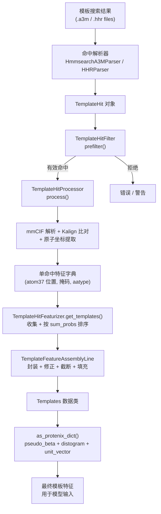
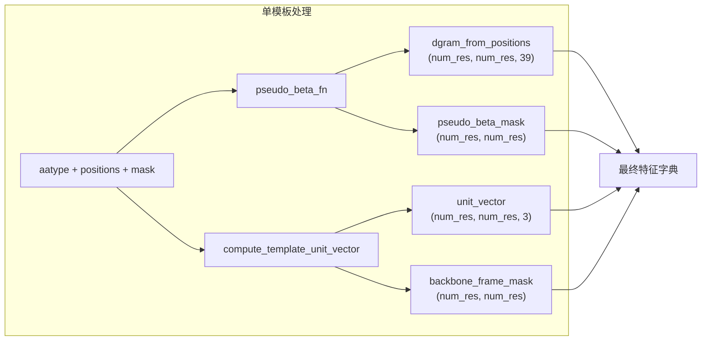

---
slug:16-template-feature-processing
blog_type:normal
---


模板特征处理是 Protenix 中的一个子系统，负责搜索、解析、过滤同源结构模板，并将其转换为模型输入嵌入器可用的张量化特征。结构模板为网络提供了与查询序列具有进化相关性的已知折叠几何先验知识，作为一种结构先验，引导扩散模块生成符合物理规律的构象。本页详细记录了完整的处理流水线——从原始的 hmmsearch 比对结果，到最终输入至 [输入特征嵌入器](12-input-feature-embedder) 的 `template_distogram`、`template_unit_vector` 以及稠密原子特征张量。

来源：[template_featurizer.py](/protenix/data/template/template_featurizer.py#L1-L760), [template_utils.py](/protenix/data/template/template_utils.py#L1-L1054), [template_parser.py](/protenix/data/template/template_parser.py#L1-L745)

## 流水线架构

模板处理流水线包含四个不同阶段，每个阶段由 `protenix/data/template/` 中专门的类负责处理。整体数据流从非结构化的搜索结果（A3M/HHR 文件）开始，经过结构解析与比对，最终转化为多维特征张量。



该流水线由 `TemplateFeaturizer`（训练阶段）或 `InferenceTemplateFeaturizer`（推理阶段）统一调度，两者均将单次命中处理委托给共享的 `TemplateHitFeaturizer`，并将最终组装工作委托给 `TemplateFeatureAssemblyLine`。

来源：[template_featurizer.py](/protenix/data/template/template_featurizer.py#L225-L760), [template_utils.py](/protenix/data/template/template_utils.py#L750-L999)

## 模板命中解析

模板处理的入口是将搜索结果解析为结构化的 `TemplateHit` 对象。Protenix 支持由基于 HMM 的搜索工具生成的两种输入格式。

### TemplateHit 数据结构

每个解析出的命中结果都表示为一个不可变的 `TemplateHit` 数据类，其中包含比对元数据、序列及索引映射：

```python
@dataclasses.dataclass(frozen=True)
class TemplateHit:
    index: int                          # 命中排名索引
    name: str                           # PDB_ID + 链 (例如："1abc_A")
    aligned_cols: int                   # 已比对的列数
    sum_probs: Optional[float]          # 每个位置的概率总和
    query: str                          # 查询序列
    hit_sequence: str                   # 模板命中序列（无空位）
    indices_query: List[int]            # 每个位置的查询残基索引（-1 = 空位）
    indices_hit: List[int]              # 每个位置的模板残基索引（-1 = 空位）
```

`query_to_hit_mapping` 缓存属性从平行的 `indices_query` 和 `indices_hit` 列表中推导出一个干净的 `Dict[int, int]`，并过滤掉空位。此映射是将每个查询残基与其在模板中的结构对应物连接起来的基础数据结构。

来源：[template_parser.py](/protenix/data/template/template_parser.py#L527-L559)

### HmmsearchA3MParser

A3M 解析器用于处理 `hmmsearch` 的结果，这是 Protenix 自动化模板搜索流水线中使用的搜索工具。它读取 FASTA 格式的比对序列，其中大写字符代表匹配/插入列，小写字符代表插入部分。

该解析器利用 NumPy 操作对索引计算进行向量化：将序列转换为字节数组，然后使用布尔掩码区分空位（`-`）、小写插入部分和大写匹配位置。这避免了逐字符的 Python 迭代，在单次向量化传递中生成残基索引列表。

每个命中的描述行通过正则表达式进行解析，提取 `pdb_id`、`chain`、`start`/`end` 位置、`length` 以及自由文本。仅保留描述中包含 `mol:protein` 的命中，从而在解析阶段直接过滤掉核酸命中。

来源：[template_parser.py](/protenix/data/template/template_parser.py#L638-L745), [template_search.py](/runner/template_search.py#L66-L120)

### HHRParser

HHR 解析器用于处理 HHSearch 的输出文件，该文件采用另一种分块结构格式。每个命中以 `No ` 开头的行开始，后跟命中名称、摘要（包含 `Aligned_cols` 和 `Sum_probs`）以及交错的 `Q ` 和 `T ` 比对行。解析器通过拼接多个比对块中的片段来重建完整的查询和模板比对序列，同时保持残基索引的连续性。

来源：[template_parser.py](/protenix/data/template/template_parser.py#L583-L637)

## 命中过滤与预过滤

在提取结构特征之前，每个 `TemplateHit` 都要在 `TemplateHitFilter.prefilter()` 中经历一次预过滤步骤。此步骤可尽早剔除低质量或无效命中，从而避免高昂的 mmCIF I/O 和比对操作开销。

| 过滤条件 | 阈值 | 抛出的异常 | 描述 |
|---|---|---|---|
| PDB 发布日期 | 晚于截止日期 | `DateError` | 防止从查询发布日期之后公布的结构中发生数据泄露 |
| 比对率 | ≤ 0.1 | `AlignRatioError` | 要求至少有 10% 的查询残基被比对 |
| 重复检测 | `t_seq in query_seq` 且占比 > 0.95 | `DuplicateError` | 拒绝几乎完全相同的自身匹配 |
| 最小长度 | < 10 个残基 | `LengthError` | 丢弃过短的无效命中 |
| 废弃的 PDB | 不适用 | （重新映射） | 通过废弃映射表解析已废弃的 PDB ID |

截止日期是动态计算的：在训练阶段，该日期为 `query_release_date - 60 天`（即 `DAYS_BEFORE_QUERY_DATE` 常量），以确保严格的时间隔离。在评估阶段，则固定应用截止日期 `2021-09-30`。未通过预过滤的命中将被记录为警告（非严格模式下）或错误（严格模式下），但绝不会中断处理流程。

经过预过滤后，保留下来的命中会按 `sum_probs` 降序排列。如果设置了 `_shuffle_top_k_prefiltered`（训练时为 20），则会在选择前对前 K 个命中进行随机打乱——这是一种数据增强策略，使模型在不同的 Epoch 中能接触到不同的模板子集。

来源：[template_utils.py](/protenix/data/template/template_utils.py#L289-L380), [template_utils.py](/protenix/data/template/template_utils.py#L990-L1054)

## 结构特征提取

### mmCIF 解析

有效的模板命中需要来自 mmCIF 文件的结构数据。`TemplateParser.parse()` 方法将原始 mmCIF 字符串转换为 `MmcifObject` 实例，其中包含 Biopython 结构对象、链到序列的映射以及残基级别的位置注释。解析过程会提取第一个模型，构建包含已存在和缺失残基的 `seqres_to_structure` 映射，并将三字母氨基酸代码转换为单字母序列。

对于基于 JSON 的模板输入（内联 mmCIF 格式），一个简化的解析器 `parse_simple_cif()` 会处理 mmCIF 可能缺乏完整聚合物元数据的情况——它直接提取第一个可用的链并读取残基。

当模板直接作为 JSON 对象提供（其中包含嵌入的 mmCIF 字符串和明确的查询/模板索引映射）时，会使用另一种简化的 CIF 格式。这种方式将完全绕过 hmmsearch/HHR 的解析过程。

来源：[template_parser.py](/protenix/data/template/template_parser.py#L370-L520), [template_utils.py](/protenix/data/template/template_utils.py#L870-L940)

### 查询到模板的序列比对

mmCIF 解析完成后，会使用 **Kalign**（一款快速多序列比对工具）将查询序列与模板的链序列重新进行比对。`_align_query_to_hit_index_mapping()` 方法会对 `[query_seq, template_seq]` 运行 Kalign，然后逐列遍历已比对的序列，构建一个从查询残基索引到模板残基索引的 `Dict[int, int]` 映射。最低相似度比率检查确保了比对的质量。

这一重新比对步骤至关重要，因为原始的 hmmsearch/HHsearch 比对结果可能无法完美映射到 mmCIF 结构中实际存在的残基——部分残基可能缺失，或者链的实际边界可能与搜索工具报告的不一致。

<CgxTip>重新比对在处理期间使用 `min_ratio` 为 0.0，这意味着它绝不会基于序列同一性来拒绝比对。预过滤步骤已经完成了质量控制。这种设计实现了关注点分离：预过滤检查搜索级别的质量，而重新比对处理结构级别的映射。</CgxTip>

来源：[template_utils.py](/protenix/data/template/template_utils.py#L504-L572)

### 原子坐标提取

`_get_atom_coords()` 方法从解析出的结构中提取特定链的 ATOM37 格式坐标。它遍历各残基，使用 `ATOM37_ORDER` 将每个原子名称映射到其在 37 原子表示中的位置。其中包含对硒代蛋氨酸（MSE）的特殊处理，将其 `SE` 原子映射到 `SD` 位置。精氨酸的 NH1/NH2 原子会根据到 CD 的距离检查是否发生了潜在的互换，并在需要时进行纠正。

提取完成后，可选择通过减去所有存在原子的质心来对位置进行零中心化处理——这一归一化步骤消除了全局平移方差。

`_check_residue_distances()` 验证机制可确保连续的 CA-CA 距离不超过 150 Å（可通过 `max_ca_dist` 配置），从而捕获可能导致产生不合理模板特征的畸形或低分辨率结构。未通过此检查的命中将引发 `CaDistanceError`。

来源：[template_utils.py](/protenix/data/template/template_utils.py#L408-L504), [template_utils.py](/protenix/data/template/template_utils.py#L600-L650)

### 单命中特征字典

`_extract_template_features()` 方法将比对映射与提取的坐标相结合，生成一个以查询残基位置为索引的特征字典。对于映射中的每个 `(query_idx, template_idx)` 对，它会将相应的 atom37 位置、掩码和残基身份复制到与查询序列对齐的输出数组中。未比对的查询位置则接收全零数组和空位残基（`-`）。

生成的特征字典在每个命中中包含以下键：

| 特征键 | 形状 | 类型 | 描述 |
|---|---|---|---|
| `template_all_atom_positions` | `(num_res, 37, 3)` | float32 | 映射到查询的 ATOM37 坐标 |
| `template_all_atom_masks` | `(num_res, 37)` | float32 | 二元存在掩码 |
| `template_aatype` | `(num_res,)` | int32 | 编码后的氨基酸类型 |
| `template_sequence` | 标量 | bytes | 模板序列字符串 |
| `template_domain_names` | 标量 | object | PDB ID + 链标识符 |
| `template_sum_probs` | `[float]` | list | 比对置信度 |
| `template_release_date` | 标量 | object | 发布日期字符串 |

来源：[template_utils.py](/protenix/data/template/template_utils.py#L600-L660), [template_utils.py](/protenix/data/template/template_utils.py#L710-L780)

## 特征组装与转换

### 从 Atom37 到稠密原子表示

`TemplateFeatures.fix_template_features()` 静态方法将原始的 ATOM37 特征转换为 Protenix 内部的稠密原子表示。此转换至关重要，因为模型运行在紧凑的单残基表示之上，而非固定的 37 原子布局。

转换过程使用了 `PROTEIN_AATYPE_DENSE_ATOM_TO_ATOM37`——一个将每种氨基酸类型映射到其相关 ATOM37 位置子集（最多 24 个稠密原子）的查找表。`np.take` 选取每个残基的稠密原子索引，随后 `np.take_along_axis` 从 37 原子数组中提取对应的位置和掩码。掩码缺失处的原子位置会被置零。

发布日期字符串将被转换为 Unix 时间戳，供下游处理使用。

来源：[template_utils.py](/protenix/data/template/template_utils.py#L106-L160)

### TemplateFeatureAssemblyLine

`TemplateFeatureAssemblyLine` 类负责将各链的模板特征进行最终组装，构建为一个经过拼接、填充和索引的张量集，以便模型直接使用。核心操作包括：

1. **实体级缓存**：当多个不对称链共享同一实体（相同序列）时，模板特征仅计算一次并进行复制（`get_safe_entity_id_for_template_copy()`）。
2. **封装**：`package_template_features()` 沿着新的模板维度堆叠单命中的特征字典。
3. **截断**：`_reduce_template_features()` 将模板截断至 `max_templates`（默认为 4）。
4. **填充**：将每条链的模板维度填充至 `max_templates`，以实现拼接。
5. **拼接**：沿着残基维度将所有链的特征合并。
6. **Token 索引**：通过 `standard_token_idxs` 对合并后的特征进行索引，以与模型的 Token 表示对齐。

最终输出是一个 `Templates` 数据类，其中包含形状为 `(max_templates, total_tokens, ...)` 的 `aatype`、`atom_positions` 和 `atom_mask` 张量。

来源：[template_featurizer.py](/protenix/data/template/template_featurizer.py#L103-L210), [template_featurizer.py](/protenix/data/template/template_featurizer.py#L600-L650)

### 成对特征计算

`Templates.as_protenix_dict()` 方法计算输入至模型的最终成对模板特征。对于每个模板，会推导出三种成对表示：

**伪 Beta 直方图**：`pseudo_beta_fn()` 通过 `RESTYPE_PSEUDOBETA_INDEX` 计算伪 Beta 碳位置（非甘氨酸残基使用 Cβ，甘氨酸使用 Cα）。接着使用 `dgram_from_positions()` 将成对距离划分入包含 39 个区间的直方图中，区间边界跨度为 3.25–50.75 Å。该直方图最后会应用二维伪 Beta 掩码进行遮蔽。

**单位向量表示**：`compute_template_unit_vector()` 利用骨架上的 N-Cα-C 原子在每个残基处构建局部参考系，随后将残基间的 Cα-Cα 位移向量表示在各个残基的局部坐标系中。这会为每对残基生成一个三维单位向量，从而同时捕捉距离和角度信息——相比单一的直方图，这是一种更丰富的特征信号。



最终的特征字典包含：

| 特征键 | 形状 | 描述 |
|---|---|---|
| `template_aatype` | `(T, N)` | 模板氨基酸类型 |
| `template_atom_positions` | `(T, N, 24, 3)` | 稠密原子坐标 |
| `template_atom_mask` | `(T, N, 24)` | 稠密原子存在性掩码 |
| `template_pseudo_beta_mask` | `(T, N, N)` | 用于直方图/单位向量的二维掩码 |
| `template_distogram` | `(T, N, N, 39)` | 分桶的距离直方图 |
| `template_unit_vector` | `(T, N, N, 3)` | 局部坐标系位移向量 |
| `template_backbone_frame_mask` | `(T, N, N)` | 用于单位向量的二维掩码 |

来源：[template_featurizer.py](/protenix/data/template/template_featurizer.py#L600-L700), [template_utils.py](/protenix/data/template/template_utils.py#L201-L290)

## JSON 模板格式

在进行推理时，Protenix 支持直接提供作为 JSON 文件的模板，其中需包含嵌入的 mmCIF 字符串及明确的索引映射。这完全绕过了 hmmsearch 流水线，允许用户提供自定义的结构模板。

由 `templatesPath` 引用的 JSON 文件应为模板对象的一个列表，每个对象包含：

```json
[
  {
    "mmcif": "<mmCIF 字符串内容>",
    "queryIndices": [0, 1, 2, 3, ...],
    "templateIndices": [5, 6, 7, 8, ...]
  }
]
```

`parse_json_templates()` 方法对每个条目的处理过程为：通过 `parse_simple_cif()` 解析简化的 mmCIF，使用相同的 `_get_atom_positions()` 流水线提取原子坐标，并根据提供的索引数组将模板位置映射到查询位置。每个模板会获得默认为 1.0 的 `sum_probs` 以及遥远的未来发布日期 `9999-12-31`。

<CgxTip>使用 JSON 模板时，`queryIndices` 和 `templateIndices` 数组的长度必须相等，从而在查询残基和模板残基之间建立一对一的映射。如果查询残基在模板中没有对应的结构部分，请在 `templateIndices` 中使用 `-1`。</CgxTip>

来源：[template_utils.py](/protenix/data/template/template_utils.py#L870-L940), [test_json_template_parser.py](/tests/test_json_template_parser.py#L1-L79), [demo_ab.json](/examples/example_with_json_template/demo_ab.json#L1-L74)

## 训练与推理的路径差异

模板系统在训练和推理环境中的运作方式有所不同：

| 方面 | 训练 (`TemplateFeaturizer`) | 推理 (`InferenceTemplateFeaturizer`) |
|---|---|---|
| 模板来源 | 通过 `TemplateSourceManager` 预计算 | 通过 `templatesPath` 提供的 JSON/A3M/HHR |
| 最大模板数 | 4（包含 dropout 选项） | 4 |
| 日期过滤 | 严格（`query_date - 60 days`） | 无（`max_template_date=None`） |
| 模板 Dropout | 可通过 `template_dropout_rate` 配置 | 不适用 |
| 命中打乱 | 前 20 个打乱（`_shuffle_top_k_prefiltered=20`） | 无 |
| 实体复制 | 缓存共享序列 | 各链独立 |
| 最大模板日期 | `3000-01-01`（通用）或 `2018-04-30`（蒸馏） | `2021-09-30` |

在训练期间，`TemplateFeaturizer.make_template_features()` 方法协调整个流水线：它从生物聚合体元数据中解析实体类型，计算各实体的模板特征（并在相同序列间进行缓存），应用全局模板 Dropout，最后通过 `TemplateFeatureAssemblyLine` 组装多链特征。

在推理期间，`InferenceTemplateFeaturizer.make_template_feature()` 直接从输入的 JSON 中读取模板路径，支持 `.json`、`.hhr` 和 `.a3m` 格式。在线特征生成器会通过相同的 `TemplateHitFeaturizer.get_templates()` 流水线处理命中结果。

来源：[template_featurizer.py](/protenix/data/template/template_featurizer.py#L225-L560), [template_featurizer.py](/protenix/data/template/template_featurizer.py#L670-L760)

## 错误处理架构

模板处理在设计上具备高度的容错性——单个命中解析失败绝不会中断整个流水线。错误层级以 `TemplateError` 为根节点，衍生出 `ParsingError`（结构问题）和 `PrefilterError`（质量问题）。每个处理阶段都会捕获异常，并返回结构化的结果（`SingleHitResult`、`PrefilterResult`、`TemplateSearchResult`），将错误和警告与成功的特征聚合在一起。

当未找到适合某条链的有效模板时，`TemplateFeatures.empty_template_features()` 会生成全掩码的占位特征：零原子位置、零掩码以及空位氨基酸类型。这确保了无论模板是否可用，张量形状都能保持一致，使模型能够优雅地处理无模板预测的情况。

来源：[template_parser.py](/protenix/data/template/template_parser.py#L41-L125), [template_utils.py](/protenix/data/template/template_utils.py#L162-L180)

## 后续步骤

该流水线生成的模板特征将连同 MSA 特征一起，供 [输入特征嵌入器](12-input-feature-embedder) 使用。若要了解更广泛的数据流水线上下文，请参阅 [特征化流水线](13-featurization-pipeline) 和 [MSA 特征处理](15-msa-feature-processing)。如需了解实践中是如何进行模板搜索的，请参阅位于 [template_search.py](/runner/template_search.py) 的模板搜索执行器。