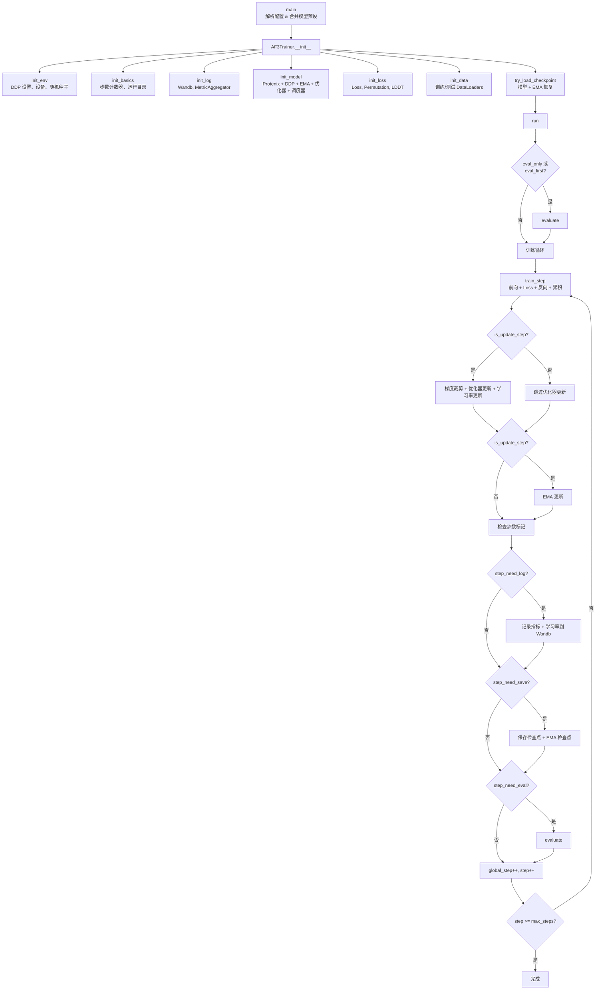
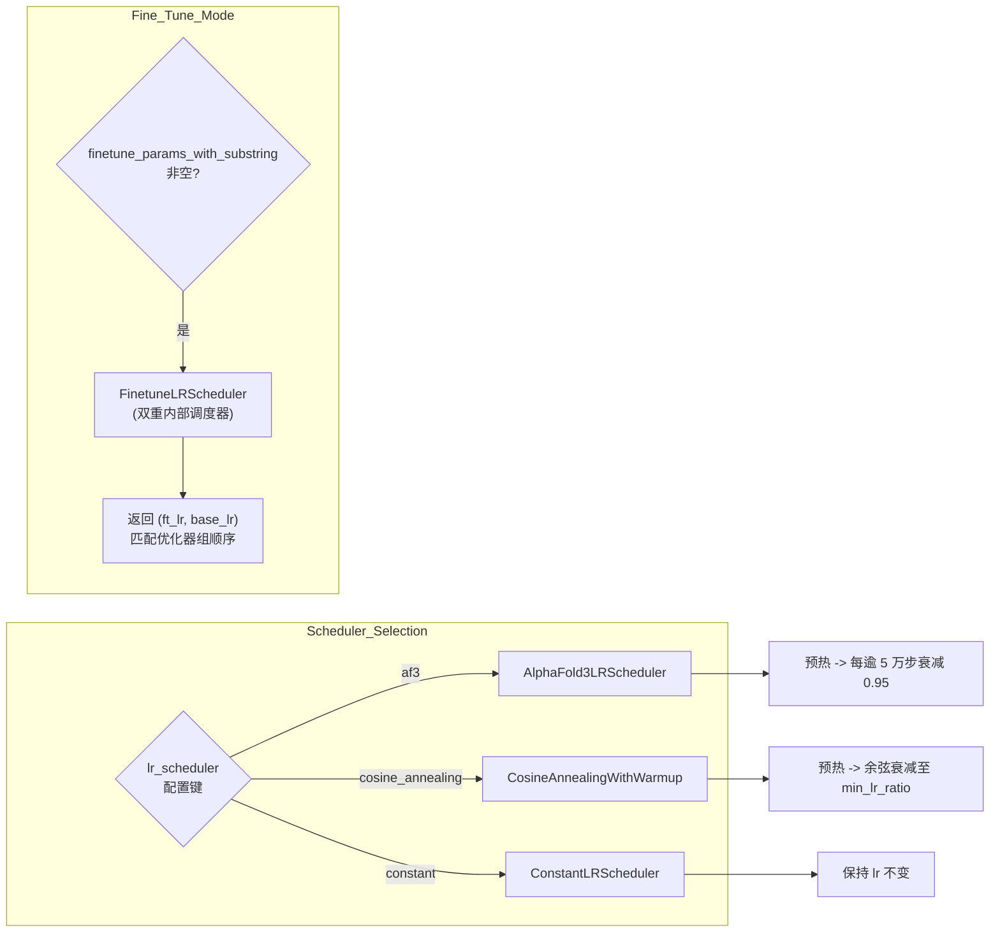
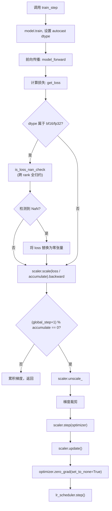

---
slug:17-training-runner
blog_type:normal
---


训练运行器（Training Runner）是一个编排层，负责将原始的 Protenix 模型定义、数据流水线和优化策略转化为可复现的分布式训练流程。它将完整的训练生命周期——从环境初始化、检查点管理，到梯度累积、评估以及 EMA 权重追踪——全部封装在一个内聚的 `AF3Trainer` 类中。本文将深入剖析该运行器的架构、内部状态机，以及控制训练行为各个层面的配置参数。

## 架构概述

位于 [train.py](/runner/train.py) 的 `AF3Trainer` 类是训练的唯一入口。它遵循严格的初始化序列，随后进入一个数据驱动的循环，交替执行前向/反向传播、定期评估、检查点保存和指标记录。该运行器不感知模型内部细节——它将这些操作委托给 `Protenix`、`ProtenixLoss`、`LDDTMetrics` 和 `SymmetricPermutation`——而是将精力完全集中在训练编排的机制上。



来源: [train.py](/runner/train.py#L62-L71), [train.py](/runner/train.py#L659-L731)

## 初始化序列

`__init__` 方法会按顺序执行七个阶段。每个阶段都对应一个独立的方法，使得初始化契约清晰且易于测试。

| 阶段 | 方法 | 职责 |
|-------|--------|----------------|
| 1. 环境 | `init_env` | NCCL 进程组、CUDA 设备绑定、基于 rank 的特定随机种子初始化 |
| 2. 基础 | `init_basics` | 步数计数器、带时间戳的运行目录树、配置序列化 |
| 3. 日志 | `init_log` | WandB 项目初始化、用于训练指标的 `SimpleMetricAggregator` |
| 4. 模型 | `init_model` | Protenix 实例化、DDP 包装、EMA 注册、优化器 + 调度器 |
| 5. 损失 | `init_loss` | `ProtenixLoss`, `SymmetricPermutation`, `LDDTMetrics` |
| 6. 数据 | `init_data` | 通过 `get_dataloaders` 获取训练和测试 `DataLoader` 集 |
| 7. 检查点 | `try_load_checkpoint` | 恢复模型权重、优化器状态、调度器状态、EMA 影子权重 |

### 分布式环境设置

运行器通过位于 [distributed.py](/protenix/utils/distributed.py#L24-L46) 的 `DistWrapper` 单例，从标准环境变量（`RANK`、`LOCAL_RANK`、`WORLD_SIZE`、`LOCAL_WORLD_SIZE`）中读取进程拓扑结构。当 `world_size > 1` 时，将初始化一个带有可配置超时时间（默认为 600 秒）的 NCCL 进程组。每个 rank 通过对基础种子和 rank 进行 SHA-256 哈希运算来派生自己的随机种子，确保不同工作进程间的数据打乱和增强操作相互独立，同时在开启 `deterministic_seed` 时保证全局可复现性。

<CgxTip>当 `deterministic_seed=False`（默认值）时，每个 DDP rank 都会获得一个派生自 `SHA-256(base_seed, rank)` 的唯一种子。这是刻意为之的——它能最大化分布式批次间的数据多样性。仅在你需要跨 rank 实现严格的比特级可复现性时，才设置 `deterministic_seed=True`。</CgxTip>

来源: [train.py](/runner/train.py#L129-L177), [distributed.py](/protenix/utils/distributed.py#L24-L46)

### 目录结构与配置持久化

`init_basics` 会在 `base_dir` 下创建一个带时间戳的运行目录，该目录包含六个子目录：

```
{base_dir}/{run_name}_{YYYYmmdd_HHMMSS}/
├── config.yaml          # 冻结的配置快照
├── checkpoints/         # .pt 检查点文件
├── predictions/         # 评估预测转储
├── structures/          # 结构输出 (CIF/PDB)
├── dumps/               # 中间调试转储
└── errors/              # 失败样本的错误日志
```

只有 rank 0 会创建目录并通过 `save_config` 序列化完整配置，以此防止竞争条件。运行名称会通过 `all_gather_object` 在所有 rank 间同步。

来源: [train.py](/runner/train.py#L72-L114)

## 模型初始化与 DDP

`init_model` 方法会实例化原始的 `Protenix` 模型，随后根据具体情况决定是否使用 PyTorch 的 `DistributedDataParallel` 对其进行包装。DDP 配置使用了 `static_graph=True` 以兼容梯度检查点机制（`find_unused_parameters` 标志可配置，但默认为 `False`）。DDP 包装意味着后续对模型参数的所有访问都需要添加 `module.` 前缀——加载检查点时会根据需要透明地添加或移除该前缀，从而规避了这一限制。

模型创建后，可以选择性地注册 EMA（具备可配置的衰减率，默认通过 `ema_decay=-1.0` 禁用），并随之初始化优化器和学习率调度器。

来源: [train.py](/runner/train.py#L189-L232)

## 优化器配置

Protenix 支持两种优化器路径，由 `adam.use_adamw` 标志控制。位于 [training.py](/protenix/utils/training.py#L73-L115) 的 `get_optimizer` 函数充当调度入口。

### 带权重衰减分组的 AdamW

当 `use_adamw=True` 时，优化器会应用广为人知的参数分组启发式策略：所有维度 ≥ 2 的参数（权重矩阵、词嵌入）会进行权重衰减，而 1 维参数（偏置、LayerNorm 缩放因子）则豁免。在 CUDA 环境下，会自动使用融合的 AdamW 内核。

### 带微调参数分组的原生 Adam

当 `use_adamw=False`（基础训练的默认选项）时，将使用标准的 `torch.optim.Adam`。关键在于，它引入了**基于参数组的差分学习率**，以支持微调。当 `finetune_params_with_substring` 包含非空字符串时，运行器会将模型参数划分为两组：

| 参数组 | 学习率 | 用途 |
|----------------|---------------|---------|
| 微调参数（匹配任一子串） | `configs.finetune.lr` | 新增模块（例如，约束嵌入器） |
| 其他所有参数 | `configs.lr` | 预训练主干网络（当 `configs.lr > 0.0` 时生效） |

此机制允许以较高的学习率选择性训练新增模块，同时保持主干网络不变（或冻结）。约束模型（`protenix_base_constraint_v0.5.0`）就利用了该机制，使用四个子串来精准定位约束嵌入器模块。

来源: [training.py](/protenix/utils/training.py#L21-L115), [configs_model_type.py](/configs/configs_model_type.py#L187-L192)

## 学习率调度器

运行器通过 [lr_scheduler.py](/protenix/utils/lr_scheduler.py) 支持三大类学习率调度器，并由 `lr_scheduler` 配置键进行选择。

### AlphaFold3 阶梯式衰减调度器

默认的 `af3` 调度器实现了 AlphaFold3 第 5.4 节描述的调度策略：先进行 `warmup_steps` 的线性预热，随后每 `decay_every_n_steps`（50,000）步按 `decay_factor`（0.95）进行指数衰减。这会生成一个阶梯状的下降曲线。

### 带预热的余弦退火

`cosine_annealing` 调度器在 `warmup_steps` 到 `max_steps` 之间，提供从 `lr` 平滑过渡到 `lr * min_lr_ratio` 的余弦衰减。这是微调配置中的默认调度器。

### 微调双调度器

`FinetuneLRScheduler` 封装了两个内部调度器——一个用于基础学习率，另一个用于微调学习率——并按照与优化器参数组相匹配的顺序返回这两个值。这确保了主干网络和微调参数能够各自遵循独立的衰减计划。



来源: [lr_scheduler.py](/protenix/utils/lr_scheduler.py#L22-L186), [train.py](/runner/train.py#L234-L254)

## 指数移动平均 (EMA)

位于 [ema.py](/runner/ema.py) 的 `EMAWrapper` 维护着所有模型参数的**影子副本**，并通过以下递推公式进行更新：

```
shadow_new = (1 - decay) * param_current + decay * shadow_old
```

该包装器采用三阶段协议运行——**注册**、**更新** 和 **应用影子/恢复**：

| 阶段 | 方法 | 描述 |
|-------|--------|-------------|
| 注册 | `register()` | 将所有模型参数克隆到 `self.shadow` 字典中 |
| 更新（每次优化器更新） | `update()` | 应用 EMA 递推公式；支持通过 `mutable_param_keywords` 进行关键字过滤 |
| 评估 | `apply_shadow()` | 将模型权重置换为影子权重；备份原始权重 |
| 恢复 | `restore()` | 从备份恢复权重；清除备份字典 |

`mutable_param_keywords` 特性支持选择性 EMA：当其非空时，只有名称中包含至少一个指定关键字的参数才会被 EMA 跟踪。当某些模块（例如，新初始化的约束嵌入器）不应继承预训练统计数据时，此功能非常实用。

在训练过程中，EMA 更新**仅在发生实际的优化器步骤时**（即梯度累积完成后）才会执行，而不是在每个微批次上执行。在评估期间，原始模型和 EMA 模型都会被评估，且 EMA 的指标会带有 `ema{decay}_` 前缀。两者的检查点都会被保存，其中 EMA 检查点会添加 `_ema_{decay}` 后缀。

来源: [ema.py](/runner/ema.py#L20-L86), [train.py](/runner/train.py#L486-L491), [train.py](/runner/train.py#L711-L718)

## 训练步机制

位于 [train.py](/runner/train.py#L576-L628) 的 `train_step` 方法实现了单个微批次的前向/反向传播。计算精度由 `dtype` 配置键控制（默认为 `bf16`），并通过 `torch.autocast` 应用。`GradScaler` 负责处理梯度缩放，以保证数值稳定性。

### 梯度累积

运行器通过 `iters_to_accumulate`（默认为 1）支持梯度累积。系统区分了两种步数计数器：

| 计数器 | 语义 | 递增时机 |
|---------|-----------|-----------------|
| `global_step` | 已处理的微批次总数 | 每次 `train_step` 调用时 |
| `step` | 有效的优化器更新次数 | 仅当 `global_step % iters_to_accumulate == 0` 时 |

优化器、梯度裁剪器、学习率调度器和 EMA 包装器仅在实际更新步骤（即 `global_step` 为 `iters_to_accumulate` 的倍数）时被调用。所有的评估、记录日志和检查点保存间隔均以**有效步数**为基准进行设定。

### NaN 损失防护

对于 `bf16` 和 `fp32` 精度模式，运行器会调用 `is_loss_nan_check`，它会在各个 rank 之间执行全归约操作，以检测损失张量中是否存在 NaN/Inf。如果任何 rank 产生了无效损失，该损失将被替换为零张量（且 `requires_grad=True`），从而在不导致分布式任务崩溃的情况下，有效地跳过该微批次。



来源: [train.py](/runner/train.py#L576-L628), [training.py](/protenix/utils/training.py#L118-L144)

## 评估流水线

`evaluate` 方法负责统筹所有测试数据加载器的评估工作。当启用 EMA 时，它会对标准模型和 EMA 影子模型均进行评估，通过 `apply_shadow`/`restore` 实现权重互换。为了提高效率，可以使用 `eval_ema_only` 标志将评估限制在仅 EMA 模型上。

### 单批次评估流程

对于每个测试批次，评估过程会在 `torch.no_grad()` 下执行四个顺序操作：

1. **模型前向传播** — 执行 `model_forward(mode="eval")`，并按 `mc_dropout_apply_rate`（默认 0.4）应用蒙特卡洛 Dropout
2. **计算损失** — 执行 `get_loss(mode="eval")`，用于监控无梯度下的损失
3. **LDDT 指标** — 通过 `get_metrics` 根据预测值和标签计算每个结构的 lDDT
4. **指标聚合** — 通过 `aggregate_metrics` 将 lDDT 与置信度摘要合并

评估循环包含分布式去重逻辑：当 DataLoader 中的 `drop_last=False` 时，最后一批可能包含跨 rank 的重复样本。运行器会收集所有已评估的 `pdb_id` 值，并剔除最后一个批次中的重复项。

### 指标聚合与日志记录

位于 [metrics.py](/protenix/utils/metrics.py#L30-L74) 的 `SimpleMetricAggregator` 会按命名空间累积指标值，并计算聚合统计信息（默认为平均值）。在分布式环境中，它会通过 `all_gather_object` 跨 rank 汇总所有指标数据，然后再计算最终平均值，从而确保统计是基于全局而非单个 rank 的。计算结果会被记录到 WandB（仅限 rank 0），并使用测试数据集名称作为键的命名空间。

来源: [train.py](/runner/train.py#L477-L565), [metrics.py](/protenix/utils/metrics.py#L30-L74)

## 检查点管理

检查点系统负责处理保存、加载以及细粒度的选择性恢复。每个检查点都是一个字典，包含四个键：`model`（state_dict）、`optimizer`（state_dict）、`scheduler`（state_dict 或 None）以及 `step`（整数）。

### 保存

`save_checkpoint` 仅在 rank 0 上运行。它会将完整的模型状态字典（包含 DDP 的 `module.` 前缀）、优化器状态、调度器状态以及当前步数序列化保存。当启用 EMA 时，会额外保存一个应用了 EMA 权重的检查点，并添加 `_ema_{decay}` 后缀。

### 加载与选择性恢复

内部的 `_load_checkpoint` 函数提供了五个布尔标志，用于精细化控制：

| 标志 | 默认值 | 为 True 时的效果 |
|------|---------|-----------------|
| `load_params_only` | `True` (取自配置) | 跳过优化器、调度器和步数的恢复 |
| `skip_load_optimizer` | `False` | 不加载优化器状态字典 |
| `skip_load_step` | `False` |不从检查点推进 `self.step` |
| `skip_load_scheduler` | `False` | 不加载调度器状态字典 |
| `load_step_for_scheduler` | `False` | 从已加载的步数重新初始化调度器（需确保步数已加载） |

运行器还会透明地处理 DDP 前缀不匹配的问题：如果检查点是在 DDP 环境下保存的（带有 `module.` 前缀），而当前运行为单 GPU 环境，则在调用 `load_state_dict` 之前会自动去除该前缀。`load_strict` 标志（默认为 `True`）控制是否对缺失或意外的键抛出错误——在基于不同架构的模型（例如，新增了约束嵌入器）进行微调时，应将其设置为 `False`。

EMA 检查点通过 `load_ema_checkpoint_path` 独立加载，且始终仅加载参数，随后调用 `ema_wrapper.register()` 初始化影子权重。

来源: [train.py](/runner/train.py#L267-L374)

## 主训练循环

位于 [train.py](/runner/train.py#L659-L731) 的 `run` 方法是总调度器。它会无限循环地处理训练数据加载器（外层 `while True` 结合内层 `for batch`），直到达到 `step >= max_steps` 条件才跳出。系统会针对每个微批次计算四个布尔标志，以决定是否执行周期性操作：

| 标志 | 条件 (基于有效步数) | 动作 |
|------|-------------------------------|--------|
| `step_need_log` | `(step + 1) % log_interval == 0` | 计算并记录训练指标、学习率到 WandB |
| `step_need_save` | `(step + 1) % checkpoint_interval == 0` | 保存模型 + EMA 检查点 |
| `step_need_eval` | `(step + 1) % eval_interval == 0` | 在所有测试集上执行全面评估 |
| `is_last_step` | `(step + 1) == max_steps` | 强制执行日志记录、保存和评估 |

所有周期性操作均受 `is_update_step` 标志控制——它们只会在累积周期的最后一个微批次触发。`progress_bar` 方法会在 rank 0 上管理一个 tqdm 进度条，该进度条每 `eval_interval` 个有效步就会重置一次。

### `main()` 中的配置合并

入口函数 [main()](/runner/train.py#L734-L794) 会执行三趟配置合并：

1. **基础 + 数据** — 将 `configs_base` 与 `data_configs` 合并，并解析命令行参数以提取 `model_name`
2. **模型预设** — 将 `configs_model_type.py` 中所选模型的预设深合并到基础配置中
3. **命令行覆盖** — 重新解析命令行参数，其优先级最高，能够覆盖基础配置和模型预设

这确保了特定于模型的覆盖配置（例如，`N_cycle`、`N_step`、模板嵌入器模块）会被优先应用，随后命令行参数仍可以对它们进行覆盖。环境变量 `TRIANGLE_ATTENTION` 和 `TRIANGLE_MULTIPATIVE` 也会在解析配置前注入内核后端选择。

来源: [train.py](/runner/train.py#L659-L731), [train.py](/runner/train.py#L734-L794)

## 启动训练

### 从头开始训练

[train_demo.sh](/train_demo.sh) 脚本提供了一个具有代表性的启动命令：

```bash
python3 ./runner/train.py \
  --run_name protenix_train \
  --model_name "protenix_base_default_v1.0.0" \
  --base_dir ./output \
  --dtype bf16 \
  --diffusion_batch_size 48 \
  --ema_decay 0.999 \
  --train_crop_size 384 \
  --max_steps 100000 \
  --warmup_steps 2000 \
  --lr 0.001 \
  --model.N_cycle 4 \
  --sample_diffusion.N_step 20 \
  --triangle_attention "cuequivariance" \
  --triangle_multiplicative "cuequivariance" \
  --data.train_sets weightedPDB_before2109_wopb_nometalc_0925 \
  --data.test_sets recentPDB_1536_sample384_0925,posebusters_0925
```

请注意训练模式下的参数覆盖：为了提升训练时的计算效率，`N_cycle=4` 和 `N_step=20` 被设置得低于推理阶段的默认值（分别为 10 和 200），因为这两个参数控制着前向传播中结构回收周期和扩散去噪步骤的数量。

### 微调

[finetune_demo.sh](/finetune_demo.sh) 脚本额外增加了检查点加载的逻辑：

```bash
python3 ./runner/train.py \
  --model_name "protenix_base_default_v1.0.0" \
  --load_checkpoint_path ${checkpoint_path} \
  --load_ema_checkpoint_path ${checkpoint_path} \
  --data.train_sets weightedPDB_before2109_wopb_nometalc_0925 \
  --data.weightedPDB_before2109_wopb_nometalc_0925.base_info.pdb_list examples/finetune_subset.txt \
  ...
```

微调脚本会从同一个预训练模型文件中同时加载标准检查点和 EMA 检查点，并可通过 `pdb_list` 选择性地将训练集限制为一个子集。

<CgxTip>在使用新模块（例如，约束嵌入器）进行微调时，请设置 `--load_strict False`，并在 `--finetune_params_with_substring` 中填入新模块的名称。这将启用差分学习率机制——新增模块将按 `finetune.lr` 进行训练，而主干网络则使用基础 `lr`（若设 `lr=0` 则被冻结）。</CgxTip>

来源: [train_demo.sh](/train_demo.sh#L24-L47), [finetune_demo.sh](/finetune_demo.sh#L26-L51)

## 关键配置参考

下表汇总了来自 [configs_base.py](/configs/configs_base.py) 中影响最为显著的核心训练参数：

| 参数 | 默认值 | 范围 / 类型 | 作用 |
|-----------|---------|-------------|--------|
| `max_steps` | 必填项 | int | 终止训练前需执行的有效优化器总步数 |
| `iters_to_accumulate` | 1 | int | 梯度累积倍数，用于实现更大的有效批次 |
| `diffusion_batch_size` | 48 | int | 每批次的扩散样本数（批次内并行度） |
| `train_crop_size` | 256 | int | 训练时的空间裁剪尺寸（以 token 为单位），权衡内存与上下文长度 |
| `dtype` | `bf16` | `fp32`/`bf16`/`fp16` | 混合精度训练数据类型 |
| `ema_decay` | -1.0 (禁用) | float < 1.0 | EMA 影子权重衰减率；启用时通常设为 0.999 |
| `grad_clip_norm` | 10.0 | float | 裁剪所允许的最大梯度范数 |
| `blocks_per_ckpt` | 1 | int 或 null | 激活检查点粒度（null = 禁用） |
| `find_unused_parameters` | False | bool | DDP 的 `find_unused_parameters` 标志 |
| `mc_dropout_apply_rate` | 0.4 | float | 评估期间的蒙特卡洛 Dropout 概率 |

来源: [configs_base.py](/configs/configs_base.py#L23-L135)

## 后续步骤

- **[损失函数](20-loss-functions)** — 深入探讨 `ProtenixLoss` 以及运行器每步调用的多项损失组合（扩散 MSE、距离图、置信度、键长键角违规惩罚）。
- **[推理运行器](18-inference-runner)** — 了解相同的 `Protenix` 模型如何在没有训练循环的情况下被加载、包装并执行结构预测。
- **[扩散采样与生成器](19-diffusion-sampling-and-generator)** — 探索在前向传播训练和推理过程中运作的噪声调度、去噪循环以及 TFG 引导机制。
- **[配置系统](26-configuration-system)** — 纵览 `configs_base`、`configs_data` 和 `configs_model_type` 的完整层级架构，包括 `GlobalConfigValue` 解析机制和命令行参数解析。