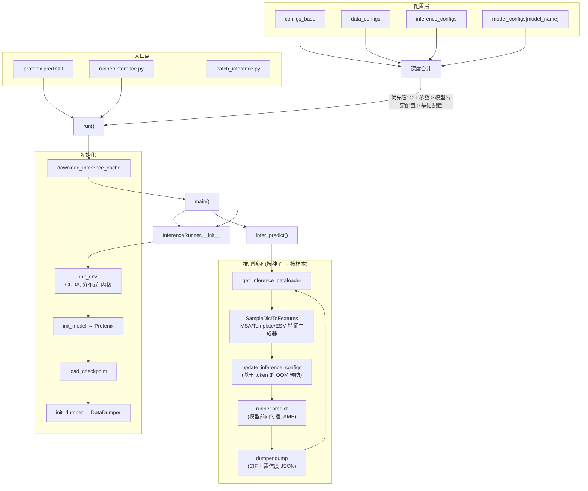
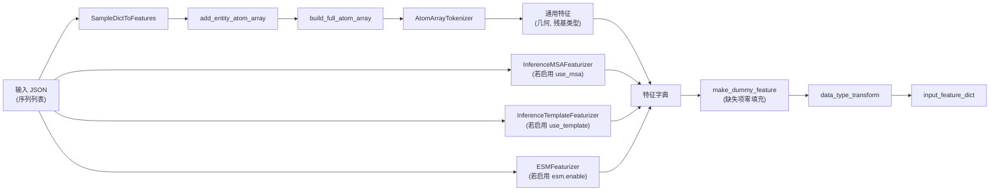

---
slug:18-inference-runner
blog_type:normal
---


推理运行器（Inference Runner）是 Protenix 的生产级预测流水线——负责编排从解析 JSON 输入、特征提取、模型前向传播，直到输出 CIF/JSON 文件的整个生命周期。它是所有结构预测任务的唯一入口，无论你通过 `protenix pred` CLI 命令、原生的 `runner/inference.py` 脚本，还是通过 `batch_inference` API 以编程方式调用，都需要经由该模块。

## 架构概述

推理流水线遵循严格的分层架构：**配置解析 → 环境与模型初始化 → 数据特征化 → 模型前向传播 → 预测结果转储**。各层之间通过定义良好的接口实现解耦，既支持独立的纯 GPU 推理（通过 `runner/inference.py`），也支持包含自动化 MSA/模板/RNA-MSA 搜索的完整端到端处理流程（通过 `runner/batch_inference.py`）。



来源：[inference.py](runner/inference.py#L580-L662), [inference.py](runner/inference.py#L418-L535), [infer_dataloader.py](protenix/data/inference/infer_dataloader.py#L41-L67)

## 配置解析与深度合并

`run()` 函数实现了一种**三段式配置解析策略**，以确保每一层都具有可预测的优先级。第一阶段解析原始 CLI 参数以提取模型名称。第二阶段将来自 `model_configs[model_name]` 的模型特定配置深度合并到合并后的基础配置中。第三阶段以最高优先级重新应用 CLI 参数，确保用户指定的参数始终生效。

```python
# 第一阶段：从 CLI 参数中提取 model_name
configs = parse_configs(configs={**configs_base, **{"data": data_configs}, **inference_configs}, ...)

# 第二阶段：深度合并模型特定默认配置
deep_update(base_configs, model_specs[model_name])

# 第三阶段：以最高优先级重新应用 CLI 参数
configs = parse_configs(configs=base_configs, ...)
```

推理特定的默认配置定义了核心操作行为：

| 参数 | 默认值 | 用途 |
|-----------|---------|---------|
| `model_name` | `protenix_base_default_v1.0.0` | 选择模型检查点 |
| `seeds` | `[101]` | 用于可复现扩散采样的随机种子 |
| `dump_dir` | `./output` | 预测输出的根目录 |
| `need_atom_confidence` | `False` | 是否保存逐原子置信度 JSON 文件 |
| `sorted_by_ranking_score` | `True` | 按总体置信度得分对输出样本进行排名 |
| `use_msa` | `True` | 启用蛋白质 MSA 特征 |
| `use_template` | `False` | 启用模板特征（仅限 v1.0.0+） |
| `use_rna_msa` | `False` | 启用 RNA MSA 特征（仅限 v1.0.0+） |
| `use_seeds_in_json` | `False` | 优先使用 JSON 内嵌的 `modelSeeds` 覆盖 CLI 种子 |
| `enable_tf32` | `True` | TF32 Tensor Core 加速 |
| `enable_efficient_fusion` | `True` | 扩散 Transformer 层融合 |
| `enable_diffusion_shared_vars_cache` | `True` | 跨样本缓存共享的扩散变量 |

配置解析完成后，针对计算能力为 7.x 的设备（如 V100 系列 GPU），GPU 兼容性检查（`update_gpu_compatible_configs`）会自动将计算降级为 FP32 并使用 PyTorch 原生内核，因为这些设备缺乏对高效 BF16 和自定义内核的支持。

来源：[inference.py](runner/inference.py#L580-L662), [configs_inference.py](configs/configs_inference.py#L22-L39), [inference.py](runner/inference.py#L548-L577)

## 模型特定配置方案

每个模型变体都携带自身的架构超参数，用于覆盖基础默认值。该配置方案系统定义了 Pairformer 循环数、扩散步数、ESM 集成标志以及结构维度。

| 模型 | N_cycle | N_step (扩散) | 核心特性 | 参数量 |
|-------|---------|-------------------|--------------|------------|
| `protenix_base_default_v1.0.0` | 10 | 200 | 模板（2 个 embedder 模块），RNA MSA | 368.48M |
| `protenix_base_20250630_v1.0.0` | 10 | 200 | 模板，RNA MSA（截止日期 2025-06-30） | 368.48M |
| `protenix-v2` | 10 | 200 | 缩放版 (c_z=256, 64 扩散批次) | 464.44M |
| `protenix_base_default_v0.5.0` | 10 | 200 | 仅 MSA | 368.09M |
| `protenix_base_constraint_v0.5.0` | 10 | 200 | MSA + 约束 (口袋/接触/子结构/contact_atom) | 368.30M |
| `protenix_mini_esm_v0.5.0` | 4 | 5 | ESM-2 (3B), 无 MSA | 135.22M |
| `protenix_mini_ism_v0.5.0` | 4 | 5 | ISM-2 (3B), 无 MSA | 135.22M |
| `protenix_mini_default_v0.5.0` | 4 | 5 | MSA, 16 个 Pairformer 模块 | 134.06M |
| `protenix_tiny_default_v0.5.0` | 4 | 5 | MSA, 8 个 Pairformer 模块 | 109.50M |

<CgxTip>微型 (mini) 和极小 (tiny) 模型大幅减少了扩散步数（5 对 200）和 Pairformer 循环数（4 对 10），并设置 `gamma0=0` 和 `step_scale_eta=1.0`，通过牺牲结构精度换取约 40 倍的采样加速。建议在进行快速筛选时选择此类模型；若需获得生产级预测质量，请切换至 base/v1.0.0 模型。</CgxTip>

来源：[configs_model_type.py](configs/configs_model_type.py#L51-L316)

## InferenceRunner 初始化生命周期

`InferenceRunner.__init__` 方法按顺序执行四个初始化阶段，每个阶段都为下一个阶段建立关键依赖：

**第一阶段 —— 环境 (`init_env`)**：检测 CUDA 可用性，基于 `DIST_WRAPPER.local_rank` 设置设备位置，为多 GPU 推理初始化 NCCL 进程组，并验证特定内核的依赖要求（例如用于 DeepSpeed 三角注意力机制的 `CUTLASS_PATH`）。同时也会标记 FastLayerNorm 内核进行编译。

**第二阶段 —— 基础设施 (`init_basics`)**：创建输出目录结构——用于存放预测结果的 `dump_dir`，以及用于捕获推理期间各样本错误日志的 `ERR` 子目录。

**第三阶段 —— 模型 (`init_model` + `load_checkpoint`)**：在目标设备上实例化 `Protenix` 模型，随后从 `{load_checkpoint_dir}/{model_name}.pt` 加载检查点权重。带有 `module.` 前缀的 DDP 保存的检查点会被自动剥离。`strict` 加载模式（可按模型配置）可确保架构保真度，并会输出参数量以供验证。

**第四阶段 —— 转储器 (`init_dumper`)**：使用原子置信度和排名分数排序偏好初始化 `DataDumper`，准备好将预测结果序列化至磁盘。

来源：[inference.py](runner/inference.py#L64-L200)

## 自动下载检查点与数据缓存

`download_inference_cache` 函数实现了对推理所需所有外部依赖的按需获取。它支持下载四类核心文件，并在下载后通过加载模型检查点来验证文件完整性：

1. **数据缓存**：CCD 组件文件（`ccd_components_file`、`ccd_components_rdkit_mol_file`）、PDB 聚类文件及已废弃的发布数据
2. **模板缓存**（取决于 `use_template`）：已废弃的 PDB 映射和发布日期文件
3. **模型检查点**：从分发 URL 下载 `{model_name}.pt`
4. **ESM/ISM 检查点**（取决于模型类型）：ESM2-3B 权重和接触回归头

每次下载均经过验证——对于模型检查点，会尝试使用 `weights_only=False` 执行 `torch.load`，若失败则删除该文件，以防止出现损坏的状态。

来源：[inference.py](runner/inference.py#L291-L383)

## 推理数据流水线与特征化

`InferenceDataset` 类将原始 JSON 输入转换为模型可用的特征张量。该数据集负责在线执行五种模态的特征化处理，这些操作均在调用 `__getitem__` 时惰性触发：



`process_one` 方法是特征化处理的核心调度器。它首先实例化 `SampleDictToFeatures`，将 JSON 实体描述（蛋白质链、DNA/RNA 序列、配体、离子）解析为统一的 `AtomArray`，对其进行分词并提取几何特征。MSA 特征通过 `InferenceMSAFeaturizer.make_msa_feature` 生成，模板特征通过 `InferenceTemplateFeaturizer.make_template_feature` 生成（该步骤可选择性地触发远程 mmCIF 拉取），而 ESM 嵌入则通过 `ESMFeaturizer` 生成（在特征化之前预先计算批量嵌入）。

对于缺失的特征，系统会通过 `make_dummy_feature` 进行平滑处理，将缺失模态的张量填充为零，从而允许模型在部分输入下运行。配置为 `shuffle=False` 的 `DistributedSampler` 确保了在多 GPU 场景下，样本到 GPU 的分配方式是确定性的。

来源：[infer_dataloader.py](protenix/data/inference/infer_dataloader.py#L70-L295), [json_to_feature.py](protenix/data/inference/json_to_feature.py#L37-L175)

## 推理循环：种子迭代与自适应配置

`infer_predict` 函数以**外层遍历种子、内层遍历样本**的迭代模式驱动核心预测循环。对于每一个种子，整个数据集都会被完整遍历，以确保在给定种子下所有样本共享相同的随机初始化状态。这种设计支持跨种子的集成式置信度评估。

一个关键的自适应机制是 `update_inference_configs`，它会根据 Token 数量动态调整混合精度设置，以防止内存溢出 (OOM)：

| Token 范围 | `skip_amp.confidence_head` | `skip_amp.sample_diffusion` | 原理说明 |
|-------------|---------------------------|----------------------------|-----------|
| > 3840 | `False` | `False` | 完全 FP32 —— 内存占用最大，但可避免数值问题 |
| 2561–3840 | `False` | `True` | 置信度头使用 FP32，扩散使用 AMP |
| ≤ 2560 (非 v2) | `True` | `True` | 完全 AMP —— 内存效率最高 |
| ≤ 2560 (v2) | `False` | `True` | 缩放版模型需要 FP32 置信度头 |

配置自适应完成后，`runner.update_model_configs` 会将调整后的设置推送到运行中的模型实例，随后 `runner.predict` 将执行前向传播。

`predict` 方法通过 `@torch.no_grad()` 包装模型调用以优化内存，并使用具备配置精度（`bf16`、`fp32` 或 `fp16`）的 `torch.autocast`。模型在 `"inference"` 模式下被调用，通过 `mc_dropout_apply_rate` 控制蒙特卡洛 dropout 的强度，用于不确定性估计。

<CgxTip>每次预测后执行的按样本 `torch.cuda.empty_cache()` 调用至关重要，当在单个批次中处理大小不一的异构复合物时（尤其是各样本的 Token 数量从几百到几千不等时），它可以有效防止显存碎片的累积。</CgxTip>

来源：[inference.py](runner/inference.py#L385-L415), [inference.py](runner/inference.py#L418-L535), [inference.py](runner/inference.py#L202-L236)

## 预测输出：DataDumper

`DataDumper` 类将模型预测结果序列化为两种输出形式，并支持自动排名。输出目录结构遵循分层模式：`{dump_dir}/{dataset_name}/{pdb_id}/seed_{seed}/predictions/`（在标准推理中，`dataset_name` 为空）。

**结构输出** (`_save_structure`)：对于 `N_sample` 个扩散样本中的每一个，均通过 `save_structure_cif` 写入一个 CIF 文件。如果 `full_data` 字典中包含逐原子 pLDDT 分数，这些分数将乘以 100 并作为 B 因子嵌入到 CIF 输出中。样本文件按其排名位置命名（例如，排名第一的最佳样本命名为 `sample_0.cif`），该排名是通过对所有样本的 `ranking_score` 执行 argsort 计算得出的。

**置信度输出** (`_save_confidence`)：每个样本都会生成一个 `{sample_name}_summary_confidence_sample_{rank}.json` 文件，其中包含综合置信度指标。当设置 `need_atom_confidence=True` 时，系统将额外生成一个 `{sample_name}_full_data_sample_{rank}.json` 文件，其中包含经过清洗的逐原子数据（移除了坐标和聚合物掩码，数值保留两位小数）。

排名逻辑采用双重 argsort 模式：`torch.argsort(torch.argsort(value, descending=True))` 将每个样本索引映射到其对应的排名位置，确保得分最高的样本排名为 0。

来源：[dumper.py](runner/dumper.py#L48-L276)

## 批量推理：完整流水线编排

`batch_inference.py` 模块通过端到端的预处理功能扩展了核心运行器。`preprocess_input` 函数依次串联了三个可选的搜索阶段：

1. **蛋白质 MSA 搜索** (`update_infer_json`)：使用 Protenix 服务器或 ColabFold 后端执行 MSA 比对，生成嵌入有 MSA 特征的更新版 JSON
2. **模板搜索** (`update_template_info`)：针对 PDB 序列数据库执行 hmmsearch/hmmbuild（需要 kalign 二进制程序进行比对）
3. **RNA MSA 搜索** (`update_rna_msa_info`)：针对包含 RNA 的复合物，对 RNAcentral 和 Rfam 数据库执行 nhmmer/hmmalign

如果任何搜索阶段修改了 JSON，将生成一个 `-final-updated.json` 文件；否则，将直接透传带有 MSA 更新的 JSON。`generate_infer_jsons` 工具可根据蛋白质序列和配体文件（SDF/SMI）构建推理 JSON 文件，并自动将包含多个分子的 SDF 文件拆分为单独的条目。

`get_default_runner` 函数提供了一个编程式 API，用于构建预配置的 `InferenceRunner` 实例，支持接收所有优化参数（内核选择、缓存设置、TF32、TFG 指导），并在启用模板特征但未提供显式路径时，通过 `which` 自动发现 kalign 二进制程序。

来源：[batch_inference.py](runner/batch_inference.py#L70-L164), [batch_inference.py](runner/batch_inference.py#L167-L284), [batch_inference.py](runner/batch_inference.py#L287-L399)

## 两种执行模式

Protenix 支持两种截然不同的调用模式，分别针对不同的工作流场景进行了优化：

### CLI 模式 (`protenix pred`)

此模式处理完整的端到端推理，包含自动化的 MSA/模板/RNA-MSA 搜索。对大多数用户而言，这是推荐路径：

```bash
protenix pred \
    -i examples/input.json \
    -o ./output \
    -s 101 \
    -n protenix_base_default_v1.0.0 \
    --use_template true \
    --use_default_params true
```

### 脚本模式 (`runner/inference.py`)

此模式跳过预处理，并假设输入 JSON 中已包含所需特征。它专门针对纯 GPU 计算进行了优化，非常适合批量处理，或处理已通过 `protenix prep` 预先计算好特征的情况：

```bash
python3 runner/inference.py \
    --model_name protenix_base_default_v1.0.0 \
    --seeds 103 \
    --dump_dir ./output \
    --input_json_path ./examples/input.json \
    --model.N_cycle 10 \
    --sample_diffusion.N_sample 5 \
    --sample_diffusion.N_step 200 \
    --use_template true
```

两者的核心区别在于：CLI 模式将任务委托给 `batch_inference.py`，利用预处理逻辑封装了 `InferenceRunner`；而脚本模式则直接调用 `run()` → `main()` → `infer_predict()`。

来源：[inference_demo.sh](inference_demo.sh#L52-L200), [inference.py](runner/inference.py#L537-L545)

## 错误处理与容错机制

推理流水线实现了多层错误隔离机制，确保单个样本的失败不会中断整个运行过程。三种错误捕获机制在不同粒度下发挥作用：

**DataLoader 级别**：`InferenceDataset.__getitem__` 将 `process_one` 封装在 try-except 块中，发生异常时返回包含错误信息的字符串的空字典。这能防止特征化错误导致 DataLoader 工作进程崩溃。

**样本级别**：`infer_predict` 循环会捕获每个样本抛出的异常，将详细的错误追踪信息（包含 `traceback.format_exc()`）写入 `{error_dir}/{sample_name}.txt`，调用 `torch.cuda.empty_cache()` 恢复显存，并继续处理下一个样本。

**DataLoader 级别**：如果 `get_inference_dataloader` 完全失败（例如 JSON 格式错误），系统将记录该错误并将其写入 `{error_dir}/error.txt`，随后函数平滑退出。

处理完成后，空错误目录会被自动删除，从而以明确的信号表明所有样本均已成功处理。

来源：[infer_dataloader.py](protenix/data/inference/infer_dataloader.py#L279-L295), [inference.py](runner/inference.py#L445-L534)

## 相关页面

- **[输入 JSON 格式](4-input-json-format)** —— 推理运行器所调用的 JSON Schema 详细规范
- **[扩散采样与生成器](19-diffusion-sampling-and-generator)** —— 深入剖析由 `predict()` 触发的扩散采样过程
- **[配置系统](26-configuration-system)** —— 三层配置合并架构的综合指南
- **[特征化流水线](13-featurization-pipeline)** —— 原始实体数据如何转化为模型可用的特征张量
- **[训练运行器](17-training-runner)** —— 此推理基础设施在训练侧的对应模块