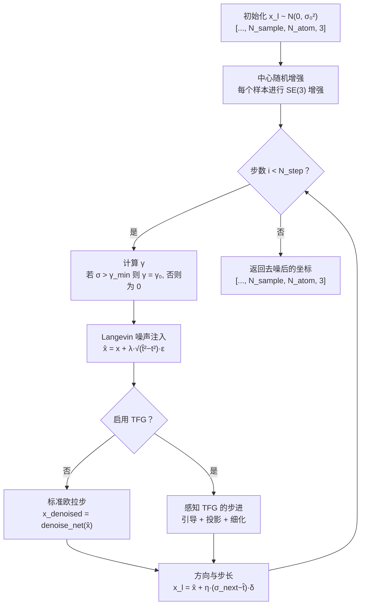
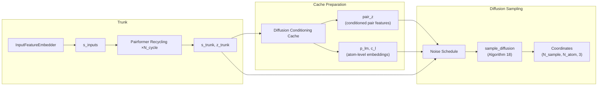
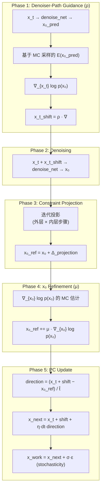

---
slug:19-diffusion-sampling-and-generator
blog_type:normal
---


Protenix 实现了一个**条件扩散模型**，遵循 AlphaFold 3 (AF3) 框架，用于从序列级表征生成 3D 原子坐标。本文档详细介绍了完整的采样流程——从噪声调度与初始化，到迭代预测器-校正器去噪循环，最后到可选的免训练引导（Training-Free Guidance, TFG）集成。TFG 能够在不重新训练的情况下，在推理阶段进一步优化结构的有效性。

---

## 噪声调度架构

扩散模型的运行机制是逐步向数据中添加噪声（前向过程），并学习如何逆转该过程（去噪/采样）。Protenix 将噪声生成解耦为两条不同的路径：**训练期间的对数正态随机采样**和**推理期间确定性的 EDM 风格几何调度**。两者共享值为 16.0 的 `sigma_data` 缩放因子（而在原始 EDM 公式中为 1.0），这反映了坐标空间中埃（Ångström）量级的尺度特征。

### 训练噪声采样器

在训练阶段，噪声级别是从由 `p_mean` 和 `p_std` 参数化的**对数正态分布**中提取的。采样器通过 `exp(N(p_mean, p_std)) * sigma_data` 生成 `sigma` 值，确保在中段噪声级别实现高密度的覆盖，因为此时模型的去噪能力最为关键。这是一个单步过程：对真实坐标进行数据增强，在采样到的级别上添加噪声，然后去噪网络通过一次前向传递预测出干净的结构。

| 参数 | 默认值 | 描述 |
|-----------|---------|-------------|
| `p_mean` | -1.2 | 对数空间中高斯分布的均值 |
| `p_std` | 1.5 | 对数空间中高斯分布的标准差 |
| `sigma_data` | 16.0 | 数据相关缩放因子（AF3 使用 16.0；EDM 使用 1.0） |

来源: [TrainingNoiseSampler](/protenix/model/generator.py#L26-L61), [train_noise_sampler config](/configs/configs_base.py#L165-L169)

### 推理噪声调度器

在推理阶段，调度器利用从 EDM 框架派生的非线性 `rho` 次幂调度，生成一个从 `s_max` 到 `s_min` **单调递减的噪声级别序列**。该调度在 `(1/rho)` 次幂空间进行插值，以实现噪声步长在感知上的均匀分布：

```python
step_indices = torch.arange(N_step + 1)
t_step_list = sigma_data * (
    s_max ** (1/rho) + step_indices * (1/N_step) * (s_min ** (1/rho) - s_max ** (1/rho))
) ** rho
t_step_list[..., -1] = 0  # t_N = 0 (fully denoised)
```

在 `N_step=200` 的默认配置下，这会生成一个包含 201 个元素的张量 `[sigma_0, sigma_1, ..., sigma_200=0]`，其中 `sigma_0 = 160.0`（最大噪声），而最后一步为纯信号。

| 参数 | 默认值 | 描述 |
|-----------|---------|-------------|
| `s_max` | 160.0 | 最大噪声级别（起点） |
| `s_min` | 4e-4 | 最小噪声级别（最后一个非零步） |
| `rho` | 7 | 控制步长密度分布的指数 |
| `sigma_data` | 16.0 | 数据相关缩放因子 |
| `N_step` | 200 | 去噪步数 |

来源: [InferenceNoiseScheduler](/protenix/model/generator.py#L64-L120), [inference_noise_scheduler config](/configs/configs_base.py#L170-L175)

---

## 推理采样循环 (Algorithm 18)

核心推理采样器在 `sample_diffusion` 中实现，它践行了 **AF3 Algorithm 18**——一个在连续时间噪声空间中运行的预测器-校正器 (PC) 采样器。该函数接收来自 Pairformer 堆栈的预计算主干嵌入，并迭代地将高斯噪声转化为结构化的 3D 坐标。

### 采样流程概述



### 预测器-校正器动力学

每次迭代都会沿着分数函数方向执行一次单独的**欧拉步**。其机制如下：首先，通过由 `gamma0` 参数和 `noise_scale_lambda` 控制的 Langevin 风格噪声扰动引入随机性。扰动后的噪声级别 `t_hat = c_tau_last * (gamma + 1)` 确保有效噪声级别超过当前级别，从而创建一个非确定性的探索步骤。然后，去噪网络预测出干净的结构，更新方向计算如下：

```python
delta = (x_noisy - x_denoised) / t_hat
dt = c_tau - t_hat
x_l = x_noisy + step_scale_eta * dt * delta
```

<CgxTip>`generator.py` 第 262 行的代码注释指出，AF3 Algorithm 18 第 9 行引用了 <code>x_l_hat</code>，作者认为这是一个排版错误——Protenix 改用了 <code>x_noisy</code>，这在数学上与预测器-校正器的公式保持一致。</CgxTip>

`gamma0` 参数经过了退火处理：仅当当前噪声级别超过 `gamma_min`（默认值为 1.0）时，才将其设为配置值；而在最后倾向于确定性去噪的细化步骤中，将其归零。

| 参数 | 默认值 | 作用 |
|-----------|---------|------|
| `gamma0` | 0.8 | Langevin 噪声幅度（随机性） |
| `gamma_min` | 1.0 | 噪声级别阈值，低于此值时 γ → 0 |
| `noise_scale_lambda` | 1.003 | 注入噪声方差的缩放比例 |
| `step_scale_eta` | 1.5 | 欧拉步长乘数 |
| `N_sample` | 5 | 每次预测生成的独立样本数 |

来源: [sample_diffusion](/protenix/model/generator.py#L123-L286), [sample_diffusion config](/configs/configs_base.py#L176-L246)

### 内存感知的样本分块

为了在不耗尽 GPU 内存的情况下处理较大的 `N_sample` 计数，采样器通过 `diffusion_chunk_size` 支持**扩散分块**。启用该功能后，`N_sample` 维度会被划分为多个数据块，这些数据块按顺序在整个去噪循环中进行处理，最后再拼接起来。此过程由 `sample_diffusion_chunk_size` 推理设置（默认值：5）控制。

```python
if diffusion_chunk_size is None:
    x_l = _chunk_sample_diffusion(N_sample, inplace_safe=inplace_safe)
else:
    x_l = []
    no_chunks = N_sample // diffusion_chunk_size + (N_sample % diffusion_chunk_size != 0)
    for i in range(no_chunks):
        chunk_x_l = _chunk_sample_diffusion(chunk_n_sample, inplace_safe=inplace_safe)
        x_l.append(chunk_x_l)
    x_l = torch.cat(x_l, -3)  # [..., N_sample, N_atom, 3]
```

来源: [chunked sampling](/protenix/model/generator.py#L268-L286), [chunk size config](/configs/configs_base.py#L157-L159)

---

## 训练扩散路径

训练采用了截然不同的采样策略：它不使用迭代的去噪循环，而是从随机采样的噪声级别执行**单步去噪**。`sample_diffusion_training` 函数实现了这一点：

1. **数据增强**：真实坐标通过 `centre_random_augmentation`（AF3 Algorithm 19）进行 SE(3) 随机旋转和平移，创建 `N_sample` 个独立增强的副本。
2. **噪声注入**：每个增强后的结构都会被以采样的 `sigma` 为缩放比例的加性高斯噪声所破坏。
3. **单次去噪传递**：扩散模块通过单次前向传递对含噪坐标进行去噪，生成用于计算损失的 `x_denoised`。

训练噪声是按结构逐个采样的，因此同一批次中的不同样本可能会遇到不同的噪声级别——这是一种课程多样化的体现。

来源: [sample_diffusion_training](/protenix/model/generator.py#L289-L403), [centre_random_augmentation](/protenix/model/utils.py#L28-L94)

---

## Protenix 中的扩散模块编排

`Protenix` 模型类作为核心编排器，将来自 Pairformer 的主干表征连接到扩散采样器。`_main_inference_loop` 方法负责处理完整的操作序列：



### 共享变量缓存

一项关键的优化是**扩散共享变量缓存**，在推理期间默认启用（`enable_diffusion_shared_vars_cache: True`）。由于单个样本内的所有去噪步骤都共享相同的条件特征（相对位置、成对表征、原子级嵌入），这些内容会被预先计算一次，并在所有 200 个扩散步骤中重复使用：

```python
cache["pair_z"] = self.diffusion_module.diffusion_conditioning.prepare_cache(
    input_feature_dict["relp"], z, False
)
cache["p_lm/c_l"] = self.diffusion_module.atom_attention_encoder.prepare_cache(
    ref_pos=..., ref_charge=..., ..., z=cache["pair_z"], inplace_safe=False
)
```

当缓存被填充后，`z_trunk` 会作为 `None` 传递给采样器（因为 `pair_z` 已经包含了条件表征），从而避免了冗余计算。

来源: [_main_inference_loop](/protenix/model/protenix.py#L470-L599), [sample_diffusion wrapper](/protenix/model/protenix.py#L306-L343), [cache config](/configs/configs_base.py#L131)

### 动态 AMP 绕过

推理运行器会根据 token 数量动态调整**自动混合精度 (AMP)** 设置，以平衡速度与数值稳定性。`update_inference_configs` 函数负责调整 `skip_amp.sample_diffusion` 和 `skip_amp.confidence_head` 标志：

| Token 范围 | `skip_amp.sample_diffusion` | `skip_amp.confidence_head` | 原因 |
|-------------|---------------------------|---------------------------|-----------|
| ≤ 2560 | `True` (FP32 扩散) | `True` (FP32 置信度) | 规模足够小，可使用全精度 |
| 2561–3840 | `True` (FP32 扩散) | `False` (AMP 置信度) | 混合模式以节省内存 |
| > 3840 | `False` (AMP 扩散) | `False` (AMP 置信度) | 必须使用 AMP 以避免 OOM |

来源: [update_inference_configs](/runner/inference.py#L385-L415), [skip_amp config](/configs/configs_base.py#L137-L145)

---

## 免训练引导 (TFG) 集成

Protenix 可以选择使用**免训练引导**来增强扩散采样器。这是一种基于能量的校正机制，能够在不修改模型权重的情况下，引导采样向物理上有效的结构发展。当 `guidance.enable` 为 `True` 时，`TFGEngine` 会使用多阶段的引导更新来取代标准的欧拉步。

### TFG 步进架构

每个经过 TFG 增强的扩散步都会执行以下阶段：



TFG 引擎将配置的能量项视为**未归一化的对数密度**：`p(x₀) ~ exp(−E(x₀))`。蒙特卡洛扰动样本被用于估计对数概率及其梯度，并通过对 `K` 个样本进行 log-mean-exp 聚合来确保数值稳定性。

### 能量项

| 势能项 | 默认权重 | 描述 |
|---------------|---------------|-------------|
| `VinaStericPotential` | 0.1 | Vina 风格的立体空间冲突惩罚 |
| `ExperimentalTorsionPotential` | 0.0015 | 基于实验统计的扭转角有效性 |
| `InterchainBondPotential` | 0.15 | 链间立体空间惩罚（缓冲：2.0 Å） |
| `PairwiseDistancePotential` | 0.5 | 键长、键角和冲突（已启用投影） |
| `ChiralAtomPotential` | 0.0 | 手性中心几何结构（已启用投影） |
| `StereoBondPotential` | 0.25 | 立体化学键约束 |
| `PlanarImproperPotential` | 0.12 | 芳香族/反常二面角平面度 |
| `LinearBondPotential` | 0.25 | 线性键几何结构的强制执行 |

<CgxTip>TFG 引擎支持<b>双层蒙特卡洛</b>方案：仅能量估计（用于阶段 1 的去噪路径引导）和带梯度的能量估计（用于阶段 4 的直接 x₀ 细化）。前者利用 <code>torch.autograd.grad</code> 在去噪网络中进行反向传播，而后者使用来自每个势能项 <code>energy_and_grad</code> 方法的解析梯度。这种分离允许分别通过 <code>rho</code> 和 <code>mu</code> 系数进行独立控制。</CgxTip>

### TFG 配置参数

| 参数 | 默认值 | 阶段 | 描述 |
|-----------|---------|-------|-------------|
| `rho` | 0.0 | 阶段 1 | 去噪路径引导强度（0 = 禁用） |
| `mu` | 0.1 | 阶段 4 | 直接 x₀ 细化步长 |
| `mc.std` | 0.0 | 所有 | 蒙特卡洛扰动标准差（0 = 确定性） |
| `mc.batch` | 1 | 所有 | 每次估计的蒙特卡洛样本数 |
| `tfg_outer` | 1 | — | TFG 循环的外部迭代 |
| `tfg_inner` | 20 | 阶段 4 | x₀ 上的内部细化步数 |
| `projection_outer` | 2 | 阶段 3 | 外部投影迭代 |
| `projection_inner` | 10 | 阶段 3 | 内部投影迭代 |

来源: [TFGEngine.step](/protenix/tfg/engine.py#L324-L496), [TFG config](/configs/configs_base.py#L185-L245), [_energy_and_grad](/protenix/tfg/engine.py#L98-L133), [_project](/protenix/tfg/engine.py#L252-L296)

---

## 推理编排与样本管理

### 基于种子的确定性

推理运行器会遍历一个可配置的种子列表，每个种子都会产生一组独立的 `N_sample=5` 结构预测。在每次种子迭代开始时调用的 `seed_everything` 确保了在所有扩散样本中实现可复现的随机噪声初始化和 SE(3) 增强。

```python
for seed in seeds:
    seed_everything(seed=seed, deterministic=configs.deterministic)
    for batch in dataloader:
        prediction = runner.predict(data)
        runner.dumper.dump(...)
```

### 动态配置适配

在每个样本被处理之前，`update_inference_configs` 会根据样本的 token 数量调整模型设置。这包括上文讨论的 AMP 绕过逻辑，以及断言 `protenix-v2` 处理的 token 不能超过 2560（以防止 OOM）。然后，运行器调用 `update_model_configs` 将调整后的配置推送到正在运行的模型实例中。

### 采样后的置信度头处理

扩散采样完成后，预测的坐标会被传递给 ConfidenceHead 以计算 pLDDT、PAE、PDE 和解析概率的逻辑值。随后，这些输出会被 `sample_confidence` 模块归纳为摘要指标（包括 pTM、ipTM 和综合排名得分），具体细节详见 [Confidence Head](11-confidence-head)。

来源: [infer_predict](/runner/inference.py#L418-L534), [predict](/runner/inference.py#L203-L236), [_main_inference_loop confidence](/protenix/model/protenix.py#L577-L599)

---

## 完整参数参考

下表汇总了代码库中所有的扩散采样参数，并映射到它们各自的配置位置：

| 类别 | 参数 | 位置 | 默认值 | 作用域 |
|----------|-----------|----------|---------|-------|
| **训练噪声** | `p_mean` | `train_noise_sampler` | -1.2 | 训练 |
| | `p_std` | `train_noise_sampler` | 1.5 | 训练 |
| | `sigma_data` | `train_noise_sampler` | 16.0 | 两者皆是 |
| **推理调度** | `s_max` | `inference_noise_scheduler` | 160.0 | 推理 |
| | `s_min` | `inference_noise_scheduler` | 4e-4 | 推理 |
| | `rho` | `inference_noise_scheduler` | 7 | 推理 |
| **采样** | `N_step` | `sample_diffusion` | 200 | 推理 |
| | `N_sample` | `sample_diffusion` | 5 | 推理 |
| | `gamma0` | `sample_diffusion` | 0.8 | 推理 |
| | `gamma_min` | `sample_diffusion` | 1.0 | 推理 |
| | `noise_scale_lambda` | `sample_diffusion` | 1.003 | 推理 |
| | `step_scale_eta` | `sample_diffusion` | 1.5 | 推理 |
| **分块** | `sample_diffusion_chunk_size` | `infer_setting` | 5 | 推理 |
| | `chunk_size` | `infer_setting` | 256 | 推理 |
| **TFG** | `enable` | `sample_diffusion.guidance` | False | 推理 |
| | `rho` (guidance) | `sample_diffusion.guidance` | 0.0 | 推理 |
| | `mu` | `sample_diffusion.guidance` | 0.1 | 推理 |

来源: [configs_base.py](/configs/configs_base.py#L108-L360), [configs_inference.py](/configs/configs_inference.py#L22-L39)

---

## 后续步骤

- 若要了解主干嵌入是如何输入到扩散条件网络中的，请参阅 [Diffusion Module](10-diffusion-module)。
- 若要了解 TFG 引导所使用的基于能量的势能，请参阅 [Training-Free Guidance Engine](24-training-free-guidance-engine)。
- 若要追踪预测坐标的评分方式，请参阅 [Confidence Head](11-confidence-head) 和 [Loss Functions](20-loss-functions)。
- 若要查看完整的推理流程编排，请参阅 [Inference Runner](18-inference-runner)。