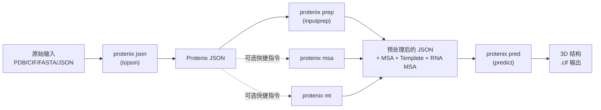
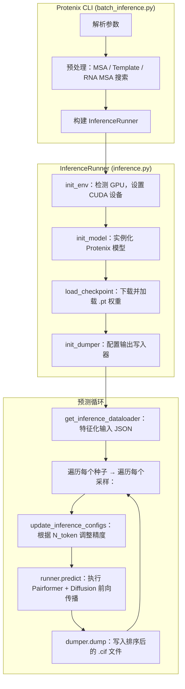

---
slug:2-quick-start
blog_type:normal
---


Protenix 是一个高精度、完全开源的生物分子结构预测框架——它是 AlphaFold 3 的可训练 PyTorch 复现版本，并在多种基准数据集上展现出优于原版的性能表现。无论你是想预测单一的蛋白质链、包含配体和核酸的多链复合物，还是希望基于自定义数据微调模型，本指南都能引导你在几分钟内从零开始完成首次预测。我们将介绍安装过程、统一的 CLI、模型选择、输入准备以及首次推理运行，随后为你指引文档目录中的进阶主题。


来源：[README.md](/README.md#L1-L77), [setup.py](/setup.py#L48-L77)

---

## 系统要求

在深入探索之前，请验证你的环境是否满足基本要求。Protenix 是一个优先使用 GPU 的框架——尽管技术上可以通过 `pip install . --cpu` 仅使用 CPU 运行，但生产级推理需要 NVIDIA 硬件的支持。

| 需求 | 最低配置 | 推荐配置 |
|:---|:---|:---|
| **Python** | 3.11 | 3.11 |
| **GPU** | 显存 ≥ 8 GB 的 NVIDIA 显卡 | A100 (80 GB), H100, 或 H20 |
| **CUDA** | 12.x | 12.6+ |
| **PyTorch** | 2.7.1 | 2.7.1 |
| **磁盘（推理）** | ~5 GB（权重 + 数据缓存） | 10 GB |
| **磁盘（训练）** | 1.5 TB | 2 TB |
| **系统工具** | — | `hmmer`, `kalign`（用于 Template/RNA MSA） |

`protenix` CLI 入口已在包的安装配置中注册为控制台脚本，直接映射到 `runner.batch_inference:protenix_cli`。这意味着安装完成后，你可以在 shell 中全局使用 `protenix` 命令。

来源：[setup.py](/setup.py#L48-L77), [requirements.txt](/requirements.txt#L1-L33), [Dockerfile](/Dockerfile#L1-L34)

---

## 安装

### 方式 A：PyPI（最快途径）

最简单的安装方法是从官方 PyPI 索引直接拉取稳定版本。这也是面向大多数用户的推荐起点。

```bash
pip install --upgrade protenix --index-url https://pypi.org/simple
```

<CgxTip>

如果你的镜像源落后于最新的 GitHub 发布版本，请务必在命令末尾添加 `--index-url https://pypi.org/simple`，以确保安装的 CLI 版本与本指南中展示的命令相匹配。

</CgxTip>

### 方式 B：Docker（推荐用于训练）

Docker 提供了一个完全隔离的环境，并预配置了所有系统依赖（HMMER、Kalign、CUTLASS）。这是进行训练和微调的推荐途径。

```bash
# 1. 拉取官方镜像
docker pull ai4s-share-public-cn-beijing.cr.volces.com/release/protenix:1.0.0.4

# 2. 克隆代码仓库
git clone https://github.com/bytedance/protenix.git
cd protenix

# 3. 开启 GPU 直通运行
docker run --gpus all -it \
    -v "$(pwd)":/app \
    -v /dev/shm:/dev/shm \
    ai4s-share-public-cn-beijing.cr.volces.com/release/protenix:1.0.0.4 \
    /bin/bash

# 4. 在容器内部，以可编辑模式安装
cd /app
pip install -e .
protenix --help  # 验证安装
```

该 Dockerfile 基于 `pytorch:2.7.1-cu12.6.3-py3.11-ubuntu22.04` 构建，克隆了 CUTLASS v3.5.1 用于内核编译，并安装了 HMMER 和 Kalign 用于模板/MSA 处理。

### 方式 C：从源码安装（面向开发者）

适用于需要最新开发代码的贡献者：

```bash
git clone https://github.com/bytedance/Protenix.git
cd Protenix
pip3 install -e .
```

### 外部依赖

如果你计划使用 **Template 搜索** 或 **RNA MSA 特征**（在 v1.0.0 及以上版本模型中可用），则需要在系统中安装 `kalign` 和 `hmmer`。Docker 用户已经预装了这些工具；非 Docker 用户可以通过以下命令安装：

```bash
apt-get update && apt-get install -y kalign hmmer
```

或者，你可以通过 CLI 参数传入二进制文件的路径，例如 `--kalign_binary_path`、`--hmmsearch_binary_path` 等。

来源：[README.md](/README.md#L49-L53), [docs/docker_installation.md](/docs/docker_installation.md#L1-L46), [docs/training_inference_instructions.md](/docs/training_inference_instructions.md#L6-L41), [Dockerfile](/Dockerfile#L1-L34)

---

## Protenix CLI

Protenix 提供了一个基于 Click 构建的统一命令行界面。安装完成后，仅需五个子命令即可覆盖从原始输入到输出 3D 结构的完整工作流。



| 命令 | 别名 | 用途 |
|:---|:---|:---|
| `protenix json` | `tojson` | 将 PDB/CIF 结构文件转换为 Protenix 兼容的 JSON 格式 |
| `protenix msa` | `msa` | 为蛋白质序列生成多序列比对（MSA） |
| `protenix mt` | `msatemplate` | 一步完成 MSA 与 Template 搜索 |
| `protenix prep` | `inputprep` | **完整预处理**：蛋白质 MSA + Template + RNA MSA |
| `protenix pred` | `predict` | **核心推理**：运行模型预测并输出 3D 结构 |

对于大多数初学者而言，流程非常简单：准备输入 JSON → 运行 `protenix pred`。CLI 会在后台自动处理模型权重的下载、数据缓存的初始化以及 GPU 的检测。

来源：[docs/training_inference_instructions.md](/docs/training_inference_instructions.md#L43-L113), [runner/batch_inference.py](/runner/batch_inference.py#L56-L68)

---

## 选择模型

Protenix 内置了多个预训练模型，涵盖不同的参数规模和特征组合。模型命名遵循 `protenix_{model_size}_{features}_{version}` 的规则。

| 模型名称 | 参数量 | MSA | Template | RNA MSA | 训练截断日期 | 最适用场景 |
|:---|:---:|:---:|:---:|:---:|:---:|:---|
| **`protenix-v2`** | 464 M | ✅ | ✅ | ✅ | 2021-09-30 | 抗原-抗体、配体合理性评估 |
| **`protenix_base_default_v1.0.0`** | 368 M | ✅ | ✅ | ✅ | 2021-09-30 | **通用默认模型** |
| **`protenix_base_20250630_v1.0.0`** | 368 M | ✅ | ✅ | ✅ | 2025-06-30 | 实际/真实世界场景 |
| `protenix_base_default_v0.5.0` | 368 M | ✅ | ❌ | ❌ | 2021-09-30 | 向后兼容 |
| `protenix_mini_default_v0.5.0` | 134 M | ✅ | ❌ | ❌ | 2021-09-30 | 高通量、GPU 资源受限 |
| `protenix_tiny_default_v0.5.0` | 110 M | ✅ | ❌ | ❌ | 2021-09-30 | 超轻量级筛选 |

**对于初学者，建议从 `protenix_base_default_v1.0.0` 开始**——它与 AlphaFold 3 规模相当，支持所有特征（MSA、Template、RNA MSA），并且在多种基准测试中超越了 AF3。模型权重会在首次使用时通过 Protenix CDN 自动下载。

<CgxTip>

`--use_default_params` 参数（默认开启）会自动为你选择的模型配置最佳的 Pairformer 循环次数（`N_cycle`）和扩散步数（`N_step`）。仅在需要手动权衡计算速度与预测精度时，才将其设为 `false`。

</CgxTip>

来源：[README.md](/README.md#L63-L76), [docs/supported_models.md](/docs/supported_models.md#L1-L63), [protenix/web_service/dependency_url.py](/protenix/web_service/dependency_url.py#L15-L36)

---

## 准备输入数据

Protenix 接受 JSON 格式的输入文件，该文件描述了你要预测的分子复合物。该格式支持蛋白质链、DNA/RNA 序列以及配体（通过 CCD 代码或 SMILES 字符串指定）。

### 最简示例：单一蛋白质链

最基础的输入——一条不含 MSA 或模板的单一蛋白质序列：

```json
[
    {
        "name": "user_test",
        "covalent_bonds": [],
        "sequences": [
            {
                "proteinChain": {
                    "count": 1,
                    "sequence": "MAQGSHQIDFQVLHDLRQKFPEVPEVVVSRCMLQNNN...",
                    "modifications": []
                }
            }
        ]
    }
]
```

输入数据始终是一个**顶层 JSON 数组**，包含一个或多个预测目标。每个目标都包含一个 `name`、一个可选的 `covalent_bonds` 列表，以及一个用于描述其组成链的 `sequences` 数组。

### 进阶示例：多链复合物

对于含有配体和预计算 MSA 的多链复合物，JSON 结构会进行相应扩展以容纳各个实体：

```json
[
    {
        "sequences": [
            {
                "proteinChain": {
                    "sequence": "MGSSHHHHHHSSGLVPRGSHM...",
                    "count": 1,
                    "id": ["A"],
                    "msa": {
                        "precomputed_msa_dir": "./examples/7r6r/msa/1",
                        "pairing_db": "uniref100"
                    }
                }
            },
            {
                "ligand": {
                    "ligand": "CCD_P4G",
                    "count": 1
                }
            }
        ],
        "name": "7r6r"
    }
]
```

你也可以直接使用 CLI 将现有的 PDB/CIF 文件转换为 JSON：

```bash
protenix json --input ./examples/7pzb.cif --out_dir ./output --altloc first
```

关于所有受支持的实体类型（蛋白质、DNA、RNA、配体、离子、共价键、修饰、约束条件）的完整规范，请参阅 [输入 JSON 格式](4-input-json-format)。

来源：[examples/input.json](/examples/input.json#L1-L15), [examples/example.json](/examples/example.json#L1-L112), [docs/training_inference_instructions.md](/docs/training_inference_instructions.md#L56-L68)

---

## 运行你的第一次预测

### 单命令预测

获取结构的最快方式是执行单行 CLI 命令。以下示例使用默认的 v1.0.0 模型对 `examples/input.json` 中定义的结构进行预测：

```bash
protenix pred \
    -i examples/input.json \
    -o ./output \
    -n protenix_base_default_v1.0.0 \
    --use_template true \
    --use_default_params true
```

在首次运行时，Protenix 会自动执行以下操作：
1. 将模型权重（约 368 M 参数）下载到你的缓存目录中
2. 下载辅助数据文件（CCD 组件、聚类文件、废弃/发布日期映射表）
3. 执行 MSA 搜索和 Template 搜索（如果已开启）
4. 执行 Pairformer 循环（10 次循环）+ 扩散采样（200 步，5 个采样）
5. 将排序后的 `.cif` 结构文件输出到你指定的目录

### 核心推理参数

| 参数 | 默认值 | 描述 |
|:---|:---|:---|
| `-i, --input` | *(必填)* | 输入的 JSON 文件或目录 |
| `-o, --out_dir` | `./output` | 结果输出目录 |
| `-n, --model_name` | `protenix_base_default_v1.0.0` | 模型权重名称 |
| `-s, --seeds` | `101` | 以逗号分隔的随机种子（例如：`"101,102"`） |
| `--use_msa` | `true` | 启用蛋白质 MSA 特征 |
| `--use_template` | `false` | 启用结构 Template 特征（仅限 v1.0.0 及以上版本） |
| `--use_rna_msa` | `false` | 启用 RNA MSA 特征（仅限 v1.0.0 及以上版本） |
| `--use_default_params` | `true` | 为选定模型自动配置循环次数/步数 |
| `--dtype` | `bf16` | 推理精度（`bf16` 或 `fp32`） |
| `--use_tfg_guidance` | `false` | 启用免训练引导以进行精细化采样 |

### 使用预计算特征运行

如果你已经预计算了 MSA 或 Template 数据（例如通过 `protenix prep` 获取），CLI 会自动检测并使用它们。你也可以直接通过 Python runner 运行推理，以获得更精细的控制：

```bash
python3 runner/inference.py \
    --model_name protenix_base_default_v1.0.0 \
    --seeds 101 \
    --dump_dir ./output \
    --input_json_path examples/examples_with_template/example_9fm7.json \
    --model.N_cycle 10 \
    --sample_diffusion.N_sample 5 \
    --sample_diffusion.N_step 200 \
    --triangle_attention cuequivariance \
    --triangle_multiplicative cuequivariance \
    --use_template true \
    --use_seeds_in_json true
```

这种直接运行的方式针对纯 GPU 计算进行了优化——它会跳过预处理步骤，并要求输入的 JSON 中已经包含相应的特征数据。

### 使用轻量化模型加速

对于快速原型设计或资源受限的环境，Mini 和 Tiny 模型能够在精度损失极小的前提下，大幅降低推理成本：

```bash
# 搭配 ESM 嵌入的 Mini 模型（无需 MSA）
protenix pred -i examples/example.json -o ./output \
    -n protenix_mini_esm_v0.5.0 --use_default_params true

# 默认的 Tiny 模型（超轻量级，约 110 M 参数）
protenix pred -i examples/example.json -o ./output \
    -n protenix_tiny_default_v0.5.0 --use_default_params true
```

Mini/Tiny 模型仅使用 4 次 Pairformer 循环和 5 步扩散（而 Base 模型为 10 次循环 / 200 步），这使得每个样本的推理速度大约提升了 **40 倍**。

来源：[inference_demo.sh](/inference_demo.sh#L52-L161), [docs/training_inference_instructions.md](/docs/training_inference_instructions.md#L85-L131), [runner/inference.py](/runner/inference.py#L64-L200)

---

## 底层运行机制

当你执行 `protenix pred` 时，系统会编排一个多阶段的流水线。理解这一工作流有助于你排查问题并优化性能。



流水线始于 `runner/batch_inference.py`，其中 `protenix_cli` 入口会解析 Click 参数并分发至 `get_default_runner()`。该函数会将基础配置、模型专属配置与用户自定义覆盖配置合并为一个 `ConfigDict`，随后构建 `InferenceRunner` 实例。该 Runner 负责处理 GPU 初始化（`init_env`）、模型实例化（`init_model`）、权重加载（`load_checkpoint`）以及输出配置（`init_dumper`）。实际的预测循环位于 `infer_predict()` 中，它会遍历各种随机种子与采样，并根据 Token 数量自动调整混合精度设置，从而防止在处理大型输入时出现 OOM（显存溢出）错误。

来源：[runner/batch_inference.py](/runner/batch_inference.py#L287-L428), [runner/inference.py](/runner/inference.py#L64-L236), [runner/inference.py](/runner/inference.py#L418-L500)

---

## 推理资源消耗参考

在对大型复合物运行预测之前，请先了解预期的资源消耗情况。下表反映了在单张 GPU 上使用基础版 v1.0.0 模型和默认设置的基准测试数据。

| Tokens (`N_token`) | 原子数 (`N_atom`) | 峰值显存 (GB) | 延迟 (秒) |
|:---|:---|:---:|:---:|
| 500 | 5,000 | 6.1 | 17 |
| 1,000 | 10,000 | 18.2 | 59 |
| 2,000 | 20,000 | 66.6 | 226 |
| 3,000 | 30,000 | 60.8 | 935 |
| 4,000 | 40,000 | 78.1 | 1,424 |

框架会根据 Token 数量动态调整 `SampleDiffusion` 和 `ConfidenceHead` 模块的精度——当 Token 数低于 2,560 时，两者均以 FP32 精度运行以获得最高精度；在 2,560 到 3,840 之间时，`ConfidenceHead` 会切换至 AMP（自动混合精度）；当超过 3,840 时，两个模块都会使用 AMP 以适配显存。请注意，由于具有较大的表示维度，`protenix-v2`（464 M 参数）不支持 `N_token > 2560`。

来源：[docs/training_inference_instructions.md](/docs/training_inference_instructions.md#L257-L299), [runner/inference.py](/runner/inference.py#L385-L415)

---

## 验证你的安装

运行内置的测试套件以确认一切工作正常。测试文件 `tests/test_installation.py` 会验证核心组件的导入和基础功能。

```bash
# 快速冒烟测试
python -m pytest tests/test_installation.py -v
```

如需进行完整的端到端验证，请运行推理演示脚本，该脚本会测试多种模型变体和特征配置：

```bash
# 此脚本会运行约 10 个 CLI 推理示例，涵盖所有模型变体
bash inference_demo.sh
```

来源：[tests/test_installation.py](/tests/test_installation.py), [inference_demo.sh](/inference_demo.sh#L52-L161)

---

## 进阶指引

至此，你已经成功安装了 Protenix 并能够运行预测，以下是进一步探索文档的合理路径：

| 步骤 | 你的目标 | 推荐阅读 |
|:---|:---|:---|
| 1 | **详细对比模型**，以便为你的用例选择最合适的模型 | [模型选择与对比](3-model-selection-and-comparison) |
| 2 | **掌握输入格式**，处理带有配体、离子、约束条件的复杂多链目标 | [输入 JSON 格式](4-input-json-format) |
| 3 | **理解架构** —— Pairformer、Diffusion 和 Confidence 模块如何交互 | [架构概述](8-architecture-overview) |
| 4 | **超越推理限制** —— 从零开始训练模型或基于你的数据进行微调 | [训练 Runner](17-training-runner), [推理 Runner](18-inference-runner) |
| 5 | **优化性能** —— 自定义 CUDA 内核、TF32、内存高效扩散 | [自定义 Triton Attention 内核](21-custom-triton-attention-kernel), [自定义 LayerNorm CUDA 内核](23-custom-layernorm-cuda-kernel) |

Protenix 项目还包含了一个不断扩展的相关工具生态系统：用于从头设计蛋白质结合剂的 **PXDesign**、用于可复现评估的 **PXMeter**，以及用于经典蛋白质-配体对接的 **Protenix-Dock**——它们均构建于相同的基础模型之上。