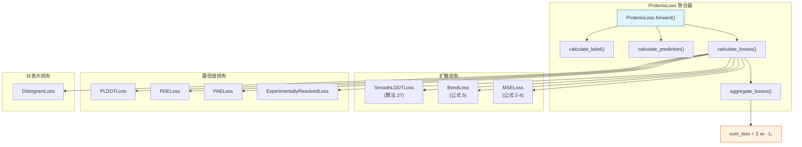
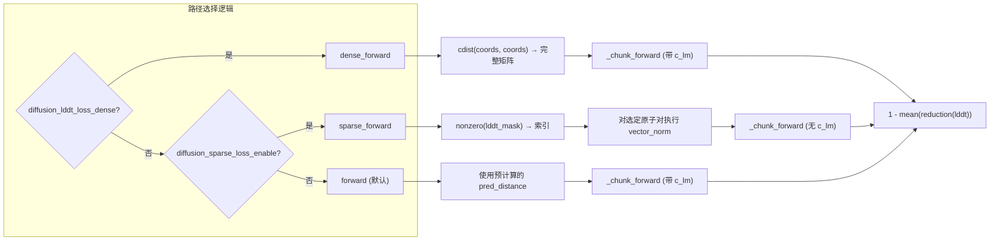
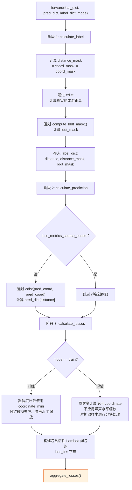

---
slug:20-loss-functions
blog_type:normal
---


Protenix 采用了一种多目标损失架构，该架构同时监督三个结构预测阶段——对表示（pair representation）、基于扩散的坐标生成以及置信度估计。整个损失系统集中由 `ProtenixLoss` 实现，这是一个聚合器，负责统筹源自 AlphaFold 3 规范的八个独立损失项，每项分别针对结构保真度的不同方面。本页将深入剖析每个损失组件、其数学基础、实现策略，以及使大规模训练切实可行的工程优化方案。

## 架构概述

该损失系统遵循三层层级结构：底层独立损失模块直接处理原始张量；中层 `ProtenixLoss` 使用可配置的权重对它们进行聚合；顶层训练/评估运行器则传入特征、预测和标签字典来调用该聚合器。在深入探讨各个组件之前，理解此层级结构至关重要。



总的训练目标是各项损失的加权和：`L_total = Σᵢ wᵢ · Lᵢ`，其中每个权重 `wᵢ` 均由高层级的 alpha 超参数推导得出。损失权重被划分为四组——置信度、扩散、距离图和化学键，其中置信度损失还会进一步受到实验分辨率有效性的门控限制。

来源：[loss.py](/protenix/model/loss.py#L1442-L1476), [loss.py](/protenix/model/loss.py#L1802-L1898)

## 损失权重配置

`ProtenixLoss.__init__` 方法构建了一个权重字典，将每个损失项的名称映射至其有效系数。这些权重是更高层级的 alpha 标量系数的乘积，这提供了一种简洁的接口，使得我们能够在不修改单个损失模块的情况下重新平衡训练目标。

| 损失名称 | 权重公式 | 语义作用 |
|---|---|---|
| `plddt_loss` | `α_confidence · α_except_pae` | 每个原子的预测 LDDT |
| `pde_loss` | `α_confidence · α_except_pae` | 预测距离误差 |
| `resolved_loss` | `α_confidence · α_except_pae` | 实验已解析原子分类 |
| `pae_loss` | `α_confidence · α_pae` | 预测对齐误差 |
| `mse_loss` | `α_diffusion` | 加权刚体对齐坐标均方误差 |
| `bond_loss` | `α_diffusion · α_bond` | 成键原子对距离违规惩罚 |
| `smooth_lddt_loss` | `α_diffusion · w_smooth_lddt` | 基于扩散样本的平滑 LDDT |
| `distogram_loss` | `α_distogram`` | 分桶后的 Token 对距离 |

<CgxTip>
Protenix 中的 `smooth_lddt_loss` 权重设定与 AF3 论文（附录公式 6）有所不同，在论文中平滑 LDDT 并没有显式的权重乘数。Protenix 引入了 `w_smooth_lddt` 作为可配置系数，允许开发者独立于基础扩散权重来调整其影响力。
</CgxTip>

来源：[loss.py](/protenix/model/loss.py#L1449-L1475)

## SmoothLDDTLoss (算法 27)

该损失实现了局部距离差异测试（lDDT）的平滑变体，这是一种基于距离的度量方式，可在无需全局叠合的情况下衡量局部结构的一致性。与采用硬阈值截断的 lDDT 不同，平滑版本使用 Sigmoid 函数替代了二元截断比较，从而在每个距离阈值边界处都能产生完全可微的梯度。

核心计算会针对每个原子对 `(l, m)` 评估绝对距离差 `|d_pred(l,m) - d_true(l,m)|`，并累加跨越四个距离阈值的得分：

```
score(l,m) = 0.25 · Σ_{τ ∈ {0.5, 1.0, 2.0, 4.0}} σ(τ - |Δd_{lm}|)
```

其中 `σ` 为 Sigmoid 函数，`Δd_{lm}` 为预测值与真实值之间的距离误差。最终损失为 `1 - mean(score)`，输出值域为 `[0, 1]`，其中 0 表示结构完美一致。

该实现提供了三种在运行时进行选择的执行路径：

| 方法 | 输入 | 内存占用 | 适用场景 |
|---|---|---|---|
| `forward` | 预计算的 `pred_distance` | 高（完整的 N×N 矩阵） | 默认训练路径 |
| `dense_forward` | `pred_coordinate` → 实时计算 `cdist` | 高，但避免了存储预测距离 | 预测距离未经过预计算时 |
| `sparse_forward` | 稀疏的 `lddt_mask` 索引 | 低（约为稠密路径的 10%） | 针对大型结构的内存受限训练 |

稀疏路径利用了一个观测结果：对于包含 5000 个原子的结构，lDDT 掩码 `c_lm` 的稠密度约为 10%，且随着原子数量的增加，其会变得更加稀疏。此路径不会去具象化完整的 `[N_atom, N_atom]` 距离矩阵，而是通过 `torch.nonzero` 仅提取由 `lddt_mask` 标记的原子对，计算这些原子对的成对距离，并评估平滑 lDDT 得分。当指定了 `diffusion_chunk_size` 时，梯度检查点将按分块应用。



辅助函数 `compute_lddt_mask` 用于构建包含半径掩码，以门控决定哪些原子对会参与损失计算。它应用了特定于分子类型的距离截断值：核苷酸原子为 **30 Å**，其他所有原子为 **15 Å**，同时通过缓存的非对角线掩码张量显式地将对角线元素置零。

来源：[loss.py](/protenix/model/loss.py#L63-L297), [loss.py](/protenix/model/loss.py#L454-L492), [loss.py](/protenix/model/loss.py#L1654-L1688)

## BondLoss (公式 5)

BondLoss 通过计算成键原子对的预测距离与真实距离之间的均方误差，来惩罚对已知共价键几何结构的破坏。与评估半径内所有局部原子对的 SmoothLDDTLoss 不同，BondLoss 仅限于处理在 `bond_mask` 中被显式标记的原子对，这使得其针对性极强。

该损失定义为：

```
L_bond = Σ_{(l,m)} bond_mask(l,m) · (d_pred(l,m) - d_true(l,m))² / Σ_{(l,m)} bond_mask(l,m)
```

该实现支持 `per_sample_scale` 参数，该参数通过依赖噪声水平的因子 `(σ² + σ_data²) / (σ_data · σ)²` 来缩放每个扩散样本的贡献。这种权重分配源自 EDM（Equivalent Diffusion Models，等价扩散模型）框架，确保了在不同噪声水平下提取的样本能按比例贡献于梯度信号。在训练期间，此缩放因子根据 `pred_dict["noise_level"]` 计算得出；而在评估期间，它会被设置为 `None`（即均匀加权）。

稀疏变体采用了与 SmoothLDDTLoss 相同的模式：通过 `torch.nonzero(bond_mask)` 提取成键原子的索引，仅计算这些原子对的距离，并返回均方误差。代码中包含一道保护性检查，用于处理空化学键集合（`numel() == 0`）的情况，并返回一个带有 `requires_grad=True` 属性的零值张量，以防止计算图断开。

来源：[loss.py](/protenix/model/loss.py#L299-L451), [loss.py](/protenix/model/loss.py#L1689-L1718)

## MSELoss (公式 2–4)

MSELoss 通过**加权刚体对齐**以及随后的逐原子平方误差计算，实现了核心的坐标回归目标。这是直接监督 3D 坐标预测的主扩散损失。

### 加权刚体对齐

在计算坐标误差之前，真实坐标会使用 `weighted_rigid_align` 与每个预测样本进行最优对齐。对齐权重编码了不同分子类型的重要性：

```
w(atom) = coordinate_mask(atom) · (1 + 5.0 · is_dna(atom) + 5.0 · is_rna(atom) + 10.0 · is_ligand(atom))
```

这种权重分配方案（AF3 中的公式 3）将核酸和配方的权重分别设定为蛋白质原子的 5 倍和 10 倍，这反映了它们对整体结构质量的巨大影响，以及非蛋白质实体在训练信号中的相对稀缺性。即使在 BFloat16 混合精度训练期间，对齐操作也会在 float32 精度下执行，因为 `weighted_rigid_align` 包含的某些操作（如 SVD）在低精度下会出现数值不稳定。

### 损失计算

对齐完成后，损失计算如下：

```
per_atom_se = Σ_{xyz} (pred_coord - true_coord_aligned)²
L_mse = (1/3) · mean_over_samples[ Σ_atoms w(atom) · per_atom_se(atom) / N_atoms ]
```

系数 `weight_mse = 1/3` 用于在三个空间维度上进行归一化。对齐后的坐标和权重会通过 `torch.no_grad()` 从计算图中分离，因为对齐操作本身不应接收梯度——损失梯度仅通过预测坐标进行反向传播。

来源：[loss.py](/protenix/model/loss.py#L1063-L1209), [loss.py](/protenix/model/loss.py#L1709-L1718)

## DistogramLoss

DistogramLoss 是唯一应用于 Pairformer 对表示输出的损失项。它使用代表性原子（蛋白质使用 Cβ，核苷酸使用 C4/C2，配体使用单原子 Token）来监督 Token 级别的成对距离的分桶分类。此设计直接继承自 AlphaFold 2。

该实现将真实的 Token 间距离划分为 `no_bins=64` 个等距分桶（区间介于 `min_bin=2.3125` 和 `max_bin=21.6875` Å 之间），将其转换为独热标签，并应用软标签交叉熵：

```
L_distogram = Σ_{(i,j)} pair_mask(i,j) · CE(logits, one_hot(true_bin)) / Σ_{(i,j)} pair_mask(i,j)
```

由于分桶操作不可微，因此标签计算被包裹在 `torch.no_grad()` 中。`calculate_label` 方法利用 `rep_atom_mask` 提取代表性原子坐标，通过 `cdist` 计算成对距离，并通过统计其跨越的边界数量来为每个距离分配相应的分桶。

<CgxTip>
仅当 `pred_dict` 中包含 `"distogram"` 时，才会条件性地引入 DistogramLoss。这使得同一个 `ProtenixLoss` 能够兼容省略了距离图预测头的模型配置，而不会引发错误。
</CgxTip>

来源：[loss.py](/protenix/model/loss.py#L515-L635), [loss.py](/protenix/model/loss.py#L1720-L1731)

## 置信度头损失

四个损失项负责监督置信度预测头，它们都遵循一个共同的模式：在训练期间从微型展开坐标计算 Ground Truth 目标（或在评估期间从完整的扩散坐标计算），将其转换为分桶分类标签，并通过 Softmax 交叉熵进行监督。

### PDELoss（预测距离误差）

PDELoss 负责训练模型预测微型展开的预测距离与真实代表性原子距离之间的绝对距离误差。其标签为经过分桶的 `|d_pred(i,j) - d_true(i,j)|`，使用 `no_bins=64` 个分桶覆盖 `[0, 32]` Å。该预测头提供了一种独立于分辨率的逐 Token 对置信度估计。

来源：[loss.py](/protenix/model/loss.py#L638-L775)

### PAELoss（预测对齐误差）

PAELoss 是在架构上最为复杂的置信度损失。它需要使用 `compute_alignment_error_squared`（AF3 中的算法 30）计算基于参考系的误差。对于每个有效的局部参考系（由每个 Token 的三个参考系原子定义），预测坐标和真实坐标均会被转换至该参考系的局部坐标系中，随后计算位置误差的平方：

```
squared_PAE(frame, token) = ||x_pred(token) in frame_pred - x_true(token) in frame_true||²
```

随后，平方 PAE 值（使用平方边界 `[0², 32²]`）被划分至 `no_bins=64` 个分桶中，并通过交叉熵进行监督。`calculate_label` 方法会谨慎构建 `frame_token_pair_mask`，以确保参考系的原子和目标 Token 的代表性原子均具有有效的坐标。

`has_frame` 掩码会过滤掉没有有效参考系的 Token（例如配体），而 `frame_atom_index` 则提供了定义每个局部参考系的每 Token 三个原子索引。这是唯一在局部参考系而非全局距离空间中运作的置信度损失。

来源：[loss.py](/protenix/model/loss.py#L778-L1007)

### PLDDTLoss（预测 LDDT）

PLDDTLoss 负责监督逐原子的 LDDT 预测。Protenix 的实现引入了对 AF3 论文规范的两项修改：在计算真实 LDDT 时使用了**距离差**（而非原始预测距离），并且在对 LDDT 得分进行分桶前，将其**归一化**至 `[0, 1]` 区间。

真实的逐原子 LDDT 由 `calculate_atom_bespoke_lddt` 计算，它会针对每个原子，在定制包含半径内评估其与所有聚合物代表性原子的四阈值 lDDT 得分（分别在 0.5、1.0、2.0、4.0 Å 处）。由此得出的得分会根据参与计算的邻居原子数量（`per_atom_weight`）进行归一化，随后分布至涵盖 `[0, 1]` 区间的 50 个桶中。

`forward_given_atom_lddt` 方法提供了一个可复用的入口点：它接收预计算的逐原子 LDDT 值，对其进行分桶，并应用交叉熵。该方法既被 `PLDDTLoss.forward` 调用（用于独立使用场景），也被 `ProtenixLoss.calculate_losses` 调用（在该处会预先计算一次逐原子 LDDT，供 PLDDT 和评估指标共同复用）。

来源：[loss.py](/protenix/model/loss.py#L1212-L1439)

### ExperimentallyResolvedLoss

该二分类损失负责训练模型预测每个原子是否拥有实验测定的解析坐标。其目标是 `coordinate_mask` 的独热编码（0 = 未解析，1 = 已解析），该损失应用了软标签交叉熵，并支持可选的 `atom_mask` 权重，以便对需考量的原子进行选择性筛选。

来源：[loss.py](/protenix/model/loss.py#L1010-L1060)

## ProtenixLoss 聚合流水线

`ProtenixLoss` 模块通过在 `forward()` 中执行的三个连续阶段，统筹完整的损失计算流水线：



### 标签预计算

`calculate_label` 会构建三个在多个损失项中共享的辅助张量：成对坐标存在掩码（`distance_mask`）、真实成对距离（`distance`）以及定制的 LDDT 包含半径掩码（`lddt_mask`）。当启用稀疏模式（`loss_metrics_sparse_enable=True`）且禁用稠密 LDDT 损失时，为了节省显存，真实距离矩阵会被特意**不**存储到 `label_dict` 中——稀疏损失路径会在需要时即时计算特定原子对的距离。

来源：[loss.py](/protenix/model/loss.py#L1487-L1533)

### 分辨率门控

置信度损失项（pLDDT、PDE、PAE、ExperimentallyResolved）受实验分辨率的条件门控。`aggregate_losses` 方法会检查结构的分辨率是否落在 `[min_resolution, max_resolution]` 范围内；若不在该范围内，所有四个置信度损失都将乘以 0（保留它们的计算图以维持梯度流动，但抵消其贡献）。这避免了模型从真实坐标可能不可靠的低质量实验结构中获取置信度头训练信号。

来源：[loss.py](/protenix/model/loss.py#L1733-L1801)

### 训练与评估模式

| 方面 | 训练模式 | 评估模式 |
|---|---|---|
| 置信度坐标来源 | `coordinate_mini`（微型展开，20 步） | `coordinate`（完整扩散，200 步） |
| 噪声水平缩放 | 应用于扩散损失 | 不应用 |
| 扩散损失分块 | 内部 `diffusion_chunk_size` | 外部 `diffusion_chunk_size_outer` |
| 显存管理 | 标准 | 每次损失计算后显式执行 `torch.cuda.empty_cache()` |

在评估期间，总共 `N_sample` 个扩散样本会被分外层块进行处理，以有效管理显存。每个块的指标以加权和的形式累加（以块大小为权重），并在最后除以总样本数进行归一化。

来源：[loss.py](/protenix/model/loss.py#L1611-L1800), [loss.py](/protenix/model/loss.py#L1802-L1898)

### NaN 与 Inf 处理

`aggregate_losses` 方法实现了防御性处理：任何计算结果为 NaN 或 Inf 的损失项都会被记录为警告并有效跳过（其梯度贡献会流经 NaN，但聚合器会累积该 NaN 值）。针对置信度损失的检查点机制（`has_valid_resolution`）提供了一种独立的方式，可以将置信度损失置零而不会触发 NaN 警告。

来源：[loss.py](/protenix/model/loss.py#L1555-L1609)

## 交叉参考：基于样本的噪声水平缩放

在训练期间，扩散损失（SmoothLDDTLoss、BondLoss、MSELoss）会乘以一个基于样本的缩放因子，该因子源自 EDM 噪声水平：

```python
diffusion_per_sample_scale = (σ² + σ_data²) / (σ_data · σ)²
```

其中 `σ` 是采样的噪声水平（`pred_dict["noise_level"]`），`σ_data = 16.0` 是来自模型配置的全局常量。这种缩放确保了在不同噪声水平下，预期损失的量级基本保持一致。由于高噪声水平下的坐标误差原本会主导梯度信号，因此该缩放操作对于稳定的扩散训练至关重要。

来源：[loss.py](/protenix/model/loss.py#L1637-L1640)

## 工程优化

### 梯度检查点

所有需要遍历扩散样本的扩散损失（`SmoothLDDTLoss`、`BondLoss`）均通过 `diffusion_chunk_size` 参数支持梯度检查点。启用后，每个样本块都会通过 `get_checkpoint_fn()`（解析为 `torch.utils.checkpoint.checkpoint`）进行处理，从而以反向传播期间的重算来换取峰值内存的降低。这对于以每步 `diffusion_batch_size=48` 个样本进行训练至关重要。

来源：[loss.py](/protenix/model/loss.py#L131-L156), [loss.py](/protenix/model/loss.py#L360-L386)

### 稀疏计算

配置标志 `loss_metrics_sparse_enable`（默认：`True`）为 SmoothLDDTLoss 和 BondLoss 激活了稀疏计算路径。这些路径不会去具象化完整的 `[N_atom, N_atom]` 距离矩阵，而是通过 `torch.nonzero(mask)` 仅提取相关的原子对，并专门针对这些原子对计算距离。对于包含数千个原子的结构，这会将显存占用从 `O(N²)` 降低至 `O(k)`，其中 `k` 为掩码标记的原子对数量（约为 `N²` 的 10%）。

来源：[loss.py](/protenix/model/loss.py#L161-L227), [loss.py](/protenix/model/loss.py#L393-L451)

### 评估期间的内存清理

在评估期间（`self.training == False`），单个损失模块会在计算出各自的损失值后，主动删除中间张量并调用 `torch.cuda.empty_cache()`。这种模式出现在 `SmoothLDDTLoss.dense_forward`、`DistogramLoss.forward`、`PDELoss.forward`、`PAELoss.forward` 和 `BondLoss.sparse_forward` 中，反映出在评估期间处理大批量扩散样本所带来的巨大显存压力。

来源：[loss.py](/protenix/model/loss.py#L292-L296), [loss.py](/protenix/model/loss.py#L632-L634), [loss.py](/protenix/model/loss.py#L772-L774)

### 缓存非对角线掩码

`_get_off_diagonal_mask` 函数使用 `lru_cache(maxsize=8)` 来缓存 `(1 - eye(n))` 张量，并以 `(n, device, dtype)` 作为键。这避免了在 `compute_lddt_mask` 和 `calculate_atom_bespoke_lddt` 中反复进行 CPU-GPU 数据传输和分配张量，这两个函数在前向传播中均会以相同的矩阵维度被调用一次。

来源：[loss.py](/protenix/model/loss.py#L34-L39)

## 接下来阅读什么

- 若要了解如何生成扩散样本和噪声水平，请参阅 [Diffusion Sampling and Generator](19-diffusion-sampling-and-generator)。
- 若要了解生成供 PLDDT/PDE/PAELoss/Resolved 损失使用的 Logits 的置信度头架构，请参阅 [Confidence Head](11-confidence-head)。
- 若要了解这些损失如何整合进训练循环和优化器调度，请参阅 [Training Runner](17-training-runner)。
- 若要了解与这些损失共享计算模式的评估指标（lDDT、冲突分数、RMSD），请参阅 [Metrics Evaluation](27-metrics-evaluation)。