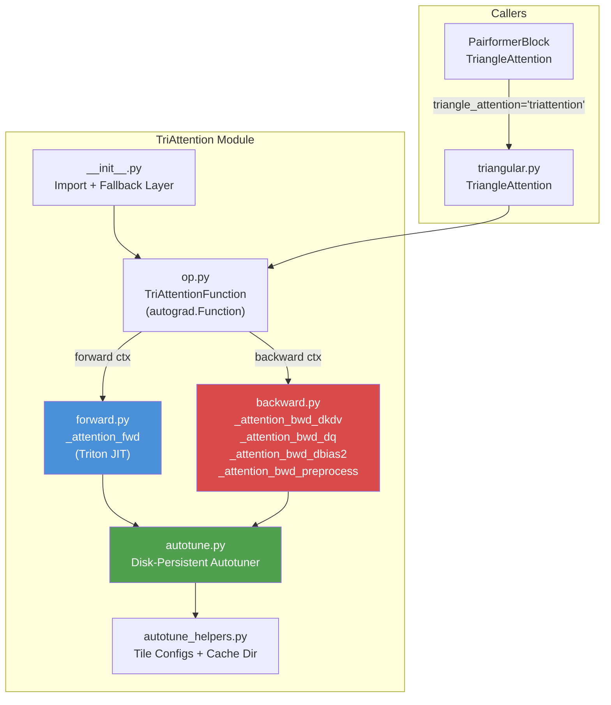
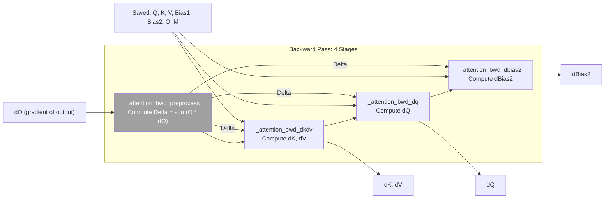

---
slug:21-custom-triton-attention-kernel
blog_type:normal
---


**三角形注意力**运算是 AlphaFold 类架构中计算量最大的子程序之一。它在大型成对表示张量上，被数十个 Pairformer 模块反复调用。Protenix 内置了一个定制的基于 Triton 的算子（kernel）—— **TriAttention** 模块。该模块将 QK^T 点积、双偏置加法、softmax 以及 Value 权重求和融合为一个基于分块的单次 GPU 处理过程，并包含完全可微分的反向传播。本文档将深入剖析该算子的架构、基于分块的内存管理、持久化自动调优框架，以及在遇到不受支持的硬件时的平滑降级机制。

来源: [kernels.md](docs/kernels.md#L1-L52), [op.py](protenix/model/tri_attention/op.py#L30-L192), [forward.py](protenix/model/tri_attention/forward.py#L29-L189)

---

## 架构概述

TriAttention 算子位于 `protenix/model/tri_attention/` 目录下，作为一个独立模块存在，由五个紧密耦合的文件组成。每个文件各司其职：`forward.py` 和 `backward.py` 定义了 Triton JIT 算子；`op.py` 将它们封装在 `torch.autograd.Function` 中；`autotune.py` 提供了具备磁盘持久化能力的自动调优器；`autotune_helpers.py` 则提供了分块配置的搜索空间和缓存目录管理。

来源: [__init__.py](protenix/model/tri_attention/__init__.py#L26-L112), [op.py](protenix/model/tri_attention/op.py#L30-L192)



### 张量布局与偏置语义

与标准的多头注意力机制不同，三角形注意力在由 `(batch, N, sequence, heads, head_dim)` 索引的 **4D 注意力空间** 上进行运算，其中 `N`（外部配对维度）等于 `S`（内部序列维度）。该算子接收两个结构截然不同的偏置张量，它们会被直接融合到注意力 logits 中——这种设计选择避免了在显存 (HBM) 中实例化完整的 QK^T+bias 矩阵。

| 张量 | 形状 | 作用 | 梯度 |
|--------|-------|------|----------|
| `Q` | `(B, N, S, H, D)` | 查询项 | ✅ |
| `K` | `(B, N, S, H, D)` | 键项 | ✅ |
| `V` | `(B, N, S, H, D)` | 值项 | ✅ |
| `Bias1` | `(B, N, 1, 1, S)` | 行结构偏置（掩码，在查询位置和头上进行广播） | ❌ 无梯度 |
| `Bias2` | `(B, 1, H, S, S)` | 完整配对结构偏置（在 N 维度上广播） | ✅ |
| `O` (输出) | `(B, N, S, H, D)` | 注意力输出 | — |
| `M` (输出) | `(B, N, S, H)` | 用于反向传播的 Log-sum-exp | — |

`Bias1` 张量沿其首个空间轴使用 **零广播步长**，使其成为按行索引的掩码。`Bias2` 携带了来自成对表示的可学习配对偏置信号，因此需要计算梯度。辅助函数 `get_tag(S)` 会将序列长度向上取整到最接近的 32 的倍数（上限为 4096），以此构建稳定的自动调优缓存键值，从而确保为 `S=256` 选取的配置在处理 `S=257` 时能够被直接复用，无需重新进行基准测试。

来源: [op.py](protenix/model/tri_attention/op.py#L29-L31), [op.py](protenix/model/tri_attention/op.py#L131-L153), [forward.py](protenix/model/tri_attention/forward.py#L47-L70)

---

## 前向算子：融合双偏置的分块 Flash Attention

前向算子 `_attention_fwd` 实现了 **在线 softmax 的 Flash Attention** 算法，并将两个偏置源融合到了 QK^T 累加过程中。每个线程块负责处理 `BLOCK_M` 行查询与 `BLOCK_N` 列键所组成的分块，在寄存器中累加 softmax 的分母并计算输出，全程无需将中间注意力概率写入全局内存。

### 算子启动配置

计算网格是三维的，将 `(query_tile, head, batch×N)` 映射到 GPU 程序 ID：

```python
grid = lambda args: (triton.cdiv(S, args["BLOCK_M"]), H, B * N)
```

这意味着每个 `(batch, N, head)` 三元组都会分配到属于自己的一组程序块，每个程序块负责遍历大小为 `BLOCK_M` 的查询位置分块对应的所有 `S` 个键位置。`BLOCK_M` 和 `BLOCK_N` 的值由自动调优器决定。

来源: [op.py](protenix/model/tri_attention/op.py#L52-L57), [forward.py](protenix/model/tri_attention/forward.py#L72-L77)

### 带有偏置预累加的在线 Softmax

核心内层循环针对每个键值分块执行以下操作：

```python
# 加载偏置张量并融合到 qk 累加器中
qk = bias1.to(tl.float32) + bias2.to(tl.float32)

# 融合 GEMM：Q @ K^T + 预加载偏置
qk = tl.dot(q, tl.trans(k), qk,
            input_precision="ieee" if deterministic else "tf32") * qk_scale

# 在线 softmax 重缩放
m_ij = tl.maximum(tl.max(qk, 1), m_i)
qk = qk - m_ij[:, None]
alpha = tl.math.exp2(m_i - m_ij)
p = tl.math.exp2(qk)
l_ij = l_i * alpha + tl.sum(p, 1)
acc = acc * alpha[:, None]

# 融合 P @ V
v = tl.load(v_ptr, ...)
p = p.to(input_dtype)
acc = tl.dot(p, v, acc, input_precision="ieee" if deterministic else "tf32")
```

<CgxTip>该算子使用了 `exp2`（以 2 为底的指数运算），并配合 `qk_scale = 1.4426950408889634`（即 `1/ln(2)`），将标准的 `softmax(QK^T / sqrt(d))` 转换为 `exp2(QK^T * (1/sqrt(d)) / ln(2))`。这是一项深思熟虑的硬件优化——`exp2` 在 NVIDIA GPU 上对应单条快速指令，而 `exp` 则需要多个计算周期。</CgxTip>

`deterministic` 标志通过 Triton 的 `input_precision` 参数在 TF32（快速、低精度）和 IEEE FP32（精确）点积之间进行切换。这使得在模型评估阶段能够获得可复现的数值结果，同时在训练阶段最大化吞吐量。

来源: [forward.py](protenix/model/tri_attention/forward.py#L120-L160), [op.py](protenix/model/tri_attention/op.py#L48-L50)

### 内存管理：块指针与边界处理

所有张量访问均采用 Triton 的 `tl.make_block_ptr` API，该 API 提供了经过编译时检查的 2D 块访问，并支持配置内存布局顺序。`boundary_check` 和 `padding_option="zero"` 参数用于处理非 `BLOCK_M`/`BLOCK_N` 整数倍的序列长度，确保对任意 `S` 均能表现正确。

每个块指针上的 `order` 参数指定了首选的内存访问模式：`(1, 0)` 表示按列优先（沿第一轴连续），`(0, 1)` 表示按行优先。这对于合并跨 `BLOCK_M × HEAD_DIM` 查询分块的全局内存加载至关重要。

来源: [forward.py](protenix/model/tri_attention/forward.py#L79-L135)

---

## 反向算子：四阶段梯度计算

反向传播被解耦为四个独立的 Triton 算子，每个算子都有其专属的自动调优配置集。这种解耦允许对每个梯度组件进行独立优化，并遵循了 Flash Attention 的反向传播策略，即从保存的 log-sum-exp 张量 `M` 中重新计算注意力概率。



### 阶段 1：预处理（Delta 计算）

`_attention_bwd_preprocess` 算子为每个查询位置计算 `Delta[i] = sum_j(O[i,j] * dO[i,j])`。此标量将在后续所有梯度算子中使用，以避免显式重复计算 softmax 的雅可比向量积。

来源: [backward.py](protenix/model/tri_attention/backward.py#L31-L88)

### 阶段 2：计算 dK 和 dV

`_attention_bwd_dkdv` 算子针对每个大小为 `BLOCK_M` 的键值块遍历查询分块。它利用保存的 `M` 重新计算注意力概率 `P = exp2(QK^T * scale - M)`，随后进行累加：

- `dV += P^T @ dO`
- `dK += dQK^T @ Q`，其中 `dQK = P * (dP - Delta)` 且 `dP = dO @ V^T`

此处的分块方式与前向传播相比进行了转置——键/值维度变成了外层 `BLOCK_M` 循环，而查询维度变成了内层 `BLOCK_N` 循环——从而能够在不使用原子操作的情况下实现高效累加。

来源: [backward.py](protenix/model/tri_attention/backward.py#L91-L295)

### 阶段 3：计算 dQ

`_attention_bwd_dq` 算子与前向传播的分块模式相呼应，通过遍历键值分块来累加每个查询块的梯度。注意力概率的计算方式与阶段 2 相同，并执行 `dQ += dQK @ K`。

来源: [backward.py](protenix/model/tri_attention/backward.py#L298-L450)

### 阶段 4：计算 dBias2

`_attention_bwd_dbias2` 算子具有截然不同的网格结构：`(cdiv(S, BLOCK_M), cdiv(S, BLOCK_N), B*H)` ——它直接对 2D 的 `S×S` 偏置矩阵进行分块。对于每个空间偏置元素，它都会在 `N` 维度上进行循环，累加 `dBias2[s1,s2] += sum_n dQK[n,s1,s2]`。由于 `Bias2` 的梯度需要在 `N` 维度而非 `S` 维度上进行规约操作，因此该算子运行在与另外三个反向算子不同的网格上。

来源: [backward.py](protenix/model/tri_attention/backward.py#L453-L610), [op.py](protenix/model/tri_attention/op.py#L107-L129)

---

## 磁盘持久化自动调优框架

Protenix 使用定制的 `Autotuner` 子类替换了 Triton 默认的内存自动调优器，该子类会将基准测试结果以 JSON 格式持久化存储到磁盘。这是该算子模块中架构意义最重大的设计决策之一，因为在 10 个候选配置中对单个算子配置进行自动调优可能需要几分钟的时间——如果使用原生的调优器，这些结果会在进程重启时丢失。

### 缓存架构

每个算子函数的最优配置都被缓存在 `protenix/model/tri_attention/TriAttentionCache/<rank>/` 目录下，文件名格式为 `<function_name>_<major-minor_capability>.json`。缓存键值结合了自动调优的 `key` 参数（`H`、`HEAD_DIM`、`TAG_N`）以及张量数据类型，确保 `bf16` 和 `fp32` 输入能够获得各自独立优化的配置。

对于多 GPU 训练，每个 rank 都有自己专属的缓存目录。新的 rank 会自动从 rank 0 的目录中复制缓存，在允许针对特定 rank 进行优化的同时，避免了冗余的基准测试。

| 缓存属性 | 值 |
|----------------|-------|
| 根目录 | `protenix/model/tri_attention/TriAttentionCache/` |
| 各 rank 子目录 | `<DIST_WRAPPER.rank>/` |
| 文件命名 | `{fn_name}_{capability}.json` (如 `_attention_fwd_8-0.json`) |
| 缓存键 | `{H}_{HEAD_DIM}_{TAG_N}_{dtype}` |
| 序列化 | 通过 `config_to_dict` / `dict_to_config` 进行 JSON 序列化 |
| 并发性 | `multiprocessing.Lock` 保护所有文件 I/O |

来源: [autotune.py](protenix/model/tri_attention/autotune.py#L42-L108), [autotune_helpers.py](protenix/model/tri_attention/autotune_helpers.py#L16-L46)

### 配置搜索空间

该算子为五个 JIT 算子分别定义了 **独立的** 自动调优配置列表。每个配置都明确指定了 `BLOCK_M`、`BLOCK_N`（适用时）、`num_warps` 和 `num_stages`：

| 算子 | 配置数量 | 最佳配置示例 |
|--------|-----------|---------------------|
| `_attention_fwd` | 10 | `(128, 32, warps=2, stages=2)`, `(64, 32, warps=4, stages=2)` |
| `_attention_bwd_dq` | 10 | `(64, 32, warps=2, stages=2)`, `(32, 64, warps=2, stages=2)` |
| `_attention_bwd_dkdv` | 10 | `(64, 32, warps=2, stages=1)`, `(32, 32, warps=1, stages=2)` |
| `_attention_bwd_dbias2` | 10 | `(32, 64, warps=2, stages=2)`, `(16, 32, warps=2, stages=2)` |
| `_attention_bwd_preprocess` | 8 | `(32, warps=2, stages=3)`, `(32, warps=4, stages=5)` |

设置环境变量 `TRITON_PRINT_AUTOTUNING=1` 后，自动调优器在每次首次调优运行结束后，会将选定的最佳配置及总基准测试时间打印到标准输出。

来源: [autotune_helpers.py](protenix/model/tri_attention/autotune_helpers.py#L48-L126), [autotune.py](protenix/model/tri_attention/autotune.py#L110-L131)

---

## 集成：算子选择与 Pairformer 调用路径

TriAttention 算子是三角形注意力机制四个可选后端之一。该选择由 [configs_base.py](configs/configs_base.py) 中 `model_configs` 的 `triangle_attention` 字段控制，默认值为 `"cuequivariance"`。可用选项包括：

| 后端 | 配置值 | 描述 |
|---------|-------------|-------------|
| **cuEquivariance** | `"cuequivariance"` | NVIDIA 优化库（默认） |
| **TriAttention** | `"triattention"` | 定制 Triton 算子（见本页） |
| **DeepSpeed** | `"deepspeed"` | DS4Sci_EvoformerAttention（依赖 CUTLASS） |
| **PyTorch native** | `"torch"` | 标准 PyTorch 实现 |

该字符串值从配置系统依次传递，经由 `PairformerBlock.forward()` 方法进入 `TriangleAttention` 模块，由该模块分发至相应的具体实现。当选择 `"triattention"` 时，该模块会调用 `TriAttentionFunction.apply()` 并传入形状适配的张量。

来源: [configs_base.py](configs/configs_base.py#L145), [pairformer.py](protenix/model/modules/pairformer.py#L112-L130), [kernels.md](docs/kernels.md#L8-L16)

---

## 平滑降级：针对不支持 GPU 的 PyTorch 回退机制

`__init__.py` 模块将 Triton 的导入封装在 try/except 块中。当 Triton 不可用时，它会提供一层 **功能完备的 PyTorch 回退机制**，底层调用 `torch.nn.functional.scaled_dot_product_attention`。这解决了一个已知的兼容性问题（追踪编号：Issue #185），即诸如 RTX 3090/4090 等消费级 GPU 无法编译或执行特定的 Triton 算子。

当回退机制激活时，该模块会发出 `UserWarning`，并导出 `TRITON_AVAILABLE = False`。作为回退方案的 `TriAttentionFunction.apply()` 会将 5D 张量重塑为 PyTorch SDPA 所预期的标准 `(batch, seq, dim)` 格式，以可加性注意力掩码的形式应用这两种偏置，最后再将输出重塑回原始形状。

| 场景 | 行为 | 性能影响 |
|----------|----------|-------------------|
| 数据中心 GPU (A100/H100) | 使用 Triton 算子 | 最优 |
| 消费级 GPU (RTX 3090/4090) | 回退至 PyTorch SDPA | 可用，但速度较慢 |
| 无 CUDA 环境 | 在 CPU 上运行 PyTorch SDPA | 仅保证计算正确性 |

来源: [__init__.py](protenix/model/tri_attention/__init__.py#L36-L112), [test_triton_compatibility.py](tests/test_triton_compatibility.py#L37-L126)

<CgxTip>`test_triton_compatibility.py` 中的测试套件明确记录了 GPU 的兼容性，并推荐使用 Triton 3.x。如果你在 RTX 3090/4090 上遇到 `"Not Supported"` 错误，变通方法是直接依赖自动触发的 PyTorch 回退机制，或者在配置中显式设置 `triangle_attention="torch"`。</CgxTip>

---

## 数值考量：TF32、确定性与精度模式

该算子支持 `deterministic` 标志，用于在前向和反向传播中控制数值精度。当 `deterministic=False`（训练默认值）时，所有 `tl.dot` 调用均使用 `input_precision="tf32"`，这会将 FP32 输入舍入为 TF32 格式（10 位尾数），从而在 Ampere 及更新架构的 GPU 上实现约 2-3 倍的加速。当 `deterministic=True` 时，`input_precision="ieee"` 会强制执行完整的 FP32 精度计算。

无论输入数据类型为何，在线 softmax 均完全在 FP32 下进行计算，使用存储为 `tl.float32` 的 `m_i`（运行最大值）和 `l_i`（运行分母）累加器。仅在执行归一化之后，输出才会被转换回输入的数据类型。Log-sum-exp 的结果 `M` 也会以 FP32 格式进行存储，供反向传播使用。

`Bias1` 和 `Bias2` 张量在被添加到 QK^T 累加器之前，会被向上转型为 `tl.float32`，从而防止当偏置包含微小但关键的数据时出现精度丢失——这在处理训练过程中学习到的结构化配对偏置时尤为重要。

来源: [forward.py](protenix/model/tri_attention/forward.py#L137-L160), [op.py](protenix/model/tri_attention/op.py#L44), [configs_base.py](configs/configs_base.py#L152)

---

## 关键设计决策摘要

| 决策 | 原理 |
|----------|-----------|
| 使用 `exp2` 替代 `exp` | 映射为单条 GPU 指令；`qk_scale = 1/ln(2)` 将自然指数转换为以 2 为底的指数 |
| 为 `dBias2` 设立独立算子 | `Bias2` 的梯度需要在 `N` 维度上进行规约——其访问模式有根本区别 |
| `Bias1` 无梯度 | `Bias1` 是掩码张量；计算其梯度会浪费内存和算力 |
| `TAG_N` 自动调优键 | 将 `S` 取整至最接近的 32（上限 4096），确保面对相似序列长度时缓存的稳定性 |
| 磁盘持久化自动调优 | 避免每次重启训练时耗费数分钟进行重复的基准测试 |
| 拆分为四个独立反向算子 | 实现配置的独立优化；规避算子间的寄存器压力权衡 |
| PyTorch SDPA 回退 | 无需修改代码即可支持消费级 GPU |

---

## 延伸阅读

- **[三角形乘法运算](22-triangular-multiplicative-operations)** —— 配套的成对更新算子，共享相同的基于配置的后端选择模式
- **[Pairformer 堆栈](9-pairformer-stack)** —— 介绍 `PairformerBlock` 如何将 TriAttention 与三角形乘法更新以及注意力配对偏置进行协同调度
- **[定制 LayerNorm CUDA 算子](23-custom-layernorm-cuda-kernel)** —— Protenix 性能栈中的另一个定制算子，可将归一化速度提升 30-50%
- **[架构概述](8-architecture-overview)** —— 展示三角形注意力在端到端流程中具体位置的完整模型拓扑图