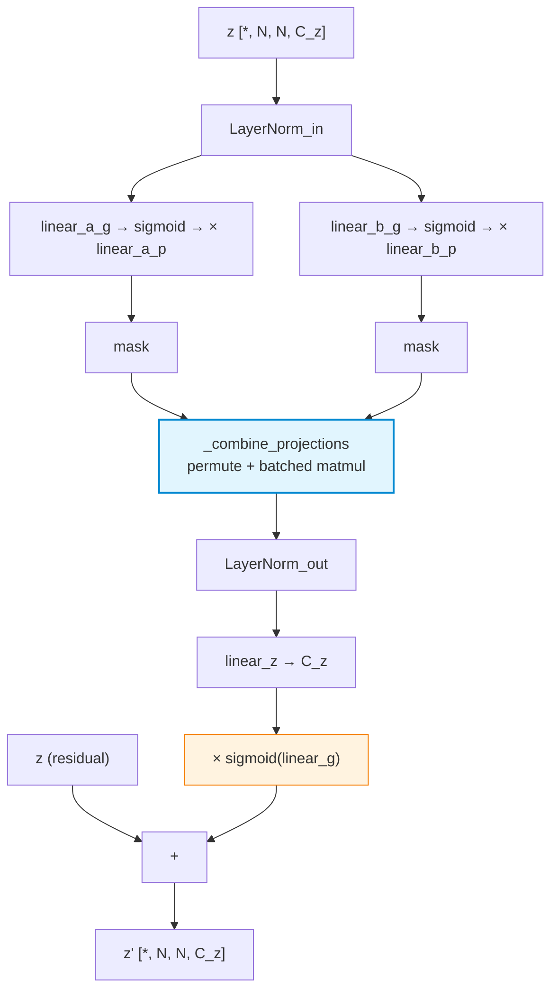
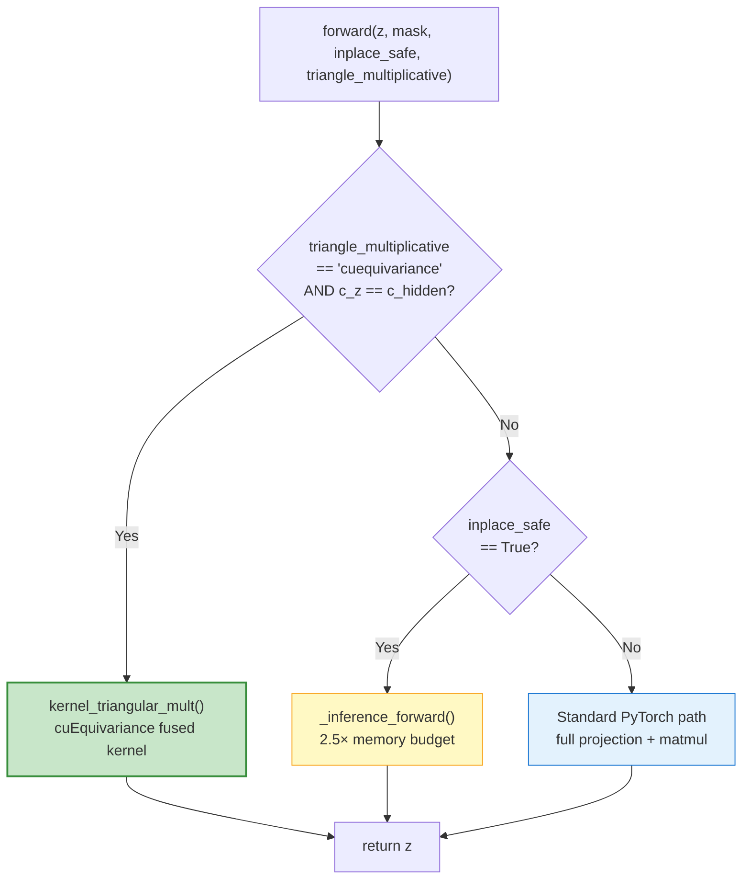

---
slug:22-triangular-multiplicative-operations
blog_type:normal
---


**三角乘法更新**（Triangular Multiplicative Update，简称 TMU）是 Protenix Pairformer 技术栈中计算复杂度与算法重要性极高的核心操作之一。该方法源于 AlphaFold2 的 Evoformer 模块，其核心机制是在残基对图（residue-pair graph）中沿三角形的边传递信息，从而对配对表示张量 `z` 施加几何一致性约束。Protenix 实现了该操作的两种变体——*传出*（outgoing）与*传入*（incoming），并提供了一套双路径执行策略：包含一个高度优化的 NVIDIA cuEquivariance 融合内核，以及一个具备高效内存推理模式的 PyTorch 原生兜底方案。本文将深入剖析这些操作背后的数学结构、代码架构、内核集成方式以及性能权衡。

来源：[triangular.py](/protenix/model/triangular/triangular.py#L28-L90), [pairformer.py](/protenix/model/modules/pairformer.py#L42-L101)

---

## 算法基础：配对表示上的三角更新

从核心原理来看，配对表示 `z` 是一个形状为 `[*, N, N, C_z]` 的 4 维张量，其中 `N` 为 token 数量，`C_z` 为配对通道维度。每个元素 `z[i, j]` 编码了 token `i` 与 token `j` 之间的关联信息。TMU 操作强制执行了一种**受三角不等式启发的约束**：如果图中存在边 `(i, j)` 和 `(i, k)`，那么这两条边的信息应当共同影响边 `(j, k)`。这是一种基础性的归纳偏置（inductive bias），使得模型能够从一维的序列输入中推导并解析三维结构。

该操作遵循一个四阶段的处理流水线：

1. **输入归一化与门控投影**：首先对 `z` 应用 LayerNorm，随后进行两个独立的门控线性投影——`a` 和 `b`——每个投影各生成一个 `[*, N, N, C_hidden]` 张量。门控机制使用了经 Sigmoid 处理后的学习权重，且该权重被初始化为零（即 `"gating"` 初始化模式）。
2. **三角矩阵乘法（核心步骤）**：投影结果 `a` 和 `b` 通过依赖于特定维度置换的批量矩阵乘法进行合并，以此实现传出边或传入边的特征聚合。
3. **输出归一化与投影**：矩阵乘法的结果通过第二次 LayerNorm 进行归一化，并重新投影回 `C_z` 通道维度。
4. **输出门控**：在通过残差连接将更新值加回原始 `z` 之前，使用一个最终的 Sigmoid 门控对其进行调节。

**传出**（outgoing）变体（算法 11）负责聚合共享同一起始节点的边的信息；而**传入**（incoming）变体（算法 12）则聚合共享同一终止节点的边的信息。两者在算法实现上的唯一区别，仅仅是在执行矩阵乘法之前对投影张量应用的维度置换模式不同。



关键的置换逻辑封装在 `_combine_projections` 方法中。针对**传出**方向，张量 `a` 会被置换为 `[C_hidden, N, N]`，而张量 `b` 同样被置换为 `[C_hidden, N, N]`（在最后两个维度上进行转置），随后通过 `torch.matmul` 执行相乘。对于**传入**方向，两者的置换规则则相互对调。正是这一置换逻辑上的细微差异，构成了这两种算法的分水岭；而在基类中，此项区别被优雅地交由一个布尔类型的 `_outgoing` 标志位来统一调度。

<CgxTip>`_combine_projections` 方法支持 `_inplace_chunk_size` 参数。在推理阶段，该参数可启用原地分块矩阵乘法，通过牺牲部分重复计算的代价来显著降低峰值显存——从占 `z` 大小的 5 倍大幅压缩至 2.5 倍。</CgxTip>

来源：[triangular.py](/protenix/model/triangular/triangular.py#L93-L170), [triangular.py](/protenix/model/triangular/triangular.py#L470-L570), [pairformer.py](/protenix/model/modules/pairformer.py#L79-L92)

---

## 类继承体系与模块架构

三角乘法操作在 `protenix/model/triangular/triangular.py` 文件中构建了一套层次分明的继承体系。这种设计理念巧妙地将抽象的算法逻辑与具体的执行路径分离开来：

| 类名 | 职责 | 核心行为 |
|---|---|---|
| `BaseTriangleMultiplicativeUpdate` | 抽象基类 (ABC) | 定义共享参数（`linear_g`, `linear_z`, LayerNorms）、抽象的 `forward` 方法以及 `_combine_projections` |
| `TriangleMultiplicativeUpdate` | 具体实现类 | 新增投影层（`linear_a_p/g`, `linear_b_p/g`），实现所有三条前向传播路径：cuEquivariance、torch-training 及 torch-inference |
| `TriangleMultiplicationOutgoing` | 便捷子类 | 通过 `partialmethod` 设定 `_outgoing=True` |
| `TriangleMultiplicationIncoming` | 便捷子类 | 通过 `partialmethod` 设定 `_outgoing=False` |

位于 `layers.py` 中的 `OpenfoldLinear` 层提供了专用于特定初始化策略的线性投影。该层共支持六种初始化策略，其中 TMU 采用了以下两种关键模式：

- **`"gating"`**：权重初始化为**零**，偏置初始化为**一**。此模式应用于所有的门控投影层（`linear_a_g`, `linear_b_g`, `linear_g`）。这意味着所有的门控在初始阶段均处于全开状态（在偏置为 1 的作用下，sigmoid(0) = 0.5 的初始开度被放大），从而确保模型自训练伊始便能顺畅地进行梯度传播。
- **`"final"`**：权重初始化为**零**，偏置初始化为**零**。此模式用于输出投影层（`linear_z`），意味着 TMU 初始阶段产生的更新值为零——这是一种对残差连接极其友好的初始化方式，使得网络能够循序渐进地学习并产出更新值。

`layers.py` 内的 LayerNorm 工厂函数会根据 `LAYERNORM_TYPE` 环境变量，在**融合 CUDA 内核**（`FusedLayerNorm`）与 PyTorch 原生兜底方案（`OpenFoldLayerNorm`）之间作出抉择。该融合内核吸收并改进了 FastFold 与 Oneflow 的实现，可将 LayerNorm 的运算效率提升 30% 至 50%。

来源：[triangular.py](/protenix/model/triangular/triangular.py#L93-L188), [triangular.py](/protenix/model/triangular/triangular.py#L573-L587), [layers.py](/protenix/model/triangular/layers.py#L104-L197), [layers.py](/protenix/model/triangular/layers.py#L246-L257), [kernels.md](/docs/kernels.md#L1-L12)

---

## `forward` 方法：三条执行路径

`TriangleMultiplicativeUpdate.forward` 方法是一个关键的策略路由节点，它会根据 `triangle_multiplicative` 配置项的字符串以及运行时条件，在三条执行路径中作出选择。这种调度机制是贯穿整个 Pairformer 技术栈中最为核心的性能杠杆。



### 路径 1：cuEquivariance 融合内核（默认）

当配置项 `triangle_multiplicative == "cuequivariance"` 且满足 `c_z == c_hidden` 时，完整的 TMU 操作——包含归一化、门控投影、三角矩阵乘法、输出归一化及输出门控——都会通过 `kernel_triangular_mult()` 函数被无缝融合进一次单一的 CUDA 内核调用中。该函数底层调用了 NVIDIA 提供的 `cuequivariance_torch.primitives.triangle.triangle_multiplicative_update` 接口。值得强调的是，各层的权重会被解包并作为内核参数直接传入，而非以模块参数的形式传递，从而彻底规避了 Python 层面的额外开销。

该内核支持通过环境变量进行自动调优：`CUEQ_TRITON_TUNING` 可配置为 `"ONDEMAND"`（首次调用时按需调优）或 `"AOT"`（提前进行全面调优）。需要特别注意的是一个核心限制条件：**隐藏层维度必须是 32 的倍数**，且 API 强制要求 `c_hidden == c_z`。一旦该条件不被满足（例如在通道维度不一致的模板模块中），代码逻辑会自动回退至 PyTorch 原生路径。

### 路径 2：高效内存推理路径

`_inference_forward` 方法是一种精妙的显存优化策略，能够将峰值显存消耗从原先占 `z` 大小的 **5 倍大幅压缩至 2.5 倍**。其底层依赖于一种原地 z 缓存策略来实现：

- 张量 `a`（首次投影结果）会在前置环节被完整实例化（显存消耗攀升至 2 倍 `z` 的大小）。
- 第二次投影 `b` 与门控 `g` 则采用分块计算。
- 引入一个 **z 缓存**（其大小仅为 `z` 的一半），用于暂存被覆写的 `z` 张量象限数据，从而保障后续分块计算所需输入数值的精准恢复。
- 当推进至中点（`i >= N/2`）时，系统会通过 `flip_z_cache_()` 方法对 z 缓存进行“重定向”，将其覆盖范围切换至第 3 和第 4 象限。
- 各分块的输出结果会**直接原地写入** `z` 中，免去了分配独立输出张量的开销。

### 路径 3：标准 PyTorch 训练路径

训练路径会实例化所有中间张量。该路径内置了一套 **fp16 防溢出保护机制**：当启用 fp16 精度时，系统会率先计算投影 `a` 与 `b` 的标准差；若其值不为零，则在进行矩阵乘法之前，依据所得的标准差对这些投影进行归一化处理。此举旨在防范低精度模式下的数值溢出风险。当处于 fp16 激活态时，矩阵乘法运算会在 `autocast(enabled=False)` 的约束下以 fp32 精度执行。

来源：[triangular.py](/protenix/model/triangular/triangular.py#L470-L570), [triangular.py](/protenix/model/triangular/triangular.py#L199-L468), [triangular.py](/protenix/model/triangular/triangular.py#L28-L90), [kernels.md](/docs/kernels.md#L39-L52)

---

## 在 Pairformer 模块中的集成

作为各 `PairformerBlock` 内部最前端的两个子模块，TMU 操作会在三角注意力与配对过渡层介入之前，优先对配对表示 `z` 进行处理。这种集成方式清晰地展现了围绕 Dropout 与残差连接所作的关键设计考量：

```python
# 传出更新 (Algorithm 11)
tmu_update = self.tri_mul_out(z, mask=pair_mask, ...)
z = dropout_add_rowwise(z, tmu_update, self.p_drop, self.training)

# 传入更新 (Algorithm 12)
tmu_update = self.tri_mul_in(z, mask=pair_mask, ...)
z = dropout_add_rowwise(z, tmu_update, self.p_drop, self.training)
```

在**训练阶段**，残差加法与 Dropout 操作均交由高度融合的 `dropout_add_rowwise` 函数统筹处理——这是一个定制化的 Triton 内核，它能够在单次通道内将按行执行的 Dropout 与残差加法无缝融合，并在行维度（维度 -3）内共享同一套 Dropout 掩码。该过程的启停受 `FUSED_DROPOUT_RESIDUAL` 环境变量控制，当系统缺乏 Triton 运行环境时，会自动降级为标准的 PyTorch 原生操作。

在**推理阶段**（`inplace_safe=True`），调用 TMU 模块时会传入 `_add_with_inplace=True` 参数，将残差加法内化到模块逻辑中执行——执行路径可能经由直接返回求和结果的 cuEquivariance 内核，或者依托于 `_inference_forward` 的 z 缓存机制（直接以 `z + update` 的形式原地覆写）。

`PairformerStack` 默认由 48 个此类基础模块层叠而成，同时 `triangle_multiplicative` 策略会通过 `_prep_blocks` 被均匀且统一地分发给所有模块。此外，可借助激活检查点机制（`blocks_per_ckpt`）以模块粒度进行计算换显存的折衷控制，从而在训练过程中有效压缩显存需求。

来源：[pairformer.py](/protenix/model/modules/pairformer.py#L103-L224), [pairformer.py](/protenix/model/modules/pairformer.py#L227-L340), [fused_ops.py](/protenix/model/modules/fused_ops.py#L40-L225), [configs_base.py](/configs/configs_base.py#L108-L135)

---

## 配置与内核选择

TMU 的内核选择由 `configs/configs_base.py` 文件中的模型配置项所把控：

```python
"triangle_multiplicative": "cuequivariance",  # cuequivariance, torch
```

| 配置项 | 取值 | 行为特征 |
|---|---|---|
| **`"cuequivariance"`**（默认） | 融合 NVIDIA 内核 | 单次内核调用即可完成完整的 TMU 计算；要求 `c_z == c_hidden`；支持通过环境变量自动调优；全面兼容 bf16/fp16/fp32 |
| **`"torch"`** | PyTorch 原生 | 实例化所有中间张量；支持任意 `c_z`/`c_hidden` 比例；被模板模块自动调用 |

cuEquivariance 路径在数值运算上还引入了一处不易察觉的差异：为追求更优的 tf32 精度，它采用了**就近舍入** 策略取代默认的向零取整 (RZ) 策略，这可能会导致计算结果出现细微的偏差。该内核的计算精度会自动追踪并契合输入张量的数据类型，而 tf32 格式则可通过 `torch.backends.cuda.matmul.allow_tf32` 实现全局开启。

在自动调优方面，开发者可通过以下环境变量精准调控 cuEquivariance 的行为表现：

| 环境变量 | 用途说明 |
|---|---|
| `CUEQ_TRITON_TUNING` | `"ONDEMAND"`：首次运行时针对新张量形状进行按需调优；`"AOT"`：执行全面的提前编译调优 |
| `CUEQ_TRITON_IGNORE_EXISTING_CACHE` | 强制忽略缓存中已有的调优配置 |
| `CUEQ_TRITON_CACHE_DIR` | 自定义指定调优结果的缓存目录 |

<CgxTip>在 Docker 环境下配合使用 cuEquivariance 调优时，建议通过 `docker commit` 命令持久化保存调优配置。系统默认的快速测试模式仅会查询现有的配置记录，若无匹配则回退至默认值——除非显式开启调优开关，否则不会执行任何调优动作。</CgxTip>

来源：[configs_base.py](/configs/configs_base.py#L128-L135), [kernels.md](/docs/kernels.md#L39-L52), [triangular.py](/protenix/model/triangular/triangular.py#L44-L76)

---

## 三角注意力：互补性操作

严格来讲，`TriangleAttention` 虽作为一个独立的类存在，但它同样驻留于相同的模块文件内，并沿用了同款的 `OpenfoldLinear` 与 `LayerNorm` 底层基建。它实现了算法 13–14，能够对配对表示矩阵的行（起始节点）或列（终止节点）施加注意力机制。与 TMU 截然不同的是，它支持四种内核后端——`"torch"`、`"triattention"`（定制版 Triton）、`"deepspeed"`（基于 CUTLASS 实现的 DS4Sci_EvoformerAttention）以及 `"cuequivariance"`，具体调用哪一个由 `triangle_attention` 配置项说了算。

结构设计上最核心的差异在于，三角注意力采用了标准的多头注意力机制（援引自 `layers.py` 中的 `Attention` 类）并辅以两种偏置项：一是掩码偏置（通过缩放 `-inf` 实现对填充部分的掩蔽）；二是可学习的三角偏置（源自经归一化处理的输入，由单一的 `OpenfoldLinear` 投影生成）。布尔型的 `starting` 标志位负责统筹注意力是沿行维度还是列维度生效，其底层逻辑是分别在注意力运算的前后介入转置操作。

来源：[triangular.py](/protenix/model/triangular/triangular.py#L589-L728), [layers.py](/protenix/model/triangular/layers.py#L299-L473), [kernels.md](/docs/kernels.md#L10-L37), [configs_base.py](/configs/configs_base.py#L130)

---

## 性能评估与权衡

在 cuEquivariance 与 PyTorch 原生路径之间作何取舍，需综合考量以下多个交织的因素：

| 评估维度 | cuEquivariance | PyTorch 原生 |
|---|---|---|
| **计算吞吐量** | 表现极佳——单一融合内核 | 表现稍逊——涉及多次内核启动 |
| **内存占用 (训练期)** | 占用更低——无中间张量实例化 | 占用较高——需实例化所有投影张量 |
| **内存占用 (推理期)** | 由内核统一托管 | 借助 z 缓存仅占 2.5 倍 `z`，或原生模式占用 5 倍 `z` |
| **通道维度灵活性** | 硬性要求 `c_z == c_hidden` | 兼容任意通道比例 |
| **精度支持** | 支援 bf16、fp16、fp32、tf32 (RN 舍入策略) | 支援 bf16（内建防溢出机制）、fp16、fp32 |
| **自动调优** | 内建支持（受环境变量控制） | 不适用 |
| **隐藏层维度限制** | 必须为 32 的整倍数 | 无任何硬性约束 |

PyTorch 路径中所采用的 fp16 防溢出保护机制值得高度关注：它会在全局范围内计算 `a.std()` 与 `b.std()`，并在矩阵乘法之前据此归一化投影张量。这种全局（非逐张量颗粒度）的归一化策略，本质上是以微小的精度扰动为代价，换取了 fp16 模式下绝对的数值稳定性——鉴于 `_combine_projections` 中的批量矩阵乘法在遇到庞大的 `N` 时极易击穿 fp16 的数值上限，此举无疑是一道不可或缺的坚固防线。

来源：[triangular.py](/protenix/model/triangular/triangular.py#L544-L558), [triangular.py](/protenix/model/triangular/triangular.py#L44-L76), [triangular.py](/protenix/model/triangular/triangular.py#L199-L264)

---

## 权重初始化策略

贯穿 TMU 各模块的初始化方案传承自 AlphaFold2 / OpenFold 的代码库，并严格遵循了一套深思熟虑的演进策略：

| 网络层 | 初始化类型 | 权重初始化 | 偏置初始化 | 动机与原理 |
|---|---|---|---|---|
| `linear_a_p`, `linear_b_p` | `"default"` (LeCun) | 截断正态分布，按 fan-in 缩放 | 置为零 | 标准投影模式 |
| `linear_a_g`, `linear_b_g` | `"gating"` | 置为零 | 置为一 | 门控初值始于 sigmoid(1)≈0.73 |
| `linear_g` (输出门控) | `"gating"` | 置为零 | 置为一 | 输出门控初始呈开启状态 |
| `linear_z` (输出投影) | `"final"` | 置为零 | 置为零 | 初始更新量为 0，对残差连接友好 |

`"gating"` 初始化机制显得尤为关键：在权重置零与偏置置一的双重设定下，门控的运算初值恒定为 `sigmoid(0 × x + 1) = sigmoid(1) ≈ 0.73`，这意味着所有投影特征在初始阶段均会以 73% 的强度被平滑放行。若再叠加 `linear_z` 的 `"final"` 初始化策略（直接将输出投影归零），其**综合效应是：TMU 模块在初始化阶段对配对表示的贡献量被严格压制至零**，必须完全依靠反向传播的梯度信号来循序渐进地摸索并产出有价值的更新值。鉴于此模块操作会在 48 个 Pairformer 模块中堆叠串联，这无疑是维系模型整体稳定性的至关重要的防御性举措。

来源：[layers.py](/protenix/model/triangular/layers.py#L86-L101), [layers.py](/protenix/model/triangular/layers.py#L137-L173), [triangular.py](/protenix/model/triangular/triangular.py#L113-L121)

---

## 延伸阅读

- 若需了解 TMU 如何完美融入宏大的 Pairformer 架构体系，请参阅 [Pairformer Stack](9-pairformer-stack)
- 若需探究互补性的注意力优化策略，请参阅 [Custom Triton Attention Kernel](21-custom-triton-attention-kernel)
- 若需深入了解 TMU 内部调用的融合 LayerNorm CUDA 内核，请参阅 [Custom LayerNorm CUDA Kernel](23-custom-layernorm-cuda-kernel)
- 若需全面掌握内核切换背后的配置系统细节，请参阅 [Configuration System](26-configuration-system)