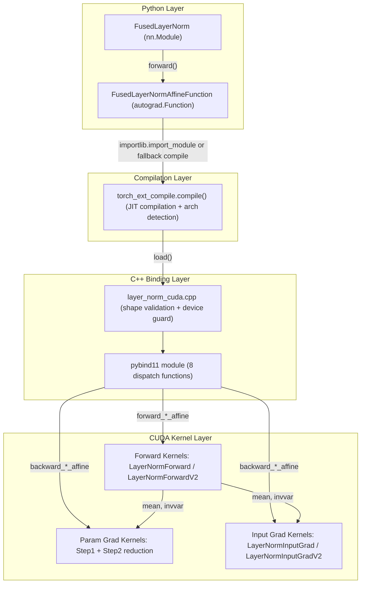
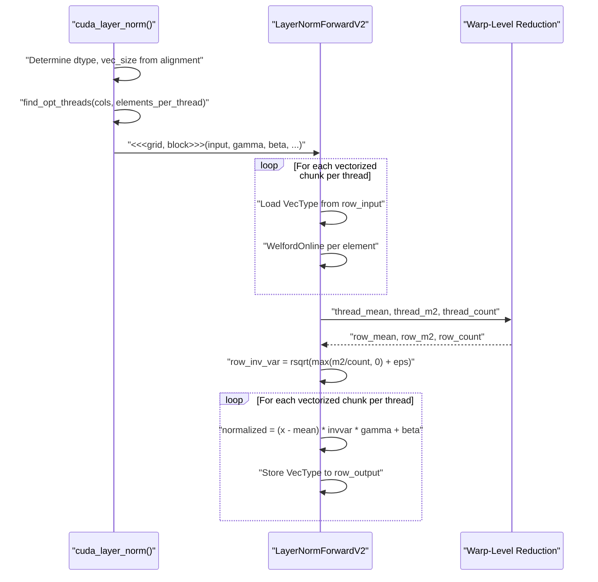
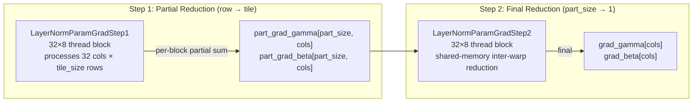

---
slug:23-custom-layernorm-cuda-kernel
blog_type:normal
---


Protenix 使用自定义的融合 CUDA kernel 替换了 PyTorch 原生的 `nn.LayerNorm`。该实现将多阶段的归一化流水线——包括均值计算、方差归约、仿射缩放和梯度反向传播——整合为一个单一的 kernel 家族，并采用了向量化内存 I/O、Warp 级别的 Welford 累加，以及根据 Occupancy 调优的网格调度。本文将深入剖析其四层架构（Python 模块 → autograd 函数 → C++ 分发器 → CUDA kernel），并详细解释使其性能超越 PyTorch 基线版本的各类算法与硬件级优化策略。

## 模块架构

该 kernel 位于 `protenix/model/layer_norm/` 目录下，作为一个独立封装的包，在四个层级之间实现了清晰的职责分离。下图展示了所有组件及其依赖链：



该包导出了一个单一的 `FusedLayerNorm` 类，它是 `torch.nn.LayerNorm` 的直接替代品，具有完全相同的构造函数签名：`normalized_shape`、`create_scale`、`create_offset` 和 `eps`。在内部，`forward()` 方法会委托给 `FusedLayerNormAffineFunction.apply()` 执行，这是一个自定义的 `torch.autograd.Function`，负责将调用分发至 CUDA 扩展模块 `fast_layer_norm_cuda_v2`。

来源: [layer_norm.py](/protenix/model/layer_norm/layer_norm.py#L190-L233), [__init__.py](/protenix/model/layer_norm/__init__.py#L16-L16)

## 惰性 JIT 编译与架构检测

该 kernel 扩展并非预编译的；它采用了一种延迟加载策略，在首次导入时进行构建。当 `layer_norm.py` 首次被导入时，它会尝试加载预编译好的 `fast_layer_norm_cuda_v2` 模块。如果加载失败，则会回退调用 `torch_ext_compile.compile()`，该函数会使用经过精心调优的编译标志来触发 PyTorch 的 JIT 扩展构建器。

`torch_ext_compile.py` 中的编译逻辑执行了**动态 GPU 架构探测**：它通过调用 `nvcc --list-gpu-arch` 命令来检查当前安装的工具包支持哪些计算能力，随后仅为受支持架构与目标架构（SM 70、80、86、89、90、100）的交集构造 `-gencode` 标志。如果探测彻底失败，则回退到安全的默认架构集合 `{70, 80, 86, 90}`。这一机制有效避免了因 PyTorch 的 `TORCH_CUDA_ARCH_LIST` 包含了当前 nvcc 版本无法识别的架构而导致的常见构建失败问题。

| 编译标志 | 用途 |
|---|---|
| `-O3` | 针对主机端和设备端代码开启最高级别优化 |
| `--use_fast_math` | 启用快速 `rsqrt`、`__fdividef` 以及 Flush-to-zero（刷新至零）机制 |
| `-maxrregcount=32` | 限制寄存器压力 → 提升 Warp 的 Occupancy |
| `-U__CUDA_NO_HALF_OPERATORS__` | 启用半精度算术运算符 |
| `-U__CUDA_NO_HALF_CONVERSIONS__` | 启用隐式的 half↔float 类型转换 |
| `--expt-relaxed-constexpr` | 允许在设备端代码中使用 constexpr 进行模板分发 |
| `--expt-extended-lambda` | 启用扩展 Lambda 表达式，用于内联 kernel 仿函数 |
| `-std=c++17` | 结构化绑定和 `if constexpr` 的必备标准 |

`-maxrregcount=32` 标志尤为重要：通过将每个线程的寄存器数量上限定为 32，迫使编译器将数据溢出至本地内存，但以此换取了在每个 SM 上调度更多 Warp 的能力。对于受限于内存带宽的归一化计算负载而言，这种取舍是十分有利的。

<CgxTip>构建系统会在运行时根据探测到的 nvcc 能力设置 `TORCH_CUDA_ARCH_LIST`，并覆盖任何已设定的环境变量。这意味着你无法通过预设该变量来控制目标架构——探测逻辑将始终具有最高优先级。</CgxTip>

来源: [torch_ext_compile.py](/protenix/model/layer_norm/torch_ext_compile.py#L22-L96), [layer_norm.py](/protenix/model/layer_norm/layer_norm.py#L40-L66)

## 仿射模式分发

该 kernel 的核心设计决策之一是支持四种截然不同的仿射参数配置，每种配置都被分发至专用的 C++ 入口点，而不是在 kernel 内部的运行时进行检查。这消除了关键执行路径上的分支分歧。

| 模式 | 调用的 Python 函数 | C++ 绑定 | gamma | beta |
|---|---|---|---|---|
| 无仿射 | `forward_none_affine` | `layer_norm_affine(input, shape, NULL, NULL, eps)` | ✗ | ✗ |
| 仅含偏置 | `forward_with_bias_affine` | `layer_norm_affine(input, shape, NULL, beta, eps)` | ✗ | ✓ |
| 仅含权重 | `forward_with_weight_affine` | `layer_norm_affine(input, shape, gamma, NULL, eps)` | ✓ | ✗ |
| 双重仿射 | `forward_with_both_affine` | `layer_norm_affine(input, shape, gamma, beta, eps)` | ✓ | ✓ |

这种分发逻辑在 `FusedLayerNormAffineFunction.forward()` 中，通过嵌套的 `if weight is None / if bias is None` 决策树来完成，并在 `backward()` 中镜像实现了同样的四路拆分。在 C++ 层面，这四种前向变体全部汇入同一个 `layer_norm_affine()` 函数；对于未提供的参数，该函数会传入 `NULL` 指针——接着，CUDA kernel 会利用 `process_type = (gamma != NULL)*2 + (beta != NULL)` 表达式，在编译阶段通过 `if/else` 链选定最终的输出计算公式。

来源: [layer_norm.py](/protenix/model/layer_norm/layer_norm.py#L69-L187), [layer_norm_cuda.cpp](/protenix/model/layer_norm/kernel/layer_norm_cuda.cpp#L73-L90), [layer_norm_cuda_kernel.cu](/protenix/model/layer_norm/kernel/layer_norm_cuda_kernel.cu#L113-L130)

## 前向 Kernel：Welford 在线归一化

### 算法：基于 Welford 实现数值稳定的方差计算

前向 kernel 采用 **Welford 在线算法** 在单次遍历中计算均值和方差，有效避免了朴素的双重遍历方法中常见的灾难性抵消问题（当均值远大于标准差时，方差 = E[x²] - E[x]² 会损失精度）。该算法维护了三个动态累加器：`mean`、`m2`（偏差平方和）以及 `count`，并针对每个元素进行迭代更新：

```
count += 1
delta1 = val - mean
mean += delta1 / count
delta2 = val - mean
m2 += delta1 * delta2
```

**并行 Welford 合并** 函数利用公式 `mean_new = mean_a + delta * (count_b / count_total)` 将来自不同线程的累加器进行组合，从而在并行归约过程中保持数值的稳定性。该 kernel 提供了两种重载版本：一个是单值版本，另一个是用于合并局部统计信息的块合并版本。

来源: [layer_norm_cuda_kernel.cu](/protenix/model/layer_norm/kernel/layer_norm_cuda_kernel.cu#L40-L59)

### 基于 Shuffle 指令的 Warp 级归约

该 kernel 没有使用共享内存进行 Warp 内部归约，而是采用 `__shfl_xor_sync` 蝶形归约算法，在一个 Warp 的 32 个线程之间合并 Welford 累加器：

```cpp
for(int mask = syc_thread_num/2; mask >= 1; mask /= 2) {
    float b_mean  = __shfl_xor_sync(0xffffffff, *mean,  mask);
    float b_m2    = __shfl_xor_sync(0xffffffff, *m2,    mask);
    float b_count = __shfl_xor_sync(0xffffffff, *count, mask);
    WelfordOnline(b_mean, b_m2, b_count, mean, m2, count);
}
```

这个 `WelfordWarpAllReduce` 函数执行 5 次 shuffle 迭代（掩码依次为：16→8→4→2→1），在 32 个通道间完成归约。`syc_thread_num` 参数允许在每行活跃线程不足 32 个时进行局部归约。

来源: [layer_norm_cuda_kernel.cu](/protenix/model/layer_norm/kernel/layer_norm_cuda_kernel.cu#L61-L73)

### 向量化前向 Kernel (V2)

主前向 kernel 为 `LayerNormForwardV2`，它通过 `float4`、`float2` 或 `float` 的重解释转换，使得每个线程能够加载多个元素，从而利用了**向量化内存事务**。向量化宽度是在主机端根据列字节对齐情况进行分派选定的：

| 列数 × 元素大小 | 向量类型 | 每个线程处理的元素数 |
|---|---|---|
| % 16 == 0 | `float4` (16 字节) | 4 (fp32) / 8 (fp16/bf16) |
| % 8 == 0 | `float2` (8 字节) | 2 (fp32) / 4 (fp16/bf16) |
| % 4 == 0 | `float` (4 字节) | 1 (fp32) / 2 (fp16/bf16) |
| 其他 | `T` (2 字节) | 1 (仅限 fp16/bf16) |

该 kernel 使用一个包含 128 个线程的 2D 线程块 `(threads_per_row, rows_per_block)` 来处理每一行数据。线程配置由 `find_opt_threads()` 计算得出，该函数会从 `{1, 2, 4, 8, 16, 32}` 中选取大于等于 `cols / elements_per_thread` 的最小二次幂值。这一机制确保了每一行至少能分配到一个 Warp，从而保证 Welford 归约的执行效率。

前向计算过程分为三个阶段执行：

1. **累加**：每个线程遍历 `TOTAL_BLOCKS` 个向量化数据块，在本地累积 Welford 统计信息。
2. **归约**：`WelfordWarpAllReduce` 将每个线程的统计信息合并为按行计算的 `mean` 和 `invvar`（通过 `rsqrt(variance + epsilon)` 实现反向标准差计算）。
3. **归一化与仿射**：线程组再次访问相同的数据块，应用公式 `(x - mean) * invvar * gamma + beta`，并写入输出向量。



来源: [layer_norm_cuda_kernel.cu](/protenix/model/layer_norm/kernel/layer_norm_cuda_kernel.cu#L145-L229), [layer_norm_cuda_kernel.cu](/protenix/model/layer_norm/kernel/layer_norm_cuda_kernel.cu#L231-L388)

### 历史前向 Kernel (V1)

系统保留了一个较早的 kernel `LayerNormForward` (V1)，但主机端代码已不再对其进行调度。它采用了每行一个 Warp 的模型，每个 Block 包含 `WarpNum=8` 个 Warp，并在计算统计信息前将数据预加载至共享内存。V2 kernel 通过向量化加载技术对其进行了全面升级，并摒弃了针对输入数据的共享内存暂存机制。

来源: [layer_norm_cuda_kernel.cu](/protenix/model/layer_norm/kernel/layer_norm_cuda_kernel.cu#L76-L132)

## 反向 Kernel：三部分梯度分解

反向传播阶段需要计算三个量的梯度：`grad_input`、`grad_gamma` 和 `grad_beta`。输入梯度的数学分解形式如下：

```
grad_input[i] = gamma[i] * grad_output[i] * invvar
              - (Σ gamma[j] * grad_output[j]) * invvar / cols
              - (x[i] - mean) * (Σ gamma[j] * grad_output[j] * (x[j] - mean)) * invvar³ / cols
```

这在逻辑上自然分解为**三个部分**（part1、part2、part3），每一部分都有不同的归约需求。Kernel 计算它们的方式为：`grad = part1 - part2 - part3`，其中 `part2 = k1` 和 `part3_coeff = k2` 是通过两次 Warp 级归约推导得出的标量系数。

### 参数梯度：两步并行归约

`gamma` 和 `beta` 的梯度需要在行维度（即批次维度）上进行归约。该 kernel 实现了一种两步走策略：

**第一步（`LayerNormParamGradStep1`）**：每个 Block 在每次迭代中处理一个 32 列 × 8 行的数据块（`num_per_block=4`）。线程首先在寄存器中累积 `dgamma` 和 `dbeta` 的局部总和，接着使用 `WarpReduce<float>()` 在 Warp 内部进行归约，最后将结果写入临时的 `part_grad_gamma[part_size, cols]` 张量。网格的 Y 维度具备**Occupancy 感知能力**：`GetGirdDimY()` 会查询 `cudaOccupancyMaxActiveBlocksPerMultiprocessor` 以确定最大活跃 Block 数量，随后将网格规模限制在 `max_active_blocks × SM_count × waves / grid_dim_x` 以内。

**第二步（`LayerNormParamGradStep2`）**：每个由 `(32, 8)` 线程组成的 Block 使用共享内存的 Warp 间归约算法（折半偏移模式），对 `part_size` 维度上的局部梯度进行归约。最终归约后的梯度会被写入 `grad_gamma[col]` 和 `grad_beta[col]`。

该 kernel 能够根据实际存在的参数类型，智能地将任务分发至融合或独立的 Step1 kernel：当 gamma 和 beta 同时存在时，融合版的 `LayerNormParamGradStep1` 会同步计算两者；当仅存在其中之一时，专属的 `LayerNormGammaGradStep1` 或 `LayerNormBetaGradStep1` 则可避免无效的计算消耗。



来源: [layer_norm_cuda_kernel.cu](/protenix/model/layer_norm/kernel/layer_norm_cuda_kernel.cu#L412-L598), [layer_norm_cuda_kernel.cu](/protenix/model/layer_norm/kernel/layer_norm_cuda_kernel.cu#L843-L916)

### 输入梯度：向量化 V2 Kernel

`LayerNormInputGradV2` 沿用了与前向 V2 kernel 一致的向量化策略。其执行过程分为三个阶段：

1. **归约阶段**：每个线程在其负责的所有向量化数据块上累积两种求和结果：`gamma_mul_grad_output` (Σ γ·∂L/∂y) 与 `gamma_mul_grad_output_input_mean` (Σ γ·∂L/∂y·(x-μ))。这些结果随后通过 `warp_sum_reduce()` 进行归约。

2. **系数阶段**：归约后的求和结果会被转换为两个标量系数：`k1 = Σ(γ·∂L/∂y) · invvar / cols` 与 `k2 = Σ(γ·∂L/∂y·(x-μ)) · invvar³ / cols`。

3. **计算与存储阶段**：每个线程重新遍历其负责的数据块，计算 `grad_input[i] = γ[i]·∂L/∂y[i]·invvar - k1 - (x[i]-μ)·k2`，并通过向量化存储操作写回结果。

V1 输入梯度 kernel (`LayerNormInputGrad`) 则利用共享内存按 Warp 暂存数据，它采用了类似的三部分分解逻辑，但不支持向量化操作。

来源: [layer_norm_cuda_kernel.cu](/protenix/model/layer_norm/kernel/layer_norm_cuda_kernel.cu#L737-L840), [layer_norm_cuda_kernel.cu](/protenix/model/layer_norm/kernel/layer_norm_cuda_kernel.cu#L673-L729)

## C++ 绑定层

`layer_norm_cuda.cpp` 文件充当了 Python 与 CUDA 之间的绑定与参数校验层。其中两个核心函数专门负责处理张量形状的解析：

- **`compute_n1_n2()`**：将输入张量拆分为 `n1`（所有前置维度参数的乘积，即批次大小）和 `n2`（`normalized_shape` 维度参数的乘积，即归一化宽度）。由此，便将多维的归一化问题平滑地展平为二维的行列排布。

- **`check_args()`**：校验 `normalized_shape` 是否至少包含一个维度，以及输入张量的尾部维度是否与之匹配。若不匹配，则会抛出详细的错误提示信息。

`layer_norm_affine()` 函数负责分配输出张量（`output`、`mean` 和 `invvar`），应用 `at::cuda::OptionalCUDAGuard` 以保障多 GPU 环境的安全性，并最终将调用分发至 `cuda_layer_norm()`。同理，梯度函数 `layer_norm_gradient_affine()` 会分配 `grad_input`、`grad_gamma` 和 `grad_beta`，通过一个四分支的 `if(gamma != NULL) { if(beta != NULL) ... }` 决策树，将任务分发至对应的 CUDA 梯度 host 函数。

来源: [layer_norm_cuda.cpp](/protenix/model/layer_norm/kernel/layer_norm_cuda.cpp#L23-L61), [layer_norm_cuda.cpp](/protenix/model/layer_norm/kernel/layer_norm_cuda.cpp#L73-L139)

## Autograd 集成

`FusedLayerNormAffineFunction` 继承实现了 `torch.autograd.Function`，从而能够无缝集成到 PyTorch 的自动微分图中。前向传播阶段会通过 `ctx.save_for_backward()` 保留 `input_`、`weight`、`bias`、`mean` 以及 `invvar`。反向传播阶段则会重构四路仿射分发逻辑，并将保存的 `mean` 和 `invvar` 传递给 CUDA kernel——**这是至关重要的性能优化**：通过复用前向传播阶段已计算好的统计信息，反向传播 kernel 无需再次重复计算均值与方差，直接将实际计算开销缩减了一半。

`backward()` 返回的元组包含五个元素（严格对应 `forward()` 的五个输入参数）：`grad_input`、`grad_weight`（或 `None`）、`grad_bias`（或 `None`）、对应于 `normalized_shape` 的 `None`，以及对应于 `eps` 的 `None`。返回的 `None` 值向 autograd 引擎明确传递了一个信号：形状参数和 epsilon 是不可微的。

来源: [layer_norm.py](/protenix/model/layer_norm/layer_norm.py#L69-L187)

## 类型分发与支持的精度

该 kernel 通过 `DISPATCH_FLOAT_HALF_AND_BFLOAT_INOUT_TYPES` 宏（定义于 `type_shim.h`）支持三种浮点数据类型：

| 类型 | C++ 类型 | 大小 | 向量选项 |
|---|---|---|---|
| `torch::kFloat32` | `float` | 4 字节 | `float4`, `float2`, `float` |
| `torch::kFloat16` | `at::Half` | 2 字节 | `float4` (8 个元素), `float2` (4 个), `float` (2 个), `at::Half` (1 个) |
| `torch::kBFloat16` | `at::BFloat16` | 2 字节 | `float4` (8 个元素), `float2` (4 个), `float` (2 个), `at::BFloat16` (1 个) |

无论输入的是哪种数据类型，所有统计计算（如 Welford 累加、归约操作）均严格在 **float32** 精度下执行，从而保障了半精度输入下的数值稳定性。在 kernel 分发之前，权重和偏置参数会在 Python 前向函数中通过 `weight.to(d)` 和 `bias.to(d)` 强制转换为与输入相同的数据类型。

来源: [layer_norm_cuda_kernel.cu](/protenix/model/layer_norm/kernel/layer_norm_cuda_kernel.cu#L268-L388), [layer_norm.py](/protenix/model/layer_norm/layer_norm.py#L79-L110)

## V1 与 V2 Kernel 对比

| 特性 | LayerNormForward (V1) | LayerNormForwardV2 | LayerNormInputGrad (V1) | LayerNormInputGradV2 |
|---|---|---|---|---|
| 内存 I/O | 标量加载至共享内存 | 向量化 `reinterpret_cast<VecType>` 加载 | 标量加载至共享内存 | 向量化加载 |
| Block 配置 | 8 warps × 32 = 256 线程 | `(threads_per_row, rows_per_block)` = 128 | `WarpPerBlock` warps | `(threads_per_row, rows_per_block)` = 128 |
| 共享内存 | 每个 Warp 占用 `shared_data[warp_id * cols]` | 不用于输入数据 | `shared_dout`, `shared_input`, `shared_gamma` | 不使用 |
| 数据复用 | 从共享内存重复读取 | 从全局内存重复读取 | 共享内存暂存 | 从全局内存重复读取 |
| 寄存器压力 | 较低（溢出至共享内存） | 较高（向量化寄存器） | 较低 | 较高 |

V2 kernel 牺牲了部分共享内存利用率，换来了更高的寄存器压力和额外的全局内存重复读取，但得益于合并的 16 字节向量化加载机制，它能最大化地压榨 DRAM 带宽。对于受限于内存带宽的 LayerNorm 计算负载来说，这种取舍是极具收益的。

<CgxTip>主机端调度函数 `cuda_layer_norm()` 仅会触发 V2 kernel——尽管 V1 版本的 `LayerNormForward` 和 `LayerNormInputGrad` 依旧保留在源码中，但已不再被调用。它们主要作为参考实现存在，必要时也可针对特定的硬件配置重新启用。</CgxTip>

来源: [layer_norm_cuda_kernel.cu](/protenix/model/layer_norm/kernel/layer_norm_cuda_kernel.cu#L76-L132), [layer_norm_cuda_kernel.cu](/protenix/model/layer_norm/kernel/layer_norm_cuda_kernel.cu#L145-L229), [layer_norm_cuda_kernel.cu](/protenix/model/layer_norm/kernel/layer_norm_cuda_kernel.cu#L231-L388)

## 共享内存归约模式

反向参数梯度 kernel 采用了一种独特的**填充共享内存布局**：即 `__shared__ float dgamma[32][33]` 与 `__shared__ float dbeta[32][33]`。多出的这一列（用 33 而不是 32）可有效规避**共享内存 Bank 冲突**——如果不做填充处理，同一 Warp 内的线程在访问 32 宽度数组的连续行时，会被映射至相同的 Bank（鉴于共享内存包含 32 个 4 字节的 Bank）。`[32][33]` 布局将每行数据错开一个元素的偏移，从而将访问压力均匀分散至全部 32 个 Bank 上。

`LayerNormParamGradStep2` 中的 Warp 间归约操作采用了一种**折半偏移的共享内存模式**：上半部分的线程将各自的局部和写入共享内存，随后下半部分的线程读取这些数据并完成累加。这一过程不断迭代，偏移量从 `blockDim.y / 2` 逐步折半直至降至 1，最终在 Warp 间达成了 O(log N) 复杂度的归约效果。

来源: [layer_norm_cuda_kernel.cu](/protenix/model/layer_norm/kernel/layer_norm_cuda_kernel.cu#L417-L418), [layer_norm_cuda_kernel.cu](/protenix/model/layer_norm/kernel/layer_norm_cuda_kernel.cu#L556-L598)

## Occupancy 感知的网格尺寸规划

`GetGirdDimY<T, V>()` 函数通过主动查询硬件状态，能够为参数梯度 Step1 kernel 动态计算出最优的网格 Y 维度规模：

1. 调用 `cudaOccupancyMaxActiveBlocksPerMultiprocessor` 获取特定 kernel 及 Block 配置在每个 SM 上的最大活跃 Block 数。
2. 获取当前设备的 `cudaDevAttrMultiProcessorCount`（SM 数量）。
3. 计算得出 `num_blocks = max_active_blocks × SM_count × waves`（此处设定 `waves=1`）。
4. 返回 `min(max_grid_dim_y, num_blocks / grid_dim_x)`，且最小下限为 1。

这种动态计算机制保证了网格规模既不会过小（以防 GPU 算力闲置），也不会过大（避免给 Step2 归约徒增无谓的计算成本）。该函数针对数据类型 `T` 与梯度类型 `V` 进行了模板化处理，因为寄存器使用量（进而影响 Occupancy）会因类型不同而存在差异。

来源: [layer_norm_cuda_kernel.cu](/protenix/model/layer_norm/kernel/layer_norm_cuda_kernel.cu#L843-L858)

## 在 Protenix 中的应用

`FusedLayerNorm` 类直接从 `protenix/model/layer_norm/__init__.py` 中导出，在整个模型架构中作为 `torch.nn.LayerNorm` 的直接替代品被广泛使用。该模块内嵌了一个 `__main__` 测试代码块，针对 float32 输入，通过比对前向输出与反向梯度，将其与 PyTorch 原生的 `nn.LayerNorm` 进行数值正确性验证，从而证实二者在比特级别（仅允许极小的浮点计算顺序差异）是完全等价的。

来源: [layer_norm.py](/protenix/model/layer_norm/layer_norm.py#L236-L272)

## 延伸阅读

- [Custom Triton Attention Kernel](21-custom-triton-attention-kernel) — Protenix 中的另一款高性能 Kernel，区别在于其采用 Triton 而非原生 CUDA 编写
- [Triangular Multiplicative Operations](22-triangular-multiplicative-operations) — Pairformer 模块中应用的额外性能优化算子
- [Diffusion Module](10-diffusion-module) — 扩散 Transformer 架构栈中 LayerNorm 的主要消耗方
- [Pairformer Stack](9-pairformer-stack) — 另一处重度依赖归一化层的模型组件