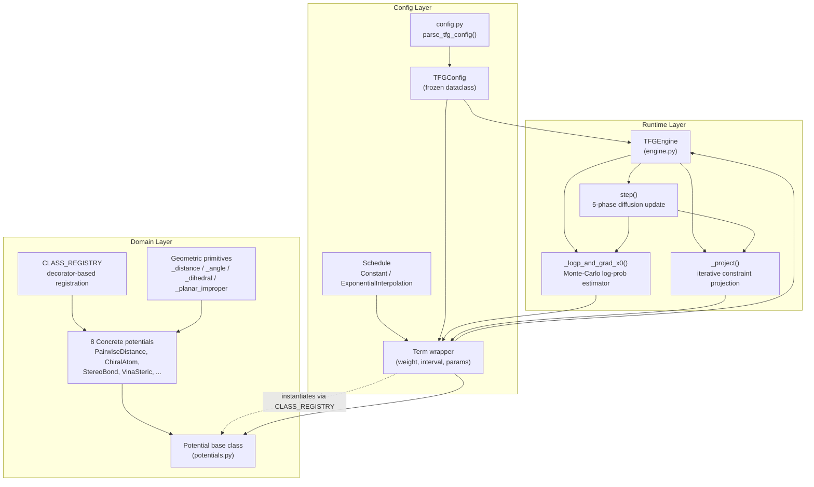

---
slug:24-training-free-guidance-engine
blog_type:normal
---


免训练引导（TFG）引擎是一个基于模块化物理的引导系统，可无缝接入 Protenix 的扩散采样器，旨在**无需任何模型重训练**的前提下强制执行化学与几何有效性约束。在每个逆扩散步骤中，该引擎会对原子坐标计算一组可配置的微团能量势，随后应用三种互补的引导机制——基于去噪器路径的反向传播、直接的 $x_0$ 优化以及约束投影——从而引导生成的结构趋向物理上有效的构象。整个子系统位于 `protenix/tfg/` 包中，并采用零耦合插件设计：当该功能禁用时，采样器的执行逻辑不受任何影响。

来源：[__init__.py](/protenix/tfg/__init__.py#L1-L8), [engine.py](/protenix/tfg/engine.py#L15-L30)

## 架构概述

TFG 模块被组织为三个职责高度内聚的文件，分别处理配置管理、运行时执行以及数学领域逻辑。理解这些层之间的数据流向，是使用或扩展该引擎的前提。



在最上层，`parse_tfg_config()` 会接收一个扁平字典配置（JSON/YAML），并生成一个不可变的 `TFGConfig` 数据类，其中包含强类型的 `Term` 对象。每个 `Term` 都封装了一个通过 `CLASS_REGISTRY` 解析出的 `Potential` 实例，以及相应的权重 `Schedule` 和评估间隔。`TFGEngine` 会消耗此配置并协调单步引导逻辑，同时将所有坐标数学运算委托给 `Potential` 的子类处理。

来源：[config.py](/protenix/tfg/config.py#L370-L399), [engine.py](/protenix/tfg/engine.py#L72-L96), [potentials.py](/protenix/tfg/potentials.py#L40-L66)

## `step()` 方法：五阶段扩散更新

TFG 系统的核心是 `TFGEngine.step()`，该方法使用五阶段引导更新取代了普通的单步逆扩散。该方法接收去噪器网络的调用接口、当前的含噪坐标 `x_t`、噪声水平标量（`t_hat`、`c_tau`）以及完整的模型状态张量。每个阶段均对应一种独特的注入约束信息的数学机制。

```mermaid
flowchart LR
    subgraph "Phase 1: Denoiser-Path Guidance"
        A["x_t (detached)"] --> B["denoise_net() → x₀_pred"]
        B --> C["_logp_x0()<br/>E(x₀_pred) via MC samples"]
        C --> D["autograd.grad()<br/>→ ∇_xt log p(x₀)"]
        D --> E["x_t_shift = ρ · ∇_xt"]
    end

    subgraph "Phase 2: Re-Denoise"
        F["x_t + x_t_shift"] --> G["denoise_net() → x₀ (no_grad)"]
    end

    subgraph "Phase 3: Projection"
        G --> H["_project()<br/>iterative constraint repair"]
        H --> I["x₀_ref = x₀ + δ"]
    end

    subgraph "Phase 4: Direct x₀ Refinement"
        I --> J["_logp_and_grad_x0()<br/>× inner_steps"]
        J --> K["x₀_ref += μ · ∇_x₀ log p(x₀)"]
    end

    subgraph "Phase 5: Predictor-Corrector"
        K --> L["direction = (x_t + shift - x₀_ref) / t̂"]
        L --> M["x_next = x_t + shift + η·Δt·direction"]
        M --> N["+ σ·noise (stochasticity)"]
    end

    E --> F
    I --> J
    K --> L
```



**阶段 1 —— 基于去噪器路径的引导**（由 `rho` 控制）：引擎会对 `x_t` 进行截断处理，启用 Autograd，并运行去噪器以获取 `x₀_pred`。随后，它会执行纯能量路径评估 `_logp_x0()`——该方法在蒙特卡洛噪声扰动下计算 `log p(x₀) ∝ -E(x₀)`——并通过整个去噪器进行反向传播以获得 `∇_{x_t} log p(x₀)`。该梯度反映了如果 `x_t` 发生偏移，去噪器对干净结构的预测将如何变化，使得引擎能够将含噪输入引导至去噪器映射为低能量结构的区域。此偏移量会按 `rho` 进行缩放，并累积供后续阶段使用。

来源：[engine.py](/protenix/tfg/engine.py#L390-L429)

**阶段 2 —— 对偏移后的输入重新去噪**：在 `x_t + x_t_shift` 上再次调用去噪器（在 `torch.no_grad()` 下），以生成供所有下游阶段使用的最终 `x₀` 预测。此过程被视为一次黑盒调用，去噪器的内部架构在此阶段不产生任何影响。

来源：[engine.py](/protenix/tfg/engine.py#L431-L447)

**阶段 3 —— 约束投影**：启用投影功能的项会通过 `_project()` 计算附加的坐标修正值，该方法会运行一个由外层和内层嵌套循环构成的线性化约束投影。增量迭代地累积到一个不断更新的 `x₀_ref` 上。

来源：[engine.py](/protenix/tfg/engine.py#L449-L453), [engine.py](/protenix/tfg/engine.py#L252-L296)

**阶段 4 —— 直接 $x_0$ 优化**（由 `mu` 控制）：引擎使用 `_logp_and_grad_x0()` 方法直接计算 `∇_{x₀} log p(x₀)`（无需经过去噪器），该方法返回各项的解析梯度，并通过蒙特卡洛重要性加权进行聚合。随后以步长 `mu` 对 `log p(x₀)` 执行梯度**上升**（等价于对 `E(x₀)` 执行梯度下降），该过程将迭代 `inner_steps` 次。

来源：[engine.py](/protenix/tfg/engine.py#L456-L476)

**阶段 5 —— 预测器-校正器更新**：优化后的 `x₀_ref` 会被重新整合进标准的扩散 ODE/SDE 更新过程中。方向向量 `(x_t + shift - x₀_ref) / t̂` 会根据噪声水平差分 `dt = c_τ - t̂` 和全局步长 `eta` 进行缩放。系统通过注入 `σ = √(t̂² - c_τ²)` 来引入随机性，以匹配扩散调度表的边缘分布。

来源：[engine.py](/protenix/tfg/engine.py#L478-L495)

<CgxTip>
外层循环（`outer_steps`）会在单个扩散步骤内重复阶段 1 至阶段 5。当 `rho ≠ 0` 时，该机制至关重要：第一次迭代中通过去噪器路径产生的偏移信息会为第二次迭代的 `x₀` 预测提供指引，从而在一个时间步长内构建出迭代优化的闭环。设置 `outer_steps > 1` 可以通过增加去噪器的前向传播次数为代价，换取更为严格的约束满足效果。
</CgxTip>

## 蒙特卡洛对数概率估计

TFG 引擎的一项核心创新在于将能量函数解释为未归一化的玻尔兹曼密度：`p(x₀) ∝ exp(-E(x₀))`。该引擎在附加高斯扰动下，利用蒙特卡洛采样来估算 `log p(x₀)` 及其梯度，并采用**重参数化技巧**（reparameterization trick）确保梯度的稳定性。

`_logp_and_grad_x0()` 方法的工作原理如下：给定形状为 `[K, *batch, N_atom, 3]` 的 `K` 个噪声样本 `ε`，它会构造受扰动的坐标 `x₀ + ε`，将蒙特卡洛维度展平至批处理维度中，以单次批量前向传播通过所有能量项，随后重塑形状并进行聚合。当 `K > 1` 时，梯度会通过基于蒙特卡洛样本计算的 `softmax(logp)` **重要性权重**进行组合——能量越低（即概率越高）的样本对梯度估计的贡献也相应越大。在聚合计算标量对数概率时，使用了 `_logmeanexp()`（通过 `logsumexp - log(K)` 保证数值稳定性）。

来源：[engine.py](/protenix/tfg/engine.py#L176-L250), [engine.py](/protenix/tfg/engine.py#L44-L69)

| 参数 | 配置键名 | 默认值 | 用途 |
|-----------|-----------|---------|---------|
| `eps_std` | `mc.std` | `0.0` | 蒙特卡洛噪声的标准差；设为 `0` 则禁用扰动（转为确定性梯度计算） |
| `eps_batch` | `mc.batch` | `1` | 蒙特卡洛样本数 `K`；数值越大，梯度方差越小，但计算成本呈线性增加 |
| `rho` | `rho` | `0.0` | 去噪器路径引导强度；梯度需流经去噪器网络 |
| `mu` | `mu` | `0.0` | 直接 $x_0$ 优化步长；梯度根据势函数解析计算得出 |

当 `eps_std = 0.0` 且 `eps_batch = 1`（即默认配置）时，`_sample_eps` 会返回一个全零张量，从而将蒙特卡洛评估器简化为不含任何蒙特卡洛开销的确定性能量梯度计算。这也是官方推荐的调试初始配置。

来源：[engine.py](/protenix/tfg/engine.py#L44-L61), [config.py](/protenix/tfg/config.py#L451-L454)

## 配置系统

### 调度类型

时变超参数（如项权重、势函数参数）统一通过 `Schedule` 对象进行表达。它们本质上是轻量级的可调用对象，能将归一化时间 `t ∈ [0, 1]` 映射为浮点数。其中，`t = 1` 对应早期的高噪声步骤，`t = 0` 对应后期的干净步骤。

| 调度类型 | 配置形式 | 行为描述 |
|---------------|------------|----------|
| `Constant` | `{"type": "const", "value": 1.0}` | 无论 `t` 取何值，均返回 `value` |
| `ExponentialInterpolation` | `{"type": "exp_interpolation", "start": 1.0, "end": 0.0, "alpha": 3.0}` | 在 `start → end` 之间插值；`alpha = 0` 为线性插值，正值 `alpha` 会将变化集中在接近 `t = 0` 的区间 |

配置中的纯标量值（int/float）会经由 `schedule_from_cfg()` 自动提升为 `Constant` 调度对象，便于为静态参数提供简洁的配置方式。

来源：[config.py](/protenix/tfg/config.py#L40-L138)

### 项配置

每个能量项都被配置为一个映射条目，其中键名代表势函数的类名（必须与 `CLASS_REGISTRY` 中的定义一致），键值则指定了评估频率、权重调度以及势函数的专有参数。工厂函数 `_build_terms()` 会通过 `CLASS_REGISTRY` 解析各个类名，使用默认值实例化势函数，并串联起相应的权重调度。

```python
# TFG 配置结构示例
{
    "enable": true,
    "rho": 0.5,          # 去噪器路径引导强度
    "mu": 0.001,         # 直接 x₀ 优化步长
    "mc": {"std": 0.0, "batch": 1},
    "steps": {
        "tfg_outer": 1,
        "tfg_inner": 10,
        "projection_outer": 2,
        "projection_inner": 10
    },
    "terms": {
        "PairwiseDistancePotential": {
            "interval": 1,
            "weight": {"type": "const", "value": 1.0},
            "bond_buffer": 0.05,
            "angle_buffer": 0.05,
            "clash_buffer": 0.05
        },
        "ChiralAtomPotential": {
            "interval": 1,
            "weight": 1.0,
            "buffer": 0.34906
        }
    }
}
```

`interval` 字段控制评估的频率：例如，设置 `interval = 2` 的项仅会在偶数步的扩散步骤中执行计算，从而减半计算开销。`enable_projection` 标志（默认为 `True`）决定了该项是否参与约束投影循环，这与它是否贡献能量或梯度无关。

来源：[config.py](/protenix/tfg/config.py#L187-L347), [config.py](/protenix/tfg/config.py#L400-L479)

### 顶层配置参数

| 参数 | 配置路径 | 默认值 | 校验逻辑 |
|-----------|------------|---------|------------|
| `enable` | `enable` | `False` | 若为 `True` 但 `terms` 为空，则抛出 `ValueError` |
| `rho` | `rho` | `0.0` | 强制转换为浮点数 |
| `mu` | `mu` | `0.0` | 强制转换为浮点数 |
| `outer_steps` | `steps.tfg_outer` | `1` | `max(1, value)` |
| `inner_steps` | `steps.tfg_inner` | `10` | `max(0, value)` |
| `projection_outer_steps` | `steps.projection_outer` | `2` | `max(0, value)` |
| `projection_inner_steps` | `steps.projection_inner` | `10` | `max(0, value)` |
| `log_last_step_energy` | `log_last_step_energy` | `False` | 布尔值；记录最后一步的各项能量数据 |

解析器会拒绝未知的顶层键名，以防止因配置错误而引发静默故障。

来源：[config.py](/protenix/tfg/config.py#L400-L479)

## 势函数库

所有势函数均继承自 `Potential` 基类。该基类提供了一致的接口规范：`energy()`、`energy_and_grad()` 以及可选的 `project()`。每个具体的能量项都会通过 `@register` 装饰器注册到 `CLASS_REGISTRY` 中，从而实现完全基于配置字符串的实例化。在内部实现上，势函数会计算几何原语（如两两之间的距离、键角、二面角、平面异常角）及其解析雅可比矩阵，随后通过 `_aggregate_atom_gradients()` 利用 `scatter_add_` 将约束空间下的梯度映射回针对每个原子坐标的梯度。

来源：[potentials.py](/protenix/tfg/potentials.py#L68-L145), [potentials.py](/protenix/tfg/potentials.py#L410-L440)

### 几何原语

该引擎的所有解析梯度均源自以下四种基础几何运算：

| 原语类型 | 函数 | 索引形状 | 雅可比矩阵形状 |
|-----------|----------|-------------|----------------|
| 两两距离 | `_distance_value_and_grad()` | `[2, M]` | `[..., 2, M, 3]` |
| 键角（顶点位于 j 处） | `_angle_value_and_grad()` | `[3, M]` | `[..., 3, M, 3]` |
| 二面角（扭转角） | `_dihedral_value_and_grad()` | `[4, M]` | `[..., 4, M, 3]` |
| 平面异常角 | `_planar_improper_value_and_grad()` | `[4, M]` | `[..., 4, M, 3]` |

当 `need_grad=True` 时，这些函数会返回相应的几何值以及该值对每个索引原子坐标的偏导数。随后，`_aggregate_atom_gradients()` 会应用链式法则 `dE/dx = (dE/dv) · (dv/dx)`，将这些贡献累加为一个密集的 `[..., N, 3]` 梯度张量。

来源：[potentials.py](/protenix/tfg/potentials.py#L153-L341), [potentials.py](/protenix/tfg/potentials.py#L410-L440)

### 能量势函数

大多数势函数均以两种平底罚函数作为基础构建模块：

| 函数 | 公式 | 适用场景 |
|----------|--------|----------|
| `_flat_bottom_linear()` | `E = k · (max(0, lower - v) + max(0, v - upper))` | 强制执行硬约束；在有效范围外施加线性惩罚 |
| `_flat_bottom_parabolic()` | `E = 0.5 · k · (max(0, lower - v)² + max(0, v - upper)²)` | 强制执行软约束；施加二次惩罚，且在边界处梯度为零 |

来源：[potentials.py](/protenix/tfg/potentials.py#L344-L407)

### 已注册的势函数

| 势函数 | 约束类型 | 索引特征键 | 能量函数 | 是否包含投影 |
|-----------|----------------|----------------|-----------------|----------------|
| `PairwiseDistancePotential` | 化学键 / 键角 / 空间冲突距离边界 | `pairwise_distance_index` | 结合范德华（VDW）调整边界的平底二次罚函数 | ✅ |
| `InterchainBondPotential` | 链间共价键长度 | `interchain_bond_index` | 平底线性罚函数（仅包含上界） | ❌ |
| `ChiralAtomPotential` | 手性中心旋向性 | `chiral_index` | 基于有符号二面角的平底线性罚函数 | ✅（支持回转半径缩放） |
| `StereoBondPotential` | 顺/反式双键几何构型 | `stereo_bond_index` | 基于 \|二面角\| 的平底线性罚函数 | ❌ |
| `PlanarImproperPotential` | sp² 平面性 | `planar_improper_index` | `1 - sin(γ)` 平面异常角能量 | ❌ |
| `LinearBondPotential` | 三键线性度 | `linear_triple_bond_index` | 平底线性罚函数（下界：π - buffer） | ❌ |
| `ExperimentalTorsionPotential` | MMFF 风格扭转能量 | `experimental_torsion_index` | 余弦级数：`Σ kₙ(1 + sₙcos(nφ))`, n=1..6 | ❌ |
| `VinaStericPotential` | 链间空间位阻接触 | `asym_id`, `atom_to_token_idx` | 类 AutoDock-Vina 风格：双高斯函数 + 二次排斥项 | ❌ |

来源：[potentials.py](/protenix/tfg/potentials.py#L552-L590), [potentials.py](/protenix/tfg/potentials.py#L593-L796), [potentials.py](/protenix/tfg/potentials.py#L798-L845), [potentials.py](/protenix/tfg/potentials.py#L848-L980), [potentials.py](/protenix/tfg/potentials.py#L983-L1019), [potentials.py](/protenix/tfg/potentials.py#L1022-L1060), [potentials.py](/protenix/tfg/potentials.py#L1063-L1130), [potentials.py](/protenix/tfg/potentials.py#L1133-L1195)

### PairwiseDistancePotential：基于 VDW 的多类别边界

作为最为复杂的势函数，`PairwiseDistancePotential` 值得特别关注。它利用一个组合状态码将每一对原子划分为四个类别之一：**冲突**（状态码 0）、**化学键**（状态码 1）、**键角**（状态码 2）或**同时属于键与键角**（状态码 3）。每个类别会根据基础边界采用不同的缓冲容限，并将其作为乘性缓冲空间。冲突约束的边界设为 `upper = +inf`（仅保留下界）。非键合原子对的下界会被限制为由范德华半径推导出的最小值（`0.35 + 0.5 · (rᵢ + rⱼ)`），而键合原子对的上界同样也会受到该范德华极限的钳制。为避免在扩散步骤中进行重复计算，该势函数会以张量标识为键，缓存每个样本的静态状态（状态码与范德华极限）。

来源：[potentials.py](/protenix/tfg/potentials.py#L593-L796)

## 基于线性化求解器的约束投影

`PairwiseDistancePotential` 和 `ChiralAtomPotential` 两种势函数实现了投影算子，可直接修复被破坏的约束。这种投影机制采用了**线性化最小范数解**：对于生效的约束，求解器计算 `dx = -Jᵀ(JJᵀ + εI)⁻¹v`，其中 `v` 是约束违背向量，`J` 是约束值对坐标的雅可比矩阵。为保证数值稳定性，即便主计算过程运行在 `bf16` 或 `fp16` 精度下，该求解过程依然会针对逐个样本（即每个批处理元素）在 `fp32` 下执行。

`_project()` 中的投影循环会迭代执行 `projection_outer_steps × projection_inner_steps` 次，并累加各项间的增量。在计算前，各项已经过预排序：`ChiralAtomPotential` 排在首位（具有最高优先级），其后是 `PairwiseDistancePotential`。这保证了系统会优先确立正确的构象手性，随后再将距离约束投影至更新后的几何结构上。

来源：[potentials.py](/protenix/tfg/potentials.py#L443-L527), [engine.py](/protenix/tfg/engine.py#L252-L322)

<CgxTip>
`ChiralAtomPotential._project()` 方法包含一项可选的**回转半径重缩放**操作（默认 `scale_x=True`）。在计算出线性化修正值后，它会按链条对受影响的原子进行重缩放，以确保该链的回转半径保持不变。此举可防止投影过程引发结构的异常膨胀或压缩——在同时校正多个手性中心时，这是一项关键的结构稳定性保障措施。
</CgxTip>

## 特征校验与必需的输入

每个势函数均会在 `_REQUIRED_FEATURES` 字典中声明自身所依赖的特征键名。在首个扩散步骤（`step_i == 0`）中，`TFGEngine.step()` 会调用 `validate_features()` 进行检查，如果 `input_feature_dict` 中缺失任何必需的键，系统将立即抛出错误中止运行（Fail-Fast）。这能有效防止因索引张量缺失而引发势函数计算出无意义零能量的“静默退化”问题。

| 势函数 | 必需的特征键名 |
|-----------|----------------------|
| `PairwiseDistancePotential` | `pairwise_distance_index`, `pairwise_distance_is_bond`, `pairwise_distance_is_angle`, `pairwise_distance_upper_bound`, `pairwise_distance_lower_bound`, `ref_element` |
| `InterchainBondPotential` | `interchain_bond_index` |
| `VinaStericPotential` | `asym_id`, `atom_to_token_idx`, `ref_element`, `interchain_bond_index` |
| `SymmetricChainPotential` | `asym_id`, `atom_to_token_idx`, `symmetric_chain_index` |
| `StereoBondPotential` | `stereo_bond_index`, `stereo_bond_orientation` |
| `ChiralAtomPotential` | `chiral_index`, `chiral_orientation`, `asym_id`, `atom_to_token_idx` |
| `PlanarImproperPotential` | `planar_improper_index`, `planar_improper_is_carbonyl` |
| `LinearBondPotential` | `linear_triple_bond_index` |
| `ExperimentalTorsionPotential` | `experimental_torsion_index`, `experimental_torsion_force_constant`, `experimental_torsion_sign` |

来源：[config.py](/protenix/tfg/config.py#L141-L184), [config.py](/protenix/tfg/config.py#L350-L366)

## 与扩散采样器的集成

TFG 引擎专为在 `protenix.model.generator.sample_diffusion` 中被调用而设计。该引擎的 `step()` 方法与标准的扩散更新函数签名保持一致——它接收去噪器的可调用对象、当前的状态张量（`s_inputs`, `s_trunk`, `z_trunk`, `pair_z`, `p_lm`, `c_l`）以及采样器超参数（`chunk_size`, `inplace_safe`, `enable_efficient_fusion`）。当 TFG 被禁用（`enable=False`）时，采样器会回退到标准的更新路径，而不会实例化该引擎。

此外，该引擎还对外暴露了一个独立的 `project()` 方法。对于希望在不完整运行 TFG 感知步骤的前提下应用约束投影的调用方而言，该方法十分实用，尤其适用于后处理场景或与自定义采样器的集成。

来源：[engine.py](/protenix/tfg/engine.py#L324-L370), [engine.py](/protenix/tfg/engine.py#L298-L322), [__init__.py](/protenix/tfg/__init__.py#L1-L8)

## 后续步骤

- 若希望了解 TFG 接入的扩散采样器实现，请查阅 [扩散采样与生成器](19-diffusion-sampling-and-generator)。
- 若需获取更宏观的模型架构背景，请参阅 [架构概述](8-architecture-overview)。
- 若想学习为 TFG 势函数提供数据的约束特征，请查看 [约束特征](25-constraint-features)。
- 若需了解 TFG 之外更为详尽的配置系统说明，请访问 [配置系统](26-configuration-system)。