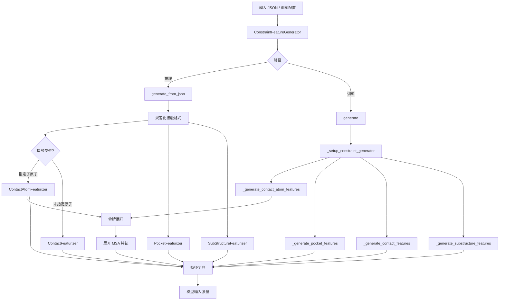
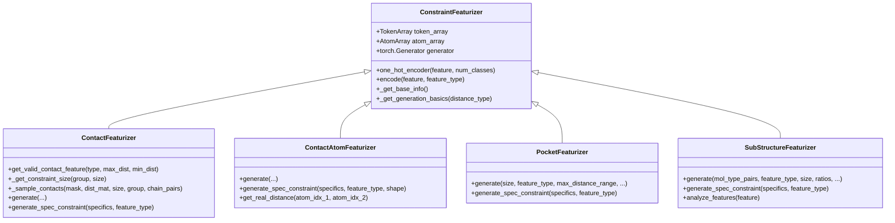
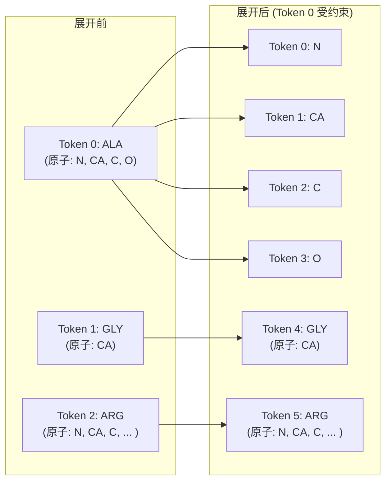
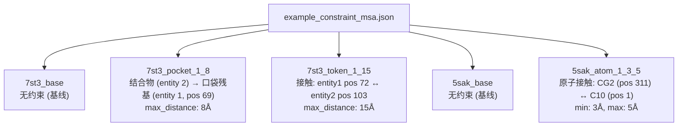

---
slug:25-constraint-features
blog_type:normal
---


Protenix 的约束特征系统提供了一个强大的机制，用于将**实验数据或特定领域的结构知识**融入结构预测流程。通过编码残基、原子和链之间基于距离的空间关系，约束特征允许模型在预测时遵循已知的生物学接触信息——无论这些信息是来自交联质谱、诱变数据，还是专家标注。本页将介绍 Protenix 支持的四种约束类型、其 JSON 输入格式、将它们转换为模型可用张量的特征化流程，以及训练阶段的随机约束生成策略。

来源：[constraint_featurizer.py](/protenix/data/constraint/constraint_featurizer.py#L34-L47), [example_constraint_msa.json](/examples/example_constraint_msa.json#L53-L168)

## 约束类型分类

Protenix 支持四种不同的约束类型，每种类型都针对不同粒度的结构知识。下表概述了它们的特性：

| 约束类型 | 粒度 | 关键参数 | 输出形状 | 特征编码 |
|---|---|---|---|---|
| **Token Contact (令牌接触)** | 残基级（按令牌） | `entity`, `copy`, `position`, `max_distance`, `min_distance` | `(N_token, N_token, 2)` | 连续的 `[min_dist, max_dist]` |
| **Atom Contact (原子接触)** | 原子级（在展开的令牌内） | `entity`, `copy`, `position`, `atom`, `max_distance`, `min_distance` | `(N_token, N_token, 2)` | 连续的 `[min_dist, max_dist]` |
| **Pocket (口袋)** | 结合体到目标（一对多） | `binder_chain`, `contact_residues`, `max_distance` | `(N_token, N_token, 1)` | 连续距离 |
| **Substructure (子结构)** | 已知部分坐标 | `mol_type_pairs`, `ratios`, `coord_noise_scale` | `(N_token, 3)` | 独热编码的距离区间 |

<CgxTip>**Atom Contact** 与 **Token Contact** 的对比：关键区别在于，原子接触需要指定具体的原子名称（如 `"CG2"`、`"C10"`），并会触发**令牌展开**——即将残基级令牌拆分为逐原子令牌，以精确执行约束。而令牌接触则在中心原子层级运作，不会发生展开。</CgxTip>

来源：[constraint_featurizer.py](/protenix/data/constraint/constraint_featurizer.py#L199-L399), [constraint_featurizer.py](/protenix/data/constraint/constraint_featurizer.py#L524-L529)

## JSON 输入格式

约束条件在输入 JSON 数组的每个条目的 `"constraint"` 键中指定。单个条目可以同时组合多种约束类型。以下示例展示了所有受支持的约束模式：

```json
{
    "constraint": {
        "contact": [
            {
                "entity1": 1,
                "copy1": 1,
                "position1": 72,
                "entity2": 2,
                "copy2": 1,
                "position2": 103,
                "max_distance": 15
            }
        ],
        "contact": [
            {
                "entity1": 1,
                "copy1": 1,
                "position1": 311,
                "atom1": "CG2",
                "entity2": 2,
                "copy2": 1,
                "position2": 1,
                "atom2": "C10",
                "max_distance": 5,
                "min_distance": 3
            }
        ],
        "pocket": {
            "binder_chain": {
                "entity": 2,
                "copy": 1
            },
            "contact_residues": [
                {
                    "entity": 1,
                    "copy": 1,
                    "position": 69
                }
            ],
            "max_distance": 8
        }
    }
}
```

下表详细说明了每个字段及其用途：

| 字段 | 作用域 | 描述 | 是否必需 |
|---|---|---|---|
| `entity1` / `entity2` | Contact | `sequences` 数组中从 1 开始索引的实体 ID | ✅ |
| `copy1` / `copy2` | Contact | 实体内的拷贝编号（针对多拷贝链） | ✅ |
| `position1` / `position2` | Contact | 实体内从 1 开始索引的残基位置 | ✅ |
| `atom1` / `atom2` | Atom Contact | 具体的原子名称（如 `"CG2"`、`"C10"`）——存在该字段会触发原子级接触 | ❌ |
| `max_distance` | Contact / Pocket | 距离上限（埃） | ✅ |
| `min_distance` | Contact | 距离下限（埃），默认为 0 | ❌ |
| `binder_chain` | Pocket | 标识结合链的 `{"entity": int, "copy": int}` | ✅ |
| `contact_residues` | Pocket | 指定目标口袋残基的 `{"entity", "copy", "position"}` 列表 | ✅ |

来源：[example_constraint_msa.json](/examples/example_constraint_msa.json#L53-L168), [constraint_featurizer.py](/protenix/data/constraint/constraint_featurizer.py#L50-L90)

## 特征化流程

### 架构概述

`ConstraintFeatureGenerator` 类作为核心调度器，负责协调所有的约束特征生成器。它提供了两个不同的入口点：用于推理时显式约束的 `generate_from_json`，以及用于训练时随机采样约束的 `generate`。这两个路径共享相同的底层特征生成类，从而确保了训练和推理之间的特征一致性。



### 推理路径：`generate_from_json`

当使用来自 JSON 输入的显式约束进行推理时，静态方法 `generate_from_json` 会按特定顺序调度特征化过程。首先，原始的接触条目会被**规范化**为统一格式，其中每一对都会被标准化，使其包含双方的 `[Entity, copy, position, atom_name]`，外加 `min_distance`、`max_distance` 和 `contact_type`。规范化逻辑会自动区分原子接触（存在 `atom1`/`atom2` 键）和令牌接触。接下来，处理原子接触规范：对于每一对，都会应用原子掩码在 `AtomArray` 中定位确切的原子；如果无法唯一确定该原子，则会跳过该约束并输出一条日志记录。随后，令牌展开会将相关的残基令牌拆分为逐原子令牌，以提供原子级的分辨率。最后，各个特征生成器类（`ContactAtomFeaturizer`、`ContactFeaturizer`、`PocketFeaturizer`、`SubStructureFeaturizer`）会分别生成相应的约束张量。

<CgxTip>`generate_from_json` 方法需要提供包含 `atom_map_to_atom_name` 字典的 `sequences` 列表，以便将整数形式的原子索引解析为原子名称。这些元数据由上游的标记器和推理流程填充。</CgxTip>

来源：[constraint_featurizer.py](/protenix/data/constraint/constraint_featurizer.py#L199-L399)

### 训练路径：`generate`

训练路径引入了**概率性约束生成**机制——它不再读取显式约束，而是从真实结构中随机采样约束对，以此创建增强的训练数据。每种约束类型都由一个 `prob` 参数控制，该参数决定了在任意给定样本中激活该约束的概率。该方法接受完整的训练上下文，包括 `sample_indice`、`pdb_indice`、`msa_features` 和 `max_entity_mol_id`。

```mermaid
flowchart LR
    subgraph "训练阶段约束采样"
        A["概率性门控"] --> B{"np.random.rand&#40;&#41; < prob?"}
        B -->|"是"| C["从真实结构中采样"]
        B -->|"否"| D["空的约束张量"]
        C --> E["距离矩阵计算"]
        E --> F["有效接触掩码"]
        F --> G["随机配对选择"]
        G --> H["特征编码"]
    end
```



`generate` 方法遵循严格的执行顺序：(1) 首先生成接触原子特征以触发令牌展开，(2) 展开 MSA 特征以匹配新的令牌数量，(3) 生成口袋特征，(4) 生成接触特征，(5) 生成子结构特征。组装完所有特征后，该方法会可选地将受约束令牌的 `entity_mol_id` 重新映射，以防止在计算损失时出现排列多义性问题。

来源：[constraint_featurizer.py](/protenix/data/constraint/constraint_featurizer.py#L401-L566)

## 核心特征生成器类

### 类层级结构



所有的特征生成器均继承自基类 `ConstraintFeaturizer`，该基类提供了通用基础设施：令牌/原子数组管理、距离矩阵计算和特征编码工具。基类通过 `_get_generation_basics` 支持两种距离计算模式：**center_atom**（利用 `scipy.spatial.distance.cdist` 计算令牌中心原子之间的距离）和 **any_atom**（属于每一对令牌的所有原子之间的最小距离）。`one_hot_encoder` 静态方法通过对填充位置对应的独热向量置零，来处理填充值（`-1`）。

来源：[constraint_featurizer.py](/protenix/data/constraint/constraint_featurizer.py#L1354-L1455)

### ContactFeaturizer

`ContactFeaturizer` 生成形状为 `(N_token, N_token, 2)` 的残基级接触约束，其中两个通道分别编码 `min_distance`（最小距离）和 `max_distance`（最大距离）。在训练期间，`get_valid_contact_feature` 方法通过组合三种掩码来识别有效的接触对：**链类型掩码**（对于 `"P_"` 类型，应用 20 个残基邻居排除规则的链内掩码；或针对 `"PP"`/`"PL"` 类型的链间掩码）、**分辨率掩码**（两个令牌都必须具有解析出的坐标），以及**距离掩码**（位于 `[min_distance, max_distance]` 范围内）。随后，`_sample_contacts` 方法利用 `torch.randperm` 和可选的确定性生成器，从有效配对中随机进行选择。

| 参数 | 描述 | 默认值 |
|---|---|---|
| `group` | 采样范围：`"complex"`（整个结构）或 `"interface"`（特定链对） | `"complex"` |
| `size` | 每组约束的预期数量；小于 1 的浮点数表示几何分布 | — |
| `feature_type` | 编码方式：`"continuous"`（连续）或 `"one_hot"`（独热） | `"continuous"` |
| `distance_type` | 距离度量指标：`"center_atom"` 或 `"any_atom"` | `"center_atom"` |
| `min_distance` | 有效接触的最小距离阈值 | `0.0` |
| `max_distance_range` | 随机最大距离采样的范围 | — |

来源：[constraint_featurizer.py](/protenix/data/constraint/constraint_featurizer.py#L1457-L1593)

### ContactAtomFeaturizer

`ContactAtomFeaturizer` 将接触约束扩展到了原子级分辨率。与令牌级特征生成器不同，此类要求令牌数组必须被**展开**——包含受约束原子的残基令牌会被拆分为独立的逐原子令牌。静态方法 `expand_tokens` 负责执行此转换：对于每个包含受约束原子的标准残基令牌，它会创建新的 `Token` 对象（使用 `ELEMS[atom.element]` 为每个原子创建一个），并构建一个 `token_map` 来记录新旧索引的映射关系。展开后，还必须通过 `expand_msa_features` 对 MSA 特征进行扩展，该方法会将每个展开后的令牌的 MSA 特征广播到其所有派生的子原子令牌中。

来源：[constraint_featurizer.py](/protenix/data/constraint/constraint_featurizer.py#L568-L770)

### PocketFeaturizer

口袋约束编码了一种**定向结合关系**——结合物链必须在距离一个或多个目标残基的指定 `max_distance` 范围内。输出张量的形状为 `(N_token, N_token, 1)`，具有一个用于编码距离阈值的单通道。在训练期间，`_generate_pocket_features` 方法支持自动识别结合物：它可以检测配体结合物或抗体链（通过 `ab_top2_clusters` 成员资格），并仅对这些特定的链应用口袋约束。当启用 `spec_binder_chain` 时，该方法会检查 `sample_indice` 元数据，以确定哪一条链是配体或抗体，并相应地限制口袋采样的范围。

来源：[constraint_featurizer.py](/protenix/data/constraint/constraint_featurizer.py#L876-L940)

### SubStructureFeaturizer

子结构约束编码了**已知部分坐标**——即那些根据实验数据已知其 3D 位置的结构片段。其输出采用具有 4 个距离区间（索引 0–3）的独热编码，其中每个令牌都会根据其坐标与已知子结构之间的距离被划分到特定的区间中。训练参数包括 `ratios`（控制完全覆盖还是部分覆盖子结构）、`coord_noise_scale`（添加到已知坐标中的高斯噪声）以及 `mol_type_pairs`（限制哪些实体类型可以参与）。`analyze_features` 方法提供了事后统计数据，用于日志记录，包括 `num_active_tokens`、`active_token_ratio` 以及每个区间的计数。

来源：[constraint_featurizer.py](/protenix/data/constraint/constraint_featurizer.py#L1101-L1200), [constraint_featurizer.py](/protenix/data/constraint/constraint_featurizer.py#L1254-L1277)

## 令牌展开机制

令牌展开是约束流程中架构意义上最为重大的转换。当指定了原子级接触时，默认的“一残基一令牌”表示方式就缺乏编码原子级距离约束所需的粒度。`expand_tokens` 方法通过将标准残基令牌分解为其组成原子来解决了这一问题。



展开过程执行了几项关键更新：(1) 使用基于 `ELEMS` 的元素令牌类型创建新的 `Token` 对象；(2) 重建 `AtomArray` 上的 `centre_atom_mask` 注释，将每个展开后的原子标记为其自身的中心；(3) 为展开的原子重置 `tokatom_idx`，以实现逐原子的距离图计算；(4) 更新 `distogram_rep_atom_mask`，以便让展开的原子能够参与距离预测；(5) 通过匹配 `(chain_id, res_id, atom_name)` 键，同步 `full_atom_array` 注释。`token_map` 字典保留了旧令牌索引到新令牌索引列表的映射，从而支持后续的 MSA 特征展开。

来源：[constraint_featurizer.py](/protenix/data/constraint/constraint_featurizer.py#L568-L709)

## 特征编码详情

基类 `ConstraintFeaturizer` 中的 `encode` 方法支持两种特征类型，用于控制如何将原始约束值表示为张量：

| 特征类型 | 机制 | 用例 |
|---|---|---|
| `"continuous"` | 直接传递原始浮点值 | 接触/口袋的距离边界 `[min_dist, max_dist]` |
| `"one_hot"` | 将整数类索引通过 `F.one_hot` 转换为独热向量 | 子结构的距离区间（4 个类别） |

`one_hot_encoder` 方法包含对填充位置的特殊处理：通过 `pad_mask` 检测值为 `-1` 的位置，暂时将其替换为 `0` 以供 `F.one_hot` 调用，随后重新置零。这确保了填充令牌生成的是全零的独热向量，而不是出现错误的类别 0 激活。

对于连续特征，`generate_spec_constraint` 方法会为接触构建形状为 `(N_token, N_token, 2)` 的张量（通道包含：最小和最大距离），并为口袋构建形状为 `(N_token, N_token, 1)` 的张量（单一距离阈值）。未受约束的配对将被填充为 `pad_value`（默认为 0）。

来源：[constraint_featurizer.py](/protenix/data/constraint/constraint_featurizer.py#L1368-L1392)

## 实体 Mol-ID 重映射

在生成所有约束特征之后，`change_entity_mol_id` 方法会为训练执行一个关键的后处理步骤。受约束令牌可能会将其 `entity_mol_id` 重新分配为超出当前 `max_entity_mol_id` 的值。这种重映射旨在**防止排列多义性**：当模型发现某些令牌拥有唯一的 entity_mol_ids 时，它就会学习到这些令牌的位置是由约束信息锚定的，因此在损失计算期间不应被置换。该方法会收集具有特征的令牌的所有中心原子索引，识别出它们当前的 mol_ids，并从 `max_entity_mol_id + 1` 开始分配新的、连续的 entity_mol_ids。`atom_array` 和 `full_atom_array` 都会进行一致的更新。

来源：[constraint_featurizer.py](/protenix/data/constraint/constraint_featurizer.py#L772-L808)

## 配置参考

约束特征通过数据处理配置系统进行配置。下表总结了 `constraint` 部分下的关键配置参数：

| 路径 | 类型 | 默认值 | 描述 |
|---|---|---|---|
| `constraint.fix_seed` | bool | `False` | 使用由 PDB ID 哈希生成的确定性种子 |
| `constraint.contact.prob` | float | `0` | 生成令牌接触的概率 |
| `constraint.contact.size` | float/int | `0.0` | 预期的接触数量（浮点数 <1 = 几何分布） |
| `constraint.contact.group` | str | `"complex"` | 采样范围：`"complex"` 或 `"interface"` |
| `constraint.contact.feature_type` | str | `"continuous"` | 编码类型 |
| `constraint.contact.distance_type` | str | `"center_atom"` | 距离度量指标 |
| `constraint.contact_atom.prob` | float | `0` | 原子级接触的概率 |
| `constraint.contact_atom.feature_type` | str | `"continuous"` | 编码类型 |
| `constraint.pocket.prob` | float | `0` | 口袋约束的概率 |
| `constraint.pocket.spec_binder_chain` | bool | `False` | 自动检测结合物（配体/抗体） |
| `constraint.pocket.size` | float | `0.0` | 预期的口袋残基数量 |
| `constraint.pocket.max_distance_range` | dict | — | 随机距离采样的范围 |
| `constraint.substructure.prob` | float | `0` | 子结构约束的概率 |
| `constraint.substructure.feature_type` | str | `"one_hot"` | 编码类型 |
| `constraint.substructure.ratios` | dict | `{"full": [0.0, 0.5, 1.0], "partial": 0.3}` | 覆盖率比例 |
| `constraint.substructure.coord_noise_scale` | float | `0.05` | 添加到已知坐标上的高斯噪声 |

来源：[constraint_featurizer.py](/protenix/data/constraint/constraint_featurizer.py#L401-L529), [constraint_featurizer.py](/protenix/data/constraint/constraint_featurizer.py#L876-L1195)

## 完整示例

`examples/example_constraint_msa.json` 文件通过一个蛋白质-蛋白质复合物（PDB: 7st3）和一个蛋白质-配体复合物（PDB: 5sak）演示了所有的约束类型。该文件包含五个条目：一个不带约束的基础预测、一个带口袋约束的变体、一个令牌接触变体、一个带配体的原子接触变体，以及该配体复合物的基线。此示例可用作预期 JSON 架构的参考。



来源：[example_constraint_msa.json](/examples/example_constraint_msa.json#L1-L169)

## 后续步骤

既然你已经了解了约束特征是如何将结构知识编码为模型可用的张量，你就可以进一步探索与约束特征集成或依赖于约束特征的相关系统：

- **[输入 JSON 格式](4-input-json-format)**：了解完整的输入规范，包括与约束定义相伴的序列、MSA 和模板字段。
- **[标记器与 AtomArray](14-tokenizer-and-atomarray)**：深入理解约束特征生成器所操作的 `TokenArray` 和 `AtomArray` 数据结构，包括令牌是如何创建和注释的。
- **[特征化流程](13-featurization-pipeline)**：了解约束特征是如何与 MSA 及模板特征一同整合到更广泛的数据处理流程中的。
- **[配置系统](26-configuration-system)**：探索 `constraint` 配置部分是如何映射到控制训练期间概率性约束生成的参数的。
- **[免训练引导引擎](24-training-free-guidance-engine)**：探索如何通过 TFG 引擎在扩散采样期间进一步利用约束特征。