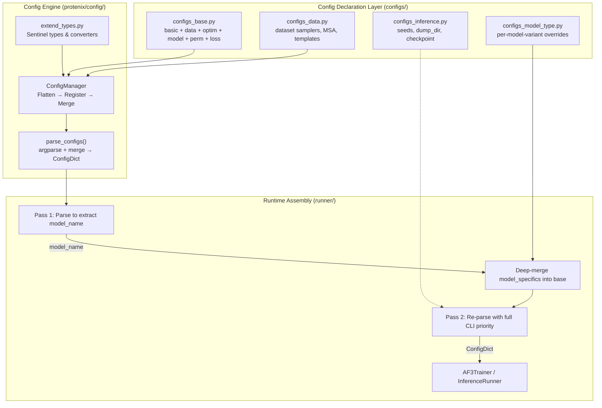
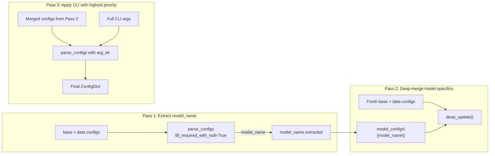

---
slug:26-configuration-system
blog_type:normal
---


Protenix 采用了一种层次化且类型感知的配置框架，将 Python 字典默认值、模型变体预设和命令行覆盖项整合为一个单一的不可变 `ConfigDict`。该系统建立在三个架构层之上：用于编码值语义的**自定义类型标记系统**，负责展平、校验和合并配置的 **`ConfigManager` 引擎**，以及在运行时通过特定模型覆盖项组合基础配置的**多趟组装协议**。理解这种分层机制对于使用新模型变体、自定义训练计划或替代数据流水线来扩展 Protenix 至关重要。

来源: [config.py](/protenix/config/config.py#L37-L50), [extend_types.py](/protenix/config/extend_types.py#L16-L55), [configs_base.py](/configs/configs_base.py#L466-L475)

## 架构概述

配置流水线遵循明确的关注点分离原则：声明、解析和组装。声明阶段在 `configs/` 包中进行，使用 Python 字面量和标记类型定义特定领域的配置字典。解析过程由 `ConfigManager` 处理，它会展平层级结构，将每个叶子节点注册为 `argparse` 参数，并递归合并用户提供的值。组装阶段发生在运行器入口点（`train.py`, `inference.py`）中，通过**三趟合并策略**在应用最终的命令行覆盖项之前，选择合适的模型变体。



该系统的核心原则是**每个配置值都携带类型元数据和可选语义**，这些信息并非通过 Python 注解编码，而是通过标记包装对象实现。这种设计允许单趟 `argparse` 注册流程即可处理类型强制转换、None 值允许、必填字段执行以及交叉引用——所有这些都直接源于原始的字典结构。

来源: [config.py](/protenix/config/config.py#L52-L84), [config.py](/protenix/config/config.py#L209-L241), [configs_base.py](/configs/configs_base.py#L466-L475)

## 标记类型系统

配置类型系统位于 [`extend_types.py`](/protenix/config/extend_types.py) 中，提供了五个包装配置值的标记类，用以表达它们的解析语义。这些标记是配置作者与 `ConfigManager` 通信的词汇表——终端用户绝不会直接实例化它们。

| 标记类 | 用途 | 类型信息 | 默认值 | 允许 None | 必填 |
|---|---|---|---|---|---|
| `RequiredValue(dtype)` | 用户必须提供此值 | `dtype` 参数 | `None` | `False` | `True` |
| `DefaultNoneWithType(dtype)` | 可选，默认值为 None | `dtype` 参数 | `None` | `True` | `False` |
| `ValueMaybeNone(value)` | 具有具体的默认值，但可被设为 None | 从 `type(value)` 推断 | `value` | `True` | `False` |
| `GlobalConfigValue(global_key)` | 引用顶层配置值 | 从引用的键解析 | 已解析 | 继承 | 继承 |
| `ListValue(value)` | 带有元素类型的列表类型配置 | `type(value[0])` | `value` | `False` | `False` |

`GlobalConfigValue` 标记对于维护架构一致性尤为重要。当像 `pairformer` 这样的模型子系统需要与全局配置相同的 `c_z` 维度时，它会声明 `"c_z": GlobalConfigValue("c_z")`，而不是硬编码一个重复的值。在合并期间，`ConfigManager` 会通过查找引用的顶层键的类型信息来解析此引用。

<CgxTip>标记类型系统替代了通常作为模式校验框架的组件（如 JSON Schema 或 Pydantic）。在添加新的配置键时，请务必使用合适的标记——简单默认值使用普通的 Python 字面量，必填字段使用 `RequiredValue`，交叉引用使用 `GlobalConfigValue`。这确保了该键能在 `argparse` 中被正确注册，并能从命令行字符串输入强制转换为正确的类型。</CgxTip>

来源: [extend_types.py](/protenix/config/extend_types.py#L16-L55), [config.py](/protenix/config/config.py#L52-L84)

## ConfigManager：展平与合并

`ConfigManager` 类是负责将层次化 Python 字典转换为扁平键空间并合并用户覆盖项的引擎。其操作分三个阶段进行。

### 阶段 1：通过 `_get_config_infos` 展平

管理器递归遍历配置字典，产生两个输出：一个扁平的 `config_infos` 映射（以点连接的键 → `(dtype, default_value, allow_none, required)` 元组），以及一个解析了标记类型的层次化 `default_configs` 树。在每个层级断言 `"." not in key`，确保点号表示法的展平没有歧义——没有任何键名可以包含字面的句点。

### 阶段 2：参数注册

在 `parse_configs()` 中，每个展平的键都被注册为字符串类型的 `argparse` 参数。在命令行上接收到的所有值均为字符串；类型强制转换发生在合并期间。`ArgumentNotSet` 标记用于区分“用户未提供此项”和“用户显式传入空值”。

### 阶段 3：通过 `_merge_configs` 递归合并

合并算法逐级处理配置，**优先处理当前层级**，然后再递归进入子级。这个顺序很重要，因为子配置可能通过 `GlobalConfigValue` 引用父级的值。在每个叶子节点处，算法会检查是否存在命令行覆盖项；如果不存在，则回退到默认值。对于 `GlobalConfigValue` 引用，使用从全局配置解析出的值。如果一个必填值（不含 `allow_none`）具有 `None` 默认值且未提供覆盖项，该算法将抛出异常。

合并期间关键的类型强制转换逻辑包括：通过 `get_bool_value()` 处理布尔字符串（`"true"`、`"false"`、`"0"`、`"1"` 等），将作为逗号分隔字符串解析的列表值强制转换为推断出的元素类型，以及对 `"None"`、`"none"`、`"null"` 等字符串标记进行 None 值允许性检查。

来源: [config.py](/protenix/config/config.py#L86-L118), [config.py](/protenix/config/config.py#L123-L206), [config.py](/protenix/config/config.py#L209-L241)

## 配置声明包

`configs/` 包定义了五个在运行时组合的配置字典。每个字典针对特定的关注点。

### `configs_base.py` — 基础配置

该文件将六个子字典组装成一个单一的扁平 `configs` 字典。这些子字典分别是：

| 子字典 | 领域 | 关键参数 |
|---|---|---|
| `basic_configs` | 运行身份与检查点 | `project`, `run_name`, `base_dir`, `model_name`, `seed`, `ema_decay`, `use_wandb` |
| `data_configs` | 数据级设置 | `train_crop_size`, `test_max_n_token`, `esm.enable` |
| `optim_configs` | 优化器与学习率调度器 | `lr`, `warmup_steps`, `max_steps`, `lr_scheduler`, Adam betas |
| `model_configs` | 模型架构维度 | `c_s`, `c_z`, `c_token`, `n_blocks`, `diffusion_batch_size` |
| `perm_configs` | 对称排列 | 针对训练与测试的链/原子排列 |
| `loss_configs` | 损失权重与分箱 | `alpha_diffusion`, `alpha_distogram`, `smooth_lddt`, bin parameters |

最终组装将所有子字典合并为一个扁平结构，并附加 `finetune` 作为包含微调优化器设置的子键：

```python
configs = {
    **basic_configs,
    **data_configs,
    **optim_configs,
    **model_configs,
    **perm_configs,
    **loss_configs,
}
configs["finetune"] = finetune_optim_configs
```

`model_configs` 部分在架构上尤为重要。像 `c_z`（对通道维度，默认 128）、`c_s`（单通道维度，默认 384）和 `c_token`（Token 嵌入维度，默认 384）这样的顶层维度键作为**全局引用**，子系统配置通过 `GlobalConfigValue` 指向它们。例如，`model.pairformer.c_z` 解析为 `GlobalConfigValue("c_z")`，确保 Pairformer 的对通道始终与全局设置匹配，除非被显式覆盖。

<CgxTip>当更改模型维度（例如 `c_z`, `c_s`）时，你只需在命令行上覆盖顶层键——所有通过 `GlobalConfigValue` 引用的子系统都会自动解析为新值。这就是为什么 `protenix-v2` 在 `configs_model_type.py` 中只需在顶层指定一次 `"c_z": 256`，所有子系统便会继承该值的原因。</CgxTip>

来源: [configs_base.py](/configs/configs_base.py#L23-L55), [configs_base.py](/configs/configs_base.py#L72-L96), [configs_base.py](/configs/configs_base.py#L108-L360), [configs_base.py](/configs/configs_base.py#L392-L464), [configs_base.py](/configs/configs_base.py#L466-L475)

### `configs_data.py` — 数据集与流水线配置

该文件定义了按命名数据集组织的特定配置，包含两个可复用的模板：`default_test_configs`（均匀采样、空间界面裁剪、禁用约束）和 `default_weighted_pdb_configs`（加权采样、面向训练的裁剪、可配置的约束比例）。每个具体的数据集条目（`weightedPDB_before2109_wopb_nometalc_0925`、`recentPDB_1536_sample384_0925`、`posebusters_0925`）通过 `deepcopy` 将 `base_info` 块与其中一个模板合并。

该文件还定义了控制 MSA 搜索数据库、配对策略、模板 mmcif 目录和 kalign 路径的 `msa` 和 `template` 子配置。所有文件路径均锚定于 `PROTENIX_ROOT_DIR` 环境变量。

来源: [configs_data.py](/configs/configs_data.py#L24-L125), [configs_data.py](/configs/configs_data.py#L128-L309)

### `configs_inference.py` — 推理覆盖项

这个小文件添加了特定于推理的键，用于覆盖或扩展基础配置：`input_json_path`（必填）、`seeds`（列表）、`dump_dir`、`load_checkpoint_dir`、`use_msa`、`use_template`、`use_rna_msa` 以及若干内核优化标志（`enable_tf32`、`enable_efficient_fusion`、`enable_diffusion_shared_vars_cache`）。

来源: [configs_inference.py](/configs/configs_inference.py#L22-L39)

### `configs_model_type.py` — 模型变体预设

该文件将模型名称映射到覆盖项字典，这些字典在运行时会被深合并到基础配置中。命名约定为 `protenix_{model_size}_{features}_{version}`，其中 `protenix-v2` 是一个特例。每个变体仅覆盖与默认值不同的键：

| 模型变体 | 关键覆盖项 | 效果 |
|---|---|---|
| `protenix-v2` | `c_z=256`, `diffusion_batch_size=64`, `N_cycle=10`, 放大子模块 | 464M 参数，更大的对通道 |
| `protenix_base_default_v1.0.0` | `N_cycle=10`, `template_embedder.n_blocks=2`, `N_step=200` | 支持 Template 和 RNA MSA |
| `protenix_base_constraint_v0.5.0` | 启用约束嵌入器, `load_strict=False`, 启用 ESM | 结构约束特征 |
| `protenix_mini_default_v0.5.0` | `pairformer.n_blocks=16`, `diffusion_module.transformer.n_blocks=8`, `N_step=5`, `gamma0=0` | 减少块数，更少的扩散步数 |
| `protenix_tiny_default_v0.5.0` | `pairformer.n_blocks=8`, `N_step=5`, `gamma0=0` | 最小架构，最快推理速度 |

来源: [configs_model_type.py](/configs/configs_model_type.py#L51-L88), [configs_model_type.py](/configs/configs_model_type.py#L89-L99), [configs_model_type.py](/configs/configs_model_type.py#L117-L193), [configs_model_type.py](/configs/configs_model_type.py#L194-L249)

## 三趟运行时组装

配置系统中最关键的模式是运行器如何组装最终的 `ConfigDict`。`train.py` 和 `inference.py` 都遵循相同的**三趟合并协议**：



**第一趟 (Pass 1)** 解析合并后的基础与数据配置，并设置 `fill_required_with_null=True`，以便在不需要提供所有必填字段的情况下从命令行提取 `model_name`。这是必要的，因为特定于模型的覆盖项（可能提供必填字段的值）尚未被合并。

**第二趟 (Pass 2)** 将来自 `configs_model_type.py[model_name]` 的特定模型覆盖项深合并到基础配置的新副本中。`deep_update()` 函数递归合并嵌套字典，确保模型变体可以覆盖单个嵌套键（如 `model.pairformer.n_blocks`）而无需替换整个 `model` 子字典。

**第三趟 (Pass 3)** 使用完整的命令行参数字符串重新解析合并后的配置，赋予命令行覆盖项在解析链中的**最高优先级**。最终生成的 `ConfigDict` 解析了所有的 `GlobalConfigValue` 引用，将所有标记替换为具体值，并应用了所有类型的强制转换。

推理运行器在解析后额外调用 `update_gpu_compatible_configs()`，该函数会自动检测 GPU 计算能力（V100 类 GPU 为 7.x），并在不支持 BF16 或专用内核时回退到 FP32 和 torch 原生内核。

来源: [train.py](/runner/train.py#L745-L795), [inference.py](/runner/inference.py#L580-L662), [inference.py](/runner/inference.py#L550-L577)

## 命令行覆盖约定

所有的配置键都作为命令行参数公开，使用点号表示法进行分层访问。`parse_sys_args()` 函数从 `sys.argv` 重构参数字符串并将其传递给 `argparse`。

| 约定 | 示例 | 效果 |
|---|---|---|
| 顶层键 | `--lr 0.001` | 覆盖 `optim_configs["lr"]` |
| 嵌套键 (点号表示法) | `--model.N_cycle 4` | 覆盖 `model_configs["model"]["N_cycle"]` |
| 深度嵌套键 | `--data.weightedPDB_before2109_wopb_nometalc_0925.base_info.pdb_list examples/finetune_subset.txt` | 触达特定数据集的配置 |
| 列表值 | `--data.test_sets recentPDB_1536_sample384_0925,posebusters_0925` | 逗号分隔 → 字符串列表 |
| 布尔值 | `--use_wandb false` | 通过 `get_bool_value()` 解析 |
| None 覆盖 | `--diffusion_chunk_size null` | 如果键允许为 None，则设为 `None` |

训练演示脚本展示了一个典型的调用方式：

```bash
python3 ./runner/train.py \
  --run_name protenix_train \
  --model_name "protenix_base_default_v1.0.0" \
  --seed 42 \
  --dtype bf16 \
  --lr 0.001 \
  --model.N_cycle 4 \
  --sample_diffusion.N_step 20 \
  --triangle_attention "cuequivariance" \
  --data.train_sets weightedPDB_before2109_wopb_nometalc_0925 \
  --data.test_sets recentPDB_1536_sample384_0925,posebusters_0925
```

环境变量 `LAYERNORM_TYPE`、`TRIANGLE_ATTENTION` 和 `TRIANGLE_MULTIPLICATIVE` 提供了额外的内核选择覆盖项，这些覆盖项在命令行解析之前应用，并在缺少相应的命令行标志时作为回退选项。

来源: [config.py](/protenix/config/config.py#L244-L260), [train_demo.sh](/train_demo.sh#L24-L47), [inference_demo.sh](/inference_demo.sh#L188-L199), [train.py](/runner/train.py#L745-L754)

## 配置序列化

有两个实用函数处理用于检查点元数据和实验追踪的 YAML 序列化。`load_config(path)` 将 YAML 文件读取为普通字典，而 `save_config(config, path)` 将 `ConfigDict`（或字典）序列化为 YAML，并首先通过 `.to_dict()` 将 `ConfigDict` 转换为字典。这些通常在训练运行器中使用，以便将解析后的配置与检查点一同持久化保存。

来源: [config.py](/protenix/config/config.py#L263-L290)

## 延伸阅读

- [模型选择与比较](3-model-selection-and-comparison) — 详细分解所有模型变体及其配置覆盖项
- [训练运行器](17-training-runner) — `AF3Trainer` 如何消费已解析的 `ConfigDict`
- [推理运行器](18-inference-runner) — 特定于推理的配置消费与 GPU 兼容性自动检测
- [架构概述](8-architecture-overview) — 配置维度（`c_z`, `c_s`, `n_blocks`）如何映射到模型子系统
- [免训练引导引擎](24-training-free-guidance-engine) — `sample_diffusion.guidance` 下的 TFG 子配置如何被消费