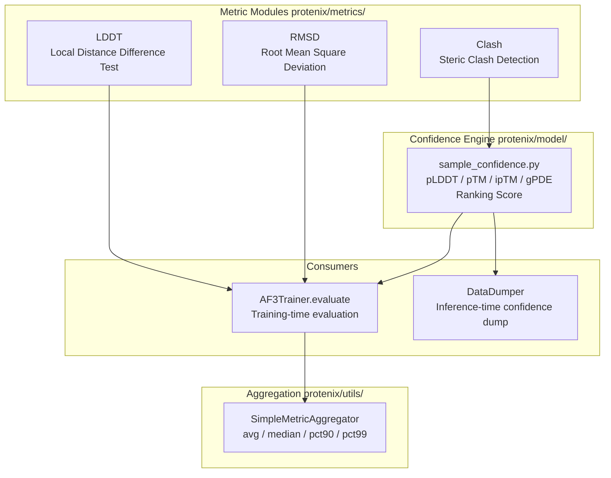
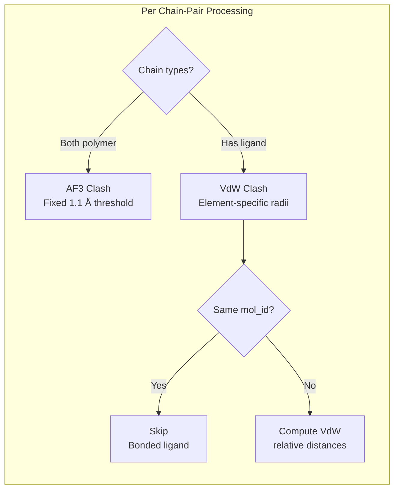
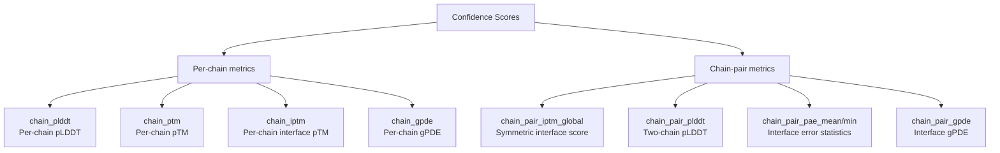

---
slug:27-metrics-evaluation
blog_type:normal
---


Protenix 提供了一个全面的度量评估框架，贯穿结构预测的整个生命周期——从**训练时的损失计算**到**推理时的置信度评分**，再到**预测后的质量评估**。该系统在多个尺度上评估预测的 3D 生物分子结构：原子级准确度（lDDT, RMSD）、复合物级置信度（pTM, ipTM, gPDE）以及结构有效性（空间位阻冲突）。本页面将深入剖析度量子系统的架构、各项指标的数学基础，以及在训练和推理过程中将它们串联起来的编排逻辑。

## 架构概述

度量系统被组织为三个层级：**独立指标模块**（lDDT, RMSD, Clash）、**置信度计算引擎**（sample_confidence），以及**指标聚合工具**（SimpleMetricAggregator）。这些组件同时被训练运行器和推理运行器所调用，但在各自的上下文中发挥着截然不同的作用。



这里关键的设计理念在于：**lDDT、RMSD 和 Clash 是依赖于真实值的指标**——它们需要参考坐标；而**置信度评分（pLDDT, pTM, ipTM, gPDE）则是自评估的**，由模型自身的预测头生成，无需真实值。在训练期间，这两类指标都会被计算；而在推理期间，仅能获取自评估的置信度评分。

来源：[lddt_metrics.py](/protenix/metrics/lddt_metrics.py#L36-L51), [sample_confidence.py](/protenix/model/sample_confidence.py#L93-L200), [metrics.py](/protenix/utils/metrics.py#L16-L75), [train.py](/runner/train.py#L40-L45)

---

## LDDT: Local Distance Difference Test

**lDDT** 指标通过比较定义半径内的原子间距离保持程度，来衡量预测坐标的局部结构保真度。与全局叠加指标不同，lDDT 在构建上具有**平移和旋转不变性**——它纯粹基于成对距离矩阵进行运算，这使得它非常适合评估那些刚体对齐效果不佳的柔性多链复合物。

### 数学基础

对于真实距离低于某个阈值（默认 15 Å）的每一对原子 $(l, m)$，算法会计算其距离误差，并根据四个截断区间进行评分：

$$\text{lDDT}_{lm} = \frac{1}{4}\Big[\mathbb{1}(|\Delta d| < 0.5) + \mathbb{1}(|\Delta d| < 1.0) + \mathbb{1}(|\Delta d| < 2.0) + \mathbb{1}(|\Delta d| < 4.0)\Big]$$

最终的 lDDT 是所有有效原子对的平均值：

$$\text{lDDT} = \frac{1}{|P|}\sum_{(l,m) \in P} \text{lDDT}_{lm}$$

其中，$P$ 是真实距离小于半径阈值且具有有效坐标的原子对集合。

### 稀疏实现

`LDDT` 基类实现了一种**内存高效的稀疏计算**方法，这在原子数量超过 $10^4$（在大型复合物中很常见）时至关重要。该方法并不生成密集的 $[N_{\text{atom}}, N_{\text{atom}}]$ 距离矩阵，而是仅从布尔值 `lddt_mask` 中提取非零索引，并针对稀疏子集计算距离：

```python
# Extract sparse pair indices from the mask
lddt_indices = torch.nonzero(lddt_mask, as_tuple=True)
l_index, m_index = lddt_indices[0], lddt_indices[1]
# Compute distances only for valid pairs
pred_distance_sparse = torch.linalg.vector_norm(pred_coords_l - pred_coords_m, ord=2, dim=-1)
```

`_chunk_forward` 方法进一步将样本维度划分为可配置的块（`lddt_metrics_chunk_size`），以限制在执行融合阈值比较期间的 GPU 峰值内存占用。

来源：[lddt_metrics.py](/protenix/metrics/lddt_metrics.py#L108-L165), [lddt_metrics.py](/protenix/metrics/lddt_metrics.py#L210-L279)

### 复合物级别的 lDDT 聚合

`LDDTMetrics` 包装类负责协调多个扩散样本的评估。在计算完每个样本的 lDDT 之后，它会使用多种策略来**聚合**结果，这些策略反映了 AlphaFold3 的样本选择方法论：

| 聚合器 | 选择逻辑 | 用途 |
|---|---|---|
| `best` | `x.max(dim=-1)` | 样本质量上限 |
| `worst` | `x.min(dim=-1)` | 最差情况下的质量 |
| `mean` | `x.mean(dim=-1)` | 样本平均质量 |
| `median` | 排序后的中位数元素 | 稳健的集中趋势 |
| `plddt.rank1` | 具有最高 pLDDT 的样本 | 置信度引导的选择 |
| `gpde.rank1` | 具有最低 gPDE 的样本 | 距离误差引导的选择 |
| `ranking_score.rank1` | 具有最高 ranking_score 的样本 | 综合引导的选择 |

`add_diff_metrics` 函数用于计算**差异化指标**（例如 `diff/best_worst`, `diff/best_plddt.rank1`），以量化不同排序策略下样本选择质量的波动程度——这对于诊断模型的自置信度是否与实际结构质量具有相关性非常有用。

来源：[lddt_metrics.py](/protenix/metrics/lddt_metrics.py#L44-L107)

### LDDT 掩码构建

静态方法 `compute_lddt_mask` 构建了一个布尔掩码，用于定义哪些原子对将包含在 lDDT 计算中。其核心特性是**针对核苷酸的特定阈值**：标准半径为 15 Å，而核苷酸原子则采用扩展后的 30 Å 半径，这反映了核酸结构中至关重要的长程相互作用。对角线元素会被显式置零，且不包含没有有效真实坐标的原子对。

来源：[lddt_metrics.py](/protenix/metrics/lddt_metrics.py#L251-L279)

---

## RMSD: 具有最优对齐的均方根偏差

RMSD 模块提供了三种互补的评估模式，分别处理多组分复合物中不同的评估场景。

### 基于 Kabsch 算法的核心对齐

`align_pred_to_true` 函数实现了**加权 Kabsch 算法**，旨在寻找最优的刚体变换（旋转 + 平移），从而最小化预测坐标与真实坐标之间的加权 RMSD。该算法的步骤如下：

1. 使用加权质心对两个结构进行**中心化**
2. 计算交叉协方差矩阵 $H = X_{\text{pred}}^T W X_{\text{true}}$
3. 执行 **SVD**（奇异值分解）：$H = U \Sigma V^T$
4. 构造旋转矩阵 $R = V \cdot \text{diag}(1, 1, \det(VU)) \cdot U^T$

除非指定了 `allowing_reflection=True`，否则行列式校正会防止产生非正常旋转（例如反射变换）。该函数是全部三种 RMSD 变体的基石。

来源：[rmsd.py](/protenix/metrics/rmsd.py#L53-L130)

### 三种 RMSD 模式

| 函数 | 对齐区域 | 评估区域 | 用例 |
|---|---|---|---|
| `self_aligned_rmsd` | `atom_mask` 中的所有原子 | 同对齐区域 | 标准的单分子 RMSD |
| `partially_aligned_rmsd` | `align_mask` 子集 | `atom_mask`（全部） | 对齐某一组分后评估对接的其他组分 |
| `weighted_rigid_align` | 所有由 `atom_weight` 加权的原子 | 无（返回对齐后的坐标） | 训练时的损失计算（对应 AF3 中的算法 28） |

`partially_aligned_rmsd` 对于**复合物评估**尤为重要：你可以基于链 A 的坐标对预测结果进行对齐，然后衡量链 B 的位置与真实值的契合程度，从而量化链间对接的准确度。

来源：[rmsd.py](/protenix/metrics/rmsd.py#L133-L201), [rmsd.py](/protenix/metrics/rmsd.py#L202-L262)

<CgxTip>`weighted_rigid_align` 函数封装了 `align_pred_to_true`，用于训练损失的计算流程。它通过 `stop_gradient=True`（默认值）支持梯度截断，这在作为扩散损失的目标时至关重要——对齐操作不应通过 SVD 运算反向传播梯度。</CgxTip>

---

## 空间位阻冲突检测

`Clash` 模块通过检测预测复合物中不同链之间**物理上不合理的原子重叠**来评估结构的有效性。该模块支持两种截然不同的冲突模型，分别用于不同的验证目的。

### AF3 冲突：聚合物-聚合物重叠

AF3 冲突模型采用**固定距离阈值**（默认 1.1 Å）来标记聚合物链（如蛋白质-蛋白质、蛋白质-DNA 等）之间的严重原子重叠。配体链不参与此项检查，因为小分子本身就可以合法地非常靠近聚合物链。当满足以下任一条件时，该链对将被标记为存在冲突：

- 重叠的原子对总数超过 **100**，或
- 重叠原子对数量与较小链的原子总数之比超过 **0.5**

来源：[clash.py](/protenix/metrics/clash.py#L38-L67), [clash.py](/protenix/metrics/clash.py#L243-L270)

### 范德华冲突：特定元素重叠

VdW（范德华）冲突模型利用来自 RDKit 的**特定元素范德华半径**来检测较轻微的空间位阻违规。它不使用固定的距离阈值，而是计算如下比例：

$$r_{\text{rel}} = \frac{d_{ij}}{\text{vdw}_i + \text{vdw}_j}$$

当 $r_{\text{rel}} < 0.75$（即 `vdw_clash_threshold`）时，即被标记为冲突，这意味着原子间的距离小于两者范德华半径之和的 75%。该模型专门用于**配体-聚合物**的相互作用，以评估预测的小分子构象在物理上是否合理。



来源：[clash.py](/protenix/metrics/clash.py#L140-L199), [clash.py](/protenix/metrics/clash.py#L208-L279)

### 链信息提取

`get_chain_info` 方法负责执行关键的预处理工作：它将不对称单元 ID 重新映射为连续的索引（用于处理链被过滤掉的情况），按类型（配体、蛋白质、DNA、RNA）对每条链进行分类，并且为了进行 VdW 计算，它将分子 ID 映射到链 ID，从而识别出应当被跳过的成键配体。

来源：[clash.py](/protenix/metrics/clash.py#L69-L135)

---

## 置信度评分系统

`sample_confidence.py` 模块是用于自评估质量指标的**核心编排引擎**。与上述依赖真实值的指标不同，这些评分完全由模型自身的预测头计算得出——包括 PAE（预测对齐误差）、pLDDT（预测的 lDDT）、PDE（预测距离误差）以及接触概率——这使得它们在训练和推理期间均可使用。

### 置信度指标摘要

| 指标 | 范围 | 衡量内容 | 核心公式 |
|---|---|---|---|
| **pLDDT** | [0, 100] | 每个原子的局部结构置信度 | 原子级预测 lDDT 均值 × 100 |
| **gPDE** | [0, ~20] Å | 全局预测距离误差 | 基于接触概率加权的 PDE 均值 |
| **pTM** | [0, 1] | 预测的 TM-score（全局折叠） | 参考标识符上均值 $w(d)$ 的最大值 |
| **ipTM** | [0, 1] | 界面 TM-score（链间） | 限定于跨链标识符对的 pTM |
| **ranking_score** | [−100, ~1] | 复合样本选择评分 | $0.8 \cdot \text{ipTM} + 0.2 \cdot \text{pTM} - 100 \cdot \text{has\_clash}$ |

**ranking_score** 是从多个扩散生成的预测结果中筛选最佳样本的主要机制。其公式结合了界面质量、全局质量，以及对结构性冲突的严重惩罚（−100）。

来源：[sample_confidence.py](/protenix/model/sample_confidence.py#L128-L192)

### Logits 到评分的转换

所有的置信度评分最初都是模型预测头输出的**分箱 logits**。`logits_to_score` 函数通过以下步骤将它们转换为标量数值：

1. 在各个箱上执行 **Softmax** 操作，以获取概率分布
2. 计算**期望值**：$\text{score} = \sum_b p_b \cdot c_b$，其中 $c_b$ 是箱 $b$ 的中心点

各个箱的中心点在 $[\text{min\_bin}, \text{max\_bin}]$ 范围内根据可配置的 `no_bins` 均匀计算得出。接触概率采用 8.0 Å 作为阈值——预测距离小于该值的标识符对将贡献给接触加权指标。

来源：[sample_confidence.py](/protenix/model/sample_confidence.py#L232-L285)

### TM-score 归一化

pTM 和 ipTM 均使用 **TM-score 归一化常数**：

$$d_0(N) = 1.24 \cdot (N - 15)^{1/3} - 1.8, \quad N \geq 19$$

基于每个箱的权重会将预测的对齐误差转换为类似于 TM-score 的贡献值：

$$w(d) = \frac{1}{1 + (d / d_0)^2}$$

对于 **ipTM**，计算被限定在**不同链**（`asym_id[None, :] != asym_id[:, None]`）的标识符对中，这使得该指标对链间取向的准确度尤为敏感。

来源：[sample_confidence.py](/protenix/model/sample_confidence.py#L300-L315), [sample_confidence.py](/protenix/model/sample_confidence.py#L859-L899)

### 基于链的分解

系统为所有主要指标提供了细粒度的单链及链对分解计算：



指标 `chain_pair_iptm_global` 对配体链进行了特殊处理：当链对中有一方为配体时，该对的分数等同于配体自身的链 ipTM；对于聚合物-聚合物链对，则取两条链界面分数的平均值。这种设计确保了能够从**配体的视角**来评估其结合置信度。

来源：[sample_confidence.py](/protenix/model/sample_confidence.py#L455-L549), [sample_confidence.py](/protenix/model/sample_confidence.py#L672-L780), [sample_confidence.py](/protenix/model/sample_confidence.py#L800-L870)

### 蛋白质-配体特定指标

当提供 `interested_atom_mask`（通常用于针对配体的评估）时，系统会计算以下指标：

- **pb_ranking_score**：配体链与所有其他链之间的 `chain_pair_iptm_global`，提供特定于结合的排序评分
- **pb_ranking_score_vdw_penalized**：在配体和聚合物链之间检测到任何 VdW 冲突时，应用 -100 惩罚后的 pb_ranking_score

来源：[sample_confidence.py](/protenix/model/sample_confidence.py#L192-L215)

---

## 指标聚合框架

`SimpleMetricAggregator` 类提供了一种**支持分布式感知**的机制，用于在各个训练步骤中收集和汇总指标值。它支持多种聚合策略：

| 聚合器 | 函数 | 用例 |
|---|---|---|
| `avg` | `np.mean(x)` | 集中趋势 |
| `median` | `np.median(x)` | 对异常值具有鲁棒性 |
| `pct90` | `np.percentile(x, 90)` | 高端尾部特征 |
| `pct99` | `np.percentile(x, 99)` | 极值分析 |
| `max` / `min` | `np.max(x)` / `np.min(x)` | 边界值 |

该聚合器支持两种分布式模式：`gather_before_calc=True`（在计算统计数据之前收集跨节点的所有值——结果更准确）或 `gather_before_calc=False`（先在本地计算，然后再跨节点求平均——内存效率更高）。

来源：[metrics.py](/protenix/utils/metrics.py#L16-L75)

---

## 评估链类型

度量框架支持在常量模块中定义的**细粒度评估类别**，从而能够对不同类型的相互作用进行系统性评估：

| 类别 | 描述 |
|---|---|
| `intra_ligand` / `intra_prot` / `intra_dna` / `intra_rna` | 链内结构准确度 |
| `ligand_prot` / `rna_prot` / `dna_prot` / `prot_prot` | 链间界面质量 |
| `antibody_antigen` / `antibody` | 专门的免疫复合物评估 |

通过这些类别，评估脚本能够生成按相互作用类型细分的 lDDT 和 RMSD，这对于理解模型在多种复合物架构下的行为表现至关重要。

来源：[constants.py](/protenix/data/constants.py#L17-L29)

---

## 集成：训练与推理

### 训练阶段的评估

在训练期间，`AF3Trainer` 类会引入 `LDDTMetrics` 和 `ProtenixLoss`，以对验证数据执行定期评估。该评估过程会同时计算依赖真实值的指标以及模型自身的置信度评分，从而支持对预测质量与实际质量进行相关性分析。随后，`SimpleMetricAggregator` 会收集这些数值以便记录到 W&B 中。

来源：[train.py](/runner/train.py#L40-L45)

### 推理阶段的置信度

在推理期间，`InferenceRunner.predict` 方法会以推理模式运行模型，并将置信度计算任务委托给 `DataDumper`，后者会调用 `sample_confidence.compute_full_data_and_summary` 以生成全套置信度指标。结果将按照 `ranking_score` 进行排序，并以结构化输出的形式保存。`_compute_full_data_and_summary` 函数会逐个处理每个样本，根据模型的 PAE、pLDDT 和 PDE logits 计算出 pLDDT、gPDE、pTM、ipTM 以及所有基于链的分解结果。

来源：[inference.py](/runner/inference.py#L209-L236), [sample_confidence.py](/protenix/model/sample_confidence.py#L917-L957)

<CgxTip>`compute_full_data_and_summary` 包装器是通过 for 循环按顺序处理各个样本的，而不是采用批量处理方式。这是因为链对分解逻辑使用了基于单链的张量索引，很难将其在不同链配置下向量化执行。当样本数量较大时，建议适当减小 `N_sample` 以维持合理的推理时间。</CgxTip>

---

## 损失与指标的耦合

有部分指标发挥着**双重作用**，它们既是评估标准，也是训练目标。损失模块中的 `SmoothLDDTLoss` 就是评估指标 lDDT 的可微 counterpart——它采用了 **sigmoid 平滑化**的阈值比较（而非硬指示函数），以便在反向传播过程中提供梯度信号：

$$\text{SmoothLDDT}_{lm} = \frac{1}{4}\sum_{t \in \{0.5,1,2,4\}} \sigma(t - |\Delta d_{lm}|)$$

来自 RMSD 模块的 `weighted_rigid_align` 函数也经过了类似的重新利用：它作为扩散坐标损失中的对齐步骤，实现了**AlphaFold3 中的算法 28**，为模型的结构预测提供了经过参考对齐的目标。

来源：[loss.py](/protenix/model/loss.py#L57-L100), [rmsd.py](/protenix/metrics/rmsd.py#L205-L262)

---

## 后续步骤

- 若要了解计算这些指标所在的完整训练流水线，请查阅 [Training Runner](17-training-runner)。
- 有关置信度头如何生成供置信度引擎使用的 logits 的详细信息，请参阅 [Confidence Head](11-confidence-head) 和 [Loss Functions](20-loss-functions)。
- 若要探索推理结果如何连同置信度评分一起保存输出，请查看 [Inference Runner](18-inference-runner)。