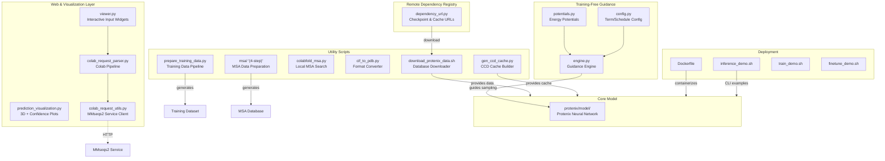
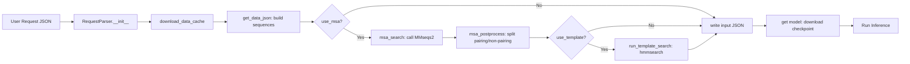
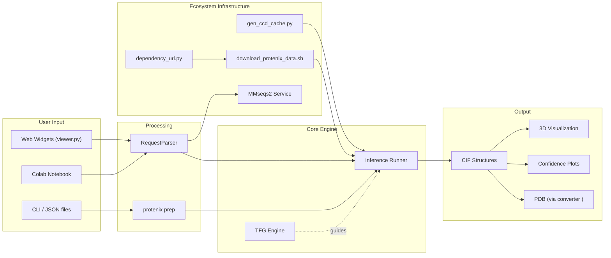

---
slug:28-protenix-ecosystem
blog_type:normal
---

Protenix 不仅仅是一个模型——它更是一个围绕该模型构建的完整生态系统，集成了部署基础设施、交互式可视化、外部搜索集成、数据准备流水线以及运行时引导引擎。本页面将梳理核心神经网络代码之外的所有组件，阐明它们之间的关联方式，并指导你如何将其应用于自身的工作流中。

<CgxTip>“生态系统”的边界被定义为连接 Protenix 内部计算与外部世界的所有要素：模型交付、交互式 UI、第三方 MSA 服务、格式转换、训练数据生成以及推理阶段的引导。</CgxTip>

## 生态系统架构一览

来源：[viewer.py](/protenix/web_service/viewer.py#L1-L616), [prediction_visualization.py](/protenix/web_service/prediction_visualization.py#L1-L372), [colab_request_parser.py](/protenix/web_service/colab_request_parser.py#L1-L534), [colab_request_utils.py](/protenix/web_service/colab_request_utils.py#L1-L337), [dependency_url.py](/protenix/web_service/dependency_url.py#L1-L37), [engine.py](/protenix/tfg/engine.py#L1-L496), [potentials.py](/protenix/tfg/potentials.py#L1-L100), [Dockerfile](/Dockerfile#L1-L34), [inference_demo.sh](/inference_demo.sh#L1-L200)

## 远程依赖注册表

所有模型检查点、CCD 组件文件以及辅助数据缓存均由集中的对象存储后端（火山引擎 TOS）提供。`dependency_url.py` 文件作为唯一事实来源——它是一个 Python 字典，负责将逻辑名称映射到可下载的 URL。

| 依赖键 | 用途 | URL 主机 |
|---|---|---|
| `protenix_base_default_v1.0.0` | 默认模型检查点 | `protenix.tos-cn-beijing.volces.com` |
| `protenix_base_20250630_v1.0.0` | 最新模型（截至 2025-06-30） | `protenix.tos-cn-beijing.volces.com` |
| `protenix-v2` | 扩展版 v2 模型 | `protenix.tos-cn-beijing.volces.com` |
| `ccd_components_file` | PDB 化学组分字典 | `protenix.tos-cn-beijing.volces.com` |
| `ccd_components_rdkit_mol_file` | 预计算的 RDKit Mol 对象 | `protenix.tos-cn-beijing.volces.com` |
| `pdb_cluster_file` | 序列 40% 一致性聚类 | `protenix.tos-cn-beijing.volces.com` |
| `esm2_t36_3B_UR50D` | ESM-2 语言模型权重 | `protenix.tos-cn-beijing.volces.com` |

`colab_request_parser.py` 中的 `RequestParser` 类会在推理期间调用此注册表：它会检查 `$PROTENIX_ROOT_DIR/checkpoint/` 和 `$PROTENIX_ROOT_DIR/common/` 路径下的本地缓存，自动下载缺失的文件，并在继续执行之前验证文件是否存在。这种设计确保了**任何部署环境（无论是本地、Docker 还是 Colab）都能仅凭 URL 注册表实现从零自举**。

来源：[dependency_url.py](/protenix/web_service/dependency_url.py#L1-L37), [colab_request_parser.py](/protenix/web_service/colab_request_parser.py#L60-L118)

## 交互式 Web 服务层

`protenix/web_service/` 目录提供了一种原生适配 Jupyter Notebook 的界面，无需编写命令行指令即可完成端到端的结构预测。该服务构建于两大支柱之上：**输入构建**和**结果可视化**。

### 输入查看器组件

`viewer.py` 模块实现了一套基于 `ipywidgets` 的 UI 系统，允许用户以交互方式构建预测请求。顶层容器是 `ProtenixInputViewer`，它由多个实体组件组合而成：

| 组件类 | 实体类型 | 核心特性 |
|---|---|---|
| `DnaRnaProteinEntityWidget` | 蛋白质 / DNA / RNA 链 | 序列输入、副本数设置、翻译后修饰（CCD 编码 + 位置）、基于字母表的序列验证 |
| `LigandSmilesEntityWidget` | 小分子配体 | SMILES 字符串输入、副本数设置 |
| `LigandIonCCDEntityWidget` | 离子 / CCD 定义的配体 | CCD 编码下拉框、副本数设置 |
| `CovalentBondsWidget` | 实体间化学键 | 左/右实体索引、原子级别的成键设定 |
| `ModelWidget` | 推理参数 | 随机种子选择、循环/步数/采样次数设置、模型版本选择 (v1–v5) |

每个组件的 `get_result()` 方法都会生成一个符合[输入 JSON 格式](4-input-json-format) 架构的字典片段。最终装配完成的 JSON 包含序列、共价键、MSA 开关、原子置信度开关以及模型参数。

<CgxTip>这些组件会执行严格的即时输入验证——蛋白质序列会依据 20 个字母的氨基酸字母表进行校验，DNA 序列会与 `{AGCTXINU}` 核对，RNA 序列则与 `{AGCUXIN}` 匹配，从而在进行任何高耗能计算之前提供即时反馈。</CgxTip>

### 预测结果可视化

`prediction_visualization.py` 模块提供了两套互补的可视化系统：

- **`PredictionLoader`**：一个加载器类，能够从预测输出目录中自动发现 `.cif` 预测文件及相关的 `.json` 置信度文件（支持 `full_data_sample` 和 `summary_confidence` 两种变体）。它使用 `biotite.structure.io.pdbx` 来解析结构。

- **`plot_3d()`**：通过 `py3Dmol` 在 Notebook 内渲染 3D 分子结构，支持彩虹着色或基于单原子 pLDDT 梯度的着色（蓝→红映射）。用户可以自由切换主链、侧链和全链的显示模式。

- **`plot_confidence_measures_from_pred()`**：为每项预测生成包含三行图表的总结：(1) 带汇总指标的逐原子 pLDDT 折线图，(2) 预测距离误差热图，以及 (3) 预测对齐误差热图。

来源：[viewer.py](/protenix/web_service/viewer.py#L1-L616), [prediction_visualization.py](/protenix/web_service/prediction_visualization.py#L22-L52), [prediction_visualization.py](/protenix/web_service/prediction_visualization.py#L215-L260)

### Colab 集成流水线

`colab_request_parser.py` 和 `colab_request_utils.py` 文件实现了一套完全兼容 Colab 的推理流水线。`RequestParser` 类负责统筹以下流程：

该系统支持**两种 MSA 模式**：`"protenix"`（批量提交至 `protenix-server.com/api/msa`）和 `"colabfold"`（通过 ColabFold MMseqs2 API 进行逐序列查询，并可为复合物提供可选的配对搜索）。`run_mmseqs2_service()` 函数处理了完整的异步逻辑：提交任务 → 轮询状态 → 下载 tar.gz 结果，并具备可配置的重试机制与超时处理。常量 `MAX_ATOM_NUM` (60,000) 和 `MAX_TOKEN_NUM` (5,000) 会在进行高耗能计算前强制限制处理规模。

来源：[colab_request_parser.py](/protenix/web_service/colab_request_parser.py#L75-L180), [colab_request_parser.py](/protenix/web_service/colab_request_parser.py#L231-L300), [colab_request_utils.py](/protenix/web_service/colab_request_utils.py#L40-L200)

## 免训练引导 (TFG) 引擎

TFG 引擎是一个运行时增强系统，它能够将**可微的几何与化学约束**应用于扩散采样过程——且完全无需重新训练模型。相关内容已在[免训练引导引擎](24-training-free-guidance-engine)中详尽说明，而在生态系统的语境下，它代表着一个扩展点，支持将基于物理的自定义势能函数与 Protenix 进行集成。

此处的生态系统核心组件是 `potentials.py` 注册系统。`@register` 装饰器会自动填充 `CLASS_REGISTRY`，支持基于配置动态构建势能项。目前已注册的势能项包括：

| 势能类 | 物理约束 | 所需特征 |
|---|---|---|
| `PairwiseDistancePotential` | 键长/键角距离边界 | `pairwise_distance_index`，边界值，`ref_element` |
| `InterchainBondPotential` | 链间空间位阻规避 | `interchain_bond_index` |
| `VinaStericPotential` | Vina 式空间冲突惩罚 | `asym_id`, `atom_to_token_idx`, `ref_element` |
| `SymmetricChainPotential` | 对称链对齐 | `symmetric_chain_index` |
| `StereoBondPotential` | 化学键立体化学 | `stereo_bond_index`, `stereo_bond_orientation` |
| `ChiralAtomPotential` | 手性中心保持 | `chiral_index`, `chiral_orientation` |
| `PlanarImproperPotential` | 异常二面角平面度 | `planar_improper_index`, `planar_improper_is_carbonyl` |
| `ExperimentalTorsionPotential` | 二面角偏好 | `experimental_torsion_index`, 力常数 |
| `LinearBondPotential` | 线性三键几何结构 | `linear_triple_bond_index` |

配置层（`config.py`）提供了带类型的 `Schedule` 对象（`Constant`、`ExponentialInterpolation`），用于控制各项势能的权重在扩散时间步中的演变方式，赋予用户精细化控制约束在采样过程中激活时机的权限。

来源：[potentials.py](/protenix/tfg/potentials.py#L1-L100), [config.py](/protenix/tfg/config.py#L74-L171), [engine.py](/protenix/tfg/engine.py#L1-L200)

## 数据准备脚本

Protenix 在 `scripts/` 目录下提供了一套脚本工具集，用于处理完整的数据生命周期：从下载原始 PDB 到生成可直接用于训练的特征张量。

### 数据库下载 (`scripts/database/download_protenix_data.sh`)

该 Shell 脚本提供了一个用于下载所有 Protenix 数据依赖的统一入口。它支持两种模式和两个数据版本：

| 模式 | 下载内容 | 适用场景 |
|---|---|---|
| `--inference_only` (默认) | `common.tar.gz`, `search_database.tar.gz` | 仅执行预测任务 |
| `--full` | 包含 `mmcif`, `mmcif_msa_template`, `rna_msa`, `posebusters`, `indices` 在内的 9 个数据归档文件 | 训练与微调 |

通过 `--version` 标志可在 `2024.05.22`（标准版）和 `2026.01.01`（运行 `protenix_base_20250630_v1.0.0` 模型的必备版本）之间进行选择，二者分别指向 TOS 存储后端上的不同基础 URL。

来源：[download_protenix_data.sh](/scripts/database/download_protenix_data.sh#L36-L134)

### CCD 缓存生成 (`scripts/gen_ccd_cache.py`)

该脚本会从 RCSB 下载原始的 `components.cif` 文件，并为每一个化学组分预计算 RDKit `Mol` 对象。它利用 `pdbeccdutils` 进行解析，并通过 `multiprocessing.Pool` 实现所有 CCD 编码处理的并行化。输出的 pickle 文件（`components.cif.rdkit_mol.pkl`）是训练和推理阶段处理配体及离子的关键依赖。该脚本会记录成功率，并妥善处理诸如空 CCD 条目（如 `UNL`）等边缘情况。

来源：[gen_ccd_cache.py](/scripts/gen_ccd_cache.py#L29-L200)

### 训练数据流水线 (`scripts/prepare_training_data.py`)

`DataPipeline.get_data_from_mmcif()` 方法会将原始的 mmCIF 文件转换为生物聚合体字典，并将其保存为压缩的 pickle 文件（`{pdb_id}.pkl.gz`）。该脚本同时支持 `WeightedPDB`（标准训练）和 `Distillation` 数据集，并采用 `joblib.Parallel` 实现多进程处理。输出的索引会被聚合到一个 CSV 文件中，供下游的训练循环使用。

来源：[prepare_training_data.py](/scripts/prepare_training_data.py#L25-L100)

### MSA 准备（四步流水线）

`scripts/msa/` 目录实现了一个多步骤的 MSA 数据库构建流水线：

| 步骤 | 脚本 | 功能 |
|---|---|---|
| 1 | `step1-get_prot_seq.py` | 使用 biotite 和 `MMCIFParser` 从 mmCIF 文件中提取蛋白质序列，并标注分子类型（蛋白质/核酸/其他）及释放日期 |
| 2 | `step2-get_msa.ipynb` | 利用 ColabFold 的 `colabsearch` 工具，基于 UniRef30 和 ColabFold 环境数据库生成 MSA |
| 3 | `step3-uniref_add_taxid.py` | 使用 NCBI 分类号 (Taxonomy ID) 对 MSA 命中结果进行标注 |
| 4 | `step4-split_msa_to_uniref_and_others.py` | 将 A3M 文件拆分为 UniRef100（用于配对）和非配对组件 |

来源：[step1-get_prot_seq.py](/scripts/msa/step1-get_prot_seq.py#L1-L100)

### 本地 ColabFold 搜索 (`scripts/colabfold_msa.py`)

对于希望在本地运行 MSA 搜索（而非通过托管 API）的用户，该脚本利用 `LocalColabFoldConfig` 数据类封装了 `colabsearch` 二进制程序。`A3MProcessor` 类负责处理将多链 A3M 文件拆分为各单链专属的 `pairing.a3m` 和 `non_pairing.a3m` 文件的复杂任务——这恰好是 Protenix 推理流水线所需的输入格式。该脚本在 ColabFold 搜索基础设施与 Protenix 特征处理之间架起了桥梁。

来源：[colabfold_msa.py](/scripts/colabfold_msa.py#L1-L200)

### 格式转换 (`scripts/cif_to_pdb.py`)

这是一个简单但不可或缺的实用工具，它利用 `biotite` 将 Protenix 输出的 CIF 格式转换为传统的 PDB 格式。该脚本能够妥善处理众所周知的 PDB 格式限制（3 字符的残基名称、1 字符的链 ID），在截断名称时会发出警告；若禁用了截断功能，则会抛出包含详细信息的错误提示。它在 Protenix 输出结果与下游要求使用 PDB 格式的工具之间架起了桥梁。

来源：[cif_to_pdb.py](/scripts/cif_to_pdb.py#L1-L83)

## 示例工作流

`examples/` 目录提供了开箱即用的输入 JSON 文件，全面涵盖了 Protenix 的各项功能：

| 示例文件 | 场景 | 实体 | 核心特性 |
|---|---|---|---|
| `example.json` | 蛋白质-DNA 复合物 + 多链蛋白质 | 蛋白质、DNA、配体 | 预计算的 MSA 目录 |
| `input.json` | 标准推理输入 | 蛋白质 | 用于 CLI 演示的基础模板 |
| `example_constraint_msa.json` | 基于约束的预测 | 蛋白质 | 逐对距离约束 |
| `example_without_msa.json` | 无 MSA 预测 | 蛋白质 | 纯序列折叠 |
| `examples_with_template/` | 模板引导折叠 | 蛋白质 + HMM 模板 | `hmmsearch.a3m`，配对/非配对 A3M |
| `examples_with_rna_msa/` | RNA 结构预测 | RNA 链 | A3M 格式的 RNA MSA |
| `example_with_json_template/` | JSON 定义的模板 | 抗体 + 抗原 | 自定义模板 JSON 规范 |
| `prot.fasta` / `dimer.fasta` | FASTA 输入 | 蛋白质单体 / 二聚体 | 仅包含序列的简单格式 |

来源：[example.json](/examples/example.json#L1-L112), [inference_demo.sh](/inference_demo.sh#L71-L200)

## Docker 部署

`Dockerfile` 提供了一个基于 `pytorch:2.7.1-cu12.6.3-py3.11-ubuntu22.04` 的可复现构建环境。关键的系统依赖包括 `hmmer`（用于模板搜索）、`kalign`（用于 RNA MSA 比对）、`postgresql` 以及各类构建工具。构建过程中会将 NVIDIA 的 CUTLASS v3.5.1 克隆到 `/opt/cutlass` 目录下，以用于内核编译。Python 依赖项则通过标准的 PyPI 镜像从 `requirements.txt` 进行安装。

该生态系统的部署流程十分直观：将 `PROTENIX_ROOT_DIR` 指向一个挂载卷，运行 `scripts/database/download_protenix_data.sh --inference_only`，然后通过 `protenix pred` CLI 或 `runner/inference.py` 脚本执行推理。三个演示用的 Shell 脚本（`inference_demo.sh`、`train_demo.sh`、`finetune_demo.sh`）为每个主要工作流提供了带有注释的示例。

来源：[Dockerfile](/Dockerfile#L1-L34), [inference_demo.sh](/inference_demo.sh#L1-L70)

## 生态系统交互总结

## 后续步骤

既然你已经对整个生态系统有了宏观认识，接下来可以深入探索特定的子系统：

- **[免训练引导引擎](24-training-free-guidance-engine)** — 深入探讨 TFG 的势能设定、调度机制以及与扩散采样器的集成方式
- **[配置系统](26-configuration-system)** — 了解如何通过统一的配置系统控制所有生态系统组件
- **[指标评估](27-metrics-evaluation)** — 理解支撑可视化层的各项置信度指标
- **[推理运行器](18-inference-runner)** — 了解负责将生态系统输入连接到模型执行的运行器
- **[输入 JSON 格式](4-input-json-format)** — 构建预测请求的完整架构参考