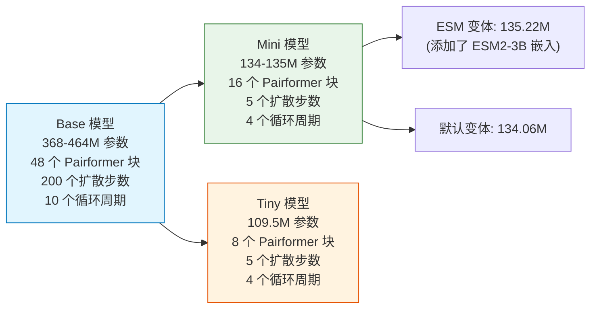
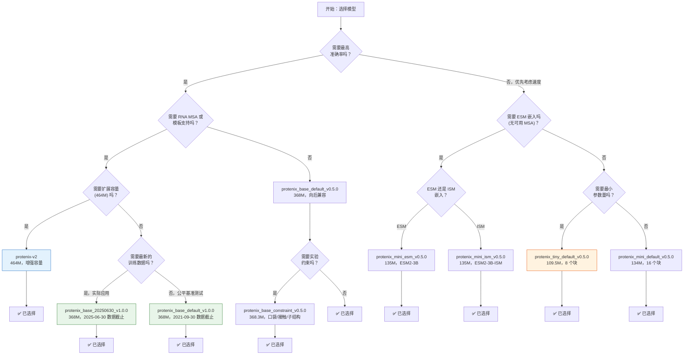

---
slug:3-model-selection-and-comparison
blog_type:normal
---


Protenix 提供了一系列不断扩展的预训练模型，涵盖了不同的参数规模、功能集和训练数据截断日期。选择合适的模型取决于你的具体任务——无论是需要为科学研究提供最高的预测准确率、为高通量筛选提供轻量化模型，还是需要诸如约束引导预测或 RNA MSA 支持等专门能力。本页全面对比了所有可用模型、架构差异，并为你提供选择合适模型的实用指南。

## 命名规则

每个 Protenix 模型名称都遵循结构化的格式：`protenix_{model_size}_{features}_{version}`。理解此命名规则可以让你一眼识别出模型的功能。

| 片段 | 有效值 | 含义 |
|:---|:---|:---|
| **model_size** | `base`, `mini`, `tiny` | 架构规模 — 控制网络块和层数 |
| **features** | `default`, `constraint`, `esm`, `ism` | 功能特性；多个功能用 `-` 分隔 |
| **version** | `v0.5.0`, `v1.0.0`, `v2` | 发布版本，反映了训练数据的截断日期和架构更新 |

<CgxTip>此命名规则的唯一例外是 **`protenix-v2`**，这个扩展容量的增强版模型使用了不带分段格式的简化名称。</CgxTip>

来源：[supported_models.md](/docs/supported_models.md#L1-L10), [configs_model_type.py](/configs/configs_model_type.py#L23-L28)

## 完整模型目录

下表汇总了所有九个受支持的模型及其功能特性和参数量。

| 模型名称 | 参数量 | ESM | MSA | 约束 | RNA MSA | 模板 | 训练截断日期 | 发布日期 |
|:---|:---:|:---:|:---:|:---:|:---:|:---:|:---:|:---:|
| **`protenix-v2`** | 464.44 M | ❌ | ✅ | ❌ | ✅ | ✅ | 2021-09-30 | 2026-04-08 |
| **`protenix_base_default_v1.0.0`** | 368.48 M | ❌ | ✅ | ❌ | ✅ | ✅ | 2021-09-30 | 2026-02-05 |
| **`protenix_base_20250630_v1.0.0`** | 368.48 M | ❌ | ✅ | ❌ | ✅ | ✅ | 2025-06-30 | 2026-02-05 |
| **`protenix_base_default_v0.5.0`** | 368.09 M | ❌ | ✅ | ❌ | ❌ | ❌ | 2021-09-30 | 2025-05-30 |
| **`protenix_base_constraint_v0.5.0`** | 368.30 M | ❌ | ✅ | ✅ | ❌ | ❌ | 2021-09-30 | 2025-07-17 |
| **`protenix_mini_esm_v0.5.0`** | 135.22 M | ✅ | ✅ | ❌ | ❌ | ❌ | 2021-09-30 | 2025-07-17 |
| **`protenix_mini_ism_v0.5.0`** | 135.22 M | ✅ | ✅ | ❌ | ❌ | ❌ | 2021-09-30 | 2025-07-17 |
| **`protenix_mini_default_v0.5.0`** | 134.06 M | ❌ | ✅ | ❌ | ❌ | ❌ | 2021-09-30 | 2025-07-17 |
| **`protenix_tiny_default_v0.5.0`** | 109.50 M | ❌ | ✅ | ❌ | ❌ | ❌ | 2021-09-30 | 2025-07-17 |

来源：[supported_models.md](/docs/supported_models.md#L19-L28), [README.md](/README.md#L81-L85)

## 不同模型规模的架构差异

三种规模的模型 — **base**、**mini** 和 **tiny** — 在核心网络模块的深度和扩散采样步数上有着根本的不同。这些差异直接转化为决定各模型层级的精度与速度权衡。

### Base 模型 (368–464 M 参数)

Base 模型采用了完整的架构深度：**48 个 Pairformer 块**、**4 个 MSA 模块块**，以及包含 **200 个扩散步数**和 **10 次循环周期**的完整扩散模块。`protenix_base_default_v1.0.0` 模型额外激活了 **2 个模板嵌入器块**，从而支持结构模板特性。`protenix-v2` 模型进一步在 Pairformer、MSA 模块、扩散模块、置信度头部和 distogram 头部中，将配对表示维度从 `c_z=128` 扩展到了 **`c_z=256`**，额外增加了约 9600 万个参数。

| 配置 | Base (v0.5.0) | Base (v1.0.0) | Protenix-v2 |
|:---|:---:|:---:|:---:|
| Pairformer 块 (`n_blocks`) | 48 | 48 | 48 |
| 配对维度 (`c_z`) | 128 | 128 | **256** |
| 模板嵌入器块 | 0 | 2 | 2 (扩展后) |
| 循环周期 (`N_cycle`) | 10 | 10 | 10 |
| 扩散步数 (`N_step`) | 200 | 200 | 200 |
| 扩散批次大小 | 48 | 48 | **64** |

来源：[configs_model_type.py](/configs/configs_model_type.py#L33-L74), [configs_base.py](/configs/configs_base.py#L129-L171)

### Mini 与 Tiny 模型 (109–135 M 参数)

Mini 和 Tiny 模型通过三种策略实现了大幅的参数缩减：将 **Pairformer 块**从 48 个减少到 16 个或 8 个，将 **MSA 模块块**从 4 个减少到 1 个，将扩散模块简化为原子编码器/解码器各 1 个块，并将扩散步数从 200 步骤直接缩减至仅 **5 步**。这使得推理速度比 Base 模型快了几个数量级，同时在许多任务中仍保持了极具竞争力的准确度。



| 配置 | Mini 默认版 | Mini ESM/ISM | Tiny 默认版 |
|:---|:---:|:---:|:---:|
| Pairformer 块 (`n_blocks`) | 16 | 16 | **8** |
| MSA 模块块 (`n_blocks`) | 1 | 1 | 1 |
| 扩散 Transformer 块 | 8 | 8 | 8 |
| 循环周期 (`N_cycle`) | 4 | 4 | 4 |
| 扩散步数 (`N_step`) | 5 | 5 | 5 |
| ESM2-3B 嵌入 | ❌ | ✅ | ❌ |
| 默认使用 MSA | ✅ | ❌ | ✅ |
| `gamma0` (噪声调度) | 0 | 0 | 0 |
| `step_scale_eta` | 1.0 | 1.0 | 1.0 |

来源：[configs_model_type.py](/configs/configs_model_type.py#L200-L317), [configs_base.py](/configs/configs_base.py#L198-L210)

<CgxTip>Mini ESM/ISM 模型的参数量更高（135.22M 对比 134.06M），因为它们包含了与 ESM2-3B 蛋白质语言模型（25 亿参数，单独加载）对接的额外嵌入层。尽管在架构上支持 MSA，但为了提高效率，这些模型默认设置为 `use_msa: False`，转而主要依赖 ESM 嵌入作为序列特征信号。</CgxTip>

## 功能特性深度解析

### 模板支持 (v1.0.0+)

模板功能允许模型在预测期间利用通过实验确定的结构同源体。这需要 **2 个模板嵌入器块**（在 v1.0.0+ 模型中配置）以及额外的预处理基础设施（`kalign`、`hmmer`）。模板支持是 `protenix-v2`、`protenix_base_default_v1.0.0` 和 `protenix_base_20250630_v1.0.0` 独有的功能。

### RNA MSA 支持 (v1.0.0+)

RNA 多序列比对使模型能够在具有正确进化上下文的情况下处理核糖核酸结构。与模板支持类似，这也仅在 v1.0.0+ 模型中提供。若要启用此功能，需在推理时添加 `--use_rna_msa true` 标志。

### 约束支持 (v0.5.0 约束模型)

约束模型引入了 **四个专用的嵌入器**，以便在推理过程中结合实验结构先验知识：

| 嵌入器 | 用途 | 默认概率 |
|:---|:---|:---:|
| **口袋嵌入器** | 结合口袋距离信息 | 0.2 |
| **接触嵌入器** | 残基级别的接触约束 | 0.1 |
| **子结构嵌入器** | 已知部分结构的坐标 | 0.5 |
| **接触原子嵌入器** | 原子级别的接触约束 | 0.1 |

约束模型基于 base 架构构建，但增加了这些嵌入器，使得参数量从 368.09M 增加到了 368.30M。在微调时，它需要设置 `load_strict: False`，因为其架构与 base 模型不同。

来源：[configs_model_type.py](/configs/configs_model_type.py#L106-L187), [supported_models.md](/docs/supported_models.md#L40-L50)

### ESM 与 ISM 的对比

这两种变体都集成了 **ESM2-3B** 蛋白质语言模型（30 亿参数）用于单序列预测。它们的区别在于嵌入类型：

- **ESM** (`protenix_mini_esm_v0.5.0`)：使用标准的 ESM2-3B 嵌入 (`esm2-3b`)
- **ISM** (`protenix_mini_ism_v0.5.0`)：使用逆向序列模型嵌入 (`esm2-3b-ism`)

两者具有完全相同的架构参数（135.22M），但加载的预训练 ESM 权重文件不同。

来源：[dependency_url.py](/protenix/web_service/dependency_url.py#L26-L32), [configs_model_type.py](/configs/configs_model_type.py#L248-L293)

## 模型选择决策指南



### 快速参考用例

| 用例 | 推荐模型 | 理由 |
|:---|:---|:---|
| **科学研究，最高精度** | `protenix-v2` | 容量最大 (464M)，准确率最高 |
| **通用的高精度预测** | `protenix_base_default_v1.0.0` | 支持模板与 RNA MSA，与 AlphaFold3 规模相当 |
| **实际/生产环境场景** | `protenix_base_20250630_v1.0.0` | 针对真实世界目标的最新训练数据截断 |
| **约束引导预测** | `protenix_base_constraint_v0.5.0` | 口袋、接触和子结构实验先验 |
| **无可用 MSA (单序列)** | `protenix_mini_esm_v0.5.0` | ESM2-3B 嵌入可替代进化信号 |
| **高通量筛选** | `protenix_mini_default_v0.5.0` | 16 个块，5 个扩散步数 — 速度快且精度合理 |
| **最低计算预算** | `protenix_tiny_default_v0.5.0` | 8 个块，参数量最少，仅 109.5M |
| **遗留兼容性 (v0.5.0 管道)** | `protenix_base_default_v0.5.0` | 为使用旧工作流的用户保留 |

来源：[supported_models.md](/docs/supported_models.md#L30-L63), [README.md](/README.md#L86-L95), [inference_demo.sh](/inference_demo.sh#L50-L60)

## 基准性能概述

Protenix 模型已在包含蛋白质-蛋白质相互作用、蛋白质-配体复合物、抗体-抗原对接及核酸结构的多个数据集上，与 AlphaFold3、Boltz-1 和 Chai-1 等领先竞品进行了基准对比。

### Protenix-v2 性能


Protenix-v2 在抗体-抗原结构预测方面表现出相较于 Protenix-v1 的大幅提升，在 DockQ > 0.23 阈值处获得了显著收益。与早期的 v1 模型相比，它在配体相关的合理性上也展现出进一步的提升。

### Protenix-v1 性能


Protenix-v1 (`protenix_base_default_v1.0.0`) 是首个在保持相同的训练数据截断日期、模型规模和推理预算的情况下，于多种基准测试集中超越 AlphaFold3 的完全开源模型。

### Protenix-v0.5.0 性能


v0.5.0 系列遵循 AF3 的推理协议（5 个种子 × 5 个扩散样本 = 25 个预测结果，并按置信度排序），与 Boltz-1 和 Chai-1 进行了基准测试。当具备实验先验条件时，约束引导模型的准确度有显著提升。Mini 和 Tiny 模型则在效率和准确度之间取得了良好的平衡。

### 可用的基准数据集

对于 v1.0.0 模型，你可以下载每次预测的详细指标和汇总报告：

| 数据集 | 描述 | 关注点 |
|:---|:---|:---|
| `PXM-2024` | 2024 年入库的结构 | 通用基准 |
| `PXM-2025` | 2025 年入库的结构 | 通用基准 |
| `PXM-2025-H2` | 2025 年下半年入库的结构 | 最新目标 |
| `PXM-22to25-Ab-Ag` | 抗体-抗原复合物 (2022-2025) | 界面预测 |
| `PXM-22to25-Ligand` | 蛋白质-配体复合物 (2022-2025) | 配体对接 |
| `PXM-Legacy` | 历史基准测试集 | 开发追踪 |
| `foldbench` | 外部 FoldBench 数据集 | 独立评估 |
| `runs-n-poses` | 多构象蛋白质-配体评估 | 配体构象多样性 |

来源：[model_1.0.0_benchmark.md](/docs/model_1.0.0_benchmark.md#L10-L25), [model_0.5.0_benchmark.md](/docs/model_0.5.0_benchmark.md#L20-L38)

## 使用不同模型运行推理

所有模型都通过相同的 CLI 接口调用 —— 只需更改 `-n` (模型名称) 标志即可。`--use_default_params true` 标志会自动为每个模型加载推荐的 `N_cycle` 和 `N_step` 值。

### Base 模型

```bash
# Protenix-v2 (增强容量)
protenix pred -i examples/input.json -o ./output \
    -n protenix-v2 --use_template true --use_default_params true

# 带有模板支持的 Protenix-v1 (推荐默认设置)
protenix pred -i examples/input.json -o ./output \
    -n protenix_base_default_v1.0.0 --use_template true --use_default_params true

# RNA MSA 推理
protenix pred -i examples/examples_with_rna_msa/example_9gmw_2.json -o ./output \
    -n protenix_base_default_v1.0.0 --use_rna_msa true --use_default_params true

# 约束引导预测
protenix pred -i examples/example_constraint_msa.json -o ./output \
    -n protenix_base_constraint_v0.5.0 --use_default_params true
```

### Mini 与 Tiny 模型

```bash
# 带有 ESM 的 Mini (单序列，无需 MSA)
protenix pred -i examples/example.json -o ./output \
    -n protenix_mini_esm_v0.5.0 --use_default_params true

# Tiny (最小，最快)
protenix pred -i examples/example.json -o ./output \
    -n protenix_tiny_default_v0.5.0 --use_default_params true
```

来源：[inference_demo.sh](/inference_demo.sh#L67-L200), [configs_inference.py](/configs/configs_inference.py#L24-L25)

## 权重自动下载

Protenix 会在首次需要时自动从其 CDN 下载模型权重。每个模型都映射到一个特定的权重 URL。依赖 ESM 的模型（`mini_esm`、`mini_ism`）还会额外下载 ESM2-3B 语言模型的权重。所有权重都存储在由 `load_checkpoint_dir` 指定的目录中（默认为：`$PROTENIX_ROOT_DIR/checkpoint`）。

| 模型 | 权重文件 | 额外下载项 |
|:---|:---|:---|
| `protenix-v2` | `protenix-v2.pt` | — |
| `protenix_base_default_v1.0.0` | `protenix_base_default_v1.0.0.pt` | — |
| `protenix_base_20250630_v1.0.0` | `protenix_base_20250630_v1.0.0.pt` | — |
| `protenix_base_default_v0.5.0` | `protenix_base_default_v0.5.0.pt` | — |
| `protenix_base_constraint_v0.5.0` | `protenix_base_constraint_v0.5.0.pt` | ESM2-3B |
| `protenix_mini_esm_v0.5.0` | `protenix_mini_esm_v0.5.0.pt` | ESM2-3B |
| `protenix_mini_ism_v0.5.0` | `protenix_mini_ism_v0.5.0.pt` | ESM2-3B-ISM |
| `protenix_mini_default_v0.5.0` | `protenix_mini_default_v0.5.0.pt` | — |
| `protenix_tiny_default_v0.5.0` | `protenix_tiny_default_v0.5.0.pt` | — |

来源：[dependency_url.py](/protenix/web_service/dependency_url.py#L18-L37), [inference.py](/runner/inference.py#L134-L156)

## 版本演进一览

| 版本 | 关键里程碑 | 新增特性 |
|:---|:---|:---|
| **v0.5.0** (2025-01) | 初版 AlphaFold3 复现 | MSA，base/mini/tiny 不同规模 |
| **v0.5.0+** (2025-07) | 约束与 ESM 模型 | 口袋/接触/子结构约束，集成 ESM2-3B |
| **v1.0.0** (2026-02) | 首个超越 AlphaFold3 的模型 | 支持模板、RNA MSA，2025-06-30 数据截断变体 |
| **v2** (2026-04) | 增强容量的规模扩展 | `c_z` 128→256，增加约 96M 参数，改进了抗体-抗原及配体准确率 |

来源：[README.md](/README.md#L48-L67), [version.py](/protenix/version.py#L16)

## 后续阅读建议

现在你已经了解了模型概况，接下来自然可以探索以下内容：

- **[快速入门](2-quick-start)** — 在几分钟内完成你的首次预测
- **[输入 JSON 格式](4-input-json-format)** — 了解如何构建你的输入数据，包括约束条件和模板
- **[架构概览](8-architecture-overview)** — 深入了解 Pairformer、扩散模块和置信度头部的内部结构
- **[推理运行器](18-inference-runner)** — 理解完整的推理流程和 CLI 选项
- **[配置系统](26-configuration-system)** — 掌握支持特定模型覆盖的分层配置架构